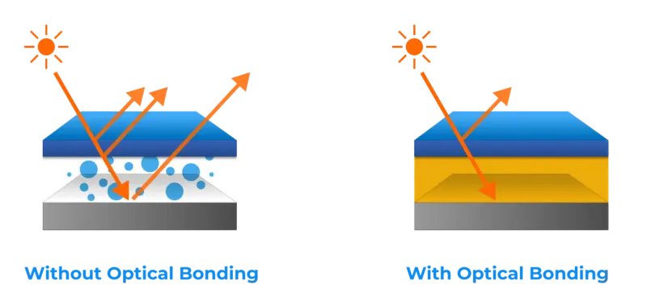
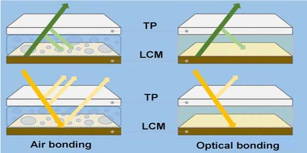

# Air Bonding vs Optical Bonding for Displays

!!! abstract "Quick answer"
    This guide explains air bonding vs optical bonding, the relevant design trade-offs, and the points engineers should verify when selecting a display solution.

## Key Takeaways

- Learn air bonding vs optical bonding, key trade-offs, applications, and engineering selection criteria.
- Use the guidance below to compare the relevant technologies and design trade-offs.
- Validate optical, electrical, mechanical, environmental, and production requirements before final selection.

## Air Bonding

Air bonding uses adhesive tape (normally double-sided adhesive) to bond the touch panel to the LCM along the sides of the outer frame. This leaves an air gap between the layers, so the method is also called frame bonding.

### Advantages

<figure markdown="span" class="displaywiki-figure">
  [{ width="760" loading="lazy" }](air-vs-optical-bonding-advantages.jpeg){ .displaywiki-image-link title="Open full-size image" }
  <figcaption>Advantages</figcaption>
</figure>

- Mature process and stable yield

- Simple process and low cost

- Simpler rework and repair

### Limitations

- The air gap between TP and LCM increases the reflection and lowers the transmittance of light, therefore degrading the display performance.

- The air gap gives room for dirt and dust particles to enter.

- The structure is relatively thick

## Optical Bonding

Optical bonding uses an optically clear adhesive to laminate the cover glass to the TFT LCD panel. This process, optical bonding eliminates the air gap that traditional LCD displays have in them using an optical grade adhesive.

<figure markdown="span" class="displaywiki-figure">
  [{ width="760" loading="lazy" }](air-vs-optical-bonding-optical-bonding.jpeg){ .displaywiki-image-link title="Open full-size image" }
  <figcaption>Optical Bonding</figcaption>
</figure>

This adhesive reduces the amount of reflection between the glass and LCD panel as well as the reflection of external ambient light. Doing this helps provide a clearer image with an increased contrast ratio, or the difference in the light intensity of the brightest white pixel color and darkest black pixel color.

<figure markdown="span" class="displaywiki-figure">
  [{ width="760" loading="lazy" }](air-vs-optical-bonding-air-bonding-vs-optical-bonding-for-displays-diagram-3.png){ .displaywiki-image-link title="Open full-size image" }
</figure>

With this contrast ratio improvement, optical bonding addresses the root issue with unreadable outdoor displays: the contrast. Though an increase in brightness can improve contrast, by fixing the contrast itself, LCD display images in outdoor environments will not be as washed out and will require less power consumption.

<figure markdown="span" class="displaywiki-figure">
  [{ width="760" loading="lazy" }](air-vs-optical-bonding-air-bonding-vs-optical-bonding-for-displays-diagram-4.png){ .displaywiki-image-link title="Open full-size image" }
</figure>

Besides the visual display advantages that optical bonding provides, this adhesive improves the display in several other ways:

1. The first being durability, optical bonding eliminates the air gap within the device and replaces it with a hardened adhesive that can act as a shock absorber.

2. Touch screens with optical bonding gain, accuracy in where the point of contact is between the touch and screen. What is known as parallax, the refraction angle of light, can make it seem that the point of contact and the actual point on the display are different. When the adhesive is used, this refraction is minimized, if not reduced.

3. The optical bonding adhesive’s elimination of the air gap also protects the LCD from moisture/fogging and dust, as there is no space for impurities to penetrate and remain under the glass layer. This especially helps with maintaining the state of LCDs in transport, storage, and humid environments.

**The optical bonding of LCD consists of three main stages:**

Preparation stage – first we need to select appropriate optical clear adhesive and take care of surface decontamination.

Glue dispensing / OCA adhere – here we apply the optically clear adhesive on the whole display surface.

Bonding and curing – touch panel is carefully layered onto the LCD, avoiding any gaps or bubbles. Then the adhesive hardens with UV light.

## Air Bonding vs. Optical Bonding

<figure markdown="span" class="displaywiki-figure">
  [{ width="760" loading="lazy" }](air-vs-optical-bonding-light-transmittance-and-reflection-through-air-bonding-and-optical-bon.jpeg){ .displaywiki-image-link title="Open full-size image" }
  <figcaption>Light transmittance and reflection through air bonding and optical bonding</figcaption>
</figure>

<figure markdown="span" class="displaywiki-figure">
  [{ width="760" loading="lazy" }](air-vs-optical-bonding-display-on-status-sun-readable.jpeg){ .displaywiki-image-link title="Open full-size image" }
  <figcaption> Display OFF Status: All Black </figcaption>
</figure>

|  | Air Bonding | Optical Bonding |
| --- | --- | --- |
| Light Reflection | High | Low |
| Light Transmittance | Average | Higher |
| Moisture Prevention | Average | Excellent |
| Dust Protection | Average | Excellent |
| Display Effect | Average | Good |
| Structural Strength | Average | Strong |
| Cost | Average | Higher |

## How to Choose

In light of choosing the applicable bonding method for your touch display, we could share our project experience for your consideration:

From the display and touch performance, optical bonding is better than air bonding regardless of the cost.

However, air bonding is a feasible option given its mature technology.

In our project experience, most of the projects using capacitive touchscreen choose the optical bonding, while projects using resistive touch panels, some of them have specific requests to apply the optical bonding.

Currently, both technologies are common, the selection depends on the specific requirements and budget of the project.

VIEWE can provide both bonding technologies for touch display as per your request, feel free to contact us for more information.

## Related reading

- [Capacitive vs Resistive Touchscreens](touch-panel-types.md)
- [GF, GFF, GG, and PG Capacitive Touch Structures](capacitive-touch-structures.md)
- [Glove Touch, Waterproof Touch, and Interference Resistance](glove-waterproof-touch.md)

!!! info "Can't find what you need?"    
    If you need more products, resources or support, please contact our team:  

    [**:material-archive-arrow-down: Knowledge Base**](../../knowledge/tags.md){ .md-button .md-button--primary } 
    [**:material-magnify: Products & Solutions**](https://viewedisplay.com/touch-solution/){ .md-button }
    [**:material-email: Contact Support**](mailto:support@viewedisplay.com){ .md-button }