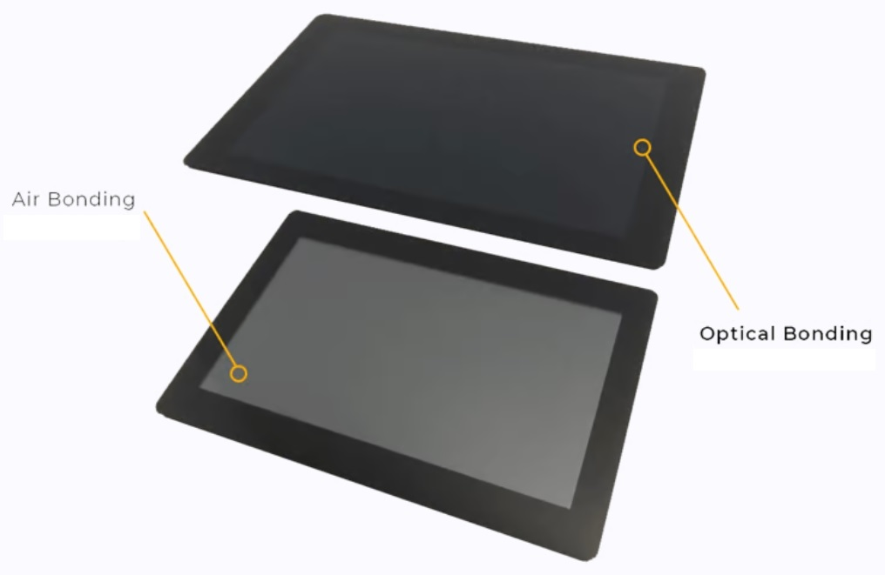

# Air Bonding vs Optical Bonding for Displays

!!! abstract "Quick answer"
    The only difference between air bonding and optical bonding (full lamination) is the layer between the touch panel and the LCD module: air bonding fixes the two with edge double-sided tape and keeps an air gap, which makes the process simple, low cost, and easy to rework; optical bonding bonds the two layers completely with an OCA adhesive and eliminates the air layer, bringing higher transmittance and lower reflection — the key to sunlight readability — at a higher cost and with harder rework. Most capacitive touch projects choose optical bonding first.

## Key Takeaways

- Air bonding keeps an air gap between the TP and the LCM, which is the root cause of increased reflection, dust ingress, and a thicker stack.
- Optical bonding uses an OCA adhesive to bond the touch panel or cover lens to the display over the full area, eliminating the air layer.
- Once the air layer is gone, reflection paths shrink sharply, transmittance and contrast improve, and outdoor readability gets markedly better.
- Optical bonding also adds dust and moisture protection and higher structural strength; the price is higher cost, a more complex process, and harder rework.

## 1. Two Bonding Methods

How the display and the touch panel (or cover lens) are connected directly determines the optical performance and the reliability. The industry mainly uses two methods: air bonding and optical bonding.

### 1.1 Air Bonding

Air bonding uses adhesive tape (normally double-sided adhesive) along the four sides of the display's outer frame to bond the touch panel to the LCM (LCD module), leaving an air gap between the two layers — which is why it is also called air-gap bonding.

<figure markdown="span" class="displaywiki-figure">
  [{ width="760" loading="lazy" }](air-vs-optical-bonding-advantages.jpeg){ .displaywiki-image-link title="Open full-size image" }
  <figcaption>Air bonding cross-section: an air gap is kept between the touch panel (TP) and the LCD module (LCM), and the two are fixed only by edge double-sided adhesive — the origin of the name "air bonding".</figcaption>
</figure>

**Advantages**

- Mature process and stable yield
- Simple process and low cost
- Simple rework (repair) flow

**Limitations**

- The air gap between the TP and the LCM increases reflection and lowers light transmittance, degrading the display performance.
- The air gap gives dust and particles a path to enter.
- The overall structure is relatively thick.

### 1.2 Optical Bonding

Optical bonding uses an OCA (optically clear adhesive) to bond the touch panel (or cover lens) to the display over the full area, so it is also called full lamination. It removes the air layer that exists in a traditional air-bonded structure.

<figure markdown="span" class="displaywiki-figure">
  [{ width="760" loading="lazy" }](air-vs-optical-bonding-optical-bonding.jpeg){ .displaywiki-image-link title="Open full-size image" }
  <figcaption>Optical bonding cross-section: the gap between the TP and the LCM is fully filled by the optical adhesive, the air layer is eliminated, and the abrupt refraction change at the interfaces disappears.</figcaption>
</figure>

This bonding method reduces the reflection between the glass and the LCD panel as well as the reflection of external ambient light, which improves transmittance and contrast.

<figure markdown="span" class="displaywiki-figure">
  [{ width="760" loading="lazy" }](air-vs-optical-bonding-air-bonding-vs-optical-bonding-for-displays-diagram-3.png){ .displaywiki-image-link title="Open full-size image" }
  <figcaption>Optical path comparison: on the left, the air gap lets ambient light reflect and scatter repeatedly between interfaces, so less light reaches the panel; on the right, optical bonding removes the air layer, reflection paths are markedly shorter, and light loss is smaller.</figcaption>
</figure>

It is exactly this improvement in contrast that makes optical bonding the key means of making outdoor displays readable in sunlight.

<figure markdown="span" class="displaywiki-figure">
  [{ width="760" loading="lazy" }](air-vs-optical-bonding-air-bonding-vs-optical-bonding-for-displays-diagram-4.png){ .displaywiki-image-link title="Open full-size image" }
  <figcaption>Real appearance under strong ambient light: the plain LCD on the left washes out as surface reflection lowers contrast, while the optically bonded LCD on the right keeps its color saturation and contrast, which is what solves sunlight readability.</figcaption>
</figure>

Beyond the optical gains, optical bonding brings two practical benefits:

1. **Improved durability**: with the internal air gap removed, dust and moisture can hardly get in, and the LCD is protected from humidity, fogging, and dust.
2. **Suitable for In-Cell panels**: full optical bonding is especially suitable for displays with an In-Cell structure.

**The three main stages of LCD optical bonding**

1. Select a suitable optical-grade OCA adhesive and laminate it over the entire display surface.
2. Bonding and curing: carefully layer the touch panel onto the LCD, avoiding any gaps or bubbles.
3. Debubbling: use a high-pressure autoclave process to remove any bubbles left after bonding.

## 2. Air Bonding vs. Optical Bonding

<figure markdown="span" class="displaywiki-figure">
  [{ width="760" loading="lazy" }](air-vs-optical-bonding-light-transmittance-and-reflection-through-air-bonding-and-optical-bon.jpeg){ .displaywiki-image-link title="Open full-size image" }
  <figcaption>How air bonding and optical bonding differ in light transmittance and reflection: the multiple reflections at the air-layer interfaces on the left are eliminated by the continuous optical medium on the right.</figcaption>
</figure>

The difference in the finished device is just as intuitive:

<figure markdown="span" class="displaywiki-figure">
  [{ width="760" loading="lazy" }](air-vs-optical-bonding-display-on-status-sun-readable.jpeg){ .displaywiki-image-link title="Open full-size image" }
  <figcaption>Appearance comparison of finished devices: the air-bonded unit on top reflects ambient light through the air gap, so the screen looks grayish with bright edges when off; the optically bonded unit below shows a uniform, deeper black with a cleaner transition between the cover lens and the active area.</figcaption>
</figure>

| Item | Air Bonding | Optical Bonding |
|---|---|---|
| Light Reflection | High | Low |
| Light Transmittance | Average | Higher |
| Moisture Prevention | Average | Excellent |
| Dust Protection | Average | Excellent |
| Display Effect | Average | Good |
| Structural Strength | Average | Strong |
| Cost | Average | Higher |
| Rework Difficulty | Simple | Difficult |

## 3. How to Choose

From the display and touch performance point of view, optical bonding is clearly better than air bonding; from a cost point of view, air bonding is a workable trade-off. In our project practice, most projects that use capacitive touch screens ended up choosing optical bonding.

Both technologies are widely used today; the choice depends on the project's specific requirements for optical performance, reliability, stack thickness, and budget. VIEWE can provide both air-bonded and optically bonded solutions.

## 4. Frequently Asked Questions

??? question "Q1: What is the most fundamental difference between air bonding and optical bonding?"
    The difference lies only in the layer between the touch panel and the LCD module. Air bonding fixes the two with edge double-sided tape and keeps an air gap in between; optical bonding bonds the two layers over the full area with an OCA adhesive, so the air layer is completely removed. Whether the air layer exists directly determines reflection, transmittance, dust-ingress risk, and structural thickness.

??? question "Q2: Why does optical bonding improve sunlight readability?"
    Because the refractive index difference between air and glass is large, ambient light reflects strongly at the air-layer interfaces and drowns out the light emitted by the screen itself. Optical bonding fills the gap with an adhesive whose refractive index is close to that of glass, removing the abrupt interface change; reflection paths shrink sharply, contrast improves, and the image no longer washes out under strong ambient light.

??? question "Q3: Is air bonding really easier to rework than optical bonding?"
    Yes. Air bonding relies only on edge tape, so the risk of damaging the TP or the LCM during disassembly is low. Optical bonding is a full-area bond; disassembly requires specialized cutting and cleaning processes, and the residual OCA adhesive is hard to remove, which usually means the TP or the LCM is scrapped — so rework costs much more.

??? question "Q4: What is the difference between OCA and OCR?"
    Both are optical adhesives; they differ in form and process. OCA is a solid optical adhesive film that is die-cut to size and laminated in a vacuum — a stable process with uniform thickness, suited to standardized production lines. OCR is a liquid optical adhesive that is dispensed and then cured; it adapts better to curved or irregular borders but is harder to control. Choose according to the display shape and production volume.

??? question "Q5: When is air bonding the better choice?"
    Air bonding suits projects that are budget-sensitive, have modest optical requirements, or need frequent rework and repair. It also fits small pilot runs or designs that must keep the assembly separable. If the application has no strong ambient light and no dust or water requirements, the drawbacks of air bonding will barely show.

??? question "Q6: Does optical bonding improve structural strength?"
    Yes. After full-area bonding, the touch panel and the LCD module form a single load-bearing structure with better impact and bending resistance than an edge-fixed air-bonded stack. Optical bonding is therefore also a plus for device designs that need higher mechanical reliability.

## Related reading

- [Capacitive vs Resistive Touch Screens](touch-panel-types.md)
- [GF, GFF, GG, and PG Capacitive Touch Structures](capacitive-touch-structures.md)
- [Glove Touch, Waterproof Touch, and Interference Resistance](glove-waterproof-touch.md)

!!! info "Can't find what you need?"
    If you need more products, resources or support, please contact our team:

    [**:material-archive-arrow-down: Knowledge Base**](../../knowledge/tags.md){ .md-button .md-button--primary }
    [**:material-magnify: Products & Solutions**](https://viewedisplay.com/){ .md-button }
    [**:material-email: Contact Support**](mailto:support@viewedisplay.com){ .md-button }
