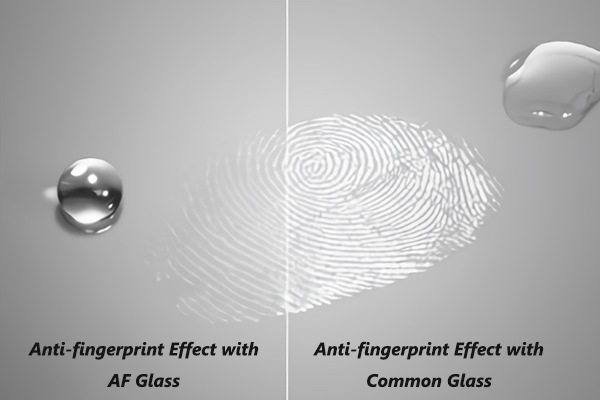
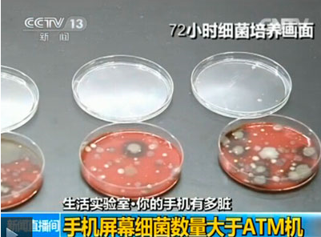
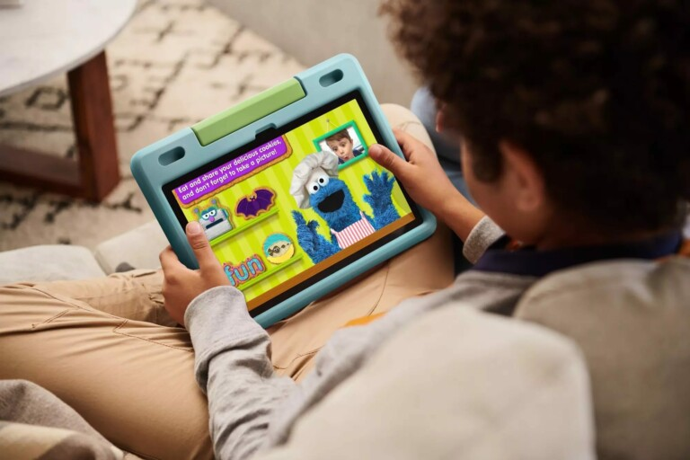
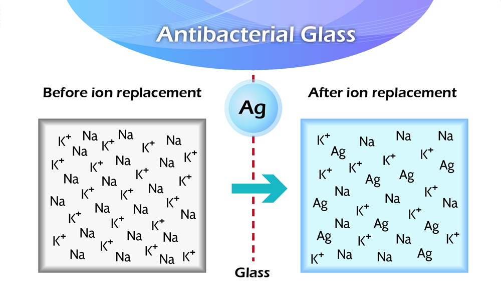
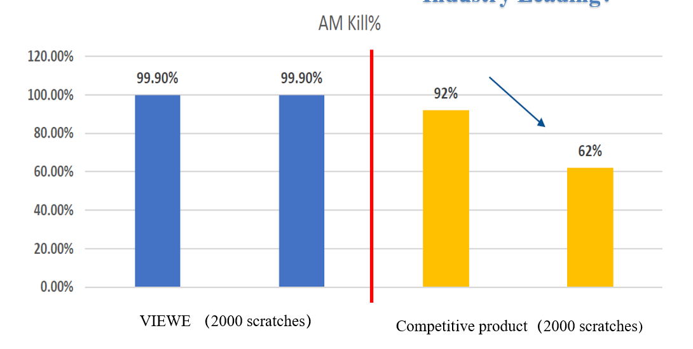

# Anti-Fingerprint and Antibacterial Cover-Lens Treatments

!!! abstract "Quick answer"
    This guide explains anti-fingerprint and antibacterial glass, the relevant design trade-offs, and the points engineers should verify when selecting a display solution.

## Key Takeaways

- Learn anti-fingerprint and antibacterial glass, key trade-offs, applications, and engineering selection criteria.
- Use the guidance below to compare the relevant technologies and design trade-offs.
- Validate optical, electrical, mechanical, environmental, and production requirements before final selection.

## AF: Anti-Fingerprint

The Role of AF (Anti-Fingerprint) Technology

Anti-Fingerprint (AF) technology aims to minimize the presence of fingerprints, smudges, and other contaminants on the cover glass surface, ensuring that devices remain clean and visually appealing during use. The primary roles of AF technology include:

Reducing Fingerprint Residue: AF coatings effectively reduce the adherence of fingerprints on the glass surface, keeping the screen clean and maintaining a pristine appearance.

Ease of Cleaning: AF coatings possess hydrophobic and oleophobic properties, making it easier to wipe off smudges and fingerprints, thereby keeping the screen clear and transparent.

Enhancing Durability: AF coatings not only minimize fingerprint residue but also enhance surface durability, preventing scratches and wear from daily use, thus extending the device's lifespan.

Improving User Experience: By reducing fingerprints and smudges, AF coatings provide users with a cleaner and clearer screen, enhancing the overall visual experience and reducing the need for frequent cleaning.

<figure markdown="span" class="displaywiki-figure">
  [{ width="760" loading="lazy" }](anti-fingerprint-antibacterial-the-advantages-of-af-anti-fingerprint-technology.jpeg){ .displaywiki-image-link title="Open full-size image" }
  <figcaption>The Advantages of AF (Anti-Fingerprint) Technology</figcaption>
</figure>

Applying AF technology to cover glass offers several advantages, enhancing the user experience and maintenance convenience:

Improved Device Appearance: AF coatings make the screen surface smoother and cleaner, maintaining a premium appearance, especially for high-end electronic products, highlighting their refined and high-quality design.

Reduced Maintenance Costs: Since AF coatings make screens easier to clean, users do not need to clean and maintain their screens as frequently, reducing maintenance costs and time.

Extended Device Lifespan: AF coatings effectively prevent scratches and wear, protecting the screen surface and ensuring that the device remains in good condition for longer periods.

Enhanced User Satisfaction: A clean, fingerprint-free screen surface provides better visual quality and a more enjoyable user experience, increasing overall satisfaction with the device.

<figure markdown="span" class="displaywiki-figure">
  [{ width="760" loading="lazy" }](anti-fingerprint-antibacterial-processes-and-techniques-for-implementing-af-anti-fingerprint-technolo.png){ .displaywiki-image-link title="Open full-size image" }
  <figcaption>Processes and Techniques for Implementing AF (Anti-Fingerprint) Technology</figcaption>
</figure>

Implementing AF coatings involves various processes and techniques, primarily including:

Surface Preparation: Before applying AF coatings, the glass surface must be cleaned and pre-treated to ensure it is dust-free, oil-free, and moisture-free. This typically includes processes like ultrasonic cleaning and plasma cleaning.

Sol-Gel Method: One common AF coating method is the sol-gel process. This method involves creating a thin organic or inorganic polymer film on the glass surface through chemical reactions, providing hydrophobic and oleophobic properties.

Vacuum Deposition: Vacuum deposition techniques, including Physical Vapor Deposition (PVD) and Chemical Vapor Deposition (CVD), involve depositing coating materials in atomic or molecular form onto the glass surface in a vacuum environment, forming a thin film with anti-fingerprint properties.

Spray Coating: Spray coating techniques involve evenly spraying the anti-fingerprint coating onto the glass surface. This process requires careful control of the coating's uniformity and thickness to ensure effectiveness.

UV Curing: Some AF coating materials require UV curing to achieve optimal performance. UV curing enhances the coating's adhesion and durability, improving anti-fingerprint effectiveness.

Key Steps in Implementing AF (Anti-Fingerprint) Technology

Substrate Preparation: Select suitable glass or plastic substrates and perform cleaning treatments to ensure a dust-free, oil-free, and moisture-free surface.

Coating Application: Depending on the specific application requirements, choose the appropriate coating process (such as sol-gel, vacuum deposition, spray coating, etc.) and uniformly apply the anti-fingerprint coating material to the substrate surface.

Curing and Hardening: For some coating materials, curing and hardening processes are necessary after application. These processes may include heat treatment, UV curing, or other chemical reactions, depending on the type of coating used.

Quality Control: Use optical microscopy, contact angle measurement, and other methods to inspect the uniformity, adhesion, durability, and anti-fingerprint effectiveness of the coating, ensuring it meets design specifications.

Final Inspection and Packaging: Conduct a thorough inspection to ensure there are no defects. The treated glass is then carefully packaged to prevent damage during transportation and storage.

## Conclusion

The application of AF (Anti-Fingerprint) technology in cover glass significantly reduces fingerprint and smudge residue, enhancing the appearance and user experience of devices. Through various processes and techniques such as sol-gel, vacuum deposition, spray coating, and UV curing, high-quality anti-fingerprint coatings are achieved. This not only boosts the market competitiveness of devices but also offers multiple advantages, including reduced maintenance costs and extended device lifespan. In the future, as technology continues to advance, the performance and application fields of AF coatings will further expand, providing superior user experiences for more display devices.

## AB: Anti-Bacteria

The Role of Anti-Bacteria Cover Glass

Anti-Bacteria cover glass is designed to inhibit the growth and spread of bacteria, viruses, and other microorganisms on the surface of electronic devices. The primary roles of Anti-Bacteria cover glass include:

Reducing Microbial Contamination: By incorporating Anti-Bacteria agents into the glass, the growth of harmful microorganisms is significantly reduced. This helps maintain a cleaner surface, particularly in high-touch areas such as Smartphones, tablets, and public kiosks.

Enhancing Hygiene: Anti-Bacteria cover glass contributes to better hygiene by minimizing the risk of microbial transmission through touch. This is particularly important in environments such as hospitals, schools, and public transportation, where cleanliness is paramount.

Providing Long-lasting Protection: The Anti-Bacteria properties of the cover glass are designed to be long-lasting, providing continuous protection against microbial contamination throughout the lifespan of the device.

Improving User Confidence: Knowing that their devices are protected against harmful microorganisms can give users peace of mind, especially in the context of global health concerns like pandemics.

<figure markdown="span" class="displaywiki-figure">
  [{ width="760" loading="lazy" }](anti-fingerprint-antibacterial-the-advantages-of-anti-bacteria-cover-glass.jpeg){ .displaywiki-image-link title="Open full-size image" }
  <figcaption>The Advantages of Anti-Bacteria Cover Glass</figcaption>
</figure>

<figure markdown="span" class="displaywiki-figure">
  [{ width="760" loading="lazy" }](anti-fingerprint-antibacterial-the-advantages-of-anti-bacteria-cover-glass.png){ .displaywiki-image-link title="Open full-size image" }
  <figcaption>The Advantages of Anti-Bacteria Cover Glass</figcaption>
</figure>

<figure markdown="span" class="displaywiki-figure">
  [{ width="760" loading="lazy" }](anti-fingerprint-antibacterial-the-advantages-of-anti-bacteria-cover-glass-2.jpeg){ .displaywiki-image-link title="Open full-size image" }
  <figcaption>The Advantages of Anti-Bacteria Cover Glass</figcaption>
</figure>

The application of Anti-Bacteria technology in cover glass offers several advantages, enhancing both the user experience and the safety of electronic devices:

Health and Safety: Anti-Bacteria cover glass helps prevent the spread of infectious diseases by reducing the presence of bacteria and viruses on frequently touched surfaces. This is particularly beneficial in healthcare settings and public spaces.

Reduced Cleaning Frequency: With Anti-Bacteria properties, devices require less frequent cleaning, which can save time and effort for users. This is especially useful for large-scale deployments of devices in public or professional environments.

Enhanced Device Longevity: Anti-Bacteria coatings can also protect against surface degradation caused by microbial growth, extending the lifespan of the device's cover glass.

Market Differentiation: Incorporating Anti-Bacteria technology can differentiate a product in a competitive market, appealing to health-conscious consumers and industries with strict hygiene requirements.

<figure markdown="span" class="displaywiki-figure">
  [{ width="760" loading="lazy" }](anti-fingerprint-antibacterial-processes-and-techniques-for-implementing-anti-bacteria-cover-glass.jpeg){ .displaywiki-image-link title="Open full-size image" }
  <figcaption>Processes and Techniques for Implementing Anti-Bacteria Cover Glass</figcaption>
</figure>

<figure markdown="span" class="displaywiki-figure">
  [{ width="760" loading="lazy" }](anti-fingerprint-antibacterial-processes-and-techniques-for-implementing-anti-bacteria-cover-glass-2.jpeg){ .displaywiki-image-link title="Open full-size image" }
  <figcaption>Processes and Techniques for Implementing Anti-Bacteria Cover Glass</figcaption>
</figure>

Implementing Anti-Bacteria properties in cover glass involves various processes and techniques, including:

Incorporation of Anti-Bacteria Agents: Anti-Bacteria agents, such as silver ions, copper, or zinc, can be incorporated into the glass during the manufacturing process. These agents disrupt the cellular functions of microorganisms, preventing their growth and reproduction.

Surface Coatings: Anti-Bacteria properties can also be achieved by applying a coating to the surface of the glass. These coatings are typically infused with Anti-Bacteria agents that provide a protective barrier against microbes.

Ion Exchange Process: This process involves replacing sodium ions in the glass with Anti-Bacteria ions (e.g., silver ions) through a chemical bath. This ion exchange process enhances the Anti-Bacteria properties of the glass.

Sol-Gel Process: The sol-gel process involves creating a colloidal suspension (sol) that transitions into a gel-like network (gel). Anti-Bacteria agents are incorporated into the sol, which is then applied to the glass surface and cured to form a durable Anti-Bacteria coating.

Plasma Treatment: Plasma treatment can be used to enhance the adhesion of Anti-Bacteria coatings to the glass surface. This process involves exposing the glass to plasma, which modifies its surface properties and improves the bonding of the Anti-Bacteria coating.

VIEWE Antibacterial Solutions:

When bacteria or germs touch the surface of the product, the silver ions on the product surface will contact the cell membrane of the bacteria or germs. The silver ions will undergo a biochemical reaction with the protease of the cell membrane, resulting in biological inactivation. During the reaction of the two, silver ions will quickly and effectively destroy bacteria and germs; afterward, silver ions will be released from dead bacteria and germs, and then continue to carry out repeated biochemical reactions to other contacting live bacteria and germs until the bacteria and the germs are eliminated. The effect of silver ions is a long-term bactericide with a long-lasting effect.

<figure markdown="span" class="displaywiki-figure">
  [{ width="760" loading="lazy" }](anti-fingerprint-antibacterial-viewe-antibacterial-solutions.jpeg){ .displaywiki-image-link title="Open full-size image" }
  <figcaption>VIEWE Antibacterial Solutions</figcaption>
</figure>

VIEWE launches related antibacterial series products, which will retain antibacterial effect after long-term use. The biological test results show that it is effective in inhibiting Escherichia coli and Staphylococcus aureus, and the antibacterial effect reaches more than 99%, and the antibacterial ability won’t decrease as time goes by.

<figure markdown="span" class="displaywiki-figure">
  [{ width="760" loading="lazy" }](anti-fingerprint-antibacterial-anti-fingerprint-and-antibacterial-cover-lens-treatments-diagram-9.jpeg){ .displaywiki-image-link title="Open full-size image" }
</figure>

It is formed by using high-temperature ion exchange method to exchange and combine silver ions with other ions in glass. As shown, the antibacterial effect of the antibacterial glass is very good. At the same time, its optical characteristics and surface scratch resistance both have excellent performance. For product portfolio, design considerations can be integrated with cover glass.

<figure markdown="span" class="displaywiki-figure">
  [{ width="760" loading="lazy" }](anti-fingerprint-antibacterial-99-kill-rate-at-broad-range-of-bacteria-jisz-and-iso-test.jpeg){ .displaywiki-image-link title="Open full-size image" }
  <figcaption>>99% kill rate at broad range of bacteria (JISZ and ISO test)</figcaption>
</figure>

<figure markdown="span" class="displaywiki-figure">
  [{ width="760" loading="lazy" }](anti-fingerprint-antibacterial-99-kill-rate-at-broad-range-of-bacteria-jisz-and-iso-test.png){ .displaywiki-image-link title="Open full-size image" }
  <figcaption>>99% kill rate at broad range of bacteria (JISZ and ISO test)</figcaption>
</figure>

<figure markdown="span" class="displaywiki-figure">
  [{ width="760" loading="lazy" }](anti-fingerprint-antibacterial-conclusion.png){ .displaywiki-image-link title="Open full-size image" }
  <figcaption>Conclusion</figcaption>
</figure>

Anti-Bacteria cover glass plays a crucial role in enhancing the hygiene and safety of electronic devices by inhibiting the growth of harmful microorganisms. Through VIEWE anti-bacteria solutions, high-quality Anti-Bacteria cover glass can be produced. This technology not only provides health and safety benefits but also offers advantages such as reduced cleaning frequency, enhanced device longevity, and market differentiation. As the demand for hygienic and safe electronic devices continues to grow, the implementation and development of Anti-Bacteria cover glass will further expand, offering superior protection and peace of mind for users in various environments.

## Related reading

- [Display Cover Lens Materials, Thickness, and Treatments](cover-lens-materials-treatments.md)
- [Anti-Reflective vs Anti-Glare Display Treatments](anti-reflective-vs-anti-glare.md)
- [Cover Lens Customization for Display Products](cover-lens-customization.md)
