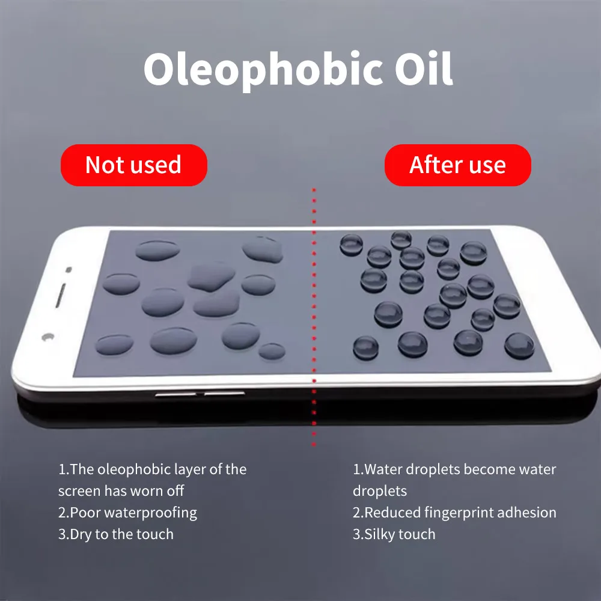
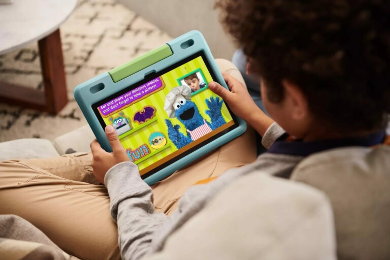
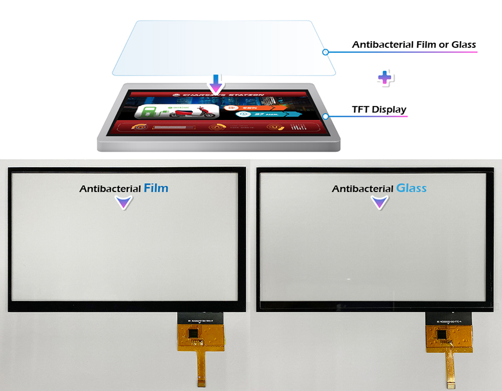
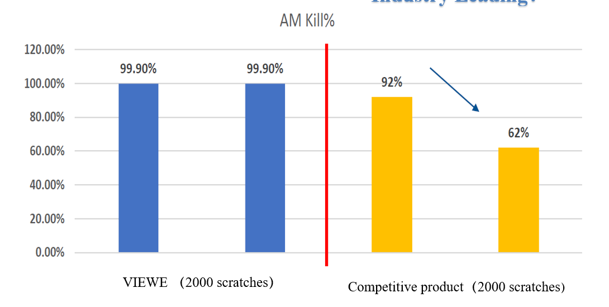

# Anti-Fingerprint and Antibacterial Cover-Lens Treatments

!!! abstract "Quick answer"
    Beyond transmitting light and protecting the display module, a cover lens can carry two functional surface treatments: anti-fingerprint (AF) treatment uses an oleophobic, hydrophobic coating to reduce fingerprint and smudge adhesion so the screen stays clean and is easier to wipe; antibacterial treatment uses agents such as silver ions to inhibit microbial growth on the surface. The two process routes are independent and can be stacked. Choosing between them means weighing the use scenario, abrasion life, and cost together.

## Key Takeaways

- At its core, an AF (anti-fingerprint) coating is a thin oleophobic, hydrophobic film that lowers the adhesion of fingerprints and oils while giving the surface a smooth feel.
- AF coatings can be applied by sol-gel, vacuum deposition (PVD / CVD), spray coating, or UV curing; durability differs from process to process.
- Antibacterial cover lenses inhibit microorganisms with agents such as silver ions, through two routes: an antibacterial film or agent-doped glass.
- Antibacterial performance must be validated with standard tests (such as the JISZ and ISO methods), and the kill rate retained after abrasion matters more than the initial figure.

## 1. Two Functional Surface Treatments for the Cover Lens

The cover lens is the interface the user touches directly. Besides transmitting light, resisting wear, and protecting the display module, it can gain two additional functions through surface treatment: anti-fingerprint (AF), which solves the "the screen is always covered in fingerprints" problem, and antibacterial treatment, which solves the "microorganisms breed on high-touch surfaces" problem. The two targets differ, and their process routes are independent as well.

## 2. Anti-Fingerprint (AF) Treatment

### 2.1 Role

AF technology aims to minimize the presence of fingerprints, smudges, and other contaminants on the cover-lens surface, so the device stays clean and visually appealing during use. The primary roles include:

- **Less fingerprint residue**: the coating effectively lowers the surface's adhesion to fingerprint oils, keeping the screen clean and true to its original look.
- **Ease of cleaning**: the coating is hydrophobic and oleophobic, so smudges and fingerprints wipe off more easily and the screen stays clear and transparent.
- **Enhanced durability**: while reducing fingerprints, the coating also improves surface wear resistance, holding up against everyday scratches and wear and extending the device's lifespan.
- **Better user experience**: a cleaner, clearer screen improves the overall visual experience and reduces the need for frequent cleaning.

<figure markdown="span" class="displaywiki-figure">
  [{ width="760" loading="lazy" }](anti-fingerprint-antibacterial-the-advantages-of-af-anti-fingerprint-technology.jpeg){ .displaywiki-image-link title="Open full-size image" }
  <figcaption>AF glass vs. ordinary glass: on the left, AF glass — water stays in a round bead and no fingerprints remain; on the right, ordinary glass — water spreads into a film and fingerprint marks are clearly visible.</figcaption>
</figure>

### 2.2 Benefits of AF Technology

- **Improved appearance**: the surface is smoother and cleaner, which is especially visible on high-end electronic products.
- **Lower maintenance cost**: the screen is easier to clean, so users do not need to maintain it as often, saving time and consumables.
- **Longer device life**: the coating effectively resists scratches and wear, protecting the screen surface.
- **Higher user satisfaction**: a clean, fingerprint-free surface delivers better visual quality.

### 2.3 Processes and Techniques

Implementing an AF coating involves several processes and techniques:

- **Surface preparation**: before coating, the glass surface must be cleaned and pre-treated so it is dust-free, oil-free, and moisture-free — typically by ultrasonic cleaning and plasma cleaning.
- **Sol-gel method**: a chemical reaction forms a thin organic or inorganic polymer film on the glass surface, giving it hydrophobic and oleophobic properties.
- **Vacuum deposition**: physical vapor deposition (PVD) and chemical vapor deposition (CVD) deposit the coating material onto the glass atom by atom or molecule by molecule in a vacuum, forming a thin film with anti-fingerprint properties.
- **Spray coating**: the anti-fingerprint coating is sprayed evenly onto the glass; uniformity and thickness must be tightly controlled to keep the coating effective.
- **UV curing**: some AF coating materials need UV curing to reach optimal performance; UV curing strengthens the coating's adhesion and durability.

### 2.4 Key Implementation Steps

1. **Substrate preparation**: select a suitable glass or plastic substrate and clean it so the surface is dust-free, oil-free, and moisture-free.
2. **Coating application**: choose the right process for the application (sol-gel, vacuum deposition, spray coating, etc.) and apply the anti-fingerprint coating evenly to the substrate.
3. **Curing and hardening**: some coatings must be cured and hardened after application — by heat treatment, UV hardening, or other chemical reactions, depending on the coating type.
4. **Quality control**: use optical microscopy, contact-angle measurement, and other methods to check the coating's uniformity, adhesion, durability, and anti-fingerprint effect against the design specification.
5. **Final inspection and packaging**: carry out a thorough inspection to make sure there are no defects before packaging.

<figure markdown="span" class="displaywiki-figure">
  [{ width="760" loading="lazy" }](anti-fingerprint-antibacterial-processes-and-techniques-for-implementing-af-anti-fingerprint-technolo.png){ .displaywiki-image-link title="Open full-size image" }
  <figcaption>What an oleophobic coating does: on the left, a worn-out coating — water spreads out, water repellency is poor, and the surface feels dry; on the right, an intact coating — water beads up, fingerprints attach less, and the touch feels smooth. This is also the intuitive test of whether an AF coating has failed.</figcaption>
</figure>

**In short**: applying AF technology to a cover lens significantly reduces fingerprint and smudge residue and improves both appearance and user experience. Sol-gel, vacuum deposition, spray coating, and UV curing each have their own scope, and real-world solutions often combine them.

## 3. Antibacterial Treatment

### 3.1 Role

An antibacterial cover lens is designed to inhibit the growth and spread of bacteria, viruses, and other microorganisms on the surface of electronic devices. The primary roles include:

- **Less microbial contamination**: incorporating antibacterial agents into the glass significantly reduces the growth of harmful microorganisms — critical for high-touch products such as smartphones, tablets, and public kiosks.
- **Better hygiene**: lowering the risk of microbes spreading by touch promotes hygiene, which matters most in hospitals, schools, and public transportation.
- **Long-lasting protection**: the antibacterial property lasts through the device's service life, continuously suppressing microbial contamination.
- **Greater user confidence**: against the backdrop of frequent public-health events, users can feel more at ease about the hygiene of the device surface.

<figure markdown="span" class="displaywiki-figure">
  [{ width="760" loading="lazy" }](anti-fingerprint-antibacterial-the-advantages-of-anti-bacteria-cover-glass.jpeg){ .displaywiki-image-link title="Open full-size image" }
  <figcaption>Common disease-causing bacteria on phone surfaces: Escherichia coli, Staphylococcus aureus, Bacillus cereus, Clostridium perfringens, fecal streptococci and enterococci, Pseudomonas aeruginosa, and more.</figcaption>
</figure>

<figure markdown="span" class="displaywiki-figure">
  [{ width="760" loading="lazy" }](anti-fingerprint-antibacterial-the-advantages-of-anti-bacteria-cover-glass.png){ .displaywiki-image-link title="Open full-size image" }
  <figcaption>A media bacteria-culture experiment on phone screens: after 72 hours of culture, the phone screen carried more bacteria than an ATM keypad. High-touch surfaces that are hard to clean often are exactly the target scenario for antibacterial cover lenses.</figcaption>
</figure>

<figure markdown="span" class="displaywiki-figure">
  [{ width="760" loading="lazy" }](anti-fingerprint-antibacterial-the-advantages-of-anti-bacteria-cover-glass-2.jpeg){ .displaywiki-image-link title="Open full-size image" }
  <figcaption>Contact risk in the home: infants and young children often hold devices against their faces or even put them in their mouths, which raises the hygiene bar for high-touch surfaces.</figcaption>
</figure>

<figure markdown="span" class="displaywiki-figure">
  [{ width="760" loading="lazy" }](anti-fingerprint-antibacterial-processes-and-techniques-for-implementing-anti-bacteria-cover-glass-2.jpeg){ .displaywiki-image-link title="Open full-size image" }
  <figcaption>Education and entertainment: children touch a tablet's screen long and heavily, so antibacterial treatment lowers the risk of contact transmission.</figcaption>
</figure>

### 3.2 Benefits of Antibacterial Technology

- **Health and safety**: fewer bacteria and viruses on frequently touched surfaces help prevent the spread of infectious diseases.
- **Less frequent cleaning**: with antibacterial properties, the device needs cleaning less often, saving time and effort.
- **Longer device life**: antibacterial treatment slows surface degradation caused by microbial growth and extends the life of the cover lens.
- **Market differentiation**: in a competitive market it becomes a selling point, attracting health-conscious customers and industries with strict hygiene requirements.

### 3.3 Implementation Processes

Several process routes can give a cover lens antibacterial properties:

- **Antibacterial agent incorporation**: during manufacturing, agents such as silver ions and copper are introduced into the glass. They disrupt the cellular functions of microorganisms, stopping their growth and reproduction.
- **Surface coating**: a coating containing antibacterial agents is applied to the glass surface, forming a barrier that suppresses microorganisms.
- **Ion exchange**: a chemical bath replaces ions in the glass with antibacterial ions (for example, silver ions).
- **Sol-gel**: the sol-gel process first forms a sol, then turns it into a gel network. The antibacterial agent is added to the sol, applied to the glass, and cured into a durable antibacterial coating.
- **Plasma treatment**: plasma treatment modifies the glass surface so antibacterial coatings bond to it more strongly.

<figure markdown="span" class="displaywiki-figure">
  [{ width="760" loading="lazy" }](anti-fingerprint-antibacterial-processes-and-techniques-for-implementing-anti-bacteria-cover-glass.jpeg){ .displaywiki-image-link title="Open full-size image" }
  <figcaption>Where antibacterial cover lenses are used: medical and nursing equipment, public transport fare gates, industrial control panels, and personal consumer products. These scenarios share one trait — the surface is touched by many people at high frequency and is hard to clean often.</figcaption>
</figure>

### 3.4 Silver-Ion Antibacterial Mechanism

Among antibacterial agents, the silver ion has the most typical mechanism of action. When bacteria touch the product surface, the silver ions in the glass contact the bacteria's cell membrane:

<figure markdown="span" class="displaywiki-figure">
  [{ width="760" loading="lazy" }](anti-fingerprint-antibacterial-viewe-antibacterial-solutions.jpeg){ .displaywiki-image-link title="Open full-size image" }
  <figcaption>Silver-ion antibacterial mechanism: silver ions (Ag⁺) bind to the bacteria's proteases and destroy the cell membrane structure, so the cell contents leak out and the bacterium dies. When the reaction ends, the silver ions are released again and can act on other bacteria, which is why the effect lasts.</figcaption>
</figure>

Silver ions destroy the structure of bacteria and other microorganisms quickly and effectively during the reaction; once the reaction is complete, they are released from the dead bacteria and go on to react with live bacteria that contact the surface later. This makes silver ions a long-acting bactericide with a lasting effect.

<figure markdown="span" class="displaywiki-figure">
  [{ width="760" loading="lazy" }](anti-fingerprint-antibacterial-anti-fingerprint-and-antibacterial-cover-lens-treatments-diagram-9.jpeg){ .displaywiki-image-link title="Open full-size image" }
  <figcaption>Ion exchange for antibacterial glass: in a high-temperature chemical bath, silver ions are placed into the glass network and replace the original sodium (Na) and potassium (K) ions. Because the antibacterial agent is bonded inside the glass body, it is not easily worn off and the effect lasts.</figcaption>
</figure>

## 4. VIEWE Antibacterial Solutions

The VIEWE antibacterial solution uses a high-temperature ion-exchange method to exchange silver ions into the glass and bond them there. The solution keeps a strong antibacterial effect while also delivering excellent optical characteristics and surface scratch resistance, and it can be combined with other cover-lens design elements (thickness, surface treatments, shape).

<figure markdown="span" class="displaywiki-figure">
  [{ width="760" loading="lazy" }](anti-fingerprint-antibacterial-99-kill-rate-at-broad-range-of-bacteria-jisz-and-iso-test.jpeg){ .displaywiki-image-link title="Open full-size image" }
  <figcaption>Two forms of antibacterial cover lens: on top, the stack-up — an antibacterial film or antibacterial glass laminated with a TFT display; below, a side-by-side comparison — an antibacterial film (attached as a film) on the left and antibacterial glass (agent doped into the glass body) on the right. Both carry an FPC and can be integrated with the module directly.</figcaption>
</figure>

After long-term use, the VIEWE antibacterial series still retains its antibacterial effect. Biological test results show a significant inhibitory effect on Escherichia coli and Staphylococcus aureus, with an antibacterial rate above 99% that does not decline over time.

<figure markdown="span" class="displaywiki-figure">
  [{ width="760" loading="lazy" }](anti-fingerprint-antibacterial-99-kill-rate-at-broad-range-of-bacteria-jisz-and-iso-test.png){ .displaywiki-image-link title="Open full-size image" }
  <figcaption>Antibacterial performance test data (JISZ method): kill rates against Acinetobacter baumannii, Enterobacter aerogenes, Escherichia coli, Klebsiella pneumoniae, Pseudomonas aeruginosa, Salmonella typhimurium, Shigella dysenteriae, Staphylococcus aureus, Streptococcus pyogenes, Vibrio cholerae, and more are mostly above 99.9%, with vancomycin-resistant Enterococcus (VRE) at 98.08%.</figcaption>
</figure>

What deserves even more attention is the durability of the antibacterial effect: whether the cover lens keeps its kill rate after abrasion determines whether the effect can cover the full service life of the device.

<figure markdown="span" class="displaywiki-figure">
  [{ width="760" loading="lazy" }](anti-fingerprint-antibacterial-conclusion.png){ .displaywiki-image-link title="Open full-size image" }
  <figcaption>Abrasion comparison: after 2000 abrasion cycles, the VIEWE antibacterial cover lens still holds a 99.90% antibacterial rate, while competing products drop to 92% and 62%. Whether the antibacterial effect "lives in the glass" directly determines its lifetime performance.</figcaption>
</figure>

## 5. Combination and Selection Guidelines

**Combination**: AF and antibacterial treatments target different problems and can be stacked — apply the antibacterial treatment first (agent-doped glass or an antibacterial film), then the AF surface coating, so the cover lens is both easy to clean and antibacterial. Note that the AF coating sits on the outermost layer, so its abrasion life is usually shorter than the antibacterial property built into the glass body.

**Selection guidelines**

- **Set the scenario priority first**: public self-service kiosks and medical devices put antibacterial performance first; handheld and touch-intensive products put AF feel and cleanability first.
- **Tell the two antibacterial forms apart**: antibacterial glass (agent doped into the body) is more durable but costs more; an antibacterial film (attached) costs less and can be retrofitted, but its film lifetime and edge treatment need extra evaluation.
- **Check the antibacterial spectrum and test standard**: confirm the target organisms are covered by the test, and ask for reports under standard methods such as JISZ / ISO.
- **Watch the post-abrasion performance**: ask for the antibacterial rate after abrasion testing (a specified number of cycles), not just the initial value.
- **Confirm optical and mechanical impact**: the coating or film must not noticeably affect transmittance, haze, or surface hardness.
- **Assess process compatibility**: when stacking several surface treatments (AR, AG, AF, antibacterial), confirm the process order and how they interact.

## 6. Frequently Asked Questions

??? question "Q1: How long does an AF coating last, and will it wear out?"
    An AF coating is a thin film on the outermost layer of the cover lens, so it wears down gradually with daily friction and the oleophobic effect declines — water no longer beads, fingerprints attach more easily, and the surface feels less smooth. Durability depends on the process (vacuum deposition usually outlasts spray coating) and on how heavily the device is used. For long product cycles, leave room in the mechanical design to replace the cover lens.

??? question "Q2: What is the difference between AF and AG?"
    AF (anti-fingerprint) is an oleophobic, hydrophobic coating that keeps fingerprints and oils from attaching, makes them easy to wipe off, and gives a smooth touch. AG (anti-glare) is a surface micro-structure treatment that breaks specular reflection into diffuse reflection to remove harsh glare spots. The two goals differ, and they are often combined: AG handles glare while the AF coating handles fingerprints.

??? question "Q3: For an antibacterial cover lens, is a film or doped glass better?"
    It depends on the durability requirement. Doping the glass body (ion exchange) bonds the antibacterial agent into the glass network, so it is not easily worn off and retains its kill rate better after abrasion — suited to long-life products that are cleaned often. An antibacterial film costs less and can be retrofitted, but the film's lifetime and edge reliability need extra evaluation.

??? question "Q4: How is the durability of the antibacterial effect verified?"
    Do not judge by the initial kill rate alone. Look at two kinds of data: kill rates against different organisms under standard methods such as JISZ / ISO, and how well the kill rate is retained after a specified number of abrasion cycles or a defined durability test. Only together do they show whether the antibacterial effect can cover the full service life of the device.

??? question "Q5: Is silver-ion antibacterial treatment safe?"
    Silver ions are bonded inside the glass body — a non-leaching design that disrupts microbial cell function through contact rather than releasing large amounts into the environment. For cover lenses that stay in long-term contact with the human body, confirm the product meets the material-safety requirements of the target region and review the supplier's safety and compliance documentation.

??? question "Q6: Which devices need an antibacterial cover lens?"
    Consider two categories first: devices touched by many people at high frequency that are hard to clean often, such as public self-service kiosks, transit fare gates, and medical equipment panels; and products in close contact with children or patients, such as tablets and patient-monitoring devices. Personal consumer devices can also adopt it as a differentiating feature.

## Related reading

- [Display Cover Lens Materials, Thickness, and Treatments](cover-lens-materials-treatments.md)
- [Anti-Reflective vs Anti-Glare Display Treatments](anti-reflective-vs-anti-glare.md)
- [Cover Lens Customization for Display Products](cover-lens-customization.md)

!!! info "Can't find what you need?"
    If you need more products, resources or support, please contact our team:

    [**:material-archive-arrow-down: Knowledge Base**](../../knowledge/tags.md){ .md-button .md-button--primary }
    [**:material-magnify: Products & Solutions**](https://viewedisplay.com/){ .md-button }
    [**:material-email: Contact Support**](mailto:support@viewedisplay.com){ .md-button }
