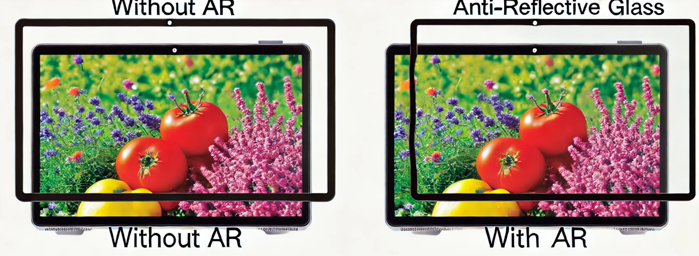
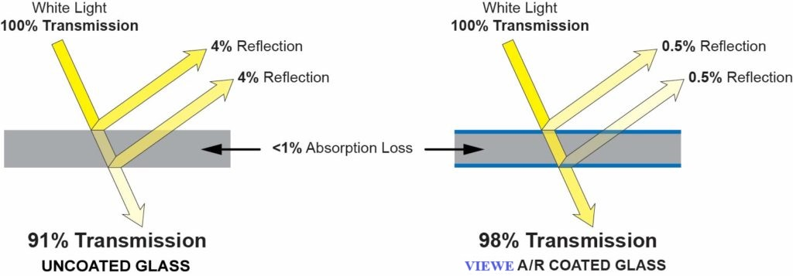
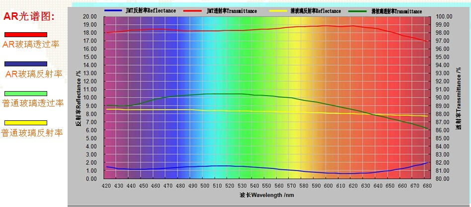
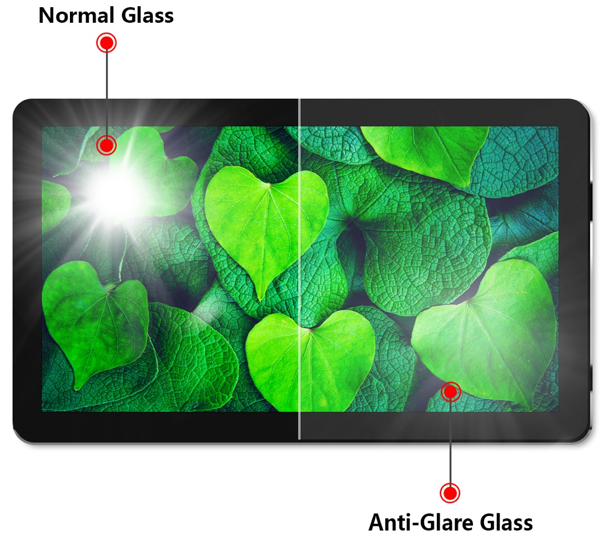

# Anti-Reflective vs Anti-Glare Display Treatments

!!! abstract "Quick answer"
    This guide explains anti-reflective vs anti-glare, the relevant design trade-offs, and the points engineers should verify when selecting a display solution.

## Key Takeaways

- Learn anti-reflective vs anti-glare, key trade-offs, applications, and engineering selection criteria.
- Use the guidance below to compare the relevant technologies and design trade-offs.
- Validate optical, electrical, mechanical, environmental, and production requirements before final selection.

## Surface Treatment Solutions

### AR: Anti-Reflective

The Role and Advantages of AR (Anti-Reflective) Technology in Cover Glass

The Role of AR (Anti-Reflective) Technology

Anti-Reflective (AR) technology primarily works by reducing the reflection of light on the surface of the cover glass, thereby enhancing light transmission and improving display performance. The key roles of AR technology include:

Reducing Reflection: In standard glass or display cover glass, incident light reflects off the surface, causing light loss and glare, which negatively impacts visual quality. AR technology applies multiple thin film layers on the cover glass surface, significantly reducing reflection and increasing light transmission.

Improving Contrast: By reducing reflections, the contrast of the display under strong light conditions is greatly improved, resulting in clearer, sharper images with more vibrant colors.

Minimizing Glare: AR technology can reduce surface glare effects, especially in environments with direct sunlight or strong lighting, enhancing user visual comfort and reducing eye strain.

Enhancing Color Accuracy: By minimizing unnecessary reflective light, the screen displays more realistic colors with higher color accuracy, significantly improving image quality.

<figure markdown="span" class="displaywiki-figure">
  [{ width="760" loading="lazy" }](anti-reflective-vs-anti-glare-anti-reflective-vs-anti-glare-display-treatments-diagram-1.png){ .displaywiki-image-link title="Open full-size image" }
</figure>

<figure markdown="span" class="displaywiki-figure">
  [{ width="760" loading="lazy" }](anti-reflective-vs-anti-glare-the-advantages-of-ar-anti-reflective-technology.jpeg){ .displaywiki-image-link title="Open full-size image" }
  <figcaption>The Advantages of AR (Anti-Reflective) Technology</figcaption>
</figure>

The application of AR technology in cover glass not only improves display performance but also offers several advantages:

Enhanced User Experience: AR technology significantly improves screen visibility under various lighting conditions, allowing users to see screen content clearly without being affected by reflections or glare, thereby enhancing the overall user experience.

Energy Efficiency: Increased light transmission means the screen can achieve the same brightness with less energy, extending battery life, which is particularly important for portable devices such as Smartphones and tablets.

Increased Product Competitiveness: In the highly competitive display device market, products with AR technology offer superior display performance, boosting market competitiveness and user satisfaction.

Extended Device Lifespan: The AR coating also serves as a protective layer, reducing damage to the screen from the external environment, thereby extending the lifespan of the device.

<figure markdown="span" class="displaywiki-figure">
  [{ width="760" loading="lazy" }](anti-reflective-vs-anti-glare-processes-and-techniques-for-implementing-ar-anti-reflective-technolog.jpeg){ .displaywiki-image-link title="Open full-size image" }
  <figcaption>Processes and Techniques for Implementing AR (Anti-Reflective) Technology</figcaption>
</figure>

The implementation of AR coatings involves various processes and techniques, primarily including:

Multilayer Thin Film Design: AR coatings typically consist of multiple layers of optical thin films, each with precisely calculated and designed thickness and material selection to achieve optimal anti-reflective performance. Common materials include silicon dioxide (SiO2), aluminum oxide (Al2O3), zinc oxide (ZnO), and others.

Vacuum Deposition Technology: In a vacuum environment, physical vapor deposition (PVD) or chemical vapor deposition (CVD) techniques are used to deposit thin film materials in atomic or molecular form onto the surface of glass or plastic substrates. These thin films stack together to form the desired anti-reflective coating.

Sputtering Technology: Sputtering is a common thin film deposition method where high-energy particles bombard the target material, causing target atoms to dislodge and deposit onto the substrate surface, forming a thin film. Sputtering can achieve high-quality, uniform coatings with precise thickness control.

Nanoimprint Technology: Nanoimprint technology can create micro or nanoscale structures on the substrate surface, altering the light propagation path to achieve anti-reflective effects. Nanoimprint technology is characterized by high precision and efficiency, making it suitable for large-scale production.

Ion Beam Assisted Deposition: This technique combines ion beams with physical vapor deposition, improving the density and adhesion of thin films, and enhancing the optical and mechanical properties of the coating.

<figure markdown="span" class="displaywiki-figure">
  [{ width="760" loading="lazy" }](anti-reflective-vs-anti-glare-ar-cover-lens-with-higher-transmittance-red-curve-lower-reflectance-bl.jpeg){ .displaywiki-image-link title="Open full-size image" }
  <figcaption>AR cover lens with higher transmittance (red curve), lower reflectance (blue curve)</figcaption>
</figure>

## Conclusion

The application of AR (anti-reflective) technology in cover glass can significantly reduce light reflection, enhance display performance, and improve user experience. Through multilayer thin film design, vacuum deposition, sputtering, nanoimprint, and other techniques, high-quality anti-reflective coatings can be achieved. This not only boosts product market competitiveness but also provides multiple benefits such as energy efficiency and protection. With continuous technological advancements, the performance and application fields of AR coatings will further expand, bringing superior visual experiences to more display devices.

### AG: Anti-Glare

The Role of AG (Anti-Glare) Technology

Anti-Glare (AG) technology is designed to diffuse light that hits the surface of the cover glass, reducing the intensity of reflected light and thus minimizing glare. This results in a display that is easier to view under various lighting conditions, including bright sunlight. The key roles of AG technology include:

Reducing Glare: AG technology scatters light that strikes the surface, which significantly reduces the sharp reflections that can cause glare. This makes screens more comfortable to look at and reduces eye strain, especially in bright environments.

Enhancing Readability: By minimizing glare, AG coatings improve the readability of the screen. This is particularly important for devices used outdoors or in well-lit indoor spaces, where reflections can obscure content on the display.

Improving Visual Comfort: AG technology helps create a more visually comfortable experience by reducing the harsh reflections and bright spots that can distract users and cause eye fatigue.

Maintaining Image Quality: Unlike some other methods of reducing glare, AG coatings are designed to maintain the quality and clarity of the image displayed. This ensures that users get both the anti-glare benefits and high-quality visuals.

<figure markdown="span" class="displaywiki-figure">
  [{ width="760" loading="lazy" }](anti-reflective-vs-anti-glare-the-advantages-of-ag-anti-glare-technology.png){ .displaywiki-image-link title="Open full-size image" }
  <figcaption>The Advantages of AG (Anti-Glare) Technology</figcaption>
</figure>

<figure markdown="span" class="displaywiki-figure">
  [{ width="760" loading="lazy" }](anti-reflective-vs-anti-glare-the-advantages-of-ag-anti-glare-technology-2.png){ .displaywiki-image-link title="Open full-size image" }
  <figcaption>The Advantages of AG (Anti-Glare) Technology</figcaption>
</figure>

The application of AG technology in cover glass provides several advantages, which contribute to better user experiences and enhanced device performance:

Enhanced User Experience: AG coatings significantly improve the user experience by making screens easier to view under various lighting conditions. Users can comfortably read and interact with their devices without being affected by distracting reflections.

Increased Productivity: For professional environments where screens are used extensively, such as offices or design studios, AG technology can boost productivity by reducing eye strain and fatigue, allowing users to work more comfortably for longer periods.

Versatility in Usage: Devices with AG coatings are versatile and can be used in a wider range of environments. Whether indoors or outdoors, in bright or dim lighting, these devices perform consistently well, providing clear and readable displays.

Protective Benefits: AG coatings also offer a level of protection to the display surface, helping to prevent scratches and other damage that can result from daily use. This extends the lifespan of the device and maintains its appearance.

Processes and Techniques for Implementing AG (Anti-Glare) Technology

Implementing AG coatings involves various processes and techniques. The primary methods include:

Etching: One common method for creating an anti-glare surface is chemical or mechanical etching. This process involves creating a textured surface on the glass that diffuses light, reducing glare. Chemical etching uses acids or other chemicals to achieve this texture, while mechanical etching employs abrasive materials.

Coating: Another method is to apply a thin anti-glare coating to the surface of the glass. This can be done using techniques such as spray coating, dip coating, or roll-to-roll coating. The coatings are typically composed of materials that scatter light, thereby reducing glare.

Matte Finishing: Matte finishes are achieved by creating microstructures on the surface of the glass that scatter incoming light. This can be done through processes like sandblasting or using specialized matte films that are applied to the surface.

Nano-Imprint Lithography: This advanced technique involves imprinting nano-scale patterns onto the surface of the glass. These patterns effectively diffuse light and provide anti-glare properties while maintaining the optical clarity of the glass.

Combination Techniques: In some cases, a combination of the above techniques may be used to achieve the desired level of anti-glare performance. For example, a surface might be etched to create a basic texture, and then coated with an anti-glare material for additional glare reduction.

Key Steps in Implementing AG (Anti-Glare) Technology

Surface Preparation: The first step involves selecting suitable glass or plastic substrates and preparing the surface. This includes cleaning the substrate to remove any dust, oil, or contaminants that could affect the quality of the anti-glare treatment.

Texturing or Coating Application: Depending on the chosen method, the next step is to apply the texturing or coating. This could involve etching the surface to create a textured pattern, or applying a coating using spray, dip, or roll-to-roll techniques.

Curing and Hardening: For coatings, once applied, the material needs to be cured and hardened. This process can involve heat treatment, UV curing, or chemical reactions, depending on the type of coating used.

Quality Control and Testing: After the anti-glare treatment is applied, the surface undergoes rigorous quality control and testing. This includes checking for uniformity, adhesion, durability, and effectiveness in reducing glare. Optical properties such as clarity and color accuracy are also tested to ensure they meet the required standards.

Final Inspection and Packaging: The final step is a thorough inspection to ensure there are no defects. The treated glass is then carefully packaged to prevent any damage during transportation and storage.

## Conclusion

AG (Anti-Glare) technology plays a crucial role in enhancing the usability and visual comfort of display devices. By diffusing light and reducing reflections, AG coatings make screens easier to view under various lighting conditions, improving readability and reducing eye strain. The implementation of AG technology involves several sophisticated processes, including etching, coating, and nano-imprint lithography, each contributing to the creation of an effective anti-glare surface. With its numerous advantages, including enhanced user experience, increased productivity, and protective benefits, AG technology is an essential feature for modern display devices, ensuring they perform well in diverse environments and maintain high-quality visuals. As technology continues to advance, the techniques and materials used for AG coatings will further improve, offering even better performance and more widespread applications.

## Related reading

- [Display Cover Lens Materials, Thickness, and Treatments](cover-lens-materials-treatments.md)
- [Anti-Fingerprint and Antibacterial Cover-Lens Treatments](anti-fingerprint-antibacterial.md)
- [Cover Lens Customization for Display Products](cover-lens-customization.md)
