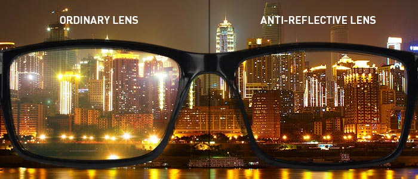
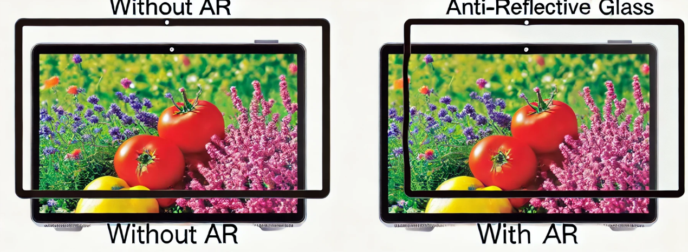
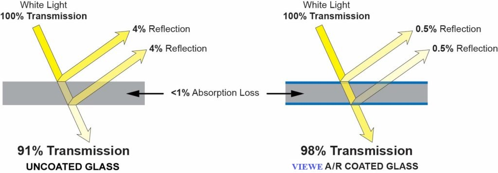
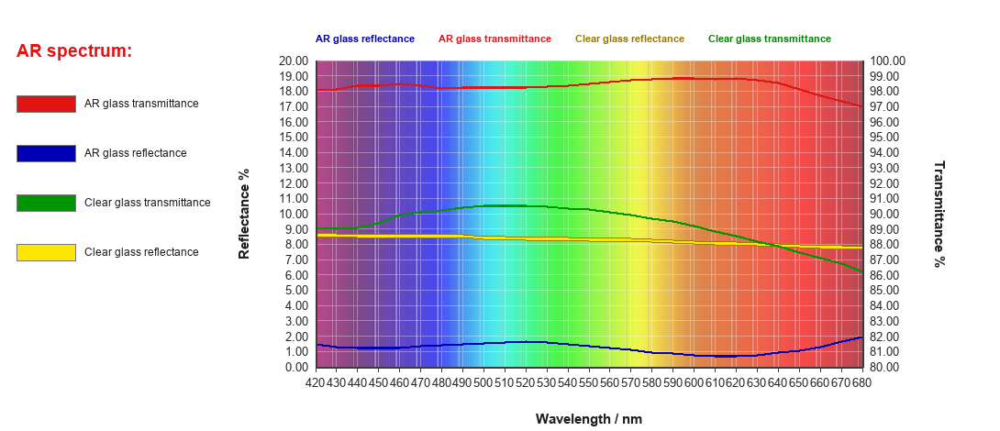

# Anti-Reflective vs Anti-Glare Display Treatments

!!! abstract "Quick answer"
    AR (anti-reflection) and AG (anti-glare) are often used interchangeably, but their mechanisms are completely different: AR lowers reflectance itself through multilayer thin-film interference, while AG breaks a concentrated specular reflection into diffuse reflection through surface microstructures. The first makes the image more transparent, the second stops the bright spot from being harsh. The two can be stacked, and together they are the most common pairing for strong-light environments.

## Key Takeaways

- One-line distinction: AR is "keep light from reflecting"; AG is "keep the reflection from forming a bright spot."
- The core AR metrics are reflectance and transmittance: uncoated glass transmits about 91% and reflects about 4% per surface; after AR coating this rises to about 98% transmittance and 0.5% reflectance.
- The core AG metrics are haze and gloss: AG does not reduce the total amount of reflection, it changes how that reflection is distributed.
- AG costs a slight loss of clarity, AR does not; used together, the two balance transparency and comfort.

## 1. The Fundamental Difference Between AR and AG

In standard glass or a display cover lens, incident light reflects off the surface, causing light loss and glare and directly degrading visual quality. There are two completely different ways to solve this:

| Dimension | AR (anti-reflection) | AG (anti-glare) |
|---|---|---|
| Mechanism | Multilayer thin-film interference lowers reflectance | Surface microstructures scatter light, turning specular reflection into diffuse reflection |
| Effect on total reflection | Markedly reduced | Essentially unchanged, only redistributed |
| Effect on transmittance | Increased | Slightly reduced (scattering loss) |
| Effect on clarity | Improved | Slightly reduced |
| Main improvement | Image transparency, contrast, and color accuracy | Readability and visual comfort under strong light |
| Typical process | Vacuum deposition, sputtering, nanoimprint | Etching, coating, nanoimprint |

## 2. AR (Anti-Reflective)

### 2.1 Role

AR technology works mainly by reducing light reflection at the cover lens surface, improving light transmission and display performance. Its main roles include:

- **Reducing reflection**: incident light reflecting off the glass surface causes light loss and glare; AR uses multiple thin-film layers to cut reflection sharply while raising transmission.
- **Improving contrast**: under strong lighting, reducing reflection directly improves display contrast.
- **Minimizing glare and eye strain**: especially in direct sunlight or strong lighting, lower surface reflection improves visual comfort.
- **Enhancing color accuracy**: with less stray reflected light, the colors on the screen look truer and closer to the design value.

<figure markdown="span" class="displaywiki-figure">
  [{ width="760" loading="lazy" }](anti-reflective-vs-anti-glare-the-advantages-of-ar-anti-reflective-technology.jpeg){ .displaywiki-image-link title="Open full-size image" }
  <figcaption>What AR does, seen in everyday life: the left half is an ordinary lens, where city lights form clear reflections on the surface; the right half is an anti-reflective lens, where the reflection almost disappears and the scene stays clean and transparent. AR coating does exactly the same thing for a display.</figcaption>
</figure>

<figure markdown="span" class="displaywiki-figure">
  [{ width="760" loading="lazy" }](anti-reflective-vs-anti-glare-anti-reflective-vs-anti-glare-display-treatments-diagram-1.png){ .displaywiki-image-link title="Open full-size image" }
  <figcaption>What AR glass actually does: the untreated surface on the left reflects strongly and the contrast of the picture is washed out; anti-reflective glass on the right cuts the reflection sharply, so the same image gains both color and gradation.</figcaption>
</figure>

Applying AR technology to a cover lens brings several benefits beyond display performance:

- **Enhanced user experience**: screen content stays clearly visible under any lighting condition, without interference from reflection.
- **Energy efficiency**: higher transmittance means the same brightness can be reached with less power, which matters especially for portable devices.
- **Increased competitiveness**: it creates a performance differentiator in a crowded display device market.
- **Extended lifespan**: the AR coating also acts as a protective layer, reducing damage to the screen from the external environment.

### 2.2 Measured Data

The effect of an AR coating can be summed up in two numbers: transmittance up and reflectance down.

<figure markdown="span" class="displaywiki-figure">
  [{ width="760" loading="lazy" }](anti-reflective-vs-anti-glare-processes-and-techniques-for-implementing-ar-anti-reflective-technolog.jpeg){ .displaywiki-image-link title="Open full-size image" }
  <figcaption>Transmittance and reflection of AR-coated glass: uncoated glass transmits about 91% and reflects 4% plus 4% (both surfaces), with less than 1% absorption loss; VIEWE A/R-coated glass raises transmittance to 98% and cuts single-surface reflection to 0.5% plus 0.5%.</figcaption>
</figure>

<figure markdown="span" class="displaywiki-figure">
  [{ width="760" loading="lazy" }](anti-reflective-vs-anti-glare-ar-cover-lens-with-higher-transmittance-red-curve-lower-reflectance-bl-en.png){ .displaywiki-image-link title="Open full-size image" }
  <figcaption>Spectral curves of an AR cover lens: the horizontal axis is wavelength from 420 to 680 nm. AR glass transmittance (red) holds at about 97–98% while its reflectance (dark blue) is pressed down to about 1–2%; ordinary glass transmits about 87–90% (green) and reflects about 8–9% (yellow). AR keeps reflection low across the whole visible band, so it does not introduce a visible color shift.</figcaption>
</figure>

### 2.3 Processes and Techniques

Implementing an AR coating involves several processes, mainly:

- **Multilayer thin-film design**: an AR coating usually consists of several optical thin films, each with a thickness and material precisely calculated to achieve the best anti-reflective effect. Common materials include silicon dioxide (SiO₂), aluminum oxide (Al₂O₃), and zinc oxide (ZnO).
- **Vacuum deposition**: film material is deposited in atomic or molecular form onto a glass or plastic substrate in a vacuum, and the layers stack up to form the anti-reflective coating.
- **Sputtering**: a common thin-film deposition method in which high-energy particles bombard a target, knocking target atoms loose so they deposit on the substrate as a film; precise thickness control gives a high-quality, uniform coating.
- **Nanoimprint**: micro- or nanoscale structures are built on the substrate surface to alter the light path and achieve an anti-reflective effect, with high precision and efficiency that suit large-scale production.
- **Ion beam assisted deposition**: combines an ion beam with physical vapor deposition to increase film density and adhesion, improving the optical and mechanical properties of the coating.

## 3. AG (Anti-Glare)

### 3.1 Role

AG technology is designed to spread out the light that strikes the cover lens surface, reducing the intensity of reflected light and thereby cutting glare, so a display is easier to see under all lighting conditions, including bright sunlight. Its main roles include:

- **Reducing glare**: scattering surface light significantly reduces the specular reflection that forms a harsh bright spot, easing eye strain in bright environments.
- **Enhancing readability**: eliminating glare improves screen readability, which matters especially outdoors or in well-lit indoor spaces.
- **Improving visual comfort**: it reduces distracting harsh reflections and bright spots.
- **Maintaining image quality**: unlike simply lowering brightness, an AG coating reduces glare while preserving as much of the image quality and clarity as possible.

<figure markdown="span" class="displaywiki-figure">
  [{ width="760" loading="lazy" }](anti-reflective-vs-anti-glare-the-advantages-of-ag-anti-glare-technology.png){ .displaywiki-image-link title="Open full-size image" }
  <figcaption>The effect of AG treatment: on the left, an untreated screen where strong light forms a broad white glare across the surface and completely hides the content; on the right, the AG-treated screen, where the glare is scattered away and the content is clearly visible.</figcaption>
</figure>

<figure markdown="span" class="displaywiki-figure">
  [{ width="760" loading="lazy" }](anti-reflective-vs-anti-glare-the-advantages-of-ag-anti-glare-technology-2.png){ .displaywiki-image-link title="Open full-size image" }
  <figcaption>Ordinary glass versus AG glass: on the left, ordinary glass forms an obvious starburst glare under a point light source; on the right, AG glass scatters the reflection so the image stays even, with no harsh bright spot.</figcaption>
</figure>

The advantages of adopting AG technology include:

- **Enhanced experience**: the screen is easier to read under any lighting condition, so users can read and interact comfortably.
- **Higher productivity**: in professional environments with long screen hours, such as offices and design studios, reducing eye strain helps sustain productivity.
- **Broad adaptability**: whether indoors or outdoors, in bright or dim lighting, the display stays clear and readable.
- **Protective effect**: an AG coating also provides a degree of protection for the display surface, reducing everyday scratches and damage.

### 3.2 Processes and Techniques

The main methods for applying an AG coating include:

- **Etching**: a common way to make an anti-glare surface. Chemical etching uses acid or other chemicals to form the texture, while mechanical etching uses abrasive materials.
- **Coating**: a thin anti-glare coating is applied to the glass surface by spray coating, dip coating, or roll coating. The coating is usually made of materials that scatter light, which is what reduces glare.
- **Surface microstructures**: microstructures are created on the glass surface so that incident light is scattered, either by processes such as sandblasting or by applying a specialized film.
- **Nanoimprint**: nanoscale patterns are imprinted on the glass surface, effectively spreading light while preserving the optical clarity of the glass.
- **Combination processes**: in practice several methods are often combined, for example etching a base texture first and then coating it with anti-glare material to reduce glare further.

### 3.3 Key Implementation Steps

1. **Surface preparation**: select a suitable glass or plastic substrate and clean the surface, removing dust, oil, and contaminants that could affect treatment quality.
2. **Texturing or coating application**: form the texture or coating according to the chosen method, which may mean sandblasting to generate a texture or applying a coating by spray, dip, or roll coating.
3. **Curing and hardening**: once applied, the coating must be cured and hardened, by heat treatment, UV curing, or chemical reaction depending on the coating type.
4. **Quality control and testing**: the treated surface is strictly monitored and inspected for uniformity, adhesion, durability, and anti-glare effectiveness; optical properties such as clarity and color accuracy are tested as well.
5. **Final inspection and packaging**: a thorough inspection confirms there are no defects before the parts move to packaging.

## 4. Combining AR and AG

AG and AR are not mutually exclusive, and outdoor designs often combine them: an AR coating first brings surface reflectance down, then AG treatment scatters the residual reflection. That reduces both the total amount of interfering light reaching the eye and the chance of residual reflection forming a local bright spot, a common way to balance transparency and comfort in strong light.

Note that the scattering loss and haze introduced by AG slightly reduce the sharpness of the image, so in applications where image quality comes first, such as professional monitoring and design proofing, AR is usually used on its own.

## 5. Selection Checklist

- **Decide what problem you are solving first**: choose AR when image transparency and color accuracy matter; choose AG when the concern is whether strong light is harsh and whether content stays readable.
- **Check the quantitative metrics**: for AR, reflectance and transmittance (plus the full spectral curve); for AG, haze and gloss, with measured data rather than a qualitative description.
- **Assess the clarity cost**: AG introduces haze, so high-resolution or fine-text applications need to confirm that the haze is acceptable.
- **Confirm abrasion resistance and lifetime**: both coatings and microstructures degrade with friction, so the test method and expected lifetime must be stated.
- **Consider stacking with other treatments**: AR, AG, and AF (anti-fingerprint) can be combined, but the process order and their interactions must be confirmed with the supplier.
- **Look at the whole solution**: surface treatment can only improve reflection; if ambient light is extremely strong, it still has to be combined with the lighting approach (such as transflective) or the brightness strategy.

## 6. Frequently Asked Questions

??? question "Q1: What is the actual difference between AR and AG?"
    The simplest distinction is this: AR makes light "reflect less" by lowering reflectance through multilayer thin-film interference, while AG keeps the reflection "from forming a bright spot" by scattering specular reflection into diffuse reflection through surface microstructures. The result is that AR improves transparency and color accuracy, while AG improves readability and comfort under strong light, at the cost of a slight loss of clarity.

??? question "Q2: Can AR and AG be applied at the same time?"
    Yes, and it is very common in outdoor designs. Typically the AR coating is applied first to lower surface reflectance, and AG then scatters the residual reflection, addressing both the total amount of interfering light and local bright spots. The process order, coating adhesion, and final haze still need to be confirmed with the supplier.

??? question "Q3: Why can an AR coating reduce reflection?"
    It relies on the interference effect of multiple thin films. The thickness and refractive index of every layer are designed so that light reflected from the different interfaces cancels out in phase, which presses reflectance down very low. That makes AR wavelength-selective, and a good coating holds low reflection across the whole 420–680 nm visible range.

??? question "Q4: Does AG make the image look blurry?"
    It has some effect. AG achieves anti-glare by scattering light, and the scattering also reduces the sharpness of the image, which shows up as higher haze. The higher the haze, the stronger the anti-glare effect and the greater the loss of clarity. Choose a balance between the anti-glare requirement and the clarity requirement, and ask for haze data.

??? question "Q5: How low can an AR coating bring reflection?"
    Using typical data as a reference: uncoated glass transmits about 91% and reflects about 4% per surface; AR-coated glass can reach about 98% transmittance and 0.5% single-surface reflectance. On the full spectral curve, AR glass reflectance usually stays in the 1–2% band, while ordinary glass sits at 8–9%.

??? question "Q6: How do I choose the particle or texture size of AG?"
    The principle is "just enough." A coarser texture gives stronger anti-glare but higher haze and a greater loss of clarity; a finer texture keeps the image sharper but limits anti-glare capability. Base the choice on the actual ambient illuminance and viewing distance, and check the supplier's measured haze and gloss values rather than looking only at particle size.

## Related reading

- [Display Cover Lens Materials, Thickness, and Treatments](cover-lens-materials-treatments.md)
- [Anti-Fingerprint and Antibacterial Cover-Lens Treatments](anti-fingerprint-antibacterial.md)
- [Cover Lens Customization for Display Products](cover-lens-customization.md)

!!! info "Can't find what you need?"
    If you need more products, resources or support, please contact our team:

    [**:material-archive-arrow-down: Knowledge Base**](../../knowledge/tags.md){ .md-button .md-button--primary }
    [**:material-magnify: Products & Solutions**](https://viewedisplay.com/){ .md-button }
    [**:material-email: Contact Support**](mailto:support@viewedisplay.com){ .md-button }
