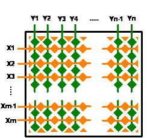
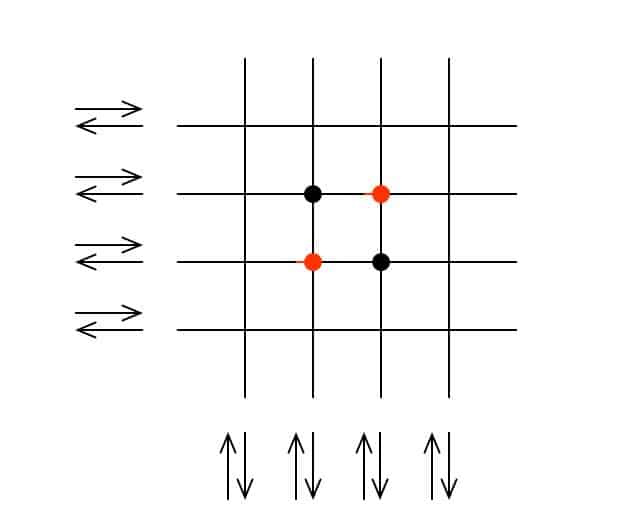
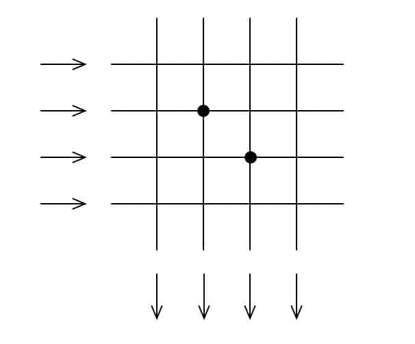
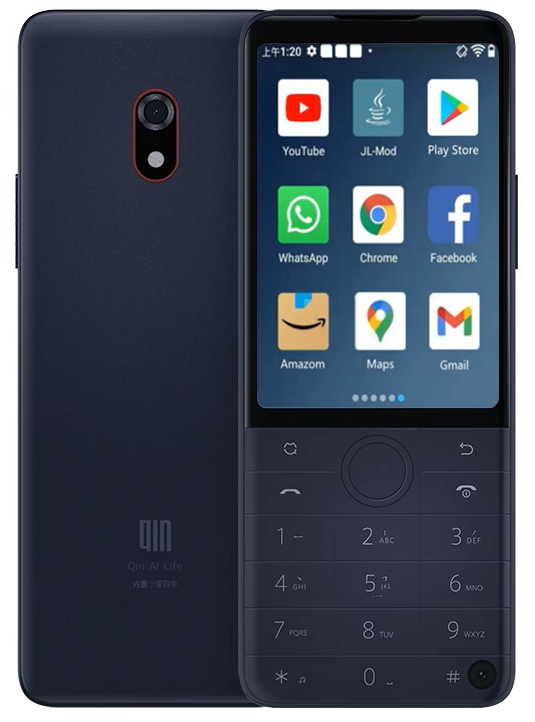
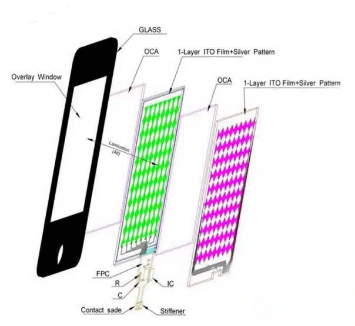
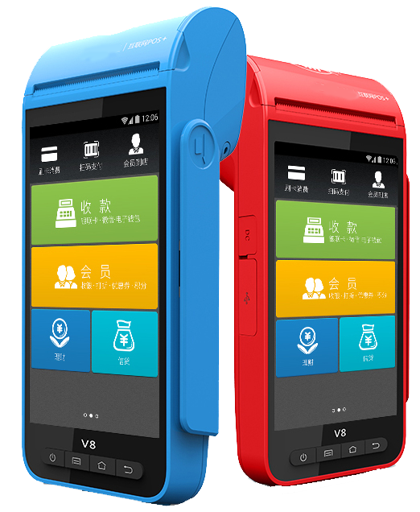
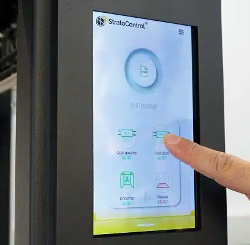
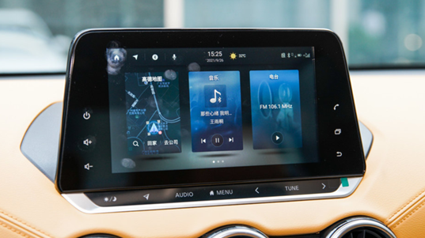

# Touch Panel Classification

!!! abstract "Quick answer"
    This guide explains capacitive touch panel structures, the relevant design trade-offs, and the points engineers should verify when selecting a display solution.

## Key Takeaways

- Learn capacitive touch panel classification, structures, key trade-offs, applications, and engineering selection criteria.
- Use the guidance below to compare the relevant technologies and design trade-offs.
- Validate optical, electrical, mechanical, environmental, and production requirements before final selection.

The principle of the capacitive touch screen is that when the finger touches the metal layer, due to the electric field of the human body, a coupling capacitor is formed between the user and the surface of the touch screen. For high-frequency currents, the capacitor is a direct conductor, so the finger sucks a small amount from the contact point. current. Through the detection circuit to detect this small current change to feel the position of the finger.

<figure markdown="span" class="displaywiki-figure">
  [{ width="760" loading="lazy" }](capacitive-touch-structures-self-capacitance.png){ .displaywiki-image-link title="Open full-size image" }
  <figcaption>PCAP-Capacitance</figcaption>
</figure>

The projected capacitive touch screen (PCAP) adopts multi-layer ITO layers to form a matrix distribution. The X-axis and Y-axis cross distribution is used as the capacitance matrix. When the finger touches the screen, the change of the capacitance at the touch position can be detected by scanning the X and Y axes. Then calculate where the finger is. Based on this architecture, projected capacitance can achieve multi-touch operation.

## Classification by principle
projected capacitive touch screens are divided into two modes: self-capacitance and mutual capacitance.

### Self-Capacitance

<figure markdown="span" class="displaywiki-figure">
  [{ width="760" loading="lazy" }](capacitive-touch-structures-self-capacitance.jpeg){ .displaywiki-image-link title="Open full-size image" }
  <figcaption>self-capacitance</figcaption>
</figure>   

1. Measure the capacitance of the signal line itself
2. Advantages: simple, slow
3. Disadvantages: non-true multipoint, susceptible to interference

### Mutual capacitance

<figure markdown="span" class="displaywiki-figure">
  [{ width="760" loading="lazy" }](capacitive-touch-structures-mutual-capacitance.jpeg){ .displaywiki-image-link title="Open full-size image" }
  <figcaption>mutual capacitance</figcaption>
</figure>  

1. Measure capacitance between two signals that intersect perpendicularly
2. Advantages: more real points, fast speed
3. Disadvantages: complex, high power consumption, high cost

## Classification by Structure
Common projected mutual capacitive touch screens have four structures, namely G+F, P+G, G+G, and G+F+F structures. The detailed structure and characteristics are as follows:

### G+F capacitive touch screen

Structure: cover glass + film sensor.

<figure markdown="span" class="displaywiki-figure">
  [{ width="760" loading="lazy" }](capacitive-touch-structures-structure-cover-glass-film-sensor.png){ .displaywiki-image-link title="Open full-size image" }
  <figcaption>Structure: cover glass + film sensor</figcaption>
</figure>   

Features: Use a single-layer film sensor, the sensor pattern has triangles, polygons, etc. according to different touch control IC, Since there is only one layer of sensor mutual compatibility products, it only supports single-point touch and Gesture operation. After optimizing the touch software, it achieves a virtual two-point gesture touch effect.

*the advantages of G+F structure capacitive touch screen*

- low cost of mold, high-cost performance, in capacitor TP

- The product with the lowest price, the total thickness can be made thinner, the light transmission is good, the delivery time is short, and the shape of the cover glass can be replaced.

*the disadvantages of G+F structure capacitive touch screen*

- only single-point touch, poor touch accuracy, unable to realize gesture operation and more functions.

*Application of G+F structure touch screen*

<figure markdown="span" class="displaywiki-figure">
  [{ width="760" loading="lazy" }](capacitive-touch-structures-application-of-g-f-structure-touch-screen.png){ .displaywiki-image-link title="Open full-size image" }
</figure>

<figure markdown="span" class="displaywiki-figure">
  [{ width="760" loading="lazy" }](capacitive-touch-structures-g-f-f-structure-capacitive-touch-screen.png){ .displaywiki-image-link title="Open full-size image" }
  <figcaption>Application of G+F structure touch screen</figcaption>
</figure>

### G+F+F capacitive touch screen

Structure: cover glass + film sensor + film sensor.

<figure markdown="span" class="displaywiki-figure">
  [{ width="760" loading="lazy" }](capacitive-touch-structures-the-advantages-of-g-f-f-structure-capacitive-touch-screen.png){ .displaywiki-image-link title="Open full-size image" }
  <figcaption>G+F+F structure capacitive touch screen<</figcaption>
</figure>

Features: This structure uses two layers of film sensors, and the sensor is generally a rhombus structure.

Advantages:  
- Supports real multi-point operation, supports complex tasks such as gesture touch and wake-up. The touch screen with GFF structure is the most widely used touch screen structure  
- Due to the mutual-capacitance structure of the double-layer sensor film, the accuracy is high, the handwriting effect is good, it supports real Multi-touch, High anti-interference (EMI/EMC/ESD…) and Large size touch. 
- And film sensor is flexible for 2.5D and 3D usage

Disadvantages of G+F+F structure capacitive touch screen
- The light transmittance is poor due to the use of multi-layer film materials, which is 5% lower than the G/G structure.
- relatively high price than GF Touch panel

Application of G+F+F structure touch screen

<figure markdown="span" class="displaywiki-figure">
  [{ width="760" loading="lazy" }](capacitive-touch-structures-g-g-structure-capacitive-touch-screen.png){ .displaywiki-image-link title="Open full-size image" }
</figure>

<figure markdown="span" class="displaywiki-figure">
  [{ width="760" loading="lazy" }](capacitive-touch-structures-g-g-structure-capacitive-touch-screen-2.png){ .displaywiki-image-link title="Open full-size image" }
  <figcaption>G+F+F capacitive touch screen application</figcaption>
</figure>

### G+G capacitive touch screen
Structure: Cover glass + sensor glass

Features: This structure adopts single-layer induction glass. Usually the sensor pattern is a rhombus structure. Glass is used as the substrate, which has high strength and good heat resistance, so the sensor can be fabricated on both sides of the glass substrate.

<figure markdown="span" class="displaywiki-figure">
  [{ width="760" loading="lazy" }](capacitive-touch-structures-the-advantages-of-g-g-structure-capacitive-touch-screen.png){ .displaywiki-image-link title="Open full-size image" }
  <figcaption>G+G structure capacitive touch screen</figcaption>
</figure>

G+G is the structure of glass cover and single-layer glass substrate touch sensor. The glass substrate touch sensor adopts high-temperature ITO process, the quality of the ITO film layer is good, and the service life is longer.

the advantages of G+G structure capacitive touch screen

- Mutual-capacitance touch structure with double-layer touch sensor, high precision, good light transmission, and good handwriting effect.
- Support real multi-touch, the shape of the cover glass can be changed, good reliability and long service life.

the disadvantages of G+G structure capacitive touch screen

- The sensor glass is easily damaged after impact, and the development cost is relatively high. It is mostly used for medium and large products such as tablet computers and monitors.
- It’s heaver than GFF Touch screen and not suitable for mobile application.

Application of G+G structure touch screen

<figure markdown="span" class="displaywiki-figure">
  [{ width="760" loading="lazy" }](capacitive-touch-structures-application-of-g-g-structure-touch-screen.jpeg){ .displaywiki-image-link title="Open full-size image" }
</figure>

<figure markdown="span" class="displaywiki-figure">
  [{ width="760" loading="lazy" }](capacitive-touch-structures-p-g-structure-capacitive-touch-screen.png){ .displaywiki-image-link title="Open full-size image" }
  <figcaption>Application of G+G structure touch screen</figcaption>
</figure>

### P+G capacitive touch screen
Structure: Plastic cover + sensor glass

Features: This structure adopts single-layer induction glass. Similar to the structure of G+G, just replace the cover glass with a plastic cover

<figure markdown="span" class="displaywiki-figure">
  [{ width="760" loading="lazy" }](capacitive-touch-structures-the-advantages-of-p-g-structure-capacitive-touch-screen.png){ .displaywiki-image-link title="Open full-size image" }
  <figcaption>P+G structure capacitive touch screen</figcaption>
</figure>

P+G is the structure of glass cover and single-layer glass substrate touch sensor. Similar to the G+G structure.

the disadvantages of P+G structure capacitive touch screen

- The sensor glass is easily damaged after impact
- the strength of the plastic cover is low

Application of P+G structure touch screen

<figure markdown="span" class="displaywiki-figure">
  [{ width="760" loading="lazy" }](capacitive-touch-structures-application-of-p-g-structure-touch-screen.png){ .displaywiki-image-link title="Open full-size image" }
  <figcaption>Application of P+G structure touch screen</figcaption>
</figure>

## Conclusion and advice:
If your cost requirements are not high, and your products are below 10 inches of tft display products, VIEWE suggest you choose G+F+F touch structure, excellent performance and relatively thin size.

If your product is more than 10 inches of tft display products, it is recommended to use G+G touch results, in the large size of G+G structure has stronger stability and durability.

G+F products have poor touch accuracy, and their performance will be unsatisfactory unless your human-computer interaction interface is very simple and easy to touch.

The main problem of P+G structure is that the wear resistance and strength of the plastic cover plate is poor, and it is only used in special service conditions to replace G+G because of low cost.

If you have demand in the touch screen and LCD display, please contact [VIEWE](https://viewedisplay.com/), according to your usage scenarios and requirements we will give the optimal solution.

## Related reading

- [Capacitive vs Resistive Touchscreens](touch-panel-types.md)
- [Air Bonding vs Optical Bonding for Displays](air-vs-optical-bonding.md)
- [Glove Touch, Waterproof Touch, and Interference Resistance](glove-waterproof-touch.md)

!!! info "Can't find what you need?"    
    If you need more products, resources or support, please contact our team:  

    [**:material-archive-arrow-down: Knowledge Base**](../../knowledge/tags.md){ .md-button .md-button--primary } 
    [**:material-magnify: Products & Solutions**](https://viewedisplay.com/touch-solution/){ .md-button }
    [**:material-email: Contact Support**](mailto:support@viewedisplay.com){ .md-button }