

# Touch Panel Classification

!!! abstract "Quick answer"
    This guide covers the common structures of capacitive touch panels, the related design trade-offs, and the points an engineer should verify when choosing a display solution.

## Key Takeaways

- Get a systematic view of the G+F, G+F+F, G+G, and P+G capacitive touch structures, including the key principles, pros and cons, application scenarios, and engineering selection points.
- Compare the related technologies, application conditions, and design trade-offs in the sections below.
- Before the final selection, confirm the optical, electrical, mechanical, environmental, and volume-production requirements.

The principle of the capacitive touch screen is that when a finger touches the metal layer, the electric field of the human body forms a coupling capacitor between the user and the surface of the touch screen. For high-frequency current, a capacitor behaves as a conductor, so the finger draws a small amount of current from the contact point. A detection circuit then senses this small current change to locate the finger.

<figure markdown="span" class="displaywiki-figure">
  [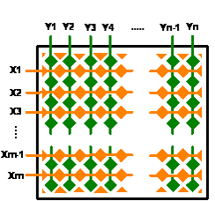{ width="760" loading="lazy" }](capacitive-touch-structures-self-capacitance.png){ .displaywiki-image-link title="Open full-size image" }
  <figcaption>Projected capacitive electrode matrix: the X-axis and Y-axis electrodes (the rhombus shapes are the ITO electrode pattern) cross each other to form a capacitance matrix, and scanning row by row and column by column detects the capacitance change at the touch point. This is the architectural basis that lets a projected capacitive screen support multi-touch.</figcaption>
</figure>

A projected capacitive (PCAP) touch screen uses multiple ITO layers to form a matrix distribution, with the X-axis and Y-axis crossing to build a capacitance matrix. When a finger touches the screen, scanning the X and Y axes detects the capacitance change at the touch position. Based on this architecture, a projected capacitive screen can achieve multi-touch.

## 1. Classification by Sensing Principle

Projected capacitive touch screens are divided into two modes by sensing principle: self-capacitance and mutual capacitance.

**Self-capacitance:**

<figure markdown="span" class="displaywiki-figure">
  [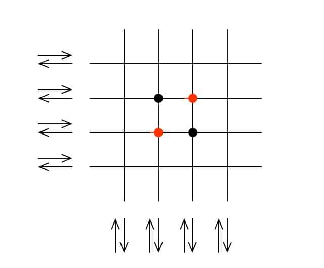{ width="760" loading="lazy" }](capacitive-touch-structures-self-capacitance.jpeg){ .displaywiki-image-link title="Open full-size image" }
  <figcaption>Self-capacitance sensing: the capacitance of each signal line is measured along the X axis and the Y axis separately, and the touch coordinate is then inferred from the crossing of the two. Because the two directions are measured independently, multiple touches produce crossing points that cannot be told apart, which is exactly why self-capacitance is not true multi-touch.</figcaption>
</figure>

1. Measure the capacitance of the signal line itself.
2. Advantages: simple to implement.
3. Disadvantages: slower scanning, not true multi-touch, and susceptible to interference.

**Mutual capacitance:**

<figure markdown="span" class="displaywiki-figure">
  [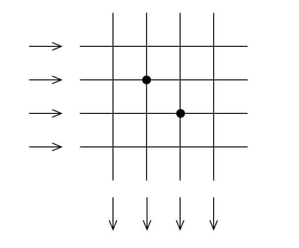{ width="760" loading="lazy" }](capacitive-touch-structures-mutual-capacitance.jpeg){ .displaywiki-image-link title="Open full-size image" }
  <figcaption>Mutual-capacitance sensing: the coupling capacitance between each crossing point of the X and Y electrodes is measured one by one, so every crossing point is an independent measuring cell and multiple touches can be identified separately. This is why mutual capacitance supports true multi-touch.</figcaption>
</figure>

1. The capacitance between two signal lines that cross perpendicularly.
2. Advantages: supports true multi-touch and is fast.
3. Disadvantages: more complex structure, and higher power consumption and cost.

## 2. Classification by Sensor Stack

Capacitive touch screens come in four structures: G+F, P+G, G+G, and G+F+F.

### G+F capacitive touch screen

Structure: cover lens + film sensor.

<figure markdown="span" class="displaywiki-figure">
  [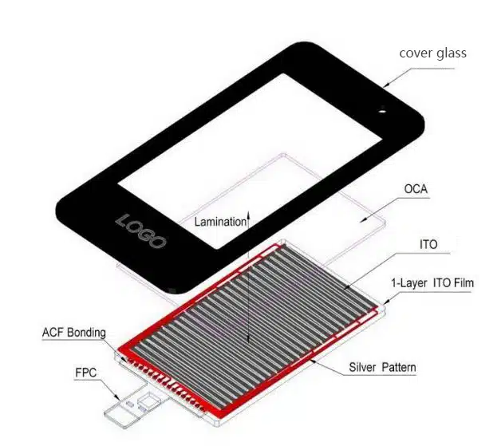{ width="760" loading="lazy" }](capacitive-touch-structures-structure-cover-glass-film-sensor.png){ .displaywiki-image-link title="Open full-size image" }
  <figcaption>Structure: cover lens + film sensor</figcaption>
</figure>

Function: it uses a single-layer film sensor, and the sensor pattern is laid out as triangles, polygons, and so on depending on the touch control IC. After optimizing the touch software, a virtual two-point gesture touch effect can be achieved.

**Advantages of the G+F capacitive touch screen**

- Low cost.
- The thickness can be made thinner, with better light transmission.

**Disadvantages of the G+F capacitive touch screen**

- Single-point touch only, poor touch accuracy, and it cannot support gesture operation and more functions.

**Applications of the G+F touch screen**

<figure markdown="span" class="displaywiki-figure">
  [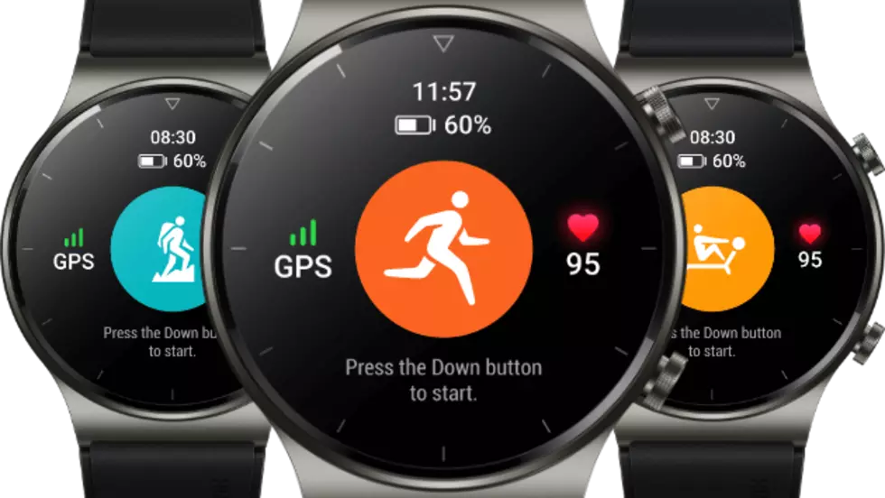{ width="760" loading="lazy" }](capacitive-touch-structures-application-of-g-f-structure-touch-screen.png){ .displaywiki-image-link title="Open full-size image" }
  <figcaption>G+F application example: small, mostly single-touch devices such as smartwatches, where a thin stack, good transmittance, and low cost match the cover lens plus single film sensor construction.</figcaption>
</figure>

<figure markdown="span" class="displaywiki-figure">
  [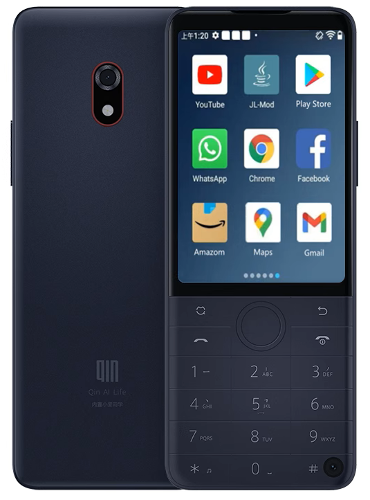{ width="760" loading="lazy" }](capacitive-touch-structures-application-of-g-f-structure-touch-screen-2.png){ .displaywiki-image-link title="Open full-size image" }
  <figcaption>G+F capacitive touch screen applications</figcaption>
</figure>

### G+F+F capacitive touch screen

<figure markdown="span" class="displaywiki-figure">
  [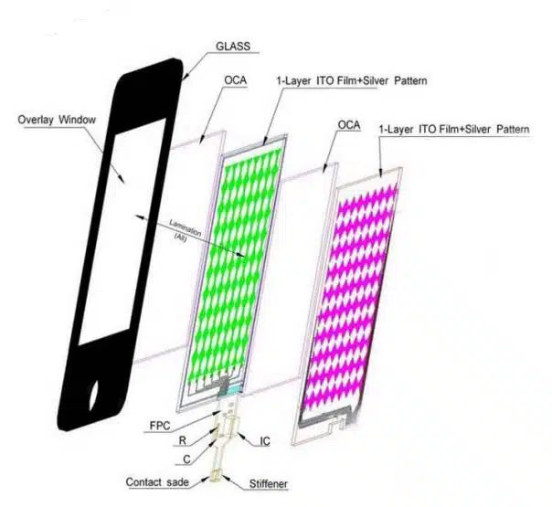{ width="760" loading="lazy" }](capacitive-touch-structures-g-f-f-structure-capacitive-touch-screen.png){ .displaywiki-image-link title="Open full-size image" }
  <figcaption>G+F+F capacitive touch screen structure</figcaption>
</figure>

**Advantages of the G+F+F capacitive touch screen**

- It supports real multi-point operation and complex functions such as gesture touch and wake-up. The GFF structure touch screen is currently the most widely used touch screen structure.
- Thanks to the mutual-capacitance structure of the double-layer sensor film, the accuracy is high and the handwriting effect is good; it supports real multi-touch, has strong anti-interference (EMI/EMC/ESD), and can support large-size touch.

!!! warning "Production note"
    Under volume production or harsh conditions (high and low temperature, damp heat, vibration, ESD), check the datasheet curves for this parameter; running outside the specified range will significantly shorten lifetime.

**Disadvantages of the G+F+F capacitive touch screen**

- Because it uses multi-layer film materials, the light transmittance is 5% lower than the G+G structure.
- The price is relatively higher than a GF touch screen.

**Applications of the G+F+F touch screen**

<figure markdown="span" class="displaywiki-figure">
  [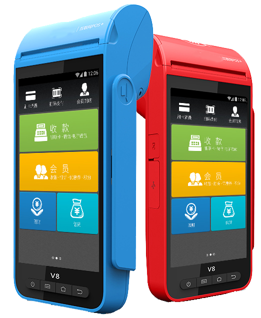{ width="760" loading="lazy" }](capacitive-touch-structures-application-of-g-f-f-structure-touch-screen.png){ .displaywiki-image-link title="Open full-size image" }
  <figcaption>G+F+F application example: smart POS terminals and similar devices that require multi-touch, handwriting, and gesture operation — the most widely used touch screen structure today.</figcaption>
</figure>

<figure markdown="span" class="displaywiki-figure">
  [{ width="760" loading="lazy" }](capacitive-touch-structures-application-of-g-f-f-structure-touch-screen-2.png){ .displaywiki-image-link title="Open full-size image" }
  <figcaption>G+F+F capacitive touch screen applications</figcaption>
</figure>

### G+G capacitive touch screen

<figure markdown="span" class="displaywiki-figure">
  [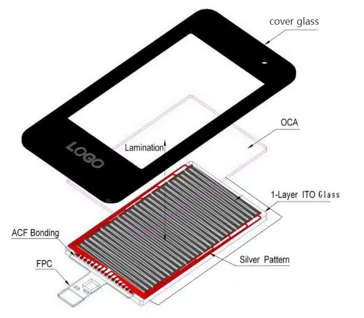{ width="760" loading="lazy" }](capacitive-touch-structures-g-g-structure-capacitive-touch-screen.png){ .displaywiki-image-link title="Open full-size image" }
  <figcaption>Structure of a G+G capacitive touch screen</figcaption>
</figure>

G+G is the structure of a cover lens plus a single-layer glass-substrate touch sensor. Glass serves as the sensor substrate, which brings high strength and good heat resistance.

**Advantages of the G+G capacitive touch screen**

- A double-layer touch sensor gives high precision, good light transmission, and a good handwriting effect.
- Supports multi-touch.
- High reliability and long service life.

**Disadvantages of the G+G capacitive touch screen**

- The sensor glass is easily damaged after impact.
- Heavier than a GFF touch screen, so it is not suitable for mobile applications.

**Applications of the G+G touch screen**

<figure markdown="span" class="displaywiki-figure">
  [{ width="760" loading="lazy" }](capacitive-touch-structures-application-of-g-g-structure-touch-screen.jpeg){ .displaywiki-image-link title="Open full-size image" }
  <figcaption>G+G application example: public terminals such as airport self-check-in kiosks, which run at a high duty cycle and need durability, transmittance, and consistent appearance, matching the cover lens plus glass sensor construction.</figcaption>
</figure>

<figure markdown="span" class="displaywiki-figure">
  [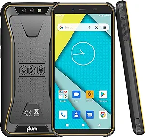{ width="760" loading="lazy" }](capacitive-touch-structures-g-g-structure-capacitive-touch-screen-2.png){ .displaywiki-image-link title="Open full-size image" }
  <figcaption>G+G capacitive touch screen applications</figcaption>
</figure>

### P+G capacitive touch screen

The structure is similar to G+G, except that a plastic cover replaces the cover lens.

<figure markdown="span" class="displaywiki-figure">
  [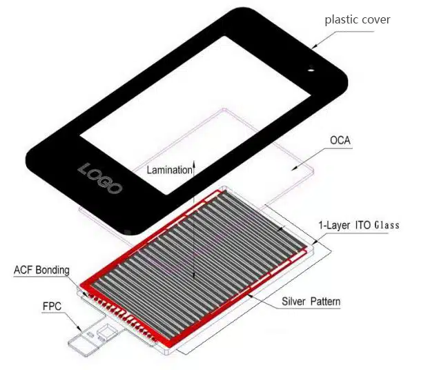{ width="760" loading="lazy" }](capacitive-touch-structures-p-g-structure-capacitive-touch-screen.png){ .displaywiki-image-link title="Open full-size image" }
  <figcaption>Structure of a P+G capacitive touch screen</figcaption>
</figure>

**Advantages of the P+G capacitive touch screen**

- A clear cost advantage.

**Disadvantages of the P+G capacitive touch screen**

- The plastic cover has low strength, is not scratch or wear resistant, and feels mediocre to the finger.

**Applications of the P+G touch screen**

<figure markdown="span" class="displaywiki-figure">
  [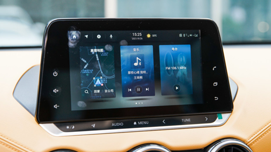{ width="760" loading="lazy" }](capacitive-touch-structures-application-of-p-g-structure-touch-screen.png){ .displaywiki-image-link title="Open full-size image" }
  <figcaption>Applications of the P+G touch screen</figcaption>
</figure>

If your cost requirements are not high and your product is a TFT display product below 10 inches, [VIEWE](https://viewedisplay.com/) suggests you choose the G+F+F touch structure, which performs well and stays relatively thin and light.

If your product is a TFT display product above 10 inches, the G+G touch structure is recommended.

G+F products have poor touch accuracy, and their performance will be unsatisfactory unless the human-computer interaction interface is very simple and easy to touch.

The main problem of the P+G structure is the poor wear resistance and strength of the plastic cover; because of its low cost, it is used only under special service conditions to replace G+G.

If you have requirements for touch screens and LCD displays, please contact [VIEWE](https://viewedisplay.com/), and we will provide the optimal solution based on your usage and requirements.

## 3. Conclusion

For capacitive touch structures there is no "best", only the "most suitable". Selection starts with three things: size (10 inches is the dividing line between GFF and GG), interaction needs (whether true multi-touch or handwriting is required), and environment (whether the panel must resist scratches, impact, and interference). GFF is currently the highest-volume structure and offers the best cost-performance; GG suits high-reliability scenarios such as industrial control, automotive, and medical; GF has almost been replaced by GFF; PG survives only where cost is extremely sensitive and touch requirements are very low. Only by aligning the structure, the IC, and the cover lens together can you avoid experience problems that only surface at volume production.

## 4. Frequently Asked Questions

??? question "Q1: How do you tell the G+F, G+F+F, G+G, and P+G structures apart?"
    Look at the material and layer count of the sensor and the cover. G+F = cover lens + single-layer film sensor; G+F+F = cover lens + double-layer film sensor (mutual capacitance, today's mainstream); G+G = cover lens + glass-substrate sensor; P+G = plastic cover + glass-substrate sensor. The naming rule is 'cover material + sensor material or layer count'.

??? question "Q2: Is GFF or GG better?"
    It depends on the scenario. GFF is thin and light, has about 5% lower transmittance, and costs less, making it the first choice for consumer electronics; GG has good transmittance, high strength, and long life, and suits industrial control, automotive, and medical use. Both support true multi-touch; the differences lie in structural strength, transmittance, and cost. Below 10 inches is GFF's home ground; above 10 inches GG is usually chosen.

??? question "Q3: Is the GF structure still used today?"
    Less and less. GF uses a single-layer film sensor and can only do single-point or pseudo two-point touch, so it cannot support handwriting and multi-touch gestures; apart from extremely low-cost scenarios with very weak interaction requirements, it has largely been replaced by GFF. For a new project, unless cost is extremely sensitive, GF is no longer recommended.

??? question "Q4: What is the essential difference between self-capacitance and mutual capacitance?"
    Self-capacitance measures the capacitance change of each signal line to ground, while mutual capacitance measures the capacitance change between two perpendicularly crossing lines. Self-capacitance is simple to implement but does not support true multi-touch (it easily produces ghost points), while mutual capacitance is the physical basis of today's mainstream multi-touch. Phones, car infotainment, and medical equipment almost all use mutual capacitance.

??? question "Q5: How are the touch screen and the display bonded together?"
    Air bonding sticks the touch screen and the display together around their edges with double-sided tape, leaving an air gap in the middle; it is low cost and reworkable, but has poor anti-reflection and fogs easily. Optical bonding fills the gap with OCR / OCA / LOCA adhesive, which guards against glare, impact, and fogging and gives the best optical result, but it is not reworkable and costs more. Whether to bond, and which adhesive to choose, depends on the optical and environmental reliability requirements.

## Related reading

- [Capacitive vs Resistive Touch Screens](touch-panel-types.md)
- [Air Bonding vs Optical Bonding for Displays](air-vs-optical-bonding.md)
- [Glove Touch, Waterproof Touch, and Interference Resistance](glove-waterproof-touch.md)

!!! info "Can't find what you need?"
    If you need more products, resources or support, please contact our team:

    [**:material-archive-arrow-down: Knowledge Base**](../../knowledge/tags.md){ .md-button .md-button--primary }
    [**:material-magnify: Products & Solutions**](https://viewedisplay.com/){ .md-button }
    [**:material-email: Contact Support**](mailto:support@viewedisplay.com){ .md-button }
