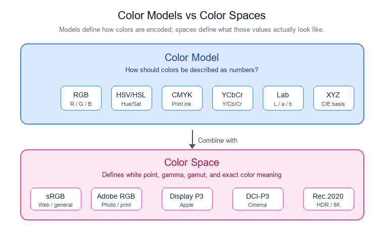
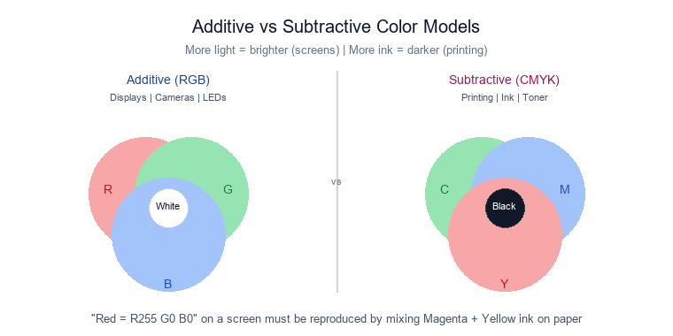
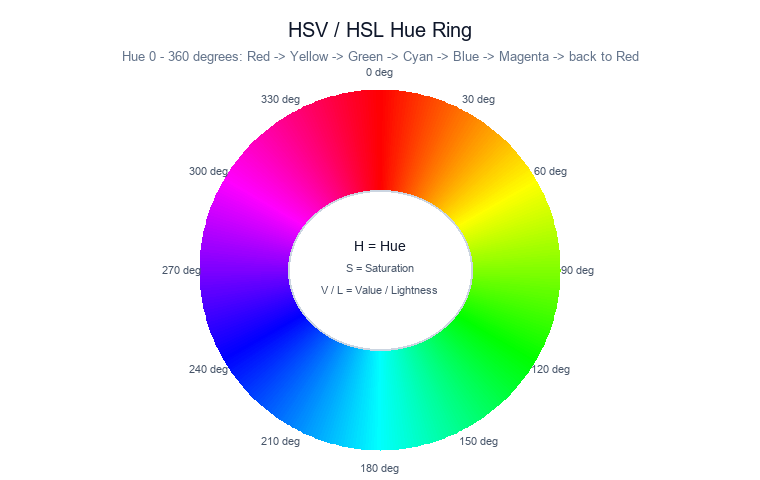
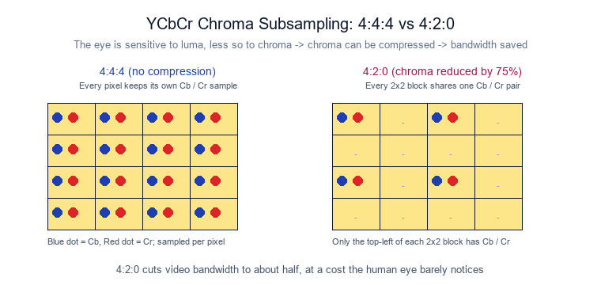
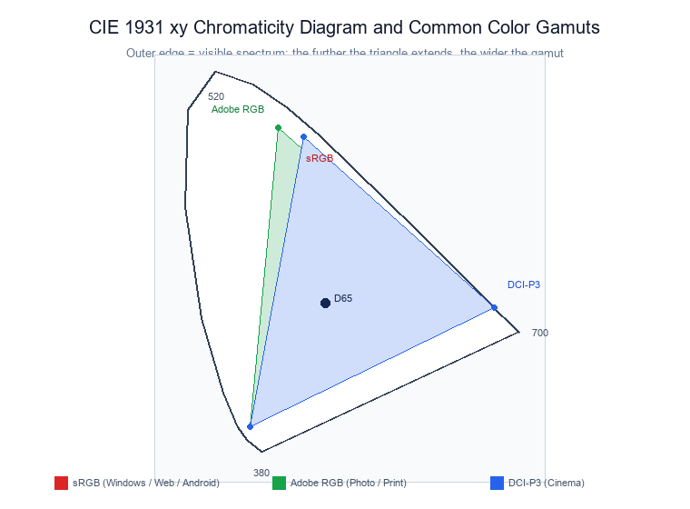

# Image Format Basics: What Are Color Models and Color Spaces

!!! abstract "Quick answer"
    A color model defines how to describe a color; a color space defines what those numbers actually mean. They are two layers of the same problem. The model provides an encoding scheme (RGB, HSV, YCbCr, and so on). On top of that, the space defines the white point, gamma curve, and gamut boundaries (sRGB, Adobe RGB, DCI-P3, and so on). Only when both are fixed can the same RGB triplet reproduce the same color across different devices.

## Key Takeaways

- Real-world color is fundamentally wavelength, and the human eye samples it through three types of cone cells, which is why red, green, and blue primaries are enough to synthesize most visible colors.
- A color model specifies only how to encode a color with numbers; it solves the encoding problem without guaranteeing color consistency.
- A color space adds the white point, gamma, and gamut on top of the model and answers the question of what those numbers actually look like.
- The most common engineering combination is an RGB or YCbCr model with an sRGB or DCI-P3 space, and the camera plus ISP pipeline keeps converting between them.

When you open an image file or look at the RGB output of a camera, you will often run into terms like these:

- RGB
- HSV
- YUV
- Lab
- sRGB
- Adobe RGB
- Display P3

Beginners often wonder:

- Is RGB a color model or a color space?
- What is the actual difference between sRGB and RGB?
- Why does the same picture look different on different displays?

These concepts get used interchangeably in everyday speech, but they carry very different responsibilities. Remember this single sentence:

**A color model decides how to describe a color; a color space decides what that color is.**

<figure markdown="span" class="displaywiki-figure">
  [{ width="760" loading="lazy" }](color-model-vs-color-space-cover-en.png){ .displaywiki-image-link title="View full size" }
  <figcaption>The model describes; the space interprets.</figcaption>
</figure>

## 1. What color actually is

Color in the real world is light at different wavelengths. When light hits a surface, some wavelengths are absorbed and others are reflected. The reflected light reaches our eyes and the brain produces the sensation of color.

The human eye contains three types of cone cells, each with a different peak sensitivity:

- Red (L cones, long wavelength)
- Green (M cones, medium wavelength)
- Blue (S cones, short wavelength)

That is why controlling the ratio of red, green, and blue light is enough to reproduce most visible colors. This is the foundation of the RGB primary theory.

## 2. Why we need color models

A computer cannot understand a description like "a bit more red" or "a bit more blue." It only understands numbers.

So we need a uniform way to convert colors into numbers. For example:

```
Red:   R = 255  G = 0    B = 0
```

or:

```
Yellow: H = 60°  S = 100%  V = 100%
```

Each of these representations is a color model. A color model answers the question: **which numbers should we use to describe a color?**

## 3. Common color models

Different scenarios call for different representations, which is why multiple color models exist.

| Color model | Components | Typical applications |
|---|---|---|
| RGB | Red, Green, Blue | Cameras, displays, image processing |
| CMYK | Cyan, Magenta, Yellow, Black | Printing |
| HSV | Hue, Saturation, Value | UIs and color-picker tools |
| HSL | Hue, Saturation, Lightness | Web front ends |
| YCbCr (YUV) | Luma, Chroma | Video encoding |
| Lab | Lightness, color channels | Color measurement, machine vision |
| XYZ | International standard | Color science |

Notice that they all describe the same color, only in different ways. It is like describing the same location with either latitude/longitude or a street address.

### RGB: the most common color model

RGB is the most common color model in computing and belongs to the **additive** family: more light means a brighter color.

That is why displays, phone screens, cameras, and LEDs almost all work in RGB.

### CMYK: the color model used by printers

A display can emit light; paper cannot. So printers use a different approach, the **subtractive** family, with four inks:

- C (Cyan)
- M (Magenta)
- Y (Yellow)
- K (Key / Black)

More ink means a darker color. In short:

- RGB is for displays.
- CMYK is for printing.

<figure markdown="span" class="displaywiki-figure">
  [{ width="760" loading="lazy" }](color-model-vs-color-space-add-sub-en.png){ .displaywiki-image-link title="View full size" }
  <figcaption>Additive (RGB) gets brighter with more light; subtractive (CMYK) gets darker with more ink.</figcaption>
</figure>

### HSV: closer to the way humans think

RGB suits computers but not people. We find it much easier to say "shift the color a bit more toward blue" than "reduce R by 18 and reduce G by 32."

HSV was introduced with three parameters:

- Hue
- Saturation
- Value

For example:

```
Yellow: H = 60°  S = 100%  V = 100%
```

This is why most image editors expose color adjustment through HSV.

### HSL: better for lightness gradients

HSL is very similar to HSV and contains:

- H (Hue)
- S (Saturation)
- L (Lightness)

The key difference is the third parameter: HSV uses Value (brightness), while HSL uses Lightness. HSL feels more natural when adjusting the depth of a color, which is why many design tools and web front ends adopt it. For example, in CSS:

```
color: hsl(200, 80%, 50%);
```

Characteristics:

- Better suited for color design.
- Produces more natural lightness gradients.
- Widely used in web design.

Typical applications:

- CSS
- UI design
- Icon design
- Front-end development

<figure markdown="span" class="displaywiki-figure">
  [{ width="760" loading="lazy" }](color-model-vs-color-space-hsv-ring-en.png){ .displaywiki-image-link title="View full size" }
  <figcaption>Hue from 0° to 360° makes the ring; S and V or L decide how saturated and bright each point looks.</figcaption>
</figure>

### YCbCr (YUV): the workhorse of video

Many people assume video also runs in RGB. In reality, most video uses YCbCr (often referred to as YUV). It splits color into:

- Y: luma (brightness)
- Cb: blue-difference chroma
- Cr: red-difference chroma

The benefit comes from how human vision works:

- The eye is much more sensitive to brightness than to color.

So chroma resolution can be reduced, which greatly improves compression efficiency; 4:2:2 and 4:2:0 are common chroma subsampling ratios. This is one of the main reasons video compression saves so much bandwidth.

Characteristics:

- High compression efficiency.
- Well suited to video encoding.
- A good balance between quality and bandwidth.

Typical applications:

- Cameras
- H.264
- H.265
- AV1
- HDMI
- USB cameras

<figure markdown="span" class="displaywiki-figure">
  [{ width="760" loading="lazy" }](color-model-vs-color-space-ycbcr-420-en.png){ .displaywiki-image-link title="View full size" }
  <figcaption>4:2:0 lets multiple pixels share one chroma sample, halving bandwidth with virtually no visible loss.</figcaption>
</figure>

### Lab: the color model closest to human perception

The Lab color model has three components:

- L: Lightness
- a: green ↔ red
- b: blue ↔ yellow

The biggest advantage of Lab is that **the distance between two colors closely matches how the eye actually perceives the difference.**

For example, two colors whose RGB values are very close can still look quite different to the eye, but in Lab the difference (ΔE) reflects perceptual difference reliably. This is why industrial vision, color-difference measurement, and print calibration rely heavily on Lab.

Characteristics:

- Closest to human vision.
- Accurate color-difference calculation.
- Device independent.

Typical applications:

- Colorimeters and spectrophotometers
- Industrial inspection
- Printing
- AI vision

### XYZ: the foundation for every other model

XYZ is the standard color model defined by the International Commission on Illumination (CIE). It is not designed for everyday use but to provide a unified color reference. Many color spaces are actually derived from XYZ, so XYZ serves as the "intermediate language" of color science.

Characteristics:

- The international standard color model.
- The basis of color-space conversion.
- Rarely used directly for image storage.

Typical applications:

- Color science
- ICC color management
- Color-space conversion
- Display calibration

## 4. Why a color model alone cannot fix a color

This is the most common point of confusion.

Suppose two displays are both asked to show:

```
R = 255  G = 0  B = 0
```

The results can still be very different:

- One screen looks a bit orange.
- One screen looks vivid and saturated.
- One screen looks dim and washed out.

Why? Because RGB only tells the device to drive the red channel to maximum. It does not tell the device **which red that is.**

So a color model by itself is not enough. We also need a standard. That is exactly what a color space is.

## 5. What a color space is

A color space is the standard specification that rides on top of a color model. It not only defines where red, green, and blue sit, but also defines:

- The white point.
- The gamma curve.
- The reproducible color range (the gamut).

So you can think of it like this:

```
RGB
├── sRGB
├── Adobe RGB
├── Display P3
├── DCI-P3
└── Rec.2020
```

All of them share the RGB model, but the reproducible color range is different for each.

<figure markdown="span" class="displaywiki-figure">
  [{ width="760" loading="lazy" }](color-model-vs-color-space-cie1931-en.png){ .displaywiki-image-link title="View full size" }
  <figcaption>On the CIE 1931 xy diagram, a gamut is just the area covered by its triangle.</figcaption>
</figure>

## 6. Common color spaces

| Color space | Characteristic | Typical applications |
|---|---|---|
| sRGB | The most universal | Windows, the web, Android |
| Adobe RGB | Wider gamut | Photography, print |
| Display P3 | The Apple ecosystem | iPhone, Mac, iPad |
| Rec.2020 | Ultra-wide gamut | HDR, 4K, 8K |
| ProPhoto RGB | Extremely wide gamut | Professional photography |

In short, a larger gamut means more reproducible colors.

## 7. How color models and color spaces relate

It is easy to mix these two concepts up. Use a simple analogy: describing a city's location.

- A **color model** is like a latitude/longitude system. It tells you **how to express a location.**
- A **color space** is like a world map. It tells you **what each coordinate actually refers to.**

Both are required.

## 8. Color models and color spaces inside a camera pipeline

Inside the camera-to-display chain you can see two layers at work:

- RGB and YCbCr are color models.
- sRGB and Display P3 are color spaces.

The ISP (Image Signal Processor) performs these conversions during processing so that the display can reproduce real-world color as accurately as possible.

For an embedded display project, this has a direct consequence: if the camera outputs YCbCr 4:2:0 and the display is driven in RGB, a model and space conversion will happen at some point. Whether the conversion matrix and white points line up decides whether the final image looks faithful or shifts off color.

## Summary: one table to tell them apart

| Comparison | Color Model | Color Space |
|---|---|---|
| Purpose | How to describe a color | A standard that defines a color |
| Question answered | How do we encode a color? | What color do these numbers actually represent? |
| Defines a gamut | No | Yes |
| Defines a white point | No | Yes |
| Defines gamma | No | Yes |
| Common examples | RGB, HSV, CMYK, Lab, YCbCr | sRGB, Adobe RGB, Display P3, Rec.2020 |

One sentence to wrap up: **the color model decides how to record a color; the color space decides how to interpret that record.** Together they keep the same image looking as close to identical as possible across different devices.

## Related Reading

- [How to Read Display Specifications](display-specifications.md)
- [Display Interfaces Explained: MCU, RGB, LVDS, MIPI, SPI, UART](display-interface-guide.md)
- [Display Glossary](display-glossary.md)

## References

Standards, specifications, and technical references used in this article:

- [CIE 1931 Color Space (International Commission on Illumination)](https://cie.co.at/)
- [W3C CSS Color Module Level 4 (sRGB and Display-P3 definitions)](https://www.w3.org/TR/css-color-4/)
- [ITU-R BT.2020 Parameter Values for Ultra-High-Definition Television](https://www.itu.int/rec/R-REC-BT.2020)


!!! info "Can't find what you need?"
    If you need more products, resources or support, please contact our team:

    [**:material-archive-arrow-down: Knowledge Base**](../../knowledge/tags.md){ .md-button .md-button--primary }
    [**:material-magnify: Products & Solutions**](https://viewedisplay.com/){ .md-button }
    [**:material-email: Contact Support**](mailto:support@viewedisplay.com){ .md-button }
