# Cover Lens Customization for Display Products

!!! abstract "Quick answer"
    This guide explains custom display cover lens, the relevant design trade-offs, and the points engineers should verify when selecting a display solution.

## Key Takeaways

- Learn custom display cover lens, key trade-offs, applications, and engineering selection criteria.
- Use the guidance below to compare the relevant technologies and design trade-offs.
- Validate optical, electrical, mechanical, environmental, and production requirements before final selection.

Coverlens Customization

Coverlens Solutions for your different products need

At VIEWE we offer a bespoke range of Coverlens Solutions.These enhance the quality and useability of your products.

<figure markdown="span" class="displaywiki-figure">
  [{ width="760" loading="lazy" }](cover-lens-customization-coverlens-solutions-for-your-different-products-need.png){ .displaywiki-image-link title="Open full-size image" }
  <figcaption>Coverlens Solutions for your different products need</figcaption>
</figure>

<figure markdown="span" class="displaywiki-figure">
  [{ width="760" loading="lazy" }](cover-lens-customization-coverlens-solutions-for-your-different-products-need-2.png){ .displaywiki-image-link title="Open full-size image" }
  <figcaption>Coverlens Solutions for your different products need</figcaption>
</figure>

<figure markdown="span" class="displaywiki-figure">
  [{ width="760" loading="lazy" }](cover-lens-customization-coverlens-solutions-for-your-different-products-need.jpeg){ .displaywiki-image-link title="Open full-size image" }
  <figcaption>Coverlens Solutions for your different products need</figcaption>
</figure>

<figure markdown="span" class="displaywiki-figure">
  [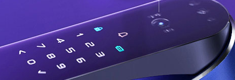{ width="760" loading="lazy" }](cover-lens-customization-cover-lens-customization-for-display-products-diagram-4.png){ .displaywiki-image-link title="Open full-size image" }
</figure>

The coverlens is the most immediately visible part of your user interface. It must retain its appearance over time, whatever the operating environment throws at it – which could be anything from rain or seawater，sunlight, cleaning chemicals, industrial oils, kitchen grease, or household dust.

To provide customized support to our customers, VIEWE, as a display expert, has been studying the latest design trends and manufacturing processes. We also communicate with our supply partners to understand their current capabilities as well as the new innovations and technologies they are developing for the future.

Cut-outs & Custom Shapes

Many of our proven technologies can be very effective in making your Coverlens stand out, providing higher precision and finer surface finish, and ultimately options such as laser cutting regular or irregular shapes.

<figure markdown="span" class="displaywiki-figure">
  [{ width="760" loading="lazy" }](cover-lens-customization-cut-outs-custom-shapes.png){ .displaywiki-image-link title="Open full-size image" }
  <figcaption>Cut-outs & Custom Shapes</figcaption>
</figure>

<figure markdown="span" class="displaywiki-figure">
  [{ width="760" loading="lazy" }](cover-lens-customization-cut-outs-custom-shapes-2.png){ .displaywiki-image-link title="Open full-size image" }
  <figcaption>Cut-outs & Custom Shapes</figcaption>
</figure>

<figure markdown="span" class="displaywiki-figure">
  [{ width="760" loading="lazy" }](cover-lens-customization-cut-outs-custom-shapes-3.png){ .displaywiki-image-link title="Open full-size image" }
  <figcaption>Cut-outs & Custom Shapes</figcaption>
</figure>

<figure markdown="span" class="displaywiki-figure">
  [{ width="760" loading="lazy" }](cover-lens-customization-cover-lens-customization-for-display-products-diagram-8.png){ .displaywiki-image-link title="Open full-size image" }
</figure>

<figure markdown="span" class="displaywiki-figure">
  [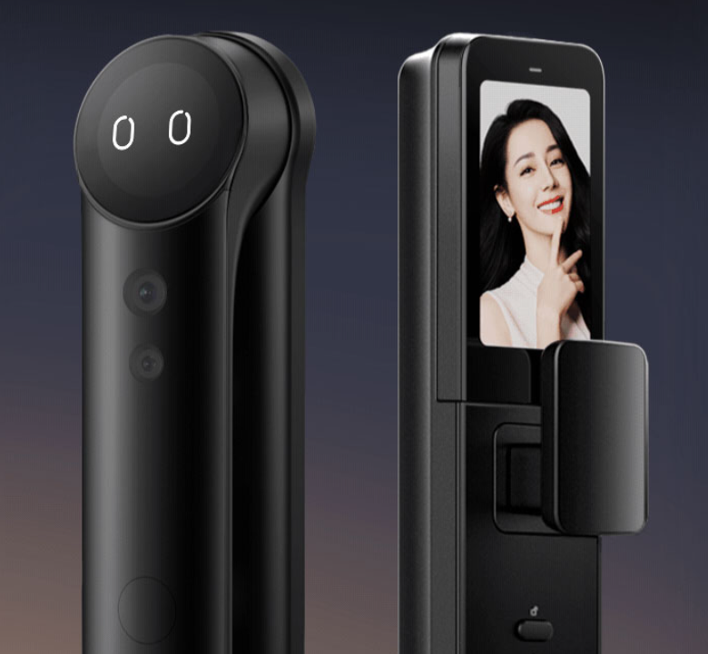{ width="760" loading="lazy" }](cover-lens-customization-cover-lens-customization-for-display-products-diagram-9.png){ .displaywiki-image-link title="Open full-size image" }
</figure>

<figure markdown="span" class="displaywiki-figure">
  [{ width="760" loading="lazy" }](cover-lens-customization-any-cover-glass-shape-can-be-achieved-to-match-your-housing.png){ .displaywiki-image-link title="Open full-size image" }
  <figcaption>• Any cover glass shape can be achieved to match your housing</figcaption>
</figure>

We can provide custom shapes to match the contours of the housing design, as well as holes for cameras, sensors, and mechanical dials and buttons on the cover glass. Can meet your different needs in consumer electronics, industrial control, and automotive electronics.

• Any cover glass shape can be achieved to match your housing

• Holes for peripherals

• Extend touch or print area with oversized cover glass

Logo and Icon Printing

Creatively displaying cover glass is an affordable way to make your HMI stand out.

<figure markdown="span" class="displaywiki-figure">
  [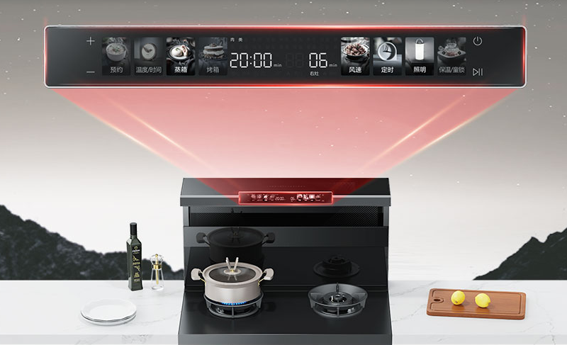{ width="760" loading="lazy" }](cover-lens-customization-creatively-displaying-cover-glass-is-an-affordable-way-to-make-your-hm.png){ .displaywiki-image-link title="Open full-size image" }
  <figcaption>Creatively displaying cover glass is an affordable way to make your HMI stand out</figcaption>
</figure>

<figure markdown="span" class="displaywiki-figure">
  [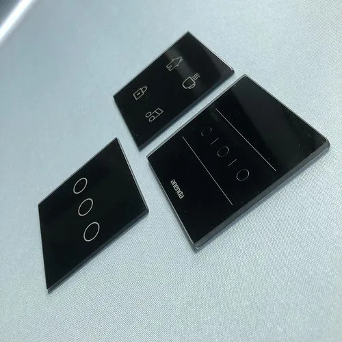{ width="760" loading="lazy" }](cover-lens-customization-brand-identity-with-full-color-logo-printing.png){ .displaywiki-image-link title="Open full-size image" }
  <figcaption>• Brand identity with full-color logo printing</figcaption>
</figure>

<figure markdown="span" class="displaywiki-figure">
  [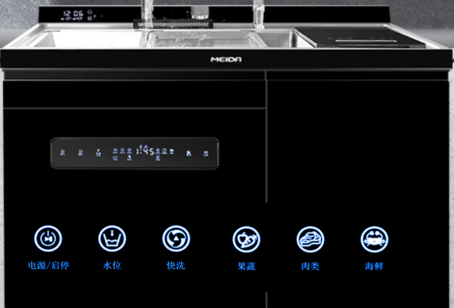{ width="760" loading="lazy" }](cover-lens-customization-brand-identity-with-full-color-logo-printing-2.png){ .displaywiki-image-link title="Open full-size image" }
  <figcaption>• Brand identity with full-color logo printing</figcaption>
</figure>

Anything can be printed onto your cover glass, from company logos to functional icons that can be permanently visible or hidden until lit to add an extra wow factor.

• Brand identity with full-color logo printing

• Icons that can be visible or hidden until lit

• An affordable solution for maximum impact

Hidden logo or icons can be used to create imaginative effects on the surface of the cover lens.

<figure markdown="span" class="displaywiki-figure">
  [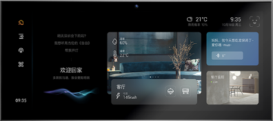{ width="760" loading="lazy" }](cover-lens-customization-hidden-logo-or-icons-can-be-used-to-create-imaginative-effects-on-the.png){ .displaywiki-image-link title="Open full-size image" }
  <figcaption>Hidden logo or icons can be used to create imaginative effects on the surface of the cover lens</figcaption>
</figure>

<figure markdown="span" class="displaywiki-figure">
  [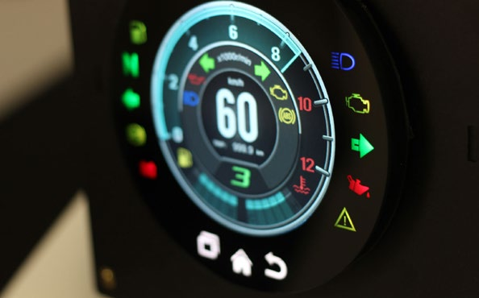{ width="760" loading="lazy" }](cover-lens-customization-stylish-appearance.png){ .displaywiki-image-link title="Open full-size image" }
  <figcaption>• Stylish appearance</figcaption>
</figure>

<figure markdown="span" class="displaywiki-figure">
  [{ width="760" loading="lazy" }](cover-lens-customization-stylish-appearance-2.png){ .displaywiki-image-link title="Open full-size image" }
  <figcaption>• Stylish appearance</figcaption>
</figure>

Display screen of any shape can be lit by LEDs of different colors placed behind the cover and will only turn on, displaying icons, when the relevant function is activated. For example, the battery indicator can light up when the battery is low.

• Stylish appearance

• Simple user interface - only displays the icons in use

• Different colored LEDs can be used to distinguish functions

Glass Alternatives

Both Polymethyl methacrylate (PMMA) and polycarbonate (PC) with high transparency are alternatives to consider when designing covers glass, which makes them visually similar to glass, but with the advantages of being lighter and stronger.

<figure markdown="span" class="displaywiki-figure">
  [{ width="760" loading="lazy" }](cover-lens-customization-lightweight-glass-alternative.png){ .displaywiki-image-link title="Open full-size image" }
  <figcaption>• Lightweight glass alternative</figcaption>
</figure>

<figure markdown="span" class="displaywiki-figure">
  [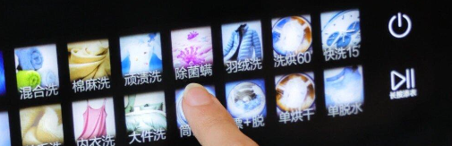{ width="760" loading="lazy" }](cover-lens-customization-lightweight-glass-alternative-2.png){ .displaywiki-image-link title="Open full-size image" }
  <figcaption>• Lightweight glass alternative</figcaption>
</figure>

<figure markdown="span" class="displaywiki-figure">
  [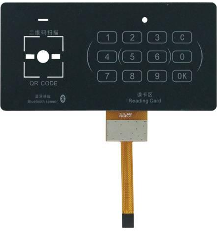{ width="760" loading="lazy" }](cover-lens-customization-lightweight-glass-alternative-3.png){ .displaywiki-image-link title="Open full-size image" }
  <figcaption>• Lightweight glass alternative</figcaption>
</figure>

This type of cover material has excellent impact resistance and, unlike glass, will not shatter. Used in food processing plants and handheld devices

• Lightweight glass alternative

• Excellent impact resistance, will not shatter

• Transparency comparable to glass

Anti-bacterial Protection

Touchscreens are becoming more and more common in our daily lives, anti-bacterial cover lens is necessary in the medical supplies or catering industry.

<figure markdown="span" class="displaywiki-figure">
  [{ width="760" loading="lazy" }](cover-lens-customization-available-as-screen-protector-of-built-into-glass-at-manufacture.png){ .displaywiki-image-link title="Open full-size image" }
  <figcaption>• Available as screen protector of built into glass at manufacture</figcaption>
</figure>

<figure markdown="span" class="displaywiki-figure">
  [{ width="760" loading="lazy" }](cover-lens-customization-available-as-screen-protector-of-built-into-glass-at-manufacture-2.png){ .displaywiki-image-link title="Open full-size image" }
  <figcaption>• Available as screen protector of built into glass at manufacture</figcaption>
</figure>

<figure markdown="span" class="displaywiki-figure">
  [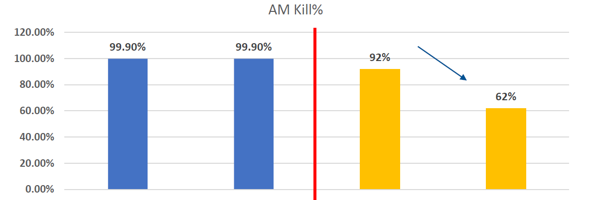{ width="760" loading="lazy" }](cover-lens-customization-available-as-screen-protector-of-built-into-glass-at-manufacture-3.png){ .displaywiki-image-link title="Open full-size image" }
  <figcaption>• Available as screen protector of built into glass at manufacture</figcaption>
</figure>

VIEWECARE Health Display：Antibacterial & Hand-Protection Series have 99% wide range bacteria kill rate, VIEWECARE AM technology keeps your hands sterile and scratch-resistant for long-lasting using.

• Available as screen protector of built into glass at manufacture

• No impact on PCAP or touchscreen functionality

• Lasts for the lifetime of the product

Tinted Glass

Tinting the cover remains an effective and cost-effective way to conceal the visible area when the display is not active.

<figure markdown="span" class="displaywiki-figure">
  [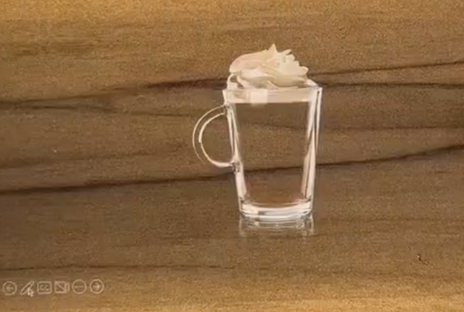{ width="760" loading="lazy" }](cover-lens-customization-all-white-all-black.png){ .displaywiki-image-link title="Open full-size image" }
  <figcaption>All White/All Black</figcaption>
</figure>

<figure markdown="span" class="displaywiki-figure">
  [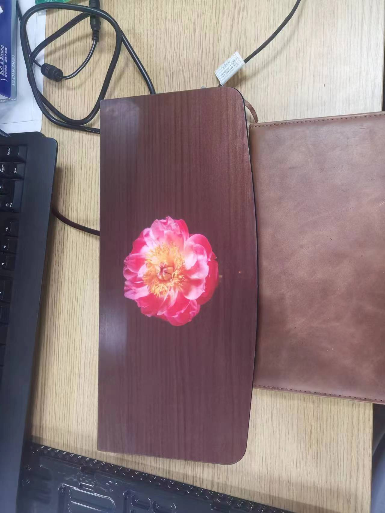{ width="760" loading="lazy" }](cover-lens-customization-all-white-all-black.jpeg){ .displaywiki-image-link title="Open full-size image" }
  <figcaption>All White/All Black</figcaption>
</figure>

<figure markdown="span" class="displaywiki-figure">
  [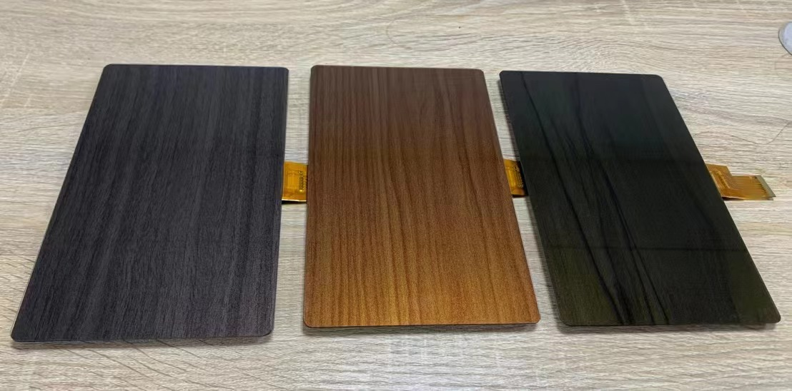{ width="760" loading="lazy" }](cover-lens-customization-all-white-all-black-2.jpeg){ .displaywiki-image-link title="Open full-size image" }
  <figcaption>All White/All Black</figcaption>
</figure>

<figure markdown="span" class="displaywiki-figure">
  [{ width="760" loading="lazy" }](cover-lens-customization-all-white-all-black-2.png){ .displaywiki-image-link title="Open full-size image" }
  <figcaption>All White/All Black</figcaption>
</figure>

<figure markdown="span" class="displaywiki-figure">
  [{ width="760" loading="lazy" }](cover-lens-customization-all-white-all-black-3.png){ .displaywiki-image-link title="Open full-size image" }
  <figcaption>All White/All Black</figcaption>
</figure>

<figure markdown="span" class="displaywiki-figure">
  [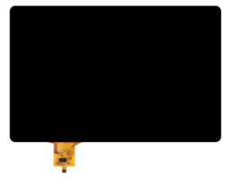{ width="760" loading="lazy" }](cover-lens-customization-all-white-all-black-4.png){ .displaywiki-image-link title="Open full-size image" }
  <figcaption>All White/All Black</figcaption>
</figure>

<figure markdown="span" class="displaywiki-figure">
  [{ width="760" loading="lazy" }](cover-lens-customization-all-white-all-black-5.png){ .displaywiki-image-link title="Open full-size image" }
  <figcaption>All White/All Black</figcaption>
</figure>

Effectively provides a completely black effect and a very stylish look for devices ranging from high-end audio to home appliances and smart home devices.

• Display appears completely black when off

• Provides a sleek, modern look for any device

Oversized Coverglass

Cover size and shape can be customized.

<figure markdown="span" class="displaywiki-figure">
  [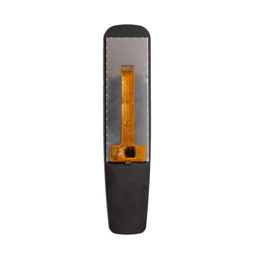{ width="760" loading="lazy" }](cover-lens-customization-cover-size-and-shape-can-be-customized.jpeg){ .displaywiki-image-link title="Open full-size image" }
  <figcaption>Cover size and shape can be customized</figcaption>
</figure>

<figure markdown="span" class="displaywiki-figure">
  [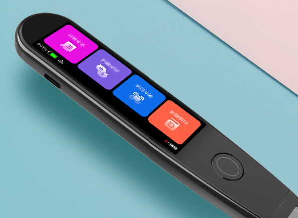{ width="760" loading="lazy" }](cover-lens-customization-cover-size-and-shape-can-be-customized.png){ .displaywiki-image-link title="Open full-size image" }
  <figcaption>Cover size and shape can be customized</figcaption>
</figure>

<figure markdown="span" class="displaywiki-figure">
  [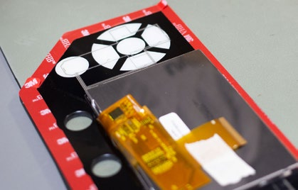{ width="760" loading="lazy" }](cover-lens-customization-cover-size-and-shape-can-be-customized-2.png){ .displaywiki-image-link title="Open full-size image" }
  <figcaption>Cover size and shape can be customized</figcaption>
</figure>

<figure markdown="span" class="displaywiki-figure">
  [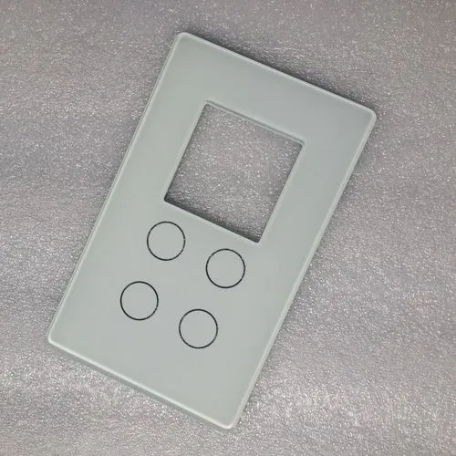{ width="760" loading="lazy" }](cover-lens-customization-cover-size-and-shape-can-be-customized-3.png){ .displaywiki-image-link title="Open full-size image" }
  <figcaption>Cover size and shape can be customized</figcaption>
</figure>

<figure markdown="span" class="displaywiki-figure">
  [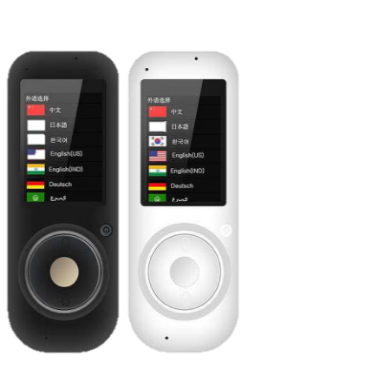{ width="760" loading="lazy" }](cover-lens-customization-cover-lens-customization-for-display-products-diagram-34.png){ .displaywiki-image-link title="Open full-size image" }
</figure>

Extending the cover in any direction beyond the boundaries of the display module allows for the creation of different shapes to integrate other aspects of the user interface and create an overall unified, stylish look.

In addition to extended touch functionality, other features can be added to the extended cover glass, such as additional printing and RF sensors for point-of-sale payments

• Extending the cover glass to add touch functionality

• Adding peripherals such as RF sensors

• Additional space for printed logos

3D/2.5D Shaped Coverglass

2.5D and Circular Shape Lens and three-dimensional shapes such as convex circular displays can be realized.

<figure markdown="span" class="displaywiki-figure">
  [{ width="760" loading="lazy" }](cover-lens-customization-they-can-be-achieved-using-glass-polycarbonate-or-acrylic-pmma.png){ .displaywiki-image-link title="Open full-size image" }
  <figcaption>They can be achieved using glass, polycarbonate or acrylic (PMMA)</figcaption>
</figure>

The space between the display and coverlens is filled with optical-resin, with the touch being tuned so functionality is possible.

Popular applications include smart home devices controls, marine controls and motorcycle clusters.

• A different dimension coverglass

• Touch functionality available

• Optional coverlens of glass or plastic

Optical Bonding

As more displays are used outdoors or in environments with high lighting, display clarity and viewing angles are critical for designers to ensure the best viewing experience.

## Related reading

- [Display Cover Lens Materials, Thickness, and Treatments](cover-lens-materials-treatments.md)
- [Anti-Reflective vs Anti-Glare Display Treatments](anti-reflective-vs-anti-glare.md)
- [Anti-Fingerprint and Antibacterial Cover-Lens Treatments](anti-fingerprint-antibacterial.md)
