

# Cover Lens Customization for Display Products

!!! abstract "Quick answer"
    The cover lens is the first layer the user sees and touches. It has to transmit light, mask everything the eye should not see, take openings that hide connectors, carry printed logos, and accept hard-wear and anti-bacterial coatings, all while fitting 2.5D / 3D shapes and optical bonding. This article works through the nine customization dimensions—material selection, cutting, printing, glass alternatives, anti-bacterial treatment, tinting, oversized formats, shaped (2.5D / 3D) forms, and optical bonding—and gives the engineering meaning, typical patterns, and design limits of each.

## Key Takeaways

- The core cover-lens material is tempered glass; its **lightweight alternatives** are PMMA (acrylic) and PC (polycarbonate).
- **Custom shape** is the foundation of cover-lens customization: camera holes, sensor holes, mechanical dial holes, button holes, and extended touch areas can all be cut by CNC, waterjet, or laser.
- The **printing method** defines the information-layer experience: visible logos, hidden icons that appear when lit, and functional icons, combined with LED backlighting to give dynamic status indication.
- **Tinted glass** (all black / all white) lets a device read as a single dark surface when the screen is off, a popular route for high-end appliances and smart-home products.
- **2.5D / 3D shaping plus optical bonding** is a key point of industrial-design differentiation, used in motorcycle clusters, marine, and smart-home products.

## 1. Cover Lens and Customization Overview

The cover lens is the most directly visible part of the user interface, and it has to keep its appearance over the long term while standing up to rain, seawater, direct sunlight, cleaning chemicals, industrial oils, kitchen grease, and household dust.

As a display customization specialist, VIEWE has long tracked the latest design trends and manufacturing processes, and works with material suppliers to explore new materials, processes, and shapes.

<figure markdown="span" class="displaywiki-figure">
  [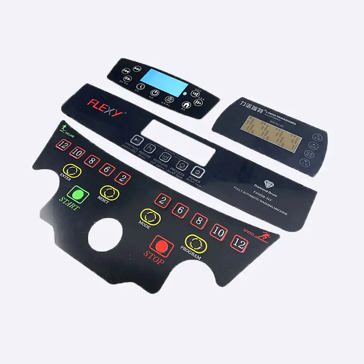{ width="760" loading="lazy" }](cover-lens-customization-coverlens-solutions-for-your-different-products-need.png){ .displaywiki-image-link title="Open full-size image" }
  <figcaption>Cover lens solutions for different products (I).</figcaption>
</figure>

<figure markdown="span" class="displaywiki-figure">
  [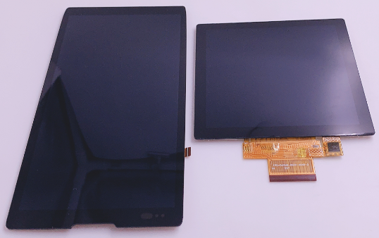{ width="760" loading="lazy" }](cover-lens-customization-coverlens-solutions-for-your-different-products-need-2.png){ .displaywiki-image-link title="Open full-size image" }
  <figcaption>Cover lens solutions for different products (II).</figcaption>
</figure>

<figure markdown="span" class="displaywiki-figure">
  [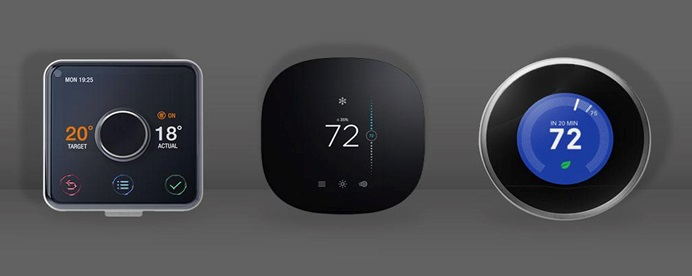{ width="760" loading="lazy" }](cover-lens-customization-coverlens-solutions-for-your-different-products-need.jpeg){ .displaywiki-image-link title="Open full-size image" }
  <figcaption>Cover lens solutions for different products (III).</figcaption>
</figure>

The cover lens can extend beyond the boundary of the display module to add touch or printing, integrating other parts of the UI into a single unified look. It can carry:

- **Extended touch areas**, where the cover lens is larger than the display module.
- **Extra room for printed logos and icons.**
- **Embedded areas for peripherals** such as RF antennas and POS payment modules.

<figure markdown="span" class="displaywiki-figure">
  [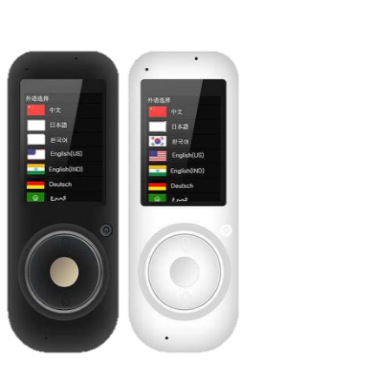{ width="760" loading="lazy" }](cover-lens-customization-cover-lens-customization-for-display-products-diagram-34.png){ .displaywiki-image-link title="Open full-size image" }
  <figcaption>The cover lens can extend well beyond the display area and take a shape that unifies the whole interface, as on these handheld translators with a rounded body and a circular key area.</figcaption>
</figure>

## 2. Cut-outs and Custom Shapes

CNC, waterjet, and laser precision cutting let the cover lens match the contour of the housing closely, while keeping the openings for cameras, sensors, mechanical dials, and buttons.

<figure markdown="span" class="displaywiki-figure">
  [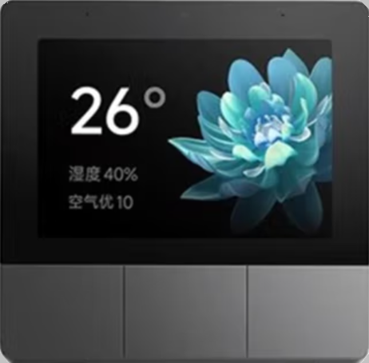{ width="760" loading="lazy" }](cover-lens-customization-cut-outs-custom-shapes.png){ .displaywiki-image-link title="Open full-size image" }
  <figcaption>Cut-outs and custom shapes (I).</figcaption>
</figure>

<figure markdown="span" class="displaywiki-figure">
  [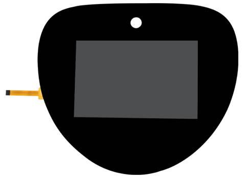{ width="760" loading="lazy" }](cover-lens-customization-cut-outs-custom-shapes-2.png){ .displaywiki-image-link title="Open full-size image" }
  <figcaption>Cut-outs and custom shapes (II).</figcaption>
</figure>

<figure markdown="span" class="displaywiki-figure">
  [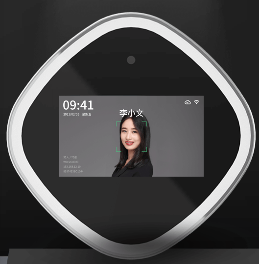{ width="760" loading="lazy" }](cover-lens-customization-cut-outs-custom-shapes-3.png){ .displaywiki-image-link title="Open full-size image" }
  <figcaption>Cut-outs and custom shapes (III).</figcaption>
</figure>

<figure markdown="span" class="displaywiki-figure">
  [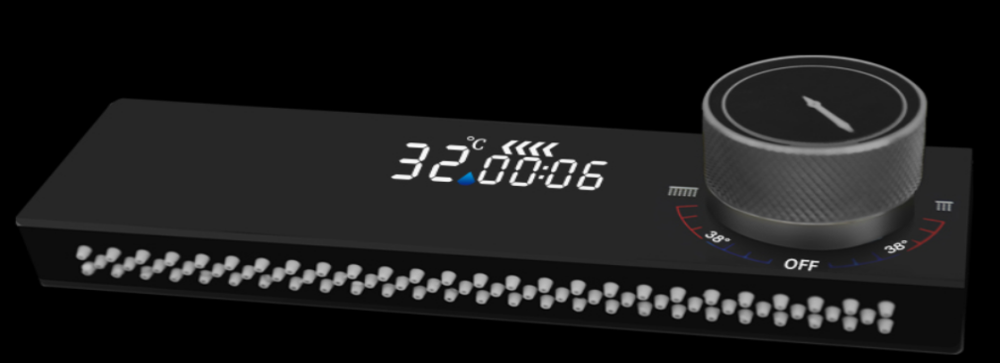{ width="760" loading="lazy" }](cover-lens-customization-cover-lens-customization-for-display-products-diagram-8.png){ .displaywiki-image-link title="Open full-size image" }
  <figcaption>Cover lens shape customization (I): the lens can be cut to a shape that follows the housing.</figcaption>
</figure>

<figure markdown="span" class="displaywiki-figure">
  [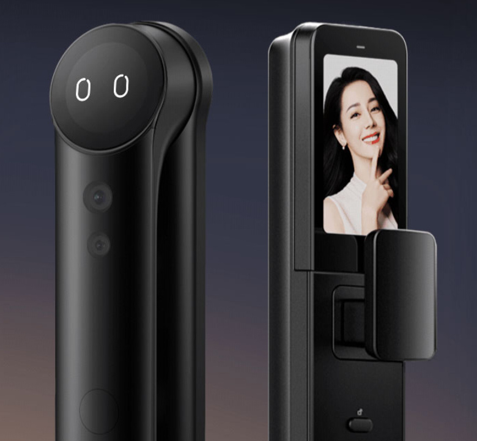{ width="760" loading="lazy" }](cover-lens-customization-cover-lens-customization-for-display-products-diagram-9.png){ .displaywiki-image-link title="Open full-size image" }
  <figcaption>Cover lens shape customization (II): corners, cut-outs, and openings are all part of the lens geometry.</figcaption>
</figure>

<figure markdown="span" class="displaywiki-figure">
  [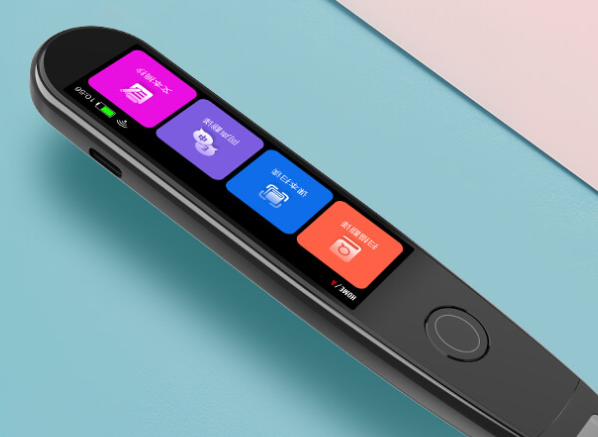{ width="760" loading="lazy" }](cover-lens-customization-cover-size-and-shape-can-be-customized.png){ .displaywiki-image-link title="Open full-size image" }
  <figcaption>Cover lens size and shape can be customized.</figcaption>
</figure>

<figure markdown="span" class="displaywiki-figure">
  [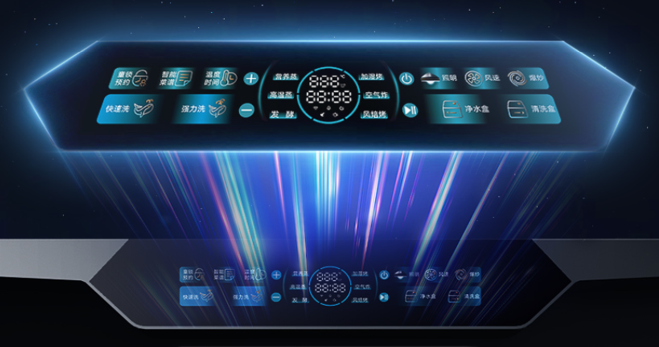{ width="760" loading="lazy" }](cover-lens-customization-any-cover-glass-shape-can-be-achieved-to-match-your-housing.png){ .displaywiki-image-link title="Open full-size image" }
  <figcaption>Any cover lens outline can be achieved to match the housing.</figcaption>
</figure>

<figure markdown="span" class="displaywiki-figure">
  [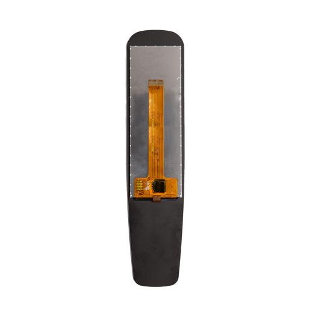{ width="760" loading="lazy" }](cover-lens-customization-cover-size-and-shape-can-be-customized.jpeg){ .displaywiki-image-link title="Open full-size image" }
  <figcaption>Custom cover lens, rear face: the FPC and the bonding area are laid out to fit the housing.</figcaption>
</figure>

<figure markdown="span" class="displaywiki-figure">
  [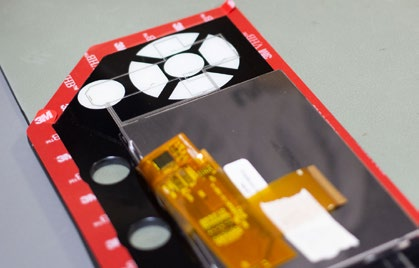{ width="760" loading="lazy" }](cover-lens-customization-cover-size-and-shape-can-be-customized-2.png){ .displaywiki-image-link title="Open full-size image" }
  <figcaption>A custom cover lens with round cut-outs and a flex tail, shown on its protective liner.</figcaption>
</figure>

<figure markdown="span" class="displaywiki-figure">
  [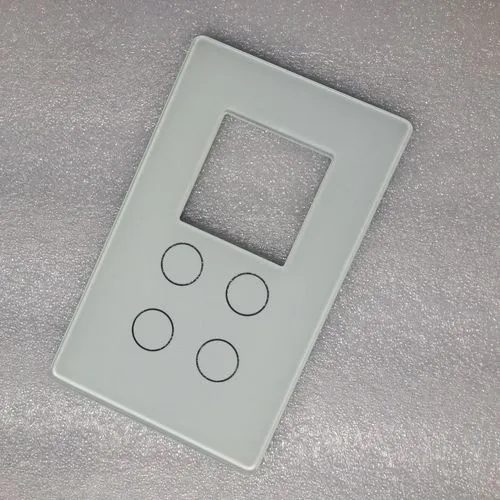{ width="760" loading="lazy" }](cover-lens-customization-cover-size-and-shape-can-be-customized-3.png){ .displaywiki-image-link title="Open full-size image" }
  <figcaption>A custom cover lens with a display window and four button holes.</figcaption>
</figure>

Cover-lens shape customization includes:

- **Any outline**, to match the contour of the housing.
- **Precise openings for peripheral components** (camera, sensors, buttons, mechanical dials).
- **Oversized cover lenses**, covering extended touch or printing areas.

## 3. Logo and Icon Printing

Printing creatively on the cover lens is an affordable way to make the human-machine interface (HMI) stand out.

<figure markdown="span" class="displaywiki-figure">
  [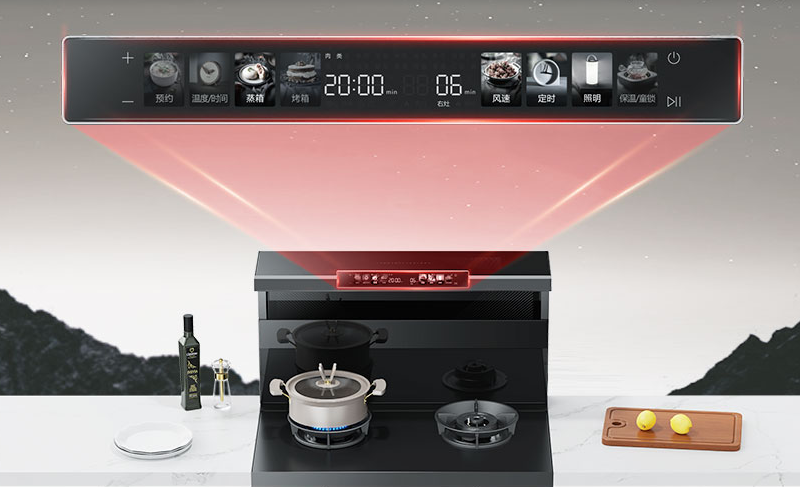{ width="760" loading="lazy" }](cover-lens-customization-creatively-displaying-cover-glass-is-an-affordable-way-to-make-your-hm.png){ .displaywiki-image-link title="Open full-size image" }
  <figcaption>Creatively displaying the cover lens is an affordable way to make the HMI stand out.</figcaption>
</figure>

<figure markdown="span" class="displaywiki-figure">
  [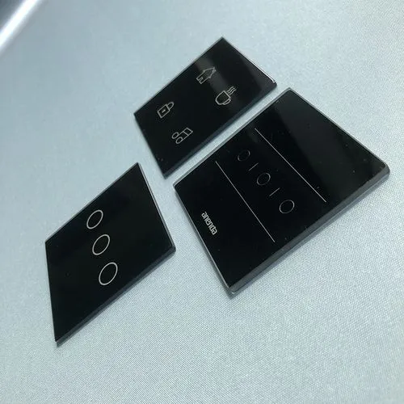{ width="760" loading="lazy" }](cover-lens-customization-brand-identity-with-full-color-logo-printing.png){ .displaywiki-image-link title="Open full-size image" }
  <figcaption>Brand identity with full-color logo printing.</figcaption>
</figure>

<figure markdown="span" class="displaywiki-figure">
  [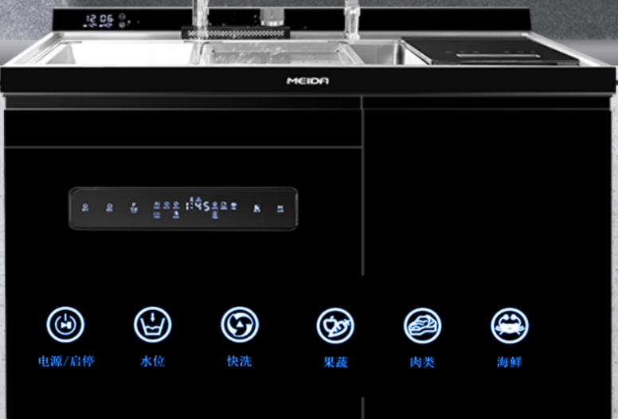{ width="760" loading="lazy" }](cover-lens-customization-brand-identity-with-full-color-logo-printing-2.png){ .displaywiki-image-link title="Open full-size image" }
  <figcaption>A full-color printed control panel on a kitchen appliance.</figcaption>
</figure>

The options include:

- **Full-color logo printing for brand identity**: put the brand mark and color system directly on the cover lens.
- **Visible or hidden icons**: invisible when unlit, appearing when lit.
- **A budget-friendly way to differentiate.**

## 4. Hidden and Decorative Displays

The graphic to be shown is first printed on the back of the cover lens in semi-transparent ink, where it stays invisible; backlit by LEDs behind the cover lens, it lights up and becomes visible.

<figure markdown="span" class="displaywiki-figure">
  [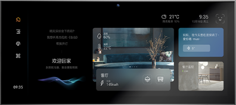{ width="760" loading="lazy" }](cover-lens-customization-hidden-logo-or-icons-can-be-used-to-create-imaginative-effects-on-the.png){ .displaywiki-image-link title="Open full-size image" }
  <figcaption>Hidden icons create imaginative effects on the surface of the cover lens.</figcaption>
</figure>

<figure markdown="span" class="displaywiki-figure">
  [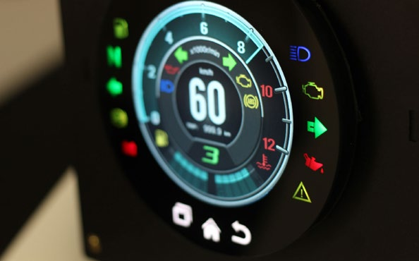{ width="760" loading="lazy" }](cover-lens-customization-stylish-appearance.png){ .displaywiki-image-link title="Open full-size image" }
  <figcaption>Backlit decorative icons on an instrument cluster: only the icons in use are shown.</figcaption>
</figure>

<figure markdown="span" class="displaywiki-figure">
  [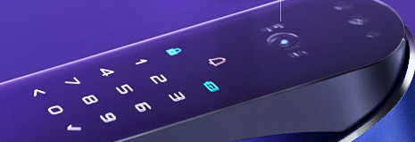{ width="760" loading="lazy" }](cover-lens-customization-cover-lens-customization-for-display-products-diagram-4.png){ .displaywiki-image-link title="Open full-size image" }
  <figcaption>Printed and backlit cover lens on a smart-lock keypad. Graphics like these sit on the outer surface, so the finish has to survive rain, sunlight, cleaning chemicals, oils, and dust.</figcaption>
</figure>

Tinting the cover is an effective, low-cost way to conceal the viewing area while the display is off.

<figure markdown="span" class="displaywiki-figure">
  [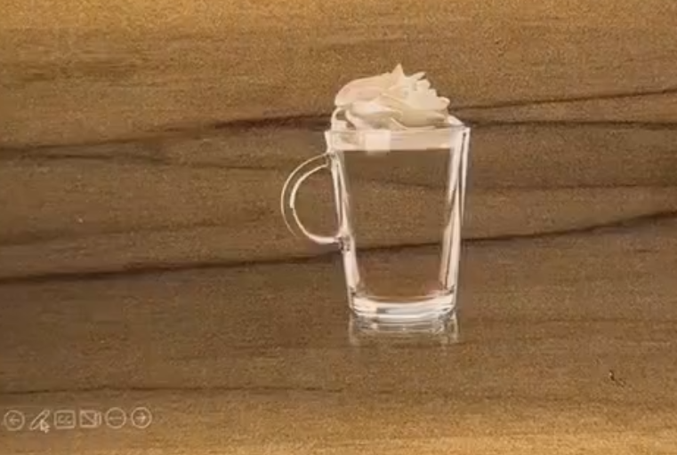{ width="760" loading="lazy" }](cover-lens-customization-all-white-all-black.png){ .displaywiki-image-link title="Open full-size image" }
  <figcaption>Wood-grain decorative display, screen on (I).</figcaption>
</figure>

<figure markdown="span" class="displaywiki-figure">
  [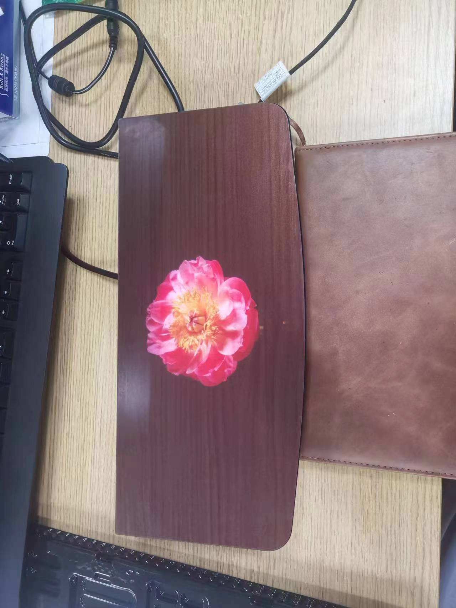{ width="760" loading="lazy" }](cover-lens-customization-all-white-all-black.jpeg){ .displaywiki-image-link title="Open full-size image" }
  <figcaption>Wood-grain decorative display, screen on (II).</figcaption>
</figure>

<figure markdown="span" class="displaywiki-figure">
  [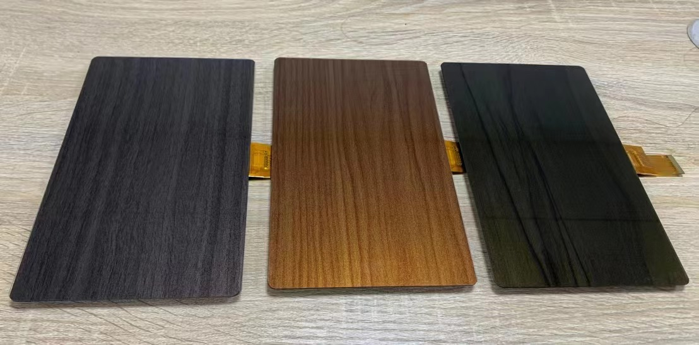{ width="760" loading="lazy" }](cover-lens-customization-all-white-all-black-2.jpeg){ .displaywiki-image-link title="Open full-size image" }
  <figcaption>Wood-grain decorative display, screen off.</figcaption>
</figure>

<figure markdown="span" class="displaywiki-figure">
  [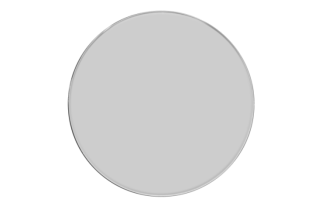{ width="760" loading="lazy" }](cover-lens-customization-all-white-all-black-2.png){ .displaywiki-image-link title="Open full-size image" }
  <figcaption>All-white front, screen on.</figcaption>
</figure>

<figure markdown="span" class="displaywiki-figure">
  [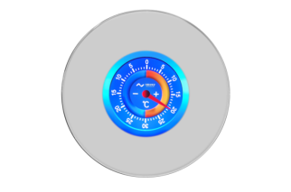{ width="760" loading="lazy" }](cover-lens-customization-all-white-all-black-3.png){ .displaywiki-image-link title="Open full-size image" }
  <figcaption>All-white front, screen off.</figcaption>
</figure>

<figure markdown="span" class="displaywiki-figure">
  [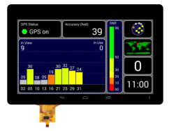{ width="760" loading="lazy" }](cover-lens-customization-all-white-all-black-5.png){ .displaywiki-image-link title="Open full-size image" }
  <figcaption>All-black front, screen on.</figcaption>
</figure>

<figure markdown="span" class="displaywiki-figure">
  [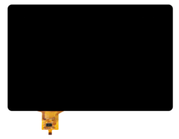{ width="760" loading="lazy" }](cover-lens-customization-all-white-all-black-4.png){ .displaywiki-image-link title="Open full-size image" }
  <figcaption>All-black front, screen off.</figcaption>
</figure>

The effect:

- **When the screen is off, it blends into the overall device color.**
- **A unified, elegant, modern look.**
- Suited to design-led products such as high-end audio, home appliances, smart-home products, and coffee machines.

## 5. Glass Alternatives

High-transparency **PMMA (polymethyl methacrylate, acrylic)** and high-transparency **PC (polycarbonate)** are common glass alternatives: visually close to glass, but lighter and more impact-resistant.

<figure markdown="span" class="displaywiki-figure">
  [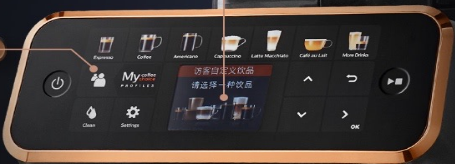{ width="760" loading="lazy" }](cover-lens-customization-lightweight-glass-alternative.png){ .displaywiki-image-link title="Open full-size image" }
  <figcaption>Lightweight glass alternative (I).</figcaption>
</figure>

<figure markdown="span" class="displaywiki-figure">
  [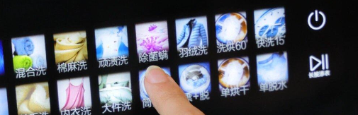{ width="760" loading="lazy" }](cover-lens-customization-lightweight-glass-alternative-2.png){ .displaywiki-image-link title="Open full-size image" }
  <figcaption>Lightweight glass alternative (II).</figcaption>
</figure>

<figure markdown="span" class="displaywiki-figure">
  [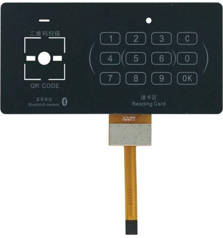{ width="760" loading="lazy" }](cover-lens-customization-lightweight-glass-alternative-3.png){ .displaywiki-image-link title="Open full-size image" }
  <figcaption>Lightweight glass alternative (III).</figcaption>
</figure>

Features:

- **Lightweight**: 40%–50% lighter than glass.
- **Tough**: impact-resistant, and will not shatter.
- **Transparency**: close to glass.

These materials suit medical devices, portable products, wearables, and appliance touch areas. When greater impact resistance is needed (children's products, mobile use), favor PMMA / PC; otherwise favor glass for scratch resistance and clarity.

## 6. Anti-bacterial Protection

As touch screens become more common in daily life, anti-bacterial capability has become a hard requirement in medical, catering, education, and home scenarios.

<figure markdown="span" class="displaywiki-figure">
  [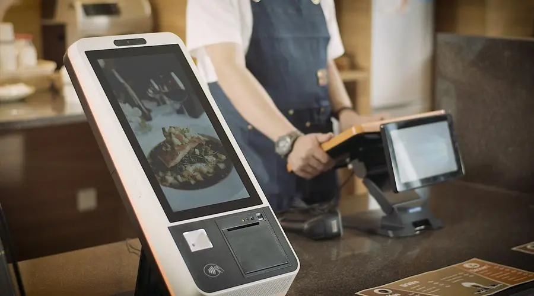{ width="760" loading="lazy" }](cover-lens-customization-available-as-screen-protector-of-built-into-glass-at-manufacture.png){ .displaywiki-image-link title="Open full-size image" }
  <figcaption>Available as a screen protector or built into the glass at manufacture (I).</figcaption>
</figure>

<figure markdown="span" class="displaywiki-figure">
  [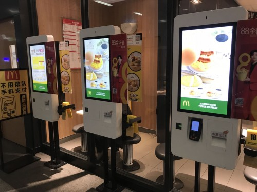{ width="760" loading="lazy" }](cover-lens-customization-available-as-screen-protector-of-built-into-glass-at-manufacture-2.png){ .displaywiki-image-link title="Open full-size image" }
  <figcaption>Available as a screen protector or built into the glass at manufacture (II).</figcaption>
</figure>

<figure markdown="span" class="displaywiki-figure">
  [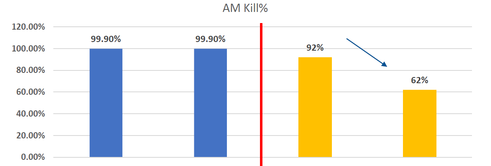{ width="760" loading="lazy" }](cover-lens-customization-available-as-screen-protector-of-built-into-glass-at-manufacture-3.png){ .displaywiki-image-link title="Open full-size image" }
  <figcaption>Available as a screen protector or built into the glass at manufacture (III).</figcaption>
</figure>

VIEWE health display: the **anti-bacterial and hand-protection series** reaches a 99% kill rate against common bacteria.

- **Form**: available as built-in glass (merged at the glass production stage) or as an external screen protector.
- **No touch impact**: no interference with PCAP projected-capacitive touch screens.
- **Service life**: equal to the lifetime of the cover lens.

## 7. 2.5D / 3D Shaped Cover Lens

A shaped cover lens can extend from a single plane to a curved or even three-dimensional form, blending deeply with the product design.

<figure markdown="span" class="displaywiki-figure">
  [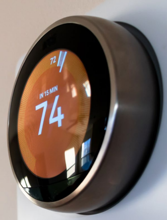{ width="760" loading="lazy" }](cover-lens-customization-they-can-be-achieved-using-glass-polycarbonate-or-acrylic-pmma.png){ .displaywiki-image-link title="Open full-size image" }
  <figcaption>2.5D, circular, and three-dimensional cover lenses can be made from glass, polycarbonate, or acrylic (PMMA).</figcaption>
</figure>

The gap between the display and the cover lens is filled with optical resin to bond them (see [Air vs Optical Bonding](air-vs-optical-bonding.md)).

Popular applications: smart-home control panels, marine and ship controls, motorcycle instrument clusters, and automotive displays.

!!! warning "Volume-production note"
    For volume production or harsh conditions (high and low temperature, damp heat, vibration, ESD), check the datasheet curve for this parameter; exceeding the range will significantly shorten lifetime.

<figure markdown="span" class="displaywiki-figure">
  [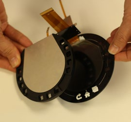{ width="760" loading="lazy" }](cover-lens-customization-stylish-appearance-2.png){ .displaywiki-image-link title="Open full-size image" }
  <figcaption>A shaped cover lens with integrated touch icons.</figcaption>
</figure>

Features:

- Cover lenses can be customized in different sizes.
- Touch functionality can be integrated.
- A glass or plastic substrate can be chosen.

## 8. Optical Bonding

As more devices are used outdoors or in high-brightness environments, **display clarity and viewing angle** become design-critical. Optical bonding fills the gap between the display and the cover lens with optical resin, to remove the air layer and improve readability in strong light.

<figure markdown="span" class="displaywiki-figure">
  [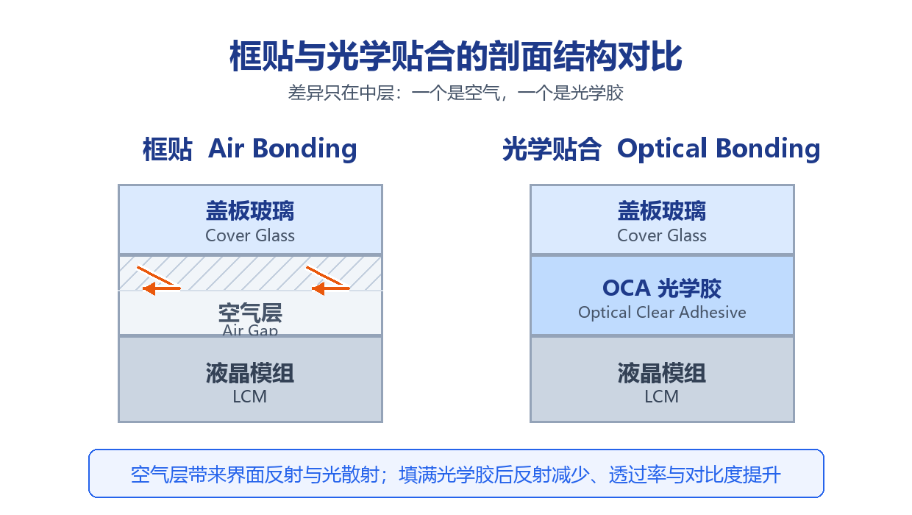{ width="760" loading="lazy" }](cover-lens-optical-bonding-diagram.png){ .displaywiki-image-link title="Open full-size image" }
  <figcaption>Cross-section comparison of frame bonding and optical bonding: the two differ only in the middle layer. Frame bonding leaves an air gap between the cover lens and the liquid-crystal module, and interface reflection and scattering add optical loss; optical bonding fills the gap with OCA optical adhesive, which reduces reflection and raises transmittance and contrast at the same time.</figcaption>
</figure>

See [Air vs Optical Bonding](air-vs-optical-bonding.md) for the process details and the comparison.

## 9. Frequently Asked Questions

??? question "Q1: Should the cover lens be glass, PMMA, or PC?"
    Glass: scratch-resistant, highest transmittance, good thermal stability, and easy to coat with AG / AR / AF; **the first choice for consumer, industrial, medical, and automotive products**. PMMA: slightly lower but still glass-like transmittance, light, **not brittle but relatively easy to scratch**, suited to appliances, desktop devices, and smart-home products. PC: the strongest impact resistance, slightly lower transmittance, **preferred for impact-heavy scenarios** such as children's products and wearables.

??? question "Q2: How do I make the device blend into the housing when the screen is off?"
    The approach is **all-black printing (black adhesive / black ink)**: print opaque black ink on the non-viewing area of the back of the cover lens (the side facing the display) to mask the mechanical structure outside the viewing area and the coating reflections. **The key point is that the printed boundary must align precisely with the LCD viewing area**, or light will leak. The VIEWE factory holds alignment to ± 0.2 mm.

??? question "Q3: How are hidden icons made?"
    The principle behind hidden icons is **semi-transparent ink plus LED backlighting**: print semi-transparent ink on the back of the glass in the shape of the intended icon, so it is almost invisible when unlit; when the LED lights up, the ink lets the graphic show through. This gives a UI that stays clean in use and appears on demand.

??? question "Q4: How do I choose the cover-lens glass thickness?"
    Consumer electronics mainstream at 0.5–0.7 mm; automotive and industrial viewing at 1.1–1.8 mm; oversized or 3D-shaped at 2.0–3.0 mm. **The thicker the glass, the stiffer it is, but the heavier, and the more it affects transmittance and touch sensitivity**.

??? question "Q5: Does an anti-bacterial coating affect touch?"
    Proper **surface-type** or **glass-internal** anti-bacterial coatings do not affect PCAP touch; **silver-ion anti-bacterial films need their transparency checked**, and metal-oxide nano types (TiO₂, ZnO) suit high-transparency scenarios better.

??? question "Q6: How do I choose between a 2.5D and a 3D cover lens?"
    2.5D: rounded edges, paired with a flat LCD, mature process, controllable cost, and moderate bonding difficulty. 3D: a curved cover lens, usually paired with curved or shaped displays, **harder to optically bond**, and often requiring hot bending in a mold followed by edge grinding; **low-volume** projects that cannot be scaled up favor 3D, while **high-volume** projects favor 2.5D.

## Related reading

- [Display Cover Lens Materials, Thickness, and Treatments](cover-lens-materials-treatments.md)
- [Anti-Reflective vs Anti-Glare Display Treatments](anti-reflective-vs-anti-glare.md)
- [Anti-Fingerprint and Antibacterial Cover-Lens Treatments](anti-fingerprint-antibacterial.md)
- [Air vs Optical Bonding](air-vs-optical-bonding.md)

!!! info "Can't find what you need?"
    If you need more products, resources or support, please contact our team:

    [**:material-archive-arrow-down: Knowledge Base**](../../knowledge/tags.md){ .md-button .md-button--primary }
    [**:material-magnify: Products & Solutions**](https://viewedisplay.com/){ .md-button }
    [**:material-email: Contact Support**](mailto:support@viewedisplay.com){ .md-button }
