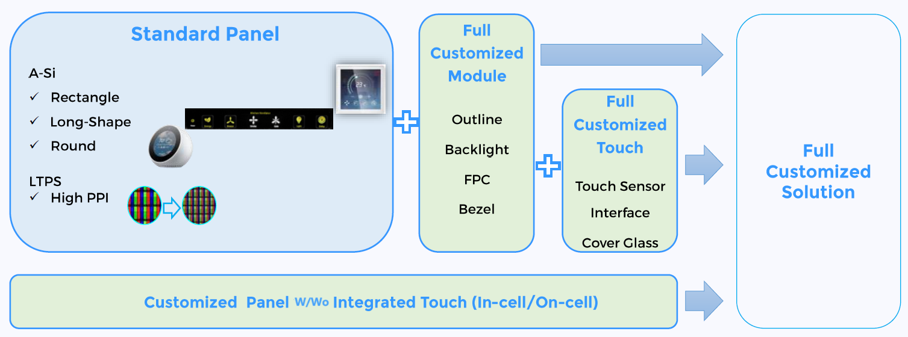
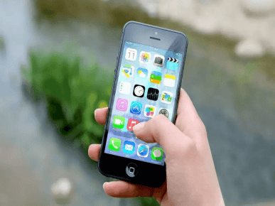
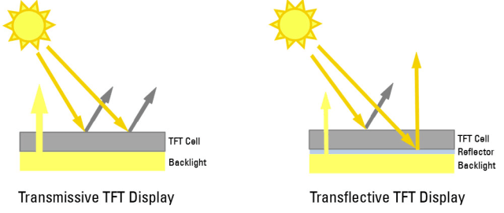
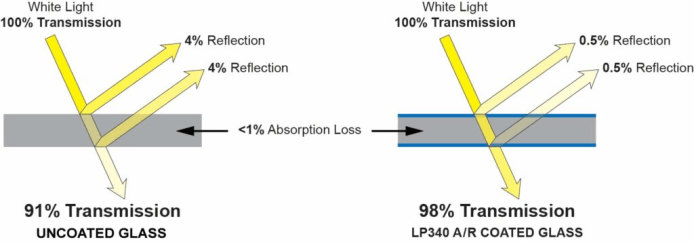
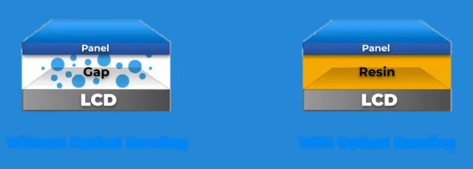
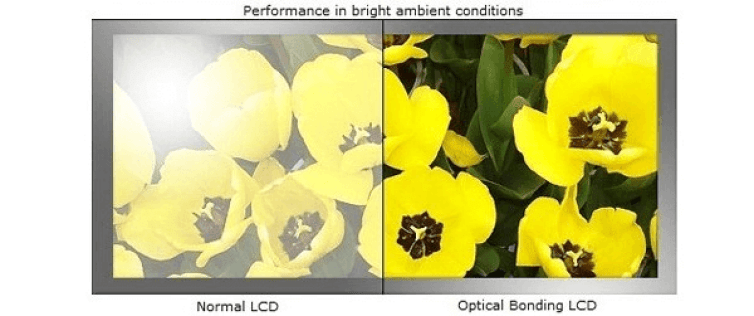

# Custom and Sunlight-Readable Display Solutions

!!! abstract "Quick answer"
    This guide explains sunlight readable display solutions, the relevant design trade-offs, and the points engineers should verify when selecting a display solution.

## Key Takeaways

- Learn sunlight readable display solutions, key trade-offs, applications, and engineering selection criteria.
- Use the guidance below to compare the relevant technologies and design trade-offs.
- Validate optical, electrical, mechanical, environmental, and production requirements before final selection.

## Display Solutions

TFT Display Structure:

<figure markdown="span" class="displaywiki-figure">
  [{ width="760" loading="lazy" }](custom-sunlight-readable-displays-tft-display-structure.jpeg){ .displaywiki-image-link title="Open full-size image" }
  <figcaption>TFT Display Structure</figcaption>
</figure>

<figure markdown="span" class="displaywiki-figure">
  [{ width="760" loading="lazy" }](custom-sunlight-readable-displays-customize-solution.gif){ .displaywiki-image-link title="Open full-size image" }
  <figcaption>Customize Solution</figcaption>
</figure>

TFT customize Ability:

<figure markdown="span" class="displaywiki-figure">
  [{ width="760" loading="lazy" }](custom-sunlight-readable-displays-tft-customize-ability.png){ .displaywiki-image-link title="Open full-size image" }
  <figcaption>TFT customize Ability</figcaption>
</figure>

VIEWE can provide the display customization including TFT panel (Size, Resolution, Specifications …), Backlight (Brightness, Outline dimension…), FPC/PCB (interface, connector, cable…), Touch Panel, Cover Glass fully for customers’ product applications.

VIEWE has many decades of experience in the design of customized display solutions. For many years we help our customers to design and perform semi and fully customized display solutions. VIEWE is a professional display manufacturer, that's why we can provide clients the perfect solutions for their products since we own know-how of the display manufacturing process and our sales and engineering teams will be with our customers through the entire development process and will ensure the semi or fully customization a successful display tailored made to each individual application.

### Sunlight Readable Solutions

#### Introduction

When display devices are brought outside, oftentimes they face the brightness of sunlight or any other form of high ambient light sources reflecting off of and overwhelming the LED backlight’s image.

With the growth of the LCD panel industry, it has become more important than ever to prevent the sun’s wash out of displays used outdoors, such as automobile displays, digital signage, and public kiosks. Hence, the sunlight readable display was invented.

<figure markdown="span" class="displaywiki-figure">
  [{ width="760" loading="lazy" }](custom-sunlight-readable-displays-high-brightness-for-tft-lcd.jpeg){ .displaywiki-image-link title="Open full-size image" }
  <figcaption>High Brightness for TFT LCD</figcaption>
</figure>

One solution would be to increase the luminance of the TFT LCD monitor’s LED backlight to overpower the bright sunlight and eliminate glare. On average, TFT LCD screens have a brightness of about 250 to 450 Nits, but when this is increased to about 800 to 1000 (1000 is the most common) Nits, the device becomes a high bright LCD and a sunlight readable display.

Doing this is an affordable option for enhancement of image quality in the outdoors, including features like contrast ratio and viewing angle, in a common use setting like with phones.

<figure markdown="span" class="displaywiki-figure">
  [{ width="760" loading="lazy" }](custom-sunlight-readable-displays-custom-and-sunlight-readable-display-solutions-diagram-5.png){ .displaywiki-image-link title="Open full-size image" }
</figure>

Since many of today’s TFT LCD display devices have shifted to touchscreens, the touch panels on the surface of LCD screens already block a small percentage of backlighting, decreasing the surface brightness and making it so that the sunlight can even more easily wash out the display. Resistive touch panels use two transparent layers above the glass substrate, but the transparent layers can still block up to 5% of the light.

In order to optimize the high brightness of the backlight, a different type of touchscreen can be used: the capacitive touchscreen. Though it is more expensive than the resistive touch screen, this technology is more ideal for sunlight readable displays than the resistive due to its usage of a thinner film or even in-cell technologies rather than two layers above the glass of the display, and therefore, light can pass more efficiently.

Disadvantages of High Brightness LCDs

However, with this method comes a list of potential problems. Firstly, high brightness displays result in much greater power consumption and shorter battery life. In order to shed more light, more power will be needed which can also consequently result in device overheating which can also shorten battery life. If the backlight’s power is increased, the LED’s half-life may also be reduced.

Second, the brightness bring heat problem for electronic devices: Higer brightness, more power consumption and Heat, it’s disturbing.

Then, While in bright exterior light settings, these devices reduce eye strain as the user attempts to view the image on screen, the brightness of the display itself can also cause eye strain, seen as the brightness may overwhelm your eyes. Many devices allow the user to adjust brightness, so this concern is oftentimes not too severe.

Finally, High brightness display cannot be used if outdoor environment is very sunny. The intense sunlight shines on the screen, and the strong reflected light will make the display screen hard to see clearly.

#### Transflective TFT LCD

A recent technology falling into the sunlight readable display category is the transflective TFT LCD, coming from a combination of the word transmissive and reflective. By using a transflective polarizer, a significant percentage of sunlight is reflected away from the screen to aid in the reduction of wash out. This optical layer is known as the transflector.

In transflective TFT LCDs, sunlight can reflect off the display but can also pass through the TFT cell layer and be reflected back out off a somewhat transparent rear reflector in front of the backlight, illuminating the display without as much demand and power usage from the transmissive nature of the backlight. This addresses both the issues of wash out and the disadvantages of high brightness TFT LCDs in high ambient light environments. Because of its transmissive and reflective modes, this type of device is very useful for devices that will be used outdoors but also indoors.

<figure markdown="span" class="displaywiki-figure">
  [{ width="760" loading="lazy" }](custom-sunlight-readable-displays-surface-treatment-ar-ag.png){ .displaywiki-image-link title="Open full-size image" }
  <figcaption>Surface Treatment: AR AG</figcaption>
</figure>

While it does greatly reduce power consumption, transflective LCDs are much more expensive than high brightness LCDs. In recent years, the cost has decreased, but transflective LCDs continue to be more costly.

#### Surface Treatment: AR AG

In addition to adjustments to the internal mechanics of LCDs, it is possible to make devices more sunlight-readable using surface treatments. The most common are anti-reflective (AR) films/glass and anti-glare processing.

Anti-reflective focuses on depositing multiple transparent thin film layers. With the thicknesses, structures, and properties of each individual layer composing the film, reflecting light wavelengths are changed, and thus less light is reflected.

<figure markdown="span" class="displaywiki-figure">
  [{ width="760" loading="lazy" }](custom-sunlight-readable-displays-custom-and-sunlight-readable-display-solutions-diagram-7.png){ .displaywiki-image-link title="Open full-size image" }
</figure>

When anti-glare is used, reflected light is fragmented. Using a rough surface as opposed to a smooth one, anti-glare treatments can reduce the reflection’s disruption of the actual image of the display.

<figure markdown="span" class="displaywiki-figure">
  [{ width="760" loading="lazy" }](custom-sunlight-readable-displays-these-two-solutions-can-also-be-combined-which-is-greatly-useful-in-ou.png){ .displaywiki-image-link title="Open full-size image" }
  <figcaption>These two solutions can also be combined, which is greatly useful in outdoor displays</figcaption>
</figure>

Detailed info please refer to Surface Treatment Solutions

#### Optical Bonding

Often paired with other methods of creating sunlight readable displays is optical bonding. By gluing the glass of a display to the TFT LCD panels beneath it, optical bonding eliminates the air gap that traditional LCD displays have in them using an optical grade adhesive.

<figure markdown="span" class="displaywiki-figure">
  [{ width="760" loading="lazy" }](custom-sunlight-readable-displays-optical-bonding.png){ .displaywiki-image-link title="Open full-size image" }
  <figcaption>Optical Bonding</figcaption>
</figure>

This adhesive reduces the amount of reflection between the glass and LCD panel as well as the reflection of external ambient light. Doing this helps provide a clearer image with an increased contrast ratio, or the difference in the light intensity of the brightest white pixel color and darkest black pixel color.

<figure markdown="span" class="displaywiki-figure">
  [{ width="760" loading="lazy" }](custom-sunlight-readable-displays-custom-and-sunlight-readable-display-solutions-diagram-10.png){ .displaywiki-image-link title="Open full-size image" }
</figure>

With this contrast ratio improvement, optical bonding addresses the root issue with unreadable outdoor displays: the contrast. Though an increase in brightness can improve contrast, by fixing the contrast itself, LCD display images in outdoor environments will not be as washed out and will require less power consumption.

<figure markdown="span" class="displaywiki-figure">
  [{ width="760" loading="lazy" }](custom-sunlight-readable-displays-custom-and-sunlight-readable-display-solutions-diagram-11.png){ .displaywiki-image-link title="Open full-size image" }
</figure>

Besides the visual display advantages that optical bonding provides, this adhesive improves the display in several other ways:

1. The first being durability, optical bonding eliminates the air gap within the device and replaces it with a hardened adhesive that can act as a shock absorber.

2. Touch screens with optical bonding gain, accuracy in where the point of contact is between the touch and screen. What is known as parallax, the refraction angle of light, can make it seem that the point of contact and the actual point on the display are different. When the adhesive is used, this refraction is minimized, if not reduced.

3. The optical bonding adhesive’s elimination of the air gap also protects the LCD from moisture/fogging and dust, as there is no space for impurities to penetrate and remain under the glass layer. This especially helps with maintaining the state of LCDs in transport, storage, and humid environments.

The optical bonding of LCD consists of three main stages:

Preparation stage – first we need to select appropriate optical clear adhesive and take care of surface decontamination.

Glue dispensing / OCA adhere – here we apply the optically clear adhesive on the whole display surface.

Bonding and curing – touch panel is carefully layered onto the LCD, avoiding any gaps or bubbles. Then the adhesive hardens with UV light.

#### Conclusion

Compiling the various methods of improving LCD screens for sunlight readability, these devices can be optimized in high ambient light settings. An anti-glare coating is applied to the surface of the glass and anti-reflective coatings are applied to both the front and back. The transflector is also used in front of the backlight. These features can result in 1000 Nit or more display lighting, without the excessive power consumption and heat production through a high brightness backlight, consequently allowing for a longer lasting and better performing LCD

Unfortunately, the process of building a reflector inside TFT LCD is complicated and transflective TFT LCD is normally several times higher cost compared with normal transmissive TFT LCD.

To further improve and enhance the qualities of the LCD, LED and cold cathode fluorescent lamp (CCFL) backlights are used. Both these create bright displays, but the LED specifically can do so without as much power consumption and heat generation as compared to the CCFL option. Optical bonding is also applied in order to improve display contrast, leading to a more efficient and better quality sunlight readable display.

<figure markdown="span" class="displaywiki-figure">
  [{ width="760" loading="lazy" }](custom-sunlight-readable-displays-normal-tft-sun-readable-tft.png){ .displaywiki-image-link title="Open full-size image" }
  <figcaption>Normal TFT Sun Readable TFT</figcaption>
</figure>

## Related reading

- [High-Reliability Display Solutions](high-reliability-displays.md)
- [UART Smart Display Solutions](uart-smart-display.md)
- [IoT and AIoT Smart Display Solutions](iot-aiot-display.md)
