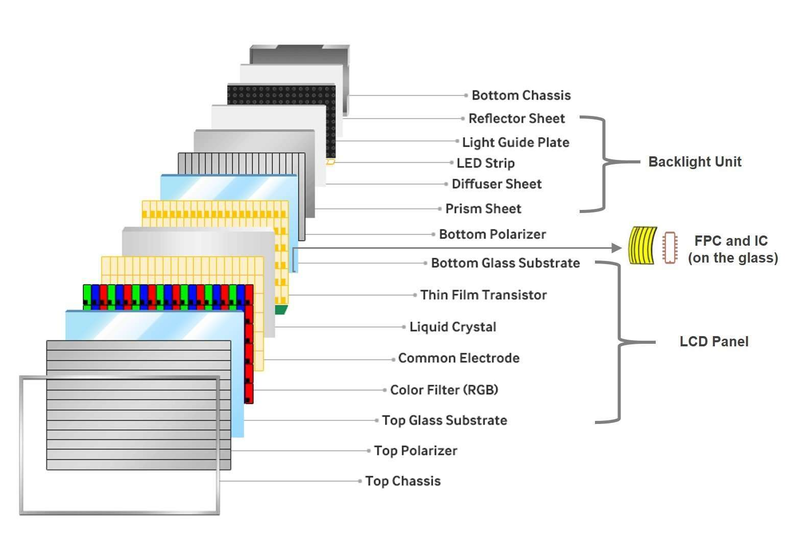
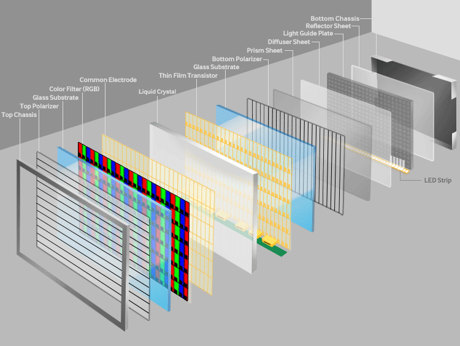
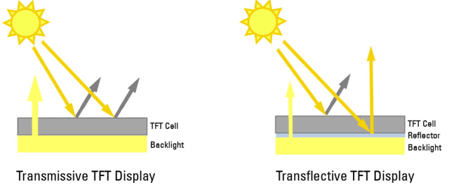
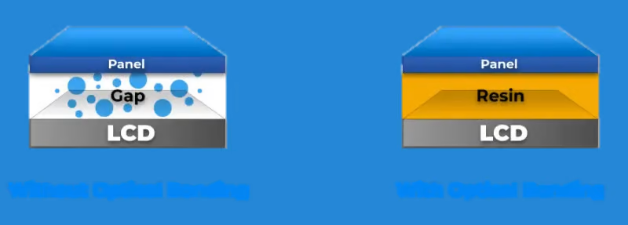
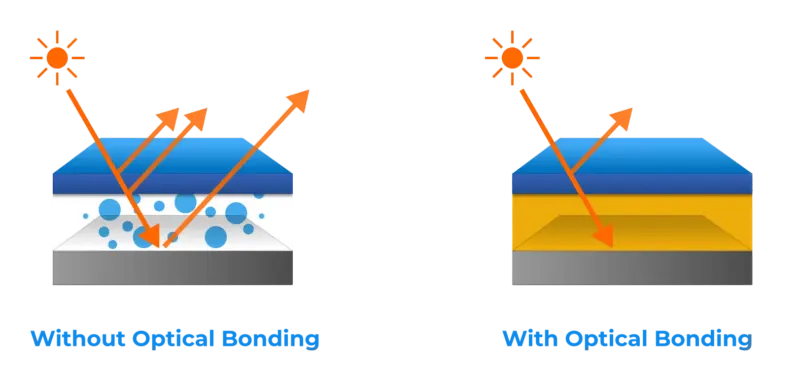
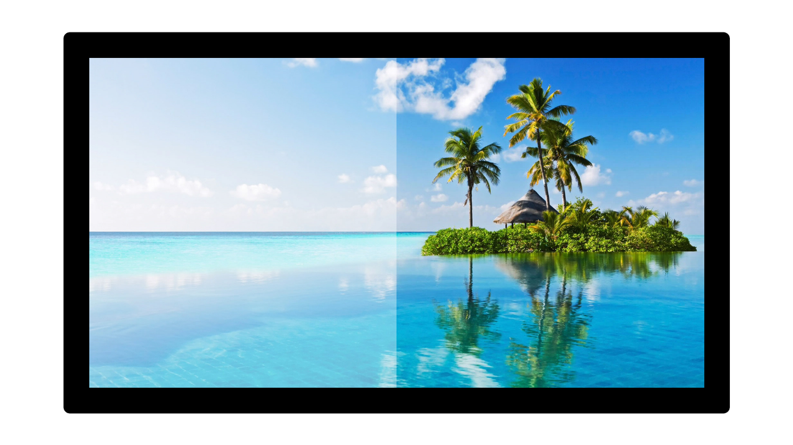

# Custom and Sunlight-Readable Display Solutions

!!! abstract "Quick answer"
    There are four technical paths to making a screen readable in strong light: raising backlight brightness, switching to transflective, applying AR/AG surface treatments, and optical bonding. They act on four different places — the light source, the optical path, the surface, and the interfaces between layers — and they can be used alone or in combination. This article explains which layers of a TFT LCD can be customized, then breaks down the benefit and the price of each of the four options.

## Key Takeaways

- A TFT LCD can be customized from the panel and the module through to the touch layer and the cover lens, and sunlight readability falls in the module-plus-surface part of that scope.
- A high-brightness backlight works quickly and costs relatively little, but power draw, heat, and LED lifetime all get worse, and it still fails under extremely strong sunlight.
- Transflective makes sunlight itself part of the light source, so the backlight can be turned down in strong light; the price is a trade-off in color depth and a higher cost.
- AR (anti-reflection) and AG (anti-glare) act on the glass surface, while optical bonding acts on the interfaces between layers; both improve contrast directly instead of simply piling on brightness.

## 1. Customizable Layers of a TFT LCD

A TFT LCD module is itself a stack of many materials, which is why almost every layer in it can be adjusted for a customer's product.

<figure markdown="span" class="displaywiki-figure">
  [{ width="760" loading="lazy" }](custom-sunlight-readable-displays-tft-display-structure.jpeg){ .displaywiki-image-link title="Open full-size image" }
  <figcaption>Stacked structure of a TFT LCD module: at the bottom is the backlight unit (light guide plate, LED bar, diffuser, prism sheet, reflector, and so on), in the middle is the liquid-crystal panel (upper and lower polarizers, glass substrates, TFT array, liquid crystal, color filter, and bezel), and an FPC with its driver IC runs out from the side. Every layer corresponds to one customizable item.</figcaption>
</figure>

VIEWE can provide display customization covering the TFT panel (size, resolution, specifications), the backlight (brightness, outline dimensions), the FPC/PCB (interface, connector, cable), the touch panel, and the cover lens. For many years we have helped customers design and execute semi-custom and fully custom display solutions; as a professional display manufacturer we know the whole display production process, and our sales and engineering teams stay with the customer through the entire development process.

<figure markdown="span" class="displaywiki-figure">
  [{ width="760" loading="lazy" }](custom-sunlight-readable-displays-tft-customize-ability.png){ .displaywiki-image-link title="Open full-size image" }
  <figcaption>The customization path from a standard panel to a fully custom solution: it starts from a standard panel (A-Si in rectangular, bar, or round form, or LTPS for high PPI), then stacks a fully custom module (outline, backlight, FPC, bezel) and fully custom touch (touch sensor, interface, cover lens) to reach a complete custom solution; In-cell or On-cell touch can also be integrated directly on a panel that has no separate touch layer.</figcaption>
</figure>

<figure markdown="span" class="displaywiki-figure">
  [{ width="760" loading="lazy" }](custom-sunlight-readable-displays-customize-solution.gif){ .displaywiki-image-link title="Open full-size image" }
  <figcaption>Every layer of the module can be customized: adjusting the backlight sets brightness and power, adjusting the FPC sets the interface form, and adding a cover lens and touch sets the interaction — together these choices make up the final solution.</figcaption>
</figure>

## 2. What Sunlight Readability Has to Solve

Once a display goes outdoors, it faces sunlight or other forms of high ambient light: light reflects off the screen surface and washes out the image coming from the LED backlight, so contrast collapses and the picture turns white.

As the display industry has grown, keeping outdoor displays (car displays, digital signage, and public kiosks, for example) from being overwhelmed by the sun has become more important than ever. That is exactly why sunlight-readable display solutions were invented.

<figure markdown="span" class="displaywiki-figure">
  [{ width="760" loading="lazy" }](custom-sunlight-readable-displays-high-brightness-for-tft-lcd.jpeg){ .displaywiki-image-link title="Open full-size image" }
  <figcaption>Outdoor digital signage: the screen sits in high ambient light for long periods, and readability is decided by the reflection of ambient light at the surface together with the backlight brightness.</figcaption>
</figure>

The problem comes down to one sentence: **readability depends on the ratio of image luminance to reflected ambient light, not on the absolute brightness alone.** The approaches therefore split into two groups — raise the numerator (brightness) or lower the denominator (reflection). The four options below fall on those two ends.

## 3. Option 1: High-Brightness Backlight

The most direct approach is to raise the LED backlight brightness of the TFT LCD. A normal TFT LCD screen runs at about 250 to 450 nits; once brightness is raised to 800 to 1000 nits (1000 nits is the most common), the device counts as a high-brightness LCD and a sunlight-readable display.

This is a relatively cost-controllable option, and it improves outdoor image quality, including contrast and viewing angle.

<figure markdown="span" class="displaywiki-figure">
  [{ width="760" loading="lazy" }](custom-sunlight-readable-displays-custom-and-sunlight-readable-display-solutions-diagram-5.png){ .displaywiki-image-link title="Open full-size image" }
  <figcaption>Touch and readability: most TFT LCDs today carry a touch screen, and the transmittance of that layer directly affects how much light reaches the viewer — before raising brightness, the loss in the touch layer and its interfaces has to be reduced.</figcaption>
</figure>

Because so many TFT LCDs have moved to touch screens, the choice of touch technology also affects readability. A resistive touch screen uses two transparent conductive layers above the glass substrate, and those two layers can still block up to 5% of the light. To pair with a high-brightness backlight, a different touch option can be used: the capacitive touch screen. Though it costs more than a resistive one, its sensing structure is integrated into the film layers or even inside the liquid-crystal cell rather than in two conductive layers above the display glass, so light passes through more efficiently and it suits sunlight-readable screens better.

**Limitations of a high-brightness approach**

- **Power and heat**: the brighter the display, the more power it needs, so battery life shortens and the device is more likely to overheat.
- **LED lifetime**: keeping backlight power high over time shortens the LED half-life.
- **Eye strain**: high brightness does help avoid straining to see in strong light, but an overly bright screen causes eye fatigue too, so most devices need a brightness control.
- **A hard ceiling**: under extremely strong outdoor sunlight the high-brightness approach fails — the intense reflection on the screen actually makes it harder to see.

## 4. Option 2: Transflective TFT LCD

Another path turns sunlight from an interference into a light source. Transflective combines transmissive and reflective: by design, a significant share of sunlight is reflected and used inside the screen instead of forming an interfering reflection at the surface, and this optical layer is called the transflector.

In a transflective TFT LCD, sunlight can reflect off the surface but can also pass through the liquid-crystal cell and be reflected back by a semi-transparent reflector placed in front of the backlight, illuminating the display. With both a transmissive and a reflective mode, such a device works well outdoors and indoors alike. Its power consumption is far lower than the high-brightness approach, but it costs more — although costs have fallen in recent years, transflective is still more expensive than a high-brightness LCD.

<figure markdown="span" class="displaywiki-figure">
  [{ width="760" loading="lazy" }](custom-sunlight-readable-displays-surface-treatment-ar-ag.png){ .displaywiki-image-link title="Open full-size image" }
  <figcaption>Transmissive versus transflective TFT under sunlight: a transmissive panel depends entirely on the backlight, and reflection at the surface undermines its contrast; a transflective panel adds a reflector in front of the backlight and sends sunlight that passed through the liquid crystal back to the viewer, so it does not need to run the backlight at full power in strong light.</figcaption>
</figure>

## 5. Option 3: Surface Treatment with AR and AG

Besides adjusting the internal mechanics of the display, the glass surface can be treated to make it easier to read in sunlight. The two most common treatments are anti-reflection (AR) film or glass and anti-glare (AG) processing.

### 5.1 AR Anti-Reflection

AR deposits multiple transparent thin-film layers on the surface. The thickness, structure, and properties of each layer change which wavelengths are reflected, so interference between the layers cancels reflection and less stray light reaches the eye.

<figure markdown="span" class="displaywiki-figure">
  [{ width="760" loading="lazy" }](custom-sunlight-readable-displays-custom-and-sunlight-readable-display-solutions-diagram-7.png){ .displaywiki-image-link title="Open full-size image" }
  <figcaption>Effect of an AR coating: uncoated glass transmits about 91% and reflects about 4% per surface; with an A/R coating, transmittance rises to 98% and single-surface reflection falls to 0.5%. The difference shows up directly as how much a picture washes out in strong light.</figcaption>
</figure>

### 5.2 AG Anti-Glare

AG takes a different route: it does not reduce the total amount of reflection but spreads the reflected light out. Instead of a smooth surface it uses a rough surface with fine bumps, breaking the concentrated specular reflection into diffuse reflection, so the reflected light no longer forms a harsh glare spot and no longer masks the image itself.

<figure markdown="span" class="displaywiki-figure">
  [{ width="760" loading="lazy" }](custom-sunlight-readable-displays-these-two-solutions-can-also-be-combined-which-is-greatly-useful-in-ou.png){ .displaywiki-image-link title="Open full-size image" }
  <figcaption>AG anti-glare structure: the fine bumps on the anti-glare surface layer scatter incident light in many directions, converting specular reflection into diffuse reflection and removing the harsh glare spot, at the cost of a slight loss of image sharpness.</figcaption>
</figure>

AR and AG can also be combined — apply AR first to lower the reflectance at the surface, then use AG to spread what remains, which is very common on outdoor displays. For more detail on surface treatment, see the cover lens and surface treatment section.

## 6. Option 4: Optical Bonding

Optical bonding glues the cover lens to the TFT LCD panel beneath it with an optical-grade adhesive, eliminating the air gap between layers that a traditional structure has.

<figure markdown="span" class="displaywiki-figure">
  [{ width="760" loading="lazy" }](custom-sunlight-readable-displays-optical-bonding.png){ .displaywiki-image-link title="Open full-size image" }
  <figcaption>Air-gap bonding versus full bonding: on the left there is no optical bonding, and an air gap (Gap) sits between the cover lens and the LCD, so light bounces repeatedly at several interfaces; on the right, full bonding fills the gap with optical resin (Resin), reducing the number of interfaces and lowering reflection.</figcaption>
</figure>

<figure markdown="span" class="displaywiki-figure">
  [{ width="760" loading="lazy" }](custom-sunlight-readable-displays-custom-and-sunlight-readable-display-solutions-diagram-10.png){ .displaywiki-image-link title="Open full-size image" }
  <figcaption>How optical bonding changes the reflection paths: without bonding, sunlight bounces and scatters repeatedly at the air interfaces and creates visible stray light; after bonding, light enters the resin directly, interface reflection drops sharply, and image contrast rises accordingly.</figcaption>
</figure>

This adhesive layer reduces reflection between the glass and the liquid-crystal panel as well as reflection caused by external ambient light, giving a clearer image and a higher contrast ratio — that is, a wider difference in light intensity between the brightest white and the darkest black.

<figure markdown="span" class="displaywiki-figure">
  [{ width="760" loading="lazy" }](custom-sunlight-readable-displays-custom-and-sunlight-readable-display-solutions-diagram-11.png){ .displaywiki-image-link title="Open full-size image" }
  <figcaption>Appearance in a bright environment: the plain LCD on the left is washed out by reflected ambient light, while the optically bonded LCD on the right shows the same image with richer color and higher contrast.</figcaption>
</figure>

Through this contrast improvement, optical bonding directly addresses the root cause of unreadable outdoor displays — contrast. Raising brightness can improve contrast too, but it does so by lifting the overall light level, whereas optical bonding cuts the interfering light directly and is therefore more efficient.

**Beyond image quality, optical bonding brings three additional benefits**

1. **Durability**: eliminating the air gap inside the device and replacing it with a hardened adhesive lets the adhesive layer act as a shock absorber.
2. **Touch accuracy**: an air layer refracts light, so the contact point the eye sees differs from the actual contact point; with optical adhesive this refraction is minimized and touch positioning becomes more accurate.
3. **Protection**: with the air gap gone there is no space under the glass for contaminants to gather, which protects the LCD from moisture, fogging, and dust — especially helpful for keeping it in condition during transport, storage, and in humid environments.

**Stages of the optical bonding process**: first comes preparation, choosing a suitable optically clear adhesive and cleaning the surface; then the optical adhesive is dispensed across the whole display surface; finally bonding and curing, where the touch panel is carefully laminated onto the LCD without leaving voids or bubbles.

## 7. How the Options Combine

Combining the various ways of improving sunlight readability gives the best result in high ambient light: apply an anti-reflection coating to the glass surface (anti-reflective coatings can go on both the front and the back) and add a transflector in front of the backlight. These measures can deliver 1000 nits or more without relying on an oversized backlight, while avoiding excessive power draw and heat, so the LCD lasts longer and performs more consistently.

Note that building a reflector inside a TFT LCD is relatively complex, so a transflective TFT LCD usually costs several times as much as a normal transmissive TFT LCD, and this path suits products that genuinely need strong-light readability and are power-sensitive.

For the backlight source, either LED or cold cathode fluorescent lamp (CCFL) can be used, and both produce a bright display, but LED is clearly better than CCFL on power draw and heat. Adding optical bonding on top to raise contrast then yields a more efficient and higher-quality sunlight-readable display.

<figure markdown="span" class="displaywiki-figure">
  [{ width="760" loading="lazy" }](custom-sunlight-readable-displays-normal-tft-sun-readable-tft.png){ .displaywiki-image-link title="Open full-size image" }
  <figcaption>The result of a combined approach: after improving the surface treatment, the light path, and the interfaces between layers, the screen keeps its color and gradation in high ambient light instead of merely being forced through by higher brightness.</figcaption>
</figure>

## 8. Selection Checklist

- **Quantify the ambient illuminance first**: establish the light level the device actually works in (about 500 lux indoors, about 10,000 lux in outdoor shade, up to 100,000 lux in direct sunlight), then decide the combination of options.
- **Reduce reflection before piling on brightness**: AR/AG and optical bonding cut interfering light directly and are often more power-efficient than simply raising nits.
- **Budget power and thermal headroom**: a high-brightness backlight pushes power draw and heat up significantly, so battery-powered devices need care.
- **Confirm the color-depth requirement**: transflective brings a trade-off in color depth, so applications with strict color requirements should assess it up front.
- **Decide the touch technology at the same time**: capacitive suits high-brightness outdoor screens better than resistive, and the transmittance of the touch layer has to be considered as well.
- **Check the structure and the cost**: the transflector and optical bonding both affect thickness, process, and cost, so they have to be confirmed together with the overall product design.

## 9. Frequently Asked Questions

??? question "Q1: What are the ways to make a display sunlight-readable?"
    There are four main ones: raising the backlight brightness (a high-brightness LCD); switching to transflective so sunlight itself contributes to the lighting; applying an AR anti-reflection or AG anti-glare treatment to the glass surface; and optical bonding to cut reflection at the interfaces between layers. They act in different places, and a real solution is usually a combination of them.

??? question "Q2: Is raising the brightness to 1000 nits enough?"
    Not necessarily. 1000 nits is the common high-brightness threshold and normal screens run at about 250 to 450 nits, so raising it does improve outdoor performance. But in very strong sunlight, simply raising brightness runs into diminishing returns: the light reflected at the screen surface is magnified along with it, while power draw and heat keep climbing, so surface treatment or bonding has to be added.

??? question "Q3: What are the side effects of a high-brightness approach?"
    Mainly three: power draw and heat rise significantly, which shortens battery life and can cause overheating; keeping backlight power high over time shortens the LED half-life; and an overly bright screen itself causes eye strain. It also fails under extremely strong sunlight.

??? question "Q4: What is the difference between AR and AG, and can they be used together?"
    AR (anti-reflection) lowers reflectance through multi-layer thin-film interference, letting more light through and reflecting less; AG (anti-glare) does not reduce the total reflection but breaks specular reflection into diffuse reflection with a fine-bumped surface, removing the harsh glare spot. The two can be combined: use AR first to lower reflection, then AG to deal with what remains, which is very common on outdoor displays.

??? question "Q5: Why does optical bonding improve contrast?"
    An air-gap structure leaves an air layer between the cover lens and the panel, and sunlight bounces repeatedly at several interfaces, creating stray light that washes out the picture. Optical bonding fills the gap with an optical resin whose refractive index is close to that of glass, reducing the number of interfaces and the amount of reflection, so the difference between the brightest white and the darkest black is widened and contrast rises with it.

??? question "Q6: Why is a capacitive touch screen better suited to sunlight-readable displays than a resistive one?"
    A resistive touch screen needs two transparent conductive layers on the glass substrate, and these can block up to 5% of the light; a capacitive one integrates its sensing structure into the film layers or even inside the liquid-crystal cell, with no extra pair of conductive layers above the display glass, so light passes through more efficiently and it pairs better with a high-brightness backlight.

## Related reading

- [High-Reliability Display Solutions](high-reliability-displays.md)
- [UART Smart Display Solutions](uart-smart-display.md)
- [IoT and AIoT Smart Display Solutions](iot-aiot-display.md)

!!! info "Can't find what you need?"
    If you need more products, resources or support, please contact our team:

    [**:material-archive-arrow-down: Knowledge Base**](../../knowledge/tags.md){ .md-button .md-button--primary }
    [**:material-magnify: Products & Solutions**](https://viewedisplay.com/){ .md-button }
    [**:material-email: Contact Support**](mailto:support@viewedisplay.com){ .md-button }
