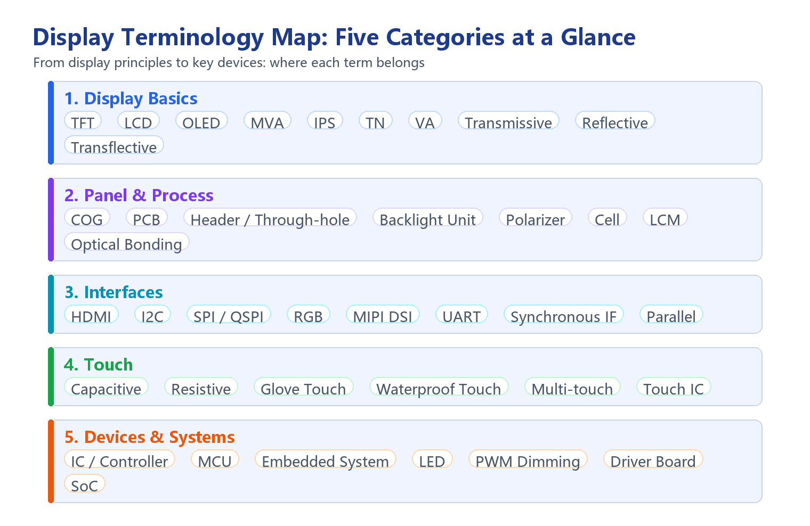

# Display Technology Glossary

!!! abstract "Quick answer"
    Terminology confusion in the display industry comes mainly from three sources: the same word means different things to different suppliers (such as the boundary between a Cell and an LCM), Chinese and English abbreviations coexist (such as COG and MVA), and machine translation introduces mistranslations (such as rendering "polarizer" as a "polarizing agent"). This article organizes common terms into five categories — display principles, panel structure and manufacturing, interfaces and communication, touch technology, and core devices — giving the accurate definition of each term and what it actually means for selection.

<figure markdown="span" class="displaywiki-figure">
  [{ width="760" loading="lazy" }](display-glossary-terminology-map-en.png){ .displaywiki-image-link title="Open full-size image" }
  <figcaption>Display terminology map at a glance: common terms grouped into display principles, panel structure, interfaces, touch, and core devices, so each term can be located quickly by scenario.</figcaption>
</figure>

## Key Takeaways

- Display terms fall into five groups: display principles and types, panel structure and manufacturing, interfaces and communication, touch technology, and core devices and systems.
- The most easily confused aspect is the structural hierarchy: liquid-crystal cell → module (LCM) → finished device — the word "screen" does not refer to the same thing in every context.
- The optical mode (transmissive / reflective / transflective) directly determines outdoor readability and power consumption; it is the first fork in the selection process.
- Interfaces and touch each have their own trade-off dimensions and must be evaluated together with host resources, pin budget, and the usage environment.
- Terminology definitions may differ between suppliers; before mass production, rely on drawings and specification sheets rather than verbal agreements.

## 1. Display Principles and Types

| Term | Definition and selection implications |
|---|---|
| **TFT** (Thin-Film Transistor) | An active-matrix LCD in which every pixel is driven by its own thin-film transistor, capable of full color, fast animation, and complex graphics — the mainstream display technology today. |
| **LCD** (Liquid Crystal Display) | A display that uses liquid-crystal molecules to modulate how much backlight passes through; divided into active-matrix (TFT) and passive-matrix types, presenting information as characters, graphics, or pixel-level content. |
| **OLED** (Organic Light-Emitting Diode) | Uses self-emissive organic materials, so no backlight is needed to achieve high visibility in most environments; high contrast, fast response, and available in flexible form factors. |
| **MVA** (Multi-domain Vertical Alignment) | A wide-viewing-angle LCD mode that splits each sub-pixel into multiple alignment domains to widen the viewing angle; better than early TN and second only to IPS. |
| **IPS** (In-Plane Switching) | Liquid-crystal molecules rotate in planes parallel to the substrates; wide viewing angles and good color consistency make it the mainstream wide-viewing-angle LCD mode. |
| **TN** (Twisted Nematic) | Fast response and low cost, but noticeable viewing-angle and color shift; suited to instruments, cost-sensitive products, and fixed viewing positions. |
| **VA** (Vertical Alignment) | Liquid-crystal molecules align perpendicular to the substrates; high contrast and purer blacks, at the cost of trade-offs in viewing-angle color shift and response time. |
| **Transmissive** | Relies entirely on backlight illumination; high brightness and suited to indoor and low-light environments, but readability is poor under direct strong light. |
| **Reflective** | Uses ambient light for illumination with no backlight, so power draw is extremely low; the display is clearer in strong light but unreadable in the dark. |
| **Transflective** | Combines transmissive and reflective properties, working in both strong light and low light — the compromise for outdoor devices that must balance readability and power consumption. |

## 2. Panel Structure and Manufacturing

| Term | Definition and selection implications |
|---|---|
| **COG** (Chip-On-Glass) | The driver IC is bonded directly onto the glass substrate without a separate PCB, giving a more compact structure and smaller size; common in character and graphic monochrome LCDs. |
| **PCB** (Printed Circuit Board) | A substrate that mechanically supports and electrically connects electronic components; the carrier of the driver and interface circuits. |
| **Header / Through-hole** | A connector made of rows of small open holes; its pin layout is compatible with common development boards, making it easy to connect display modules to platforms such as Arduino for rapid prototyping and validation. |
| **Backlight Unit** | The light-source assembly behind the LCD cell, usually composed of LEDs and a light guide plate; it directly determines the brightness and uniformity of a transmissive display. |
| **Polarizer** | An optical film that passes light of only a specific polarization direction; it is the prerequisite for liquid-crystal light modulation; it is occasionally mistranslated in the industry as a "polarizing agent", but it is the same component. |
| **Cell** | The core light-modulation unit consisting of two glass substrates, the liquid-crystal layer, alignment layers, and polarizers; it does **not** include driver circuitry or a backlight. |
| **Module** (LCM, LCD Module) | The complete assembly of cell + driver circuitry + backlight + interface — what is colloquially called "the screen". |
| **Optical Bonding** | Fills the air gap between the cover lens and the display layer with optical adhesive, improving light transmittance and contrast and significantly enhancing readability in strong light. |

## 3. Interfaces and Communication

| Term | Definition and selection implications |
|---|---|
| **HDMI** (High-Definition Multimedia Interface) | Transmits audio and video in a standardized digital format and is the replacement for analog video interfaces; an HDMI TFT module connects with a single standard HDMI cable, with no extra protocol conversion required. |
| **I2C** (I-squared-C) | Lets an MCU control peripheral chips with only two I/O lines; suited to scenarios where simplicity and low manufacturing cost matter more than speed, saving both development time and I/O resources. |
| **SPI and QSPI** | SPI is a serial interface that transfers data bit by bit, using few pins; QSPI (Quad SPI) is a four-line SPI that provides higher throughput within the same pin budget. |
| **RGB** | A parallel interface that transfers pixel data clock-by-clock; suited to small and medium sizes with moderate refresh-rate requirements, but uses a relatively large number of pins. |
| **MIPI DSI** | The Display Serial Interface defined by the MIPI Alliance; it uses high-speed differential signaling and suits high-resolution, high-refresh-rate applications. |
| **UART** | Universal Asynchronous Receiver-Transmitter; commonly used by serial smart displays, with simple wiring and a low development barrier, but limited bandwidth and transmission distance. |
| **Synchronous interface** | Every transmitted bit has a paired receiving bit; it needs more pins in exchange for deterministic timing. |
| **Parallel interface** | Multiple bits are transferred simultaneously; fast but pin-heavy and complex to route, common on older MCU interfaces. |

## 4. Touch Technology

| Term | Definition and selection implications |
|---|---|
| **Capacitive touch** | Locates touches through capacitive coupling between the finger and the sensor; high sensitivity and multi-point support, but thick gloves or other insulators block the coupling and cause unresponsive touches. |
| **Resistive touch** | Relies on the top layer of the panel being pressed into contact with the lower layers; it works with thick gloves or an ordinary stylus, at the cost of lower light transmittance and shorter life. |
| **Glove touch** | Enables capacitive operation while wearing gloves by raising the signal-to-noise ratio, adjusting algorithm thresholds, or using gloves woven with conductive fibers. |
| **Waterproof touch** | Uses hydrophobic coatings to reduce water residue, plus multi-frequency signals and algorithms to distinguish "water droplet coverage" from "a real touch", suppressing false touches. |
| **Multi-touch** | Supports recognizing multiple touch points simultaneously — the basis for pinch, rotate, and other gestures — and places higher demands on the touch IC's scanning and computing power. |
| **Touch IC** | The chip that scans the electrodes, computes coordinates, and outputs touch events; its signal-to-noise ratio and algorithms directly determine the touch experience and interference immunity. |

## 5. Core Devices and Systems

| Term | Definition and selection implications |
|---|---|
| **IC** (Integrated Circuit) | Also called a chip or controller; it implements the display's driving and functions — in effect the brain of the display. |
| **MCU** (Microcontroller Unit) | The main computer of the application system, issuing commands to the various electronic components; the computing and control core of an embedded device. |
| **Embedded system** | A dedicated computing system, usually constrained in computing resources, power consumption, bandwidth, physical size, and cost — for example the controllers inside microwave ovens, air conditioners, and TVs. |
| **LED** (Light-Emitting Diode) | A semiconductor light source used both as a status indicator and as the core device of backlights and dimming. |
| **PWM dimming** | Controls the brightness of backlight LEDs via pulse-width modulation, with the duty cycle determining average brightness; too low a frequency can produce visible flicker. |
| **Driver board** | The circuit board that converts input signals into the timing and voltages the panel requires — a key link in the display module's signal chain. |
| **SoC** (System-on-Chip) | Integrates a processor, memory interfaces, and multiple peripherals on a single chip, such as the common ESP32 family. |

## 6. Selection Notes on Terminology

- **Confirm first which level "screen" refers to**: a Cell, an LCM, a module, and a finished device have different boundaries, with different interfaces, quotations, and scopes of responsibility — be specific about the level when requesting a quote.
- **Decide the optical mode before other parameters**: transmissive, reflective, and transflective determine outdoor readability and the power ceiling; a wrong choice here is hard to compensate for by tuning other parameters later.
- **Match the interface to the host's resources**: I2C and SPI save pins but have limited bandwidth; RGB and MIPI DSI offer ample bandwidth but consume more pins and PCB layers.
- **Evaluate touch separately from the display**: the touch IC, cover lens structure, and bonding method all affect the final experience — do not judge by the panel's specifications alone.
- **Define terms in writing**: suppliers may use terms such as COG and LCM differently; before mass production, rely on drawings and specification sheets rather than verbal agreements.

## 7. Frequently Asked Questions

??? question "Q1: What is the difference between a Cell, an LCM, and a module?"
    A Cell is the liquid-crystal cell, containing only the two glass substrates, the liquid-crystal layer, the alignment layers, and the polarizers — the core light-modulation unit of the display. An LCM (LCD Module) adds driver circuitry, a backlight, and an interface on top of the Cell. A module is a broader term that usually also includes the cover lens, touch, and mechanical parts. Stating the level clearly when requesting a quote avoids misunderstandings about interfaces and scopes of responsibility.

??? question "Q2: How should I choose among transmissive, reflective, and transflective?"
    Look at the lighting conditions of the usage environment. For mainly indoor or low-light use where high brightness and color matter, choose transmissive; for mainly strong outdoor light where power consumption is sensitive, choose reflective; when the screen must be readable both in sunlight and at night or in the dark, choose transflective. Note that transflective usually involves a compromise in brightness and color performance, so some trade-off must be accepted.

??? question "Q3: What are the differences among the IPS, VA, MVA, and TN liquid-crystal modes?"
    They are mainly trade-offs among viewing angle, contrast, and response speed. TN is fast and cheap but has narrow viewing angles; VA offers high contrast and purer blacks but obvious off-angle color shift; MVA is a wide-viewing-angle improvement of VA; IPS has the widest viewing angles and the best color consistency, making it the overall preferred choice of the three, at a relatively higher cost.

??? question "Q4: How should I choose among I2C, SPI, RGB, and MIPI DSI interfaces?"
    Start from the host's available pins and the bandwidth requirement. I2C uses the fewest lines but is the slowest, suited to small character displays and low-refresh graphics; SPI balances pins and speed, and QSPI further increases throughput; RGB is a parallel interface suited to small and medium sizes with moderate refresh rates; MIPI DSI uses high-speed differential signaling for high resolution and high refresh rates, but places the highest demands on the host and PCB design.

??? question "Q5: How should I choose between capacitive and resistive touch?"
    Consider the operation method and the usage environment. Capacitive touch offers high light transmittance and supports multi-point and gesture input, suited to consumer and industrial scenarios that need fluid interaction, but recognition suffers with thick gloves or water on the screen. Resistive touch works with gloves, fingernails, or a stylus tip and adapts well to harsh environments, at the cost of lower transmittance and shorter life, and usually without multi-point support.

??? question "Q6: Why do terminology definitions differ among suppliers?"
    The display industry has long used Chinese and English abbreviations side by side. Some terms come from process names (such as COG and LCM), others from optical or interface standards (such as MVA and MIPI DSI), and cross-language translation differences add ambiguity and mistranslation. The reliable practice is to define the boundary of every term explicitly in technical agreements and specification sheets, and to treat drawings as authoritative rather than verbal consensus.

## Related reading

- [High-Reliability Display Solutions](high-reliability-displays.md)
- [IPS vs TN TFT Displays: Differences and Selection Guide](ips-vs-tn.md)
- [LCD Basics: How Liquid Crystal Displays Work](lcd-basics.md)

!!! info "Can't find what you need?"
    If you need more products, resources or support, please contact our team:

    [**:material-archive-arrow-down: Knowledge Base**](../../knowledge/tags.md){ .md-button .md-button--primary }
    [**:material-magnify: Products & Solutions**](https://viewedisplay.com/){ .md-button }
    [**:material-email: Contact Support**](mailto:support@viewedisplay.com){ .md-button }
