# Display Interfaces Explained: MCU, RGB, LVDS, MIPI, SPI, and More

!!! abstract "Quick answer"
    A display interface should be selected from bandwidth, pin count, cable length, electromagnetic compatibility, software support, latency, and system architecture. Panel interfaces and external communication interfaces serve different layers and should not be compared as direct substitutes.

## Key Takeaways

- Calculate pixel bandwidth from resolution, refresh rate, color depth, and blanking before selecting a video interface.
- Use distance, noise environment, connector, grounding, and EMC requirements when comparing single-ended and differential links.
- Confirm controller, operating-system, driver, and panel support before freezing the schematic.

## Interface Categories and Selection Context

Display systems use different interfaces at different points in the signal chain. A host may send commands to a smart display over UART, while a display controller drives the panel through RGB, LVDS, MIPI DSI, or another panel-level link. The correct choice depends on where the interface is used, the required bandwidth, transmission distance, electromagnetic environment, and available hardware and software support.

## Direct Panel and Touch Interfaces

### Parallel Panel Interfaces

### MCU 8080 and 6800 Parallel Interfaces

<figure markdown="span" class="displaywiki-figure">
  [{ width="760" loading="lazy" }](display-interface-guide-1-1-mcu-interface-8080-6800.jpeg){ .displaywiki-image-link title="Open full-size image" }
  <figcaption>1-1 MCU interface 8080/6800</figcaption>
</figure>

Display raw data sent via Data bus according to control bus signal. Communication bandwidth depends on enabling speed running on Driver IC. QVGA 320×240 dot matrix LCD i.e., the communication bandwidth will be 320 * 240 / 8 bit (data width) * 60 fps = 576KHz at ENABLE signal.

Features:

MCU interface include two types, 6800 and 8080. 8080 is the much more popular than 6800. Generally, MCU interface consist of 4/8/9/16bits data (like DB0, DB1, , , DB7; Note: 8bits is the most popular bits width), CS (chip select), RS (data register or instruction register select), RD (read enable), WR (write enable).

**Advantages:** Simple controller-side operation for suitable resolutions and update rates.

**Limitations:** Requires host-side memory and is constrained by bus width, clock rate, and transaction overhead.

Used in Mono character, graphic, small TFT (smaller than 3.5”)

<figure markdown="span" class="displaywiki-figure">
  [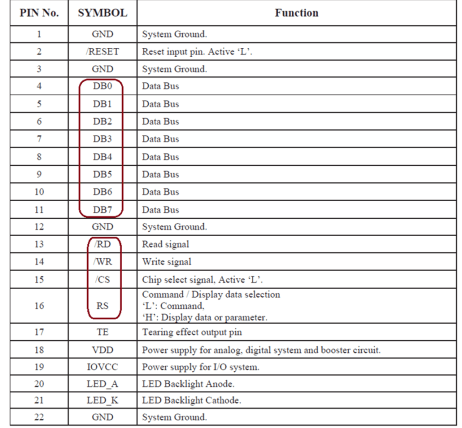{ width="760" loading="lazy" }](display-interface-guide-mcu-parallel-interface.png){ .displaywiki-image-link title="Open full-size image" }
  <figcaption>MCU/Parallel Interface</figcaption>
</figure>

Fig. 1 MCU/Parallel Interface

### Parallel RGB Interfaces

The RGB interface is to transmit the drive timing to the display driver IC through the data input/output in a parallel manner, including R/G/B data, vertical synchronization signal (V-SYNC, Vertical synchronizing signal), horizontal synchronization signal (H-SYNC), horizontal synchronizing signal), data enable (DE, Data Enable) signal, and clock signal PCLK (Pixel Clock). The display interface of RGB666 is as follows:

<figure markdown="span" class="displaywiki-figure">
  [{ width="760" loading="lazy" }](display-interface-guide-features.jpeg){ .displaywiki-image-link title="Open full-size image" }
  <figcaption>Features</figcaption>
</figure>

Display raw data transferred same as above. But the display resolution is getting higher and higher. i.e., WVGA 800 * 480 (pixels) * 60 fps = 23.04 MHz. (PCLK)

Features:

RGB interface often been used in control large-scale high-resolution LCD display. It include 6/16/18bits data (like R0, R1, , , G0, G1, , ,B0, B1, , , ), VSYNC (Vertical synchronization), HSYNC (Horizontal synchronization).

Advantage is that R,G,B data is written to LCD directly without GRAM, high speed. Normally used in large-scale high-resolution LCD.

Disadvantage is to control LCD is more complex, and need more data wires than MCU interface.

Application: Medium size TFT (3.5” to 8”)

RGB interface includes 24 bit, 18 bit, 16 bit

<figure markdown="span" class="displaywiki-figure">
  [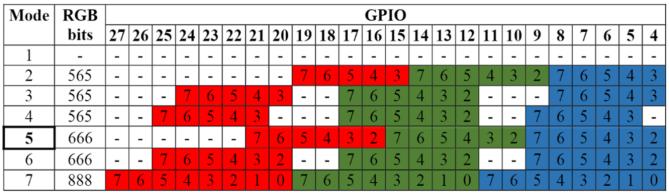{ width="760" loading="lazy" }](display-interface-guide-rgb-interface.png){ .displaywiki-image-link title="Open full-size image" }
  <figcaption>RGB Interface</figcaption>
</figure>

Fig. 5 RGB Interface

<figure markdown="span" class="displaywiki-figure">
  [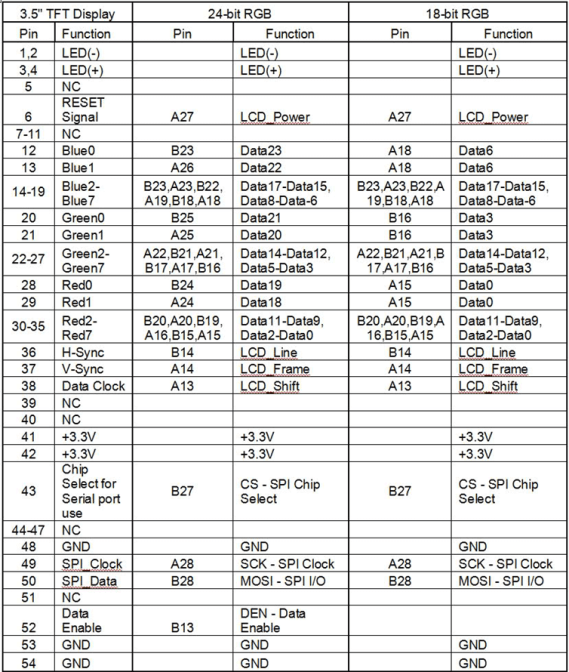{ width="760" loading="lazy" }](display-interface-guide-examples-of-24-bit-and-18-bit-rgb-interface.png){ .displaywiki-image-link title="Open full-size image" }
  <figcaption>Examples of 24 Bit and 18 Bit RGB Interface</figcaption>
</figure>

Fig. 6 Examples of 24 Bit and 18 Bit RGB Interface

## Serialized Panel Interfaces

### SPI

SPI is a master-slave-based interface, usually with a Master (master device) and one or multi slave (slave devices). There are 4 pins on the interface. The connection method and hardware structure are as follows:

SCLK: The synchronous clock used by all devices. The master drives this clock and the slaves receive the clock.

MOSI: Master out, slave in. This is the main data line driven by the master to all slaves on the SPI bus. Only the selected slave clocks data from MOSI.

MISO: Master in, slave out. This is the main data line driven by the selected slave to the master. Only the selected slave may drive this circuit. In fact, it is the only circuit in the SPI bus arrangement that a slave is ever permitted to drive.

CS: Chip Select. This signal is unique to each slave. When active the selected slave must drive MISO.

<figure markdown="span" class="displaywiki-figure">
  ![[Example of SPI schematic]](display-interface-guide-example-of-spi-schematic.jpeg){ width="760" loading="lazy" }
  <figcaption>[Example of SPI schematic]</figcaption>
</figure>

Display data transferred in sequential. Display interface communication bandwidth i.e., QVGA 320 * 240 (pixels) * 16 bit (color depth) * 30 fps = 36.864 MHz.

### I²C

Different from the point-to-point (or point-to-multipoint) base of SPI, I²C is interfaced in the form of a data bus, which allows multiple master devices and multiple slave devices to be connected in series. The interface method and hardware structure are as follows:

<figure markdown="span" class="displaywiki-figure">
  ![[I²C schematic]](display-interface-guide-i2c-schematic.jpeg){ width="760" loading="lazy" }
  <figcaption>[I²C schematic]</figcaption>
</figure>

<figure markdown="span" class="displaywiki-figure">
  ![[Courtesy of Analog device]](display-interface-guide-courtesy-of-analog-device.jpeg){ width="760" loading="lazy" }
  <figcaption>[Courtesy of Analog device]</figcaption>
</figure>

Standard mode = 100K bit/s.
Full speed mode = 400K bit/s.
Fast mode = 1M bit/s.
High speed mode = 3.2M bit/s.

### Serial RGB

<figure markdown="span" class="displaywiki-figure">
  [{ width="760" loading="lazy" }](display-interface-guide-2-3-serial-rgb-6-8-bits.jpeg){ .displaywiki-image-link title="Open full-size image" }
  <figcaption>2.3 Serial RGB 6/8 bits</figcaption>
</figure>

Display data transferred in RGB sequential. Display interface communication bandwidth i.e., QVGA 320 * 240 (pixels) * 3 dot * 30 fps = 6912000 Hz (DCLK).

### LVDS and FPD-Link

<figure markdown="span" class="displaywiki-figure">
  [{ width="760" loading="lazy" }](display-interface-guide-2-4-lvds-low-voltage-differential-signal-it-should-name-fpd-link-for-t.jpeg){ .displaywiki-image-link title="Open full-size image" }
  <figcaption>2.4 LVDS: Low voltage differential signal. FPD-Link is the display-oriented implementation commonly referred to here for the display interface</figcaption>
</figure>

LVDS is a technical standard introduced in 1994 that specifies electrical characteristics of a differential, serial signaling standard, but it is not a protocol. LVDS is a physical layer specification only; many data communication standards and applications use it and add a data link layer as defined in the OSI model on top of it. LVDS operates at low power and can run at very high speeds using inexpensive twisted-pair copper cables.

<figure markdown="span" class="displaywiki-figure">
  [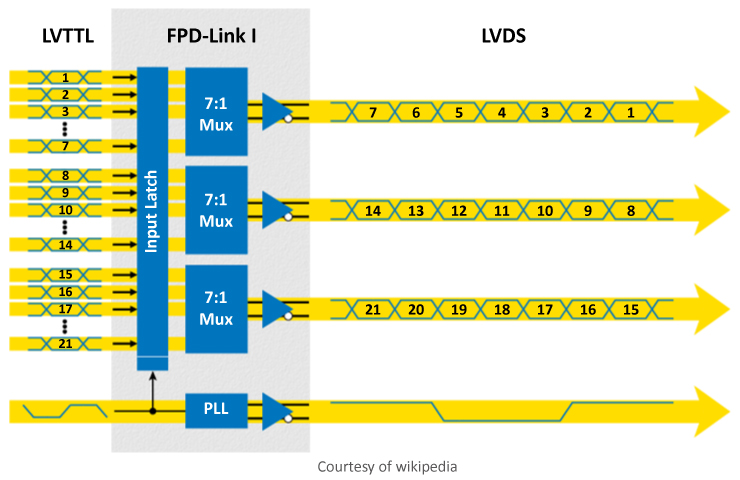{ width="760" loading="lazy" }](display-interface-guide-features-2.jpeg){ .displaywiki-image-link title="Open full-size image" }
  <figcaption>Features</figcaption>
</figure>

Early on, the notebook computer and LCD display vendors commonly used LVDS instead of FPD-Link when referring to their protocol. The term LVDS has mistakenly become synonymous with Flat Panel Display Link in the video-display engineering vocabulary.

Features:

LVDS (Low-voltage differential signaling) is an electrical digital signaling standard that can run at very high speeds over inexpensive twisted-pair copper cables.

Most used in big panels (>7”)

<figure markdown="span" class="displaywiki-figure">
  [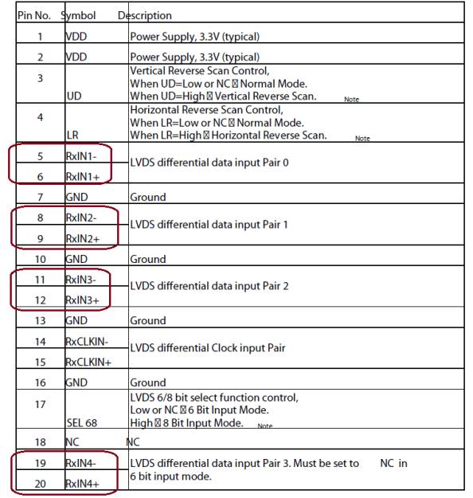{ width="760" loading="lazy" }](display-interface-guide-example-of-lvds-interface.png){ .displaywiki-image-link title="Open full-size image" }
  <figcaption>Example of LVDS Interface</figcaption>
</figure>

Fig. 7 Example of LVDS Interface

### MIPI CSI-2 and DSI

<figure markdown="span" class="displaywiki-figure">
  ![[Display view of DSI.]](display-interface-guide-display-view-of-dsi.jpeg){ width="760" loading="lazy" }
  <figcaption>[Display view of DSI.]</figcaption>
</figure>

MIPI Alliance aimed at reducing the cost of display controllers in mobile devices. It defines a serial bus and a communication protocol between the host, the source of the image data, and the destination device. It is the expected target at LCD and similar display technologies.

<figure markdown="span" class="displaywiki-figure">
  ![[System view of DSI.]](display-interface-guide-system-view-of-dsi.jpeg){ width="760" loading="lazy" }
  <figcaption>[System view of DSI.]</figcaption>
</figure>

DSI specifies a high-speed (e.g., 4.5 Gbit/s/lane for D-PHY 2.0) differential signaling point-to-point serial bus. This bus includes one high-speed clock lane and one or more data lanes.

Image data on the bus is interleaved with horizontal and vertical blanking intervals signals. The data is transferred to the display in real-time and not stored by the device to save frame buffer memory in the display. However, it also means that the device must be continuously refreshed (at a rate such as 30 or 60 frames per second) or lose the image. Image data is only sent in HS mode. When in HS mode, commands are transmitted during the vertical blanking interval.

Features:

MIPI (Mobile Industry Processor Interface) Alliance, DSI (Display Serial Interface)

Aimed at reducing the cost of display controllers in a mobile device. It is commonly targeted at LCD and similar display technologies. It defines a serial bus and a communication protocol between the host (source of the image data) and the device (destination of the image data)

MIPI Interface is getting more and more popular.

<figure markdown="span" class="displaywiki-figure">
  [{ width="760" loading="lazy" }](display-interface-guide-an-example-of-mipi-interface.png){ .displaywiki-image-link title="Open full-size image" }
  <figcaption>An Example of MIPI Interface</figcaption>
</figure>

Fig. 8 An Example of MIPI Interface

An experimental example of display interface MCU 8080/6800:

A LCD controller has been phased out, and the customer would like to have a pin-to-pin compatible module to replace it. RD owners had designed a PCB with an MCU for the compatible interface. The experimental results on ENABLE signal must be as long as 9.92uS at least. This means the maximum communication BW is around 100KBPS.

<figure markdown="span" class="displaywiki-figure">
  ![[Chanel1 –E pin@9.92uS, Chanel2 – CS pin]](display-interface-guide-chanel1-e-pin-9-92us-chanel2-cs-pin.jpeg){ width="760" loading="lazy" }
  <figcaption>[Chanel1 –E pin@9.92uS, Chanel2 – CS pin]</figcaption>
</figure>

We can see a few defect points below when shortening ENABLE time as 9.84uS (the communication speed is up to 101KBPS).

<figure markdown="span" class="displaywiki-figure">
  ![[Chanel1 –E pin@9.84uS, Chanel2 – CS pin]](display-interface-guide-chanel1-e-pin-9-84us-chanel2-cs-pin.jpeg){ width="760" loading="lazy" }
  <figcaption>[Chanel1 –E pin@9.84uS, Chanel2 – CS pin]</figcaption>
</figure>

### Embedded DisplayPort (eDP)

DisplayPort (DP) is a digital display interface developed by a consortium of PC and chip manufacturers and standardized by the Video Electronics Standards Association (VESA). The interface is primarily used to connect a video source to a display device such as a computer monitor, and it can also carry audio, USB, and other forms of data.

DisplayPort was designed to replace VGA, DVI, and FPD-Link. The interface is backward compatible with other interfaces, such as HDMI and DVI, through the use of either active or passive adapters. It is mostly used for larger size and higher resolution displays.

<figure markdown="span" class="displaywiki-figure">
  [{ width="760" loading="lazy" }](display-interface-guide-edp-interface.png){ .displaywiki-image-link title="Open full-size image" }
  <figcaption>eDP Interface</figcaption>
</figure>

<figure markdown="span" class="displaywiki-figure">
  [{ width="760" loading="lazy" }](display-interface-guide-edp-interface-2.png){ .displaywiki-image-link title="Open full-size image" }
  <figcaption>eDP Interface</figcaption>
</figure>

Fig. 9 eDP Interface

## Panel Interface Comparison

Which interface is the best? There is no absolute answer to this question. Engineers should choose the interface that fits the application rather than searching for a universally best option. Let’s see the following comparison of the pros and cons of these interfaces.

| Display Interface | Resolution | Speed | Pin Count. | Noise | Power | Connect Distance | Cost |
| --- | --- | --- | --- | --- | --- | --- | --- |
| MCU 8080/6800 | Middle | Low | More | Middle | Low | Short | Low |
| RGB 16/18/24 | Middle | Fast | More | Worst | High | Short | Low |
| SPI | Small | Low | Less | Middle | Low | Short | Low |
| I²C | Small | Low | Less | Middle | Low | Short | Low |
| Serial RGB 6/8 | Middle | Fast | Less | Worst | High | Short | Low |
| LVDS | Large | Fast | Less | Best | Low | Long | High |
| MIPI | Large | Fastest | Less | Best | Low | Short | Average |
| eDP | Large | Fastest | Less | Best | Low | Long | High |

## Smart-Display Host Interfaces

### UART

A universal asynchronous receiver/transmitter (UART) is a block of circuitry responsible for implementing serial communication. Essentially, the UART acts as an intermediary between parallel and serial interfaces. On one end of the UART is a bus of eight-or-so data lines (plus some control pins), on the other is the two serial wires – RX and TX.

<figure markdown="span" class="displaywiki-figure">
  [{ width="760" loading="lazy" }](display-interface-guide-urat-interface.png){ .displaywiki-image-link title="Open full-size image" }
  <figcaption>UART Interface</figcaption>
</figure>

Fig. 10 UART Interface

### USB

A Universal Serial Bus (USB) is a common interface that enables communication between devices and a host controller such as a personal computer (PC). It connects peripheral devices such as digital cameras, mice, keyboards, printers, scanners, media devices, external hard drives and flash drives. There have been four generations of USB specifications: USB 1.x, USB 2.0, USB 3.x and USB4.

It is widely used in capacitive touch panel connections.

<figure markdown="span" class="displaywiki-figure">
  [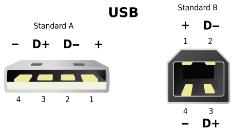{ width="760" loading="lazy" }](display-interface-guide-usb-interface.png){ .displaywiki-image-link title="Open full-size image" }
  <figcaption>USB Interface</figcaption>
</figure>

Fig. 11 USB Interface

### HDMI

HDMI (High-Definition Multimedia Interface) is a proprietary audio/video interface for transmitting uncompressed video data and compressed or uncompressed digital audio data from an HDMI-compliant source device, such as a display controller, to a compatible computer monitor, video projector, digital television, or digital audio device. HDMI is a digital replacement for analog video standards.

As color TFT LCDs have become more common, HDMI has become a widely used external video interface.

<figure markdown="span" class="displaywiki-figure">
  [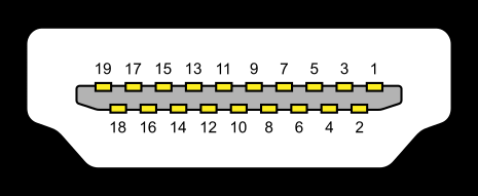{ width="760" loading="lazy" }](display-interface-guide-with-more-and-more-popular-of-color-tft-lcd-hdmi-is-getting-popular-in.png){ .displaywiki-image-link title="Open full-size image" }
  <figcaption>With more and more popular of color TFT LCD, HDMI is getting popular in display industry</figcaption>
</figure>

<figure markdown="span" class="displaywiki-figure">
  [{ width="760" loading="lazy" }](display-interface-guide-hdmi-interface.png){ .displaywiki-image-link title="Open full-size image" }
  <figcaption>HDMI Interface</figcaption>
</figure>

Fig. 12 HDMI Interface

### RS-232

RS232 is a standard protocol used for serial communication, it is used for connecting computer and its peripheral devices to allow serial data exchange between them. As it obtains the voltage for the path used for the data exchange between the devices.

RS232 includes the following connections:

RX

VSS Signal Ground

Vdd +5v

<figure markdown="span" class="displaywiki-figure">
  [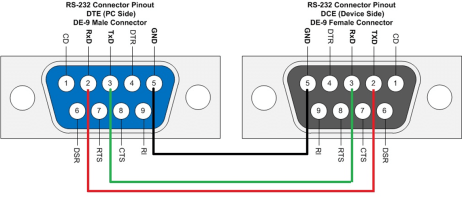{ width="760" loading="lazy" }](display-interface-guide-rs232-interface.png){ .displaywiki-image-link title="Open full-size image" }
  <figcaption>RS232 Interface</figcaption>
</figure>

Fig. 13 RS232 Interface

RS-232, when compared to later interfaces such as RS-422, RS-485 and Ethernet, has lower transmission speed, short maximum cable length, large voltage swing, large standard connectors, no multipoint capability and limited multidrop capability. In modern personal computers, USB has displaced RS-232 from most of its peripheral interface roles. Few computers come equipped with RS-232 ports today, so one must use either an external USB-to-RS-232 converter or an internal expansion card with one or more serial ports to connect to RS-232 peripherals. Nevertheless, thanks to their simplicity and past ubiquity, RS-232 interfaces are still used—particularly in industrial machines, networking equipment, and scientific instruments where a short-range, point-to-point, low-speed wired data connection is fully adequate.

### CAN

CAN (Controller Area Network) is a feature-rich automotive bus standard. It is designed to allow ECUs (Electronic Control Unit) on the network to communicate with each other without the need for a host, unlike the RS485 interface, it’s basically must have a host (Master) as the control end; but the CAN provides better and flexible communication applications, which does not require host control.

RS485 System Topology

<figure markdown="span" class="displaywiki-figure">
  [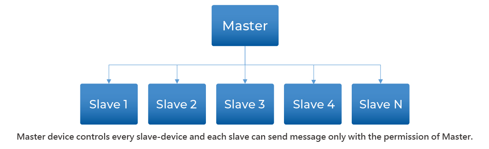{ width="760" loading="lazy" }](display-interface-guide-can-bus-system-topology.jpeg){ .displaywiki-image-link title="Open full-size image" }
  <figcaption>CAN Bus System Topology</figcaption>
</figure>

<figure markdown="span" class="displaywiki-figure">
  [{ width="760" loading="lazy" }](display-interface-guide-can-bus-system-topology-2.jpeg){ .displaywiki-image-link title="Open full-size image" }
  <figcaption>CAN Bus System Topology</figcaption>
</figure>

CAN is a Broadcast Communication Mechanism based on the message-oriented protocol. According to the content of the information, it uses Message Identifier (each identifier is unique in the entire network) to define the priority order of messages for delivery, rather than assigning a specific station address (Node ID).

Therefore, CAN has good flexible adjustment capabilities, and can add nodes to the existing network without making adjustments in software and hardware. In addition, the transmission of messages is not based on special types of nodes, which increases the convenience of upgrading the network.

The applications of CAN bus can satisfy the reliability and real-time requirements of data communication completely. That’s the reason why CAN bus application expanded into industrial, medical and other applications.

Topology figure (Sub-Block):

<figure markdown="span" class="displaywiki-figure">
  [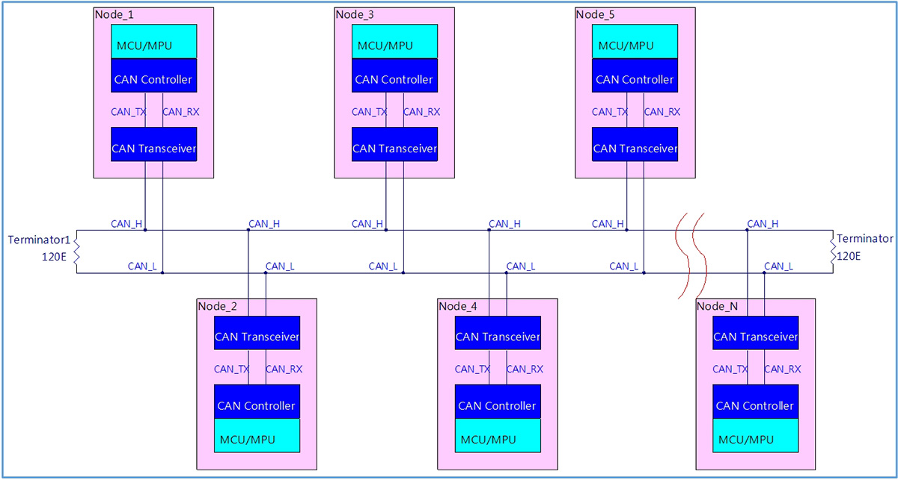{ width="760" loading="lazy" }](display-interface-guide-history.jpeg){ .displaywiki-image-link title="Open full-size image" }
  <figcaption>History</figcaption>
</figure>

BOSCH developed the CAN bus in 1983. CAN was officially announced at the International Society of Automotive Engineers (SAE) meeting held in Detroit, Michigan, USA in 1986. The first CAN controller was produced by Intel and Philips and released in 1987. The world's first car equipped with a CAN-based multi-line system was the Mercedes-Benz W140 launched in 1991.

BOSCH has published several versions of the CAN specification. CAN 2.0 was released in 1991. The specification is divided into two parts; Part A (CAN 2.0A) applies to the standard format using 11-bit identification codes, and Part B (CAN 2.0B) applies to the extended format using 29-bit identifiers.

In 1993, the International Organization for Standardization (ISO) published the CAN standard ISO11898. Later, the CAN standard was recompiled into two parts: ISO11898-1 covered the data link layer; ISO11898-2 covered the physical layer of the high-speed CAN bus; ISO11898-3 was announced later and covered the low-speed CAN bus Physical layer and CAN bus fault tolerance specification. The physical layer standards ISO11898-2 and ISO11898-3 are not included in the BOSCH CAN2.0 specification. They can be purchased separately from ISO.

In 2012, BOSCH announced CAN_FD 1.0, or variable data rate CAN. This specification uses a different architecture, allowing after arbitration, switching to a faster bit rate and transmitting different data lengths. CAN FD is compatible with the existing CAN 2.0 network, so the new CAN FD device can coexist with the existing CAN device on the same control network.

After 1996, all cars and light trucks sold in the United States were required to comply with OBD-II standards (On Board Diagnostics). In the European Union, gasoline vehicles sold after 2001 and diesel vehicles sold after 2004 are mandatory to comply with EOBD standards (European On Board Diagnostics). In 2008 all vehicles sold in the US are required to implement CAN as one of their signaling protocols.

<figure markdown="span" class="displaywiki-figure">
  [{ width="760" loading="lazy" }](display-interface-guide-feature.jpeg){ .displaywiki-image-link title="Open full-size image" }
  <figcaption>Feature</figcaption>
</figure>

Hardware Features:

All nodes are connected together by two wires. The two wires form a twisted pair and are connected with a characteristic impedance of 120Ω.

When the CAN bus transmits a dominant (0) signal, it will lift the CAN_H terminal to a high level and pull CAN_L to a low level. When the recessive (1) signal is transmitted, the CAN_H or CAN_L terminal will not be driven. The dominant signal CAN_H and CAN_L have a nominal differential voltage of 2V.

Signal looks of Physical layer:

<figure markdown="span" class="displaywiki-figure">
  [{ width="760" loading="lazy" }](display-interface-guide-realistic-measurement-on-wl0f00039000qgaaasb00-can-h-can-l.jpeg){ .displaywiki-image-link title="Open full-size image" }
  <figcaption>Realistic measurement on WL0F00039000QGAAASB00 CAN_H/CAN_L</figcaption>
</figure>

<figure markdown="span" class="displaywiki-figure">
  [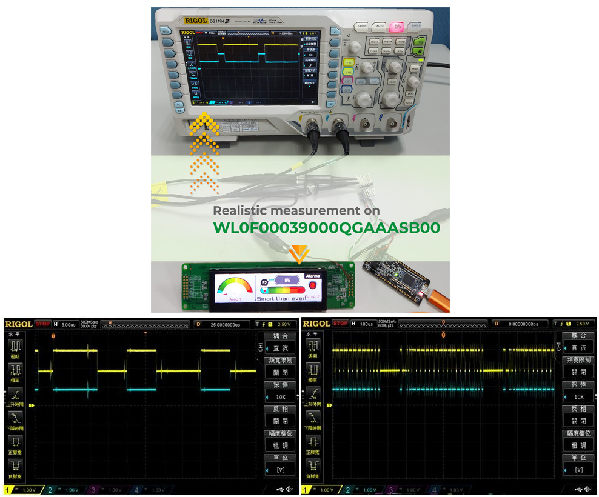{ width="760" loading="lazy" }](display-interface-guide-firmware-features.jpeg){ .displaywiki-image-link title="Open full-size image" }
  <figcaption>Firmware Features</figcaption>
</figure>

Each node can send and receive information, but not at the same time. A message or frame mainly includes an identification code (ID), which indicates the priority of the information, up to eight data bytes. CRC, ACK and other frame parts are also part of the message.

If one node transmits a dominant (0) bit and another node transmits a recessive (1) bit, then there is a conflict on the bus, and the final result is that the dominant bit "wins." This means that there is no delay in higher priority information. Node information with lower priority is automatically transmitted at the end of the dominant bit, and retransmission is attempted after 6 clock bits. This makes CAN suitable as an instant priority communication system.

The exact voltage of a logic 0 or 1 depends on the physical layer used, but the basic principle of CAN requires each node to monitor the data on the CAN network, including the sending node itself. If all nodes are transmitting logic 1 at the same time, all nodes will see this logic 1 signal, including the sending node and the receiving node. If all sending nodes transmit a logic 0 signal at the same time, then all nodes will see this logic 0 signal. When one or more sending nodes transmit a logic 0 signal, but one or more sending nodes transmit a logic 1 signal, all nodes, including the node that transmits a logic 1 signal, will also see the logic 0 signal. When a node transmits a logic 1 signal but sees a logic 0 signal, it will realize that there is a dispute on the line and log out. Through this process, any node that transmits logic 1 logs out or loses arbitration when other nodes transmit logic 0. The node that loses the arbitration will re-add the information to the queue later, and the bit stream of the CAN frame will continue without failure until there is only one sending node. This means that the node that transmits the first logic 1 loses arbitration. Since all nodes transmit an 11-bit (or 29-bit in CAN 2.0B) identification code when starting a CAN frame, the sending node with the lowest identification code has more 0s at the beginning. That node wins the arbitration and has the highest priority.

CAN2.0A/B Data format:

<figure markdown="span" class="displaywiki-figure">
  [{ width="760" loading="lazy" }](display-interface-guide-can-bus-traffic-data-looks.jpeg){ .displaywiki-image-link title="Open full-size image" }
  <figcaption>CAN bus traffic data looks</figcaption>
</figure>

<figure markdown="span" class="displaywiki-figure">
  [{ width="760" loading="lazy" }](display-interface-guide-data-sequences-in-payload.jpeg){ .displaywiki-image-link title="Open full-size image" }
  <figcaption>Data sequences in payload</figcaption>
</figure>

<figure markdown="span" class="displaywiki-figure">
  [{ width="760" loading="lazy" }](display-interface-guide-conclusions.jpeg){ .displaywiki-image-link title="Open full-size image" }
  <figcaption>Conclusions</figcaption>
</figure>

5. benefits we've got base on CAN bus features.

<figure markdown="span" class="displaywiki-figure">
  [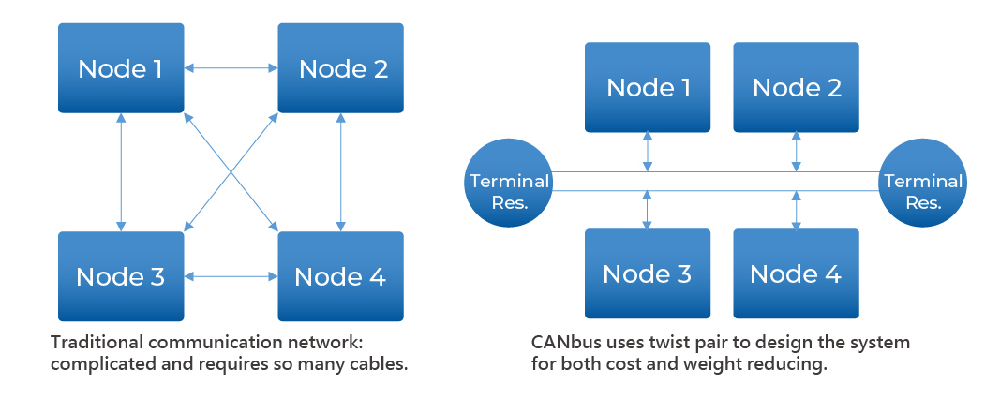{ width="760" loading="lazy" }](display-interface-guide-5-benefits-we-ve-got-base-on-can-bus-features.jpeg){ .displaywiki-image-link title="Open full-size image" }
  <figcaption>5 benefits we've got base on CAN bus features</figcaption>
</figure>

Low Cost: ECUs (Electronic Control Units) communicate via a single CAN interface, CAN bus offers reducing problems, light weight, and low cost.

Centralized: The CAN bus system allows for central error diagnosis (ex. OBD-II) and configuration across all ECU.

Robust: The system physical layer is robust towards the failure of subsystems and EMC (electromagnetic compatibility).

Efficient: CAN messages are prioritized and utilize bitwise arbitration via IDs so that the highest priority IDs are non-interrupted.

Flexible: Each ECU contains a chip for receiving all transmitted messages, decide relevance and act accordingly - this allows easy modification and inclusion of additional nodes

Some examples of applications:

Automotive (vehicle instrument, ABS, OBD-II, etc.).

Transportation systems (rail vehicle, aircraft, marine, etc.).

Mobile machineries (stacker/forklift, construction, agriculture, etc.).

Industrial machine control systems (industrial automation, information management, etc.).

Home and building automation (HVAC, elevators, etc.).

Medical devices and laboratory automation.

Constraints:

CANopen, there are 11 bits CAN ID with 4-bit function code and 7-bit node ID. So the unique addresses available for up to 127 nodes on a bus.

In J1939, there are 8-bit device address which equal to 255 node ID in maximum. Address 255 is used for broadcasting and 254 is reserved for network management. So the unique addresses available for 253 nodes on a bus.

Communication bandwidth is low and high speed against to transmission distance.

### RS-485

RS485/Modbus is a popular communication interface in the industry, and various RS485 devices at reasonable prices are easily available on the market. The line structure is simple, as long as two wires (RS485_A/RS485_B) can communicate, and the communication interface is usually presented in the form of "Serial Port" on an operating system, and each platform has a corresponding development function library. In addition, the Modbus protocol is quite easy to understand, so we put it as an example as following for experiments and explanations.

….

### Ethernet

HDMI

VGA

DVI

DP

TYPE C

…

## Application Protocols

### Modbus

### Modbus Protocol Model

The Modbus protocol is actually a data format. It basically defines the communication content of a master-slave architecture. Since it is only the definition of the data structure, it can communicate through various physical interface, such as RS232, RS422, RS485, and even the network.

Since there are already many teaching and explanatory documents on the Internet, Modbus will not be described in detail here. In fact, as long as you know some concepts, you can use Modbus freely.

### Register Model

Modbus regards data transmission as "Register" access. Each device must define its own register type and address for external reference. The so-called transmission of data to the device is to write to the specified register, and to read the data is to read the specified register, which is simple and clear. In addition, the value stored in each address register is 16-bits.

### Function Codes

According to the characteristics of the data, Modbus defines several methods of reading and writing, which are specified by the function code in the message.

<figure markdown="span" class="displaywiki-figure">
  [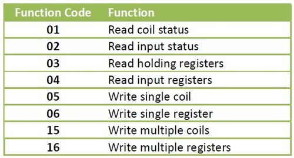{ width="760" loading="lazy" }](display-interface-guide-table-5-1-modbus-function-codes.jpeg){ .displaywiki-image-link title="Open full-size image" }
  <figcaption>Table 5-1 Modbus Function Codes</figcaption>
</figure>

For Smart Display control programs, the most commonly used are 06: Write single register (write a 16-bits value) and Read holding registers (read the value of multiple registers).

### Error Checking

The last 2 bytes seems the most mysterious part is actually not difficult. It’s just a CRC (Cyclic Redundancy Check) to insure the communication data. We don't necessarily have to study its principle in depth (but in fact, it is just a table lookup and bit operation, and finally a 16-bit check code is obtained), as long as we understand how to use it.

### Mapping Smart-Display Objects to Registers

As mentioned earlier, each Modbus needs to define the type and address of the register, and now we will discuss this topic.

### Register Categories

Smart Display registers can be roughly divided into three categories:

1.)Device information (e.g. version, device name, etc.)
Use 04: Read Input Registers to read. These data will only be changed when the firmware is updated, usually when it is just connected, to obtain the device characteristic parameters.

2.)Object properties (eg kind, location, etc.)
Use 03: Read Holding Registers/16: Write Multiple Register to read and write. These data affect the appearance of objects and usually do not change outside the design stage. To change the content, the Smart Display must be temporarily turned off before it can be updated.

3.)Object Values (values that the object represents, such as RPM, on or off, percentage, etc., varies from object to object)
This is the main change item in the operation. Each element uses a 16-bit value, so it is set with 06: Write Single Register.

The following is an organized list of these registers:

## Related reading

- [PCB Construction and Manufacturing Process](pcb-construction-process.md)
- [PCB Types and Material Selection](pcb-types-materials.md)
- [PCB Design, Fabrication, and Interconnection Selection](pcb-design-interconnections.md)

## Frequently Asked Questions

??? question "Is SPI suitable for a high-resolution display?"
    Usually only at modest refresh rates or for partial updates. Calculate the required pixel throughput and protocol overhead against the achievable SPI clock.

??? question "What is the difference between RGB, LVDS, and MIPI DSI?"
    RGB exposes parallel pixel timing, LVDS serializes display data over differential pairs, and MIPI DSI uses a packet-based high-speed link with low-power control states.

??? question "When should UART, RS-485, or CAN be used with a display?"
    They are useful when the display module includes its own controller and application protocol. They normally carry commands and data rather than raw full-frame pixels.

??? question "How do I estimate the required pixel-interface bandwidth?"
    Start with active pixels, refresh rate, and bits per pixel, then include horizontal and vertical blanking plus protocol overhead and implementation margin.

??? question "Can a communication interface replace a panel interface?"
    Not directly. A smart display may accept UART, RS-485, CAN, USB, or Ethernet commands, but an internal controller still drives the panel through a supported display interface.

!!! info "Can't find what you need?"
    If you need more products, resources or support, please contact our team:

    [**:material-archive-arrow-down: Knowledge Base**](../../knowledge/tags.md){ .md-button .md-button--primary }
    [**:material-magnify: Products & Solutions**](https://viewedisplay.com/){ .md-button }
    [**:material-email: Contact Support**](mailto:support@viewedisplay.com){ .md-button }
