<script type="application/ld+json">
{
  "@context": "https://schema.org",
  "@type": "FAQPage",
  "mainEntity": [
    {
      "@type": "Question",
      "name": "Which interface should a 7–10 inch panel at 1024 × 600 or above use?",
      "acceptedAnswer": {
        "@type": "Answer",
        "text": "Prefer **MIPI DSI** (4 lane) or **LVDS**; for notebooks and all-in-ones, go straight to **eDP**. All three are differential serial links and transmit reliably on panels 8 inches and above."
      }
    },
    {
      "@type": "Question",
      "name": "How do I choose between an SPI panel and an MCU 8080 panel?",
      "acceptedAnswer": {
        "@type": "Answer",
        "text": "They serve different roles: **SPI** suits low-resolution small panels (under 2 inch) or touch reporting, and saves a lot of pins; **MCU 8080** is the de facto standard for monochrome character and graphic displays and for small TFT panels under 3.5 inch. Whether the image has to be updated, how high the refresh rate is, and whether GRAM is used are the core questions."
      }
    },
    {
      "@type": "Question",
      "name": "Why is MIPI so widespread in phones?",
      "acceptedAnswer": {
        "@type": "Answer",
        "text": "By replacing a parallel RGB interface with 4–8 differential lanes, MIPI DSI cuts the pin count sharply and reduces EMI substantially, and the D-PHY physical layer is fast enough to cover the high resolution of a phone panel. It is exactly the compromise that light and thin bodies, high PPI, and long battery life demand."
      }
    },
    {
      "@type": "Question",
      "name": "Where are UART serial displays mainly used?",
      "acceptedAnswer": {
        "@type": "Answer",
        "text": "For **industrial HMI retrofits and rapid prototyping**: the host sends UI and widget commands over the serial link, the on-screen MCU parses and renders them, and the cost of porting a GUI library to an external MCU disappears. The Viewe serial display is built on exactly this principle."
      }
    },
    {
      "@type": "Question",
      "name": "How do I choose between 11-bit and 29-bit CAN IDs?",
      "acceptedAnswer": {
        "@type": "Answer",
        "text": "11-bit (CAN 2.0A) is enough when there are few nodes and is the mainstream choice. 29-bit (CAN 2.0B / CAN FD) supports more complex networks and is the trend for automotive multi-domain controllers. The two are distinguished by frame format on the same bus, so they can coexist."
      }
    },
    {
      "@type": "Question",
      "name": "Which function codes are used most often for Modbus register access?",
      "acceptedAnswer": {
        "@type": "Answer",
        "text": "- 03 read holding registers\n- 06 write single register\n- 16 (0x10) write multiple registers\n- 04 read input registers"
      }
    },
    {
      "@type": "Question",
      "name": "Both eDP and MIPI DSI can run 4K, so what is the real difference?",
      "acceptedAnswer": {
        "@type": "Answer",
        "text": "**eDP** mainly serves notebooks, all-in-ones, and embedded boards: longer links, an AUX channel, and an emphasis on distance and a fixed connection. **MIPI DSI** serves phones, tablets, and small panels with forced refresh: shorter reach, fewer pins, and a more sensitive thermal design."
      }
    }
  ]
}
</script>

# Display Interfaces Explained: MCU, RGB, LVDS, MIPI, SPI, and More

!!! abstract "Quick answer"
    Selecting a display interface is tightly coupled to resolution, transmission distance, noise immunity, connector cost, and the resources available on the host chip. This article breaks the mainstream interfaces into three families — parallel, serial, and communication bus — and closes with a single comparison table that covers a first-pass selection.

## Key Takeaways

- **Parallel interfaces** suit small and medium TFT panels: MCU 8080/6800 for low-resolution small screens, and parallel RGB for 3.5"–8" medium resolutions.
- **High-speed serial interfaces** suit large high-resolution panels: LVDS and MIPI DSI are now mainstream, and eDP is penetrating notebooks and all-in-ones quickly.
- **Low-speed serial and bus interfaces** carry parameters and touch data: I2C, SPI, UART, USB, HDMI, RS-232, CAN, and RS-485 each have a different role and have to be combined to fit the scenario.
- **Selection is about the closest match, not the strongest option**: resolution, transmission distance, noise immunity, chip resources, and connector cost together decide the interface.

## 1. Parallel Interfaces

Parallel interfaces are still the mainstay for small TFT panels, because routing is simple, the demand on MCU resources is low, and the protocol is mature.

### 1.1 MCU 8080/6800

<figure markdown="span" class="displaywiki-figure">
  [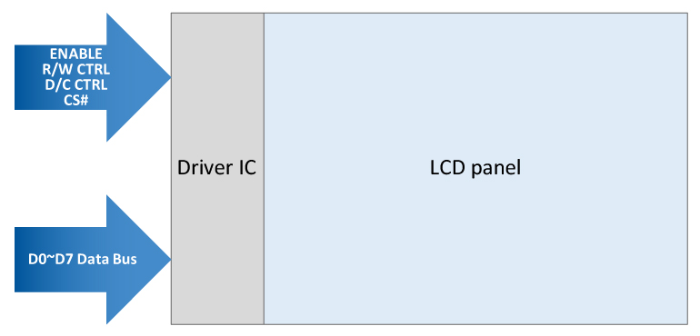{ width="760" loading="lazy" }](display-interface-guide-1-1-mcu-interface-8080-6800.jpeg){ .displaywiki-image-link title="Open full-size image" }
  <figcaption>MCU 8080/6800 parallel interface: the ENABLE, R/W, D/C, and CS# control signals accompany the D0–D7 data bus into the driver IC, which drives the LCD panel.</figcaption>
</figure>

The MCU interface is made up of two timing families, 8080 and 6800, of which 8080 is the more widespread. Data lines are commonly 4/8/9/16 bits wide (8 bits is the most common), and the control signals include CS (chip select), RS (data / register select), RD (read enable), and WR (write enable).

The display receives the raw bus data directly according to the control-bus signals, and the communication bandwidth depends on the operating speed of the driver IC. Taking a QVGA 320 × 240 panel as an example, the communication bandwidth required while the data enable signal is active is about:

```text
320 × 240 / 8-bit (data width) × 60 fps ≈ 576 kHz
```

**Advantages**: simple protocol and clear control logic.

**Limitations**: an external frame buffer (GRAM) is required; speed is limited, so it struggles to drive large high-resolution panels.

**Applications**: monochrome character and graphic displays, and small TFT panels (< 3.5").

<figure markdown="span" class="displaywiki-figure">
  [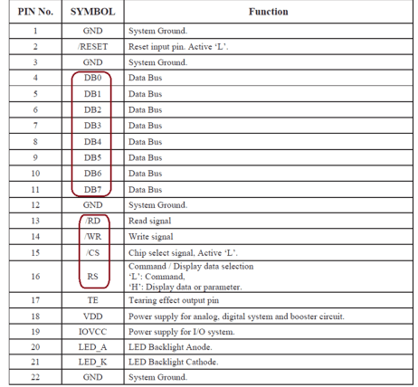{ width="760" loading="lazy" }](display-interface-guide-mcu-parallel-interface.png){ .displaywiki-image-link title="Open full-size image" }
  <figcaption>Pin definition of a typical MCU-interface TFT driver IC: the DB0–DB7 data bus, the RD and WR enables, CS chip select, and RS command / data selection.</figcaption>
</figure>

The ENABLE timing of an MCU 8080 link sets its practical bandwidth. In one pin-to-pin compatible replacement project, a customer needed to swap an end-of-life LCD controller for a module with the same footprint. The replacement PCB drove an MCU interface, and the measured ENABLE low period had to be at least 9.92 us, which caps the communication bandwidth at roughly 100 kbit/s.

<figure markdown="span" class="displaywiki-figure">
  [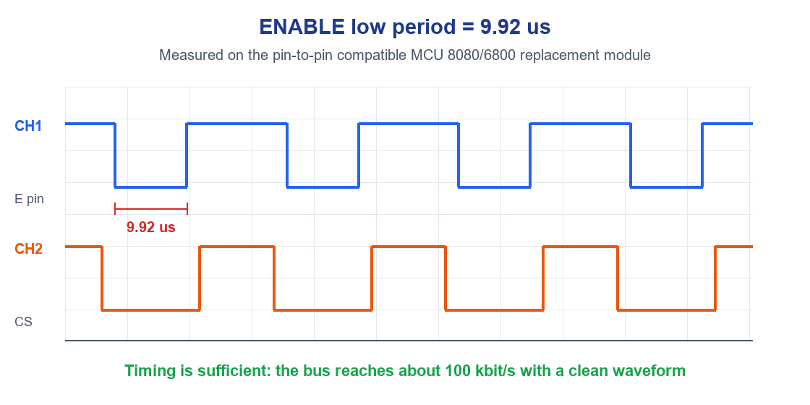{ width="760" loading="lazy" }](display-interface-guide-enable-992us-en.png){ .displaywiki-image-link title="Open full-size image" }
  <figcaption>Measured waveform with the ENABLE low period at 9.92 us: CH1 is the E pin and CH2 is CS. The waveform stays clean and the bus reaches about 100 kbit/s.</figcaption>
</figure>

Shortening the ENABLE low period to 9.84 us nominally pushes the communication speed up to about 101 kbit/s, but it introduces edge defects.

<figure markdown="span" class="displaywiki-figure">
  [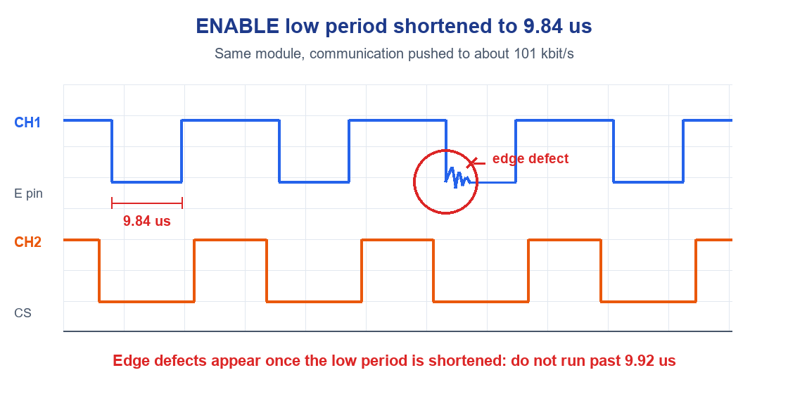{ width="760" loading="lazy" }](display-interface-guide-enable-984us-en.png){ .displaywiki-image-link title="Open full-size image" }
  <figcaption>Edge defects appear once the ENABLE low period is shortened to 9.84 us, so this timing must not be used even though it nominally reaches 101 kbit/s.</figcaption>
</figure>

### 1.2 Parallel RGB 16/18/24-bit

The parallel RGB interface feeds pixel data into the display driver IC in parallel, with common bus widths of 16, 18, and 24 bits.

<figure markdown="span" class="displaywiki-figure">
  [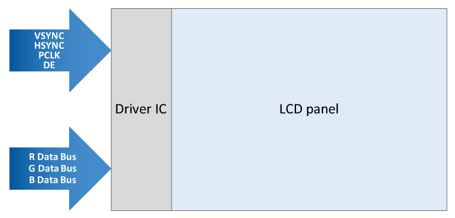{ width="760" loading="lazy" }](display-interface-guide-features.jpeg){ .displaywiki-image-link title="Open full-size image" }
  <figcaption>Parallel RGB interface structure: VSYNC, HSYNC, PCLK, and DE synchronize the transfer while the R, G, and B data buses carry pixel data into the driver IC and on to the LCD panel.</figcaption>
</figure>

The signal set includes:

- **R/G/B data lines** (6 / 16 / 18 / 24 bits, corresponding to RGB666, RGB565, RGB666, and RGB888)
- **VSYNC**: vertical synchronization signal
- **HSYNC**: horizontal synchronization signal
- **DE**: data enable
- **PCLK**: pixel clock

<figure markdown="span" class="displaywiki-figure">
  [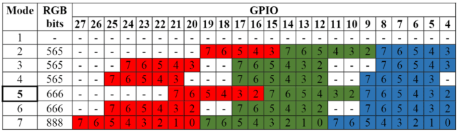{ width="760" loading="lazy" }](display-interface-guide-rgb-interface.png){ .displaywiki-image-link title="Open full-size image" }
  <figcaption>GPIO pin mapping of a driver IC in 24-bit, 18-bit, and 16-bit RGB modes; the number of R, G, and B pins changes with the color depth.</figcaption>
</figure>

Taking WVGA 800 × 480 at 60 fps as an example:

```text
800 × 480 × 60 fps ≈ 23.04 MHz (pixel clock)
```

**Advantages**: the R/G/B data is written straight into the LCD with no GRAM, so the refresh rate is high and the protocol is simple.

**Limitations**: more control signals than an MCU parallel bus, so routing is denser; trace length and impedance matching need care.

**Applications**: medium-size TFT panels (3.5"–8").

<figure markdown="span" class="displaywiki-figure">
  [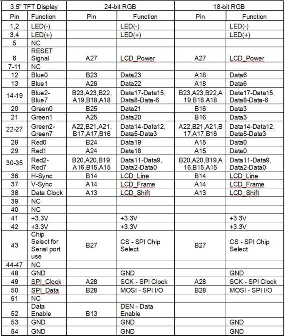{ width="760" loading="lazy" }](display-interface-guide-examples-of-24-bit-and-18-bit-rgb-interface.png){ .displaywiki-image-link title="Open full-size image" }
  <figcaption>24-bit and 18-bit RGB interfaces on a 3.5-inch TFT display: the 18-bit option drops the two least significant bits of each channel to save pins.</figcaption>
</figure>

### 1.3 Serial RGB 6/8-bit

To reduce the number of signal lines in a parallel RGB interface, the multi-bit data can be split into cycles and sent serially:

<figure markdown="span" class="displaywiki-figure">
  [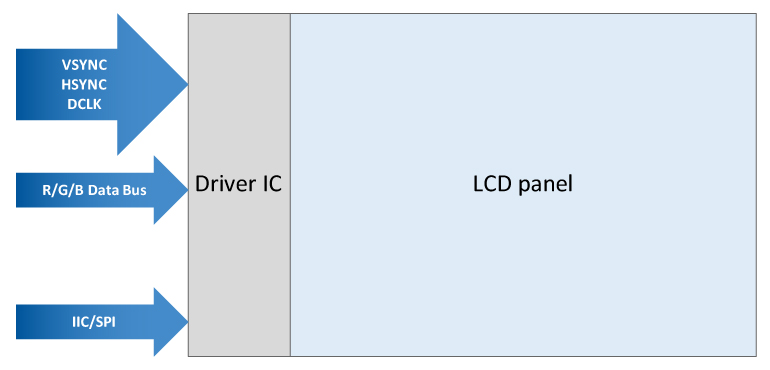{ width="760" loading="lazy" }](display-interface-guide-2-3-serial-rgb-6-8-bits.jpeg){ .displaywiki-image-link title="Open full-size image" }
  <figcaption>Serial RGB 6/8-bit structure: VSYNC, HSYNC, and DCLK plus a narrow R/G/B data bus, with the I2C / SPI configuration link feeding the driver IC.</figcaption>
</figure>

Taking QVGA 320 × 240 with 16-bit color depth at 30 fps as an example:

```text
320 × 240 × 3 (three channels) × 30 fps ≈ 6.912 MHz (DCLK)
```

Serial RGB keeps the advantages of the parallel RGB interface while cutting the pin count to eight or fewer, which makes it a common compromise for medium-size TFT panels driven by low-cost MCUs.

## 2. High-Speed Serial Interfaces

Once resolution passes 800 × 480, the pin count and EMI problems of parallel interfaces start to show; high-speed serial interfaces were designed for exactly that.

### 2.1 SPI (Serial Peripheral Interface)

SPI is a master-slave structure, typically one master with one or more slaves. It uses four signal lines:

- **SCLK**: synchronous clock, driven by the master.
- **MOSI**: master out, slave in; the master sends data to the slaves.
- **MISO**: master in, slave out; the selected slave returns data to the master.
- **CS**: chip select, dedicated to each slave.

<figure markdown="span" class="displaywiki-figure">
  [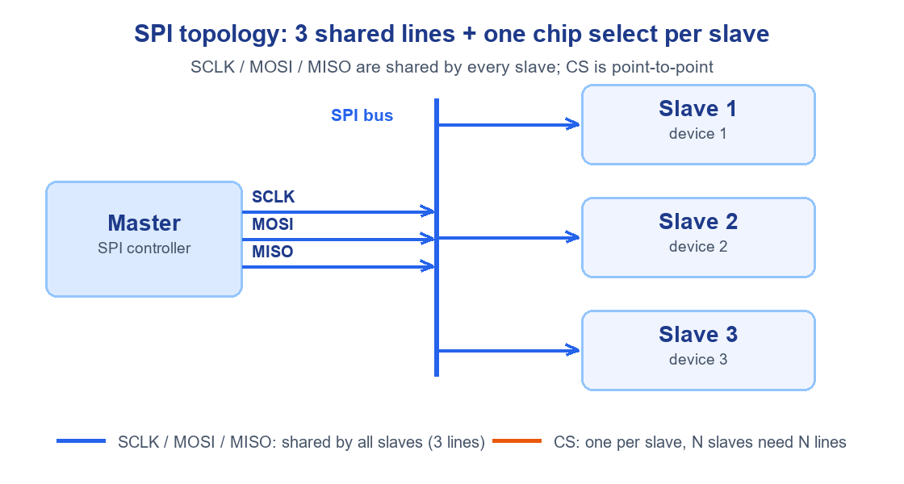{ width="760" loading="lazy" }](display-interface-guide-spi-schematic-en.png){ .displaywiki-image-link title="Open full-size image" }
  <figcaption>SPI master-slave topology: SCLK, MOSI, and MISO are shared by every slave, while CS is point-to-point, so N slaves need N chip-select lines.</figcaption>
</figure>

In display designs, SPI suits configuration commands and small low-resolution images. Taking QVGA 320 × 240 with 16-bit color depth at 30 fps as an example:

```text
320 × 240 × 16 bit × 30 fps ≈ 36.864 MHz
```

### 2.2 I2C (Inter-Integrated Circuit)

Unlike the point-to-point SPI link, I2C is a bus interface, which allows one or more masters together with multiple slaves:

<figure markdown="span" class="displaywiki-figure">
  [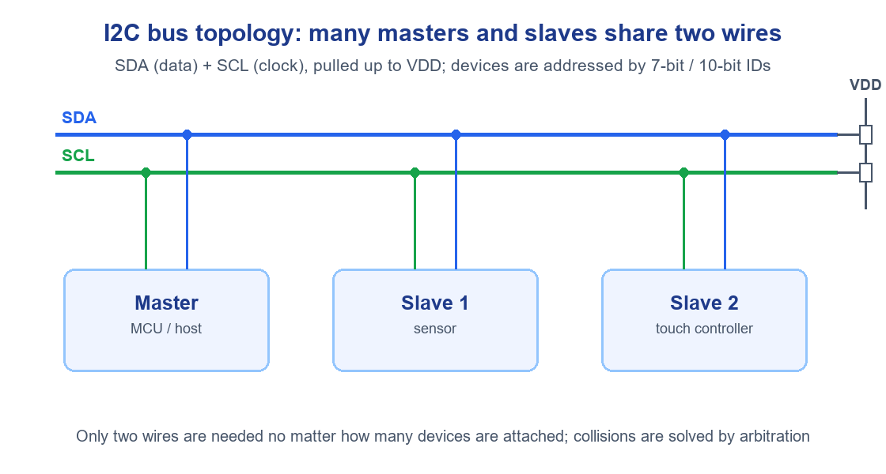{ width="760" loading="lazy" }](display-interface-guide-i2c-schematic-en.png){ .displaywiki-image-link title="Open full-size image" }
  <figcaption>I2C is a bus rather than a point-to-point link: every device hangs on the same SDA and SCL pair, pulled up to VDD, and is selected by its 7-bit or 10-bit address.</figcaption>
</figure>

I2C speed grades:

| Mode | Bit rate |
| --- | --- |
| Standard mode | 100 kbit/s |
| Fast mode | 400 kbit/s |
| Fast mode plus | 1 Mbit/s |
| High-speed mode | 3.2 Mbit/s |

I2C is used mainly for register configuration and touch reporting, and rarely carries image data.

### 2.3 LVDS (Low-Voltage Differential Signaling)

LVDS is an electrical-layer standard introduced in 1994, not a complete protocol. It defines the high-bandwidth characteristics of a low-voltage differential signal over inexpensive twisted-pair cable, which is why several upper-layer protocols reuse it. In flat-panel display engineering the display-oriented link is often called FPD-Link, and some vendors early on used LVDS to refer to the whole protocol.

<figure markdown="span" class="displaywiki-figure">
  [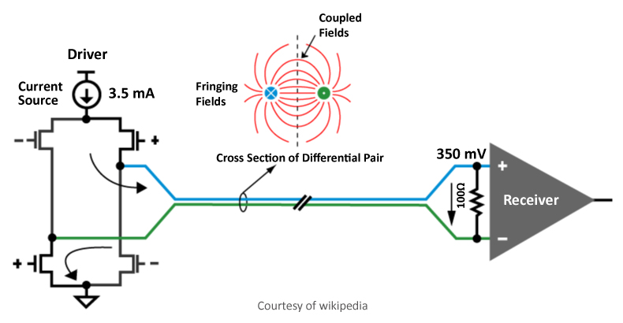{ width="760" loading="lazy" }](display-interface-guide-2-4-lvds-low-voltage-differential-signal-it-should-name-fpd-link-for-t.jpeg){ .displaywiki-image-link title="Open full-size image" }
  <figcaption>LVDS driver and receiver: a 3.5 mA current source steers current through the differential pair, producing about 350 mV across the 100 Ω termination at the receiver.</figcaption>
</figure>

<figure markdown="span" class="displaywiki-figure">
  [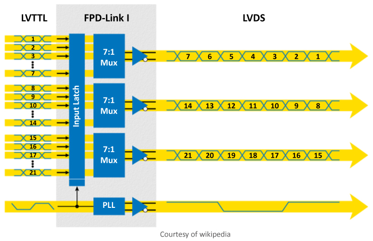{ width="760" loading="lazy" }](display-interface-guide-features-2.jpeg){ .displaywiki-image-link title="Open full-size image" }
  <figcaption>FPD-Link I serializer: 21 LVTTL data lines plus control are multiplexed 7:1 onto three LVDS pairs, with a separate PLL pair for the clock.</figcaption>
</figure>

**Features**: differential routing resists electromagnetic interference, power consumption is low, and the link can run at GHz rates over cheap twisted-pair cable.

**Applications**: large panels (> 7"), industrial control displays, and automotive instrument clusters.

<figure markdown="span" class="displaywiki-figure">
  [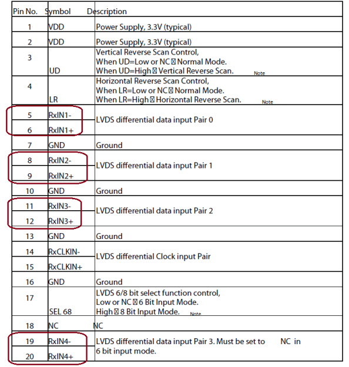{ width="760" loading="lazy" }](display-interface-guide-example-of-lvds-interface.png){ .displaywiki-image-link title="Open full-size image" }
  <figcaption>LVDS interface pinout of a 20-pin TFT module: three differential data pairs plus one differential clock pair, along with power and an SEL68 pin for 6-bit or 8-bit mode.</figcaption>
</figure>

### 2.4 MIPI DSI / CSI (MIPI Alliance)

The MIPI Alliance set out to lower the cost of display controllers in mobile devices and defined two serial bus protocols, DSI for displays and CSI for cameras. DSI sits on the D-PHY physical layer, and the per-lane rate has grown with each version (D-PHY 2.0 reaches 4.5 Gbit/s per lane); a link consists of one clock lane plus one or more data lanes.

<figure markdown="span" class="displaywiki-figure">
  [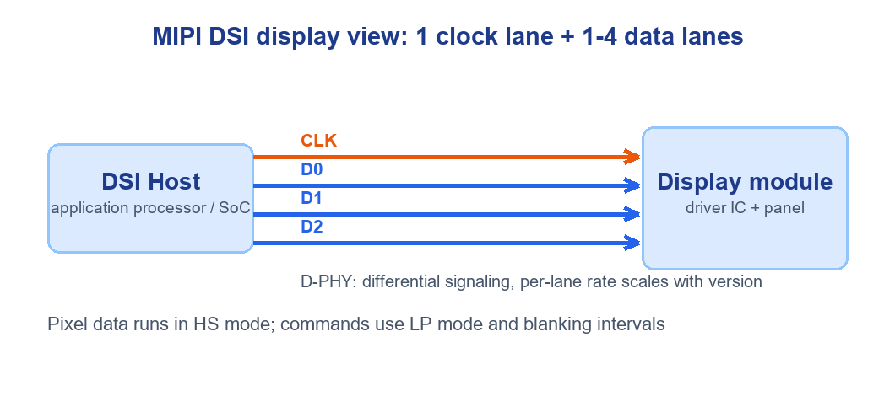{ width="760" loading="lazy" }](display-interface-guide-dsi-display-view-en.png){ .displaywiki-image-link title="Open full-size image" }
  <figcaption>DSI display view: one clock lane plus one to four data lanes, with the DSI host driving the display module unidirectionally.</figcaption>
</figure>

<figure markdown="span" class="displaywiki-figure">
  [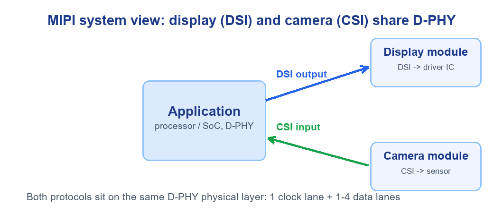{ width="760" loading="lazy" }](display-interface-guide-dsi-system-view-en.png){ .displaywiki-image-link title="Open full-size image" }
  <figcaption>DSI system view: display (DSI output) and camera (CSI input) share the same D-PHY physical layer.</figcaption>
</figure>

Image data on the bus is interleaved with the H/V blanking interval signals; the display end needs no large frame buffer, but it must be refreshed continuously (30 or 60 fps) or the image is lost immediately. Pixel data travels only in HS high-speed mode, while commands are carried in LP low-power mode and during blanking intervals.

<figure markdown="span" class="displaywiki-figure">
  [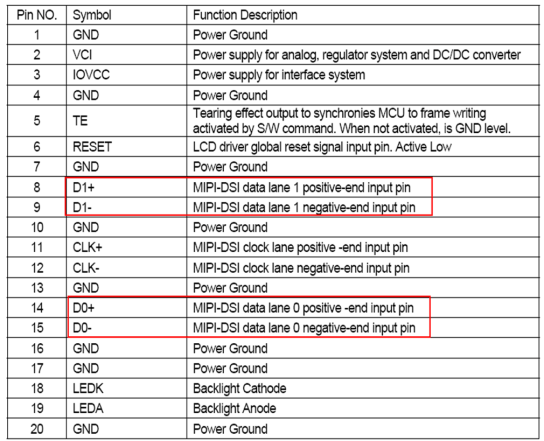{ width="760" loading="lazy" }](display-interface-guide-an-example-of-mipi-interface.png){ .displaywiki-image-link title="Open full-size image" }
  <figcaption>MIPI DSI pinout of a 20-pin display module: one clock lane, two data lanes, ground pins, and the LEDA / LEDK backlight supply.</figcaption>
</figure>

**Features**: high speed, low pin count, and low EMI; MIPI DSI has become the default interface for smartphones and most TFT modules.

### 2.5 eDP (Embedded DisplayPort)

DisplayPort was developed by a consortium of PC and chip manufacturers and standardized by VESA. eDP is the embedded version aimed at internal displays in notebooks, all-in-ones, and tablets; it set out to replace VGA, DVI, and FPD-Link (LVDS), and it is compatible with HDMI and DVI through active or passive adapters. It carries not only video but also audio, USB, and other forms of data.

<figure markdown="span" class="displaywiki-figure">
  [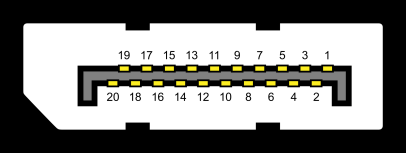{ width="760" loading="lazy" }](display-interface-guide-edp-interface.png){ .displaywiki-image-link title="Open full-size image" }
  <figcaption>eDP connector: a 20-pin interface that carries up to four differential main-link lanes plus the AUX channel and power.</figcaption>
</figure>

<figure markdown="span" class="displaywiki-figure">
  [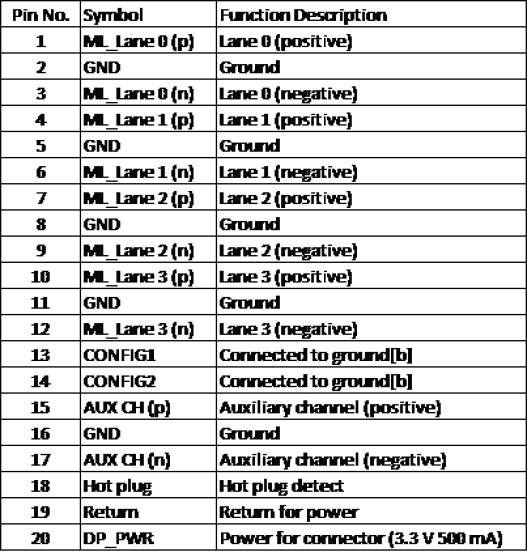{ width="760" loading="lazy" }](display-interface-guide-edp-interface-2.png){ .displaywiki-image-link title="Open full-size image" }
  <figcaption>eDP pin definition: ML_Lane 0–3 main-link pairs, AUX CH, CONFIG1 and CONFIG2, hot plug detect, and DP_PWR.</figcaption>
</figure>

**Features**: high bandwidth, and support for high resolution and high color depth; mainly used for the large screens of notebooks and all-in-ones.

## 3. Communication and Peripheral Buses

The interfaces below behave more like general-purpose communication buses. They are commonly used for touch reporting, panel-parameter configuration, host-side debugging, and production-line testing.

### 3.1 UART Interface

UART (Universal Asynchronous Receiver / Transmitter) implements serial communication and is essentially a bridge between the parallel and serial domains. One end of a UART is a bus of eight data lines plus a few control pins; the other end is the two serial wires, RX and TX.

<figure markdown="span" class="displaywiki-figure">
  [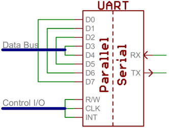{ width="760" loading="lazy" }](display-interface-guide-urat-interface.png){ .displaywiki-image-link title="Open full-size image" }
  <figcaption>UART interface: an 8-bit parallel data bus and control I/O on one side, and the RX / TX serial pair on the other.</figcaption>
</figure>

A serial display is built on UART: the host sends UI and widget commands over the serial link, the on-screen MCU parses them and renders the result, and porting a GUI library to an external MCU is no longer necessary. This makes it a common choice for industrial HMI retrofits and prototype validation.

### 3.2 USB Interface

USB (Universal Serial Bus) connects a PC with peripherals such as cameras, mice, keyboards, printers, scanners, and external storage, and has gone through USB 1.x, USB 2.0, USB 3.x, and USB 4. Capacitive touch screens also commonly report touch data over USB by bridging to the HID protocol.

<figure markdown="span" class="displaywiki-figure">
  [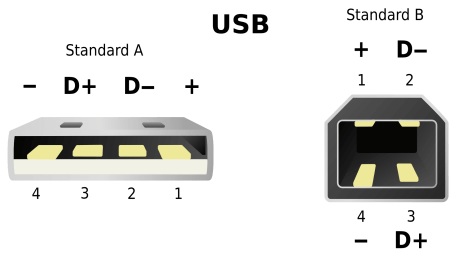{ width="760" loading="lazy" }](display-interface-guide-usb-interface.png){ .displaywiki-image-link title="Open full-size image" }
  <figcaption>USB connector pinouts: Standard A and Standard B, each carrying VBUS, GND, and the D+ / D− differential pair.</figcaption>
</figure>

### 3.3 HDMI Interface

HDMI (High-Definition Multimedia Interface) is a proprietary interface for uncompressed video plus digital audio. It connects an HDMI-compliant source device, such as a display controller, to a computer monitor, video projector, digital television, or digital audio device, and it is the digital replacement for the analog video standards.

<figure markdown="span" class="displaywiki-figure">
  [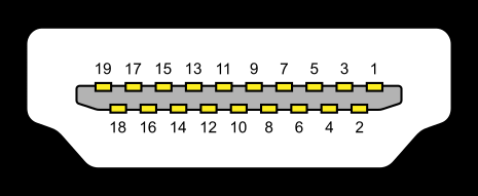{ width="760" loading="lazy" }](display-interface-guide-with-more-and-more-popular-of-color-tft-lcd-hdmi-is-getting-popular-in.png){ .displaywiki-image-link title="Open full-size image" }
  <figcaption>HDMI connector pinout: four TMDS differential pairs (three data plus one clock) alongside the CEC, DDC, and hot-plug detect pins.</figcaption>
</figure>

<figure markdown="span" class="displaywiki-figure">
  [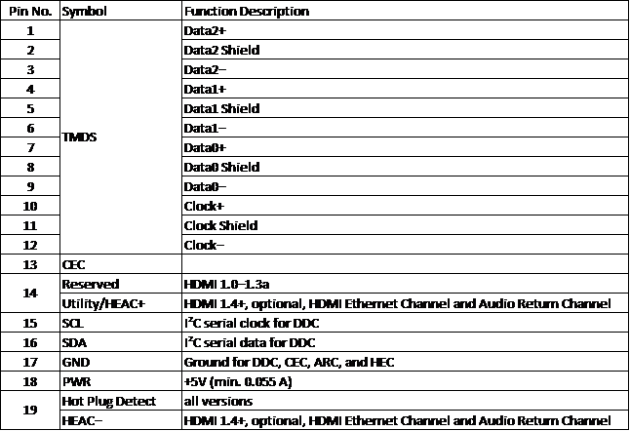{ width="760" loading="lazy" }](display-interface-guide-hdmi-interface.png){ .displaywiki-image-link title="Open full-size image" }
  <figcaption>HDMI pin definition: the Data0–Data2 and Clock TMDS lanes with their shields, plus CEC, the SCL / SDA DDC pair, and the +5 V supply.</figcaption>
</figure>

As color TFT LCDs became more widespread, HDMI spread quickly through the display industry, but real embedded designs still rely mainly on parallel RGB, LVDS, and MIPI; HDMI is mostly used for external monitors or video transport.

### 3.4 RS-232 Interface

RS-232 is the classic serial communication standard, used to connect a computer with peripherals and to support point-to-point serial data exchange. Common connection definitions:

- **GND**: signal ground
- **VCC**: +5 V (some designs use ±12 V levels)

<figure markdown="span" class="displaywiki-figure">
  [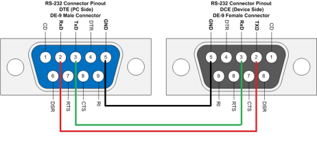{ width="760" loading="lazy" }](display-interface-guide-rs232-interface.png){ .displaywiki-image-link title="Open full-size image" }
  <figcaption>RS-232 pinout for a DE-9 connector: the DTE and DCE sides are wired so that TXD on one end lands on RXD on the other.</figcaption>
</figure>

Compared with RS-422, RS-485, and Ethernet, RS-232 has a lower transmission speed, a shorter maximum cable length, a larger voltage swing, bulkier connectors, and no multipoint capability. On PCs, USB has displaced RS-232 from most peripheral interface roles; few new machines ship with a native RS-232 port, so an external USB-to-RS-232 converter or an internal expansion card is needed. Thanks to its simplicity and reliability, RS-232 nevertheless still holds a place in industrial machines, networking equipment, and scientific instruments.

### 3.5 CAN Bus

CAN (Controller Area Network) is an automotive bus standard introduced by Bosch, whose goal was to let ECUs communicate with each other without a central host:

<figure markdown="span" class="displaywiki-figure">
  [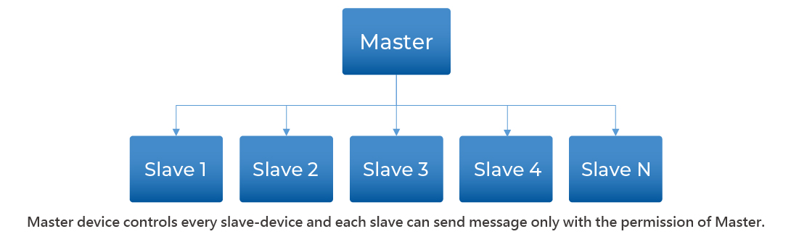{ width="760" loading="lazy" }](display-interface-guide-can-bus-system-topology.jpeg){ .displaywiki-image-link title="Open full-size image" }
  <figcaption>Host-controlled bus topology, shown for contrast: a master manages every slave and a slave replies only when the master permits it. CAN does not work this way — nodes broadcast to the whole network and no central master is needed.</figcaption>
</figure>

CAN covers only the physical layer and the data link layer in the OSI model, and its differential physical layer normally has a characteristic impedance of 120 Ω. The logic signals are:

- Dominant (logic 0): CAN_H is pulled high and CAN_L pulled low, for a differential of about 2 V
- Recessive (logic 1): the bus is not driven

<figure markdown="span" class="displaywiki-figure">
  [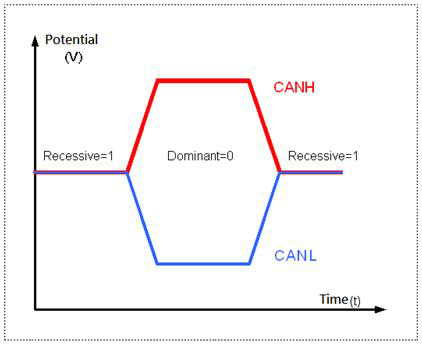{ width="760" loading="lazy" }](display-interface-guide-realistic-measurement-on-wl0f00039000qgaaasb00-can-h-can-l.jpeg){ .displaywiki-image-link title="Open full-size image" }
  <figcaption>CAN_H / CAN_L differential potential: a dominant bit drives CAN_H high and CAN_L low for a nominal 2 V differential, while a recessive bit leaves the pair undriven.</figcaption>
</figure>

CAN is a broadcast mechanism based on message IDs. The ID identifies the content and is also the basis for priority arbitration: when two nodes transmit at the same time, the smaller ID wins. Bitwise arbitration uses a wired-AND logic, so the node that wins continues transmitting and the loser retransmits automatically, with no central scheduler.

### 3.6 CAN History at a Glance

- **1986**: CAN was officially announced at the SAE (Society of Automotive Engineers) meeting in Detroit.
- **1987**: Intel and Philips released the first CAN controller chips; in 1991 the Mercedes-Benz W140 became the first production car with a CAN multiline system.
- **1991**: Bosch published the CAN 2.0 specification, split into Part A (11-bit ID, standard format) and Part B (29-bit ID, extended format).
- **1993**: ISO published the CAN international standard ISO 11898, later split into ISO 11898-1 (data link layer), ISO 11898-2 (high-speed physical layer), and ISO 11898-3 (low-speed fault-tolerant physical layer).
- **2001 / 2004**: the EU EOBD standard took effect for gasoline and diesel vehicles respectively, requiring on-board diagnostic buses; from 2008 the United States required every vehicle sold to support CAN.
- **2012**: Bosch released CAN FD 1.0, which allows a switch to a higher bit rate and longer data after arbitration and remains compatible with CAN 2.0 networks.

### 3.7 CAN Frame Structure and Hardware Features

Each frame carries an 11-bit (CAN 2.0A) or 29-bit (CAN 2.0B) ID, up to 8 data bytes, and CRC and ACK fields. Every node also monitors its own transmission: if the bus level differs from what it sent, arbitration or a collision has occurred.

<figure markdown="span" class="displaywiki-figure">
  [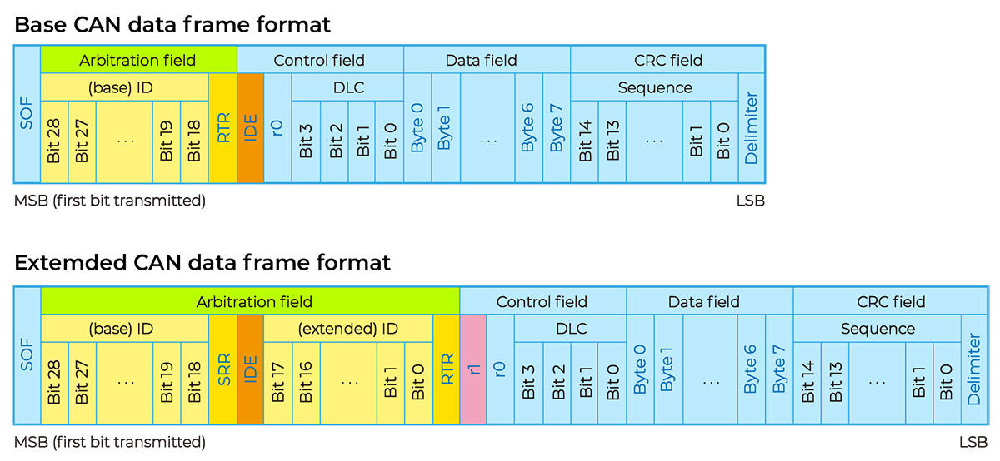{ width="760" loading="lazy" }](display-interface-guide-can-bus-traffic-data-looks.jpeg){ .displaywiki-image-link title="Open full-size image" }
  <figcaption>Base and extended CAN data frame formats: the 11-bit base ID of CAN 2.0A and the 29-bit extended ID of CAN 2.0B, followed by the control, data, and CRC fields.</figcaption>
</figure>

<figure markdown="span" class="displaywiki-figure">
  [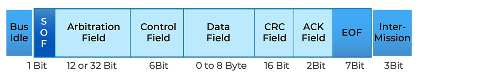{ width="760" loading="lazy" }](display-interface-guide-data-sequences-in-payload.jpeg){ .displaywiki-image-link title="Open full-size image" }
  <figcaption>Field sequence of a CAN frame: bus idle, SOF, arbitration, control, data (0–8 bytes), CRC, ACK, EOF, and inter-mission.</figcaption>
</figure>

<figure markdown="span" class="displaywiki-figure">
  [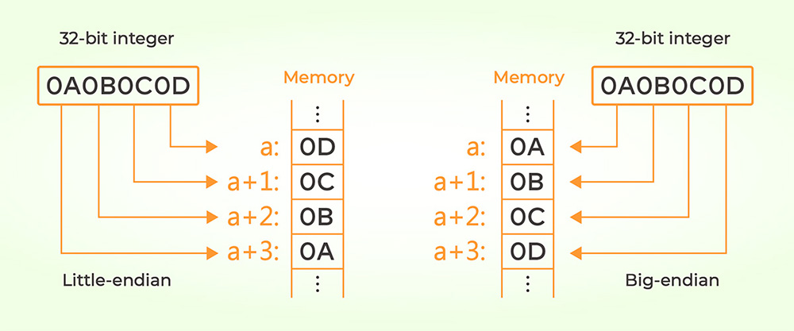{ width="760" loading="lazy" }](display-interface-guide-conclusions.jpeg){ .displaywiki-image-link title="Open full-size image" }
  <figcaption>Byte order inside a CAN payload: the same 32-bit value is stored little-endian or big-endian, so transmitter and receiver have to agree on how the 8 data bytes map onto it.</figcaption>
</figure>

In hardware, all nodes share one pair of differential lines terminated with 120 Ω, and every node can both send and receive.

<figure markdown="span" class="displaywiki-figure">
  [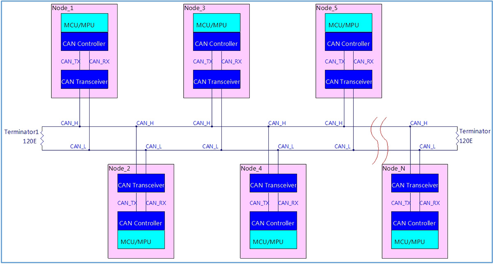{ width="760" loading="lazy" }](display-interface-guide-history.jpeg){ .displaywiki-image-link title="Open full-size image" }
  <figcaption>CAN node hardware and bus wiring: each node combines an MCU, a CAN controller, and a CAN transceiver, and the two bus wires are terminated with 120 Ω at both ends.</figcaption>
</figure>

<figure markdown="span" class="displaywiki-figure">
  [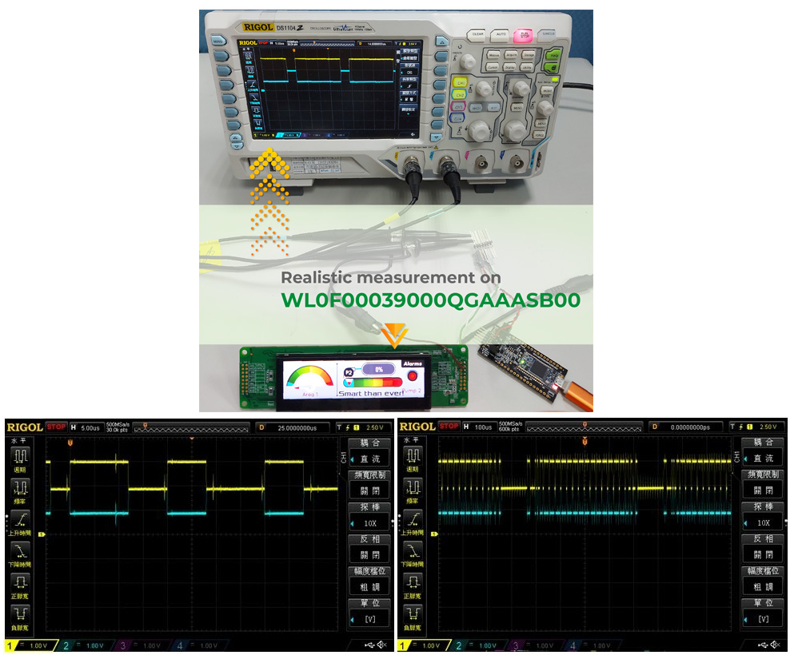{ width="760" loading="lazy" }](display-interface-guide-firmware-features.jpeg){ .displaywiki-image-link title="Open full-size image" }
  <figcaption>Realistic measurement on the WL0F00039000QGAAASB00 smart display: an oscilloscope captures CAN_H and CAN_L traffic while the module is running.</figcaption>
</figure>

### 3.8 Five Benefits and Application Scenarios of CAN

1. **Low cost**: multiple ECUs communicate over a single CAN bus, which means lighter wiring and simpler connectors.
2. **Centralized diagnostics**: the CAN bus gives central error diagnosis and configuration, such as OBD-II, a natural path.
3. **Robust**: the differential physical layer copes well with subsystem failures and with EMC.
4. **Deterministic priority**: ID-based bitwise arbitration guarantees that high-priority messages are not interrupted.
5. **Flexible expansion**: every ECU can receive all broadcast messages and act on the ones relevant to it, which makes adding nodes easy.

<figure markdown="span" class="displaywiki-figure">
  [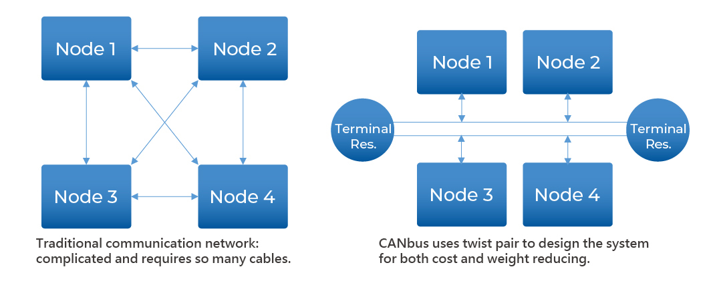{ width="760" loading="lazy" }](display-interface-guide-5-benefits-we-ve-got-base-on-can-bus-features.jpeg){ .displaywiki-image-link title="Open full-size image" }
  <figcaption>Why CAN cuts cost and weight: point-to-point wiring between every pair of nodes is replaced by a single twisted pair shared by all of them.</figcaption>
</figure>

<figure markdown="span" class="displaywiki-figure">
  [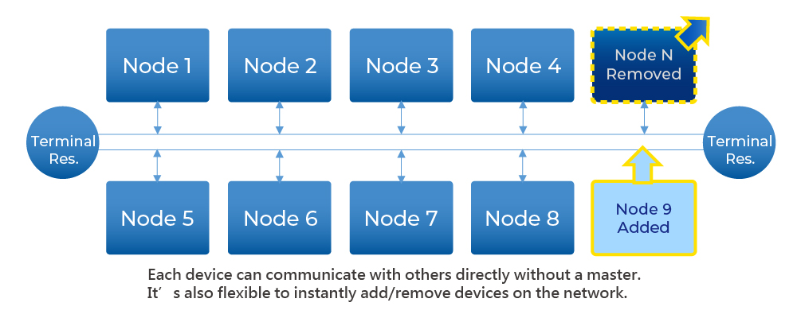{ width="760" loading="lazy" }](display-interface-guide-can-bus-system-topology-2.jpeg){ .displaywiki-image-link title="Open full-size image" }
  <figcaption>Adding and removing a node on a CAN bus: because there is no master, devices can be attached or detached without reconfiguring the network.</figcaption>
</figure>

Common applications: automotive (instrument clusters, ABS, OBD-II), rail and aviation and marine systems, mobile machinery (stackers, forklifts, construction and agricultural machinery), industrial automation, and medical and laboratory automation.

<figure markdown="span" class="displaywiki-figure">
  [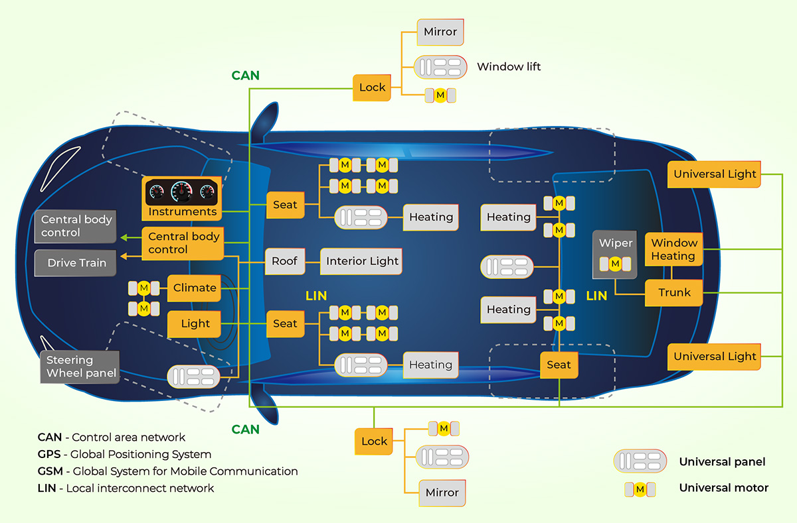{ width="760" loading="lazy" }](display-interface-guide-feature.jpeg){ .displaywiki-image-link title="Open full-size image" }
  <figcaption>CAN and LIN networks in a vehicle: CAN links the body, powertrain, and instrumentation ECUs, while LIN serves lower-cost subsystems such as mirrors, seats, and interior lighting.</figcaption>
</figure>

**Constraints**: in CANopen the 11-bit ID is split into a 4-bit function code and a 7-bit node ID, so a bus supports at most 127 unique addresses; in J1939 the device address limit is 253; and speed trades against transmission distance, since the longer the cable the lower the usable rate.

### 3.9 RS-485 and Modbus

RS-485 / Modbus is a common low-cost interface combination in industry. A differential pair, RS485_A / RS485_B, is all that is needed to communicate, most operating systems expose it as a serial port, and every platform has a matching development library. The Modbus protocol is simple and intuitive, so it is often used as an example.

<figure markdown="span" class="displaywiki-figure">
  [{ width="760" loading="lazy" }](display-interface-guide-rs232-interface.png){ .displaywiki-image-link title="Open full-size image" }
  <figcaption>Modbus / RS-485 physical link.</figcaption>
</figure>

**Modbus protocol essentials**:

- **Data format definition**: Modbus is really a data format rather than a physical interface. It defines the communication content of a master-slave architecture, and because it only defines the data structure, it can be carried over RS-232, RS-422, RS-485, TCP, and other physical layers.
- **Conceptual model**: Modbus treats data access as register reads and writes. Each device defines its own register map and addresses for external reference; writing a register sends data, and reading a register returns it. Every register is 16 bits wide.
- **Function codes**: the different read and write methods are distinguished by function codes, the common ones being 03 (read holding registers), 06 (write single register), and 16 (write multiple registers).

<figure markdown="span" class="displaywiki-figure">
  [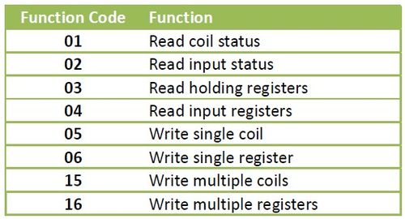{ width="760" loading="lazy" }](display-interface-guide-table-5-1-modbus-function-codes.jpeg){ .displaywiki-image-link title="Open full-size image" }
  <figcaption>Modbus function code quick reference: 01–06 and 15–16 cover coil, discrete input, holding register, and input register access.</figcaption>
</figure>

- **CRC**: the last two bytes of a message are a CRC (Cyclic Redundancy Check), essentially a 16-bit check code produced by table lookup and bit operations; calling an existing library is enough.
- **Register categories**:
    - **Device information** (version, device name, and so on): read with 04, read input registers. It changes only when the firmware is updated, so reading it once after connecting is enough.
    - **Object properties** (widget type, position, color, and so on): read with 03 and written with 16. They affect what the UI shows, are fixed at the design stage, and rarely change at runtime.
    - **Object values** (numbers, switches, percentages, and so on): these change frequently during operation. Each object holds one 16-bit value, written with 06, write single register.

## 4. Interface Comparison

The table below compares the common display interfaces with an emphasis on engineering trade-offs rather than peak performance. A real project should judge resolution, distance, noise requirements, chip resources, and connector cost together.

| Display interface | Resolution range | Speed | Pin count | Noise | Power | Transmission distance | Cost |
| --- | --- | --- | --- | --- | --- | --- | --- |
| MCU 8080/6800 | Medium-low | Low | Many | Medium | Low | Short | Low |
| Parallel RGB 16/18/24 | Medium | High | Many | Poor | High | Short | Low |
| SPI | Small | Low | Few (4) | Medium | Low | Short | Low |
| I2C | Small | Low | Few (2) | Medium | Low | Short | Low |
| Serial RGB 6/8-bit | Medium | Medium | Few | Poor | Medium | Short | Low |
| LVDS | Large | High | Medium | Good | Low | Long | Medium |
| MIPI DSI | Large | High | Few | Good | Low | Short | Medium |
| eDP | Large | High | Few | Good | Low | Long | Medium |
| UART | Small | Low | Few (2) | Medium | Low | Short | Low |
| USB | Medium | High | Medium | Medium | Medium | Short | Medium |
| HDMI | Large | High | Medium | Good | Medium | Short | Medium |
| RS-232 | Small | Low | Many (≥ 3) | Medium | Medium | Short | Low |
| CAN | Medium | Medium | Few (2) | Good | Low | Medium | Low |
| RS-485 / Modbus | Medium | Medium | Few (2) | Good | Low | Long | Low |

## 5. Selection Workflow

1. **Fix resolution and size first**: below 3.5", prefer MCU / SPI / I2C; from 3.5" to 8", use parallel RGB; above 8", consider LVDS / MIPI DSI / eDP.
2. **Then look at distance and noise immunity**: differential interfaces (LVDS / MIPI / eDP / CAN / RS-485) are clearly ahead over long cable runs and in electromagnetically noisy environments.
3. **Assess chip resources**: with limited MCU resources, prefer MCU 8080; with a GPU, DSP, or dedicated video IP, prefer LVDS / MIPI / eDP.
4. **Weigh ecosystem and development cost**: UART / RS-485 / Modbus have mature industrial protocol stacks, while I2C / SPI are the most common for panel parameters and touch.
5. **Vehicle and production-line testing**: CAN and RS-485 are the first choice for production-line diagnostics and host communication.

## 6. Frequently Asked Questions

??? question "Q1: Which interface should a 7–10 inch panel at 1024 × 600 or above use?"
    Prefer **MIPI DSI** (4 lane) or **LVDS**; for notebooks and all-in-ones, go straight to **eDP**. All three are differential serial links and transmit reliably on panels 8 inches and above.

??? question "Q2: How do I choose between an SPI panel and an MCU 8080 panel?"
    They serve different roles: **SPI** suits low-resolution small panels (under 2 inch) or touch reporting, and saves a lot of pins; **MCU 8080** is the de facto standard for monochrome character and graphic displays and for small TFT panels under 3.5 inch. Whether the image has to be updated, how high the refresh rate is, and whether GRAM is used are the core questions.

??? question "Q3: Why is MIPI so widespread in phones?"
    By replacing a parallel RGB interface with 4–8 differential lanes, MIPI DSI cuts the pin count sharply and reduces EMI substantially, and the D-PHY physical layer is fast enough to cover the high resolution of a phone panel. It is exactly the compromise that light and thin bodies, high PPI, and long battery life demand.

??? question "Q4: Where are UART serial displays mainly used?"
    For **industrial HMI retrofits and rapid prototyping**: the host sends UI and widget commands over the serial link, the on-screen MCU parses and renders them, and the cost of porting a GUI library to an external MCU disappears. The Viewe serial display is built on exactly this principle.

??? question "Q5: How do I choose between 11-bit and 29-bit CAN IDs?"
    11-bit (CAN 2.0A) is enough when there are few nodes and is the mainstream choice. 29-bit (CAN 2.0B / CAN FD) supports more complex networks and is the trend for automotive multi-domain controllers. The two are distinguished by frame format on the same bus, so they can coexist.

??? question "Q6: Which function codes are used most often for Modbus register access?"
    - 03 read holding registers
    - 06 write single register
    - 16 (0x10) write multiple registers
    - 04 read input registers

??? question "Q7: Both eDP and MIPI DSI can run 4K, so what is the real difference?"
    **eDP** mainly serves notebooks, all-in-ones, and embedded boards: longer links, an AUX channel, and an emphasis on distance and a fixed connection. **MIPI DSI** serves phones, tablets, and small panels with forced refresh: shorter reach, fewer pins, and a more sensitive thermal design.

## Related reading

- [PCB Construction and Manufacturing Process](pcb-construction-process.md)
- [PCB Types and Material Selection](pcb-types-materials.md)
- [PCB Design, Fabrication, and Interconnection Selection](pcb-design-interconnections.md)
- [MIPI Interface Basics](mipi-interface-basics.md)
- [LCD Panel Timing Parameters Explained](lcd-panel-timing-parameters.md)

!!! info "Can't find what you need?"
    If you need more products, resources or support, please contact our team:

    [**:material-archive-arrow-down: Knowledge Base**](../../knowledge/tags.md){ .md-button .md-button--primary }
    [**:material-magnify: Products & Solutions**](https://viewedisplay.com/){ .md-button }
    [**:material-email: Contact Support**](mailto:support@viewedisplay.com){ .md-button }
