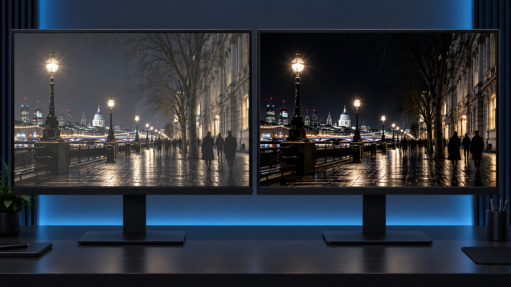
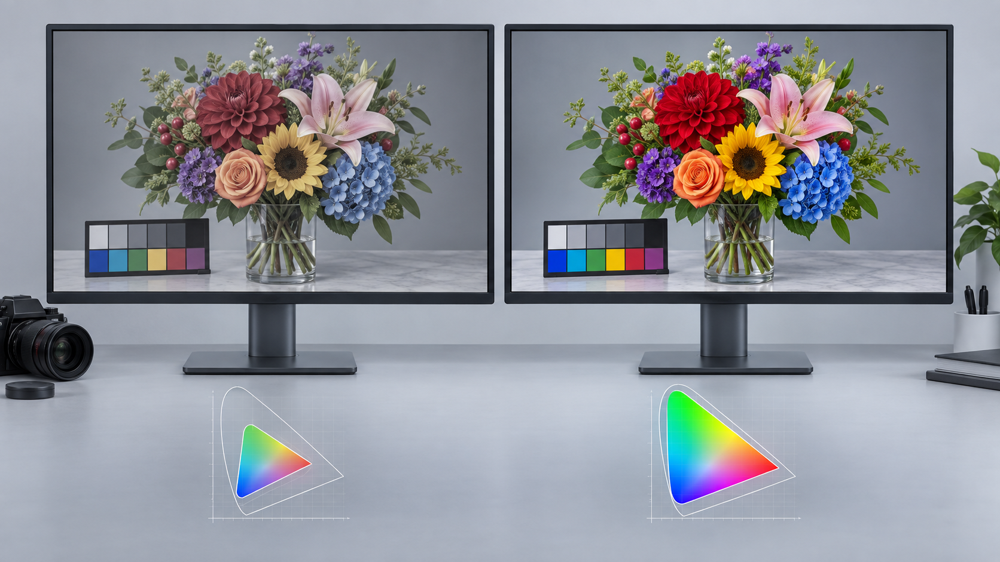
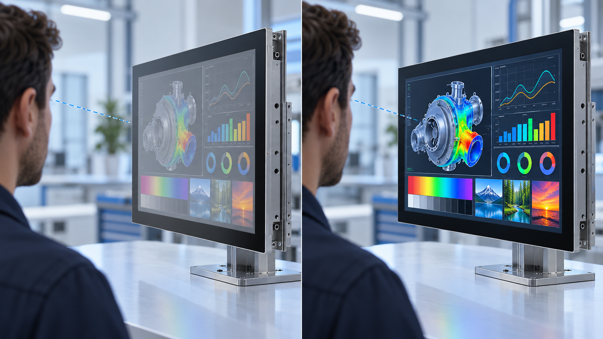

# How to Read Display Specifications

<script type="application/ld+json">
{
  "@context": "https://schema.org",
  "@graph": [
    {
      "@type": "TechArticle",
      "@id": "https://www.displaywiki.com/knowledge/posts/display-specifications/#article",
      "headline": "How to Read Display Specifications: An Engineering Guide",
      "description": "Learn how to evaluate LCD display size, resolution, PPI, brightness, uniformity, contrast ratio, color gamut, and viewing angle for engineering selection.",
      "url": "https://www.displaywiki.com/knowledge/posts/display-specifications/",
      "mainEntityOfPage": {
        "@type": "WebPage",
        "@id": "https://www.displaywiki.com/knowledge/posts/display-specifications/"
      },
      "image": {
        "@type": "ImageObject",
        "url": "https://www.displaywiki.com/knowledge/posts/display-specifications-use-the-formula.png"
      },
      "datePublished": "2026-09-01",
      "dateModified": "2026-09-11",
      "author": {
        "@type": "Organization",
        "name": "VIEWE",
        "url": "https://viewedisplay.com/"
      },
      "publisher": {
        "@type": "Organization",
        "name": "VIEWE",
        "url": "https://viewedisplay.com/"
      },
      "inLanguage": "en",
      "keywords": [
        "Display Technology",
        "Engineering Selection"
      ]
    },
    {
      "@type": "FAQPage",
      "@id": "https://www.displaywiki.com/knowledge/posts/display-specifications/#faq",
      "mainEntity": [
        {
          "@type": "Question",
          "name": "Does a higher resolution always produce a better image?",
          "acceptedAnswer": {
            "@type": "Answer",
            "text": "No. Viewing distance, active size, pixel layout, content, optics, processing capability, and interface bandwidth determine whether the extra resolution is useful."
          }
        },
        {
          "@type": "Question",
          "name": "What is the difference between brightness and luminance uniformity?",
          "acceptedAnswer": {
            "@type": "Answer",
            "text": "Brightness describes luminance at a measurement point; uniformity describes how consistent luminance is across multiple points on the active area."
          }
        },
        {
          "@type": "Question",
          "name": "Why can viewing-angle specifications be misleading?",
          "acceptedAnswer": {
            "@type": "Answer",
            "text": "The result depends on the contrast threshold, direction, color shift criterion, panel mode, and measurement method. Review polar data when off-axis performance matters."
          }
        },
        {
          "@type": "Question",
          "name": "Should typical datasheet values be used as design limits?",
          "acceptedAnswer": {
            "@type": "Answer",
            "text": "No. Use guaranteed minimum and maximum limits where available, and obtain written confirmation when a critical value is only listed as typical."
          }
        },
        {
          "@type": "Question",
          "name": "How should two display datasheets be compared?",
          "acceptedAnswer": {
            "@type": "Answer",
            "text": "Normalize units and test conditions, then compare optical, electrical, mechanical, environmental, interface, lifetime, and supply requirements for the exact parts."
          }
        },
        {
          "@type": "Question",
          "name": "Is color gamut the same as color accuracy?",
          "acceptedAnswer": {
            "@type": "Answer",
            "text": "No. Color gamut describes the range of colors a display can reproduce. Color accuracy describes how closely displayed colors match defined target values. A wide-gamut display can still be inaccurate if its white point, gamma, calibration, or color processing is incorrect."
          }
        }
      ]
    }
  ]
}
</script>

!!! abstract "Quick answer"
    Read display specifications as a system, not as isolated headline numbers. Start with active-area size and native resolution, use PPI to assess pixel density, then evaluate brightness, luminance uniformity, contrast ratio, color gamut, and viewing angle under the intended operating conditions. Before approving a display, also verify its interface, mechanical envelope, power requirements, operating temperature, surface treatment, lifetime, and production tolerances.

Display datasheets contain many numbers, but a higher value is not automatically better. Each specification describes one part of the viewing experience, and several specifications interact. A bright panel, for example, may still be difficult to read outdoors if its cover glass produces strong reflections.

This guide explains the most common optical specifications and shows how to use them during display selection.

## Key takeaways

- **Size and resolution are different:** size describes physical dimensions; resolution describes the panel's fixed pixel matrix.
- **PPI indicates pixel density:** it helps estimate how sharp text and graphics will appear at a given viewing distance.
- **Brightness alone does not guarantee sunlight readability:** ambient reflections, optical bonding, contrast, and surface treatment also matter.
- **Uniformity and contrast depend on measurement conditions:** compare values only when the test method is equivalent.
- **Color gamut is not color accuracy:** gamut describes range, while accuracy describes how closely rendered colors match their targets.
- **Viewing-angle figures require a criterion:** the quoted angle is normally tied to a minimum contrast ratio or an allowed color shift.

## Display specification quick-reference table

| Specification | What it describes | Why it matters | What to verify |
| --- | --- | --- | --- |
| Display size | Diagonal of the active area | Product dimensions and viewing distance | Confirm active area, outline size, and aspect ratio |
| Native resolution | Fixed horizontal × vertical pixel matrix | Image detail and graphics workload | Confirm orientation, timing, and scaling behavior |
| PPI | Pixels per linear inch | Perceived sharpness | Evaluate together with viewing distance |
| Brightness | On-axis white luminance in cd/m² | Visibility in ambient light | Check typical/minimum value and test condition |
| Luminance uniformity | Brightness consistency across the panel | Image consistency and visual quality | Confirm measurement grid and formula |
| Contrast ratio | White luminance divided by black luminance | Black level and image depth | Compare static values under equal conditions |
| Color gamut | Range of reproducible colors | Color capability | Confirm reference gamut and coverage method |
| Viewing angle | Off-axis range meeting a stated criterion | Visibility from different positions | Check horizontal/vertical directions and criterion |

## Display size and active area

Display size is conventionally specified by the diagonal length of the **active area (AA)**, usually in inches. It does not include the bezel, flexible printed circuit, mounting tabs, or the complete module outline.

### Calculate diagonal size

If the active-area width is `W` and its height is `H`, the diagonal `D` is:

```text
D = sqrt(W² + H²)
```

Use the same unit for `W` and `H`. To report the result in inches, convert millimetres or centimetres before or after calculating the diagonal:

```text
1 inch = 25.4 mm = 2.54 cm
```

<figure markdown="span" class="displaywiki-figure">
  [{ width="760" loading="lazy" }](display-specifications-use-the-formula.png){ .displaywiki-image-link title="Open full-size image" }
  <figcaption>Figure 1. The active-area diagonal is calculated from its width and height.</figcaption>
</figure>

### Example: a 16 × 9-inch active area

For an active area measuring 16 inches wide and 9 inches high:

```text
D = sqrt(16² + 9²)
  = sqrt(337)
  ≈ 18.36 inches
```

<figure markdown="span" class="displaywiki-figure">
  [{ width="760" loading="lazy" }](display-specifications-therefore-the-diagonal-length-of-the-display-screen-is-approximately-1.png){ .displaywiki-image-link title="Open full-size image" }
  <figcaption>Figure 2. A 16 × 9-inch active area has a diagonal of approximately 18.36 inches.</figcaption>
</figure>

The same method applies when dimensions are supplied in centimetres or millimetres.

<figure markdown="span" class="displaywiki-figure">
  [{ width="760" loading="lazy" }](display-specifications-then-use-the-same-method-as-above-to-calculate-the-diagonal-length.png){ .displaywiki-image-link title="Open full-size image" }
  <figcaption>Figure 3. Metric dimensions can be converted to inches before calculating the diagonal.</figcaption>
</figure>

!!! tip "Engineering check"
    Do not use diagonal size alone to judge mechanical fit. Verify the active area, viewing area, module outline, thickness, connector position, mounting features, and required assembly tolerances on the dimensional drawing.

## Native resolution

Native resolution is the fixed physical pixel matrix manufactured into a flat-panel display. A resolution of `1920 × 1080`, for example, contains 1,920 pixel columns and 1,080 pixel rows, for a total of 2,073,600 pixels.

Each LCD pixel commonly contains red, green, and blue subpixels. Thin-film transistors (TFTs) in the backplane control the voltage applied to the liquid crystal at each subpixel. The resulting optical transmission, together with the color filter and backlight, produces the visible color.

<figure markdown="span" class="displaywiki-figure">
  [{ width="760" loading="lazy" }](display-specifications-lcd-pixel-with-rgb-sub-pixels.png){ .displaywiki-image-link title="Open full-size image" }
  <figcaption>Figure 4. A typical TFT LCD pixel consists of red, green, and blue subpixels.</figcaption>
</figure>

Driving content at the native resolution normally produces the sharpest result. If the input image uses another resolution, the display controller must scale it, crop it, or place it within unused borders. Scaling can soften fine text and line graphics.

Common resolution labels include:

| Marketing label | Pixel matrix | Total pixels |
| --- | ---: | ---: |
| HD | 1280 × 720 | 921,600 |
| Full HD | 1920 × 1080 | 2,073,600 |
| 4K UHD | 3840 × 2160 | 8,294,400 |
| 8K UHD | 7680 × 4320 | 33,177,600 |

!!! note
    Resolution does not determine physical size. Two displays can have the same resolution but different diagonals, pixel pitches, and PPI values.

## Pixel density (PPI)

**Pixels per inch (PPI)** is the number of pixels along one linear inch of the display. It is not the number of pixels in one square inch. Higher PPI generally makes individual pixels less visible and improves the rendering of small text and detailed graphics, but the practical benefit depends on viewing distance and visual acuity.

<figure markdown="span" class="displaywiki-figure">
  [{ width="760" loading="lazy" }](display-specifications-also-known-as-pixels-tells-you-the-ppi.jpeg){ .displaywiki-image-link title="Open full-size image" }
  <figcaption>Figure 5. More pixels within the same physical distance produce a higher pixel density.</figcaption>
</figure>

<figure markdown="span" class="displaywiki-figure">
  [{ width="760" loading="lazy" }](display-specifications-also-known-as-pixels-tells-you-the-ppi-2.jpeg){ .displaywiki-image-link title="Open full-size image" }
  <figcaption>Figure 6. A finer pixel grid can render edges and text more smoothly.</figcaption>
</figure>

### Calculate PPI

For a display with horizontal resolution `Wp`, vertical resolution `Hp`, and diagonal size `D` in inches:

```text
Diagonal pixels, Dp = sqrt(Wp² + Hp²)
PPI = Dp / D
```

<figure markdown="span" class="displaywiki-figure">
  [{ width="760" loading="lazy" }](display-specifications-step-two-find-the-diagonal-pixels.jpeg){ .displaywiki-image-link title="Open full-size image" }
  <figcaption>Figure 7. Diagonal pixel count is calculated from the horizontal and vertical pixel counts.</figcaption>
</figure>

For a 15.6-inch Full HD display:

```text
Dp = sqrt(1920² + 1080²) ≈ 2202.9 pixels
PPI = 2202.9 / 15.6 ≈ 141.2 PPI
```

### PPI and viewing distance

There is no universal PPI threshold at which pixels become invisible. The result depends on viewing distance, eyesight, content, and the pixel structure. “Retina” is an Apple marketing term for products designed so that individual pixels are difficult to distinguish at their intended viewing distance; it is not a general display-industry measurement standard.

!!! tip "Engineering check"
    Increasing resolution raises memory bandwidth, interface bandwidth, graphics-processing load, and often power consumption. Select the PPI required by the viewing distance and content instead of maximizing resolution without a system-level benefit.

## Brightness (luminance)

Display brightness is more precisely called **luminance**. It describes luminous intensity emitted or reflected from a unit projected area and is specified in candelas per square metre (`cd/m²`). One nit is equivalent to `1 cd/m²`.

Higher luminance can improve visibility under strong ambient light, but brightness must be considered together with cover-glass reflectance, air or optical bonding, anti-reflective treatment, contrast, and viewing direction.

<figure markdown="span" class="displaywiki-figure">
  [{ width="960" loading="lazy" }](../../../assets/images/Post/display-specifications-brightness-comparison.png){ .displaywiki-image-link title="Open full-size image" }
  <figcaption>Brightness comparison: under the same high-ambient-light condition, the lower-luminance display at left is more affected by glare, while the higher-luminance display at right retains usable image visibility.</figcaption>
</figure>

### Typical application ranges

The following values are broad starting points, not acceptance limits:

| Application environment | Indicative luminance |
| --- | ---: |
| Controlled indoor environment | 250–400 cd/m² |
| Bright indoor or shaded outdoor environment | 500–800 cd/m² |
| High-ambient-light outdoor environment | 800–1,500+ cd/m² |

Actual requirements depend on the complete optical stack and ambient illuminance. A lower-luminance optically bonded display with effective anti-reflective treatment may outperform a brighter display with high surface reflection.

### Basic luminance measurement procedure

1. Define the display mode, input signal, white test pattern, drive settings, ambient condition, and measurement geometry.
2. Allow the display and backlight to reach thermal stability according to the agreed procedure.
3. Position a calibrated luminance meter or spectroradiometer normal to the display at the specified distance.
4. Measure the center point for nominal luminance, or use a defined grid when uniformity is also required.
5. Record the instrument, aperture, distance, drive conditions, ambient condition, panel temperature, and measured values.

Published values should identify whether they are **typical** or **minimum** specifications. Measurements from different suppliers are not directly comparable unless their test conditions are equivalent.

!!! note "Standards and test methods"
    Relevant procedures may be defined by a customer specification, the display manufacturer's inspection standard, VESA Flat Panel Display Measurements, or applicable ISO/IEC documents. Use the exact edition and method required by the project rather than citing a standard without its measurement conditions.

## Luminance uniformity

Luminance uniformity describes how consistently brightness is distributed across the active area. Poor uniformity may appear as dark corners, bright edges, bands, mura, or local hot spots.

A common evaluation uses a 3 × 3 grid, although 5 × 5 and application-specific grids are also used. Measure all points under the same drive and environmental conditions.

<figure markdown="span" class="displaywiki-figure">
  [{ width="760" loading="lazy" }](display-specifications-calculate-luminance-uniformity.png){ .displaywiki-image-link title="Open full-size image" }
  <figcaption>Figure 8. A nine-point grid samples the center, edges, and corners of the active area.</figcaption>
</figure>

One common formula is:

```text
Luminance uniformity (%) = Lmin / Lmax × 100
```

where `Lmin` and `Lmax` are the minimum and maximum readings from the defined measurement grid.

<figure markdown="span" class="displaywiki-figure">
  [{ width="760" loading="lazy" }](display-specifications-use-the-following-formula-to-calculate-luminance-uniformity.png){ .displaywiki-image-link title="Open full-size image" }
  <figcaption>Figure 9. A common uniformity calculation uses the ratio of the dimmest point to the brightest point.</figcaption>
</figure>

<figure markdown="span" class="displaywiki-figure">
  [{ width="760" loading="lazy" }](display-specifications-from-these-measurements.png){ .displaywiki-image-link title="Open full-size image" }
  <figcaption>Figure 10. Determine the minimum and maximum readings from the agreed measurement grid.</figcaption>
</figure>

<figure markdown="span" class="displaywiki-figure">
  [{ width="760" loading="lazy" }](display-specifications-importance-of-high-luminance-uniformity.png){ .displaywiki-image-link title="Open full-size image" }
  <figcaption>Figure 11. High luminance uniformity helps produce a consistent image across the screen.</figcaption>
</figure>

!!! warning
    Not every datasheet uses `Lmin / Lmax`. Some specifications compare each point with the center or average value. Always confirm the formula, grid locations, edge offsets, pattern, and acceptance threshold before comparing panels.

## Contrast ratio

Static contrast ratio is the ratio of white-state luminance to black-state luminance under the same measurement conditions:

```text
Contrast ratio = Lwhite / Lblack
```

For example, if white luminance is `500 cd/m²` and black luminance is `0.5 cd/m²`, the static contrast ratio is `1000:1`.

<figure markdown="span" class="displaywiki-figure">
  [{ width="960" loading="lazy" }](../../../assets/images/Post/display-specifications-contrast-ratio-comparison.png){ .displaywiki-image-link title="Open full-size image" }
  <figcaption>Contrast comparison: the lower-contrast screen at left raises the black level and reduces tonal separation; the higher-contrast screen at right provides more depth and dark-scene detail.</figcaption>
</figure>

<figure markdown="span" class="displaywiki-figure">
  [{ width="760" loading="lazy" }](display-specifications-importance-of-contrast-ratio.png){ .displaywiki-image-link title="Open full-size image" }
  <figcaption>Figure 12. Static contrast ratio compares white and black luminance under identical conditions.</figcaption>
</figure>

Higher native contrast can improve black level and dark-scene detail. However, perceived contrast also depends on ambient reflections, viewing angle, panel mode, local dimming, cover materials, and optical bonding.

Panel technologies have broad tendencies—VA LCDs often provide higher on-axis native contrast than conventional IPS or TN LCDs, while self-emissive OLED pixels can produce extremely low black luminance—but actual values vary by product and test method. “Infinite contrast” should be treated as a theoretical or marketing description because real measurements are limited by ambient light and instrument sensitivity.

!!! tip "Compare like with like"
    Prefer static or native contrast measured under defined conditions. Dynamic contrast figures may change the backlight or image processing between white and black measurements and should not be compared directly with static contrast.

## Color gamut

Color gamut is the range of colors a display can reproduce. It is commonly reported as coverage of a reference color space such as sRGB, DCI-P3, Adobe RGB, or NTSC, based on a specified chromaticity diagram.

<figure markdown="span" class="displaywiki-figure">
  [{ width="960" loading="lazy" }](../../../assets/images/Post/display-specifications-color-gamut-comparison.png){ .displaywiki-image-link title="Open full-size image" }
  <figcaption>Color-gamut comparison: a wider gamut can reproduce a larger range of colors. It does not, by itself, prove that colors are accurate.</figcaption>
</figure>

### Coverage and area are not the same

- **Gamut coverage** indicates how much of the reference gamut is contained within the display gamut.
- **Gamut area ratio** compares the area of the display gamut with the area of the reference gamut, even when parts of the two gamuts do not overlap.

A statement such as “72% NTSC” is incomplete unless the datasheet identifies the chromaticity space and calculation method. It is often used as a rough legacy description for standard-gamut displays, but it should not be treated as an exact substitute for `100% sRGB`.

### Common reference gamuts

| Reference gamut | Common use |
| --- | --- |
| sRGB | Web content, desktop interfaces, and general-purpose products |
| Adobe RGB | Photography and print workflows requiring extended green/cyan coverage |
| DCI-P3 / Display P3 | Cinema, modern media, and wide-gamut consumer devices |
| NTSC | Legacy reference still used in some display datasheets |

Measure primary chromaticities with a suitable colorimeter or spectroradiometer, plot them in the stated chromaticity space, and calculate coverage using the agreed method.

!!! note
    A wide gamut does not guarantee accurate color. Color accuracy also depends on the white point, electro-optical transfer function or gamma, calibration, bit depth, processing, and unit-to-unit consistency.

## Viewing angle

Viewing angle is the range of off-axis directions over which the display continues to meet a defined optical criterion. Datasheets often list horizontal and vertical values, such as `80/80/80/80`, representing left, right, up, and down angles from the surface normal.

The limit is commonly defined using a minimum contrast ratio—such as `CR ≥ 10`—but color shift, grayscale inversion, and luminance loss may become unacceptable before that contrast threshold is reached. The criterion must therefore be read together with the angle.

<figure markdown="span" class="displaywiki-figure">
  [{ width="960" loading="lazy" }](../../../assets/images/Post/display-specifications-viewing-angle-comparison.png){ .displaywiki-image-link title="Open full-size image" }
  <figcaption>Viewing-angle comparison: at an equivalent off-axis position, the narrower-angle display at left loses luminance and color quality sooner than the wider-angle display at right.</figcaption>
</figure>

<figure markdown="span" class="displaywiki-figure">
  [{ width="760" loading="lazy" }](display-specifications-factors-affecting-viewing-angle.png){ .displaywiki-image-link title="Open full-size image" }
  <figcaption>Figure 13. Viewing angle is evaluated in the horizontal and vertical directions from the display normal.</figcaption>
</figure>

Viewing-angle performance depends on panel mode, compensation films, polarizers, backlight design, touch panel, cover lens, and bonding method. IPS, VA, TN, and OLED technologies have different off-axis behaviors, but no universal ranking applies to every product and criterion.

!!! tip "Engineering check"
    Evaluate viewing direction in the installed orientation. A display that performs well in landscape orientation may expose its weakest viewing direction when rotated into portrait orientation.

## Engineering selection checklist

Before approving a display, verify the following items against the actual application:

- **Optical:** brightness, uniformity, contrast, color gamut, white point, viewing angle, surface treatment, and readability under target ambient light.
- **Image:** native resolution, PPI, orientation, pixel format, color depth, timing, and scaling requirements.
- **Electrical:** interface, voltage rails, logic levels, backlight driver, current, power sequencing, and electromagnetic compatibility.
- **Mechanical:** active area, viewing area, outline dimensions, thickness, connector location, mounting features, and tolerance stack-up.
- **Environmental:** operating/storage temperature, humidity, vibration, shock, UV exposure, ingress protection, and condensation risk.
- **Integration:** touch technology, cover lens, air or optical bonding, optical films, enclosure, thermal management, and firmware support.
- **Production:** minimum and typical limits, inspection criteria, cosmetic standard, lifetime, availability, change control, and lot-to-lot consistency.

## Summary

The best display is not the model with the highest individual specification. It is the model whose optical, electrical, mechanical, environmental, and production characteristics work together in the target product. Compare datasheets using equivalent test conditions, clarify ambiguous measurement methods with the supplier, and validate representative samples in the real enclosure and lighting environment before production release.

## Frequently asked questions

??? question "Does a higher resolution always produce a better image?"
    No. Viewing distance, active size, pixel layout, content, optics, processing capability, and interface bandwidth determine whether the extra resolution is useful.

??? question "What is the difference between brightness and luminance uniformity?"
    Brightness describes luminance at a measurement point; uniformity describes how consistent luminance is across multiple points on the active area.

??? question "Why can viewing-angle specifications be misleading?"
    The result depends on the contrast threshold, direction, color shift criterion, panel mode, and measurement method. Review polar data when off-axis performance matters.

??? question "Should typical datasheet values be used as design limits?"
    No. Use guaranteed minimum and maximum limits where available, and obtain written confirmation when a critical value is only listed as typical.

??? question "How should two display datasheets be compared?"
    Normalize units and test conditions, then compare optical, electrical, mechanical, environmental, interface, lifetime, and supply requirements for the exact parts.

??? question "Is color gamut the same as color accuracy?"
    No. Color gamut describes the range of colors a display can reproduce. Color accuracy describes how closely displayed colors match defined target values. A wide-gamut display can still be inaccurate if its white point, gamma, calibration, or color processing is incorrect.

## Related reading

- [LCD Basics: How Liquid Crystal Displays Work](lcd-basics.md)
- [TFT LCD Basics: Structure, Operation, and Benefits](tft-lcd-basics.md)
- [TFT LCD Module Components and Construction](tft-lcd-module.md)

!!! info "Can't find what you need?"
    If you need more products, resources or support, please contact our team:

    [**:material-archive-arrow-down: Knowledge Base**](../../knowledge/tags.md){ .md-button .md-button--primary }
    [**:material-magnify: Products & Solutions**](https://viewedisplay.com/){ .md-button }
    [**:material-email: Contact Support**](mailto:support@viewedisplay.com){ .md-button }
