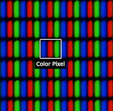
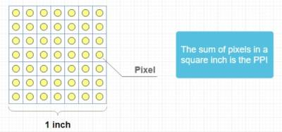
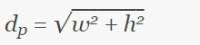
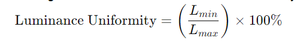
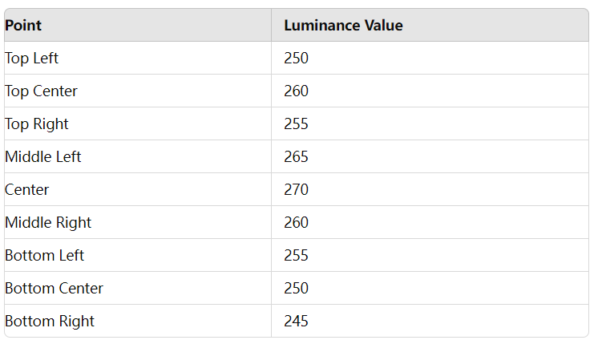
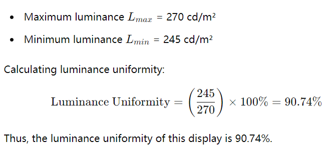

# How to Read Display Specifications

!!! abstract "Quick answer"
    This guide explains display specifications explained, the relevant design trade-offs, and the points engineers should verify when selecting a display solution.

## Key Takeaways

- Learn display specifications explained, key trade-offs, applications, and engineering selection criteria.
- Use the guidance below to compare the relevant technologies and design trade-offs.
- Validate optical, electrical, mechanical, environmental, and production requirements before final selection.

## SPEC

### Display Size

The size of a display screen is typically measured by its diagonal length, usually expressed in inches. Here’s how you can calculate the size of a display screen:

Steps to Calculate Screen Size

Measure Width and Height: Read display module datasheet or Use a measuring tool (like a ruler or tape measure) to measure the display area (AA area) width (W) and height (H) of the display screen, in inches or centimeters.

Calculate the Diagonal Length: Use the Pythagorean theorem to calculate the diagonal length.

Detailed Steps

Measure Width and Height:

Width (W): The horizontal length of the display screen.

Height (H): The vertical length of the display screen.

Calculate the Diagonal Length:

<figure markdown="span" class="displaywiki-figure">
  [{ width="760" loading="lazy" }](display-specifications-use-the-formula.png){ .displaywiki-image-link title="Open full-size image" }
  <figcaption>Use the formula</figcaption>
</figure>

Example

Suppose the display screen's width is 16 inches and the height is 9 inches.

<figure markdown="span" class="displaywiki-figure">
  [{ width="760" loading="lazy" }](display-specifications-therefore-the-diagonal-length-of-the-display-screen-is-approximately-1.png){ .displaywiki-image-link title="Open full-size image" }
  <figcaption>Therefore, the diagonal length of the display screen is approximately 18.36 inches</figcaption>
</figure>

Conversion Considerations

If the width and height are measured in centimeters, you can first convert them to inches (1 inch = 2.54 centimeters), and then perform the calculations. For example:

<figure markdown="span" class="displaywiki-figure">
  [{ width="760" loading="lazy" }](display-specifications-then-use-the-same-method-as-above-to-calculate-the-diagonal-length.png){ .displaywiki-image-link title="Open full-size image" }
  <figcaption>Then, use the same method as above to calculate the diagonal length</figcaption>
</figure>

Additional Considerations

Aspect Ratio: Different displays have different aspect ratios (such as 16:9, 4:3). Knowing the aspect ratio can help calculate width and height if the diagonal length is known.

Actual Measurement: Some displays have thick bezels. When measuring, ensure you only measure the visible screen area.

By following these steps, you can accurately calculate the size of a display screen.

### LCD Resolution

What is the Native Resolution of a LCD Display?

In order to understand the native resolution of a LCD display, it will be better to understand a little about the LCD display technology, especially TFT LCD manufacturing process. First, we need to understand what are pixels.

What Are Pixels?

Pixel, also called Picture Element, A pixel is the smallest unit of a digital image or graphic that can be displayed and represented on a digital display device. A pixel is the basic logical unit in digital graphics. Pixels are combined to form a complete image, video, text, or any visible thing on a computer display

LCD display doesn’t operate the same way as CRT displays , which fires electrons at a glass screen, a LCD display has individual pixels arranged in a rectangular grid. Each pixel has RGB(Red, Green, Blue) sub-pixel that can be turned on or off. When all of a pixel’s sub-pixels are turned off, it appears black. When all the sub-pixels are turned on 100%, it appears white. By adjusting the individual levels of red, green, and blue light, millions of color combinations are possible

<figure markdown="span" class="displaywiki-figure">
  [{ width="760" loading="lazy" }](display-specifications-lcd-pixel-with-rgb-sub-pixels.png){ .displaywiki-image-link title="Open full-size image" }
  <figcaption>LCD Pixel With RGB Sub-pixels</figcaption>
</figure>

Fig.1 LCD Pixel With RGB Sub-pixels

The pixels of the LCD screen were made by circuitry and electrodes of the backplane. Each sub-pixel contains a TFT (Thin Film Transistor) element.  These structures are formed by depositing various materials (metals and silicon) on to the glass substrate that will become one part of the complete display “stack,” and then making them through photolithography. For more information about TFT LCDs,

The etched pixels by photolith process are the Native Resolution. Actually, all the flat panel displays, LCD, OLED, Plasma etc.) have native resolution which are different from CRT monitors

HD TV has 1280×720 = 921,600 pixels; Full HD has 1920x 1080=2,073,600 pixels; 8K TV has 7,680×4,320=33,177,600 pixels. he “K” in 8K stands for Kilo (1000), meaning a TV that has achieved a horizonal resolution of about 8,000 pixels.

窗体底端

### PPI: Pixel Per Inch

PPI is the acronym from Pixels Per Inch. It is a unit of measure used to quantify the number of pixels found on a square inch surface. To get a clear idea of what it

means, imagine a square inch that's divided and organized in a grid of cells. Each and every cell in that grid has a pixel inside. The number of cells inside the grid,

also known as pixels, tells you the PPI.

<figure markdown="span" class="displaywiki-figure">
  [{ width="760" loading="lazy" }](display-specifications-also-known-as-pixels-tells-you-the-ppi.jpeg){ .displaywiki-image-link title="Open full-size image" }
  <figcaption>also known as pixels, tells you the PPI</figcaption>
</figure>

<figure markdown="span" class="displaywiki-figure">
  [{ width="760" loading="lazy" }](display-specifications-also-known-as-pixels-tells-you-the-ppi-2.jpeg){ .displaywiki-image-link title="Open full-size image" }
  <figcaption>also known as pixels, tells you the PPI</figcaption>
</figure>

Usually, the Pixels Per Inch value is used to measure the pixel density of displays, such as the monitor you have on your computer or laptop, on your TV screen, on your smartphone and any display devices.

There are three steps to calculating a screen’s PPI.

Step One: Find the Screen’s Diagonal

The first step to calculate PPI is to measure the screen’s diagonal size in inches. Most displays, screens, monitors, and televisions are sold by their diagonal measurement, which should be marked on the screen or its documentation.

Step Two: Find the Diagonal Pixels

Given the screen’s resolution, you can find the number of pixels along the diagonal using the Pythagorean theorem.

<figure markdown="span" class="displaywiki-figure">
  [{ width="760" loading="lazy" }](display-specifications-step-two-find-the-diagonal-pixels.jpeg){ .displaywiki-image-link title="Open full-size image" }
  <figcaption>Step Two: Find the Diagonal Pixels</figcaption>
</figure>

In other words, the diagonal pixels dp is equal to the square root of the width in pixels w squared plus the height in pixels h squared.

The width in pixels is equal to the first part of the screen’s resolution, and the height is the second. For instance, the width in pixels of a 1920×1080 screen is 1920, and the height is 1080.

Step Three: Use the PPI Formula

Given the diagonal measurement in pixels and inches, use the following formula to calculate PPI.

PPI = dp / Inch

Thus, screen pixel density in pixels per inch is equal to the pixels along the diagonal dp divided by the diagonal in inches.

What is Retina?

Retina is a brand name trademarked by apple and refers to a display with a pixel density such that the individual pixels are discernible to the human eye.

The actual density will vary depending on how far your eyes are generally from the screen, but a PPI of 300 is generally enough density when viewing from 12″ away.

### Brightness

Display brightness, also known as luminance, refers to the amount of light emitted by a display screen. It is typically measured in candelas per square meter (cd/m²), also known as "nits". Higher brightness levels allow screens to be more visible in bright environments and enhance overall viewing experience, especially in high ambient light conditions.

Key Points

Luminance (Brightness): The intensity of light emitted from the display surface per unit area.

Unit of Measurement: Candelas per square meter (cd/m²) or nits.

Typical Values: Common displays have brightness levels ranging from 200 to 500 cd/m², with higher-brightness displays reaching up to 1000 cd/m² or more.

Importance of Display Brightness

Visibility: High brightness levels improve visibility in brightly lit environments, such as outdoors or in well-lit rooms.

Image Quality: Proper brightness levels contribute to better image quality, enhancing contrast and color accuracy.

User Comfort: Adequate brightness settings reduce eye strain, especially during prolonged use.

Testing Methods for Display Brightness

Testing display brightness involves measuring the luminance of the screen using specialized tools and procedures. Here are common methods and tools used:

Tools for Measuring Brightness

Luminance Meter (Light Meter): A device specifically designed to measure the luminance of displays. Examples include the TOPCON BM-7

Procedures for Testing Brightness in Dark Room

Prepare the Display:

Ensure the display is set to its factory default settings or a standardized test setting.

Warm up the display for at least 30 minutes to reach its stable operating temperature.

Set Up the Measuring Device:

Position the luminance meter or spectroradiometer perpendicular to the display surface, typically at a distance recommended by the device manufacturer.

Ensure the device is centered on the area to be measured, usually the center of the screen for uniformity.

Conduct the Measurement:

Display a full-screen white image on the display. This can be done using calibration software or by loading a white test pattern.

Take multiple measurements at different points across the screen (e.g., center, corners, and edges) to assess uniformity and average brightness.

Calculate and Record:

Record the luminance readings from each measurement point.

Calculate the average brightness if multiple points are measured.

Document any significant variations across the screen to assess brightness uniformity.

Brightness Testing Standards

Adhering to specific standards ensures consistency and accuracy in brightness measurements. Common standards include:

VESA FPDM (Flat Panel Display Measurement) Standard: Provides guidelines for measuring various display characteristics, including brightness.

ISO 9241-307: A standard for ergonomics of human-system interaction, specifying test methods for electronic visual displays.

IEC 61966-2-1: Standard for multimedia systems and equipment color measurement and management, including display luminance.

## Conclusion

Understanding and accurately measuring display brightness is crucial for assessing display performance, ensuring optimal visibility, and enhancing user comfort. By using appropriate tools and adhering to standardized procedures, reliable and consistent brightness measurements can be achieved.

### Luminance Uniformity

Luminance uniformity is a measure of the consistency of brightness across different areas of a display screen. High luminance uniformity means that the brightness variation across the screen is minimal, providing a more uniform visual experience. Here’s how to calculate luminance uniformity.

Steps to Calculate Luminance Uniformity

Measure Luminance:

Measure the brightness (luminance) at several fixed points on the screen. These points usually include the center, four corners, and additional important intermediate positions. Common measurement grids are 3x3 (nine points) or 5x5 (twenty-five points).

Record Luminance Values:

Record the luminance values at each measurement point, typically in candelas per square meter (cd/m²).

Determine Maximum and Minimum Luminance:

<figure markdown="span" class="displaywiki-figure">
  [{ width="760" loading="lazy" }](display-specifications-calculate-luminance-uniformity.png){ .displaywiki-image-link title="Open full-size image" }
  <figcaption>Calculate Luminance Uniformity</figcaption>
</figure>

Use the following formula to calculate luminance uniformity:

<figure markdown="span" class="displaywiki-figure">
  [{ width="760" loading="lazy" }](display-specifications-use-the-following-formula-to-calculate-luminance-uniformity.png){ .displaywiki-image-link title="Open full-size image" }
  <figcaption>Use the following formula to calculate luminance uniformity</figcaption>
</figure>

This value represents the ratio of the dimmest point to the brightest point, expressed as a percentage.

Example

Suppose the luminance values at nine points (3x3 grid) on a display screen are measured as follows (in cd/m²):

<figure markdown="span" class="displaywiki-figure">
  [{ width="760" loading="lazy" }](display-specifications-from-these-measurements.png){ .displaywiki-image-link title="Open full-size image" }
  <figcaption>From these measurements</figcaption>
</figure>

<figure markdown="span" class="displaywiki-figure">
  [{ width="760" loading="lazy" }](display-specifications-importance-of-high-luminance-uniformity.png){ .displaywiki-image-link title="Open full-size image" }
  <figcaption>Importance of High Luminance Uniformity</figcaption>
</figure>

Visual Comfort: Displays with high uniformity provide consistent brightness, reducing eye strain.

Color Accuracy: Essential for applications requiring precise color representation, such as graphic design and video editing.

Professional Applications: In fields like medical imaging and aerospace, high luminance uniformity ensures display accuracy and reliability.

## Conclusion

Luminance uniformity is a critical metric for display performance. By measuring and calculating the luminance at various points on the screen, one can evaluate the uniformity of brightness across the display. High luminance uniformity ensures better user experience and visual quality, which is especially important for professional applications.

### CR: Contrast Ratio

The contrast ratio is a key specification for display screens, indicating the difference between the brightest white and the darkest black that a screen can produce. It is an important factor in determining the quality of the display, impacting the clarity, depth, and overall visual experience.

Definition

The contrast ratio is defined as the ratio of the luminance of the brightest color (white) to that of the darkest color (black) that the display can produce. It is typically expressed in a format such as 1000:1, 3000:1, etc.

Calculation

To calculate the contrast ratio, the luminance (brightness) values of the white and black levels are measured, and then the ratio between these two values is determined. For example:

<figure markdown="span" class="displaywiki-figure">
  [{ width="760" loading="lazy" }](display-specifications-importance-of-contrast-ratio.png){ .displaywiki-image-link title="Open full-size image" }
  <figcaption>Importance of Contrast Ratio</figcaption>
</figure>

Image Quality: A higher contrast ratio indicates a greater difference between the brightest and darkest parts of the image, resulting in more vivid, clearer, and lifelike images.

Color Depth: High contrast ratios contribute to better color depth and richer details, especially in darker scenes.

Eye Comfort: Displays with better contrast ratios can reduce eye strain, as they offer clearer distinctions between different visual elements.

Typical Contrast Ratios for Different Displays

TN (Twisted Nematic) Panels: Usually have lower contrast ratios, typically around 1000:1.

IPS (In-Plane Switching) Panels: Generally offer better contrast ratios, often between 1000:1 and 1500:1.

VA (Vertical Alignment) Panels: Known for higher contrast ratios, often ranging from 3000:1 to 6000:1.

OLED (Organic Light Emitting Diode) Panels: Provide extremely high contrast ratios, often considered infinite, because they can turn off individual pixels completely, achieving true blacks.

Practical Considerations

Viewing Environment: In a bright room, the perceived contrast ratio can be lower because of ambient light reflections. Conversely, in a dark room, the display’s contrast ratio is more noticeable.

Content Type: High contrast ratios are particularly important for media consumption, gaming, and any application where visual fidelity is crucial.

Measurement Standards: Be aware that manufacturers may use different standards and methods to measure contrast ratios, especially dynamic contrast ratios, which can sometimes result in exaggerated values.

## Conclusion

The contrast ratio is a crucial factor in display quality, affecting how well a display can reproduce details in both bright and dark scenes. Understanding the contrast ratio helps in selecting the right display for specific needs, ensuring the best possible viewing experience.

### Color Gamut

When evaluating the color performance of TFT (Thin Film Transistor) displays, color gamut is a crucial metric. The color gamut represents the range of colors a display can reproduce. The NTSC (National Television System Committee) color gamut is a commonly used standard for assessing the color coverage of displays.

Definition of NTSC Color Gamut

The NTSC color gamut refers to the color standard defined by the National Television System Committee in 1953 for analog television broadcasting. Although the NTSC standard is no longer widely used in modern digital display technology, the NTSC color gamut remains a reference standard for evaluating display color performance.

Representing Color Gamut Coverage

Color gamut coverage is typically expressed as a percentage of the NTSC color gamut. For example, a display with a 72% NTSC color gamut coverage means that the display can reproduce 72% of the NTSC standard color gamut.

Calculating NTSC Color Gamut Coverage

To calculate a display's color gamut coverage in NTSC units, the display's color gamut and the NTSC color gamut need to be compared using a chromaticity diagram. The steps are as follows:

Measure the Display's Color Gamut: Use a color analyzer or spectroradiometer to measure the display's color gamut.

Plot the Chromaticity Diagram: Plot both the display's color gamut and the NTSC color gamut on the CIE 1931 chromaticity diagram.

Calculate Coverage: Compare the areas of the display's color gamut and the NTSC color gamut to calculate the percentage coverage.

Common Values of Color Gamut Coverage

Standard Displays: Typically cover about 72% of the NTSC color gamut. These displays are suitable for general use, such as office work and everyday home entertainment.

High-End Displays: Usually cover 85% or more of the NTSC color gamut, making them suitable for applications requiring better color performance, such as photography, video editing, and professional design.

Professional Displays: Some professional displays can even cover 100% or more of the NTSC color gamut, offering excellent color accuracy and rich color reproduction.

Comparison with Other Color Gamut Standards

Besides the NTSC color gamut, there are other common color gamut standards, such as sRGB, Adobe RGB, and DCI-P3. Each color gamut standard covers a different range of colors and is suitable for different applications:

sRGB: Suitable for the internet and general consumer electronics.

Adobe RGB: Used in professional photography and printing, covering more greens and blues.

DCI-P3: Used for cinema and high dynamic range (HDR) content, covering more reds and greens.

## Conclusion

The color gamut of a TFT display is a key indicator of its color performance. By understanding the NTSC color gamut coverage, users can evaluate the display's ability to reproduce colors and choose a display that meets their specific needs. A high NTSC color gamut coverage indicates that the display can reproduce a broader range of colors, providing a richer and more accurate visual experience.

### View Angle

The viewing angle of a display refers to the maximum angle at which a screen can be viewed with acceptable visual performance. At wider angles, the colors and contrast of the display may shift, making the image appear distorted or washed out. Understanding viewing angles is crucial for selecting displays that provide good visibility and color accuracy from different viewing positions.

Definition

Viewing Angle: The angle at which the display can be viewed without significant degradation in image quality, including color accuracy and contrast. Detailed info please refer to VIEWE display datasheet .

Importance of Viewing Angle

User Experience: A wider viewing angle ensures that the display looks good from various positions, enhancing the user experience, especially for shared viewing.

Application Suitability: Different applications require different viewing angles. For example, monitors for professional graphic design need wide viewing angles, while basic office monitors might not.

Display Technology Comparison: Understanding the viewing angles of different display technologies helps in choosing the right one for specific needs.

Measurement of Viewing Angle

Viewing angles are usually measured in degrees from the center of the screen. They are typically given as two values, representing the horizontal and vertical viewing angles.

Horizontal Viewing Angle: The angle to the left and right of the screen's center where the image quality remains acceptable.

Vertical Viewing Angle: The angle above and below the screen's center where the image quality remains acceptable.

Viewing Angle Specifications

Manufacturers often specify viewing angles as this table

<figure markdown="span" class="displaywiki-figure">
  [{ width="760" loading="lazy" }](display-specifications-factors-affecting-viewing-angle.png){ .displaywiki-image-link title="Open full-size image" }
  <figcaption>Factors Affecting Viewing Angle</figcaption>
</figure>

Display Technology:OLED>MVA>IPS>>TN

Backlighting and Polarizers: The quality of backlighting and the type of polarizers used in the display also affect viewing angles.

Practical Considerations

Environment: Displays used in public or shared environments, such as televisions and monitors in meeting rooms, benefit from wide viewing angles to accommodate multiple viewers.

Purpose: For tasks requiring high color accuracy, such as photo and video editing, a display with a wide viewing angle is essential to ensure consistent colors across different viewing positions.

Cost: Displays with better viewing angles, especially IPS and OLED, are generally more expensive than those with TN panels.

## Conclusion

The viewing angle is a critical aspect of display performance, impacting how well the screen can be viewed from different positions. Knowing the viewing angle specifications helps users select the right display for their needs, ensuring optimal viewing experiences in various settings.

## Related reading

- [LCD Basics: How Liquid Crystal Displays Work](lcd-basics.md)
- [TFT LCD Basics: Structure, Operation, and Benefits](tft-lcd-basics.md)
- [TFT LCD Module Components and Construction](tft-lcd-module.md)
