<script type="application/ld+json">
{
  "@context": "https://schema.org",
  "@type": "FAQPage",
  "mainEntity": [
    {
      "@type": "Question",
      "name": "For brightness and contrast on a datasheet, should I read the typical or the minimum value?",
      "acceptedAnswer": {
        "@type": "Answer",
        "text": "A datasheet usually lists both a typical (typ) and a minimum (min) value. Contrast is generally given only as a typical value, while brightness, color coordinates, and response time often have both a min and a typ column. Engineering selection should **design margin against the min**: a solution built on typ easily fails in volume-production batches and at low temperature. If the datasheet gives only typ, ask the supplier for the min value and the actual test conditions."
      }
    },
    {
      "@type": "Question",
      "name": "The rated contrast is 1000:1, so why does it still look gray outdoors?",
      "acceptedAnswer": {
        "@type": "Answer",
        "text": "Because the datasheet contrast is measured in a **dark room**. Outdoor ambient light reflects off the screen surface and raises the black level, so the real bright-room contrast is far below the rated value. What matters here is not the panel's own CR but the surface treatment and the brightness. Anti-glare (AG), anti-reflective (AR), or combined AGAR treatment can cut reflection, while a high-brightness backlight widens the gap between the bright areas and the reflected light; the two must be considered together."
      }
    },
    {
      "@type": "Question",
      "name": "Does a higher NTSC gamut coverage mean more accurate color?",
      "acceptedAnswer": {
        "@type": "Answer",
        "text": "Not necessarily. Gamut only describes **how large a range of colors can be covered**; it says nothing about whether the color is accurate. Color accuracy depends on the white-point color temperature, the gamma curve, grayscale color shift, and the ΔE deviation. A screen with a high gamut but a cool white point will look more vivid yet render color less accurately. Professional scenarios should require both gamut coverage and a ΔE specification."
      }
    },
    {
      "@type": "Question",
      "name": "For resolution and PPI, which should I look at during selection?",
      "acceptedAnswer": {
        "@type": "Answer",
        "text": "The two do different jobs: resolution decides how much content fits on one screen, PPI decides how sharp the picture is, and PPI is determined jointly by resolution and size. When the viewing distance is short (handheld, desktop), text sharpness is mainly governed by PPI, and about 300 PPI is already close to the limit of human resolution; when the distance is long (industrial cabinets, signage boards), it is enough for the resolution to match the viewing distance—chasing high PPI brings no benefit and only adds cost and power consumption."
      }
    },
    {
      "@type": "Question",
      "name": "What does a viewing-angle specification written as 89/89/89/89 mean?",
      "acceptedAnswer": {
        "@type": "Answer",
        "text": "It means the maximum angle at which image quality is still acceptable is 89° to the left, right, up, and down from the screen center. Here acceptable usually means contrast has dropped to 10:1, though some manufacturers judge by brightness falling to 50% of the center value. TN panels commonly specify something like 70/70/60/60, while IPS and VA can reach 89/89/89/89. Note that the criteria differ between manufacturers, so rated values can only be compared roughly."
      }
    },
    {
      "@type": "Question",
      "name": "What luminance uniformity counts as acceptable?",
      "acceptedAnswer": {
        "@type": "Answer",
        "text": "Luminance uniformity is usually expressed as the ratio of the dimmest point to the brightest point; a common industry requirement is 70% to 80% or more, while scenarios such as automotive and medical imaging usually require 85% or more. When judging, confirm both the number of measurement points and the acceptance criterion; a common practice is 9 points (3 × 3) or 25 points (5 × 5), and a datasheet that reports only the center value has limited reference value."
      }
    }
  ]
}
</script>

# How to Read Display Specifications

!!! abstract "Quick answer"
    Every specification on a datasheet maps to one engineering judgment: brightness decides readability under strong light, contrast decides dark-scene gradation, PPI decides text sharpness, and viewing angle decides how consistent the image stays for several viewers. This article breaks the datasheet down item by item, in the order geometry, optics, and environment. The single most important rule is this: parameters that drift with process and temperature—brightness, color coordinates, response time—should always be designed with margin against the **minimum (min)**, not the typical (typ).

## Key Takeaways

- Display specifications are not isolated numbers; together they determine readability, color accuracy, and lifetime in different environments.
- During engineering selection, confirm five things first: optical performance, electrical interface, mechanical dimensions, environmental reliability, and volume-production feasibility.
- This article works through them in the order geometry → optics → environment: size and diagonal → resolution and PPI → brightness → luminance uniformity → contrast ratio → color gamut → viewing angle.

## 1. Display Size and Diagonal

Display size usually means the diagonal length, which the industry expresses in inches by default.

### How to Calculate the Screen Diagonal

**Step 1: Measure the width and height.**

Check the display module datasheet, or measure the width (W) and height (H) of the active area (AA) directly with calipers; the unit may be either inches or centimeters.

**Step 2: Use the Pythagorean theorem to calculate the diagonal length.**

<figure markdown="span" class="displaywiki-figure">
  [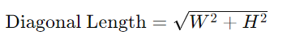{ width="760" loading="lazy" }](display-specifications-use-the-formula.png){ .displaywiki-image-link title="Open full-size image" }
  <figcaption>The formula</figcaption>
</figure>

### Example

Suppose a screen is 16 inches wide and 9 inches high; its diagonal is about 18.36 inches.

<figure markdown="span" class="displaywiki-figure">
  [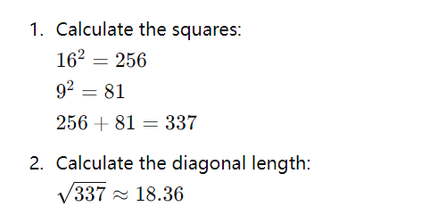{ width="760" loading="lazy" }](display-specifications-therefore-the-diagonal-length-of-the-display-screen-is-approximately-1.png){ .displaywiki-image-link title="Open full-size image" }
  <figcaption>The display diagonal is therefore about 18.36 inches</figcaption>
</figure>

### Unit Conversion

If the dimensions are given in centimeters, convert them to inches first (1 inch = 2.54 cm), then use the method above.

<figure markdown="span" class="displaywiki-figure">
  [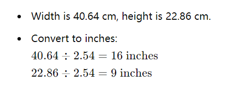{ width="760" loading="lazy" }](display-specifications-then-use-the-same-method-as-above-to-calculate-the-diagonal-length.png){ .displaywiki-image-link title="Open full-size image" }
  <figcaption>Then calculate the diagonal with the same method</figcaption>
</figure>

### Other Considerations

- **Aspect ratio**: different displays have different aspect ratios; 16:9 and 4:3 are common.
- **Actual measurement**: many displays have thick bezels, so measure only the visible active area and do not include the bezel.

## 2. Resolution and Pixel Structure

### What the "Native Resolution" of an LCD Means

To understand native resolution, you first need to understand pixels and how an LCD—especially a TFT LCD—turns pixels on.

### What a Pixel Is

A pixel (picture element) is the smallest image unit a digital display can show. Each pixel is made of three subpixels—R (red), G (green), and B (blue)—that can be switched and dimmed independently. With all three off, the pixel is black; with all three at 100%, it is white; and by adjusting the ratio of the three, it can reproduce millions of colors.

<figure markdown="span" class="displaywiki-figure">
  [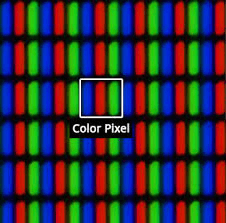{ width="760" loading="lazy" }](display-specifications-lcd-pixel-with-rgb-sub-pixels.png){ .displaywiki-image-link title="Open full-size image" }
  <figcaption>An LCD pixel with RGB subpixels</figcaption>
</figure>

An LCD is not a CRT and does not scan a phosphor screen with an electron beam. It is built from independent pixels arranged in a rectangular grid, each subpixel backed by a TFT (thin-film transistor) element; the electrodes and the TFT are both deposited on a glass substrate and form part of the entire display stack. All flat-panel displays (LCD, OLED, plasma, and so on) have only one resolution—the native resolution—whereas only a CRT has the concept of a scanning resolution.

Reference magnitudes:

- HD TV: 1280 × 720 = 921,600 pixels
- Full HD TV: 1920 × 1080 ≈ 2,073,600 pixels
- 8K TV: 7680 × 4320 ≈ 33,177,600 pixels (K stands for kilo, that is, 1000)

### PPI: Pixels Per Inch

PPI is short for pixels per inch; it quantifies how many pixels are packed into one inch of surface. Picture one inch as a grid, where each cell in the grid is one pixel.

<figure markdown="span" class="displaywiki-figure">
  [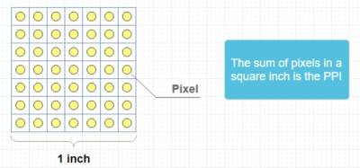{ width="760" loading="lazy" }](display-specifications-also-known-as-pixels-tells-you-the-ppi.jpeg){ .displaywiki-image-link title="Open full-size image" }
  <figcaption>Pixels per inch (PPI) illustrated</figcaption>
</figure>

<figure markdown="span" class="displaywiki-figure">
  [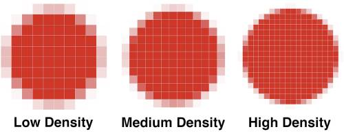{ width="760" loading="lazy" }](display-specifications-also-known-as-pixels-tells-you-the-ppi-2.jpeg){ .displaywiki-image-link title="Open full-size image" }
  <figcaption>PPI and sharpness</figcaption>
</figure>

PPI is commonly used to describe the pixel density of any display device: monitors, laptops, TVs, phones, and more.

### The Three Steps to Calculate PPI

**Step 1: Measure the screen diagonal in inches.**

Screens, monitors, and TVs are usually sold by diagonal size, which can be calculated as in the display size section above.

**Step 2: Use the Pythagorean theorem to find the diagonal pixel count.**

Given the screen resolution (width × height), you can compute the diagonal pixel count dp:

<figure markdown="span" class="displaywiki-figure">
  [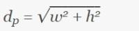{ width="760" loading="lazy" }](display-specifications-step-two-find-the-diagonal-pixels.jpeg){ .displaywiki-image-link title="Open full-size image" }
  <figcaption>Step 2: find the diagonal pixel count with the Pythagorean theorem</figcaption>
</figure>

For example, for a 1920 × 1080 screen, dp = √(1920² + 1080²).

**Step 3: Apply the PPI formula.**

```text
PPI = dp / screen diagonal in inches
```

### Retina Displays

A Retina display is a pixel density at which the human eye cannot distinguish individual pixels at the given viewing distance. The actual threshold depends on how far the eye is from the screen; when viewing a laptop screen (roughly 12 inches / 30 cm), a PPI of about 300 is already sharp enough.

## 3. Brightness

Display brightness is the light intensity radiated from the display surface; the common unit is cd/m², also called nits. The higher the brightness, the better the readability in a bright environment and the clearer the overall visual experience.

<figure markdown="span" class="displaywiki-figure">
  [{ width="960" loading="lazy" }](../../../assets/images/Post/display-specifications-brightness-comparison.png){ .displaywiki-image-link title="Open full-size image" }
  <figcaption>Brightness comparison: under the same strong ambient light, the lower-luminance display on the left is more affected by glare, while the higher-luminance display on the right keeps good image readability.</figcaption>
</figure>

### Key Concepts

- **Brightness**: the light intensity emitted per unit area of the display surface.
- **Unit**: cd/m² (or nits).
- **Typical values**: common monitors fall between 200–500 cd/m², and high-brightness displays can reach 1000 cd/m² and above.

### Why Brightness Matters

- **Readability**: outdoors or in a bright room, high brightness keeps the image readable.
- **Image quality**: an appropriate brightness level improves contrast and color accuracy.
- **Comfort**: suitable brightness reduces eye strain during long use.

### Brightness Measurement Methods

Measuring brightness requires dedicated tools and procedures. Common tools include:

- **Light meter**: such as the TOPCON BM-7, designed specifically for display brightness measurement.

#### Procedure for Measuring Brightness in a Dark Room

1. **Prepare the display**: restore the display to factory settings or a standard test pattern; warm it up for at least 30 minutes before testing so the device reaches a stable operating temperature.
2. **Set up the measurement equipment**: aim the light meter or spectroradiometer perpendicular to the center of the screen at a distance recommended by the equipment maker; make sure the measurement area falls on the screen center.
3. **Collect data**: display full-screen white (with calibration software or a white test image); measure brightness at several points—center, corners, and edges—to assess luminance uniformity and the average value.
4. **Record the results**: record the brightness reading at each point; for a multi-point measurement, report the average brightness and note the largest deviation across the screen.

### Brightness Test Standards

- **VESA FPDM (Flat Panel Display Measurements)**: a flat-panel measurement standard that includes brightness and other metrics.
- **ISO 9241-307**: an ergonomics standard that specifies test methods for electronic visual displays.
- **IEC 61966-2-1**: a color measurement and management standard for multimedia systems that covers display brightness.

## 4. Luminance Uniformity

Luminance uniformity is the consistency of brightness across different areas of the screen. The better the uniformity, the smaller the brightness difference within the screen and the more natural the visual experience.

### Steps to Calculate Luminance Uniformity

**Step 1: Measure the brightness at several points.**

Pick several fixed points on the screen and measure their brightness; a common grid is 3 × 3 (nine points) or 5 × 5 (twenty-five points), with points normally covering the center, the four corners, and any intermediate positions of interest.

**Step 2: Record the brightness values.**

Record each point's brightness, usually in cd/m².

**Step 3: Calculate the ratio of the dimmest point to the brightest point.**

Use the formula below to calculate luminance uniformity:

<figure markdown="span" class="displaywiki-figure">
  [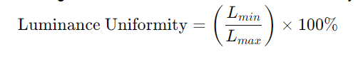{ width="760" loading="lazy" }](display-specifications-use-the-following-formula-to-calculate-luminance-uniformity.png){ .displaywiki-image-link title="Open full-size image" }
  <figcaption>Calculation formula</figcaption>
</figure>

The final value is expressed as the ratio (a percentage) of the dimmest point's brightness to the brightest point's brightness.

### Example

Suppose a screen's nine measurement points (3 × 3) have the following brightness (cd/m²):

<figure markdown="span" class="displaywiki-figure">
  [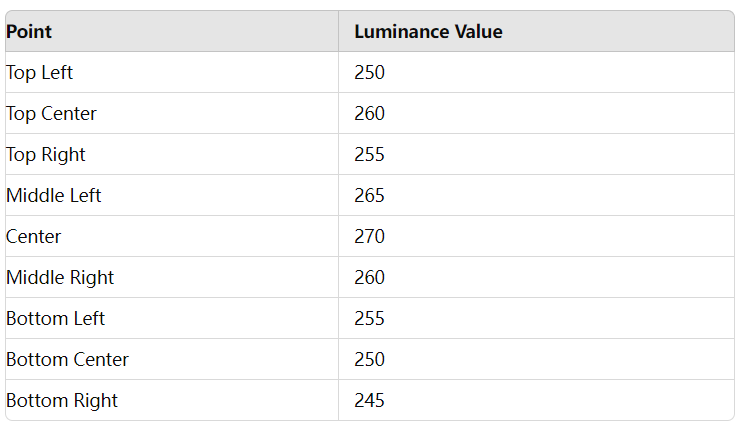{ width="760" loading="lazy" }](display-specifications-from-these-measurements.png){ .displaywiki-image-link title="Open full-size image" }
  <figcaption>Test data</figcaption>
</figure>

<figure markdown="span" class="displaywiki-figure">
  [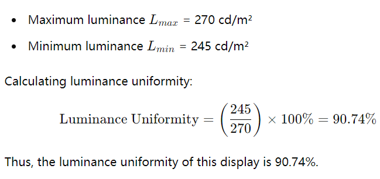{ width="760" loading="lazy" }](display-specifications-importance-of-high-luminance-uniformity.png){ .displaywiki-image-link title="Open full-size image" }
  <figcaption>Calculation result</figcaption>
</figure>

### Why Luminance Uniformity Matters

- **Visual comfort**: a highly uniform screen has consistent brightness and is easier on the eyes.
- **Color accuracy**: crucial for applications that need precise color rendering, such as graphic design and video editing.
- **Professional applications**: fields such as medical imaging and aerospace require high uniformity for accurate, reliable display.

## 5. Contrast Ratio (CR)

Contrast ratio (CR) is a key display specification: the ratio of the brightest white the screen can produce to the darkest black. It directly affects image clarity, tonal separation, and the overall visual experience.

### Definition

Contrast ratio = brightest white luminance / darkest black luminance, usually expressed as 1000:1, 3000:1, and so on.

<figure markdown="span" class="displaywiki-figure">
  [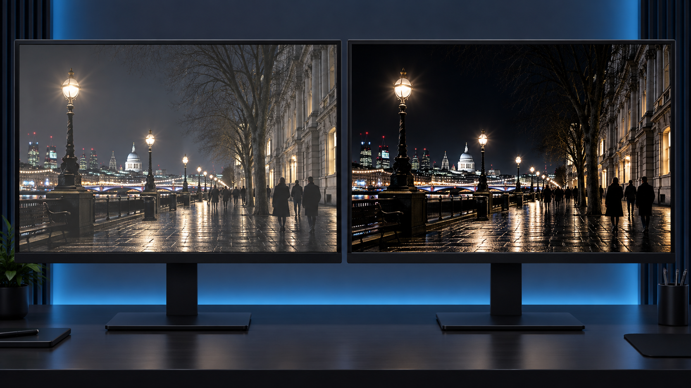{ width="960" loading="lazy" }](../../../assets/images/Post/display-specifications-contrast-ratio-comparison.png){ .displaywiki-image-link title="Open full-size image" }
  <figcaption>Contrast comparison: the lower-contrast screen on the left raises the black level and compresses dark-scene gradation; the higher-contrast screen on the right gives deeper blacks and clearer dark-scene detail.</figcaption>
</figure>

### How to Calculate It

Measure the luminance of a full-white image and a full-black image (in cd/m²), then take the ratio. For example:

<figure markdown="span" class="displaywiki-figure">
  [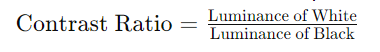{ width="760" loading="lazy" }](display-specifications-importance-of-contrast-ratio.png){ .displaywiki-image-link title="Open full-size image" }
  <figcaption>Contrast ratio formula</figcaption>
</figure>

### Why Contrast Ratio Matters

- **Image quality**: with high contrast, the difference between the brightest and darkest parts is more pronounced, and the image is more vivid, clear, and true to life.
- **Color depth**: high contrast reveals richer color gradation and detail, especially in dark scenes.
- **Eye comfort**: sufficient contrast makes it easier for the eye to distinguish visual elements and less tiring.

### Typical Contrast Ratio by Panel Type

- **TN (twisted nematic) panels**: usually lower contrast, around 1000:1.
- **IPS (in-plane switching) panels**: generally better than TN, commonly 1000:1–1500:1.
- **VA (vertical alignment) panels**: known for high contrast, commonly 3000:1–6000:1.
- **OLED (organic light-emitting diode) panels**: theoretically capable of "infinite contrast", because each pixel can be switched off completely to produce true black.

### Practical Considerations

- **Viewing environment**: in a bright room, ambient-light reflection lowers subjective contrast; in a dark room the monitor's contrast is more apparent.
- **Content type**: high contrast especially matters for video, games, and any scene that demands faithful image reproduction.
- **Measurement standard**: different manufacturers may use different measurement methods, especially for "dynamic contrast", so real-world comparability is limited.

## 6. Color Gamut (NTSC)

When evaluating the color capability of a TFT (thin-film transistor) display, color gamut is one of the core metrics. Color gamut is the range of colors a display can reproduce; a higher gamut means more vivid colors. The NTSC (National Television System Committee) gamut is a common reference standard for assessing a display's color coverage.

<figure markdown="span" class="displaywiki-figure">
  [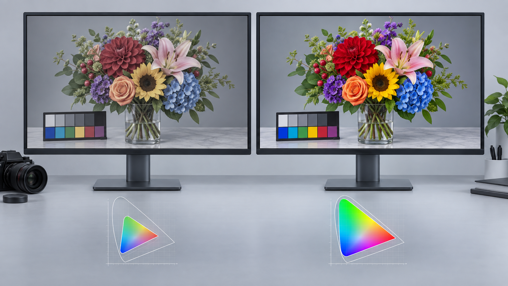{ width="960" loading="lazy" }](../../../assets/images/Post/display-specifications-color-gamut-comparison.png){ .displaywiki-image-link title="Open full-size image" }
  <figcaption>Color-gamut comparison: a wider gamut can reproduce a larger range of colors; but a wider gamut by itself does not mean more accurate color.</figcaption>
</figure>

### Definition of the NTSC Gamut

The NTSC gamut is the color standard that the NTSC defined in 1953 for analog television broadcasting. Although the NTSC standard itself is no longer widely used in modern digital displays, the NTSC gamut remains a common benchmark for assessing display color capability.

### Color Coverage

Gamut coverage is usually expressed as a percentage of the NTSC gamut. For example, a screen with 72% NTSC coverage can reproduce 72% of the colors in the NTSC standard gamut.

### How to Calculate NTSC Gamut Coverage

You need a chromaticity diagram to compare the display's gamut with the NTSC gamut. The steps are:

1. **Measure the display's color range**: use a color analyzer or spectroradiometer to measure the screen's gamut.
2. **Plot the chromaticity diagram**: plot both the display gamut and the NTSC gamut on the CIE 1931 chromaticity diagram.
3. **Calculate the coverage**: compare the two to obtain the NTSC gamut coverage percentage.

### Common Gamut Coverage Levels

- **Standard displays**: about 72% NTSC, suitable for general office work and everyday home entertainment.
- **High-end displays**: 85% NTSC and above, suitable for photography, video editing, professional design, and other more demanding applications.
- **Professional displays**: can cover 100% NTSC or more, with high color vividness and a richer range of reproducible colors.

### Comparison with Other Gamut Standards

Besides NTSC, other common gamut standards include sRGB, Adobe RGB, and DCI-P3. Each covers a different range of colors and suits different scenarios:

- **sRGB**: suitable for the web and general consumer electronics.
- **Adobe RGB**: used in professional photography and printing, covering a wider green and blue range.
- **DCI-P3**: used for cinema and HDR content, covering a wider red and green range.

## 7. Viewing Angle

Viewing angle is the maximum angle at which the screen can still be viewed with acceptable image quality. At larger angles, color and contrast may change and the image may distort or shift color. Understanding viewing angle helps you choose a display with the right visibility and color accuracy for different viewing scenarios.

<figure markdown="span" class="displaywiki-figure">
  [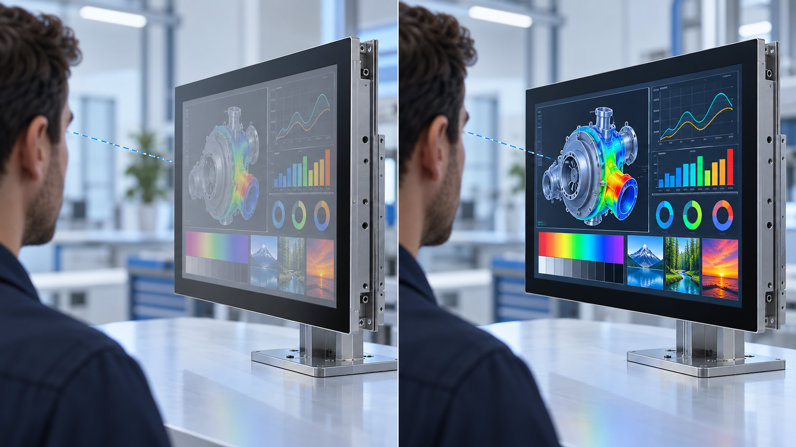{ width="960" loading="lazy" }](../../../assets/images/Post/display-specifications-viewing-angle-comparison.png){ .displaywiki-image-link title="Open full-size image" }
  <figcaption>Viewing-angle comparison: at the same off-axis viewing position, the narrower-angle display on the left loses brightness and color sooner, while the wider-angle display on the right keeps a more stable image.</figcaption>
</figure>

### Definition

**Viewing angle**: the angle at which the display can be viewed without a significant drop in color accuracy and contrast. For detailed specifications, refer to the VIEWE display datasheet.

### Why Viewing Angle Matters

- **User experience**: a wide viewing angle keeps the image looking good from many positions, which suits scenarios where the screen is shared.
- **Application fit**: different applications have different viewing-angle requirements. Professional graphic design needs a wide viewing angle, while basic office monitoring may not.
- **Technical comparison**: understanding the viewing-angle differences between display technologies helps you select for the scenario.

### Measuring Viewing Angle

Viewing angle is usually measured from the center of the screen and expressed as two values, horizontal and vertical:

- **Horizontal viewing angle**: the maximum angle to the left and right of the screen center at which image quality is still acceptable.
- **Vertical viewing angle**: the maximum angle above and below the screen center at which image quality is still acceptable.

### Viewing-Angle Specifications

Manufacturers normally state viewing-angle performance as follows:

<figure markdown="span" class="displaywiki-figure">
  [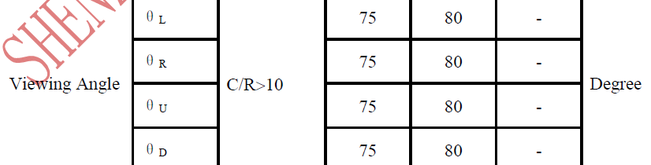{ width="760" loading="lazy" }](display-specifications-factors-affecting-viewing-angle.png){ .displaywiki-image-link title="Open full-size image" }
  <figcaption>Viewing-angle specification diagram</figcaption>
</figure>

**Display technology comparison**: OLED > MVA > IPS >> TN

**Backlight and polarizer**: the quality of the backlight unit and the orientation of the polarizer also affect viewing-angle performance.

### Practical Considerations

- **Usage environment**: public or shared scenarios such as meeting-room TVs and monitoring screens need a wide viewing angle to accommodate several viewers.
- **Usage purpose**: tasks that demand high color precision, such as photo and video editing, need a wide viewing angle so colors stay consistent from different positions.
- **Cost**: displays with better viewing angles (IPS and OLED in particular) are usually more expensive than TN panels.

## 8. Frequently Asked Questions

??? question "Q1: For brightness and contrast on a datasheet, should I read the typical or the minimum value?"
    A datasheet usually lists both a typical (typ) and a minimum (min) value. Contrast is generally given only as a typical value, while brightness, color coordinates, and response time often have both a min and a typ column. Engineering selection should **design margin against the min**: a solution built on typ easily fails in volume-production batches and at low temperature. If the datasheet gives only typ, ask the supplier for the min value and the actual test conditions.

??? question "Q2: The rated contrast is 1000:1, so why does it still look gray outdoors?"
    Because the datasheet contrast is measured in a **dark room**. Outdoor ambient light reflects off the screen surface and raises the black level, so the real bright-room contrast is far below the rated value. What matters here is not the panel's own CR but the surface treatment and the brightness. Anti-glare (AG), anti-reflective (AR), or combined AGAR treatment can cut reflection, while a high-brightness backlight widens the gap between the bright areas and the reflected light; the two must be considered together.

??? question "Q3: Does a higher NTSC gamut coverage mean more accurate color?"
    Not necessarily. Gamut only describes **how large a range of colors can be covered**; it says nothing about whether the color is accurate. Color accuracy depends on the white-point color temperature, the gamma curve, grayscale color shift, and the ΔE deviation. A screen with a high gamut but a cool white point will look more vivid yet render color less accurately. Professional scenarios should require both gamut coverage and a ΔE specification.

??? question "Q4: For resolution and PPI, which should I look at during selection?"
    The two do different jobs: resolution decides how much content fits on one screen, PPI decides how sharp the picture is, and PPI is determined jointly by resolution and size. When the viewing distance is short (handheld, desktop), text sharpness is mainly governed by PPI, and about 300 PPI is already close to the limit of human resolution; when the distance is long (industrial cabinets, signage boards), it is enough for the resolution to match the viewing distance—chasing high PPI brings no benefit and only adds cost and power consumption.

??? question "Q5: What does a viewing-angle specification written as 89/89/89/89 mean?"
    It means the maximum angle at which image quality is still acceptable is 89° to the left, right, up, and down from the screen center. Here acceptable usually means contrast has dropped to 10:1, though some manufacturers judge by brightness falling to 50% of the center value. TN panels commonly specify something like 70/70/60/60, while IPS and VA can reach 89/89/89/89. Note that the criteria differ between manufacturers, so rated values can only be compared roughly.

??? question "Q6: What luminance uniformity counts as acceptable?"
    Luminance uniformity is usually expressed as the ratio of the dimmest point to the brightest point; a common industry requirement is 70% to 80% or more, while scenarios such as automotive and medical imaging usually require 85% or more. When judging, confirm both the number of measurement points and the acceptance criterion; a common practice is 9 points (3 × 3) or 25 points (5 × 5), and a datasheet that reports only the center value has limited reference value.

## Related reading

- [LCD Basics: How Liquid Crystal Displays Work](lcd-basics.md)
- [TFT LCD Basics: Structure, Operation, and Benefits](tft-lcd-basics.md)
- [TFT LCD Module Components and Construction](tft-lcd-module.md)

!!! info "Can't find what you need?"
    If you need more products, resources or support, please contact our team:

    [**:material-archive-arrow-down: Knowledge Base**](../../knowledge/tags.md){ .md-button .md-button--primary }
    [**:material-magnify: Products & Solutions**](https://viewedisplay.com/){ .md-button }
    [**:material-email: Contact Support**](mailto:support@viewedisplay.com){ .md-button }
