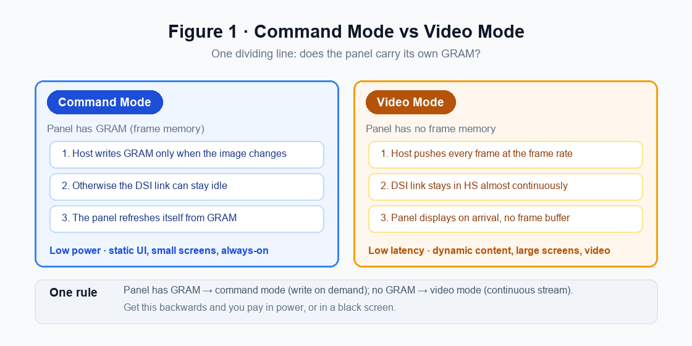
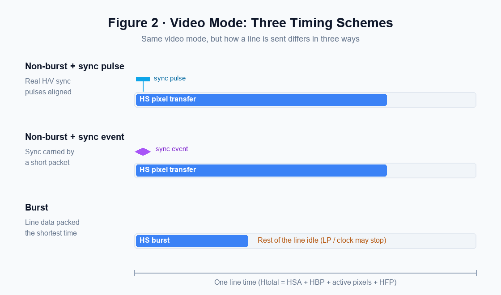
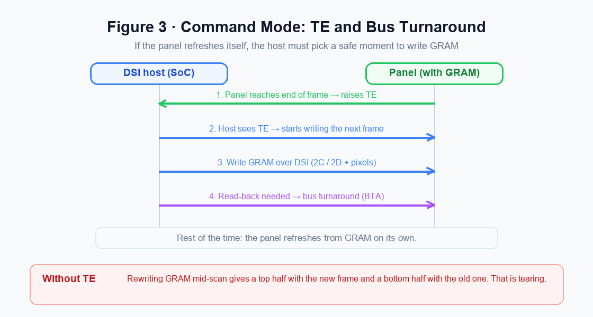
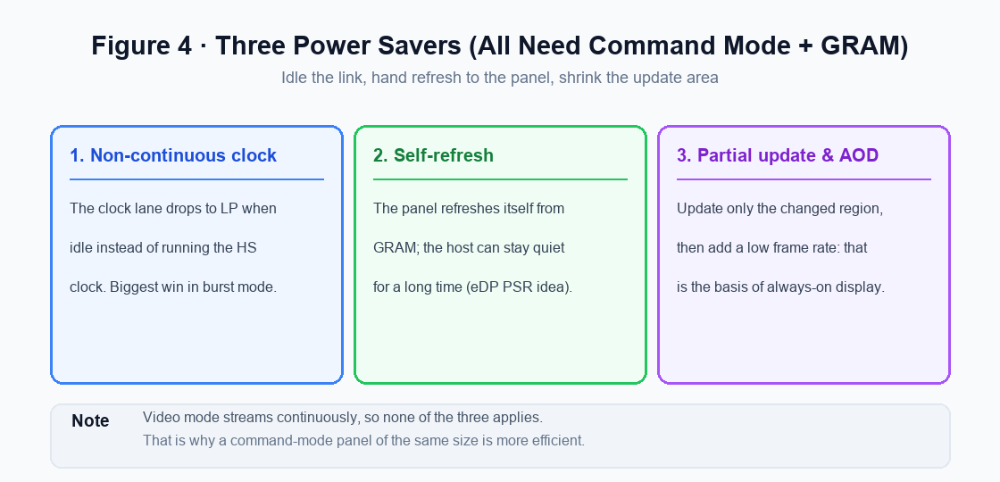
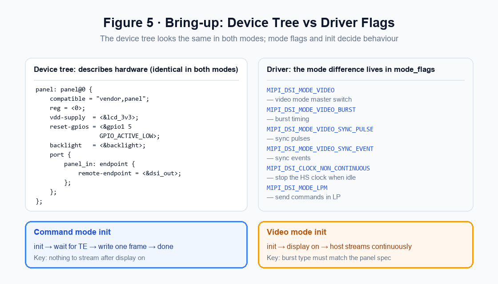
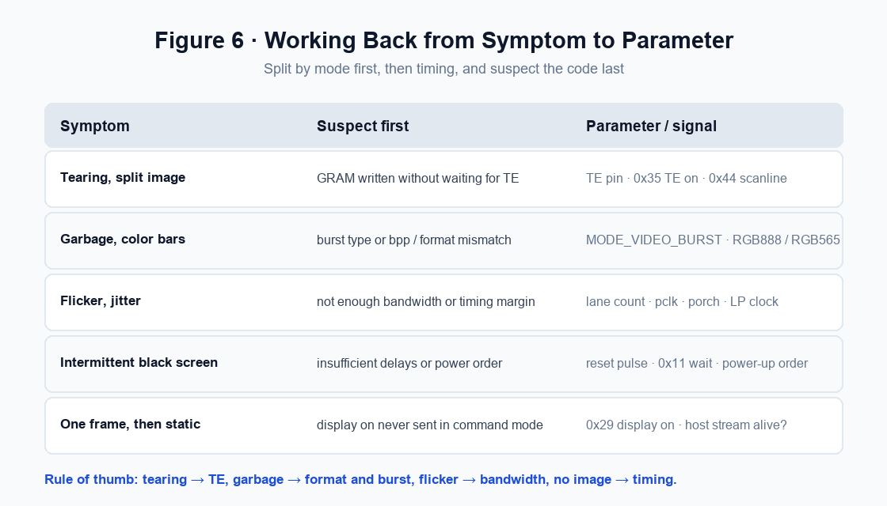

# DSI Video Mode vs Command Mode: From GRAM and TE to Panel Bring-up

!!! abstract "Quick answer"
    On the display side of MIPI DSI there are two ways to work: a panel that carries its own memory (GRAM) can be written on demand, while a panel without memory must be streamed continuously. That single difference ripples outward into the init sequence, tearing behaviour, the power floor, and how you debug a panel that will not light up.

    - There is exactly one dividing line: does the panel have GRAM? With GRAM → command mode; without → video mode.
    - Within video mode, a line can be sent in three ways: non-burst with sync pulses, non-burst with sync events, and burst. Pick wrong and you get a corrupted image.
    - The two keywords in command mode are TE (the tearing-effect signal) and BTA (bus turnaround): the first says when it is safe to write memory, the second when you can read back from the panel.
    - Non-continuous clock, self-refresh, partial update, and AOD all require command mode plus GRAM; video mode cannot use them.
    - The device tree looks identical in both modes. What actually differs is the driver mode flags and the init sequence.

On the display side, DSI does more than push pixels. There is a branch that is easy to overlook: whether the panel refreshes itself or not. A panel with memory can be written on demand; a panel without memory has to be fed continuously. From that one difference come video mode and command mode, and from those come how the init sequence is written, why an image tears, how low the power can go, and where to look when something breaks. This article covers the mechanics, timing, configuration, and troubleshooting of both.

## 1. The Core Difference: Who Owns the Refresh

Liquid-crystal and OLED pixels do not hold their state forever on their own; something has to rewrite the content at the frame rate. The two DSI modes differ in who does that job.

<figure markdown="span" class="displaywiki-figure">
  [{ width="760" loading="lazy" }](dsi-video-mode-vs-command-mode-fig1-gram.png){ .displaywiki-image-link title="Open full-size image" }
  <figcaption>Figure 1. The core difference: with GRAM the host writes on demand, without it the host must stream continuously.</figcaption>
</figure>

**Command mode** suits panels that carry their own graphics memory (GRAM). Once the host has written a frame into GRAM it can let go: the panel's own display controller keeps scanning out of GRAM and only needs another write when the picture actually changes. The host can leave the link untouched for a long time, which is exactly why command mode can be so efficient.

**Video mode** suits panels without memory. The host must push every frame in real time at a fixed frame rate, and the panel displays as it receives. Stop the stream and the screen goes blank.

One thing to clear up: neither mode is more advanced than the other. The panel's physical structure decides which one you get. If the panel vendor built memory into it, you use command mode; if not, video mode is the only option. Only when a panel supports both do you actually get to choose.

Three intuitions follow. Command mode is power-efficient because the link can idle. Video mode gives the host full control of the refresh rhythm, so latency is stable. And command mode usually has a higher instantaneous data rate, because it has to cram a whole frame into a short window — which makes it more sensitive to peak bandwidth.

## 2. Video Mode: Three Timing Schemes, and a Wrong Pick Shows as Garbage

Even after you have settled on video mode, there are three ways to organise the data within a line time: non-burst with sync pulses, non-burst with sync events, and burst.

<figure markdown="span" class="displaywiki-figure">
  [{ width="760" loading="lazy" }](dsi-video-mode-vs-command-mode-fig2-video-timing.png){ .displaywiki-image-link title="Open full-size image" }
  <figcaption>Figure 2. The three video-mode timing schemes: all three must deliver the active pixels within a line time; burst simply packs them into the front and leaves the rest idle.</figcaption>
</figure>

**Non-burst with sync pulses** is the closest to a traditional parallel RGB panel. Besides transmitting the active pixels over HS, it also sends real synchronization pulses aligned to the panel's horizontal and vertical timing. The easiest to reason about, but the pulses cost time.

**Non-burst with sync events** replaces those pulses with short packets that carry the synchronization events. That removes the pulse overhead, at the cost of requiring the panel to decode the short packets correctly.

**Burst** packs a whole line of pixels into the shortest possible time, then returns to LP idle until the next line. It has the shortest HS time and the most idle window, so it saves the most power — but it also has the highest instantaneous data rate, which puts the strongest demands on the PHY's peak bandwidth and signal integrity.

All three share one constraint: the active pixels of a line must be delivered within that line's time. Burst does not break the rule; it just moves the transfer to the front of the window.

This is also where corrupted images come from. Pick the wrong one between burst and non-burst and the panel decodes the pixel stream at the wrong rhythm — typically showing as garbage, colour bars, or a shifted image. **The panel datasheet is the only reliable judge**: if it says video mode, burst, configure burst; if it says non-burst, sync pulse, configure sync pulses. Do not guess.

Worth noting: because burst has the most idle windows, the clock lane has a chance to stop when idle, which is why it pairs so well with a non-continuous clock. That is covered in section 4.

## 3. Command Mode: GRAM, the TE Signal, and Bus Turnaround

Command mode reverses the data flow. The host is no longer streaming pixels; it is reading and writing the panel's internal registers and memory, which means DCS (Display Command Set) commands.

Writing memory uses DCS 0x2C (write_memory_start) and 0x2D (write_memory_continue), followed by pixel data. The interesting part is *when* to write.

<figure markdown="span" class="displaywiki-figure">
  [{ width="760" loading="lazy" }](dsi-video-mode-vs-command-mode-fig3-te-bta.png){ .displaywiki-image-link title="Open full-size image" }
  <figcaption>Figure 3. Command mode's two key mechanisms: the panel uses TE to say the memory is safe to write, and BTA to turn the bus around when something must be read back.</figcaption>
</figure>

If the host rewrites the region of GRAM the panel is scanning at that instant, the top half of the screen shows the new content and the bottom half still shows the old one. That is **tearing**.

**The TE (tearing-effect) signal** exists to prevent it. The panel raises a synchronization signal at the end of a frame, or at a chosen scan line, and the host writes the next frame only after receiving it. There are two forms:

- **A dedicated TE pin**: the panel drives a TE line into a SoC GPIO. This is the most common and the easiest to debug.
- **TE over DSI**: DCS 0x35 (set_tear_on) enables TE reporting as a short-packet trigger, and 0x44 (set_tear_scanline) selects the scan line that triggers it. It saves a wire, but you cannot see it on a scope.

The other overlooked mechanism is **BTA (bus turnaround)**. DSI is physically half-duplex: a data lane group carries one direction at a time. To read anything back from the panel — status, or the TE trigger — the host must first turn the bus around using LP sequences. Turnaround adds latency, and the more often you read, the more it hurts. That is why read operations in command mode deserve caution.

Whether commands travel in LP (low-power) or HS (high-speed) mode is decided by a driver mode flag, MIPI_DSI_MODE_LPM, covered in section 5.

## 4. The Three Power Savers: Non-Continuous Clock, Self-Refresh, Partial Update, and AOD

Command mode's efficiency comes from three techniques that stack on top of each other.

<figure markdown="span" class="displaywiki-figure">
  [{ width="760" loading="lazy" }](dsi-video-mode-vs-command-mode-fig4-power.png){ .displaywiki-image-link title="Open full-size image" }
  <figcaption>Figure 4. The three power savers all require command mode plus GRAM; video mode cannot use them because it has to keep streaming.</figcaption>
</figure>

**Non-continuous clock** means the clock lane drops back to LP whenever there is no HS traffic, instead of running the high-speed clock all the time. In the DSI specification this is the CLOCK_NON_CONTINUOUS switch. It is a natural partner for burst mode: the more idle windows, the more clock power you save.

**Self-refresh** is inherent to command mode: the panel keeps scanning out of its own GRAM while the host stays quiet for long stretches. DSI has no single, uniformly named equivalent of eDP's PSR, but the idea is identical, which is why engineers commonly just call it PSR.

**Partial update and AOD** go one step further. DCS 0x30 (partial area) together with 0x12 (partial mode on) lets the panel update only a chosen region and leave the rest untouched; add a low frame rate and low display brightness and you have the basis of AOD (always-on display). Smartwatches, electronic shelf labels, and standby panels live on this.

Video mode, by contrast, cannot use any of the three, because it has to stream continuously. That is the root reason a command-mode panel of the same size is more efficient. If your product is a static UI running on battery, choosing a panel with GRAM and command-mode support pays off immediately.

## 5. Bring-up Configuration: Device-Tree Mode Flags and Init Sequences

At the configuration level, the two modes are closer than you might expect.

<figure markdown="span" class="displaywiki-figure">
  [{ width="760" loading="lazy" }](dsi-video-mode-vs-command-mode-fig5-config.png){ .displaywiki-image-link title="Open full-size image" }
  <figcaption>Figure 5. Bring-up configuration: the device tree is written the same way in both modes; mode flags and the init sequence are what actually differ.</figcaption>
</figure>

**The device tree describes hardware, and it looks the same in both modes**: compatible, reg, the supply rail (vdd-supply), reset (reset-gpios), backlight, and the port / endpoint that ties the panel to the DSI host; on the host side you also state the number of data lanes and the link frequency. The device tree does not choose the mode.

**The mode lives in the driver's mode flags.** In the Linux DRM framework the three video timing schemes, the clock policy, and the command-channel policy are all switches:

| Mode flag                      | Effect                          |
| ------------------------------ | ------------------------------- |
| MIPI_DSI_MODE_VIDEO            | video mode master switch        |
| MIPI_DSI_MODE_VIDEO_BURST      | use burst timing                |
| MIPI_DSI_MODE_VIDEO_SYNC_PULSE | use sync-pulse timing           |
| MIPI_DSI_MODE_VIDEO_SYNC_EVENT | use sync-event timing           |
| MIPI_DSI_CLOCK_NON_CONTINUOUS  | stop the HS clock while idle    |
| MIPI_DSI_MODE_LPM              | send commands on the LP channel |

Older device-tree bindings wrote these as dsi,flags / dsi,format / dsi,lanes directly on the node; newer drivers mostly set them in the panel driver's mipi_dsi_device structure. Different syntax, same meaning.

**The init sequences, though, genuinely differ:**

- **Command mode**: after init (0x11 sleep out, wait 120 ms, 0x29 display on) you write one frame into GRAM and you are done; write again when the picture changes. If you want to avoid tearing, enable TE (0x35) during init. There is no continuous streaming step at all.
- **Video mode**: after init and display on, the host must keep streaming. Stop and the screen is blank. And the burst type has to match the datasheet — configure burst on a panel that only supports sync pulses and you get garbage, or no image.

A high-frequency trap here is configuring a command-mode panel as video mode, or the reverse. Probe usually passes, and the panel may even light up for a moment, but the image, the power, and the stability are all wrong — easy to misdiagnose as a hardware fault.

## 6. When It Breaks: Working Back from Symptom to Parameter

The earlier sections describe forward configuration. Troubleshooting needs the reverse: start from the symptom and narrow down to the parameter worth suspecting.

<figure markdown="span" class="displaywiki-figure">
  [{ width="760" loading="lazy" }](dsi-video-mode-vs-command-mode-fig6-symptoms.png){ .displaywiki-image-link title="Open full-size image" }
  <figcaption>Figure 6. Working back from symptom to parameter: split by mode first, then timing, and suspect the code last.</figcaption>
</figure>

| Symptom                                      | Suspect first                         | Parameter / signal                                  |
| -------------------------------------------- | ------------------------------------- | --------------------------------------------------- |
| Tearing, split image                         | GRAM written without waiting for TE   | TE pin, 0x35 TE on, 0x44 scan line                  |
| Garbage, colour bars, shifted image          | burst type or bpp / format mismatch   | MODE_VIDEO_BURST, RGB888 / RGB565, DSI rate         |
| Flicker, jittery image                       | not enough bandwidth or timing margin | lane count, pclk, porch, non-continuous clock       |
| Intermittent black screen, cold-boot failure | insufficient delays or power-up order | reset pulse width, wait after 0x11, regulator order |
| One frame then static                        | display on never sent in command mode | 0x29 display on, is the host still streaming        |

The rule of thumb boils down to four lines: tearing points at TE, garbage at format and burst, flicker at bandwidth, and no image at timing.

Do not skip the first step of splitting by mode. The same "garbage" symptom most likely means a burst or format problem in video mode, but a write-timing or data-format problem in command mode. Get the mode wrong and every later step takes you further from the answer.

## 7. Conclusion

Video mode and command mode are ultimately one structural fact — whether the panel has memory — grown into two ways of working. Video mode keeps the refresh responsibility on the host and buys stable latency with a simple, continuous rhythm. Command mode hands the refresh to the panel and buys very low power at the price of a new discipline around tearing. Once GRAM, TE, and BTA make sense, the mode flags and init sequences in the device tree stop looking like incantations and start having reasons.

If you have a MIPI panel in front of you, a sensible order is: confirm from the datasheet which mode and which timing it uses, align the driver configuration to that, and only then reach for the scope and the logs to chase a specific signal. With the direction right, debugging is just a matter of time.

## 8. Frequently Asked Questions

??? question "Q1: How do I decide between video mode and command mode for my panel?"
    Start with whether the panel has GRAM. If the datasheet says it carries GRAM, or marks command mode as supported, prefer command mode: it is efficient and can do partial updates. A panel without GRAM can only use video mode. If a panel supports both, choose by scenario: static UI and always-on standby favour command mode, while continuously animated content favours video mode.

??? question "Q2: What happens if a video-mode panel is configured as command mode?"
    Probe usually passes and the panel may even light up briefly, but the host never streams, so you get a single frame or an abnormal refresh. The reverse is just as bad: a command-mode panel configured as video mode receives a large amount of unnecessary continuous traffic, power rises, and the tearing risk goes up. The mode must match the datasheet exactly; do not discover it by trial.

??? question "Q3: How do I choose between burst and non-burst, and what is the difference between sync pulse and sync event?"
    Follow the datasheet; that is the only reliable criterion. Non-burst with sync pulses uses real pulses aligned to the panel's horizontal and vertical timing. Non-burst with sync events carries the synchronization in short packets instead. Burst packs a line into the shortest time and saves the most power, but demands the most from peak bandwidth and signal integrity. Choosing wrong typically shows up as garbage or a shifted image.

??? question "Q4: Does command mode always need the TE signal?"
    It will display without TE, but the image tears whenever the content changes. TE's job is to tell the host when GRAM is safe to write. A mostly static UI, or a low-cost design that can tolerate occasional tearing, can leave it out. As soon as animation, scrolling, or video preview is involved, connect it — either a dedicated TE pin or TE over DSI.

??? question "Q5: Why does the same panel light up for someone else but not for me?"
    Almost always it is the mode and timing rather than the panel: the wrong burst type, too few lanes, insufficient DSI link rate, a delay trimmed out of the init sequence, or reset polarity and power-up order that do not match. Align the mode with the datasheet first, then check each timing parameter and every delay step, and only then suspect the panel itself.

??? question "Q6: Is command mode always more power-efficient than video mode?"
    In static or low-change scenarios, usually yes, because it can leave the link idle for long periods. But if the content changes across the whole screen continuously, command mode has to keep writing GRAM, and the advantage shrinks noticeably. Efficiency depends on how often the picture changes, not on the mode name alone.

👉 Find more [MIPI DSI Display](https://viewedisplay.com/mipi-dsi-display/)

## Related reading

- [MIPI Interfaces Explained: DSI, CSI-2, D-PHY, and C-PHY](mipi-interface-basics.md)
- [LCD Panel Timing Parameters and MIPI DSI Bandwidth](lcd-panel-timing-parameters.md)
- [Display Interfaces Explained: MCU, RGB, LVDS, MIPI, SPI, and More](display-interface-guide.md)

!!! info "Can't find what you need?"
    If you need more products, resources or support, please contact our team:

    [**:material-archive-arrow-down: Knowledge Base**](../../knowledge/tags.md){ .md-button .md-button--primary }
    [**:material-magnify: Products & Solutions**](https://viewedisplay.com/){ .md-button }
    [**:material-email: Contact Support**](mailto:support@viewedisplay.com){ .md-button }
