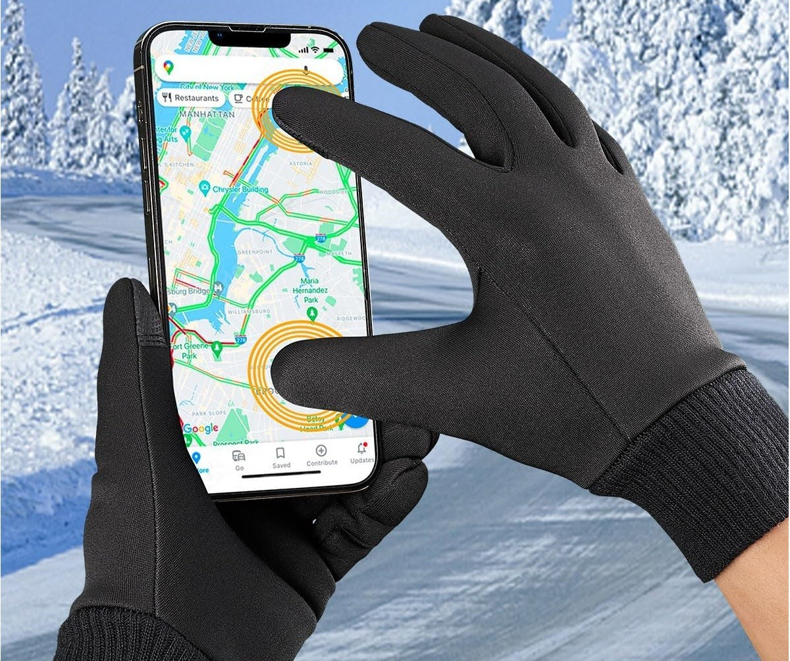
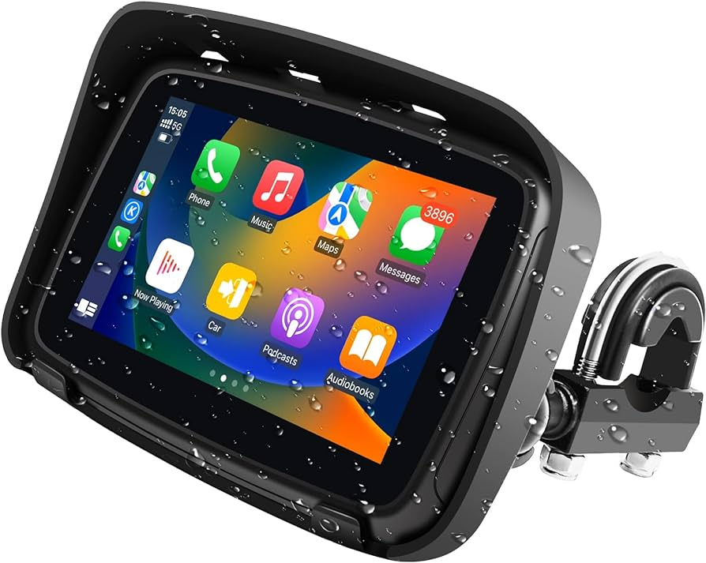
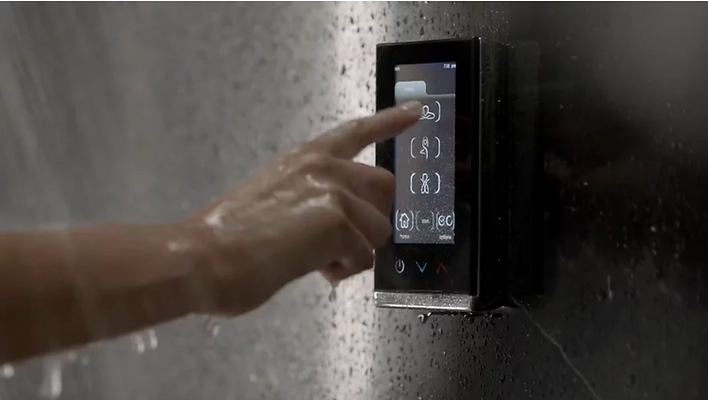
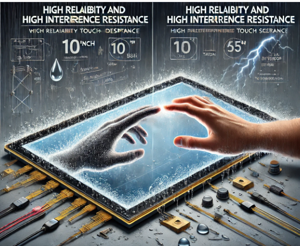

# Glove Touch, Waterproof Touch, and Interference Resistance

!!! abstract "Quick answer"
    This guide explains glove and waterproof touchscreens, the relevant design trade-offs, and the points engineers should verify when selecting a display solution.

## Key Takeaways

- Learn glove and waterproof touchscreens, key trade-offs, applications, and engineering selection criteria.
- Use the guidance below to compare the relevant technologies and design trade-offs.
- Validate optical, electrical, mechanical, environmental, and production requirements before final selection.

## Touch Enhancement Solutions

### Glove Touch

The Role of Glove Touch Technology

Glove touch technology aims to enable users to operate touch screen devices smoothly while wearing gloves. This technology enhances the touch screen's ability to recognize and respond to touch signals generated by gloves. The primary roles of glove touch technology include:

Enhancing Convenience: Users can operate touch screens without removing their gloves in cold weather or special work environments, improving convenience and user experience.

Increasing Efficiency: For industries requiring glove use, such as healthcare, manufacturing, and construction, glove touch technology enhances operational efficiency by reducing the need to frequently remove gloves.

Ensuring Safety: In some work environments, gloves are necessary protective gear. Glove touch technology ensures safe operation while wearing protective equipment.

<figure markdown="span" class="displaywiki-figure">
  [{ width="760" loading="lazy" }](glove-waterproof-touch-application-scenarios-of-glove-touch-technology.jpeg){ .displaywiki-image-link title="Open full-size image" }
  <figcaption>Application Scenarios of Glove Touch Technology</figcaption>
</figure>

Cold Environments: In cold weather conditions, users can operate Smartphones, tablets, and other touch screen devices while wearing warm gloves, unaffected by low temperatures.

Healthcare: Doctors and nurses can conveniently operate touch screen devices, such as electronic medical records systems and diagnostic equipment, while wearing medical gloves, improving work efficiency.

Manufacturing and Industrial: In factories or industrial sites, workers need to wear protective gloves to protect their hands while operating touch screen devices, such as control panels and machine interfaces.

Outdoor Activities: During outdoor activities such as skiing, cycling, and mountaineering, users can operate GPS devices, Smartwatches, and Smartphones while wearing gloves, increasing the usability of devices.

Emergency Services: Police officers, firefighters, and emergency personnel often need to wear gloves while on duty. Glove touch technology allows them to efficiently use touch screen devices, such as communication tools and navigation equipment.

<figure markdown="span" class="displaywiki-figure">
  [{ width="760" loading="lazy" }](glove-waterproof-touch-implementation-methods-of-glove-touch-technology.jpeg){ .displaywiki-image-link title="Open full-size image" }
  <figcaption>Implementation Methods of Glove Touch Technology</figcaption>
</figure>

The implementation of glove touch technology involves both hardware and software components. The main methods include:

Enhanced Capacitive Sensors: Modern touch screens usually use capacitive sensors. By enhancing the sensitivity of these sensors, they can detect the weak signals generated by gloves. Improving the design of capacitive sensors makes them more responsive to glove touches.

Adjusting Touch Algorithms: Optimizing touch algorithms to recognize and process glove touch signals. Algorithms can distinguish between glove touches and regular touches, ensuring accurate glove operation.

Using High-Conductivity Materials: Some gloves incorporate high-conductivity materials in the fingertips, such as conductive fibers or silver-coated fabrics. These materials effectively transmit the electrical signals from the fingers, allowing the touch screen to recognize glove touches.

Capacitive Compensation Technology: This technology adjusts the capacitive values to accommodate different glove thicknesses and materials, ensuring sensitivity and accuracy for glove touches.

Multi-Touch Technology: Enhancing multi-touch functionality to allow the touch screen to recognize multiple glove touch points, improving the fluidity and accuracy of glove touch operations.

Key Steps in Implementing Glove Touch Technology

Optimizing Sensor Design: Select and optimize capacitive touch sensors to be more responsive to glove touch signals. This may involve improvements in sensor materials and structure.

Adjusting Software Algorithms: Develop and adjust touch algorithms to recognize glove touch signals and process them without affecting regular touch operations.

Selecting Suitable Glove Materials: In glove design, choose materials with high conductivity to ensure gloves can transmit sufficient electrical signals, allowing the touch screen to recognize glove touches.

Testing and Calibration: Conduct tests and calibration in various environments and usage conditions to ensure stable operation of glove touch technology in all scenarios.

User Feedback and Improvement: Continuously improve glove touch technology based on user feedback, addressing issues encountered in practical use to enhance reliability and user experience.

## Conclusion

Glove touch technology improves touch performance and user experience by allowing smooth operation of touch screen devices while wearing gloves. Through hardware enhancements and software optimizations, glove touch technology finds wide application in various fields, including cold environments, healthcare, manufacturing, outdoor activities, and emergency services. As technology continues to evolve and improve, glove touch technology will further enhance the usability of devices and provide efficient solutions for more sectors.

### Waterproof Touch

The Role of Waterproof touch Technology

Waterproof touch technology aims to enable touch screen devices to function properly even when users' fingers are wet. Traditional touch screens often struggle to perform accurately in the presence of water or moisture, but waterproof touch technology improves sensors and algorithms to accurately recognize and respond to wet touch signals. Its primary roles include:

Increasing Device Usability: Ensures touch screen devices can be used in various moist environments without being affected by the wetness of the user's fingers, improving the device's usability and reliability.

Enhancing User Experience: In everyday life, users frequently use phones, tablets, and other devices with wet fingers. Waterproof touch technology ensures seamless operation in these conditions, enhancing user experience.

Improving Device Durability: Reduces incorrect operations and potential device damage caused by moisture, enhancing the durability and lifespan of the device.

<figure markdown="span" class="displaywiki-figure">
  [{ width="760" loading="lazy" }](glove-waterproof-touch-application-scenarios-of-waterproof-touch-technology.jpeg){ .displaywiki-image-link title="Open full-size image" }
  <figcaption>Application Scenarios of Waterproof touch Technology</figcaption>
</figure>

Kitchens and Bathrooms: In moist environments like kitchens and bathrooms, users often need to operate touch screen devices, such as Smart refrigerators, tablets, and Smart mirrors, with wet fingers.

Outdoor Activities: In rainy or humid outdoor environments, users can operate Smartphones, Smartwatches, and navigation devices with wet fingers.

Gyms: In gyms where sweating is common, users can operate fitness equipment and touch screens to track workout data or play music with wet fingers.

Healthcare Environments: Doctors and nurses can seamlessly use touch screen devices, such as electronic medical record systems and diagnostic equipment, with wet fingers after washing hands or during procedures.

Everyday Life: Users can operate Smart devices normally after activities involving water contact, such as cleaning or washing.

<figure markdown="span" class="displaywiki-figure">
  [{ width="760" loading="lazy" }](glove-waterproof-touch-implementation-methods-of-waterproof-touch-technology.png){ .displaywiki-image-link title="Open full-size image" }
  <figcaption>Implementation Methods of Waterproof touch Technology</figcaption>
</figure>

Implementing waterproof touch technology involves a combination of hardware and software enhancements. The main methods include:

Enhanced Capacitive Sensors: Improving the design of capacitive sensors to better detect and differentiate wet touch signals from water droplets, increasing sensitivity and accuracy for waterproof touches.

Optimized Touch Algorithms: Developing advanced touch algorithms to effectively recognize and process wet touch signals. The algorithms must distinguish between normal touch, wet touch, and water droplet interference to ensure accurate touch operations.

Surface Coating Technology: Applying hydrophobic coatings to the touch screen surface to make water droplets slide off more easily, reducing interference and enhancing the screen's responsiveness to wet touches.

Multi-Frequency Signal Processing: Using multi-frequency signal processing technology to analyze touch signals at different frequencies, enhancing the ability to recognize wet touch signals and improving touch screen performance in moist environments.

Material Selection and Improvement: Using improved materials that provide better conductivity and anti-interference capabilities in moist environments, ensuring stability and accuracy for waterproof touches.

Key Steps in Implementing Waterproof touch Technology

Optimizing Sensor Design: Select and optimize capacitive touch sensors to be more responsive to wet touch signals. This may involve improvements in sensor materials and structure.

Adjusting Software Algorithms: Develop and adjust touch algorithms to recognize wet touch signals and process them without affecting regular touch operations.

Applying Surface Coatings: Apply hydrophobic coatings to the touch screen surface to reduce water droplet interference and enhance responsiveness to wet touches.

Testing and Calibration: Conduct tests and calibration in various environments and usage conditions to ensure stable operation of waterproof touch technology.

User Feedback and Improvement: Continuously improve waterproof touch technology based on user feedback, addressing issues encountered in practical use to enhance reliability and user experience.

## Conclusion

Waterproof touch technology improves touch performance and user experience by allowing seamless operation of touch screen devices with wet fingers. Through hardware enhancements, optimized algorithms, and hydrophobic coatings, waterproof touch technology finds wide application in various scenarios, including kitchens, bathrooms, outdoor activities, gyms, healthcare environments, and everyday life. As technology continues to evolve and improve, waterproof touch technology will further enhance device usability and provide efficient solutions for more scenarios.

### High Reliability and High Interference Resistance

Key Performance Indicators

Touch screens with high reliability and high interference resistance need to function stably in various complex environments while providing accurate touch responses. The key performance indicators include:

Touch Accuracy: The touch screen should have high accuracy in recognizing user touch operations, even in the presence of interference.

Response Speed: Quick response times are crucial for ensuring a smooth user experience, with the touch screen responding to touch operations within milliseconds.

Interference Resistance: The touch screen should maintain stable operation under electromagnetic interference (EMI), electrostatic discharge (ESD), and other environmental disturbances.

Durability: The touch screen should be durable, including scratch resistance, impact resistance, high and low temperature tolerance, and water and dust resistance.

Multi-Touch Capability: Supporting multiple touch points to ensure accuracy and smoothness in complex touch operations.

Sensitivity: The touch screen should have high sensitivity to detect light touch operations, especially when the user is wearing gloves or has wet fingers.

Power Consumption: Low power consumption is essential for portable devices, with the touch screen providing high performance while maintaining low energy usage.

<figure markdown="span" class="displaywiki-figure">
  [{ width="760" loading="lazy" }](glove-waterproof-touch-application-scenarios.png){ .displaywiki-image-link title="Open full-size image" }
  <figcaption>Application Scenarios</figcaption>
</figure>

High reliability and high interference resistance touch screens are widely used in the following scenarios:

Industrial Control: Touch screens in industrial environments need to function stably under strong electromagnetic interference, dust, and high temperatures, such as in automated production lines and machinery control panels.

Medical Devices: In medical environments, touch screens require high precision and reliability, functioning normally despite disinfectants and moisture, such as in surgical control panels and bedside monitoring equipment.

Outdoor Equipment: Touch screens for outdoor environments need water, dust, and UV resistance, such as in outdoor advertising displays, self-service kiosks, and navigation devices.

Military Equipment: Military applications require touch screens with high interference resistance and reliability under extreme conditions, such as in battlefield communication devices and command control systems.

Automotive Systems: In-car touch screens need to operate stably under vibration, temperature changes, and electromagnetic interference, such as in navigation and entertainment systems.

Financial Terminals: ATMs, POS systems, and other financial terminals require touch screens to maintain high reliability under frequent use and stringent security requirements.

Implementation Methods

High reliability and high interference resistance touch screens are achieved through various technologies and designs, including:

Hardware

Screen Material Selection: Use durable and interference-resistant materials such as high-strength glass and anti-reflective coatings to enhance the durability and interference resistance of the touch screen.

Touch Sensor Optimization: Use high-precision touch sensors such as capacitive touch technology and design multi-layer structures to reduce the impact of electromagnetic interference.

Shielding Design: Add shielding layers in the touch screen design to prevent external electromagnetic interference from entering the touch circuit, ensuring signal stability.

Anti-Static Design: Use anti-static materials and designs to prevent damage from electrostatic discharge, enhancing the device's durability.

Surface Coating: Apply hydrophobic and oleophobic coatings to improve screen response in wet environments and prevent dust and oil from affecting touch performance.

Water and Dust Resistance: Use sealing designs and protective coatings to achieve IP65 or higher levels of water and dust resistance, suitable for outdoor and harsh environments.

Software

Algorithm Optimization: Develop advanced touch algorithms to enhance signal processing capabilities, accurately recognize touch signals, and reduce false touches and misses.

Interference Filtering: Add interference filtering algorithms in touch signal processing to filter out environmental noise and interference signals, ensuring accurate touch response.

Adaptive Touch: Use adaptive touch technology to automatically adjust touch sensitivity and response speed according to environmental changes, ensuring stable performance under different conditions.

Multi-Touch Processing: Optimize multi-touch processing algorithms to ensure accuracy and smoothness during simultaneous multiple touch operations, improving user experience.

Power Management: Optimize the power management of the touch module, using intelligent sleep and wake mechanisms to reduce energy consumption and extend the battery life of portable devices.

## Conclusion

High reliability and high interference resistance touch screens achieve stable operation and high precision touch through hardware optimization and software improvement. Key performance indicators include touch accuracy, response speed, interference resistance, durability, multi-touch capability, sensitivity, and power consumption. Application scenarios cover industrial control, medical devices, outdoor equipment, military equipment, automotive systems, and financial terminals. Through material selection, sensor optimization, shielding design, anti-static design, surface coating, algorithm optimization, interference filtering, adaptive touch, multi-touch processing, and power management, high reliability touch screens exhibit excellent performance and stability in practical applications. With continuous technological advancement, high reliability and high interference resistance touch screens will provide reliable solutions for more fields, enhancing user experience and device performance.

窗体底端

## Related reading

- [Capacitive vs Resistive Touchscreens](touch-panel-types.md)
- [GF, GFF, GG, and PG Capacitive Touch Structures](capacitive-touch-structures.md)
- [Air Bonding vs Optical Bonding for Displays](air-vs-optical-bonding.md)

!!! info "Can't find what you need?"    
    If you need more products, resources or support, please contact our team:  

    [**:material-archive-arrow-down: Knowledge Base**](../../knowledge/tags.md){ .md-button .md-button--primary } 
    [**:material-magnify: Products & Solutions**](https://viewedisplay.com/touch-solution/){ .md-button }
    [**:material-email: Contact Support**](mailto:support@viewedisplay.com){ .md-button }