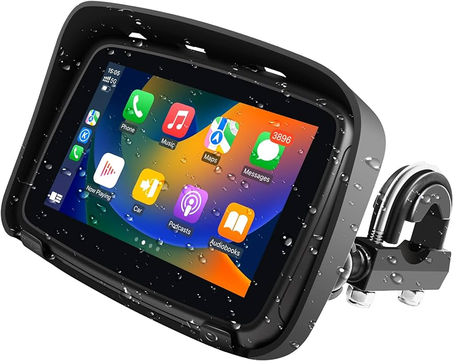
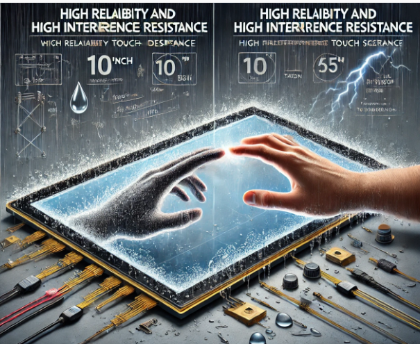

# Glove Touch, Waterproof Touch, and Interference Resistance

!!! abstract "Quick answer"
    In industrial, medical, and outdoor scenarios, a touch screen does not face clean fingers but gloves, wet hands, water droplets, and electromagnetic noise. Glove touch has to solve "the signal is too weak," waterproof touch has to solve "it cannot tell a hand from water," and interference-resistant design has to solve "noise drowning out the signal." All three rely on hardware and algorithms working together, and the core metric is the signal-to-noise ratio.

## Key Takeaways

- Glove touch is essentially about raising the signal-to-noise ratio: increase sensor sensitivity, adjust algorithm thresholds, and pair them with high-conductivity glove materials.
- Waterproof touch hinges on distinguishing water droplets from a real touch: a hydrophobic coating reduces residue, while multi-frequency signal processing and algorithms handle the discrimination.
- High interference resistance is built from three layers — shielding and grounding (hardware), filtering and adaptation (algorithms), and sealing and materials (structure).
- The three capabilities can be combined, but a balance must be struck between sensitivity and false-touch rejection so that one does not undermine another.

## 1. Glove Touch

### 1.1 The Role of Glove Touch

Glove touch technology aims to let users operate touch screen devices smoothly while wearing gloves. Its core purpose is to improve the touch screen's ability to recognize and respond to the touch signals generated by gloves. Its main roles include:

- **Improving convenience**: In cold weather or special work environments, users can operate the touch screen without removing their gloves.
- **Increasing efficiency**: In industries that require gloves, such as healthcare, manufacturing, and construction, reducing the need to put gloves on and take them off can significantly improve productivity.
- **Ensuring safety**: In some work environments gloves are necessary protective equipment, and supporting glove touch means protection does not have to be sacrificed to operate a device.

### 1.2 Application Scenarios

<figure markdown="span" class="displaywiki-figure">
  [{ width="760" loading="lazy" }](glove-waterproof-touch-application-scenarios-of-glove-touch-technology.jpeg){ .displaywiki-image-link title="Open full-size image" }
  <figcaption>Cold environment: in winter or under outdoor low-temperature conditions, users can operate phones, tablets, and other touch devices directly while wearing warm gloves.</figcaption>
</figure>

<figure markdown="span" class="displaywiki-figure">
  [{ width="760" loading="lazy" }](glove-waterproof-touch-implementation-methods-of-glove-touch-technology.jpeg){ .displaywiki-image-link title="Open full-size image" }
  <figcaption>Healthcare: medical staff operate monitors and similar equipment while wearing disposable medical gloves, completing interactions without removing them and reducing the risk of cross-infection.</figcaption>
</figure>

- **Manufacturing and industry**: Workers need to wear protective gloves when operating control panels and machine interfaces.
- **Outdoor activities**: In skiing, cycling, and mountaineering, users can use GPS devices, smartwatches, and bike computers while wearing gloves.
- **Emergency services**: Police, firefighters, and paramedics often have to wear gloves on duty, and glove touch lets them use communication and navigation equipment normally.

### 1.3 Implementation Methods

Glove touch technology involves both hardware and software. The main methods include:

- **Enhanced capacitive sensors**: Modern touch screens mostly use capacitive sensors. By raising their sensitivity, the sensor can detect the weak signal caused by a glove.
- **Adjusted touch algorithms**: Optimize the touch algorithm so that it can recognize and process glove touch signals.
- **High-conductivity materials**: Introduce high-conductivity materials into the glove to carry the finger's electrical signal more effectively, so the touch screen can recognize the glove contact.
- **Capacitive compensation technology**: Adjust the capacitance through compensation to accommodate different glove thicknesses and materials, keeping glove touch sensitivity and accuracy.

### 1.4 Key Steps

1. **Optimize sensor design**: Select and optimize capacitive touch sensors so they are more sensitive to weak glove signals, which may involve improvements in sensor materials and structure.
2. **Adjust software algorithms**: Develop and tune the touch algorithm so it recognizes glove touches without affecting normal bare-finger operation.
3. **Choose suitable glove materials**: In glove design, use high-conductivity materials to ensure sufficient signal transfer.
4. **Test and calibrate**: Test and calibrate across environments and usage conditions to ensure stable glove touch operation.
5. **User feedback and improvement**: Keep improving based on real-world feedback to enhance reliability and the user experience.

## 2. Waterproof Touch

### 2.1 The Role of Waterproof Touch

Waterproof touch technology aims to let the touch screen work properly even when the user's fingers are wet. Conventional touch screens often struggle to respond accurately in the presence of water or high humidity, and waterproof touch improves the sensors and algorithms to precisely recognize touch signals under wet conditions. Its main roles include:

- **Improving device usability**: Ensure the device works normally in all kinds of humid environments, unaffected by the wetness of the user's fingers.
- **Improving the user experience**: Keep operation stable in kitchens, in the rain, or when sweating during exercise.
- **Improving durability**: Reduce false operations and moisture-induced damage, extending service life.

### 2.2 Application Scenarios

<figure markdown="span" class="displaywiki-figure">
  [{ width="760" loading="lazy" }](glove-waterproof-touch-application-scenarios-of-waterproof-touch-technology.jpeg){ .displaywiki-image-link title="Open full-size image" }
  <figcaption>Outdoor environment: when the device surface is covered with rain or condensation, waterproof touch still has to tell a real touch from water droplets and avoid false triggering.</figcaption>
</figure>

<figure markdown="span" class="displaywiki-figure">
  [{ width="760" loading="lazy" }](glove-waterproof-touch-implementation-methods-of-waterproof-touch-technology.png){ .displaywiki-image-link title="Open full-size image" }
  <figcaption>Wet conditions: in a bathroom, shower, or after washing hands, the user operates the touch panel with wet hands directly — the most typical challenging environment for waterproof touch.</figcaption>
</figure>

- **Kitchens and bathrooms**: Devices such as smart refrigerators, tablets, and smart mirrors often need to be operated with wet hands.
- **Outdoor activities**: Using phones, smartwatches, and navigation devices in rain or humid environments.
- **Gyms**: Operating fitness equipment or touch interfaces while sweating during exercise.
- **Healthcare environments**: Medical staff conveniently operating touch devices after washing hands or during procedures.
- **Everyday life**: Using smart devices normally after water-related activities such as cleaning or washing.

### 2.3 Implementation Methods

Waterproof touch technology combines hardware and software improvements. The main methods include:

- **Enhanced capacitive sensors**: Improve the design of capacitive sensors so they can better distinguish wet-hand touch signals from plain water droplets, improving sensitivity and accuracy.
- **Optimized touch algorithms**: Develop algorithms to recognize and process touch signals under wet conditions. The algorithm must distinguish normal touch, wet-hand touch, and water-droplet interference to keep operation accurate.
- **Surface coating technology**: Apply a hydrophobic coating to the touch screen surface so water droplets slide off more easily, reducing residue and interference.
- **Multi-frequency signal processing**: Use multi-frequency signal processing to analyze touch signals at different frequencies, strengthening signal recognition under humid conditions.
- **Material selection and improvement**: Choose materials with better conductivity and interference resistance in humid environments to ensure stability and accuracy.

### 2.4 Key Steps

1. **Optimize sensor design**: Select and optimize capacitive touch sensors so they are more sensitive to wet touch signals.
2. **Adjust software algorithms**: Develop and tune the touch algorithm to recognize wet touch without affecting regular operation.
3. **Apply surface coatings**: Apply a hydrophobic coating to the touch surface to reduce water-droplet interference and improve response consistency.
4. **Test and calibrate**: Test and calibrate across environments and usage conditions to ensure stable operation.
5. **User feedback and improvement**: Keep improving based on problems exposed in real-world use.

## 3. High-Reliability and Interference-Resistant Design

### 3.1 Key Performance Indicators

A touch screen with high reliability and strong interference resistance needs to run stably in complex environments while keeping an accurate touch response. The key indicators include:

- **Touch accuracy**: Even in the presence of interference, a high positioning accuracy should be maintained.
- **Response speed**: The touch screen has to respond within milliseconds, which is the foundation of the experience.
- **Interference resistance**: Maintain stable operation under electromagnetic interference (EMI), electrostatic discharge (ESD), and other environmental factors.
- **Durability**: Including scratch resistance, impact resistance, high and low temperature tolerance, and water and dust resistance.
- **Sensitivity**: The ability to detect light touches, especially when the user is wearing gloves or has wet fingers.
- **Power consumption**: Mobile devices require high performance together with low energy use.

<figure markdown="span" class="displaywiki-figure">
  [{ width="760" loading="lazy" }](glove-waterproof-touch-application-scenarios.png){ .displaywiki-image-link title="Open full-size image" }
  <figcaption>Illustration of high-reliability and interference-resistant touch: the device must keep a stable response in an environment where moisture, dust, and electromagnetic noise coexist — a shared requirement for industrial, outdoor, and specialty applications.</figcaption>
</figure>

### 3.2 Application Scenarios

- **Industrial control**: Automated production lines and machinery control panels, which must run stably under strong electromagnetic interference, dust, and high temperatures.
- **Medical devices**: Surgical control panels and bedside monitoring equipment, which must maintain high precision and reliability under disinfectants and moisture.
- **Outdoor equipment**: Outdoor advertising displays, self-service kiosks, and navigation devices, which need water, dust, and UV resistance.
- **Military equipment**: Battlefield communication devices and command-and-control systems, which demand extremely high interference resistance and reliability.
- **Automotive systems**: Navigation and entertainment systems, which must run stably under vibration, temperature changes, and electromagnetic interference.
- **Financial terminals**: ATMs, POS terminals, and similar, which must stay highly reliable under frequent use and strict security requirements.

!!! warning "Volume production note"
    In volume production or harsh operating conditions (high and low temperature, damp heat, vibration, ESD), verify the measured curves and specification limits of the touch solution; once the range is exceeded, the false-touch rate, sensitivity consistency, and lifetime all degrade noticeably, and such issues are often amplified across batches.

### 3.3 Implementation Methods

**Hardware**

- **Screen material selection**: Use durable, interference-resistant materials such as high-strength glass and anti-reflective coatings to improve durability.
- **Touch sensor optimization**: Use high-precision capacitive touch technology and multi-layer structure design to reduce the impact of electromagnetic interference.
- **Shielding design**: Add a shielding layer in the touch design to block external electromagnetic interference from entering the touch circuit.
- **Anti-static design**: Use anti-static materials and structural design to prevent damage from electrostatic discharge.
- **Surface coating**: Apply hydrophobic and oleophobic coatings to improve response in wet environments and reduce the effect of dust and oil on touch.
- **Water and dust resistance**: Achieve IP65 or higher protection through sealing design and protective coatings, for outdoor and harsh environments.

**Software**

- **Algorithm optimization**: Develop advanced touch algorithms to strengthen signal processing and accurately recognize touch signals while reducing false touches.
- **Interference filtering**: Add filtering to the touch signal processing chain to remove environmental noise and interference signals.
- **Adaptive touch**: Automatically adjust sensitivity and response speed according to environmental changes to ensure stable performance under different conditions.
- **Multi-touch processing**: Optimize the multi-touch algorithm to ensure accuracy and smoothness in simultaneous multi-finger operation.
- **Power management**: Optimize the power consumption of the touch module through intelligent sleep and wake mechanisms, extending the battery life of portable devices.

## 4. Selection Checklist

- **Define the real operating conditions**: First determine which of glove, wet hand, water droplets, or electromagnetic noise apply, then choose the solution accordingly.
- **Balance sensitivity and false touches**: Raising sensitivity to support glove touch also increases the risk of false touches, so confirm it by testing under the field conditions.
- **Confirm glove type and thickness**: Different materials (conductive fiber, leather, latex) affect glove touch very differently, so designate a specific glove for testing.
- **Evaluate the waterproofing method**: A hydrophobic coating only reduces residue; real water resistance comes from the sealing structure, so confirm the enclosure IP rating rather than only the panel specification.
- **Check the electromagnetic environment**: Where motors, inverters, or high-power wireless equipment are involved, ask for EMI and ESD test results.
- **Confirm low-temperature behavior**: Liquid crystal responds more slowly at low temperature, so touch and display must be evaluated together, with a heating solution if necessary.

## 5. Frequently Asked Questions

??? question "Q1: Why does a phone not respond when I touch it with gloves on?"
    Capacitive touch relies on the capacitive coupling formed between the finger and the sensor. An ordinary glove is insulating and breaks that coupling path, so the signal is too weak to be recognized. There are two directions to solve it: one is to let the sensor and algorithm recognize weaker signals (a higher signal-to-noise ratio), and the other is to give the glove some conductivity (for example by adding conductive fibers).

??? question "Q2: How is glove touch implemented?"
    Usually through hardware and algorithms working together: in hardware, raise the capacitive sensor's sensitivity and optimize the electrode structure; in the algorithm, adjust the touch threshold and recognition logic to keep weak signals that match glove characteristics while filtering out noise. Capacitive compensation technology can also adapt to gloves of different thicknesses and materials.

??? question "Q3: The screen gives false touches when there is water on it. How can this be solved?"
    Two steps: first reduce residue by letting water droplets slide off quickly through a hydrophobic coating; second strengthen discrimination by using multi-frequency signal processing and algorithms to tell the characteristic difference between water-droplet coverage and a real touch, and then suppress signals judged to be droplets. Only the two combined keep the screen usable in rain or with wet hands.

??? question "Q4: Can glove touch and waterproof touch be done at the same time?"
    Yes, but the parameters need careful tuning. Both require improving the recognition of weak signals, and stacking them significantly raises the risk of false touches, so joint testing under the target glove and target humidity conditions is necessary. In practice a project usually fixes the highest-priority scenario first and then gradually relaxes the other metric.

??? question "Q5: Why do water droplets cause false touches?"
    Water has a relatively high dielectric constant. When it lands on a capacitive screen it changes the local electric field distribution and produces a signal similar to the capacitance change of a finger, so it is misjudged as a touch. This is also why waterproof touch must rely on algorithms and not only on a waterproof structure — the water is blocked, but the recognition problem remains.

??? question "Q6: What should I watch for in touch interference resistance for industrial control scenarios?"
    Three areas matter most: first, shielding and grounding, to keep external electromagnetic interference out of the touch circuit; second, software filtering, to remove signals that do not match real touch characteristics; third, structure and materials, including anti-static design and sealing protection. In addition, test under real operating conditions (with motors, inverters, and other interference sources), not only in a lab environment.

## Related reading

- [Capacitive vs Resistive Touch Screens](touch-panel-types.md)
- [GF, GFF, GG, and PG Capacitive Touch Structures](capacitive-touch-structures.md)
- [Air Bonding vs Optical Bonding for Displays](air-vs-optical-bonding.md)

!!! info "Can't find what you need?"
    If you need more products, resources or support, please contact our team:

    [**:material-archive-arrow-down: Knowledge Base**](../../knowledge/tags.md){ .md-button .md-button--primary }
    [**:material-magnify: Products & Solutions**](https://viewedisplay.com/){ .md-button }
    [**:material-email: Contact Support**](mailto:support@viewedisplay.com){ .md-button }
