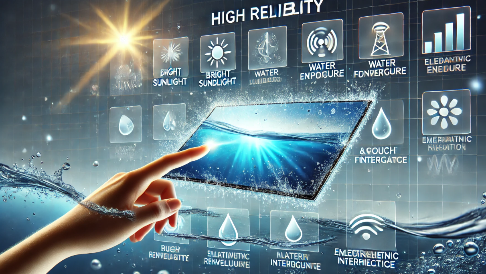

# High-Reliability Display Solutions

!!! abstract "Quick answer"
    This guide explains high reliability displays, the relevant design trade-offs, and the points engineers should verify when selecting a display solution.

## Key Takeaways

- Learn high reliability displays, key trade-offs, applications, and engineering selection criteria.
- Use the guidance below to compare the relevant technologies and design trade-offs.
- Validate optical, electrical, mechanical, environmental, and production requirements before final selection.

## High Reliability Solutions

Key Indicators or Parameters of High Reliability Display Screens

High reliability display screens need to function stably in various complex environments, providing long-term, fault-free operation. The key indicators or parameters reflecting high reliability include:

Lifespan: The lifespan of a display screen is usually measured in hours, such as 50,000 hours or more. A longer lifespan indicates that the display can maintain high performance over a longer period.

Brightness and Contrast: High brightness and contrast ensure that the display remains clearly visible under different lighting conditions. High reliability displays maintain stable brightness and contrast without significant degradation over time.

Color Stability: The display should maintain color consistency and accuracy over time without color shifts or fading.

Anti-Reflective and Anti-Glare: High reliability displays typically feature anti-reflective and anti-glare properties to ensure visibility in bright environments.

Water and Dust Resistance: The IP rating (e.g., IP65 or higher) indicates the display's ability to resist water and dust. High reliability displays usually have high IP ratings to operate in harsh environments.

Temperature Tolerance: The display should operate normally under extreme temperature conditions, typically with an operating range from -30°C to +85°C or broader.

Shock and Vibration Resistance: The display should have strong resistance to shock and vibration, especially in industrial and military applications.

Electromagnetic Interference (EMI) and Electrostatic Discharge (ESD) Resistance: High reliability displays should have good EMI and ESD resistance to ensure signal stability and device safety.

<figure markdown="span" class="displaywiki-figure">
  [{ width="760" loading="lazy" }](high-reliability-displays-how-to-achieve-high-reliability-in-display-screens.png){ .displaywiki-image-link title="Open full-size image" }
  <figcaption>How to Achieve High Reliability in Display Screens</figcaption>
</figure>

Achieving high reliability in display screens involves optimizing design, material selection, and manufacturing processes:

Material Selection:

Use high-quality panel materials such as high-strength glass or plastic substrates to enhance durability.

Employ backlight materials that are resistant to high temperatures and UV radiation to ensure long-term use without color change.

Structural Design:

Design waterproof and dustproof structures to protect the internal components of the display.

Use multi-layer structural designs, including protective layers, anti-reflective layers, and functional layers to improve overall screen performance.

Manufacturing Processes:

Adopt precision manufacturing processes such as vacuum encapsulation and nano-coating technology to ensure the sealing and stability of the display.

Use anti-static coatings and shielding materials to reduce the impact of electromagnetic interference and static electricity on the display.

Reliability Testing:

Conduct rigorous reliability testing during production, including high and low-temperature cycling, humidity testing, vibration testing, and impact testing to ensure the display's stability in various environments.

Perform aging tests to simulate long-term use environments and evaluate the display's lifespan and performance retention.

Smart Control Technologies:

Use Smart dimming technology to automatically adjust brightness based on ambient light, extending the display's lifespan.

Implement color calibration technology to continually correct display colors and maintain color consistency.

Application Scenarios for High Reliability Display Screens

High reliability display screens are widely used in scenarios requiring long-term stable operation and complex environmental conditions:

Industrial Control: In automated production lines and machinery control systems, displays need to operate stably under high temperatures, dust, and strong electromagnetic interference.

Medical Devices: Medical monitoring and diagnostic equipment require high reliability displays that remain clear in disinfected and humid environments.

Outdoor Advertising: Outdoor advertising boards and information displays need to operate stably in all weather conditions (rain, snow, strong sunlight) while maintaining high brightness and clarity.

Military and Aerospace: Displays in military and aerospace applications need to operate reliably under extreme temperatures, high vibration, and strong electromagnetic interference to ensure mission success.

Automotive Electronics: In-car displays need to operate stably under high and low temperatures and vibration, such as in navigation systems and central control displays.

Transportation: Public transportation information displays and airport/station display systems need to operate stably in high traffic and complex environments, providing accurate information services.

## Conclusion

High reliability display screens achieve stable long-term operation through comprehensive optimization in material selection, structural design, manufacturing processes, and reliability testing. The key performance indicators include lifespan, brightness and contrast, color stability, water and dust resistance, temperature tolerance, shock and vibration resistance, and EMI and ESD resistance. High reliability display screens are widely used in industrial control, medical devices, outdoor advertising, military and aerospace, automotive electronics, and transportation. With continuous technological advancement, high reliability display screens will provide reliable solutions for more fields, enhancing device performance and user experience.

## Related reading

- [Custom and Sunlight-Readable Display Solutions](custom-sunlight-readable-displays.md)
- [UART Smart Display Solutions](uart-smart-display.md)
- [IoT and AIoT Smart Display Solutions](iot-aiot-display.md)
