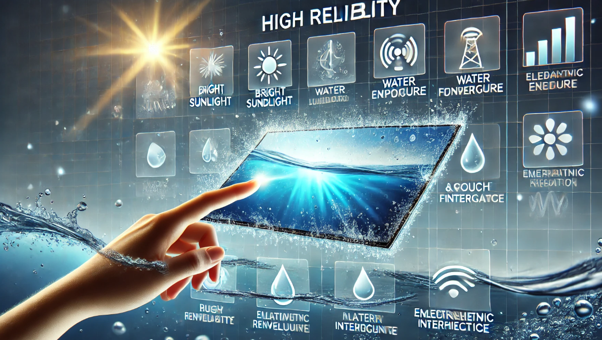

# High-Reliability Display Solutions

!!! abstract "Quick answer"
    The core requirement of a high-reliability display is long-term, failure-free operation in complex environments. Measuring it requires a set of indicators—lifetime, brightness and contrast stability, color stability, ingress protection rating, temperature range, shock and vibration resistance, and EMI and ESD tolerance. These indicators are supported jointly by material selection, structural design, manufacturing processes, and reliability testing; none can be missing.

## Key Takeaways

- Reliability is not a single parameter; it is a combination of lifetime, optical stability, environmental tolerance, and electromagnetic compatibility.
- Wide temperature range (typically -30°C to +85°C), high ingress protection (IP65 and above), and shock/vibration resistance are threshold requirements for industrial and outdoor applications.
- Materials and structure set the upper limit, manufacturing processes determine consistency, and reliability testing screens out products that do not meet requirements.
- Smart brightness adjustment and color calibration can slow performance degradation during use; they are "software-based lifetime extension" measures.

## 1. What Is High-Reliability Display

A high-reliability display needs to operate stably in various complex environments and ensure long-term, failure-free operation. Compared with conventional consumer displays, the difference is not reflected in "instantaneous" performance such as resolution or color gamut, but in the stability of performance over time and across environmental changes.

## 2. Key Indicators

The key indicators or parameters reflecting high reliability include the following:

| Indicator | Meaning and typical requirement |
|---|---|
| Display lifetime | Usually measured in hours, e.g., 50,000 hours or more; a longer lifetime means high performance is maintained for longer. |
| Brightness and contrast | Remains clearly visible under different lighting conditions and does not decay significantly over time. |
| Color stability | Maintains color consistency and accuracy over the long term without obvious color shift or fading. |
| Anti-reflection and anti-glare | Has anti-reflection (AR) and anti-glare (AG) properties to ensure visibility in bright environments. |
| Water and dust resistance | Expressed as an IP rating (e.g., IP65 or higher); harsh-environment operation usually requires a high IP rating. |
| Temperature tolerance | Operates normally at extreme temperatures; common operating range is -30°C to +85°C or wider. |
| Shock and vibration resistance | Has strong resistance to shock and vibration, especially critical in industrial and military applications. |
| EMI and ESD tolerance | Has good resistance to electromagnetic interference and electrostatic discharge, ensuring signal stability and device safety. |

<figure markdown="span" class="displaywiki-figure">
  [{ width="760" loading="lazy" }](high-reliability-displays-how-to-achieve-high-reliability-in-display-screens.png){ .displaywiki-image-link title="Open full-size image" }
  <figcaption>Typical dimensions evaluated for high-reliability displays: readable in strong light, water and dust resistant, resistant to vibration and shock, resistant to electromagnetic interference, and maintaining stable brightness, color, and lifetime over long-term use.</figcaption>
</figure>

!!! warning "Mass-production note"
    Under harsh operating conditions (high and low temperature, humidity, vibration, ESD), always check the temperature, humidity, and mechanical curves in the datasheet of the specific model. Actual use outside the specified range will significantly shorten lifetime and may amplify batch-to-batch consistency differences.

## 3. How to Achieve High Reliability

Achieving high reliability requires optimizing the entire chain from design and material selection to manufacturing.

### 3.1 Material Selection

- Use high-quality materials such as high-strength glass or plastic substrates to improve durability.
- Select backlight materials resistant to high temperatures and UV radiation to ensure no color change during long-term use.

### 3.2 Structural Design

- Design water- and dust-proof structures to protect internal display components.
- Adopt a multi-layer structural design that combines protective, anti-reflective, and functional layers to improve overall screen performance.

### 3.3 Manufacturing Processes

- Use precision manufacturing processes such as vacuum encapsulation and nano-coating to ensure sealing and stability.
- Use anti-static coatings and shielding materials to reduce the impact of electromagnetic interference and static electricity on the display.

### 3.4 Reliability Testing

- Perform rigorous testing during production, including high-low temperature cycling, humidity testing, vibration testing, and impact testing, to verify display stability in various environments.
- Conduct aging tests to simulate long-term use environments and evaluate service life and performance retention.

### 3.5 Smart Control Technology

- Use ambient-light sensing technology to automatically adjust brightness based on ambient illumination, extending display service life.
- Implement color calibration technology to continuously correct displayed colors and maintain color consistency.

## 4. Typical Application Scenarios

High-reliability displays are widely used in scenarios requiring long-term stable operation under complex environmental conditions:

- **Industrial control**: In automated production lines and machinery control systems, displays must operate stably under high temperatures, dust, and strong electromagnetic interference.
- **Medical devices**: Monitoring and diagnostic equipment must maintain clear images in repeatedly disinfected and humid environments.
- **Outdoor advertising**: Outdoor advertising boards and information screens must operate stably in all weather conditions (rain, snow, strong sunlight) while maintaining high brightness and clarity.
- **Military and aerospace**: Displays must operate reliably under extreme temperatures, high vibration, and strong electromagnetic interference to ensure mission success.
- **Automotive electronics**: In-car navigation and center-console displays must operate stably under high and low temperatures and continuous vibration.
- **Transportation**: Public transportation information screens and airport/station display systems must provide accurate information over the long term in high-traffic, complex environments.

## 5. Selection Guidelines

- **Define environmental boundaries**: First determine the actual operating temperature range, humidity, ingress protection rating, and vibration level, then select the model accordingly to avoid "over-spec waste" or "under-spec failure".
- **Distinguish operating temperature from storage temperature**: The operating temperature range and storage temperature range are often different and must be checked separately.
- **Confirm ingress protection rating**: The IP rating must be judged together with the installation method; the sealing effectiveness of the whole machine depends on structural design rather than the single-display metric.
- **Check optical stability**: Pay attention to the brightness decay curve, color shift, and image-sticking indicators, not just initial brightness and contrast.
- **Confirm electromagnetic compatibility requirements**: For scenarios involving motors, inverters, or wireless devices, check the EMI and ESD test conclusions.
- **Evaluate lifetime and maintenance cost**: For long-cycle equipment, combine backlight lifetime and replacement cost to calculate total cost of ownership.

## 6. Frequently Asked Questions

??? question "Q1: What are the key indicators of a high-reliability display?"
    Mainly include: display lifetime (often 50,000 hours or more), brightness and contrast stability, color stability, anti-reflection and anti-glare capability, water and dust ingress rating (IP rating), temperature tolerance range, shock and vibration resistance, and EMI and ESD tolerance. Together they describe how a display performs under long-term use and harsh environments.

??? question "Q2: What does an operating temperature of -30°C to +85°C mean?"
    It means the display can operate normally within this temperature range. Three points need attention: first, at low temperatures liquid-crystal response slows and trailing may occur, so low-temperature response indicators must be confirmed; second, operating temperature range and storage temperature range are usually different and must be checked separately; third, use outside the range will significantly shorten lifetime, so margin should be confirmed with measured data before mass production.

??? question "Q3: What is the difference between IP65 and IP67, and which should I choose?"
    An IP rating consists of two digits: the first indicates dust protection and the second indicates water protection. IP65 means fully dust-tight and protected against water jets; IP67 additionally supports short-term immersion. The choice depends on the actual use scenario—outdoor rain exposure is usually adequately covered by IP65, while scenarios where the screen may be submerged require IP67 or higher.

??? question "Q4: What is burn-in testing?"
    Burn-in testing is the process of running a display under powered or high-temperature conditions for a period of time before shipment. It is used to expose early failures, accelerate latent defects, and evaluate performance retention after long-term use. It is an important means of screening out batch-level hidden risks and ensuring delivery consistency.

??? question "Q5: What is the difference between EMI and ESD?"
    EMI (electromagnetic interference) refers to electromagnetic noise received or generated by equipment during operation that may affect signal stability; ESD (electrostatic discharge) refers to the instantaneous impact caused by discharge from a statically charged human body or object to the equipment. Protection methods differ: EMI focuses on shielding and filtering, while ESD focuses on grounding, anti-static coatings, and device protection.

??? question "Q6: How can display service life be extended?"
    Three aspects: structurally, ensure sealing and heat dissipation to avoid moisture and high temperatures accelerating aging; in use, automatically adjust brightness through ambient-light sensing to avoid long-term full-power operation; in maintenance, perform regular color calibration to maintain display consistency. In addition, choosing a model with a longer backlight lifetime can directly improve overall lifetime.

## Related reading

- [Custom and Sunlight-Readable Display Solutions](custom-sunlight-readable-displays.md)
- [UART Smart Display Solutions](uart-smart-display.md)
- [IoT and AIoT Smart Display Solutions](iot-aiot-display.md)

!!! info "Can't find what you need?"
    If you need more products, resources or support, please contact our team:

    [**:material-archive-arrow-down: Knowledge Base**](../../knowledge/tags.md){ .md-button .md-button--primary }
    [**:material-magnify: Products & Solutions**](https://viewedisplay.com/){ .md-button }
    [**:material-email: Contact Support**](mailto:support@viewedisplay.com){ .md-button }
