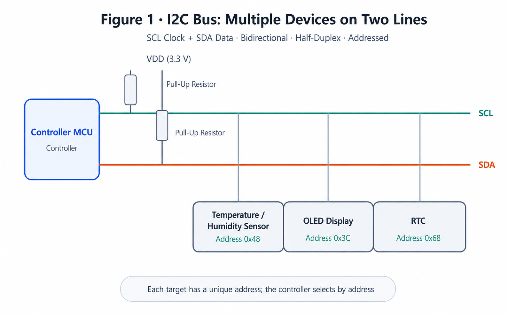
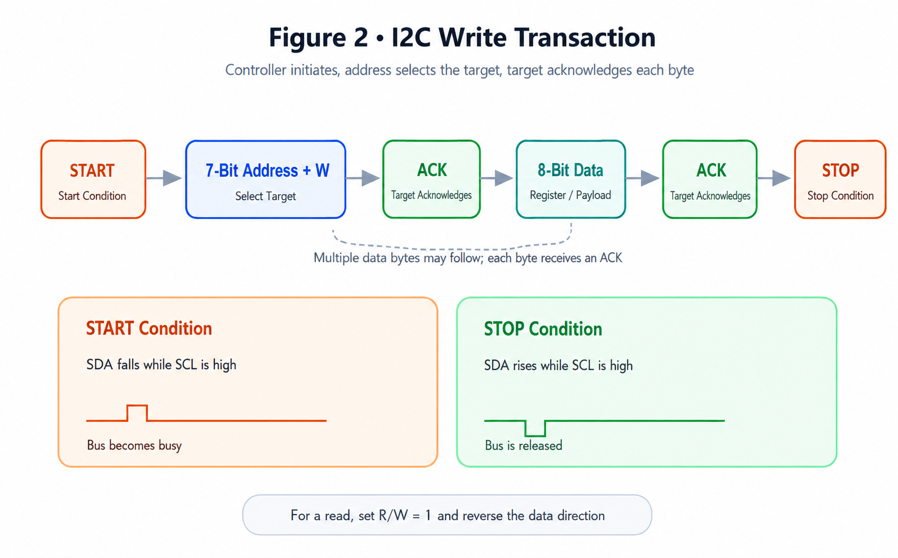
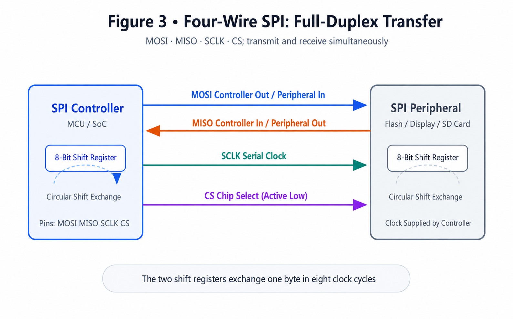
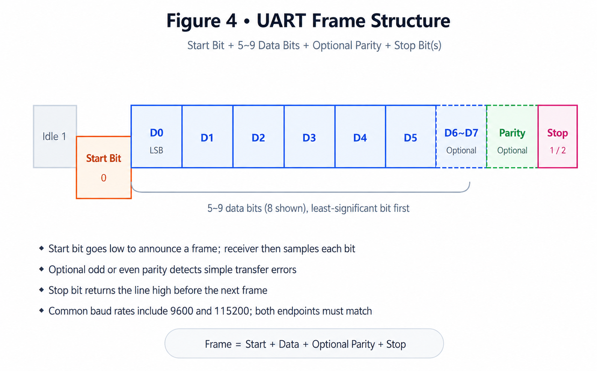
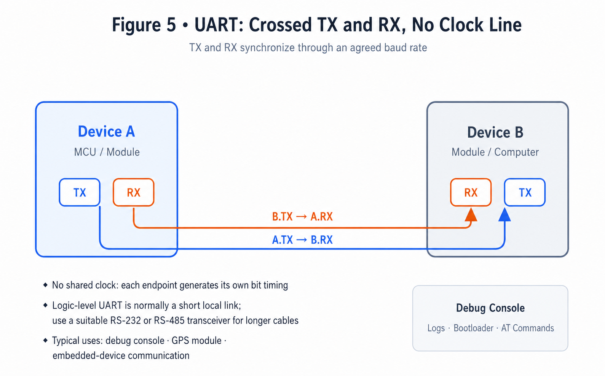
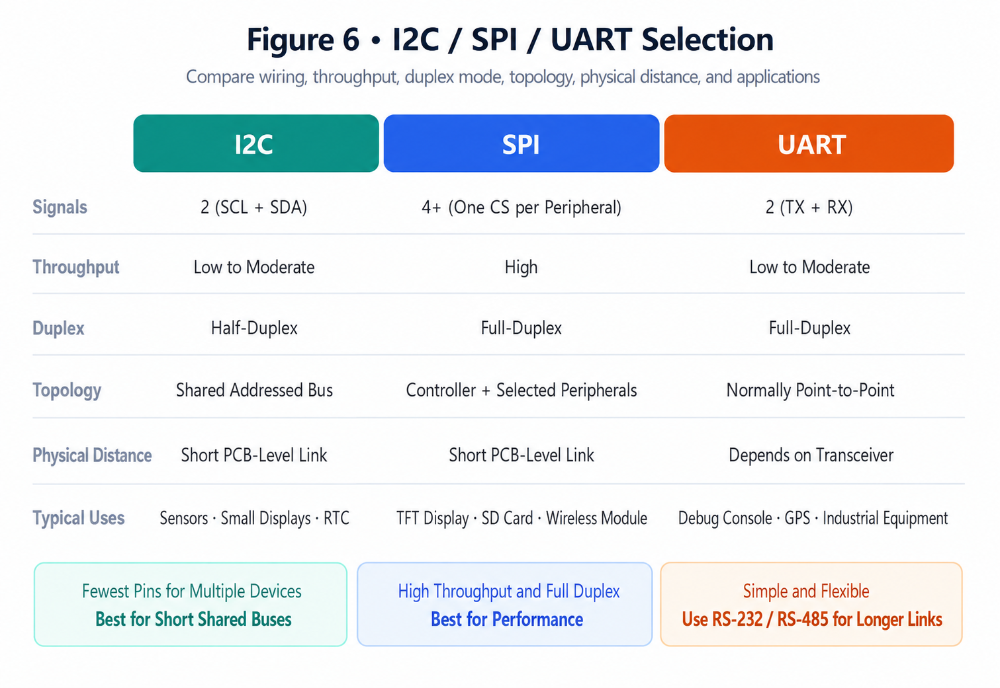

# I2C vs SPI vs UART: Communication and Selection Guide

!!! abstract "Quick answer"
    Use I2C when several low-speed peripherals must share two signal lines. Use SPI when short-distance, low-latency, full-duplex communication is more important than pin count. Use UART for simple asynchronous point-to-point communication. For longer distances or electrically noisy environments, pair UART with a suitable physical-layer transceiver such as RS-232 or RS-485.

## Key Takeaways

- I2C supports addressed devices on a shared two-wire bus but is sensitive to bus capacitance and pull-up design.
- SPI offers high throughput and deterministic timing, although each additional peripheral normally needs another chip-select signal.
- UART requires matching baud rate and frame settings; its practical distance depends primarily on the electrical transceiver and cabling.

I2C, SPI, and UART are among the most common communication methods in embedded electronics. They are not interchangeable: each uses a different clocking method, topology, framing model, and electrical implementation.

## I2C

I2C is a synchronous, addressed serial bus commonly used for sensors, EEPROMs, real-time clocks, touch controllers, and other relatively low-speed peripherals. It uses two open-drain signals: serial clock (`SCL`) and serial data (`SDA`). Both lines require pull-up resistors.

<figure markdown="span" class="displaywiki-figure">
  [{ width="760" loading="lazy" }](i2c-spi-uart-protocols-fig1-i2c-bus.png){ .displaywiki-image-link title="Open full-size image" }
  <figcaption>Figure 1. I2C bus topology: SCL and SDA are shared by multiple addressed devices and held high by pull-up resistors.</figcaption>
</figure>

<figure markdown="span" class="displaywiki-figure">
  [{ width="760" loading="lazy" }](i2c-spi-uart-protocols-fig2-i2c-frame.png){ .displaywiki-image-link title="Open full-size image" }
  <figcaption>Figure 2. Example I2C write transaction: START → address and write bit → ACK → data → ACK → STOP.</figcaption>
</figure>

### Advantages

- Multiple addressed devices can share the same two signal lines.
- Wiring and connector pin count are low.
- The bus is widely supported by microcontrollers and low-speed peripherals.

### Limitations

- Open-drain signaling and bus capacitance limit edge rate, frequency, and practical bus length.
- Pull-up resistance must suit the supply voltage, capacitance, speed, and sink-current limits.
- Address conflicts can occur when devices have fixed or overlapping addresses.
- Multi-controller arbitration and clock stretching require support from all relevant devices and drivers.

### Typical Applications

I2C is well suited to short PCB-level links involving temperature sensors, touch controllers, RTCs, configuration EEPROMs, battery-management ICs, and low-bandwidth display-control functions. It is usually a poor choice for high-volume pixel data or unbuffered off-board cabling.

## SPI

SPI is a synchronous serial interface commonly implemented with `SCLK`, controller output/peripheral input (`MOSI`), controller input/peripheral output (`MISO`), and one chip-select signal (`CS` or `SS`) per peripheral. Naming conventions differ across vendors, but the signal directions and timing must agree at both ends.

<figure markdown="span" class="displaywiki-figure">
  [{ width="760" loading="lazy" }](i2c-spi-uart-protocols-fig3-spi-wiring.png){ .displaywiki-image-link title="Open full-size image" }
  <figcaption>Figure 3. A conventional four-wire SPI link transfers data through opposing shift registers.</figcaption>
</figure>

### Advantages

- High throughput and low protocol overhead.
- Full-duplex transfer is possible when both data lines are used.
- Controller-driven timing is often straightforward to implement in hardware.

### Limitations

- More signal lines are required than for I2C, especially with several peripherals.
- SPI defines no universal connector, addressing method, maximum clock rate, or command protocol.
- Clock polarity, clock phase, bit order, word length, and maximum frequency must match the peripheral.
- It is normally intended for short PCB-level connections; longer wiring requires signal-integrity analysis or a suitable line driver.

### Typical Applications

SPI is commonly used for TFT display controllers, flash memory, SD cards, ADCs, DACs, and wireless modules when higher transfer rates or predictable latency are required.

## UART

A UART converts parallel data inside a processor or peripheral into an asynchronous serial bit stream. A basic full-duplex connection uses transmit (`TX`) and receive (`RX`) signals, crossed between the two devices, plus a common reference. Both endpoints must use compatible baud rate, data length, parity, and stop-bit settings.

A conventional UART frame contains one start bit, typically 5 to 9 data bits, an optional parity bit, and one or more stop bits. UART defines the framing logic, not the external voltage levels or cable interface.

<figure markdown="span" class="displaywiki-figure">
  [{ width="760" loading="lazy" }](i2c-spi-uart-protocols-fig4-uart-frame.png){ .displaywiki-image-link title="Open full-size image" }
  <figcaption>Figure 4. UART frame structure: start bit, data bits, optional parity, and stop bit or bits.</figcaption>
</figure>

<figure markdown="span" class="displaywiki-figure">
  [{ width="760" loading="lazy" }](i2c-spi-uart-protocols-fig5-uart-link.png){ .displaywiki-image-link title="Open full-size image" }
  <figcaption>Figure 5. UART point-to-point connection: TX connects to RX in each direction, with no shared clock line.</figcaption>
</figure>

### Advantages

- Simple point-to-point wiring and broad hardware support.
- No separate clock line is required.
- Full-duplex communication is possible with independent TX and RX signals.
- It can be combined with standardized transceivers for different electrical environments.

### Limitations

- Both endpoints must agree on baud rate and frame format.
- A basic UART link has no addressing, acknowledgment, or error-recovery protocol beyond optional parity.
- Logic-level UART is not inherently suitable for long cables or noisy environments.
- Point-to-point operation is the default; multidrop networks require an additional physical layer and protocol.

### Typical Applications

UART is widely used for debug consoles, bootloaders, GPS receivers, modems, Bluetooth modules, smart displays, and communication between microcontrollers. RS-232 transceivers add standardized single-ended voltage levels, while RS-485 transceivers provide differential signaling suitable for longer or multidrop links. Neither electrical standard should be confused with UART framing itself.

## Selection Comparison

<figure markdown="span" class="displaywiki-figure">
  [{ width="760" loading="lazy" }](i2c-spi-uart-protocols-fig6-protocol-compare.png){ .displaywiki-image-link title="Open full-size image" }
  <figcaption>Figure 6. I2C, SPI, and UART selection factors: wiring, throughput, duplex operation, topology, distance, and typical use.</figcaption>
</figure>

| Criterion | I2C | SPI | UART |
| --- | --- | --- | --- |
| Clocking | Synchronous, shared clock | Synchronous, controller-generated clock | Asynchronous |
| Typical signals | SCL, SDA | SCLK, MOSI, MISO, CS | TX, RX |
| Topology | Shared addressed bus | Controller with selected peripherals | Normally point-to-point |
| Duplex operation | Half-duplex on one data line | Full-duplex with MOSI and MISO | Full-duplex with TX and RX |
| Main strength | Low pin count with multiple devices | Throughput and deterministic timing | Simplicity and flexible physical layers |
| Main constraint | Capacitance, pull-ups, and address management | Pin count and device-specific timing | No native addressing or link-level recovery |

Choose according to the complete system rather than the protocol name alone:

- **Throughput and latency:** SPI is often the strongest choice for rapid transfers. I2C suits control and low-rate data. UART performance depends on baud rate and framing overhead.
- **Pin budget:** I2C connects several addressed devices with two signal lines. SPI normally needs a separate chip-select for each peripheral. UART uses two data signals for full duplex.
- **Distance and noise:** All three are commonly used at PCB level. Off-board use requires checking voltage levels, grounding, cable capacitance, termination, EMC, and the selected transceiver.
- **Software and device support:** Confirm controller capabilities, drivers, timing modes, addresses, and command protocols before selecting the interface.

## Frequently Asked Questions

??? question "Can I2C, SPI, and UART connect devices that use different supply voltages?"
    Not automatically. Check each device's input thresholds and absolute maximum ratings. Use a suitable level translator when the logic domains are incompatible; I2C requires a translator designed for open-drain, bidirectional signaling.

??? question "Why does an I2C bus become unreliable when more devices are added?"
    Additional devices and longer traces increase bus capacitance. The pull-up resistors may then produce rise times that violate the timing specification. Measure the waveform and recalculate the pull-ups for the required speed and sink current.

??? question "Do all SPI devices support the same clock mode?"
    No. The required CPOL, CPHA, maximum frequency, bit order, and chip-select timing are device-specific. Read the peripheral timing diagram before configuring the controller.

??? question "How far can a UART signal travel?"
    UART alone does not specify distance. A short logic-level connection may work on one board, while RS-232 or RS-485 transceivers and suitable cabling can support much longer links. Baud rate, cable, grounding, noise, and termination all matter.

??? question "Can several devices share one UART connection?"
    A conventional UART link is point-to-point. A multidrop network can be built with an appropriate physical layer such as RS-485 plus addressing, arbitration, and error handling in the higher-level protocol.

!!! info "Can't find what you need?"
    If you need more products, resources or support, please contact our team:

    [**:material-archive-arrow-down: Knowledge Base**](../../knowledge/tags.md){ .md-button .md-button--primary }
    [**:material-magnify: Products & Solutions**](https://viewedisplay.com/){ .md-button }
    [**:material-email: Contact Support**](mailto:support@viewedisplay.com){ .md-button }
