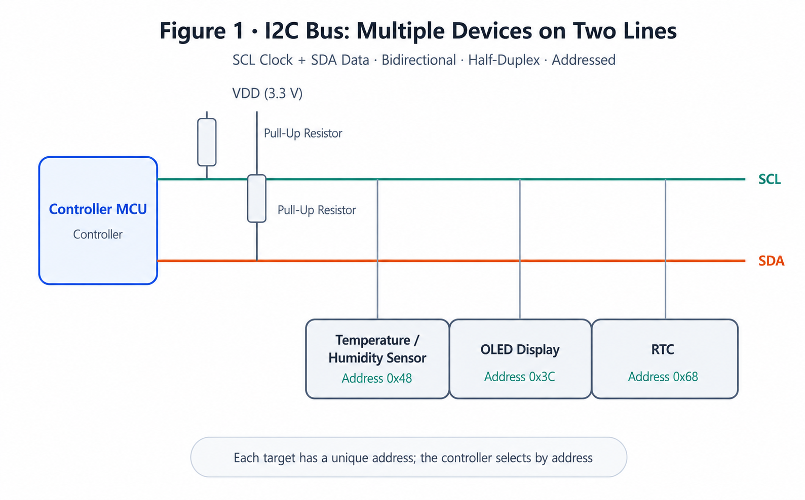
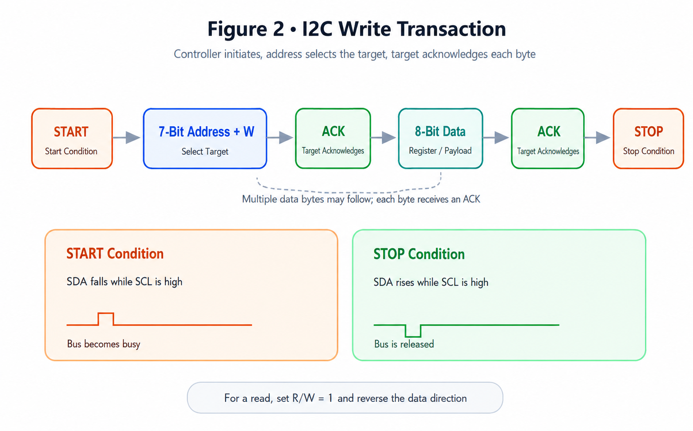
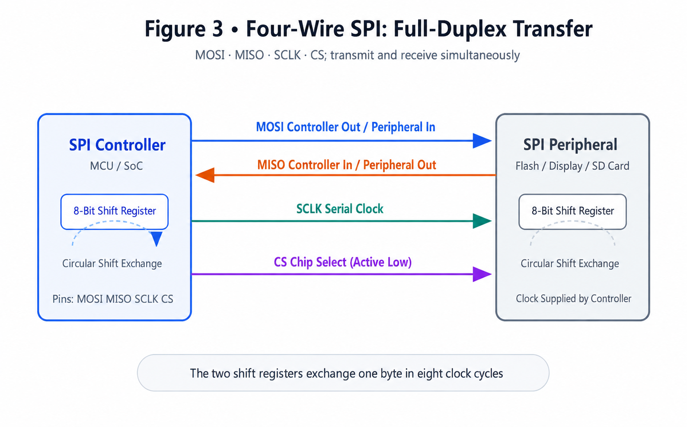
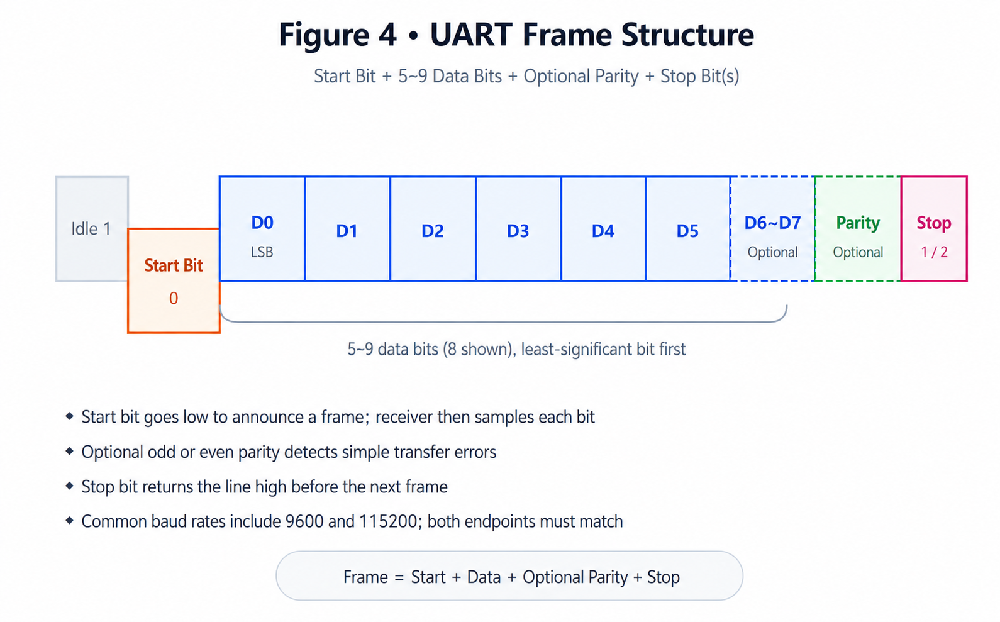
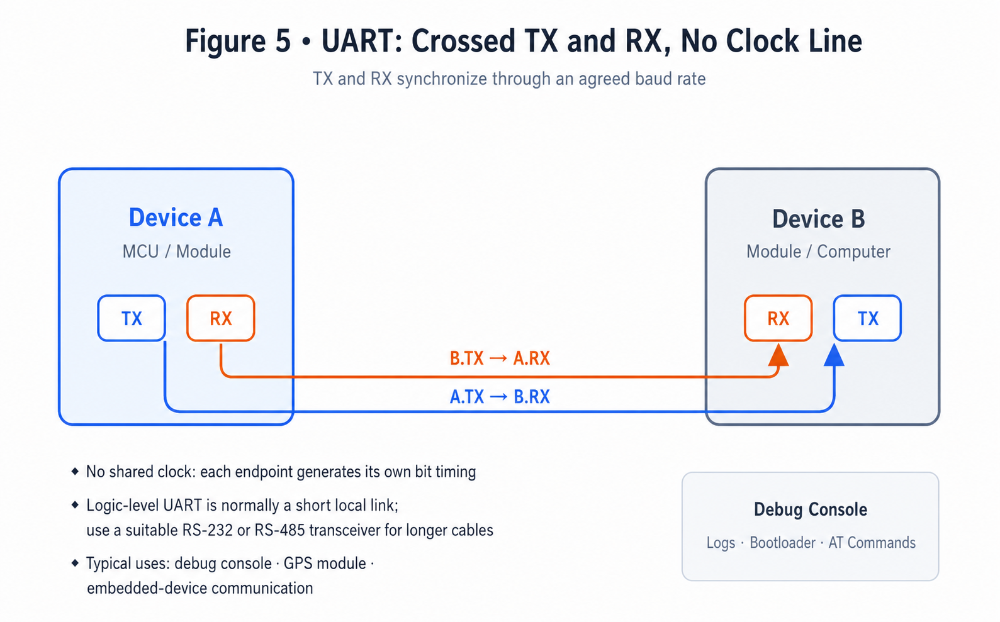
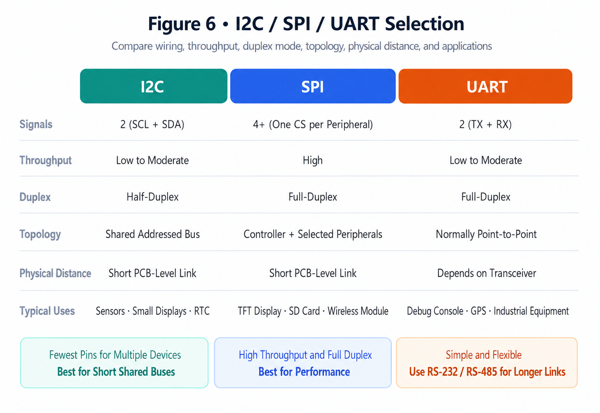

# I2C vs SPI vs UART: Communication and Selection Guide

!!! abstract "Quick answer"
    I2C manages multiple slave devices over two wires, which suits short-distance, low-speed scenarios; SPI is high-speed and full-duplex, built for fast transfer needs such as TFT panels and SD cards; UART is a two-wire asynchronous link with longer reach, ideal for debug consoles and module-to-module communication. A four-dimension selection comparison is included at the end.

I2C, SPI, and UART are the most commonly used communication protocols in embedded electronic devices. This article dissects the three protocols so you can clearly and intuitively understand what they do, their strengths, and their limitations.

## 1. The I2C Protocol

I2C is a serial communication protocol commonly used to connect low-speed devices such as sensors, memory, and other peripherals. It uses two wires (SCL and SDA) for bidirectional communication, and it is address-oriented with a master–slave model.

<figure markdown="span" class="displaywiki-figure">
  [{ width="760" loading="lazy" }](i2c-spi-uart-protocols-fig1-i2c-bus.png){ .displaywiki-image-link title="Open full-size image" }
  <figcaption>Figure 1. I2C bus structure: two wires (SCL / SDA) plus pull-up resistors, with multiple slave devices each hanging off a unique address</figcaption>
</figure>

<figure markdown="span" class="displaywiki-figure">
  [{ width="760" loading="lazy" }](i2c-spi-uart-protocols-fig2-i2c-frame.png){ .displaywiki-image-link title="Open full-size image" }
  <figcaption>Figure 2. One complete I2C transaction: START → address + W → ACK → data → ACK → STOP</figcaption>
</figure>

**Advantages**

- Multi-device support: I2C supports connecting multiple devices to the same bus, each with a unique address.
- Simple: the I2C protocol is relatively simple, easy to implement and debug.
- Low power: in the idle state, devices on an I2C bus can enter low-power modes to save energy.

**Limitations**

- Slow: I2C communication speed is comparatively low, so it suits low-speed devices.
- Constrained: I2C bus length and device count are limited; an overly long bus can lead to communication problems.
- Collisions: when multiple devices try to send data at the same time, collisions can occur, requiring additional collision detection and handling.

**Typical applications**

In terms of applications, I2C excels wherever simple and economical communication is needed. It is especially good at serving **small sensors, LCD panels, and RTC (real-time clock) modules**. In addition, thanks to its efficiency in compact circuits, I2C is useful in temperature-control equipment, battery-management systems, and LED controllers. For projects that need fast or long-distance data transfer, however, other protocols are the better choice.

## 2. The SPI Protocol

SPI (Serial Peripheral Interface) is known for its **high speed**, which makes it the first choice for fast communication. Unlike I2C, SPI works over four wires: MISO (master input, slave output), MOSI (master output, slave input), SCK (serial clock), and SS (slave select), and it allows full-duplex communication (sending and receiving at the same time). Despite being simple and fast, SPI needs more pins than I2C, which can be a factor to weigh in circuit design.

<figure markdown="span" class="displaywiki-figure">
  [{ width="760" loading="lazy" }](i2c-spi-uart-protocols-fig3-spi-wiring.png){ .displaywiki-image-link title="Open full-size image" }
  <figcaption>Figure 3. Four-wire full-duplex SPI: MOSI / MISO / SCK / SS with directions labeled; the shift registers on both sides exchange data in a ring</figcaption>
</figure>

**Advantages**

- High speed: SPI communication is fast, suited to applications with demanding speed requirements.
- Full duplex: SPI supports full-duplex communication, transmitting and receiving data at the same time.
- Simple: the SPI protocol is relatively simple, suited to rapid development and implementation.

**Limitations**

- Complex wiring: SPI requires several connecting wires, which can add hardware design complexity.
- Limited reach: SPI transmission distance is restricted; overly long lines can cause signal attenuation and interference.
- Master–slave constraint: SPI normally follows a master–slave model with a limited number of masters, so it does not suit multi-master scenarios.

**Typical applications**

SPI is a great fit where **fast, reliable data transfer** is needed, such as TFT displays, SD memory cards, and wireless communication modules. Its effectiveness drops, however, in complex systems with many slaves.

## 3. The UART Protocol

UART (Universal Asynchronous Receiver/Transmitter) is a serial communication protocol widely used for its **versatility and simplicity**. Unlike I2C and SPI, UART needs only two wires to operate: TX (transmit) and RX (receive). The protocol allows asynchronous communication, meaning no clock is shared between transmitter and receiver. Data is organized into packets, each containing one start bit, 5 to 9 data bits, an optional parity bit, and one or two stop bits.

<figure markdown="span" class="displaywiki-figure">
  [{ width="760" loading="lazy" }](i2c-spi-uart-protocols-fig4-uart-frame.png){ .displaywiki-image-link title="Open full-size image" }
  <figcaption>Figure 4. UART frame structure: start bit + data bits + optional parity bit + stop bits, labeled bit by bit</figcaption>
</figure>

<figure markdown="span" class="displaywiki-figure">
  [{ width="760" loading="lazy" }](i2c-spi-uart-protocols-fig5-uart-link.png){ .displaywiki-image-link title="Open full-size image" }
  <figcaption>Figure 5. Asynchronous UART crossover connection: TX→RX crossed wiring, no clock line; synchronization relies on the baud rate agreed by both sides</figcaption>
</figure>

**Advantages**

- Simple: the UART protocol is relatively simple, easy to implement and debug.
- Broad applicability: UART is widely used for communication between all kinds of devices and offers good compatibility.
- Distance: UART communicates over longer distances, suited to scenarios that need long-range transmission.

**Limitations**

- Lower speed: UART communication speed is relatively low, not suited to applications with high speed requirements.
- Duplex: UART communication is duplex — it can carry low-speed two-way transfers, sending and receiving data.
- Less reliable: because UART is asynchronous, it can be affected by noise and interference, making data transfer less reliable.

**Typical applications**

- **Links between microcontrollers and peripherals**: for simple, direct data exchange.
- **GPS modules and serial interfaces to computers**: for reliable, low-complexity communication.
- **Industrial machinery**: UART is commonly used in industrial equipment for stable communication.
- **RS standards (such as RS-232 and RS-485)**: these standards support longer-distance UART communication and, with suitable transceivers, make multi-slave networks possible, extending the flexibility and breadth of UART applications.

## 4. Choosing the Right Protocol for Your Project

<figure markdown="span" class="displaywiki-figure">
  [{ width="760" loading="lazy" }](i2c-spi-uart-protocols-fig6-protocol-compare.png){ .displaywiki-image-link title="Open full-size image" }
  <figcaption>Figure 6. Three-protocol selection comparison across six dimensions: wire count / speed / duplex / topology / distance / typical applications</figcaption>
</figure>

- **Communication speed**: SPI offers high speed, UART offers high flexibility, and I2C suits configurations with lower speed requirements and simple wiring.
- **Circuit design**: I2C enables efficient space management for multiple devices, SPI delivers performance in larger designs, and UART delivers simplicity and versatility.
- **Distance and communication environment**: UART stays stable over long distances, while I2C is better suited to short distances.
- **Duplex requirements**: SPI and UART provide full-duplex operation, while I2C is limited to half-duplex.

## 5. Conclusion

**I2C** stands out for its simplicity and its ability to manage multiple slave devices with a minimum of pins, making it ideal for short-distance configurations.

**SPI**, with its high speed and full-duplex mode, is a great fit for fast, efficient data transfer in systems where space is not the main concern.

**UART** is a strong all-rounder that excels in long-distance communication and configurations with modest speed requirements.

## 6. Frequently Asked Questions

??? question "Q1: What is the core difference between I2C, SPI, and UART?"
    I2C uses two wires (SCL / SDA) plus address-based addressing to hang multiple devices off the bus; it is relatively slow and half-duplex, and its advantage is saving pins. SPI uses four wires (MOSI / MISO / SCK / SS) for high-speed full-duplex transfer, but each additional slave usually costs one more chip select. UART uses only the two wires TX / RX for asynchronous point-to-point communication with no clock line, and it can reach fairly long distances. The core differences come down to four points: wire count, speed, duplex mode, and topology.

??? question "Q2: Which protocol should I choose to drive a TFT display?"
    Small, low-refresh-rate panels can use SPI — few wires and simple drivers make it the most common solution for small embedded displays. Medium-size panels, or panels that need a higher refresh rate, should favor SPI or RGB parallel. If the panel comes with its own controller and graphics acceleration (such as smart display modules), commands are often sent over UART or SPI, leaving the frame-refresh work to the on-panel controller. When selecting, confirm the panel's interface type together with the MCU's available peripherals and pin budget.

??? question "Q3: Why can I2C connect multiple devices with only two wires?"
    Because I2C is an address-addressed bus protocol: all slaves are wired in parallel across the SCL and SDA lines, and the master sends the target device's 7-bit address at the start of each transaction; only the slave whose address matches responds. Adding a device therefore needs no extra pins, as long as addresses do not conflict. The trade-off is that both bus length and device count are limited, and pull-up resistors are required to keep the lines high when idle.

??? question "Q4: How does the number of SPI chip-select signals affect circuit design?"
    SPI's clock and data lines can be shared among slaves, but each slave needs its own chip select (SS / CS) to be addressed. The more slaves, the more chip-select pins the master needs — the main reason SPI's pin overhead is high in multi-slave systems. Common mitigations are using a decoder to expand chip selects, or switching to daisy-chain or address-based schemes.

??? question "Q5: Without a clock line, how does UART ensure data is received correctly?"
    UART relies on a baud rate agreed in advance by both sides, each timing on its own. The sender starts at the falling edge of the start bit; the receiver detects the start bit and then samples each bit at the agreed bit time, resetting at the stop bit at the end of the frame. As long as both sides use the same baud rate with the error within tolerance, data is reconstructed correctly; once the baud rates mismatch or the clock error is too large, persistent garbled characters appear.

??? question "Q6: Which protocol should I choose for longer transmission distances?"
    Of the three, UART suits long-distance scenarios best. For wiring beyond the board level, RS-232 or RS-485 transceivers are commonly used to convert TTL levels into high-voltage or differential signals; RS-485 can reach the kilometer scale at suitable rates. I2C and SPI are both board-level buses — over long distances they easily suffer from capacitive loading and interference. If a long link is unavoidable, switch to a transceiver-based solution rather than directly extending the traces.

## Related reading

- [Display Interfaces Explained: MCU, RGB, LVDS, MIPI, SPI, and More](display-interface-guide.md)
- [ESP32-P4 for Multimedia and HMI Display Applications](esp32-p4-display.md)
- [ESP32-S3 Smart Weather Dashboard Tutorial](ESP32_S3_Smart_Weather_Dashboard_Tutorial.md)

!!! info "Can't find what you need?"
    If you need more products, resources or support, please contact our team:

    [**:material-archive-arrow-down: Knowledge Base**](../../knowledge/tags.md){ .md-button .md-button--primary }
    [**:material-magnify: Products & Solutions**](https://viewedisplay.com/){ .md-button }
    [**:material-email: Contact Support**](mailto:support@viewedisplay.com){ .md-button }
