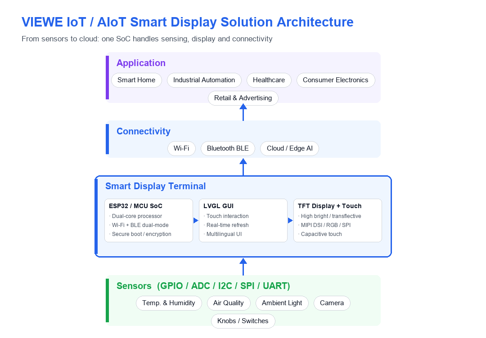

# IoT and AIoT Smart Display Solutions

!!! abstract "Quick answer"

    The VIEWE IoT Smart series is built on an ESP32 or equivalent MCU — a highly integrated Wi-Fi + Bluetooth dual-mode SoC that puts sensor acquisition, graphical UI display and network connectivity on a single chip. With its balance of performance, power efficiency and peripheral interfaces, it has become a mainstream choice for smart display devices. This post covers the solution architecture, target industries, advantages, and the complete design and validation workflow.

## Key Takeaways

- The core of the solution is a dual-mode SoC: it provides both Wi-Fi and Bluetooth connectivity while driving a TFT display and touch interaction.
- High integration simplifies system design: acquisition, display and connectivity are handled by a single chip, reducing external components and overall device cost.
- Rich peripheral interfaces (GPIO, ADC, DAC, I2C, SPI, UART) make it easy to connect a wide range of sensors and actuators.
- Hardware encryption, secure boot and flash encryption form the baseline security capability and are prerequisites for connecting IoT devices to the cloud.

## 1. Solution Overview

The VIEWE IoT Smart series, developed on an ESP32 or equivalent MCU, is a highly integrated Wi-Fi and Bluetooth dual-mode SoC (System on Chip) designed for IoT (Internet of Things) and AIoT (Artificial Intelligence of Things) applications. With strong performance, low power consumption and rich peripheral interfaces, these smart displays have become a popular choice for a wide range of smart-screen applications.

The value of the solution is that it consolidates three traditionally separate functions onto a single chip:

- **Sensing**: read sensor data through GPIO, ADC, I2C, SPI, UART and other interfaces.
- **Display**: drive a TFT display with touch, run a graphical user interface and refresh it in real time.
- **Connectivity**: communicate with the cloud, mobile phones or other devices over Wi-Fi or Bluetooth.

## 2. Solution Architecture

The diagram below shows the complete chain from the sensing layer to the application layer:

<figure markdown="span" class="displaywiki-figure">
  [{ width="760" loading="lazy" }](iot-aiot-display-architecture-en.png){ .displaywiki-image-link title="Open full-size image" }
  <figcaption>IoT / AIoT smart display solution architecture: the sensing layer connects temperature & humidity, air quality, ambient light, camera and knob devices via GPIO / ADC / I2C / SPI / UART; the smart display terminal consists of an ESP32 / MCU SoC, an LVGL graphical UI and a TFT display + touch; the connectivity layer provides Wi-Fi, Bluetooth BLE and cloud / edge AI capabilities; the application layer covers smart home, industrial automation, healthcare, consumer electronics, and retail & advertising.</figcaption>
</figure>

## 3. Key Application Industries

**1. Smart Home**

In the smart home sector, intuitive and interactive display interfaces are essential for monitoring and controlling home automation systems. VIEWE smart displays can show real-time data from various sensors (temperature, humidity, air quality, etc.) and allow users to control devices such as lights, thermostats and security systems via a touch screen or voice commands.

**2. Industrial Automation**

Industrial environments require stable and reliable systems for monitoring machinery and processes. VIEWE IoT smart displays can show sensor data, equipment status and operating parameters, while their connectivity enables real-time communication with other industrial systems and remote monitoring.

**3. Healthcare**

In healthcare applications, the devices can present critical information such as patient vital signs, medical records and treatment schedules. Displays integrated into medical devices give healthcare providers instant access to important data, improving both quality of care and operational efficiency.

**4. Consumer Electronics**

Smartwatches, fitness trackers and other wearable devices benefit from the compact and efficient MCU/SoC: they can display real-time health metrics, notifications and interactive interfaces, while low power consumption guarantees battery life — critical for portable devices.

**5. Retail and Advertising**

In retail and advertising, dynamic and interactive displays can boost customer engagement and deliver personalized shopping experiences. Devices can show tailored promotional content, product information and broadcast messages based on customer preferences and behavior.

## 4. Solution Advantages

1. **High integration**: Wi-Fi, Bluetooth and dual-core processing are integrated on one chip, providing a complete solution for connectivity and computation, simplifying design and reducing total system cost.
2. **Low power consumption**: energy efficiency is a design priority, with multiple low-power modes — crucial for battery-operated devices, extending run time without frequent recharging.
3. **Versatile connectivity**: built-in Wi-Fi and Bluetooth allow seamless integration with a wide range of IoT devices and networks.
4. **Rich peripheral interfaces**: GPIO, ADC, DAC, I2C, SPI, UART and other interfaces make it easy to integrate sensors, displays and other components for different applications.
5. **Real-time processing**: the dual-core processor together with a real-time operating system such as FreeRTOS handles complex tasks and real-time data efficiently.
6. **Security features**: hardware encryption, secure boot and flash encryption protect data and secure communication, helping devices and networks withstand potential threats.
7. **Cost effectiveness**: a high-performance solution at a competitive price, making it an economical choice for developing smart display devices.
8. **Mature community and ecosystem**: an active developer community with comprehensive documentation, libraries and development tools accelerates development and troubleshooting, shortening time to market.
9. **AI capabilities**: capable of basic AI tasks such as voice recognition and image processing. Local inference improves responsiveness and reduces latency compared with purely cloud-based solutions, which is particularly valuable for AIoT applications.

## 5. Design and Testing Process

Designing and testing an IoT / AIoT smart display solution requires a systematic approach to ensure effective hardware–software integration and complete functional validation.

### 5.1 Design Process

**1) Requirements Analysis**

- User requirements: identify application scenarios (such as smart home, industrial automation, etc.) and gather specific requirements for functionality, performance and interfaces.
- Technical requirements: define system-level specifications including hardware, communication protocols, power consumption and security.

**2) Concept Design**

- System architecture: draw the system architecture diagram and define the connections between the smart display, the main board, sensors and interface modules.
- Functional modules: partition the design into data acquisition, data processing, user interface and communication modules.

**3) Hardware Design**

- Schematic design: use EDA tools to create schematics and determine the connections between electronic components.
- Circuit design: design the PCB layout based on the schematics, paying attention to signal integrity, power distribution and thermal management.
- Component selection: choose displays, sensors, storage and power management modules that meet the requirements.

**4) Software Design**

- Operating system: select and configure a suitable real-time operating system (such as FreeRTOS).
- Driver development: write drivers for peripherals, covering UART, I2C, SPI and other interfaces.
- Application development: design the user interface, develop data processing and communication modules, and implement the application functions.
- Security design: integrate data encryption, authentication and secure communication.

**5) Prototyping**

- Hardware prototype: build prototype hardware and run preliminary tests to verify the correctness and performance of the hardware design.
- Software prototype: deploy the software on the hardware prototype and perform initial functional testing.

### 5.2 Testing Process

**1) Unit Testing**: test individual hardware components (display, sensors, interface modules) for function and performance; unit-test the software modules with simulators or real hardware to verify each module's independent functionality and stability.

**2) Integration Testing**: integrate all hardware components and verify overall system function and performance to ensure all parts work together; run the complete software system on real hardware to verify interactions and data flow between modules.

**3) System Testing**

- Functional testing: fully verify that system functions meet user requirements and technical specifications.
- Performance testing: test response time, data throughput and power consumption under different loads.
- Reliability testing: run long-duration tests to verify stability and reliability.
- Compatibility testing: verify compatibility with other devices and systems to ensure correct operation in different environments.

**4) User-Experience Testing**: invite target users for experience testing, collect feedback and evaluate interface usability and system practicality, then improve and optimize accordingly.

**5) Security Testing**

- Vulnerability scanning: use security tools to detect vulnerabilities and weaknesses in the system.
- Penetration testing: simulate attacker behavior to evaluate the system's defenses.
- Security audit: review code and system configuration to ensure compliance with security standards and best practices.

**6) Acceptance Testing**: perform final verification to confirm that all functions and performance indicators meet the design requirements; prepare test reports and user manuals documenting the results and providing operation guidelines.

### 5.3 Deployment and Maintenance

- **Deployment**: install the devices on site and complete commissioning to ensure the system runs correctly; provide operation training for users.
- **Maintenance**: provide remote technical support, carry out regular system checks and maintenance, and update software versions and security patches promptly; respond to faults quickly to minimize downtime.

Following the process above ensures that the smart display solution achieves the expected quality and reliability and meets the needs of a wide range of application scenarios.

## 6. Selection Considerations

- **Confirm connectivity needs**: for scenarios that require Wi-Fi and Bluetooth simultaneously, choose a dual-mode SoC first; if only wired communication is needed, a lower-cost option may be considered.
- **Check display specifications**: clarify resolution, refresh rate and interface type (RGB, SPI, MIPI DSI, etc.), and confirm that the SoC's display driver capability matches.
- **Evaluate peripheral resources**: count the GPIO, ADC, I2C, SPI and UART usage according to the number of sensors and actuators, and reserve margin for debugging and expansion.
- **Work out the power budget**: for battery-powered devices, evaluate the wake-up time and average power consumption of each low-power mode.
- **Confirm security requirements**: for scenarios that upload data to the cloud, verify that secure boot, flash encryption and secure communication meet the requirements.
- **Assess AI compute**: if local voice or image processing is needed, confirm in advance that compute, memory and model size are a match.

## 7. Frequently Asked Questions

??? question "Q1: What application scenarios suit IoT smart display solutions?"
    Typical scenarios include smart home control hubs and panels, industrial HMIs and equipment status displays, patient information terminals on medical devices, wearables, and interactive displays in retail and advertising. The test is simple: the device needs both local display interaction and network connectivity, under clear constraints on power consumption, size or cost.

??? question "Q2: Why choose a SoC such as the ESP32 instead of an MCU plus a separate Wi-Fi module?"
    High integration is the core reason. A dual-mode SoC such as the ESP32 integrates processing, Wi-Fi, Bluetooth and display driving on a single chip, reducing the number of external components and PCB area, lowering system cost and design complexity, and avoiding the interface and co-design issues between an MCU and a separate communication module.

??? question "Q3: How should edge AI and cloud AI divide the work?"
    Tasks with demanding real-time requirements, sensitive data or unstable networks belong on the device (such as wake-word recognition or simple image judgments); tasks that need large models, complex reasoning or cross-device data aggregation belong in the cloud. Local inference significantly reduces latency, while the cloud provides stronger compute and a more complete view of the data.

??? question "Q4: How do you secure communication for IoT display devices?"
    The baseline capabilities are hardware encryption, secure boot and flash encryption: secure boot ensures the firmware has not been tampered with, flash encryption protects sensitive data in storage, and hardware encryption accelerates secure communication. On top of that, handle authentication, data encryption and signed firmware updates at the application layer, and complete vulnerability scanning and penetration testing during development.

??? question "Q5: Where do the low-power benefits come from?"
    First, the SoC itself supports multiple low-power modes, so it can sleep when idle and wake on events. Second, the high integration reduces the static power drawn by external components. Third, on the display side, high-brightness or transflective solutions can reduce backlight power. For battery devices, average power consumption and wake-up time must be budgeted together.

??? question "Q6: Which interface resources matter when developing this kind of solution?"
    On the acquisition side, I2C, SPI, ADC and GPIO are commonly used to connect temperature & humidity, air quality, ambient light and knob devices; on the display side, choose RGB, SPI or MIPI DSI according to resolution and refresh rate; on the communication side, rely on the SoC's built-in Wi-Fi and Bluetooth. When designing, count the usage of each interface and reserve margin for debugging and expansion.

## Related reading

- [Custom and Sunlight-Readable Display Solutions](custom-sunlight-readable-displays.md)
- [High-Reliability Display Solutions](high-reliability-displays.md)
- [UART Smart Display Solutions](uart-smart-display.md)

!!! info "Can't find what you need?"
    If you need more products, resources or support, please contact our team:

    [**:material-archive-arrow-down: Knowledge Base**](../../knowledge/tags.md){ .md-button .md-button--primary }
    [**:material-magnify: Products & Solutions**](https://viewedisplay.com/){ .md-button }
    [**:material-email: Contact Support**](mailto:support@viewedisplay.com){ .md-button }
