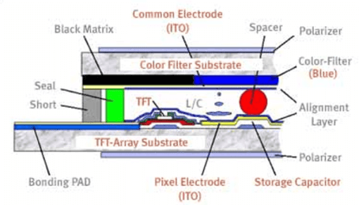
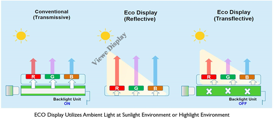
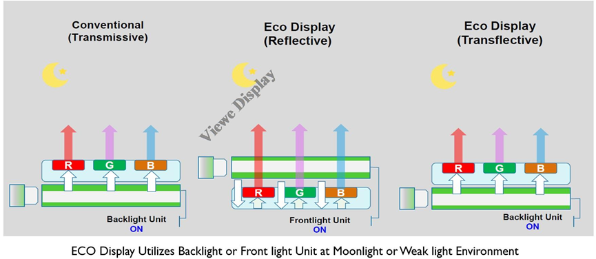

# LCD Basics: How Liquid Crystal Displays Work

!!! abstract "Quick answer"
    This guide explains how LCD displays work, the relevant design trade-offs, and the points engineers should verify when selecting a display solution.

## Key Takeaways

- Learn how LCD displays work, key trade-offs, applications, and engineering selection criteria.
- Use the guidance below to compare the relevant technologies and design trade-offs.
- Validate optical, electrical, mechanical, environmental, and production requirements before final selection.

## LCD

LCD is a flat panel display technology commonly used in TVs and computer monitors. It is also used in screens for mobile devices, such as laptops, tablets, and smartphones.

LCD displays don’t just look different from bulky CRT (Cathode Ray Tube) monitors, the way they operate is significantly different as well. Instead of firing electrons at a glass screen, an LCD has a backlight that provides light source to individual pixels arranged in a rectangular grid. Each pixel has a RGB (Red, Green, and Blue) sub-pixel that can be turned on or off. When all of a pixel’s sub-pixels are turned off, it appears black.

When all the sub-pixels are turned on 100%, it appears white. By adjusting the individual levels of red, green, and blue light, millions of color combinations are obtained.

How LCDs are Constructed

An LCD screen includes a thin layer of liquid crystal material sandwiched between two electrodes on glass substrates, with two polarizers on each side. A polarizer is an optical filter that lets light waves of a specific polarization pass through while blocking light waves of other polarizations. The electrodes need to be transparent, so the most popular material is ITO (Indium Tin Oxide).

As LCD can’t emit light itself, normally a backlight is placed behind an LCD screen in order to be seen during the dark environment. The light sources for backlight can be LED (Light Emitting Diode) or CCFL (Cold Cathode Fluorescent Lamps). The LED backlight is most popular.  Of course, if you like to have a color display, a layer of color filter can be made into an LCD panel. The color filter consists of RGB color. You can also add a touch panel in front of an LCD.

### Advantages

<figure markdown="span" class="displaywiki-figure">
  [{ width="760" loading="lazy" }](lcd-basics-lcd-display-structure.png){ .displaywiki-image-link title="Open full-size image" }
  <figcaption>LCD Display Structure</figcaption>
</figure>

- Fig. 1 LCD Display Structure

- How LCDs Work?

The first LCD panel technology in mass production is called TN (Twisted Nematic). The principle behind the LCDs is that when an electrical field is not applied to the liquid crystal molecules, the molecules twist 90 degrees in the LCD panel. When the light either from ambient light or from the backlight passes through the first polarizer, the light is polarized and twisted with the liquid crystal molecular layer. When it reaches the second polarizer, it is blocked. The viewer sees the display is black.

When an electric field is applied to the liquid crystal molecules, they are untwisted.  When the polarized light reaches the layer of liquid crystal molecules, the light passes straight through without being twisted. When it reaches the second polarizer, it will also pass through, the viewer sees the display is bright.

- Because LCD technology uses electric fields instead of electric current (electron passes through), it has low power consumption.

<figure markdown="span" class="displaywiki-figure">
  [{ width="760" loading="lazy" }](lcd-basics-how-lcds-work.png){ .displaywiki-image-link title="Open full-size image" }
  <figcaption>How LCDs work</figcaption>
</figure>

- Fig. 2 How LCDs work

- The Basics of LCD Displays

The most basic LCD introduced above is called passive matrix LCDs which can be found mostly in low end or simple applications like, calculators, utility meters, early time digital watches, alarm clocks etc.  Passive matrix LCDs have a lot of limitations, like the narrow viewing angle, slow response speed, dim, but it is great for power consumption.

In order to improve upon the drawbacks, scientists and engineers developed active matrix LCD technology.  The most widely used is TFT (Thin Film Transistor) LCD technology.  Based on TFT LCD, even more modern LCD technologies are developed. The best known is IPS (In Plane Switching) LCD.  It has super wide viewing angle, superior image picture quality, fast response, great contrast, less burn-in defects etc.

IPS LCDs are widely used in LCD monitors, LCD TVs, Iphone, pads etc. Samsung even revolutionized the LED backlighting to be QLED (quantum dot) to switch off LEDs wherever light is not needed to produce deeper blacks.

<figure markdown="span" class="displaywiki-figure">
  [{ width="760" loading="lazy" }](lcd-basics-active-tft-color-display.png){ .displaywiki-image-link title="Open full-size image" }
  <figcaption>Active TFT Color Display</figcaption>
</figure>

- Fig. 3 Active TFT Color Display

- Different Types of LCD

- Classify by drive mode:

– Passive and Active Matrix Displays: The Passive-matrix type LCDs works with a simple grid so that charge can be supplied to a specific pixel on the LCD. One glass layer gives columns whereas the other one gives rows that are designed by using a clear conductive material like indium-tin-oxide. The passive-matrix system has major drawbacks particularly response time is slow & inaccurate voltage control. The response time of the display mainly refers to the capability of the display to refresh the displayed image.

– Active-matrix type LCDs mainly depend on TFT (thin-film transistors). These transistors are small switching transistors as well as capacitors which are placed within a matrix over a glass substrate. When the proper row is activated then a charge can be transmitted down the exact column so that a specific pixel can be addressed, because all of the additional rows that the column intersects are switched OFF, simply the capacitor next to the designated pixel gets a charge.

- Classify by liquid crystal mode:

Twisted Nematic Display (TN):  The TN (Twisted Nematic) LCDs production can be done most frequently and used different kinds of displays all over the industries. These displays are most frequently used by gamers as they are cheap & have quick response time as compared with other displays. The main disadvantage of these displays is that they have low quality as well as partial contrast ratios, viewing angles & reproduction of color. But, these devices are sufficient for daily operations. And STN/CSTN/FSTN/DSTN are types of TN.

In-Plane Switching Display(IPS):  IPS displays are considered to be the best LCD because they provide good image quality, higher viewing angles, vibrant color precision & difference. These displays are mostly used by graphic designers & in some other applications, LCDs need the maximum potential standards for the reproduction of image & color.

Vertical Alignment Panel(VA/MVA): The vertical alignment (VA) panels drop anywhere in the center among Twisted Nematic and in-plane switching panel technology. These panels have the best viewing angles as well as color reproduction with higher quality features as compared with TN type displays. These panels have a low response time. But, these are much more reasonable and appropriate for daily use.

The structure of this panel generates deeper blacks as well as better colors as compared with the twisted nematic display. And several crystal alignments can permit for better viewing angles as compared with TN type displays. These displays arrive with a tradeoff because they are expensive as compared with other displays. And also they have slow response times & low refresh rates.

Advanced Fringe Field Switching (AFFS):  AFFS LCDs offer the best performance & a wide range of color reproduction as compared with IPS displays. The applications of AFFS are very advanced because they can reduce the distortion of color without compromising on the broad viewing angle. Usually, this display is used in highly advanced as well as professional surroundings like in the viable airplane cockpits.

- Classify by lighting method:

Liquid Crystal Displays (LCDs) are widely used in electronic devices for all kinds of industries. They are typically divided into three display types based on their light transmission modes. The three main types of LCD modes are transmissive, reflective, and transflective. The main difference is how they use light to illuminate the pixels in the display.

Transmissive : Transmissive displays rely on a backlight to be visible. For this kind of display, light emitting from the back of the display glass must pass through the LCD towards the front to light the pixels. Transmissive LCDs are suitable in low-light environments since they rely on a backlight to be visible. These displays are also used in applications where high-resolution images, videos, and high quality are important, which is why you will commonly find TFT displays with a transmissive display mode.

Reflective: Reflective displays rely on bright ambient light to be visible. There is no backlight source inside this kind of display; instead, light is reflected from the surrounding environment for the pixels to be visible.

Transflective: Transflective displays combine backlighting and ambient light reflection to illuminate the pixels, resulting in a display with both transmissive and reflective properties.

<figure markdown="span" class="displaywiki-figure">
  [{ width="760" loading="lazy" }](lcd-basics-advantages.png){ .displaywiki-image-link title="Open full-size image" }
  <figcaption>Advantages</figcaption>
</figure>

<figure markdown="span" class="displaywiki-figure">
  [{ width="760" loading="lazy" }](lcd-basics-advantages-2.png){ .displaywiki-image-link title="Open full-size image" }
  <figcaption>Advantages</figcaption>
</figure>

LCD technologies have great advantages of light, thin, low power consumption which made wall TVs, laptops, smartphones, pad possible. On its way to progress, it wiped out the competition of many display technologies. We don’t see CRT monitors on our desks and plasma displays TV at our home anymore. LCD Technologies dominant the display market now. But any technology has the limitations.

LCD technologies have slow response times especially at low temperature, limited viewing angles, backlighting is needed. Focus on LCD drawbacks, OLED (Organic Light Emitting Diodes) technology was developed. Some high-end TV and mobile phones start to use AMOLED (Active Matrix Organic Light Emitting Diodes) displays.

## Related reading

- [TFT LCD Basics: Structure, Operation, and Benefits](tft-lcd-basics.md)
- [TFT LCD Module Components and Construction](tft-lcd-module.md)
- [How to Read Display Specifications](display-specifications.md)
