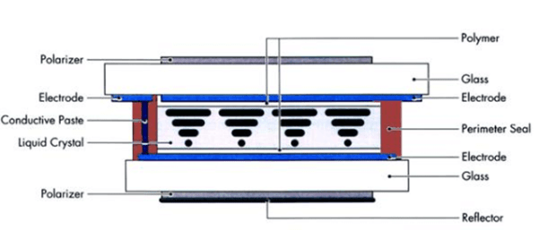
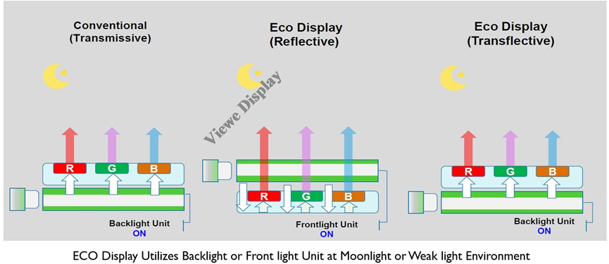

# LCD Basics: How Liquid Crystal Displays Work

!!! abstract "Quick answer"
    An LCD does not emit light itself; it is an electrically controlled light valve. Two polarizers with orthogonal transmission axes sandwich a layer of liquid crystal, and an electric field changes how the liquid-crystal molecules are aligned, which controls the brightness of every pixel. Most selection decisions come down to three layers: the **driving method** (passive matrix / active matrix), the **liquid-crystal mode** (TN / IPS / VA / AFFS), and the **lighting method** (transmissive / reflective / transflective).

## Key Takeaways

- **Image formation**: two orthogonal polarizers plus a field-controlled, twisted liquid-crystal layer together decide the brightness of every pixel; color comes from color filters.
- **Driving method**: a passive matrix is simple and suits calculators, meters, and other low-end uses; an active matrix (TFT) gives every pixel its own switching transistor and is today's mainstream.
- **Liquid-crystal mode**: TN is fast and cheap, IPS has the best viewing angle and color, VA has the highest contrast, and AFFS targets high-end applications.
- **Lighting method**: transmissive suits indoors, reflective suits bright outdoor light, and transflective combines both — the key fork in the road for outdoor industrial selection.

## 1. What an LCD Is

A liquid-crystal display (LCD) is a flat panel display technology. Early on it was used mainly in TVs and desktop monitors, and today it also appears widely in laptops, tablets, and smartphones.

Its difference from a CRT (cathode ray tube) monitor is more than skin deep. A CRT fires an electron beam at phosphors to make them glow; an LCD emits no electrons. Instead, it uses a backlight as the light source and switches that light on and off through pixels arranged in a rectangular grid.

Each pixel consists of three sub-pixels — R, G, and B — each of which can be turned on or off. When all three sub-pixels of a pixel are off, it appears black; when all three are fully on, it appears white. Adjusting the intensity ratio of the three produces millions of colors.

## 2. Structure of an LCD Screen

The core of an LCD screen is a very thin layer of liquid-crystal material sandwiched between electrodes on upper and lower glass substrates. On the outer side of each glass sits a polarizer, and together the two form a polarizer pair.

A polarizer is an optical filter that lets light waves of one specific polarization direction pass while blocking light waves of all other polarizations.

The electrodes must be transparent, so the most common material is ITO (indium tin oxide).

Because liquid crystal emits no light itself, a backlight is usually placed behind the panel so the image remains visible in a dark environment. The backlight source can be an LED or a CCFL (cold cathode fluorescent lamp); LED backlights are now the absolute mainstream.

For color display, a color filter is added on top of the liquid-crystal cell.

<figure markdown="span" class="displaywiki-figure">
  [{ width="760" loading="lazy" }](lcd-basics-lcd-display-structure.png){ .displaywiki-image-link title="Open full-size image" }
  <figcaption>Figure 1 Cross-section of an LCD panel: the liquid-crystal layer sits between upper and lower glass substrates, with a polarizer on each side.</figcaption>
</figure>

## 3. How an LCD Screen Works

The first liquid-crystal panel technology to reach mass production was TN (twisted nematic). Its principle can be summed up in one sentence: **use an electric field to control whether the liquid crystal twists the polarization of light**.

The transmission axes of the upper and lower polarizers are orthogonal. With no voltage applied, the liquid-crystal molecules naturally twist by 90 degrees from top to bottom. Linearly polarized light that passes the first polarizer is rotated by the same 90 degrees, so its polarization direction ends up aligned with the transmission axis of the second polarizer — the light passes through, and the pixel is bright.

When a voltage is applied, the liquid-crystal molecules stand up along the field and no longer rotate the polarization. By the time the light reaches the second polarizer, its polarization is perpendicular to the transmission axis and is completely blocked, so the pixel turns dark.

This is how an electrically controlled light valve works: **voltage changes the alignment of the molecules, the alignment decides whether light passes, and that decides whether the pixel is bright or dark.**

In addition, an LCD is driven by electric fields rather than current — no electrons travel through the material — so its power consumption is very low.

<figure markdown="span" class="displaywiki-figure">
  [{ width="760" loading="lazy" }](lcd-basics-how-lcds-work.png){ .displaywiki-image-link title="Open full-size image" }
  <figcaption>Figure 2 The light-valve principle of TN liquid crystal: with no voltage the molecules twist the polarization of the light; with a voltage applied they stand up and block it.</figcaption>
</figure>

## 4. Passive Matrix and Active Matrix

The most basic structure described above is called a **passive matrix** LCD. It appears mostly in low-end or simple applications such as calculators, utility meters, early digital watches, and alarm clocks.

The limitations of a passive matrix are obvious: narrow viewing angle, slow response, and low contrast.

To overcome these drawbacks, engineers developed **active matrix** technology, the most widely used form of which is TFT (thin-film transistor) LCD.

On the foundation of TFT LCD, more modern liquid-crystal technologies followed, the best known being IPS (in-plane switching): ultra-wide viewing angle, good image quality, fast response, high contrast, and little susceptibility to burn-in.

LCD monitors, LCD TVs, the iPhone, and the iPad all use IPS liquid-crystal panels. Samsung also reworked the LED backlight with QLED (quantum dot), switching off the backlight wherever light is not needed to obtain deeper blacks.

<figure markdown="span" class="displaywiki-figure">
  [{ width="760" loading="lazy" }](lcd-basics-active-tft-color-display.png){ .displaywiki-image-link title="Open full-size image" }
  <figcaption>Figure 3 Structure of an active-matrix TFT color panel: every pixel has its own thin-film transistor and storage capacitor, with a color filter stacked above.</figcaption>
</figure>

## 5. LCD Classification

### 5.1 By driving method: passive matrix and active matrix

A **passive matrix** addresses pixels with a simple electrode grid. One glass layer provides the column electrodes and the other the row electrodes, made of a transparent conductor such as ITO; the liquid crystal is charged by the voltage at each row–column crossing. Its drawbacks are slow response and imprecise voltage control, which easily produces cross-talk.

An **active matrix** gives every pixel a TFT switch and a storage capacitor, laid out as a matrix on the glass substrate. When a given row is selected, charge can travel down the corresponding column to the intended pixel while all other rows stay off. Every pixel is therefore controlled independently and stably — the fundamental reason a TFT LCD can deliver high resolution and high contrast.

### 5.2 By liquid-crystal mode: TN, IPS, VA, and AFFS

**TN (twisted nematic)**: the highest production volume and the lowest cost, with fast response — a common choice for gamers. Its main weakness is mediocre image quality: contrast, viewing angle, and color reproduction are all weak, though it is perfectly adequate for everyday use. STN, CSTN, FSTN, and DSTN all belong to the TN family.

**IPS (in-plane switching)**: the best all-around image quality of the group, with a wide viewing angle and accurate color; common in graphic design and other color-critical scenarios. Reaching that color accuracy usually demands a stronger backlight, so cost is higher too.

**VA / MVA (vertical alignment)**: positioned between TN and IPS. Contrast is high, blacks are deeper, color reproduction beats TN, and the viewing angle is better than TN's, but response time is slower and refresh rate lower; the price is usually below IPS.

**AFFS (advanced fringe field switching)**: beats IPS on viewing angle and color reproduction, and is used where requirements are demanding.

### 5.3 By lighting method: transmissive, reflective, and transflective

LCDs divide into three types by how the pixels are illuminated. The differences are most obvious in strong light and in dim light:

<figure markdown="span" class="displaywiki-figure">
  [{ width="760" loading="lazy" }](lcd-basics-advantages.png){ .displaywiki-image-link title="Open full-size image" }
  <figcaption>Figure 4 How transmissive, reflective, and transflective displays differ in strong ambient light.</figcaption>
</figure>

<figure markdown="span" class="displaywiki-figure">
  [{ width="760" loading="lazy" }](lcd-basics-advantages-2.png){ .displaywiki-image-link title="Open full-size image" }
  <figcaption>Figure 5 How transmissive, reflective, and transflective displays differ in weak ambient light.</figcaption>
</figure>

**Transmissive**: relies entirely on the backlight. Light from behind the panel passes through the liquid-crystal layer to illuminate the pixels. It suits dim or indoor environments as well as image-quality applications such as high-resolution pictures and video; most TFT displays on the market are transmissive.

**Reflective**: has no backlight and forms the image from reflected ambient light. The brighter the surroundings, the clearer the picture — but it cannot be read in the dark.

**Transflective**: combines the two, passing backlight while also reflecting ambient light. It uses the backlight indoors and ambient light in strong sunshine, making it a common solution for outdoor industrial control and handheld devices.

## 6. Benefits and Limitations

The three great advantages of LCD are that it is light, thin, and low in power consumption. These made wall-mounted TVs, laptops, smartphones, and tablets possible, and along the way LCD outcompeted most rival technologies — CRT monitors have all but vanished from our desks.

But every technology has limits. LCD response time is on the slow side, especially at low temperature; the viewing angle is limited; and a backlight is indispensable.

To break through these limits, OLED (organic light-emitting diode) technology was developed, and high-end TVs and phones have begun adopting AMOLED.

!!! warning "Mass-production note"
    In mass production or harsh conditions (high/low temperature, humidity, vibration, ESD), check the datasheet curves of the relevant parameters; exceeding the specified range significantly shortens lifetime.

## 7. Selection Checklist

Tie the three layers above together and selection can proceed in this order:

1. **Fix the lighting method first**: transmissive for fixed indoor installations; reflective or transflective for bright outdoor light. This step affects readability the most and is the easiest to overlook.
2. **Then fix the liquid-crystal mode**: TN for response speed and cost, IPS for viewing angle and color, VA for contrast and black level, and AFFS for high-end designs.
3. **Confirm the driving method**: high resolution and high image quality require an active matrix (TFT); consider a passive matrix only for character-type, low-resolution, extremely cost-sensitive scenarios.
4. **Finally check the operating conditions**: low-temperature response, backlight lifetime, humidity, and vibration must all be confirmed against the datasheet curves of the specific model.

## 8. Frequently Asked Questions

??? question "Q1: How do I choose between LCD and OLED?"
    An LCD forms its image with a backlight plus a liquid-crystal light valve, whereas OLED lets every pixel emit its own light. LCD lasts longer, costs less, scales to large sizes more easily, and has no burn-in; OLED offers higher contrast, a wider viewing angle, and flexible form factors. In industrial scenarios where a fixed image is shown for long periods, prefer LCD, and consider OLED only when extreme black level or a flexible form is required.

??? question "Q2: How do I choose among the TN, IPS, and VA liquid-crystal modes?"
    TN is the fastest and cheapest but has a narrow viewing angle and mediocre color, suiting cost-driven and competitive gaming scenarios; IPS has the widest viewing angle and the most accurate color, suiting multi-viewer or color-critical settings; VA has the highest contrast and the deepest blacks but slower response, suiting applications that value static image quality and black level. Outdoor or industrial displays also need the lighting method factored in.

??? question "Q3: Why must an LCD have a backlight, while a reflective display does not?"
    Liquid crystal only changes the polarization state of light; it emits nothing itself. A transmissive display relies on the backlight as its light source, so it is readable only in a dark environment with the backlight on; a reflective display forms its image from ambient light and needs no backlight, but cannot be read in the dark. The transflective type combines the two.

??? question "Q4: Why is a transflective display better suited to outdoor use?"
    A transflective display both transmits backlight and reflects ambient light. In strong outdoor light the ambient light dominates, so the brighter the surroundings, the clearer the picture; at night or indoors the backlight takes over. It combines the strengths of the transmissive and reflective types and is a common choice for outdoor industrial control and handheld devices.

??? question "Q5: What is the relationship between TFT and LCD?"
    TFT is one way of driving an LCD. LCD is the broad category; TFT means a thin-film transistor serves as an independent switch for every pixel, which makes it an active matrix — as opposed to a passive-matrix LCD that is scanned one line at a time. In other words, a TFT LCD is simply an active-matrix liquid-crystal display.

??? question "Q6: Why does an LCD respond more slowly at low temperature?"
    The viscosity of the liquid crystal rises as temperature falls, so the molecules turn more slowly and gray-to-gray switching times lengthen — severe cases show smearing. For low-temperature applications, check the low-temperature response curve in the datasheet of the specific model, and add a heater film where necessary.

## Related reading

- [TFT LCD Basics: Structure, Operation, and Benefits](tft-lcd-basics.md)
- [TFT LCD Module Components and Construction](tft-lcd-module.md)
- [How to Read Display Specifications](display-specifications.md)

!!! info "Can't find what you need?"
    If you need more products, resources or support, please contact our team:

    [**:material-archive-arrow-down: Knowledge Base**](../../knowledge/tags.md){ .md-button .md-button--primary }
    [**:material-magnify: Products & Solutions**](https://viewedisplay.com/){ .md-button }
    [**:material-email: Contact Support**](mailto:support@viewedisplay.com){ .md-button }
