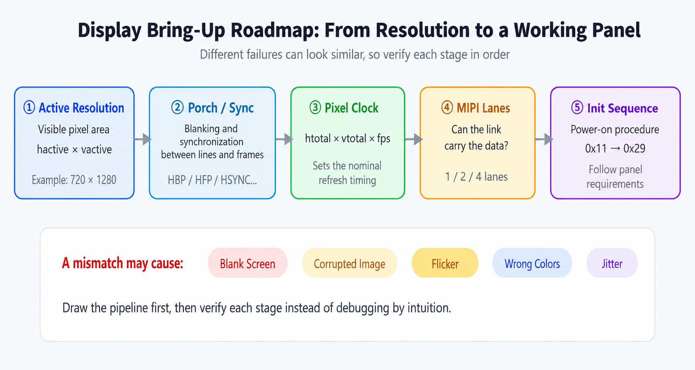
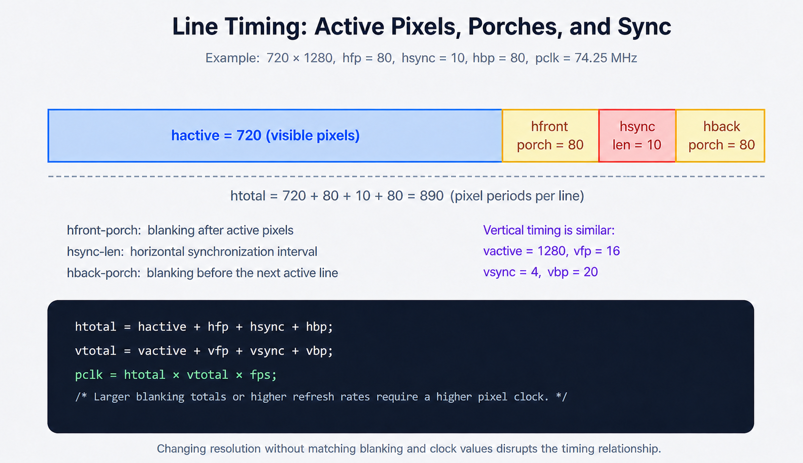
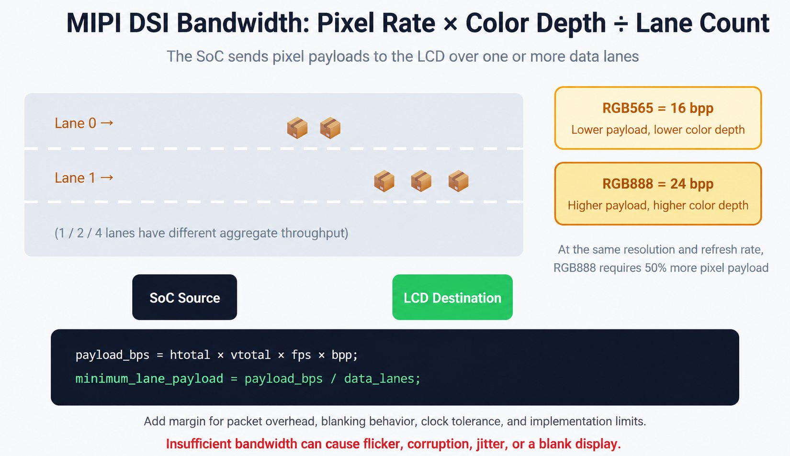
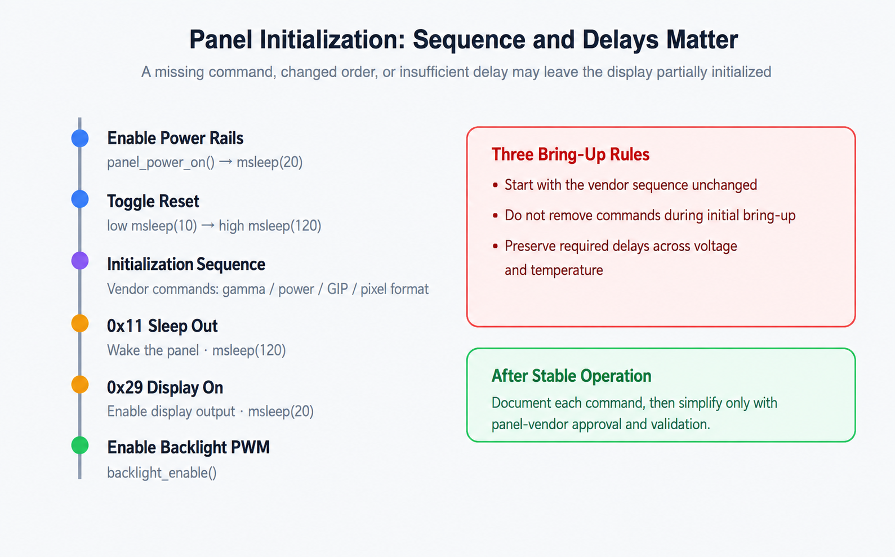
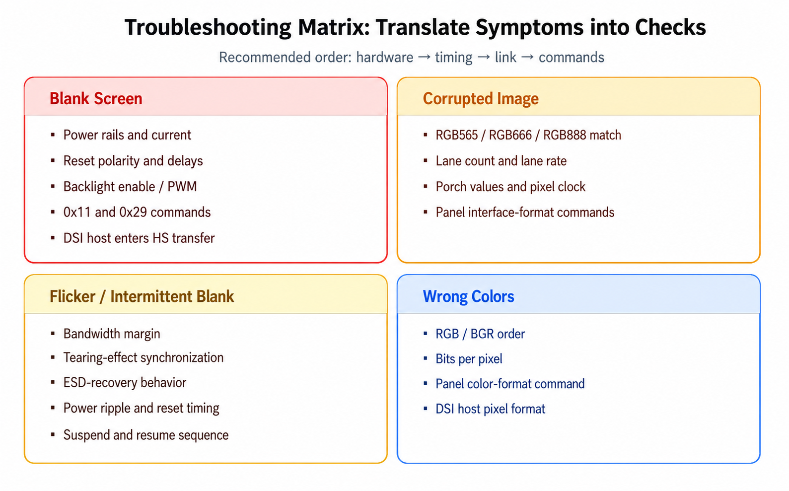
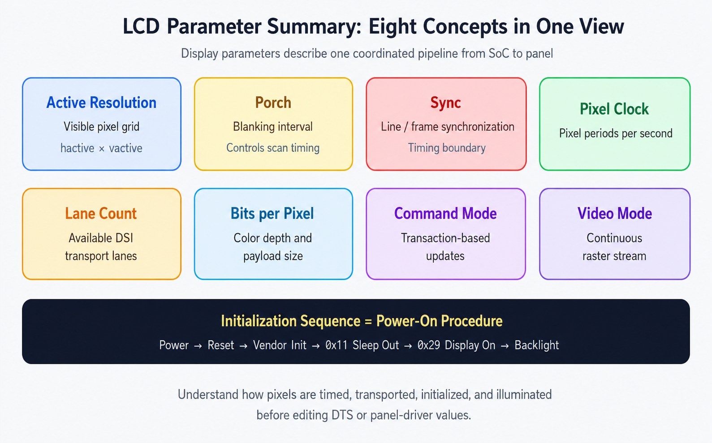

# LCD Panel Timing Parameters and MIPI DSI

!!! abstract "Quick answer"
    LCD timing parameters form one system rather than a set of independent values. Active resolution and blanking determine the pixel clock; pixel clock, color depth, protocol overhead, and lane count determine the required DSI bandwidth. Power sequencing, reset timing, pixel format, operating mode, and the panel initialization sequence must also match the panel datasheet.

## Key Takeaways

- Calculate horizontal and vertical totals before deriving pixel clock.
- Treat DSI lane-rate equations as initial budgets and verify the result against the host, panel, and applicable PHY specification.
- Do not remove vendor initialization commands or delays until the panel operates reliably and each command is understood.
- Diagnose a display in order: power and reset, video timing, physical link, pixel format, and panel commands.

Names such as `hactive`, `vfront-porch`, `hsync-len`, `clock-frequency`, `lane-rate`, `bpp`, and `init sequence` describe different parts of the same display pipeline. A useful mental model is a theater: active pixels are the seats, blanking intervals are the aisles and changeover time, pixel clock is the metronome, DSI lanes are transport lanes, and initialization is the opening procedure.

## The Display Timing Pipeline

A panel does not operate correctly merely because its active resolution matches. The host must:

- Define the active pixels in each line and frame.
- Provide the required horizontal and vertical blanking intervals.
- generate pixels at the correct pixel clock and refresh rate.
- Configure enough DSI data lanes and lane bandwidth.
- Apply power, reset, commands, and delays in the required sequence.

An error in any stage may appear as a blank screen, corrupted image, flicker, shifted image, incorrect color, unstable wake-up, or intermittent operation.

<figure markdown="span" class="displaywiki-figure">
  [{ width="760" loading="lazy" }](lcd-panel-timing-parameters-fig1-roadmap.png){ .displaywiki-image-link title="Open full-size image" }
  <figcaption>Figure 1. Display bring-up flow: active resolution → porch and sync → pixel clock → lane configuration → initialization sequence.</figcaption>
</figure>

## Active Resolution, Blanking, and Pixel Clock

For a 720 × 1280 panel, `hactive` represents 720 active pixel periods per line and `vactive` represents 1280 active lines per frame. The interface also includes timing intervals outside the visible image:

- `hfront-porch`: interval after the active portion of a line.
- `hsync-len`: horizontal synchronization interval.
- `hback-porch`: interval after horizontal sync and before the next active line.
- `vfront-porch`, `vsync-len`, and `vback-porch`: corresponding frame-level intervals.

These values determine the horizontal and vertical totals:

```c
htotal = hactive + hfront_porch + hsync_len + hback_porch;
vtotal = vactive + vfront_porch + vsync_len + vback_porch;
pclk_hz = htotal * vtotal * fps;
```

The last expression is a nominal calculation. Confirm whether the platform expects an exact pixel clock, a clock range, or timing values derived through a display mode structure.

<figure markdown="span" class="displaywiki-figure">
  [{ width="760" loading="lazy" }](lcd-panel-timing-parameters-fig2-timing.png){ .displaywiki-image-link title="Open full-size image" }
  <figcaption>Figure 2. Horizontal and vertical timing totals include active pixels, front porch, sync, and back porch.</figcaption>
</figure>

A Linux device-tree timing block may look like this:

```dts
panel_timing {
    clock-frequency = <74250000>;
    hactive = <720>;
    vactive = <1280>;
    hfront-porch = <80>;
    hsync-len = <10>;
    hback-porch = <80>;
    vfront-porch = <16>;
    vsync-len = <4>;
    vback-porch = <20>;
};
```

This is an illustrative example, not a universal timing set. Copy the supported values from the panel specification and confirm the required sync polarity and video-mode behavior.

## DSI Lane Count, Color Depth, and Bandwidth

A DSI link transports the display stream over one or more data lanes. The main variables are:

- **Data-lane count:** commonly one, two, or four, subject to host and panel support.
- **Lane rate:** the signaling rate required on each data lane.
- **Bits per pixel:** for example, 16 bits for RGB565 and 24 bits for RGB888.
- **Operating mode:** command mode or one of the supported video-mode configurations.
- **Protocol and blanking behavior:** packet overhead and whether blanking is transported affect the required rate.

A first-pass bandwidth estimate is:

```c
pixel_rate = htotal * vtotal * fps;
payload_bps = pixel_rate * bits_per_pixel;
minimum_lane_payload = payload_bps / data_lanes;
```

Do not treat a fixed margin multiplier as a final configuration. Account for packet overhead, burst or non-burst mode, blanking transmission, PHY efficiency, clock tolerances, and implementation-specific limits. Then select a supported lane rate with adequate margin.

<figure markdown="span" class="displaywiki-figure">
  [{ width="760" loading="lazy" }](lcd-panel-timing-parameters-fig3-bandwidth.png){ .displaywiki-image-link title="Open full-size image" }
  <figcaption>Figure 3. DSI bandwidth depends on total pixel rate, color depth, protocol overhead, data-lane count, and supported PHY rates.</figcaption>
</figure>

Bandwidth problems often appear only under heavier load. For example, a panel may work at a low refresh rate but fail at 60 Hz, show a static test image but flicker during animation, or work with RGB565 but not RGB888.

## Initialization and Power Sequencing

A display normally requires a device-specific sequence:

1. Enable power rails in the specified order.
2. Apply reset polarity and timing.
3. Configure the DSI host and place the link in the required state.
4. Send vendor initialization commands.
5. Send standard commands such as DCS Sleep Out (`0x11`) when applicable.
6. Wait for the specified delay.
7. Send DCS Display On (`0x29`) when applicable.
8. Enable the backlight at the required point.

<figure markdown="span" class="displaywiki-figure">
  [{ width="760" loading="lazy" }](lcd-panel-timing-parameters-fig4-init.png){ .displaywiki-image-link title="Open full-size image" }
  <figcaption>Figure 4. A typical bring-up sequence includes power, reset, vendor initialization, Sleep Out, Display On, and backlight control.</figcaption>
</figure>

```c
panel_power_on();
msleep(20);

panel_reset_low();
msleep(10);
panel_reset_high();
msleep(120);

mipi_dsi_dcs_write_seq(dsi, 0x11); /* Sleep Out */
msleep(120);

/* Send required vendor commands for power, gamma, GIP, and interface setup. */
mipi_dsi_dcs_write_seq(dsi, 0x29); /* Display On */
msleep(20);

backlight_enable();
```

The values above illustrate the sequence only. Use the actual panel datasheet or approved initialization table. Vendor commands may configure gamma, internal power, gate-in-panel timing, scan direction, pixel format, and PHY behavior. A missing command, reordered command, or shortened delay can leave the panel partially initialized.

## Troubleshooting by Symptom

### Blank Screen

Check:

- Power-rail voltage, order, and current consumption.
- Reset polarity, pulse width, and release delay.
- Backlight supply, enable, and PWM.
- LP command traffic and any required DCS commands.
- Lane mapping, lane count, PHY state, and HS entry.

### Corrupted or Shifted Image

Check:

- RGB565, RGB666, or RGB888 configuration at both endpoints.
- Horizontal and vertical totals, sync values, and pixel clock.
- Data-lane count and available lane bandwidth.
- Burst/non-burst mode and panel-specific interface commands.

### Flicker or Intermittent Blank Screen

Check:

- Lane-rate and timing margin.
- Power ripple, grounding, reset noise, and signal integrity.
- Tearing-effect synchronization when used.
- Suspend, resume, and ESD-recovery logic.

### Incorrect Colors

Check:

- RGB versus BGR component order.
- Bits per pixel and packed pixel format.
- DSI host pixel-format configuration.
- Panel commands that control color order or interface format.

<figure markdown="span" class="displaywiki-figure">
  [{ width="760" loading="lazy" }](lcd-panel-timing-parameters-fig5-debug.png){ .displaywiki-image-link title="Open full-size image" }
  <figcaption>Figure 5. Translate the visible symptom into a focused check of power, timing, link bandwidth, pixel format, or commands.</figcaption>
</figure>

## Parameter Summary

- **Active resolution:** the visible pixel columns and rows.
- **Porch intervals:** blanking periods around the active line or frame.
- **Sync length:** the defined horizontal or vertical synchronization interval.
- **Pixel clock:** the rate at which pixel periods are generated.
- **Data-lane count:** the number of DSI lanes available for payload transfer.
- **Bits per pixel:** the encoded color depth of each pixel.
- **Command or video mode:** the transaction model used to update the panel.
- **Initialization sequence:** the required commands, states, and delays used to start the panel.

<figure markdown="span" class="displaywiki-figure">
  [{ width="760" loading="lazy" }](lcd-panel-timing-parameters-fig6-metaphors.png){ .displaywiki-image-link title="Open full-size image" }
  <figcaption>Figure 6. LCD timing and DSI parameters operate together and must be validated against the complete display pipeline.</figcaption>
</figure>

## Frequently Asked Questions

??? question "How are total timing and pixel clock calculated?"
    Add active pixels, front porch, sync length, and back porch to obtain each total. A nominal pixel clock is `htotal × vtotal × refresh rate`. Use the exact timing ranges and clock constraints specified for the panel and host.

??? question "How do RGB565 and RGB888 affect DSI bandwidth?"
    RGB565 uses 16 bits per pixel and RGB888 uses 24. Before overhead, RGB888 therefore requires 50% more payload bandwidth for the same total pixel rate. Both the host and panel must use the same pixel format.

??? question "How should command mode and video mode be selected?"
    Use a mode supported by both endpoints and the driver. Command mode is useful for transaction-based or partial updates when the display retains pixels. Video mode continuously transports the raster stream and is common for panels without frame memory.

??? question "Can initialization delays be shortened?"
    Only when the panel documentation explicitly permits it or measurement proves compliance across voltage, temperature, and production variation. During initial bring-up, preserve the vendor sequence and delays exactly.

??? question "What is the fastest way to diagnose a blank MIPI DSI display?"
    Check the system in order: power and reset, backlight, LP command communication, initialization responses or waveforms, video timing, lane mapping and count, HS transfer, pixel format, and lane-rate support. This separates electrical, link, timing, and command failures.

!!! info "Can't find what you need?"
    If you need more products, resources or support, please contact our team:

    [**:material-archive-arrow-down: Knowledge Base**](../../knowledge/tags.md){ .md-button .md-button--primary }
    [**:material-magnify: Products & Solutions**](https://viewedisplay.com/){ .md-button }
    [**:material-email: Contact Support**](mailto:support@viewedisplay.com){ .md-button }
