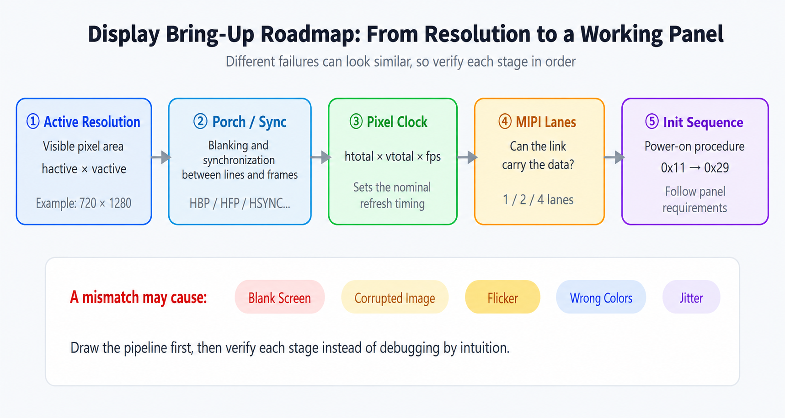
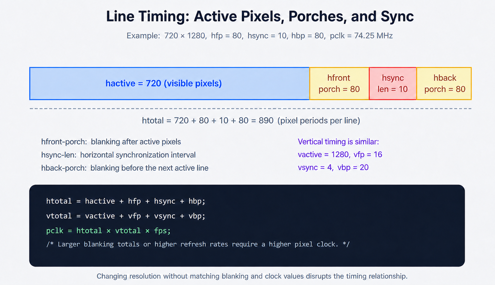
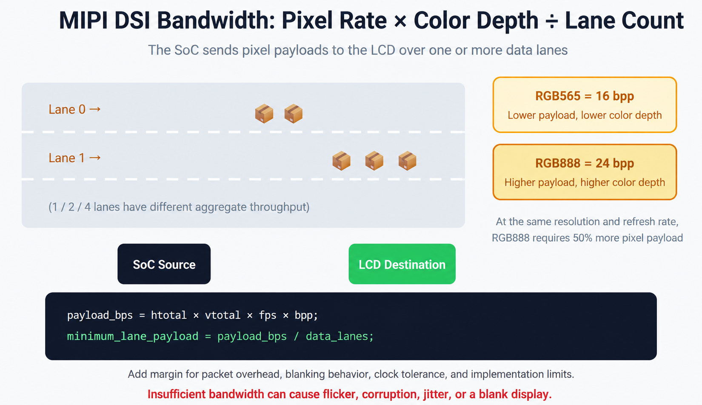
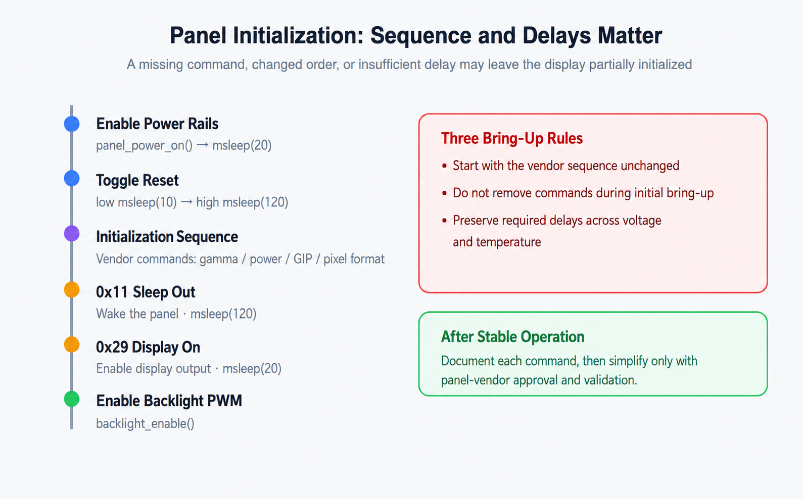
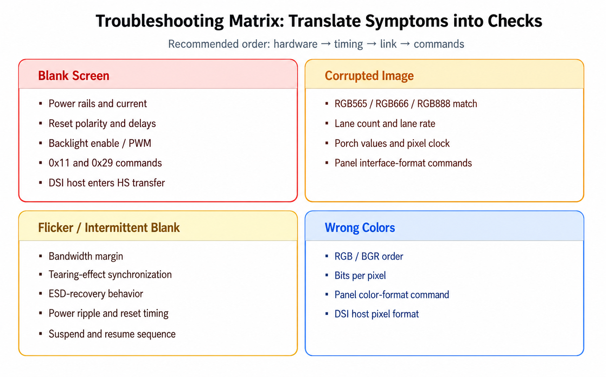
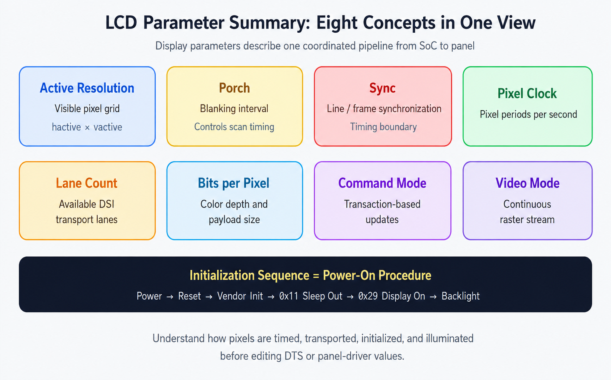

<script type="application/ld+json">
{
  "@context": "https://schema.org",
  "@type": "FAQPage",
  "mainEntity": [
    {
      "@type": "Question",
      "name": "How are htotal and pclk calculated?",
      "acceptedAnswer": {
        "@type": "Answer",
        "text": "`htotal = hactive + hfront_porch + hsync_len + hback_porch`; `vtotal = vactive + vfront_porch + vsync_len + vback_porch`; `pclk_hz = htotal × vtotal × fps`. For 720 × 1280 @ 60 Hz, `pclk ≈ 74 MHz`. pclk is the metronome: strike the wrong rhythm and the picture falls apart."
      }
    },
    {
      "@type": "Question",
      "name": "What is the difference between RGB565 and RGB888 in panel parameters?",
      "acceptedAnswer": {
        "@type": "Answer",
        "text": "The color precision differs — RGB565 is 16 bpp and RGB888 is 24 bpp. At the same resolution and refresh rate, the payload bandwidth of RGB888 is 50% higher than that of RGB565. If the lane count and lane_rate are insufficient, or the pixel format on the host side is configured wrongly, you get flicker, a corrupted image, or color banding."
      }
    },
    {
      "@type": "Question",
      "name": "How do I choose between video mode and command mode?",
      "acceptedAnswer": {
        "@type": "Answer",
        "text": "Video mode pushes a continuous stream with low latency, which suits dynamic content (video playback, automotive, HMI); command mode refreshes on demand with low power, which suits static or low-refresh panels (e-readers, meter reading, smart home panels). Many panels support both and can switch between them through DSI commands."
      }
    },
    {
      "@type": "Question",
      "name": "Can the delays in the init sequence be shortened?",
      "acceptedAnswer": {
        "@type": "Answer",
        "text": "No. The delays around Sleep Out (0x11), Display On (0x29), and the reset low/high transitions are set by the panel maker for that specific panel; deleting or shortening them easily produces 'eerie' symptoms such as half brightness, flicker, or false ESD detection. The first driver revision should port the vendor init code unchanged, and clean it up and comment it only after the panel lights up."
      }
    },
    {
      "@type": "Question",
      "name": "How do I quickly locate the cause of a blank screen?",
      "acceptedAnswer": {
        "@type": "Answer",
        "text": "Work through four steps — hardware, timing, link, commands: ① whether power, reset, backlight, and 0x11/0x29 are in place; ② whether porch and pixel clock are wildly off; ③ whether the lane count matches bpp and whether the DSI host really entered HS transmission; ④ whether the init commands are complete and in the right order. Run these four steps and most blank screens can be narrowed down to one specific stage."
      }
    }
  ]
}
</script>

# LCD Panel Timing Parameters and MIPI DSI

!!! abstract "Quick answer"
    LCD timing parameters form one system rather than a set of independent values. Active resolution and blanking determine the pixel clock; pixel clock, color depth, protocol overhead, and lane count determine the required DSI bandwidth. Power sequencing, reset timing, pixel format, operating mode, and the panel initialization sequence must also match the panel datasheet.

    - Calculate horizontal and vertical totals before deriving pixel clock.
    - Treat DSI lane-rate equations as initial budgets and verify the result against the host, panel, and applicable PHY specification.
    - Do not remove vendor initialization commands or delays until the panel operates reliably and each command is understood.
    - Diagnose a display in order: power and reset, video timing, physical link, pixel format, and panel commands.

Many people see LCD panel parameters for the first time and feel like they are reading an unfamiliar menu: `hactive`, `vfront-porch`, `hsync-len`, `clock-frequency`, `lane-rate`, `bpp`, `init sequence`... Every word looks a little familiar, but put them together and it gets dizzying.

Panel parameters are not actually that mysterious. Think of a MIPI LCD as a theater: the pixels are the seats, the timing is the rhythm at which the audience takes their seats, the MIPI lanes are the highway that carries the picture, and the initialization commands are the ceremony before the show. Once that picture stands up, many of these parameters stop being cold, lifeless fields.

## 1. Think of Panel Parameters as a Bring-Up Roadmap

A panel does not operate correctly merely because its active resolution matches. A real bring-up is a pipeline:

- First decide how many pixels the panel has, that is, how many seats the picture holds.
- Then decide how much buffer time to leave between lines and frames, that is, porch and sync.
- Then work out how fast the picture must be sent, that is, pixel clock and refresh rate.
- Then check how many MIPI DSI data lanes there are and whether they can deliver those pixels on time.
- Finally send the initialization commands the panel maker specifies, so the panel moves from sleep to display.

If one stage does not line up, the result can look the same on the outside — a blank screen, a corrupted image, flicker, wrong color, jitter, or a failed wake-up — while the cause underneath is completely different. That is why tuning panel parameters by feel is a bad idea. Draw the map first.

<figure markdown="span" class="displaywiki-figure">
  [{ width="760" loading="lazy" }](lcd-panel-timing-parameters-fig1-roadmap.png){ .displaywiki-image-link title="Open full-size image" }
  <figcaption>Figure 1. Display bring-up flow: active resolution → porch and sync → pixel clock → lane configuration → initialization sequence.</figcaption>
</figure>

## 2. Resolution Is the Seat Map, Porch Is the Aisle and Buffer

Start with resolution, the easiest part to understand. A 720 × 1280 panel is like a large theater: every line holds 720 seats and there are 1280 rows in total. `hactive` is the number of seats that can actually be occupied in each line, and `vactive` is the number of rows.

But a theater is never only seats. There are aisles in front of and behind the seats, a buffer while the scene changes, and crew who must know when the next row starts and when the next act begins. LCD works the same way: outside the active area there are several intervals you cannot see but that matter a great deal:

- `hfront-porch`: a short pause after the active pixels of a line end.
- `hsync-len`: tells the panel that this line is finished and the next one can be prepared.
- `hback-porch`: another short buffer after the sync signal.
- `vfront-porch`, `vsync-len`, and `vback-porch`: the same logic, only from line change to frame change.

So porch is not a redundant field. It is the breathing room of the scan. Leave too little and the panel rhythm is rushed; set it wrong and the image may shift, jitter, or flicker.

A very common estimate is:

```c
/* active pixels are the seats, porch/sync are the aisles and the cues */
htotal = hactive + hfront_porch + hsync_len + hback_porch;
vtotal = vactive + vfront_porch + vsync_len + vback_porch;
pclk_hz = htotal * vtotal * fps; /* how many beats the metronome strikes per second */
```

Think of `pixel clock` as a metronome. Each beat sends out one pixel period. The higher the resolution, the larger the porch, and the higher the refresh rate, the faster that metronome has to strike.

<figure markdown="span" class="displaywiki-figure">
  [{ width="760" loading="lazy" }](lcd-panel-timing-parameters-fig2-timing.png){ .displaywiki-image-link title="Open full-size image" }
  <figcaption>Figure 2. Horizontal and vertical timing totals include active pixels, front porch, sync, and back porch.</figcaption>
</figure>

In DTS or a DRM mode, the fields usually look like this:

```dts
/* Read these fields as a group; do not stare only at hactive/vactive */
panel_timing {
    clock-frequency = <74250000>; /* the pixel metronome, normally in Hz */
    hactive = <720>;
    vactive = <1280>;
    hfront-porch = <80>;
    hsync-len = <10>;
    hback-porch = <80>;
    vfront-porch = <16>;
    vsync-len = <4>;
    vback-porch = <20>;
};
```

If you change only the resolution and leave porch and clock alone, it is like expanding the theater seating while keeping the old admission rhythm — confusion is only a matter of time.

## 3. MIPI Lanes Are Highway Lanes, bpp Is Cargo Weight

MIPI DSI is like a highway running from the SoC to the screen. The SoC is the warehouse, the LCD is the destination, the pixel data is the cargo, and each data lane is one lane of that highway.

Several parameters matter here:

- **Lane count:** how many lanes there are. 1 lane, 2 lanes, and 4 lanes have completely different throughput.
- **Lane rate:** how fast each lane runs.
- **bpp:** how heavy each pixel is. RGB565 is 16 bpp and RGB888 is 24 bpp.
- **Command mode:** like shipping on demand — send only when an update is needed.
- **Video mode:** like a convoy that never stops, pushing a complete video stream all the time.

RGB888 reproduces color more finely than RGB565, but every pixel is also heavier. At the same resolution and refresh rate, RGB888 needs more bandwidth. A rough estimate:

```c
/* more pixels, heavier color, faster refresh: more pressure on the highway */
pixel_rate = htotal * vtotal * fps;
payload_bps = pixel_rate * bits_per_pixel;
lane_rate = payload_bps / data_lanes;
lane_rate = lane_rate * 12 / 10; /* leave room for protocol overhead and margin */
```

Insufficient bandwidth is like a traffic jam. A mild case shows as flicker, a corrupted image, or occasional jitter; a severe case shows nothing at all. A 4-lane panel configured as 2 lanes, RGB888 miscoded as RGB565, or a wrong burst/non-burst choice in video mode can all produce very confusing symptoms.

There is also a very practical test: it lights up at a low refresh rate but corrupts at 60 Hz; a static picture is fine but animation flickers; a low-resolution test image displays but the real UI is unstable. Problems like these are often not the initialization commands but link throughput and timing margin.

<figure markdown="span" class="displaywiki-figure">
  [{ width="760" loading="lazy" }](lcd-panel-timing-parameters-fig3-bandwidth.png){ .displaywiki-image-link title="Open full-size image" }
  <figcaption>Figure 3. DSI bandwidth depends on total pixel rate, color depth, protocol overhead, data-lane count, and supported PHY rates.</figcaption>
</figure>

## 4. Initialization Commands Are the Opening Ceremony

A panel does not display the moment power is applied. It is more like a performance: the preparation must happen in order before the curtain rises.

- The power rails come up, like the stage lights turning on first.
- Reset is pulled low and then high, like the curtain being drawn.
- The init sequence is sent, like the host running through the ceremony step by step.
- `0x11 Sleep Out`, like waking the panel from sleep.
- `0x29 Display On`, like announcing that the show may begin.
- Backlight PWM is enabled, like the spotlight landing on the stage.

<figure markdown="span" class="displaywiki-figure">
  [{ width="760" loading="lazy" }](lcd-panel-timing-parameters-fig4-init.png){ .displaywiki-image-link title="Open full-size image" }
  <figcaption>Figure 4. A typical bring-up sequence includes power, reset, vendor initialization, Sleep Out, Display On, and backlight control.</figcaption>
</figure>

In a real driver the flow usually looks like this:

```c
/* Do not delete these delays casually; many intermittent black screens hide here */
panel_power_on();
msleep(20);

panel_reset_low();
msleep(10);
panel_reset_high();
msleep(120);

mipi_dsi_dcs_write_seq(dsi, 0x11); /* Sleep Out: wake the panel */
msleep(120);

/* Vendor gamma, voltage, GIP, and interface-format commands usually sit here. */
mipi_dsi_dcs_write_seq(dsi, 0x29); /* Display On: allow display */
msleep(20);

backlight_enable(); /* the spotlight comes on last */
```

Many vendor init codes look like one long string of hexadecimal commands and are hard to read. Even so, do not rush to "optimize" them while porting. Some commands control gamma, some control the internal power rails, some control scan direction, and some control the MIPI interface format. One command missing, one command out of order, or a delay a little too short can all leave the panel in a half-normal state.

The safest engineering practice is: port the vendor initialization flow unchanged and let the panel light up reliably first, then clean up and comment it step by step. Do not delete commands by feel in the first driver revision.

## 5. When a Problem Appears, Translate the Symptom Back into Parameters

The most frightening sentence in panel bring-up is: "This panel is dark, is the driver broken?" That statement is far too broad. A better approach is to translate the symptom into a range of possible parameter problems.

**Blank screen** — check first:

- Whether the power rails came up.
- Whether the reset polarity and delay are correct.
- Whether the backlight is on.
- Whether `0x11` and `0x29` were actually sent.
- Whether the DSI host really entered high-speed (HS) transmission.

**Corrupted image** — check first:

- Whether RGB565/RGB666/RGB888 match.
- Whether the lane count and lane rate are sufficient.
- Whether porch and pixel clock are wildly off.
- Whether the interface-format commands in the initialization are correct.

**Flicker or intermittent blank screen** — check first:

- Whether the bandwidth margin is too tight.
- Whether TE is configured correctly.
- Whether ESD detection is triggering falsely.
- Whether power ripple, reset timing, and the suspend/resume flow are stable.

!!! warning "Production note"
    Under volume production or harsh conditions (high and low temperature, damp heat, vibration, ESD), check the datasheet curves for this parameter; running outside the specified range will significantly shorten lifetime.

**Wrong color** — check first:

- RGB versus BGR component order.
- The bpp configuration.
- The color format in the panel init.
- The DSI host pixel format.

You will find that display troubleshooting is not a black art. It is more like following one route to find the break: hardware first, then timing, then the link, and last the commands. Get the order right and the problem turns from "a ball of darkness" into "one stage that does not match."

<figure markdown="span" class="displaywiki-figure">
  [{ width="760" loading="lazy" }](lcd-panel-timing-parameters-fig5-debug.png){ .displaywiki-image-link title="Open full-size image" }
  <figcaption>Figure 5. Translate the visible symptom into a focused check of power, timing, link bandwidth, pixel format, or commands.</figcaption>
</figure>

## 6. Remember These Metaphors and Panel Parameters Are Easy to Recall

To close, here is the short version of the key parameters:

- Resolution: the theater seat map — it decides how many active pixels there are.
- Porch: the aisles and buffer outside the seats — it decides whether the scan rhythm is comfortable.
- Sync: the cue for a line change or a frame change — it tells the panel where the rhythm boundaries are.
- Pixel clock: the metronome — how many pixel beats per second.
- Lane count: how many highway lanes — whether the data can be transported in time.
- bpp: the cargo weight of each pixel — the finer the color, the heavier the cargo.
- Command/video mode: one refreshes on demand, the other pushes a continuous video stream.
- Init sequence: the opening ceremony — both the order and the delays matter.

So LCD panel parameters are not a pile of isolated numbers. They describe a collaboration that runs from the SoC to the screen: how the picture queues up, how the data takes the road, how the panel wakes up, and when the backlight turns on.

Once this picture is clear, reading DTS, a panel driver, or a vendor spec becomes much easier.

<figure markdown="span" class="displaywiki-figure">
  [{ width="760" loading="lazy" }](lcd-panel-timing-parameters-fig6-metaphors.png){ .displaywiki-image-link title="Open full-size image" }
  <figcaption>Figure 6. LCD timing and DSI parameters operate together and must be validated against the complete display pipeline.</figcaption>
</figure>

## 7. Conclusion

Panel parameters are not isolated numbers. Whether an LCD displays stably is a collaboration between four links — the SoC, the panel driver, the link physical layer, and the initialization timing: the picture leaves on the metronome beat, travels the lane highway to the panel, the panel wakes up through its opening ceremony, and porch leaves breathing room for the scan. Next time you face that long string of numbers in a DTS, a panel driver, or a vendor spec, do not be intimidated — picture them as a theater, a highway, and a metronome, and the parameters turn into a scene.

## 8. Frequently Asked Questions

??? question "Q1: How are htotal and pclk calculated?"
    `htotal = hactive + hfront_porch + hsync_len + hback_porch`; `vtotal = vactive + vfront_porch + vsync_len + vback_porch`; `pclk_hz = htotal × vtotal × fps`. For 720 × 1280 @ 60 Hz, `pclk ≈ 74 MHz`. pclk is the metronome: strike the wrong rhythm and the picture falls apart.

??? question "Q2: What is the difference between RGB565 and RGB888 in panel parameters?"
    The color precision differs — RGB565 is 16 bpp and RGB888 is 24 bpp. At the same resolution and refresh rate, the payload bandwidth of RGB888 is 50% higher than that of RGB565. If the lane count and lane_rate are insufficient, or the pixel format on the host side is configured wrongly, you get flicker, a corrupted image, or color banding.

??? question "Q3: How do I choose between video mode and command mode?"
    Video mode pushes a continuous stream with low latency, which suits dynamic content (video playback, automotive, HMI); command mode refreshes on demand with low power, which suits static or low-refresh panels (e-readers, meter reading, smart home panels). Many panels support both and can switch between them through DSI commands.

??? question "Q4: Can the delays in the init sequence be shortened?"
    No. The delays around Sleep Out (0x11), Display On (0x29), and the reset low/high transitions are set by the panel maker for that specific panel; deleting or shortening them easily produces 'eerie' symptoms such as half brightness, flicker, or false ESD detection. The first driver revision should port the vendor init code unchanged, and clean it up and comment it only after the panel lights up.

??? question "Q5: How do I quickly locate the cause of a blank screen?"
    Work through four steps — hardware, timing, link, commands: ① whether power, reset, backlight, and 0x11/0x29 are in place; ② whether porch and pixel clock are wildly off; ③ whether the lane count matches bpp and whether the DSI host really entered HS transmission; ④ whether the init commands are complete and in the right order. Run these four steps and most blank screens can be narrowed down to one specific stage.

## Related reading

- [Display Interfaces Explained: MCU, RGB, LVDS, MIPI, SPI, and More](display-interface-guide.md)
- [MIPI Interfaces Explained: DSI, CSI-2, D-PHY, and C-PHY](mipi-interface-basics.md)
- [LCD Basics: How Liquid Crystal Displays Work](lcd-basics.md)

!!! info "Can't find what you need?"
    If you need more products, resources or support, please contact our team:

    [**:material-archive-arrow-down: Knowledge Base**](../../knowledge/tags.md){ .md-button .md-button--primary }
    [**:material-magnify: Products & Solutions**](https://viewedisplay.com/){ .md-button }
    [**:material-email: Contact Support**](mailto:support@viewedisplay.com){ .md-button }
