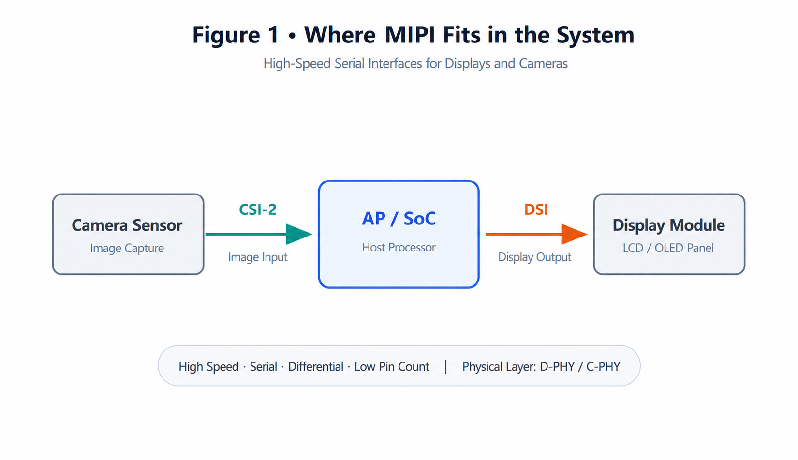
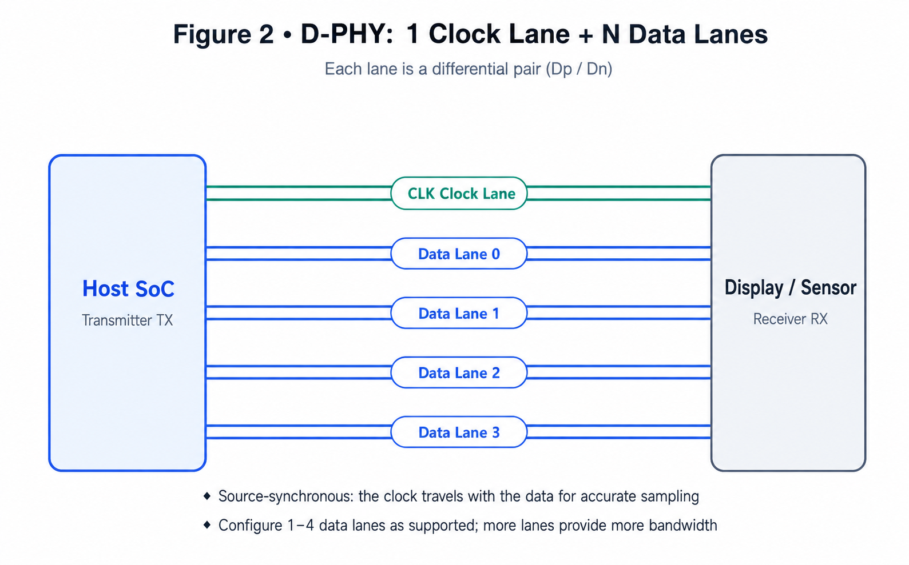
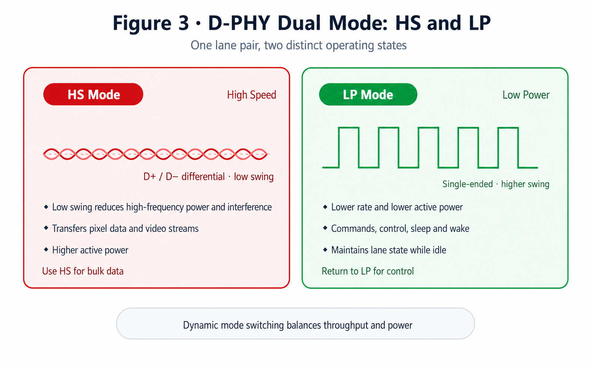
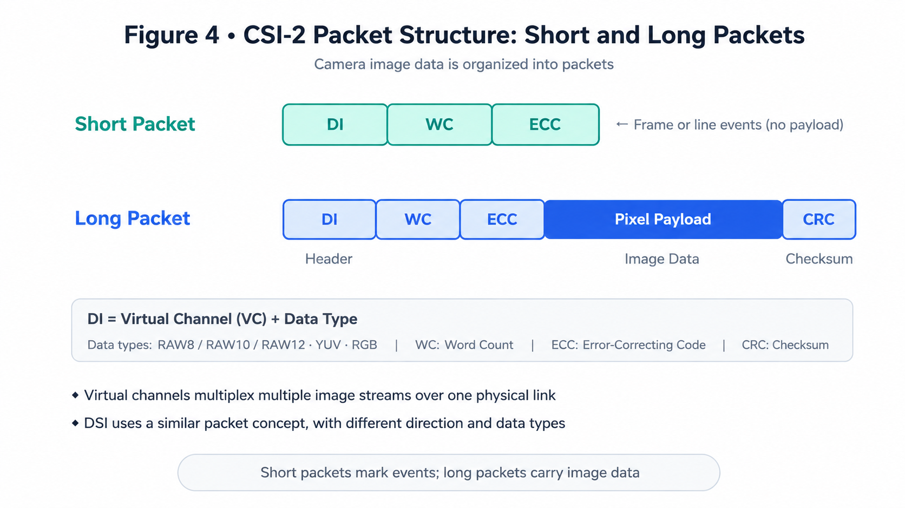
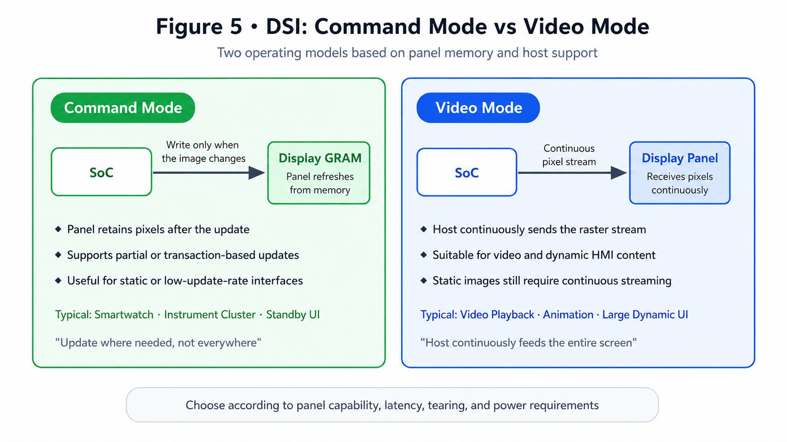
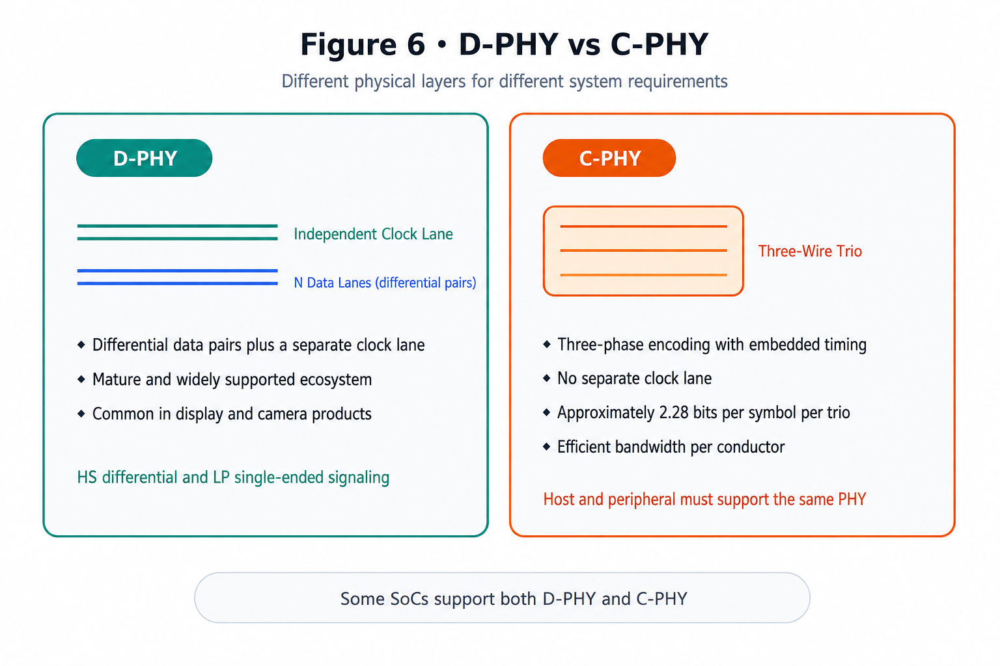

# MIPI Interfaces Explained: DSI, CSI-2, D-PHY, and C-PHY

!!! abstract "Quick answer"
    MIPI DSI carries display data from a host processor to a display module, while MIPI CSI-2 carries image data from a camera to a host. Both protocols commonly use D-PHY or C-PHY. Correct implementation requires compatible protocol and PHY versions, sufficient lane bandwidth, the correct operating mode, controlled-impedance routing, and a validated initialization sequence.

## Key Takeaways

- DSI and CSI-2 are upper-layer protocols; D-PHY and C-PHY provide the physical signaling.
- D-PHY switches between high-speed differential signaling and low-power single-ended signaling.
- Display resolution, refresh rate, pixel format, blanking, packet overhead, lane count, and PHY limits all affect the required lane rate.
- PCB layout, FPC construction, ESD protection, power sequencing, and initialization commands must be validated as one system.

MIPI interfaces are widely used between processors, displays, and cameras in phones, tablets, automotive displays, POS terminals, and embedded products. They provide high bandwidth with fewer signal pins than traditional parallel interfaces.

## MIPI in a Display and Camera System

The MIPI Alliance develops interface specifications for mobile and embedded systems. Two of the most widely used application protocols are Display Serial Interface (DSI) and Camera Serial Interface 2 (CSI-2).

<figure markdown="span" class="displaywiki-figure">
  [{ width="760" loading="lazy" }](mipi-interface-basics-fig1-mipi-system.png){ .displaywiki-image-link title="Open full-size image" }
  <figcaption>Figure 1. CSI-2 transports camera data to the SoC; DSI transports display data and commands from the SoC to the display module.</figcaption>
</figure>

DSI and CSI-2 perform different functions and are not electrically interchangeable merely because they use the same PHY. Protocol version, lane configuration, data types, controller support, and device initialization must all match.

## D-PHY Lanes and Source-Synchronous Clocking

A conventional D-PHY link contains one clock lane and one or more data lanes. Each lane uses two conductors. The number of supported data lanes is determined by the host, peripheral, and relevant specification version; one-, two-, and four-lane display implementations are common.

<figure markdown="span" class="displaywiki-figure">
  [{ width="760" loading="lazy" }](mipi-interface-basics-fig2-dphy-lanes.png){ .displaywiki-image-link title="Open full-size image" }
  <figcaption>Figure 2. Typical D-PHY topology: a differential clock lane accompanies one or more differential data lanes.</figcaption>
</figure>

During high-speed transfer, the clock lane provides a source-synchronous reference for the data lanes. Adding lanes can increase aggregate throughput, but only when every endpoint supports that configuration and the PCB and connector preserve signal integrity.

## High-Speed and Low-Power Signaling

D-PHY reuses the same lane conductors for two signaling states:

- **High-Speed (HS) mode** uses low-swing differential signaling for high-rate payload transfer.
- **Low-Power (LP) mode** uses single-ended signaling for state transitions, control activity, and selected low-rate communication.

<figure markdown="span" class="displaywiki-figure">
  [{ width="760" loading="lazy" }](mipi-interface-basics-fig3-hs-lp.png){ .displaywiki-image-link title="Open full-size image" }
  <figcaption>Figure 3. D-PHY uses low-swing differential signaling in HS mode and single-ended signaling in LP mode; exact electrical limits depend on the applicable specification.</figcaption>
</figure>

The transmitter enters and exits HS operation through defined lane states and timing sequences. Values such as swing, common-mode level, termination, and transition timing must be taken from the applicable D-PHY version and the device datasheets rather than treated as universal nominal values.

## CSI-2 Packet Structure

CSI-2 organizes traffic into short and long packets. Short packets convey events such as frame start and frame end. Long packets carry payload data such as RAW, YUV, or RGB image data.

<figure markdown="span" class="displaywiki-figure">
  [{ width="760" loading="lazy" }](mipi-interface-basics-fig4-csi2-packets.png){ .displaywiki-image-link title="Open full-size image" }
  <figcaption>Figure 4. A CSI-2 long packet contains a header, payload, and checksum; short packets carry compact event information.</figcaption>
</figure>

The long-packet header contains a Data Identifier (DI), Word Count (WC), and error-correcting code (ECC). The DI includes a virtual-channel identifier and a data type. A checksum protects the payload. Virtual channels allow compatible receivers to distinguish multiple logical streams transported over one physical link.

DSI also uses packetized transfer, but its packet types and command semantics are defined for display communication rather than camera capture.

## DSI Command Mode and Video Mode

DSI can transport pixel data and Display Command Set (DCS) commands. Two operating models are commonly discussed:

- **Command mode** sends commands and pixel updates as transactions. It is commonly used with display modules that include a frame buffer or GRAM and can retain image data between updates.
- **Video mode** sends a continuous rasterized pixel stream with timing derived from the display mode. It is used when the panel requires continuously supplied video data.

<figure markdown="span" class="displaywiki-figure">
  [{ width="760" loading="lazy" }](mipi-interface-basics-fig5-command-video.png){ .displaywiki-image-link title="Open full-size image" }
  <figcaption>Figure 5. Command mode updates display memory as needed, whereas video mode continuously transports a display stream.</figcaption>
</figure>

The panel datasheet and host controller determine which modes are available. Power, latency, tearing control, partial-update behavior, and software support should be evaluated before selection.

## D-PHY and C-PHY

D-PHY uses two-wire lanes and normally provides a separate clock lane. C-PHY uses three-wire groups called trios and embeds timing in its encoded symbols.

<figure markdown="span" class="displaywiki-figure">
  [{ width="760" loading="lazy" }](mipi-interface-basics-fig6-dphy-cphy.png){ .displaywiki-image-link title="Open full-size image" }
  <figcaption>Figure 6. D-PHY uses two-wire lanes; C-PHY uses encoded three-wire trios without a dedicated clock lane.</figcaption>
</figure>

C-PHY encodes approximately 2.28 bits per symbol per trio, so symbol rate and bit rate must not be compared as if they were identical units. C-PHY can improve bandwidth per conductor for supported designs, while D-PHY remains widely used and broadly supported. A device that supports one PHY does not necessarily support the other; verify the host and peripheral capabilities.

## PCB and System Design Checklist

| Design item | Engineering guidance |
| --- | --- |
| Controlled impedance | Route D-PHY differential pairs and C-PHY trios to the impedance specified by the device, stack-up, connector, and PHY documentation. Do not assume one value applies to every implementation. |
| Intra-lane matching | Keep the conductors within each pair or trio tightly controlled and matched according to the timing budget. |
| Lane-to-lane skew | Check the transmitter and receiver skew tolerance before assigning a matching rule. |
| Routing topology | Keep routes short, minimize discontinuities, avoid stubs, and control via and connector transitions. |
| Bandwidth | Calculate active pixels, blanking, frame rate, bits per pixel, packet overhead, lane count, and design margin. |
| ESD protection | Select low-capacitance protection with acceptable insertion loss and place it according to the interface design. |
| FPC and connector | Include the complete interconnect in the impedance and loss budget. |
| Sequencing | Follow the panel or sensor requirements for rails, reset, LP/HS transitions, commands, and delays. |

Simulation or measurement may be required at higher data rates. Validate the final stack-up, component models, connector, FPC, and test fixture rather than assessing only the PCB traces.

## Selection Summary

MIPI DSI and CSI-2 combine packet-based protocols with high-speed physical layers to reduce pin count while supporting demanding display and camera applications. Successful integration depends on protocol compatibility, sufficient bandwidth, correct lane states and timing, controlled interconnects, and device-specific initialization.

## Frequently Asked Questions

??? question "Are MIPI DSI and CSI-2 the same interface?"
    No. DSI sends display information from a host to a display, while CSI-2 sends image information from a camera toward a host. They may use the same type of PHY, but their protocols, data types, directions, and controller functions differ.

??? question "Can D-PHY HS and LP signaling use the same wires?"
    Yes. D-PHY defines state transitions that allow the lane conductors to carry low-power single-ended signaling and high-speed differential signaling at different times. The transmitter and receiver must meet the specified state and timing requirements.

??? question "Can D-PHY and C-PHY be substituted without redesign?"
    No. Their signaling, conductor grouping, clocking, electrical requirements, and controller configuration differ. Both endpoints must explicitly support the selected PHY.

??? question "Should a DSI display use command mode or video mode?"
    Follow the display and host documentation. Command mode is useful for transaction-based or partial updates when the module can retain pixels. Video mode suits panels that require a continuous stream. Power, latency, tearing, and driver support also matter.

??? question "What commonly causes a MIPI display to remain blank?"
    Check power rails, reset polarity and timing, LP communication, the initialization sequence, lane count and mapping, PHY timing, pixel format, video timing, and whether the host actually enters HS transfer. Probe the power, reset, clock, and data behavior where possible.

!!! info "Can't find what you need?"
    If you need more products, resources or support, please contact our team:

    [**:material-archive-arrow-down: Knowledge Base**](../../knowledge/tags.md){ .md-button .md-button--primary }
    [**:material-magnify: Products & Solutions**](https://viewedisplay.com/){ .md-button }
    [**:material-email: Contact Support**](mailto:support@viewedisplay.com){ .md-button }
