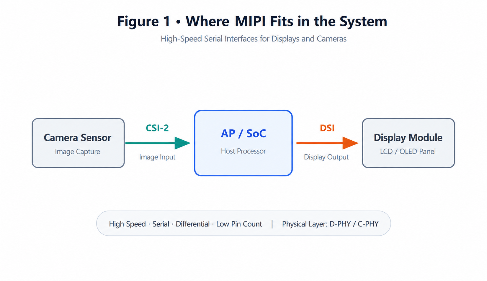
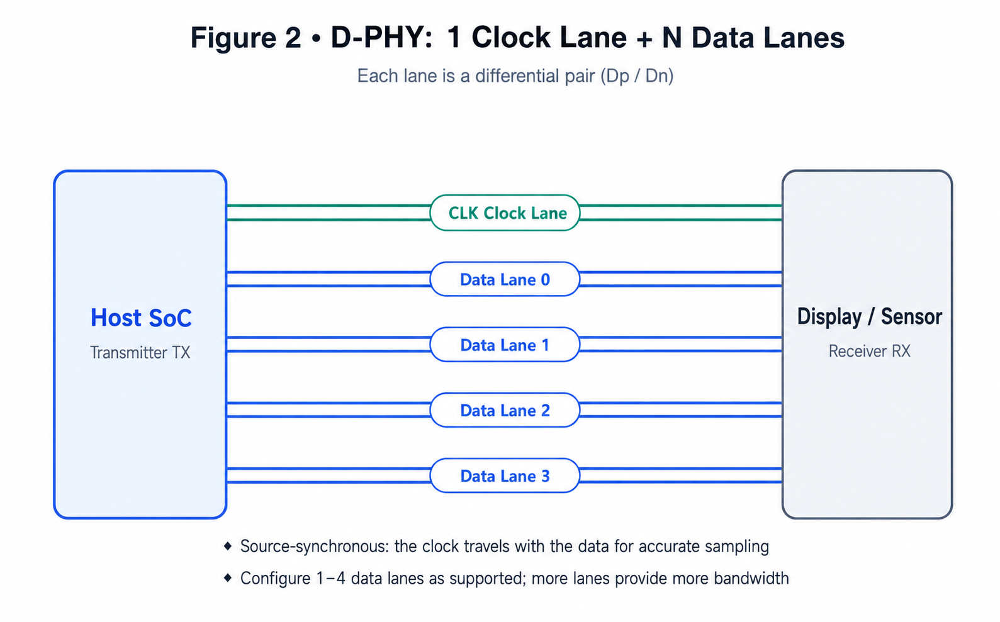
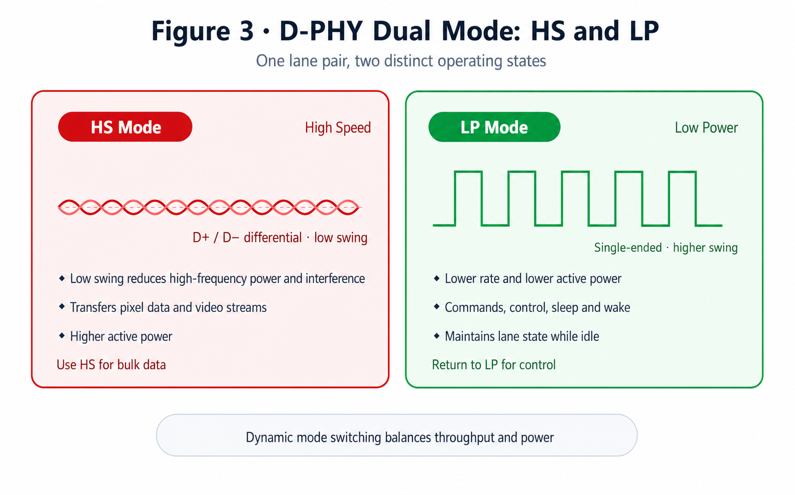
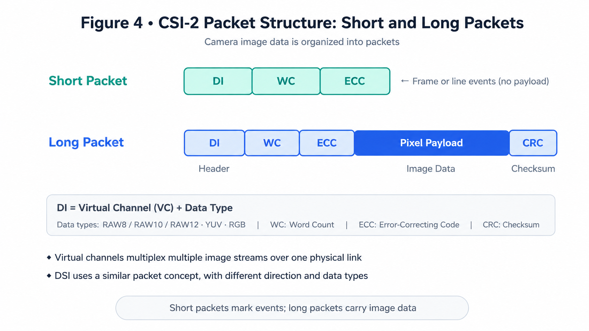
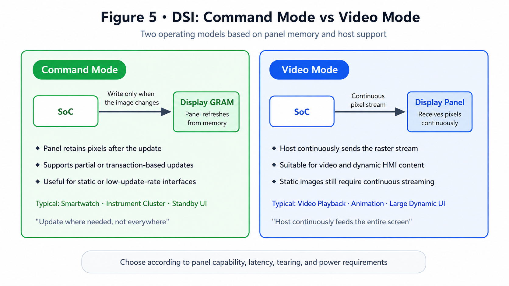
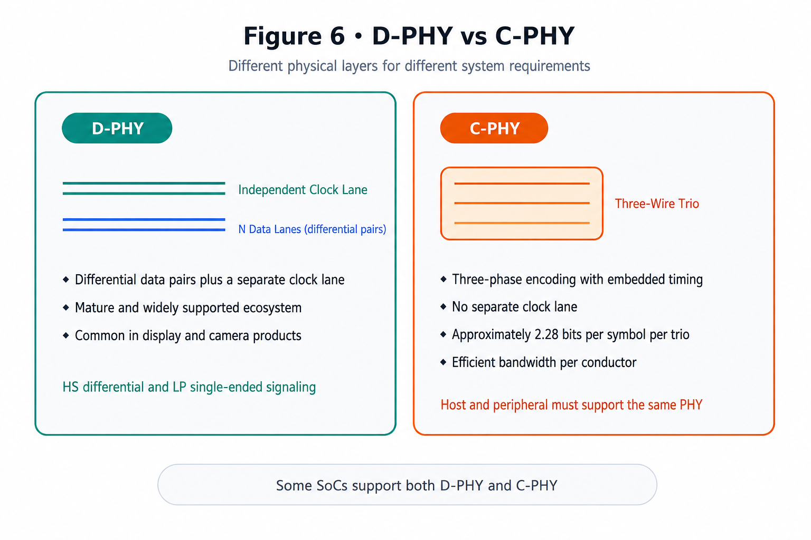

!!! warning "Mass-production note"
    In mass production or harsh conditions (high/low temperature, humidity, vibration, ESD), check the datasheet curves of the relevant parameters; exceeding the specified range significantly shortens lifetime.

# MIPI Interfaces Explained: DSI, CSI-2, D-PHY, and C-PHY

!!! abstract "Quick answer"
    MIPI moves astonishing bandwidth over very few differential pins, and it is the high-speed link standard for devices that carry a screen and a camera: phones, tablets, automotive displays, POS terminals, and more. This article focuses on the two most widely used protocols, MIPI DSI and CSI-2, and explains D-PHY lanes, the HS/LP dual mode, packet structure, and C-PHY in one pass.

    - DSI and CSI-2 are upper-layer protocols; D-PHY and C-PHY provide the physical signaling.
    - D-PHY switches between high-speed differential signaling and low-power single-ended signaling on the same pair of wires.
    - Short packets carry synchronization events; long packets carry the pixel payload protected by ECC and CRC.
    - Command mode suits panels with GRAM and mostly static content; video mode suits panels that need a continuous stream.
    - PCB layout, FPC construction, ESD protection, and initialization sequencing must be validated as one system.

Phones, tablets, automotive displays, POS terminals, and other devices that carry a screen and a camera almost always rely on MIPI for the high-speed link between the processor and the display and camera. It moves astonishing bandwidth over very few pins, shuttling high-definition video and image data between chips at high speed. In this article we focus on the two most commonly used protocols, MIPI DSI and CSI-2, and explain D-PHY lanes, the HS/LP dual mode, packet structure, and C-PHY in one pass.

## 1. What MIPI Is: The High-Speed Link Between Displays and Cameras

MIPI is a family of interface specifications developed by the MIPI Alliance (Mobile Industry Processor Interface Alliance). It was born for mobile phones and is now widely used in embedded devices with screens and cameras. The two specifications engineers deal with most often are DSI (Display Serial Interface) and CSI-2 (Camera Serial Interface).

<figure markdown="span" class="displaywiki-figure">
  [{ width="760" loading="lazy" }](mipi-interface-basics-fig1-mipi-system.png){ .displaywiki-image-link title="Open full-size image" }
  <figcaption>Figure 1. Where MIPI sits in the system: the camera connects to the SoC through CSI-2, and the SoC drives the display module through DSI.</figcaption>
</figure>

In short, the processor (AP/SoC) pushes the picture to the display through DSI and reads in the images captured by the camera through CSI-2. What the two interfaces have in common: high speed, serial, differential, and few pins. Underneath, they mostly run on the same physical layer — D-PHY (or the more efficient C-PHY). Once you understand the underlying PHY and the upper-layer packet structure, you understand the essence of MIPI.

## 2. D-PHY: Clock Lane Plus Data Lanes

D-PHY is the most widely used physical layer in MIPI applications. Its structure is easy to see: one clock lane plus several data lanes.

<figure markdown="span" class="displaywiki-figure">
  [{ width="760" loading="lazy" }](mipi-interface-basics-fig2-dphy-lanes.png){ .displaywiki-image-link title="Open full-size image" }
  <figcaption>Figure 2. D-PHY structure: 1 clock lane plus up to 4 data lanes, and every lane is a differential pair.</figcaption>
</figure>

Every lane is a differential pair. Data lanes can be flexibly configured from 1 to 4 (or even more) according to bandwidth needs — the more lanes, the higher the bandwidth. The dedicated clock lane provides a unified synchronization clock for all data lanes. This "clock travels with the data" scheme is called source-synchronous clocking, and it lets the receiver align its sampling precisely. A small number of differential lines can stack up very high throughput — that is exactly the confidence MIPI needs to move 4K video inside the space-starved body of a phone.

## 3. HS and LP: Two Modes on One Pair of Wires

D-PHY has a clever design: the same pair of wires can switch between two very different modes, balancing speed and power saving.

<figure markdown="span" class="displaywiki-figure">
  [{ width="760" loading="lazy" }](mipi-interface-basics-fig3-hs-lp.png){ .displaywiki-image-link title="Open full-size image" }
  <figcaption>Figure 3. HS versus LP mode: a 200 mV low-swing differential signal for high-speed transfer versus a 1.2 V single-ended large-swing signal for low-power transfer.</figcaption>
</figure>

High-Speed (HS) mode uses differential, small-swing (about 200 mV) signaling to blast pixel data at extremely high rates — the small swing saves power and reduces interference at high frequency. Low-Power (LP) mode switches to single-ended, large-swing (about 1.2 V) slow signaling for commands and control and for keeping the link alive while idle — lower speed but much lower power. Enter HS for bulk data transfer, drop back to LP in the gaps and for control: one pair of wires takes care of both "fast" and "frugal". This dynamic switching is the key to MIPI's low-power character.

## 4. CSI-2 Packet Structure: Short and Long Packets

On the camera side, CSI-2 organizes transmission into packets. It divides the data into two kinds of packets:

<figure markdown="span" class="displaywiki-figure">
  [{ width="760" loading="lazy" }](mipi-interface-basics-fig4-csi2-packets.png){ .displaywiki-image-link title="Open full-size image" }
  <figcaption>Figure 4. CSI-2 packet structure: short packets carry synchronization information, while long packets consist of a DI / WC / ECC header plus the pixel payload and CRC.</figcaption>
</figure>

Short packets carry synchronization-type information such as frame start/end and line start/end, with a simple structure. Long packets carry the actual pixel data: the header holds the Data Identifier DI (which contains the virtual-channel number and the data type, such as RAW8/10/12, YUV, or RGB parallel), the Word Count WC, and the error-correcting code ECC; the middle is the pixel payload, and the end carries a CRC checksum. The "virtual channel" is a very practical concept — it lets multiple image streams (for example, several cameras or several data flows) share one physical link, distinguished by the virtual-channel number. The packet structure on the DSI display side is similar, only in the opposite direction and with different data types.

## 5. DSI Display: Command Mode and Video Mode

On the display side, DSI can not only carry pixels but also control the screen with DCS (Display Command Set) commands. Depending on whether the panel has its own video memory, DSI operates in two modes:

<figure markdown="span" class="displaywiki-figure">
  [{ width="760" loading="lazy" }](mipi-interface-basics-fig5-command-video.png){ .displaywiki-image-link title="Open full-size image" }
  <figcaption>Figure 5. Command mode versus video mode: a panel with GRAM is written only when the image changes, while a panel without memory needs a continuous stream.</figcaption>
</figure>

Command Mode suits panels with their own graphics memory (GRAM): once the processor has written a frame into the panel's memory it can let go, and the panel keeps refreshing itself, updating only when the picture changes — very power-efficient, ideal for small screens and mostly static content (smart watches, standby screens). Video Mode suits panels without memory: the processor must push every frame of the pixel stream continuously, as if playing a video, with demanding real-time requirements — ideal for large screens and dynamic video. Which mode to choose mainly depends on the panel's characteristics and the power target.

## 6. D-PHY vs C-PHY: Two Physical Layers

Besides the mainstream D-PHY, MIPI also defines a more efficient physical layer, C-PHY. Each has its own strengths:

<figure markdown="span" class="displaywiki-figure">
  [{ width="760" loading="lazy" }](mipi-interface-basics-fig6-dphy-cphy.png){ .displaywiki-image-link title="Open full-size image" }
  <figcaption>Figure 6. D-PHY versus C-PHY: differential pairs plus an independent clock lane versus three-wire trios with the clock embedded in the data at about 2.28 bits per symbol.</figcaption>
</figure>

D-PHY uses differential pairs plus an independent clock lane; the structure is mature and its ecosystem is the broadest, making it the choice of most phones and cameras. C-PHY groups three wires into a trio and embeds the clock into the data with three-phase encoding, so no separate clock lane is needed, and each symbol carries about 2.28 bits — which means that with the same number of wires, C-PHY can deliver higher bandwidth, suited to high-resolution designs that want to save wires. The two do not replace each other, and the MIPI interfaces of many SoCs support both D-PHY and C-PHY.

## 7. Design Essentials

MIPI is a high-speed differential interface, and board-level design and routing are quite particular. The key points are listed below:

| Design item | Guidance |
| --- | --- |
| Differential impedance | Design each D-PHY lane as a differential pair (commonly 100Ω), tightly coupled and length-matched within the pair; control the impedance of C-PHY trios per the specification |
| Length matching | Keep strict length matching between the data lanes and the clock lane, and within each lane pair, to control skew; otherwise sampling errors appear at high speed |
| Keep traces short | MIPI runs at extremely high rates: keep traces short, minimize vias, and avoid right angles and stubs; the display/camera FPC also affects signal quality |
| Lane count and rate | Estimate the required bandwidth from resolution and frame rate, choose a sufficient number of data lanes and a per-lane rate, and leave margin |
| HS/LP and termination | Pay attention to HS-mode termination and the common-mode level; LP routing also needs to preserve signal integrity |
| ESD and cabling | Add ESD protection at the display/camera interface; choose low-loss, impedance-controlled FPC cables |
| Initialization timing | Follow the panel/sensor datasheet strictly for the DSI/CSI power-up and initialization sequences (commands and timing); otherwise the panel may not light up or the image may not appear |

## 8. Conclusion

With a few differential pairs and one clever HS/LP dual mode, MIPI moves high-definition video and image data between chips quickly and efficiently. DSI lets the processor drive the display gracefully, CSI-2 lets every frame from the camera flow smoothly into the system, and D-PHY/C-PHY quietly carry the bandwidth underneath. For engineers building products with screens and cameras — from phones to automotive displays to smart door stations — understanding MIPI lane structure, the dual modes, packet formats, and routing essentials is the required course for making the screen light up and the picture look sharp.

## 9. Frequently Asked Questions

??? question "Q1: Are DSI and CSI-2 the same interface?"
    No. DSI (Display Serial Interface) pushes the picture from the SoC to the display, while CSI-2 (Camera Serial Interface) reads the images captured by the camera into the SoC. They work in opposite directions and serve different applications, but underneath they mostly share the same physical layer — D-PHY (or the faster C-PHY).

??? question "Q2: Can HS mode and LP mode exist at the same time?"
    Yes. The same pair of D-PHY data lines has two states: HS (High-Speed) mode carries bulk pixel traffic at rates up to the Gbps class, while LP (Low-Power) mode handles control commands, sleep/wake-up, and status polling at low speed and low power. The two switch through LP-triggered sequences.

??? question "Q3: Can D-PHY and C-PHY replace each other?"
    It is not a substitution relationship. D-PHY uses differential pairs plus an independent clock lane, with a mature ecosystem and the broadest compatibility; C-PHY groups three wires into a trio and embeds the clock in the data through three-phase encoding, carrying about 2.28 bits per symbol, which yields higher bandwidth with the same number of wires and suits high-resolution, wire-saving designs. Most SoC MIPI interfaces support both.

??? question "Q4: Should DSI use Command Mode or Video Mode?"
    It depends on the scenario. Command Mode refreshes on demand, with low power, and suits static or low-refresh-rate panels (e-books, smart-home panels, utility meters); Video Mode pushes a continuous video stream, with low latency, and suits dynamic content (phones, automotive displays, HMIs). Many panels support both modes and switch between them through DSI commands.

??? question "Q5: What pitfalls are most common in MIPI board-level design?"
    Four main ones: ① differential impedance not controlled at 100Ω, degrading signal integrity; ② data and clock lanes not length-matched, so skew gets out of control and sampling errors appear at high speed; ③ overly long traces, too many vias, right angles and stubs, and FPC cables without controlled impedance; ④ an initialization sequence in the wrong order or with insufficient delays, causing a garbled image, horizontal lines, or a blank screen. ESD protection and FPC selection are also frequently overlooked details.

## Related reading

- [Display Interfaces Explained: MCU, RGB, LVDS, MIPI, SPI, and More](display-interface-guide.md)
- [LCD Panel Timing Parameters and MIPI DSI Bandwidth](lcd-panel-timing-parameters.md)
- [I2C vs SPI vs UART: Communication and Selection Guide](i2c-spi-uart-protocols.md)

!!! info "Can't find what you need?"
    If you need more products, resources or support, please contact our team:

    [**:material-archive-arrow-down: Knowledge Base**](../../knowledge/tags.md){ .md-button .md-button--primary }
    [**:material-magnify: Products & Solutions**](https://viewedisplay.com/){ .md-button }
    [**:material-email: Contact Support**](mailto:support@viewedisplay.com){ .md-button }
