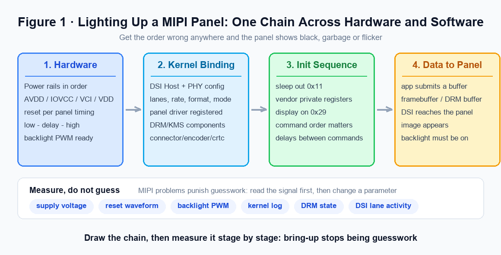
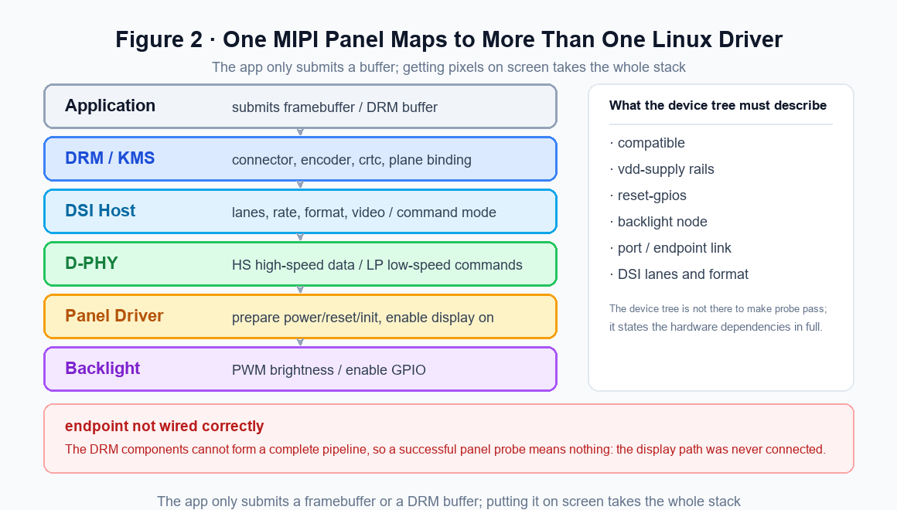
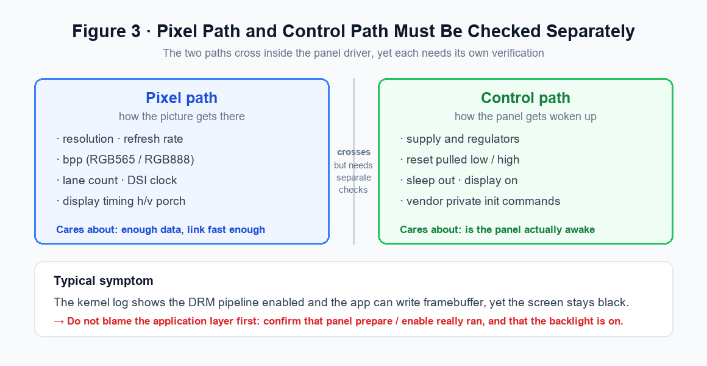
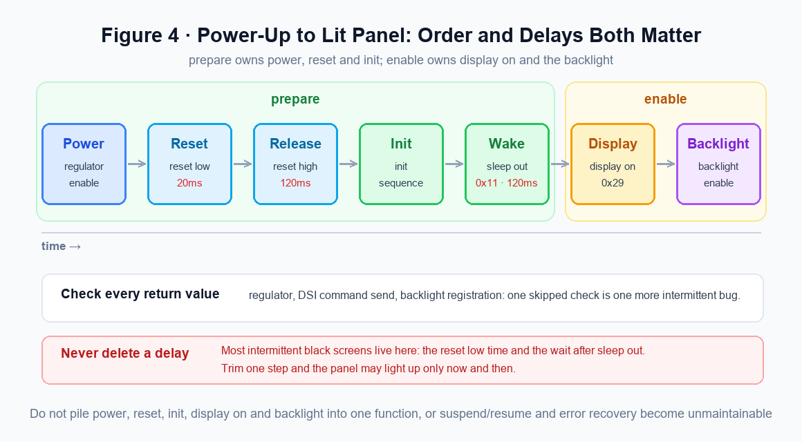
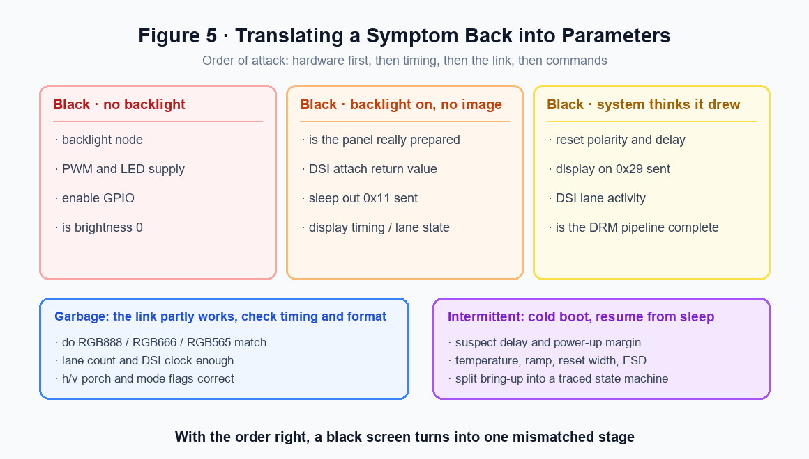
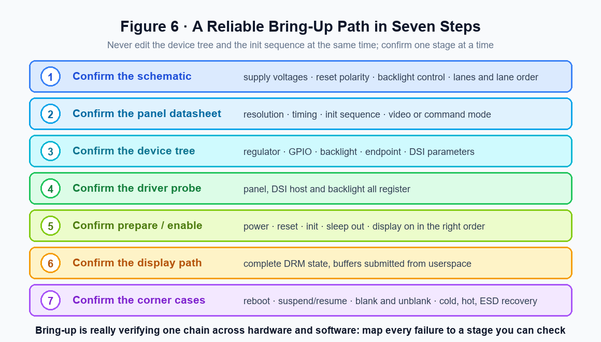

<script type="application/ld+json">
{
  "@context": "https://schema.org",
  "@type": "FAQPage",
  "mainEntity": [
    {
      "@type": "Question",
      "name": "The screen is completely dark. What should I check first?",
      "acceptedAnswer": {
        "@type": "Answer",
        "text": "Split the black screen into three cases before you open the driver. No backlight: check the backlight node, the PWM and LED supply, the enable GPIO, and whether the brightness value is 0. Backlight on but no image: check whether the panel really went through prepare, the DSI attach return value, whether sleep out was sent, and the display timing and lane state. The system believes it is displaying but the panel does not respond: check reset polarity and delay, whether display on was sent, DSI lane activity, and whether the DRM pipeline is complete."
      }
    },
    {
      "@type": "Question",
      "name": "The panel driver probes successfully. Does that mean the driver is fine?",
      "acceptedAnswer": {
        "@type": "Answer",
        "text": "No. A successful probe only means the device tree and the driver registration did not conflict; whether the link is actually connected is a separate question. The classic case is a wrong endpoint: the DRM components cannot build a complete pipeline, yet the panel driver still probes. The evidence you want is a complete DRM state, plus confirmation that prepare and enable were really executed."
      }
    },
    {
      "@type": "Question",
      "name": "I copied the vendor init sequence. Why does the panel still not light up?",
      "acceptedAnswer": {
        "@type": "Answer",
        "text": "Vendor sequences often come from a reference platform, so check three things before porting. Whether the command format matches your driver framework, for example DCS command, generic write or long packet. Whether the key commands need a delay between them, especially reset, sleep out and display on. And whether this panel is video mode or command mode, needing burst, sync pulse or a non-continuous clock. Get one of the three wrong and you may see a panel that lights up occasionally, one that goes dark again, or a backlight with no image."
      }
    },
    {
      "@type": "Question",
      "name": "What does garbage on screen tell me, and where do I look?",
      "acceptedAnswer": {
        "@type": "Answer",
        "text": "Garbage is often more useful than a black screen, because it means part of the link is working. Look at whether the pixel format matches (RGB888, RGB666, RGB565), whether the lane count and DSI clock are sufficient, the screen mode flags, and the h/v porch parameters. Configuring RGB888 as RGB666, changing four lanes to two without adjusting the clock, and a wrong video burst setting are all common causes."
      }
    },
    {
      "@type": "Question",
      "name": "The kernel log says the DRM pipeline is enabled and the app can write framebuffer, but the screen is black. Should I suspect the application layer?",
      "acceptedAnswer": {
        "@type": "Answer",
        "text": "Not first. Confirm that the panel's prepare and enable really ran, and that the backlight is on. A working pixel path does not mean a working control path: the panel may never have been woken up, or the backlight may simply be off. Verifying the two paths separately is far more effective than adding more logging in the application."
      }
    },
    {
      "@type": "Question",
      "name": "The panel occasionally fails on a cold boot or after resume. How do I find it?",
      "acceptedAnswer": {
        "@type": "Answer",
        "text": "Suspect timing margin and power-up order first. Check the reset pulse width, the wait after sleep out and the regulator ramp time, and keep temperature, supply ramp, reset pulse width and post-ESD recovery in mind as variables. The practical approach is to turn bring-up into a state machine with a trace at every key stage, find which stage stalls, then put a scope on the supplies and reset to decide whether a hardware condition was unmet or a software command never went out."
      }
    }
  ]
}
</script>
# Bringing Up a MIPI Panel: The Full Chain from Power and Reset to DRM Output

!!! abstract "Quick answer"
    Panel bring-up is not about getting one function right. It is a chain across hardware and software, and every stage has to be verified on its own. Get the order wrong anywhere and the panel shows a black screen, garbage or flicker.

    - The chain has four stages: hardware conditions → kernel binding → init sequence → data output. Walk it in order; do not jump ahead and guess at the driver code.
    - The pixel path carries the picture, the control path wakes the panel. Verify them separately.
    - Backlight on but no image usually means the init sequence or the DSI parameters; no backlight at all points at the PWM and the enable GPIO.
    - A successful probe does not prove the link works: with a wrong endpoint the DRM components cannot build a complete pipeline, yet the driver still probes.
    - Reset low time, the wait after sleep out, the lane count and the mode flags are where intermittent failures hide in production.

A MIPI panel that refuses to light up is usually not a case of "the driver is wrong". The bring-up path runs across the power rails, reset, the backlight, the DSI host, the PHY, the panel init sequence, the DRM/KMS framework, and the userspace path that submits buffers. Get the order wrong at any one of them and the symptom can be a black screen, garbage, flicker, or a boot that only sometimes fails.

The more reliable engineering approach is to treat bring-up as a chain that can be verified: confirm the hardware conditions first, then the kernel binding, then the init sequence, and only then that pixel data actually reaches the panel.

## 1. Bring-Up Is Not a Single Function Call: Split the Chain into Four Stages

The biggest difference between a MIPI DSI panel and an RGB or LVDS panel is that it does not end with pushing out a pixel clock and a set of data lines. A DSI panel first needs a command sequence to reach its working state, and only after that does it accept a video stream or command-mode writes. Before the panel lights up, several things have to happen.

<figure markdown="span" class="displaywiki-figure">
  [{ width="760" loading="lazy" }](mipi-panel-bringup-fig1-chain.png){ .displaywiki-image-link title="Open full-size image" }
  <figcaption>Figure 1. The four stages of bring-up: hardware conditions → kernel binding → init sequence → data output. Fail any one and the panel shows black, garbage or flicker.</figcaption>
</figure>

- **Hardware conditions**: the power rails come up in the required order, under their real names (AVDD, IOVCC, VCI, VDD); the reset pin follows the panel vendor's timing of low, delay, high; the backlight PWM is controllable.
- **Kernel binding**: the DSI host and PHY are configured with the right lane count, rate, format and mode; the panel driver registers; DRM/KMS binds connector, encoder, crtc and plane.
- **Init sequence**: sleep out, display on, and the vendor's private register writes; the delays between key commands cannot be dropped.
- **Data output**: the application submits a buffer, DSI actually carries the picture to the panel, and by that point the backlight must already be on.

Beginners tend to start by guessing at the panel driver. The debugging order should be the opposite: use a multimeter, a scope and the logs to confirm the basic conditions of the chain first, and look at the driver logic after that. A dark panel does not mean there are no pixels; it may simply be that the backlight is off. Garbage does not necessarily mean a wrong init command; it may be the DSI bit clock or the display timing.

## 2. Get the Layering Right First: Pixel Path and Control Path

In a Linux system a single MIPI panel rarely maps to a single driver file. The application only submits a framebuffer or a DRM buffer; getting the picture onto the panel takes DRM/KMS, the DSI host, the D-PHY, the panel driver and the backlight driver together.

<figure markdown="span" class="displaywiki-figure">
  [{ width="760" loading="lazy" }](mipi-panel-bringup-fig2-driver-stack.png){ .displaywiki-image-link title="Open full-size image" }
  <figcaption>Figure 2. One MIPI panel maps to more than one Linux driver; if any layer is not connected, the picture never reaches the panel.</figcaption>
</figure>

**Think of the pixel path and the control path separately.** The pixel path covers how the picture gets there and cares about resolution, refresh rate, bpp, lane count and DSI clock. The control path covers how the panel gets woken up and cares about the supplies, reset, sleep out, display on and the vendor's private init commands.

<figure markdown="span" class="displaywiki-figure">
  [{ width="760" loading="lazy" }](mipi-panel-bringup-fig3-two-paths.png){ .displaywiki-image-link title="Open full-size image" }
  <figcaption>Figure 3. The pixel path carries the picture and the control path wakes the panel; they cross inside the driver but must each be confirmed on their own.</figcaption>
</figure>

The two paths cross constantly, but they have to be verified one at a time. A very typical scene: the kernel log shows the DRM pipeline enabled and the application can write framebuffer, yet the screen stays black. Do not start by suspecting the application layer. Confirm first that the panel's prepare and enable really ran, and that the backlight is on.

**Timing parameters are not just for the display framework.** The usual panel parameters include hactive, vactive, hsync, hbp, hfp, vsync, vbp, vfp and the refresh rate, and they end up deciding the DSI bandwidth and the timing the panel receives. Copy them wrong and some panels show nothing at all, while others show edge jitter, wrong colours or intermittent garbage.

A simplified DSI bandwidth estimate looks like this:

```c
unsigned long calc_dsi_bitrate(unsigned int htotal,
                               unsigned int vtotal,
                               unsigned int fps,
                               unsigned int bpp,
                               unsigned int lanes)
{
    unsigned long pixel_rate = htotal * vtotal * fps;  /* total pixel clock */
    unsigned long raw_rate = pixel_rate * bpp;         /* raw, undivided bandwidth */

    return raw_rate / lanes;                           /* averaged across lanes */
}
```

Real silicon also accounts for blanking, burst mode, PHY limits and vendor compensation parameters, but this estimate is enough to tell quickly whether your lane count and rate are wildly off.

## 3. In the Driver, Order and Binding Matter Most

What MIPI panel drivers fear most is the case where everything looks written but the execution order is wrong. A regulator enabled only after reset is pulled. A DCS command sent before the post-reset delay has elapsed. A failed DSI attach whose return value is never checked. A backlight node that was never bound, while the panel is blamed for not lighting up.

### 3.1 The Device Tree Describes the Hardware Relationships

The device tree is not there to make probe pass. It is there to describe the hardware dependencies in full. A panel node should at least express compatible, the supplies, reset-gpios, the backlight, the port connection, and the lane count and format the DSI host needs.

```dts
panel@0 {
    compatible = "vendor,example-mipi-panel";
    reg = <0>;
    reset-gpios = <&gpio3 12 GPIO_ACTIVE_LOW>;
    backlight = <&backlight>;
    vdd-supply = <&vcc_lcd>;

    port {
        panel_in: endpoint {
            remote-endpoint = <&dsi_out>;  /* linked to the DSI host output */
        };
    };
};
```

If the endpoint is not wired correctly, the DRM components may fail to build a complete pipeline. A successful panel probe then means nothing, because the display path was never connected.

### 3.2 prepare and enable Each Do Their Own Job

In the DRM panel model, prepare normally handles power, reset and the init commands, while enable handles display on and switching on the backlight. Do not pile everything into a single function, or suspend/resume, blank/unblank and error recovery become unmaintainable.

```c
static int example_panel_prepare(struct drm_panel *panel)
{
    struct example_panel *ctx = to_example_panel(panel);

    regulator_enable(ctx->vdd);              /* bring up the panel supply */
    gpiod_set_value(ctx->reset, 1);          /* assert reset */
    msleep(20);                              /* panel reset low time */
    gpiod_set_value(ctx->reset, 0);          /* release reset */
    msleep(120);                             /* let the internal circuits settle */

    example_send_init_sequence(ctx);         /* vendor init commands */
    mipi_dsi_dcs_exit_sleep_mode(ctx->dsi);  /* leave sleep mode */
    msleep(120);                             /* mandatory wait after sleep out */

    return 0;
}
```

<figure markdown="span" class="displaywiki-figure">
  [{ width="760" loading="lazy" }](mipi-panel-bringup-fig4-order.png){ .displaywiki-image-link title="Open full-size image" }
  <figcaption>Figure 4. Order and delays from power-up to a lit panel: prepare owns power, reset and init, enable owns display on and the backlight.</figcaption>
</figure>

What matters here is not the API names but the order, the delays and the error handling. In a real project every step should have its return value checked, especially the regulator, the DSI command send and the backlight registration.

### 3.3 Never Copy an Init Sequence Blindly

Vendor init sequences usually come from a reference platform and may carry SoC-specific, PCB-specific or gamma-specific values. Three things deserve attention when porting one.

- **Does the command format match the driver framework**, for example DCS command, generic write or long packet?
- **Do the key commands need a delay between them**, especially reset, sleep out and display on?
- **Is this panel in video mode or command mode**, and does it need burst, sync pulse or a non-continuous clock?

Get one of these wrong and you get a panel that lights up now and then, a panel that lights up and then goes out, or a backlight with no image.

## 4. Debug From Measurable Signals

The worst thing you can do with a MIPI problem is change parameters by feel. The signals you can actually measure are the supply voltages, the reset waveform, the backlight PWM, the kernel log, the DRM state and DSI lane activity. Start from the cheap, high-certainty checks.

<figure markdown="span" class="displaywiki-figure">
  [{ width="760" loading="lazy" }](mipi-panel-bringup-fig5-debug.png){ .displaywiki-image-link title="Open full-size image" }
  <figcaption>Figure 5. Translating a symptom back into parameters: split the black screen into three cases, check timing and format for garbage, and suspect timing margin for intermittent faults.</figcaption>
</figure>

### 4.1 Split a Black Screen into Three Cases

A black screen is not one fault. Split it into three cases at the very least.

- **No backlight**: check the backlight node, the PWM and LED supply, the enable GPIO, and whether the brightness value is 0.
- **Backlight on, no image**: check whether the panel really went through prepare, the DSI attach return value, whether sleep out was sent, and the display timing and lane state.
- **The system believes it is displaying but the panel does not respond**: check reset polarity and delay, whether display on was sent, DSI lane activity, and whether the DRM pipeline is complete.

A few commands confirm the DRM and log state quickly:

```bash
dmesg | grep -Ei "drm|dsi|panel|backlight"  # filter display-related messages
cat /sys/kernel/debug/dri/0/state            # inspect the DRM pipeline state
cat /sys/class/backlight/*/brightness        # confirm the backlight value
```

If debugfs is not mounted, mount it first:

```bash
mount -t debugfs none /sys/kernel/debug     # enable the kernel debug filesystem
```

### 4.2 Garbage Usually Means Going Back to Timing and Format

Garbage is often more useful than a black screen, because it proves at least part of the link is working. Look at the pixel format (do RGB888, RGB666 and RGB565 match?), the lane count and DSI clock, the screen mode flags, and the h/v porch parameters.

RGB888 configured as RGB666, four lanes changed to two without adjusting the clock, a wrong video burst setting: all of these show up as a corrupted image.

### 4.3 Intermittent Problems Point at Timing Margin

If the panel occasionally fails on a cold boot, or fails to resume from suspend, check the delays and the power-up order first. In production, intermittent faults are more dangerous than reproducible ones, because they can depend on temperature, supply ramp, reset pulse width or recovery after ESD.

A practical strategy is to turn bring-up into a state machine and trace every stage:

```c
enum panel_stage {
    STAGE_POWER_ON,
    STAGE_RESET_DONE,
    STAGE_INIT_SENT,
    STAGE_SLEEP_OUT,
    STAGE_DISPLAY_ON,
};

static void panel_trace(enum panel_stage stage)
{
    pr_info("panel stage=%d\n", stage);  /* log the bring-up stage to find the stall */
}
```

With stage logs in place, plus a scope on the supplies and reset, you can tell whether a hardware condition was unmet or a software command never went out.

## 5. A Bring-Up Path That Works

In a real project, work through the stages below in order instead of editing the device tree and the init sequence at the same time.

<figure markdown="span" class="displaywiki-figure">
  [{ width="760" loading="lazy" }](mipi-panel-bringup-fig6-roadmap.png){ .displaywiki-image-link title="Open full-size image" }
  <figcaption>Figure 6. A reliable bring-up path: seven steps, confirmed one at a time rather than all at once.</figcaption>
</figure>

1. **Confirm the schematic**: supply voltages, reset polarity, backlight control, lane count and lane order.
2. **Confirm the panel datasheet**: resolution, timing, init sequence, video or command mode.
3. **Confirm the device tree**: regulator, GPIO, backlight, endpoint, DSI parameters.
4. **Confirm the driver probe**: panel, DSI host and backlight all register.
5. **Confirm prepare / enable**: power, reset, init, sleep out and display on in the right order.
6. **Confirm the display path**: complete DRM state, buffers submitted from userspace.
7. **Confirm the corner cases**: reboot, suspend/resume, blank and unblank, cold and hot temperature, recovery after ESD.

With the order right, the problem changes from "everything is dark" into "one specific stage does not match". That step on its own is usually worth more than ten rounds of parameter tweaking.

## 6. Conclusion

Bringing up a MIPI panel is really about verifying one chain across hardware and software. The mature engineering method is not remembering how some panel driver is written, but being able to map every failure to a stage you can verify: power, reset, backlight, init commands, DSI parameters, DRM binding and the userspace path.

Once you can split that chain, measure it stage by stage and confirm it stage by stage, panel bring-up stops being guesswork and becomes a repeatable engineering process.

## 7. Frequently Asked Questions

??? question "Q1: The screen is completely dark. What should I check first?"
    Split the black screen into three cases before you open the driver. No backlight: check the backlight node, the PWM and LED supply, the enable GPIO, and whether the brightness value is 0. Backlight on but no image: check whether the panel really went through prepare, the DSI attach return value, whether sleep out was sent, and the display timing and lane state. The system believes it is displaying but the panel does not respond: check reset polarity and delay, whether display on was sent, DSI lane activity, and whether the DRM pipeline is complete.

??? question "Q2: The panel driver probes successfully. Does that mean the driver is fine?"
    No. A successful probe only means the device tree and the driver registration did not conflict; whether the link is actually connected is a separate question. The classic case is a wrong endpoint: the DRM components cannot build a complete pipeline, yet the panel driver still probes. The evidence you want is a complete DRM state, plus confirmation that prepare and enable were really executed.

??? question "Q3: I copied the vendor init sequence. Why does the panel still not light up?"
    Vendor sequences often come from a reference platform, so check three things before porting. Whether the command format matches your driver framework, for example DCS command, generic write or long packet. Whether the key commands need a delay between them, especially reset, sleep out and display on. And whether this panel is video mode or command mode, needing burst, sync pulse or a non-continuous clock. Get one of the three wrong and you may see a panel that lights up occasionally, one that goes dark again, or a backlight with no image.

??? question "Q4: What does garbage on screen tell me, and where do I look?"
    Garbage is often more useful than a black screen, because it means part of the link is working. Look at whether the pixel format matches (RGB888, RGB666, RGB565), whether the lane count and DSI clock are sufficient, the screen mode flags, and the h/v porch parameters. Configuring RGB888 as RGB666, changing four lanes to two without adjusting the clock, and a wrong video burst setting are all common causes.

??? question "Q5: The kernel log says the DRM pipeline is enabled and the app can write framebuffer, but the screen is black. Should I suspect the application layer?"
    Not first. Confirm that the panel's prepare and enable really ran, and that the backlight is on. A working pixel path does not mean a working control path: the panel may never have been woken up, or the backlight may simply be off. Verifying the two paths separately is far more effective than adding more logging in the application.

??? question "Q6: The panel occasionally fails on a cold boot or after resume. How do I find it?"
    Suspect timing margin and power-up order first. Check the reset pulse width, the wait after sleep out and the regulator ramp time, and keep temperature, supply ramp, reset pulse width and post-ESD recovery in mind as variables. The practical approach is to turn bring-up into a state machine with a trace at every key stage, find which stage stalls, then put a scope on the supplies and reset to decide whether a hardware condition was unmet or a software command never went out.

👉 Find more [MIPI DSI Display](https://viewedisplay.com/mipi-dsi-display/)

## Related reading

- [MIPI Interfaces Explained: DSI, CSI-2, D-PHY, and C-PHY](mipi-interface-basics.md)
- [DSI Video Mode vs Command Mode: From GRAM and TE to Panel Bring-up](dsi-video-mode-vs-command-mode.md)
- [LCD Panel Timing Parameters and MIPI DSI Bandwidth](lcd-panel-timing-parameters.md)
- [Display Interfaces Explained: MCU, RGB, LVDS, MIPI, SPI, and More](display-interface-guide.md)

## References

Standards, specifications and material referenced in this article:

- [MIPI DSI specification (MIPI Alliance)](https://www.mipi.org/specifications/dsi)
- [MIPI D-PHY specification (MIPI Alliance)](https://www.mipi.org/specifications/d-phy)
- [Linux DRM KMS helper documentation, including the MIPI DSI subsystem](https://docs.kernel.org/gpu/drm-kms-helpers.html)
- [Linux kernel MIPI DSI mode flags](https://elixir.bootlin.com/linux/latest/source/include/drm/drm_mipi_dsi.h)

!!! info "Can't find what you need?"
    If you need more products, resources or support, please contact our team:

    [**:material-archive-arrow-down: Knowledge Base**](../../knowledge/tags.md){ .md-button .md-button--primary }
    [**:material-magnify: Products & Solutions**](https://viewedisplay.com/){ .md-button }
    [**:material-email: Contact Support**](mailto:support@viewedisplay.com){ .md-button }
