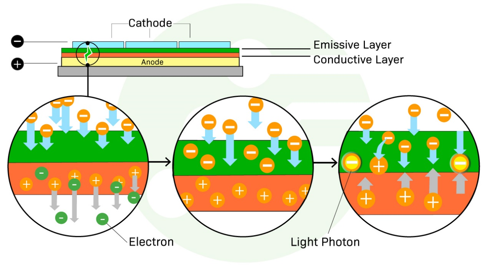

# OLED Display Structure, Operation, and LCD Comparison

!!! abstract "Quick answer"
    This guide explains how OLED displays work, the relevant design trade-offs, and the points engineers should verify when selecting a display solution.

## Key Takeaways

- Learn how OLED displays work, key trade-offs, applications, and engineering selection criteria.
- Use the guidance below to compare the relevant technologies and design trade-offs.
- Validate optical, electrical, mechanical, environmental, and production requirements before final selection.

## OLED

OLED (Organic Light Emitting Diode) displays are self-illuminating due to their organic material, so there's no need for a backlight to achieve maximum visibility in all environments. This allows less power consumption, better contrast, deeper blacks, more vibrant colors and for OLEDs to be significantly thinner than standard LCD modules with backlight.

### The OLED Layer Structure

The main components of an OLED display are the cathode, anode, emissive layer, and the conductive layer. The anode and a cathode are between a glass top plate (seal) and a glass bottom plate (substrate).

<figure markdown="span" class="displaywiki-figure">
  [{ width="760" loading="lazy" }](oled-display-basics-the-oled-layer-structure.jpeg){ .displaywiki-image-link title="Open full-size image" }
  <figcaption>The OLED Layer Structure</figcaption>
</figure>

OLEDs use a technique known as electroluminescence, in which material emits light in response to the flow of electric current. When electric current is applied to the two conductors, the organic material produces a bright, electro-luminescent light. When energy passes from the negatively charged cathode layer to the anode layer, it stimulates the organic material sandwiched between them, which emits light that is visible through the outermost layer of glass.

<figure markdown="span" class="displaywiki-figure">
  [{ width="760" loading="lazy" }](oled-display-basics-electrical-current-flows-from-the-cathode-to-the-anode-through-the-org.jpeg){ .displaywiki-image-link title="Open full-size image" }
  <figcaption>Electrical current flows from the Cathode to the Anode through the organic layers</figcaption>
</figure>

As electricity starts to flow from the cathode to the anode, the cathode gains electrons while the anode loses electrons, causing electron removal (electron holes) from the conductive layer.

Electrons encounter electron holes at the edges between the emissive and conductive layers causing electrons to recombine and release their extra energy in the form of a photon of light.

### OLED vs. LCD

OLED has better image quality, contrasts, viewing angles, color accuracy, flexibility, and power-efficiency in comparison to LCD. OLED provides better color contrasts because it can create a pure black unlike LCD displays. LCD only works with backlighting. Backlighting is when a light is put behind a device in order to display an image. Because this backlight is always on, LCDs can never achieve a full-black like an OLED can. An OLED can show deeper and truer black levels.

<figure markdown="span" class="displaywiki-figure">
  [{ width="760" loading="lazy" }](oled-display-basics-lcd-and-oled-comparison.png){ .displaywiki-image-link title="Open full-size image" }
  <figcaption>LCD and OLED Comparison</figcaption>
</figure>

Fig. 3 LCD and OLED Comparison

Also because of the LED backlight, the power consumption of the OLED is less than that of LCD. OLED only emits light when electric current is passed through, so if there is no current, there is absolutely no light. OLED can also change the brightness of a picture pixel by pixel.  Because of the limitation of the backlight, LCD displays can at best only dim the screen by small regions. This is because the only way to dim the picture is to reduce the brightness of the backlight, and it is not feasible to have a backlight for every pixel.

Other benefits of OLED include less blue light emitted because of the lack of a backlight, a faster refresh rate, and faster response times. The faster refresh rates and response times make it perfect for video games and virtual reality.

Though it has better quality, OLED devices tend to have a more premium price tag. This is why OLED is currently only the main choice for high-end mobile devices and TVs. LCD displays are less expensive, and LCD TVs have nearly as high picture quality. The price of OLED products may come down in the future, but hasn’t shown indications of happening soon. LCD panels also have the added benefit of having a higher maximum luminance making it better for bright spaces or places with direct sunlight. Another disadvantage of OLED is that there is risk for burn-in. Burn-in is when the shadow of an image is permanently left on the screen even after the picture has been changed. It is caused by the pixels in that region being used too much making them not as bright as before. However, burn-in only happens after watching the same channel eight hours a day for a long time. Most of the time, the after-image fades quickly.

Another competitor of OLED worth mentioning are QD-LED or quantum dot displays. Instead of using OLED emitters, these displays use quantum dots, nanoparticles that emit light, to produce images.

Which devices have OLED screens?

Samsung has been making OLED smartphones the longest. The Samsung Galaxies are known for their high-resolution OLED screens. High-end Apple smartphones also have OLED screens. Sony, Panasonic, and LG make ultra-high definition (UHD) OLED TVs. LG Display is one of the largest manufactures of the OLED panels that these other companies use for their devices. All these companies have also started making rollable devices like TVs.

What should I expect from an OLED picture?

You should expect high color contrasts and wider viewing angles. The true blacks of the OLED displays make the other colors stand out more. OLEDs also lose less color contrast at wider viewing angles compared to LCDs. LCDs are best viewed from the center and lose color contrast quickly as the angle increases. OLED technology is also improving rapidly. OLEDs now have a larger color gamut (selection of colors) than before as well as higher HDR and faster response times.

Should I buy an OLED device?

Yes. If the higher price is not an issue, choose OLED every time. The color contrasts, flexibility, and power efficiency are unparalleled by LCD displays. OLED has true blacks and is much thinner than other displays because there is no need for a backlight. It also can be made into foldable or rollable devices and emits less blue light than other devices. The picture quality of OLED is truly unmatched.

### How does OLED work?

OLED stands for Organic Light-Emitting Diode (OLED). It is also known as organic electroluminescent (EL) diode. OLED is a relatively new type of display for televisions, smartphones, and laptops. After being invented in 1987, OLED is already one of the two top display technologies in the industry. This display technology uses organic (carbon-containing) compounds that emit light when a current is passed through it. Unlike LCD (Liquid Crystal Display) to use RGB (Red, Green, Blue) color filter before white light source to produce full color, an OLED display uses OLED emitters to produce its own light.

There are many different types of OLED technology. The most common type of OLED is AMOLED or active-matrix OLEDs which is the main type used in OLED TV screens and phones. AMOLED uses thin-film transistors (TFTs) as semiconductors which makes the display much more efficient. There are also passive-matrix OLEDs (PMOLED) which don’t have a thin film transistor. PMOLED are easier to make, but are not as energy-efficient as AMOLEDs. There are also PLEDs which are polymer light-emitting diodes or PLED as well as quantum dot OLEDs (QD-OLED). These QD-OLEDs use both quantum dots, nanocrystals that also emit light, as well as traditional OLED material.

What’s “organic” about OLEDs?

OLED In this case, organic refers to its chemistry definition: molecules that consist of chains or rings of carbon along with other elements. These organic molecules have electroluminescence meaning they light up in response to a current.

How does an LED work?

LED stands for Light Emitting Diode. This refers to any system with two electrodes that emits light in the presence of an electric current. The electrodes are of opposite charges. The positively charged electrode is called the cathode while the negatively charged electrode is the anode. In between the electrodes are the organic layers. Therefore, when the electrons go from the cathode to anode creating a current, they pass through the organic materials which then emit colored light.

Parts of an OLED

OLED panels consist of six layers. The outside most layers are the seal and the substrate. These are made out of either plastic or glass. The substrate is the foundation of the OLED and the seal protects the outside. In between those two layers are the cathode and the anode. In the very center are the two layers of organic molecules, the emissive layer and the conductive layer.

<figure markdown="span" class="displaywiki-figure">
  [{ width="760" loading="lazy" }](oled-display-basics-how-does-an-oled-display-work.png){ .displaywiki-image-link title="Open full-size image" }
  <figcaption>How does an OLED display work?</figcaption>
</figure>

OLED works like an LED but uses organic molecules instead of other semiconductors to produce light. Electricity flows from the cathode to the anode through the emissive and conductive layers producing colored light. The primary OLED materials are yellow and blue. Color filters are then used to make the rest of the color.

Advantages of OLEDs

OLED display technology has extremely high image quality and wide viewing angles. That is why it is used in high end products like the newest and most premium Apple phones. Because each pixel in an OLED display can be controlled individually, OLED displays have higher resolution. Also, OLEDs don’t have a backlight, so its power consumption is also less than LCD. They are also energy-efficient displays because instead of having a backlight on all the time, energy is only emitted when a pixel is turned on. Also because of the lack of a backlight, there are flexible OLED displays. Backlights limit designers to only flat displays. OLED emits its own light, so its devices can be rollable or foldable.

In addition, OLED also has a faster response time compared to LCD making it ideal for gaming and virtual reality. They can be also extremely long-lasting with a lifespan of around 22 years if used 6 hours a day. OLEDs now have a larger color gamut (selection of colors) than before as well as higher HDR (High Contrast Ratio).

Is OLED really better than LCD?

Since the old cathode ray tube (CRT) became obsolete, LCDs and OLEDs have been the biggest display technologies. However, OLED has higher color contrast, viewing angles, flexibility, refresh rates, and power efficiency compared to LCD. Because LCD only works with backlighting where a light is put behind the device in order to display an image, they can never achieve a full-black like an OLED can. An OLED can show deeper and truer blacklevels. Also because of the LED backlight, the power consumption of the OLED is less than that of LCD. OLED only emits light when a current is passed through, so if there is no current, there is absolutely no light. OLED can also change the brightness of a picture pixel by pixel. Because of the limitation of the backlight, LCD displays can at best only dim the screen by small regions. This is because the only way to dim the picture is to reduce the brightness of the backlight, and it is not feasible to have a backlight for every pixel. Another benefit of OLED is that there is less blue light emitted compared to LCD because there is no backlight.

What are the benefits of OLED Display?

The main benefits of the OLED display are high color contrasts, wider viewing angles, and flexibility. The true blacks of the OLED displays make the other colors stand out more. OLEDs also lose less color contrast at wider viewing angles compared to LCDs. LCDs only have high color contrast when viewed head-on. OLEDs are also noticeably thinner than other displays because they don’t need a backlight. The lack of a backlight also allows them to be made on curved surfaces, so rollable and foldable devices are made possible.

How is OLED different from LED?

OLED uses organic materials to emit light while LED uses other compound semiconductors. OLED is also able to be made into devices on their own while LED can only be used as a backlight for LCD displays.

Is OLED screen bad for the eyes?

OLED screens are better for the eyes compared to other devices like LCD because they emit less blue light. The backlights of other displays emit lots of blue light. OLED has much less blue light (34%) compared to LCD displays (65%).

## Conclusion

The color contrasts, flexibility, and power efficiency of OLED are unparalleled by LCD displays. OLED has true blacks and is much thinner than other displays because there is no need for a backlight. It also can be made into foldable or rollable devices and emits less blue light than other devices.

## Related reading

- [IPS, TN, VA, and FFS TFT Panel Technologies Compared](tft-panel-technologies.md)
- [a-Si, LTPS, and IGZO TFT Backplanes Compared](tft-backplane-technologies.md)
- [Transmissive, Reflective, and Transflective LCDs Compared](transmissive-reflective-transflective.md)
