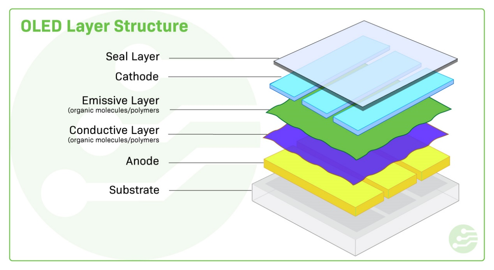
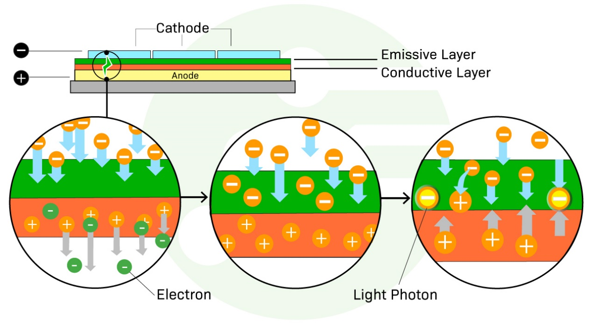
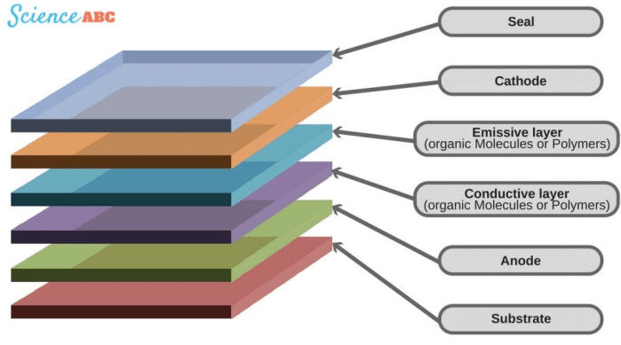
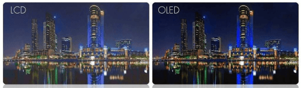

# OLED Display Structure, Operation, and LCD Comparison

!!! abstract "Quick answer"
    OLED is a self-emissive device in which every pixel is controlled independently, so it can deliver true black, very high contrast, wide viewing angles, extreme thinness, and a bendable form. That is the fundamental reason it has become the first choice for high-end phones and TVs, at the price of higher cost, a long-term burn-in risk, and peak brightness that is still below LCD.

## Key Takeaways

- The essential difference between OLED and LCD is whether a backlight is needed: LCD relies on a backlight plus liquid-crystal modulation, while OLED emits directly from organic material.
- The OLED layer stack consists of cathode, anode, emissive layer, and conductive layer, and electrons and holes recombine in the emissive layer to release photons.
- OLED splits into sub-types such as AMOLED, PMOLED, and QD-OLED, and AMOLED is the mainstream for phones and TVs.
- Against LCD, OLED offers true black, extremely high contrast, faster response, and a bendable form, but costs more, has lower peak brightness, and carries a burn-in risk under long bright operation.
- The selection decision should combine resolution, lifetime requirement, outdoor readability, and budget.

## 1. What OLED Is

OLED stands for organic light-emitting diode, and is also called an organic electroluminescent (EL) device. It is built from carbon-containing organic compounds, and when current flows, the organic layers emit light directly without any additional backlight module.

Because it is self-emissive, an OLED display naturally offers:

- **True black**: a pixel that is not emitting is pure black, and contrast can exceed 1,000,000 : 1.
- **Thinner construction**: there is no backlight module, so total thickness can be compressed to the millimeter range.
- **Flexibility**: replace the glass substrate with a flexible base material and you get curved, foldable, or rollable screens.
- **Lower power**: a dark image draws almost no power.

An LCD must use its backlight to illuminate the whole liquid-crystal layer, so it cannot switch off a single pixel and black is always a grayish black.

## 2. OLED Layer Structure

The core of an OLED display is the **cathode, anode, emissive layer, and conductive layer**, sealed between an upper and a lower substrate:

<figure markdown="span" class="displaywiki-figure">
  [{ width="760" loading="lazy" }](oled-display-basics-the-oled-layer-structure.jpeg){ .displaywiki-image-link title="Open full-size image" }
  <figcaption>OLED layer structure: substrate, anode, hole injection and transport layers, emissive layer, electron transport and injection layers, cathode, and encapsulation.</figcaption>
</figure>

- **Substrate**: glass or flexible plastic, acting as the supporting base.
- **Anode**: usually transparent ITO, connected to the positive side.
- **Hole injection layer (HIL) / hole transport layer (HTL)**: carry holes from the anode to the emissive layer.
- **Emissive layer (EML)**: the organic light-emitting material, where light is actually generated.
- **Electron transport layer (ETL) / electron injection layer (EIL)**: carry electrons from the cathode to the emissive layer.
- **Cathode**: a thin metal or alloy layer, connected to the negative side, reflecting light and injecting electrons.
- **Encapsulation**: blocks water and oxygen, and is critical to lifetime.

## 3. How OLED Works

Electroluminescence in an OLED works like this: electrons travel from the cathode toward the anode while holes travel from the anode toward the cathode; the two meet and recombine in the **emissive layer**, releasing the surplus energy as photons.

<figure markdown="span" class="displaywiki-figure">
  [{ width="760" loading="lazy" }](oled-display-basics-electrical-current-flows-from-the-cathode-to-the-anode-through-the-org.jpeg){ .displaywiki-image-link title="Open full-size image" }
  <figcaption>Carrier flow across the OLED layers, from the cathode through the organic stack to the anode.</figcaption>
</figure>

The steps in detail:

1. Voltage is applied between the cathode and the anode.
2. The cathode releases electrons, which enter the emissive layer through the ETL.
3. The anode draws electrons out of the HTL, leaving holes behind that migrate to the emissive layer.
4. Electrons and holes recombine inside the EML, exciting the organic molecules to an excited state.
5. As the excited molecules fall back to the ground state they release photons, which leave through the transparent anode and the substrate.
6. The emission color is set by the energy bands of the organic molecules themselves; the common primary emitters are blue and yellow-green, and the remaining colors are produced through color filter layers.

<figure markdown="span" class="displaywiki-figure">
  [{ width="760" loading="lazy" }](oled-display-basics-how-does-an-oled-display-work.png){ .displaywiki-image-link title="Open full-size image" }
  <figcaption>How a single OLED pixel produces light.</figcaption>
</figure>

## 4. OLED versus LCD

OLED and LCD are both mainstream flat-panel technologies, but the self-emissive versus backlit difference shows up clearly across the performance dimensions.

<figure markdown="span" class="displaywiki-figure">
  [{ width="760" loading="lazy" }](oled-display-basics-lcd-and-oled-comparison.png){ .displaywiki-image-link title="Open full-size image" }
  <figcaption>LCD and OLED compared at a glance.</figcaption>
</figure>

The table below compares the metrics engineers usually look at:

| Dimension | OLED | LCD (with backlight) |
| --- | --- | --- |
| Black level | Almost zero (true black) | Limited by backlight leakage |
| Contrast | On the order of 1,000,000 : 1 | On the order of 1000 : 1 |
| Viewing angle | Close to 180° | Color shift and brightness loss off-axis |
| Response time | Microseconds | Milliseconds |
| Thickness | Extremely thin, no backlight | Limited by backlight thickness |
| Curved / foldable | Native support | Difficult |
| Blue-light share | Lower | Higher |
| Peak brightness | Rather low, high-end excepted | High, suited to outdoor use |
| Lifetime | Organic material degrades, burn-in risk | Long-life backlight |
| Cost | Higher | Lower |
| Power | Very low for dark images | Stable, since the backlight stays on |

## 5. OLED Sub-types

OLED is a broad family, and it is split further by driving method, emitting material, and the way color is produced.

### 5.1 AMOLED and PMOLED

- **AMOLED (active-matrix OLED)**: uses a TFT as the switch for every pixel, so each pixel can be controlled independently and precisely. It is the mainstream route for phones and TVs.
- **PMOLED (passive-matrix OLED)**: applies row and column scan signals directly to the OLED. The structure and driving are simple, but once the size grows, refresh rate and uniformity become hard to guarantee, so it is mostly used in small formats such as watches and early MP3 players.

### 5.2 QD-OLED and PLED

- **QD-OLED (quantum-dot OLED)**: uses a blue OLED as the excitation source for a quantum-dot layer that produces red and green, giving a wider color gamut; it is common in high-end TVs.
- **PLED (polymer light-emitting diode)**: uses a polymer as the emitting layer and can be produced by solution processes such as inkjet printing, which suits large flexible panels.
- There are further splits into polymer and small molecule, and into printing and evaporation, which we will not go into here.

## 6. Where OLED Fits

### 6.1 High-end consumer electronics

- Smartphones, laptops, tablets, and VR / AR headsets.
- High-end TVs, especially along the QD-OLED route.

### 6.2 Industrial, automotive, and wearable

- Smartwatches: deep black, high contrast, and a slim form.
- Automotive instrumentation: wide temperature range and wide viewing angle mean OLED is increasingly displacing older technologies.
- Industrial control panels: some high-ambient-light situations are still the strength of LCD, including high-brightness types, so the choice has to be made per scenario.

### 6.3 Where OLED does not fit

- **Long-term display of the same static image** (control-room menus, fuel-pump panels): high burn-in risk.
- **Very bright outdoor light**: LCD, including transflective and high-brightness types, remains the first choice.
- **Highly cost-sensitive mid- and low-end consumer products**: LCD still holds a 3 to 5 times price advantage.

## 7. Blue Light and Eye Health

OLED emits by electroluminescence, and there is no mechanism that forces it to emit blue light throughout. Laboratory measurements commonly put the blue-light share of OLED in the low 30% range, clearly below the 60%+ typical of an LCD backlight. That does not translate directly into being harmless to the eye, but at the same brightness the blue-light dose is lower with OLED.

Note that eye comfort is closely tied to brightness, color temperature, and how long the display is used. With either OLED or LCD you should work at a sensible brightness and take regular breaks.

## 8. Burn-in: Causes and Countermeasures

### 8.1 What burn-in is

OLED burn-in is the loss of emission efficiency in pixels that run bright for a long time, leaving a ghost of the previous image behind after the content changes.

### 8.2 Mitigation

- **Pixel shift**: move the whole image by 1–2 pixels periodically to spread the on-time across neighbouring pixels.
- **On-screen time limits**: make bright UI elements such as logos and status bars vary their opacity or move them regularly.
- **Auto brightness / auto screen-off**: turn the screen off after a period of inactivity, which matters especially for industrial and signage use.
- **Lifetime estimation**: commercial OLED from mainstream makers can exceed 15 years at 6 hours of bright operation per day.

## 9. Selection Guidance

- **Choose OLED**: when high contrast, wide viewing angle, a bendable form, and a thin body matter, and you do not need peak brightness or long-term static content.
- **Choose LCD**: when the budget is tight, the application is bright outdoor use, the same image is shown for long periods, or peak brightness is a hard requirement.
- **Choose QD-OLED or a high-brightness LCD**: only when one dimension of color or brightness has to be pushed to an extreme.

## 10. Frequently Asked Questions

??? question "Q1: Which is actually easier on the eyes, OLED or LCD?"
    There is no absolute answer. At the same brightness, OLED generally has a lower blue-light share than LCD, but OLED is often dimmed by PWM, and a low PWM frequency at low brightness can cause eye strain; a high-brightness LCD is actually easier on the eyes in direct sunlight. The conclusion is that setting the right brightness and controlling how long you look at the screen matters more than the OLED versus LCD choice.

??? question "Q2: What is the essential difference between AMOLED and PMOLED?"
    AMOLED gives every pixel its own TFT, so light can be controlled independently and precisely, which allows larger sizes while keeping uniformity; PMOLED drives the OLED directly by row and column scanning, so the structure and driving are simple, but once the size grows it becomes hard to guarantee lifetime and uniformity. Phones and TVs today are all AMOLED.

??? question "Q3: Are QD-OLED, QLED, and OLED the same thing?"
    No. OLED is the broad self-emissive family; QD-OLED is a combination of OLED and quantum dots, where a blue OLED excites the quantum-dot layer; QLED usually means quantum dots plus an LCD backlight, where the quantum dots act only as a color-conversion layer and do not emit by themselves.

??? question "Q4: Why is OLED often not bright enough outdoors?"
    The peak instantaneous current of OLED is limited by lifetime, which makes full-screen high brightness difficult, and makers also hold back headroom to compensate for degradation of the organic material. LCD, especially a high-brightness or transflective design, is still the strong option for outdoor readability.

??? question "Q5: Is OLED suitable for industrial control or digital signage?"
    Be cautious. Showing the same menu or logo for long periods is the perfect condition for burn-in. If OLED must be used, pair it with pixel shift, automatic screen-off, and opacity changes on the logo, and budget for brightness degradation.

## Related reading

- [IPS, TN, VA, and FFS TFT Panel Technologies Compared](tft-panel-technologies.md)
- [a-Si, LTPS, and IGZO TFT Backplanes Compared](tft-backplane-technologies.md)
- [Transmissive, Reflective, and Transflective LCDs Compared](transmissive-reflective-transflective.md)

!!! info "Can't find what you need?"
    If you need more products, resources or support, please contact our team:

    [**:material-archive-arrow-down: Knowledge Base**](../../knowledge/tags.md){ .md-button .md-button--primary }
    [**:material-magnify: Products & Solutions**](https://viewedisplay.com/){ .md-button }
    [**:material-email: Contact Support**](mailto:support@viewedisplay.com){ .md-button }
