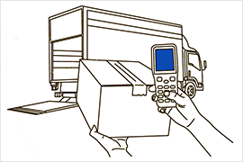
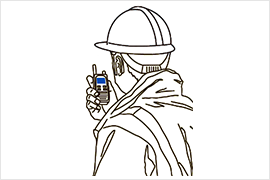
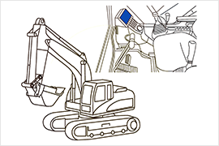
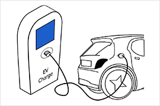
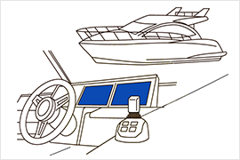

# High-Brightness vs Transflective TFT for Outdoor Displays

!!! abstract "Quick answer"
    This guide explains best TFT display for outdoor use, the relevant design trade-offs, and the points engineers should verify when selecting a display solution.

## Key Takeaways

- Learn best TFT display for outdoor use, key trade-offs, applications, and engineering selection criteria.
- Use the guidance below to compare the relevant technologies and design trade-offs.
- Validate optical, electrical, mechanical, environmental, and production requirements before final selection.

Transflective vs High Brightness TFT LCD, Which is better for Outdoor application?

Comparison of High-Brightness TFT and Transflective TFT for Outdoor Applications

In outdoor display applications, screens must overcome intense ambient light interference to ensure good readability. High-Brightness TFT (Thin Film Transistor) and Transflective TFT are two common solutions. This article provides a detailed comparison of these technologies in terms of brightness, contrast, power consumption, color performance, viewing angle, and suitable scenarios.

Transmissive-type is the most common LCD technology that is widely used in many electrical devices. Transmissive can provide clear images in indoor and dark situations, but meanwhile its display readability gets worse in bright outdoor situations so High Brightness TFT is needed but backlight power increase can improve the display visibility somewhat, but it lead to boost total power consumption; this may be critical impact to battery-driven handheld devices.

Transflective-type is suitable LCD technology to outdoor applications. Transflective has pixels divided into 2 areas, Transmission and Reflection area; the reflection area (reflective electrode) takes a role to reflect incident light from outside. This can give a clear display readability as well as low power consumption.

1. Technical Overview

1.1 High-Brightness TFT

High-brightness TFT enhances screen readability under direct sunlight by increasing the brightness of the backlight and optimizing the optical design. It primarily relies on a powerful LED backlight system to counter ambient light.

Working Principle: It uses the liquid crystal layer to control the passage of backlight while enhancing the display through an intensified backlight system.

1.2 Transflective TFT

Transflective TFT combines the advantages of transmissive and reflective displays. It partially relies on a backlight for brightness and reflects ambient light to enhance display performance, making it particularly suitable for natural light environments.

Working Principle: The screen incorporates a reflective layer that allows part of the backlight to pass through while reflecting external ambient light, thereby improving visibility in outdoor environments.

2. Key Comparison Metrics

2.1 Brightness

High-Brightness TFT:

Relies on a high-power backlight system, with brightness levels typically exceeding 1000 nits.

Transflective TFT:

Brightness depends on the combined effect of the backlight and ambient light. Its inherent backlight brightness is lower, but it can enhance brightness through ambient light reflection.

2.2 Contrast

High-Brightness TFT:

Delivers high contrast through enhanced backlighting and liquid crystal adjustments.

May experience glare interference in high ambient light.

Transflective TFT:

Maintains high contrast due to reflected light in bright conditions.

2.3 Power Consumption

High-Brightness TFT:

Requires strong backlight support to maintain high brightness, leading to higher power consumption.

May require heat management for continuous operation.

Transflective TFT:

Partially relies on ambient light, reducing the need for backlight power.

Low power consumption, making it suitable for long-term and energy-saving applications.

2.4 Viewing Angle

High-Brightness TFT:

May experience slight brightness and color degradation at wider viewing angles.

Transflective TFT:

Offers a wide viewing angle with consistent visual performance from different angles.

Summary:

Transflective TFT has a clear advantage in viewing angles.

High-Brightness TFT excels in direct viewing but is limited from side angles.

3. Application Scenarios Comparison

| Application Scenarios | High-Brightness TFT | Transflective TFT |
| --- | --- | --- |
| Direct Sunlight | Poor performance | Relies on ambient light, performs well but may be affected by light angle |
| Frequent Light Changes | Can quickly adapt to changing lighting through backlight adjustments | Performs well in stable light, requires more backlight compensation when light changes |
| Energy-Saving Applications | High power consumption due to strong backlight | Low power consumption, ideal for energy-sensitive applications |
| All-Weather Outdoor Use | Stable brightness and contrast, but energy and heat challenges | Suitable for sunny environments, needs backlight in low-light conditions |

4. Conclusion and Recommendations

High-Brightness TFT is ideal for devices that require all-weather, versatile outdoor performance, such as outdoor advertisements, automotive displays, and navigation systems. These applications demand high brightness, color accuracy, and contrast, but power consumption and heat management are important design considerations.

Transflective TFT is better suited for energy-efficient applications, such as outdoor wearables and low-power monitoring displays. With sufficient ambient light, it provides a natural viewing experience and significantly reduces power consumption.

The final choice should be based on specific application environments, power budget, visual requirements, and device lifespan considerations.

VIEWE’s Transflective TFT features:

Good display readability in outdoors/bright environments

Keeping low power consumption in any ambient luminance conditions

High image quality in indoors/dark environments on the same level as Transmissive

Less display performance variation between indoor and outdoor conditions

## Applications

<figure markdown="span" class="displaywiki-figure">
  [{ width="760" loading="lazy" }](outdoor-tft-selection-handheld-computing.png){ .displaywiki-image-link title="Open full-size image" }
  <figcaption>Handheld Computing</figcaption>
</figure>

Logistics

Warehouse Control

Inventory Control

Hospital Terminal

<figure markdown="span" class="displaywiki-figure">
  [{ width="760" loading="lazy" }](outdoor-tft-selection-measurement.png){ .displaywiki-image-link title="Open full-size image" }
  <figcaption>Measurement</figcaption>
</figure>

Diagnostics

Handheld Tester

Field Instrument

<figure markdown="span" class="displaywiki-figure">
  [{ width="760" loading="lazy" }](outdoor-tft-selection-radio-communications.png){ .displaywiki-image-link title="Open full-size image" }
  <figcaption>Radio Communications</figcaption>
</figure>

Public Safety Radio

Police Radio

<figure markdown="span" class="displaywiki-figure">
  [{ width="760" loading="lazy" }](outdoor-tft-selection-construction-machine.png){ .displaywiki-image-link title="Open full-size image" }
  <figcaption>Construction Machine</figcaption>
</figure>

Civil Engineering

Agriculture

GIS/GNSS

Total Station

<figure markdown="span" class="displaywiki-figure">
  [{ width="760" loading="lazy" }](outdoor-tft-selection-motorcycles.png){ .displaywiki-image-link title="Open full-size image" }
  <figcaption>Motorcycles</figcaption>
</figure>

eBike

Bike Computer

<figure markdown="span" class="displaywiki-figure">
  [{ width="760" loading="lazy" }](outdoor-tft-selection-bike-computer.png){ .displaywiki-image-link title="Open full-size image" }
  <figcaption>Bike Computer</figcaption>
</figure>

POS

Outdoor ATM

EV Charger

Gas Stand

<figure markdown="span" class="displaywiki-figure">
  [{ width="760" loading="lazy" }](outdoor-tft-selection-gas-stand.png){ .displaywiki-image-link title="Open full-size image" }
  <figcaption>Gas Stand</figcaption>
</figure>

## Related reading

- [Custom and Sunlight-Readable Display Solutions](custom-sunlight-readable-displays.md)
- [High-Reliability Display Solutions](high-reliability-displays.md)
- [UART Smart Display Solutions](uart-smart-display.md)
