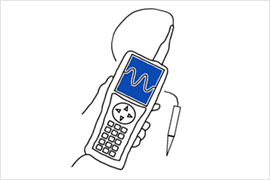
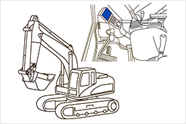
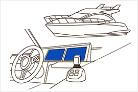

# High-Brightness vs Transflective TFT for Outdoor Displays

!!! abstract "Quick answer"
    Outdoor displays have to overcome strong ambient light. There are two common approaches: a high-brightness TFT that raises backlight brightness, and a transflective TFT that reuses ambient light. The former has attractive brightness numbers and adapts quickly to changing light, but pays a clear price in power and heat; the latter works by reflection in direct sunlight and runs at low power, though its backlight-compensation needs and color-depth compromise should be assessed up front. This article compares the two across four dimensions: brightness, contrast, power, and viewing angle.

## Key Takeaways

- A transmissive LCD performs well indoors but loses readability sharply in bright outdoor light, and that is the fundamental conflict an outdoor display has to solve.
- A high-brightness TFT fights ambient light with an enhanced backlight system, with brightness typically above 1000 nits, at the cost of power, heat, and viewing-angle falloff.
- A transflective TFT splits every pixel into a transmissive area and a reflective area, where the reflective area reflects incident light so the panel can work at low power in strong light.
- The decision rests on the balance among application environment, power budget, visual requirements, and device lifetime, not on a single brightness number.

## 1. What Outdoor Displays Must Overcome

A transmissive panel is the most widely used liquid-crystal technology in all kinds of electrical devices, and it produces a clear image indoors and in dim surroundings. Its readability, however, deteriorates sharply in bright outdoor environments: reflection of ambient light off the screen surface overwhelms the brightness of the image itself.

The usual response is to raise the backlight brightness. But more backlight power improves visibility only to a limited degree while clearly pushing up total power consumption, which can be decisive for battery-driven handheld devices.

Transflective takes another route: it splits every pixel into two areas, a transmissive area and a reflective area, where the reflective area (reflective electrode) reflects incident light from outside back to the viewer. This gives clear display readability together with low power consumption.

## 2. High-Brightness TFT

High-brightness TFT improves screen readability under direct sunlight by increasing backlight brightness and optimizing the optical design, relying mainly on a high-power LED backlight system to counter ambient light.

**Working principle**: the liquid-crystal layer still controls how much backlight passes through, but a greatly enhanced backlight system raises the ceiling on display brightness. In essence it works on the "raise the numerator" path: since reflection of ambient light cannot be avoided, it pushes image brightness far above the reflected light.

## 3. Transflective TFT

Transflective TFT combines the strengths of transmissive and reflective types: it partly relies on backlight brightness and partly on reflecting ambient light to enhance display performance, which makes it especially suitable for naturally lit environments.

**Working principle**: the screen contains a semi-transmissive, semi-reflective layer that lets part of the backlight through while reflecting external ambient light, improving visibility outdoors. The key difference from the approach above is that it works on both sides at once, raising the numerator and lowering the denominator.

## 4. Key Comparison Metrics

### 4.1 Brightness

- **High-brightness TFT**: relies on a high-power backlight system, with brightness typically above 1000 nits.
- **Transflective TFT**: actual brightness depends on the combined effect of backlight and ambient light. Its inherent backlight brightness is lower, but it can be enhanced by ambient-light reflection.

### 4.2 Contrast

- **High-brightness TFT**: delivers high contrast by enhancing the backlight and adjusting the liquid crystal, but under strong ambient light it may suffer ambient-light interference that pulls contrast back down.
- **Transflective TFT**: maintains high contrast in bright conditions by relying on reflected light.

### 4.3 Power Consumption

- **High-brightness TFT**: needs a strong backlight to hold high brightness, so power consumption is higher, and continuous operation may require extra thermal design.
- **Transflective TFT**: partly relies on ambient light, which lowers its demand for backlight power; consumption is low, suiting long-running and energy-saving applications.

### 4.4 Viewing Angle

- **High-brightness TFT**: offers a fairly wide viewing angle, but shows slight brightness and color falloff when viewed from a large angle.
- **Transflective TFT**: offers a wide viewing angle with fairly consistent visual performance from different angles.

**Summary**: transflective has the edge in viewing-angle consistency; high-brightness TFT looks more direct head-on but is limited off-axis.

### 4.5 Metrics Quick-Reference Table

| Comparison dimension | High-brightness TFT | Transflective TFT |
|---|---|---|
| Brightness source | High-power LED backlight | Backlight + ambient-light reflection |
| Typical brightness | Above 1000 nits | Lower backlight, boosted by ambient light |
| Contrast under strong ambient light | May suffer ambient-light interference | Maintained through reflection |
| Power consumption | High; continuous operation needs thermal design | Low; suits energy-saving applications |
| Viewing angle | Fairly wide, with off-axis falloff | Wide and consistent |
| Cost | Relatively controllable | Higher (complex reflective-layer process) |

## 5. Application Scenario Fit

| Application scenario | High-brightness TFT | Transflective TFT |
|---|---|---|
| Direct sunlight | Performs poorly | Relies on ambient light and performs well, but is affected by light angle |
| Frequent light changes | Adapts quickly through backlight adjustment | Performs well under stable light; needs more backlight compensation when light changes |
| Energy-saving applications | Strong backlight leads to high power consumption | Low power consumption, suits energy-sensitive scenarios |
| All-weather outdoor use | Stable brightness and contrast, but power and heat are challenges | Suits sunny environments; needs the backlight on in low light |

## 6. VIEWE's Transflective TFT Features

- Good display readability in outdoor and bright environments.
- Low power consumption under any ambient luminance.
- Image quality in indoor and dark environments on a par with transmissive devices.
- Little difference in display performance between indoor and outdoor conditions.

## 7. Typical Application Scenarios

Transflective and high-brightness solutions mainly serve three categories of use: outdoor field work, on-site instruments, and vehicles.

**Logistics and warehouse handheld terminals**

<figure markdown="span" class="displaywiki-figure">
  [{ width="760" loading="lazy" }](outdoor-tft-selection-handheld-computing.png){ .displaywiki-image-link title="Open full-size image" }
  <figcaption>Logistics and warehouse: handheld terminals are often used in semi-outdoor environments for parcel scanning, warehouse control, and inventory management, where readability and battery life both matter.</figcaption>
</figure>

**Field measurement instruments**

<figure markdown="span" class="displaywiki-figure">
  [{ width="760" loading="lazy" }](outdoor-tft-selection-measurement.png){ .displaywiki-image-link title="Open full-size image" }
  <figcaption>Field instruments and diagnostic equipment: handheld testers and field meters are often read outdoors, so the screen has to stay readable under changing light.</figcaption>
</figure>

**Radio communication terminals**

<figure markdown="span" class="displaywiki-figure">
  [{ width="760" loading="lazy" }](outdoor-tft-selection-radio-communications.png){ .displaywiki-image-link title="Open full-size image" }
  <figcaption>Public safety and radio communications: terminals for police radio and on-site dispatch are used outdoors for long periods and depend on battery power.</figcaption>
</figure>

**Construction and engineering machinery**

<figure markdown="span" class="displaywiki-figure">
  [{ width="760" loading="lazy" }](outdoor-tft-selection-construction-machine.png){ .displaywiki-image-link title="Open full-size image" }
  <figcaption>Construction machinery and civil engineering: display terminals in an excavator cab often sit in backlight or strong light, and the same requirement covers agriculture and GIS/GNSS surveying.</figcaption>
</figure>

**Motorcycle instruments**

<figure markdown="span" class="displaywiki-figure">
  [{ width="760" loading="lazy" }](outdoor-tft-selection-motorcycles.png){ .displaywiki-image-link title="Open full-size image" }
  <figcaption>Motorcycle and e-bike instruments: the riding viewpoint is exposed to the sun year-round, so the display has to stay readable between strong light and night.</figcaption>
</figure>

**EV charging stations**

<figure markdown="span" class="displaywiki-figure">
  [{ width="760" loading="lazy" }](outdoor-tft-selection-bike-computer.png){ .displaywiki-image-link title="Open full-size image" }
  <figcaption>EV charging stations and outdoor self-service terminals: the equipment is installed in the open and must display interaction and billing information under direct sunlight for long periods.</figcaption>
</figure>

**Boat helm**

<figure markdown="span" class="displaywiki-figure">
  [{ width="760" loading="lazy" }](outdoor-tft-selection-gas-stand.png){ .displaywiki-image-link title="Open full-size image" }
  <figcaption>Boat helm: ambient-light reflection off the water is strong, so instruments and navigation terminals place high demands on sunlight readability.</figcaption>
</figure>

## 8. Selection Checklist

- **Fix the dominant lighting condition**: for scenes dominated by direct sunlight with no easy way to recharge frequently, favor transflective; for scenes with stable lighting that need high image quality, a high-brightness option is worth considering.
- **Assess how often the light changes**: when ambient light changes frequently, a high-brightness TFT adjusts faster through backlight dimming, while transflective needs more backlight compensation when light shifts suddenly.
- **Work out power and thermal budgets**: a high-brightness design needs reserved thermal headroom and a full-device power calculation, while transflective can lower backlight power in strong light with clear benefit.
- **Confirm color-depth and image-quality requirements**: transflective involves a color-depth compromise, so applications with hard color requirements should assess it in advance.
- **Check the viewing-angle requirement**: when several people watch or the mounting angle is constrained, viewing-angle consistency is an important metric.
- **Decide on all four factors together**: the final choice should rest on the specific application environment, power budget, visual requirements, and device lifetime.

## 9. Frequently Asked Questions

??? question "Q1: How do I choose between a high-brightness TFT and a transflective TFT?"
    Look at two key conditions: whether ambient light is strong for long periods, and whether the device depends on a battery. For long direct sunlight with limited power (outdoor handhelds, wearables, low-power monitoring), favor transflective; when high image quality is needed, lighting is relatively controllable, and the power and thermal cost is acceptable (outdoor advertising, in-vehicle navigation), choose high-brightness TFT.

??? question "Q2: Does a transflective screen dim indoors?"
    Not noticeably. A transflective panel also has a transmissive mode, so indoors or in dim conditions you simply turn the backlight on and image quality matches a transmissive device of the same class. Its design goal is precisely to keep the indoor-outdoor performance gap small, rather than trading indoor performance for outdoor readability.

??? question "Q3: Which option is better when moving in and out of bright and dark environments?"
    It depends. A high-brightness TFT can adapt quickly to changing light through backlight adjustment and responds faster; transflective performs better under stable light and needs more backlight compensation when light changes abruptly. If the switching is very frequent and power is ample, the high-brightness option's adjustability has the advantage.

??? question "Q4: How should the heat from a high-brightness TFT be handled?"
    A high-brightness backlight raises brightness but also brings higher power and heat; for continuous operation the thermal path has to be assessed, adding a metal back plate, thermal interface material, or structural heat dissipation where necessary, otherwise LED lifetime and overall reliability can suffer. Thermal design should be part of the structural budget from the selection stage.

??? question "Q5: Is the viewing angle of transflective really better than high-brightness?"
    Usually yes. Transflective gives fairly consistent visual performance at different angles; a high-brightness TFT also has a fairly wide viewing angle but shows slight brightness and color falloff at large angles. If the mounting position is constrained or several people watch from different angles, the viewing-angle consistency of transflective is the better fit.

??? question "Q6: Why do some outdoor devices use both high-brightness and transflective?"
    The two are not mutually exclusive. A transflective screen can reduce or even switch off the backlight in strong light, but still needs backlight illumination at night or in low light; combining a transflective structure with a brighter backlight covers the whole light range from direct sunlight to night duty, which is a common approach for all-weather outdoor equipment.

## Related reading

- [Custom and Sunlight-Readable Display Solutions](custom-sunlight-readable-displays.md)
- [High-Reliability Display Solutions](high-reliability-displays.md)
- [UART Smart Display Solutions](uart-smart-display.md)

!!! info "Can't find what you need?"
    If you need more products, resources or support, please contact our team:

    [**:material-archive-arrow-down: Knowledge Base**](../../knowledge/tags.md){ .md-button .md-button--primary }
    [**:material-magnify: Products & Solutions**](https://viewedisplay.com/){ .md-button }
    [**:material-email: Contact Support**](mailto:support@viewedisplay.com){ .md-button }
