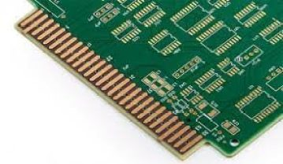

# PCB Construction and Manufacturing Process

!!! abstract "Quick answer"
    PCB manufacturing builds patterned copper layers, laminates them into a controlled stack, forms plated interconnections, applies protective finishes, and verifies the result. Each process step constrains the original design.

## Key Takeaways

- Set stack-up, copper weight, impedance, via construction, materials, tolerances, and finish with the fabricator before release.
- Design rules must reflect imaging, registration, drilling, plating, lamination, solder-mask, and routing capability.
- Electrical test, inspection, coupons, traceability, and acceptance criteria should match product risk.

## PCB Construction Overview

Printed Circuit Boards (PCB), are used in almost all kinds of electronic equipment. They are the supporter of electrical connections for electronic components. There are no parts on the standard PCB bare board, which is often called Printed Wiring Board (PWB). The appearance of PCB greatly reduces frequent failures at wire junctions and short circuits when the wire insulation layer begins to age and crack. Typical PCBs are green, but now other colors are also available such as blue, red, etc. PCB can be classified according to the number of layers, frequency, substrate material, etc. The current circuit board is mainly composed of the circuit pattern, substrate, holes/VIAs, solder mask, silkscreen, and surface finish.

### PCB Layer Construction

<figure markdown="span" class="displaywiki-figure">
  [{ width="760" loading="lazy" }](pcb-construction-process-a-standard-printed-circuit-board.jpeg){ .displaywiki-image-link title="Open full-size image" }
  <figcaption>A standard Printed Circuit Board</figcaption>
</figure>

Substrate

The substrate, which mainly supports and insulates the traces and components, is generally made of dielectric composite materials. The characteristics of the substrate will affect the performance of the PCB, for example, a flexible substrate allows for more design options. Meanwhile, the quality, fabricability in manufacturing and manufacturing cost highly depend on the substrate material. Therefore, choosing the right substrate is the first step toward building a high-quality PCB. FR-4, which is composed of woven fiberglass cloth with an epoxy resin binder, is the most common material of the substrate.

Copper Foil

The material of the small circuits that can be seen on the surface of the substrate is copper foil. The initial copper foil layer is laminated to the entire board by heating and adhesive, then part of it is etched away during the manufacturing process, and the remaining part becomes small reticular circuits. The copper thickness varies by weight, and the unit is generally ounces per square foot. In the multi-layer PCB, copper is also deposited on the wall of drilled holes since these holes establish the electrical connection between the layers.

Prepreg

Prepreg is commonly used in a multi-layer PCB. It is a woven-glass fabric reinforced material impregnated with resin. As a sticky material, prepreg can be used to bond different laminates and foils.

<figure markdown="span" class="displaywiki-figure">
  [{ width="760" loading="lazy" }](pcb-construction-process-a-multi-layer-printed-circuit-board.png){ .displaywiki-image-link title="Open full-size image" }
  <figcaption>A multi-layer Printed Circuit Board</figcaption>
</figure>

Copper-clad Laminate

Copper-clad laminate is also called core, which is composed of prepreg and copper foils. In a multi-layer PCB, a certain number of discrete prepregs are bonded together with the outermost copper foils to make a single laminate.

Solder Mask Layer

The solder mask layer refers to an insulating protective layer, which is on top of the copper layer. It plays a vital role in preventing the copper wire from being oxidized and short circuits. Additionally, it can also avoid components being soldered to incorrect places. The colors of the solder mask layer are various, such as green, red, brown, etc. The solder mask covers the signal traces but leaves the pads to be soldered.

Silkscreen

Silkscreen, also known as Legend, is usually printed in white on the solder mask as a reference indicator. It adds characters, numbers, and symbols on the solder mask to mark the position of each part on the board.

Pad

The pad is a part of the exposed copper on the surface of the circuit board to which the specific component is soldered. The pads are divided into through-hole pads and surface mount pads. The through-hole pads have solder holes, which are mainly used for soldering pin components such as chips; while the surface mount pads have no solder holes and are mainly used for soldering surface mount components on the surface.

<figure markdown="span" class="displaywiki-figure">
  [{ width="760" loading="lazy" }](pcb-construction-process-the-pad-of-printed-circuit-board.jpeg){ .displaywiki-image-link title="Open full-size image" }
  <figcaption>The Pad of Printed Circuit Board</figcaption>
</figure>

VIA (Vertical Interconnect Access)

VIA is a hole used to achieve electrical connection from one layer to another in the multi-layer PCB. There are mainly three types of PCB VIA, namely plated through-hole (PTH), blind VIA, and buried VIA.

PTH is plated through the board and can be seen in double-sided and multi-layer PCB. Although the manufacturing cost of PTH is relatively low, PTH sometimes takes up more PCB space. The copper ring around a PCB plated through hole is called annular ring. It plays a vital role in establishing better connections between VIAs and copper traces in a multi-layer PCB.

Complex PCB such as high-density interconnection (HDI) often require blind and buried VIAs. Blind VIA is an electroplated hole that connects the outermost layer of the PCB with the adjacent inner layers. It increases the space utilization of the PCB circuit layers, but it needs more precise positioning and alignment.

Buried VIA, which is invisible from the outside, only connects between the internal circuit layers. Unlike other VIAs, the drilling of the buried VIA must be completed during the assembly process rather than waiting until the end.

<figure markdown="span" class="displaywiki-figure">
  [{ width="760" loading="lazy" }](pcb-construction-process-the-via-of-printed-circuit-board.jpeg){ .displaywiki-image-link title="Open full-size image" }
  <figcaption>The VIA of Printed Circuit Board</figcaption>
</figure>

Gold Finger

Gold Fingers are metal pads exposed along the edge of a circuit board and are used to establish a connection between two circuit boards.

<figure markdown="span" class="displaywiki-figure">
  [{ width="760" loading="lazy" }](pcb-construction-process-the-finger-of-printed-circuit-board.jpeg){ .displaywiki-image-link title="Open full-size image" }
  <figcaption>The Finger of Printed Circuit Board</figcaption>
</figure>

### PCB Manufacturing Process Flow

Printed Circuit Boards (PCB) are used almost in every kind of electronic equipment. The Printed Circuit Board manufacturing process can be summarized as the following steps:

1. Cutting

Cutting is the process of cutting the dry-cleaned copper-clad panel into small pieces according to the production size, which can be fabricated on the production line. To ensure safe operation and reduce scratch issues, the corners of the board have been rounded.

2. Inner layer dry film lamination

A dry photoresist film is applied onto the board by automatically hot processing. This step in PCB proces flow occurs in a dust-free room with yellow light because the photoresist film is very sensitive to UV light.

3. Exposure

Next, perfectly align the circuit printed film with the board, and then send the board to the printer using UV lamps to harden the photosensitive film according to the circuit printed film. After this step, the circuit is transferred to the dry photoresist film. It is worth noting that the circuit parts are not exposed, but the area without circuits is exposed to UV light, thereby remaining soft.

4. Development

During the development phase in PCB flow, the alkaline solution is used to wash out left unhardened photoresists. After that, the inner layer image is printed by blue resist, which will resist the chemical solution at the etching stage.

5. Etching

The etching is a key stage of layer imaging, using an acid solution to remove unwanted copper and outline the pattern. After etching, the board is cleaned to wash out the excess chemical solution.

6. Stripping

Stripping is to completely peel off the exposed dry photoresist film that protects the copper surface with sodium hydroxide solution to expose the circuit pattern.

7. Inner layer Automatic Optical Inspection (AOI)

This step at printed circuit board manufacturing process will accurately confirm a total absence of defects, and ensure that the built circuit board is of high quality without manufacturing faults. The working principle of AOI is to use the high-definition image camera to quickly shoot, and then compare the captured pictures with the original files, which can fundamentally solve the hidden dangers such as short and open circuits.

8. Brown Oxide treatment

The purpose of the brown oxide treatment is to form a microscopic roughness and organic metal layer on the inner layer surface through a chemical treatment to enhance the adhesion between the layers and avoid such problems as delamination.

9. Lamination

In actual operation, the discrete multi-layer board and prepreg are pressed together to form a multi-layer board with the required number of layers and thickness. Finally, the copper foil completes the stack-up in pcb process flow.  The combinations of a copper foil and a prepreg are located on the top and bottom respectively, sandwiching the inner layer to form the stack-up.

The stack-up is processed in the lamination machine, which takes up to 2 hours. After processing under high pressure and temperature, a single laminated board is formed and then moved to the cold press.

In this stage, various factors such as the uniformity of copper distribution, the symmetry of the stack, the design and layout of the blind and buried holes must be considered in detail during the design.

10. Drilling

Drilling has 2 main purposes, one is to connect load components, another is to link the copper layers. In this stage, there is no copper in the holes, therefore the current cannot flow through the board.

11. Copper plating

The drilled PCB board undergoes an oxidation-reduction reaction in the sinking copper cylinder to form a copper layer to metalize the holes. The copper is deposited on the surface of the originally insulated substrate to obtain conductive holes, thereby achieving electrical communication between the inner layer and outer layer. The stage of printed circuit board production process takes place in a series of chemical and rinsing baths.

12. Outer layer basic process

The fundamental of PCB process flow of the outer layer is similar to that of the inner, which includes outer layer dry film lamination, exposure, development, etching, stripping off the exposed dry photoresist film, chemical copper deposited, and outer layer Automatic Optical Inspection (AOI).

The outer pattern plating follows the chemical copper process but emphasizes the copper distribution. The copper is not only deposited over the entire outer layer surface but also inside the holes. The whole circuit board, which acts as a cathode for electroplating, passes through several baths with electrolytic copper to produce electrolysis. After this, the copper layer of the outer layer and holes is plated to a certain thickness to meet the requirements of the copper thickness of the final PCB board. Different from the inner layer chemical copper process, the board will also be immersed in the electrolytic tin to protect the copper in the subsequent etching process.

13. Outer layer etching

There are three main steps in PCB flow. Firstly, all residues and the dry film are removed, but the unwanted copper remains. Next, the board passes through the chemical solution to etch away the unwanted copper and tin. Finally, the circuit areas and connections are properly defined.

14. Solder mask

Solder mask is one of the most critical stages in the production of printed circuit boards, mainly by screen printing or coating solder mask ink to coat a layer of solder mask on the surface of the board. Through exposure and development, the pads and holes are exposed, and the solder mask is hardened. Finally, the unprotected and unhardened portions by insolation will be washed out.

15. Silkscreen

This stage prints the required characters or part symbols on the board surface by screen printing, and then exposes it under the UV light.

16. Surface finish

The solderability of bare copper itself is pretty good, but long-term exposure to the air is easy to be damp and oxidized. The bare copper tends to exist in the form of oxide, which is unlikely to remain in its original state for a long time. Therefore, surface treatment of the copper surface is required to ensure good solderability and electrical properties. The most common surface treatments are immersion tin, electroless nickel immersion gold (ENIG), immersion silver, gold plating, etc.

17. Profile

Cut the PCB to the required shape and dimensions.

18. Electrical measurement

Simulate the state of the PCB board and check the electrical performance to see if there is an open or short circuit.

19. Final QC, packaging, and stock

Check the appearance, size, hole diameter, thickness, marking, etc. of the board to meet customer requirements. The qualified products are packed into bundles, which are easy to store and transport.

## Related reading

- [PCB Types and Material Selection](pcb-types-materials.md)
- [PCB Design, Fabrication, and Interconnection Selection](pcb-design-interconnections.md)
- [Display Interfaces Explained: MCU, RGB, LVDS, MIPI, SPI, and More](display-interface-guide.md)

## Frequently Asked Questions

??? question "Why is the PCB stack-up important?"
    It controls thickness, impedance, return paths, manufacturability, warpage, thermal behavior, and the spacing available for routing.

??? question "What is the purpose of plated through-holes?"
    Copper plating on the hole wall connects conductive layers and can also provide a solderable or mechanical feature.

??? question "Which inspections are commonly used?"
    Depending on risk, inspection can include automated optical inspection, X-ray, electrical test, microsections, impedance coupons, dimensional checks, and final visual inspection.

??? question "Why are microsections used in PCB qualification?"
    A cross-section allows inspection of plating thickness, hole-wall quality, layer registration, dielectric thickness, and other internal features.

??? question "What is the role of a fabrication drawing?"
    It communicates stack-up, dimensions, tolerances, holes, finish, materials, markings, testing, coupons, and acceptance requirements not fully defined by Gerber data.

!!! info "Can't find what you need?"
    If you need more products, resources or support, please contact our team:

    [**:material-archive-arrow-down: Knowledge Base**](../../knowledge/tags.md){ .md-button .md-button--primary }
    [**:material-magnify: Products & Solutions**](https://viewedisplay.com/){ .md-button }
    [**:material-email: Contact Support**](mailto:support@viewedisplay.com){ .md-button }
