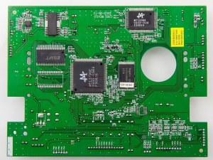
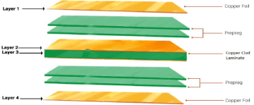
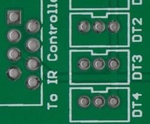
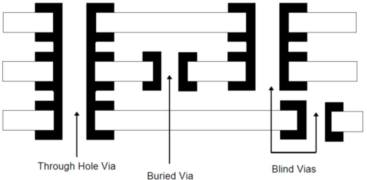
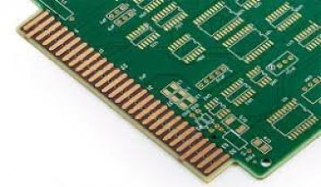

# PCB Construction and Manufacturing Process

!!! abstract "Quick answer"
    A PCB is the base carrier that provides **electrical connectivity plus component mounting** in almost every electronic device, built from functional layers such as the substrate, copper foil, solder mask, silkscreen, pads, vias, and gold fingers. The core of multilayer-board fabrication is **lamination + copper deposition**, surrounded by inner/outer layer imaging, AOI, solder mask, surface finish, and electrical test.

## Key Takeaways

- By **layer count**, PCBs divide into single-sided, double-sided, and multi-layer; by **substrate material**, into rigid, flex, and rigid-flex.
- The main functional layers are the substrate, copper foil, prepreg, solder mask, silkscreen, pad, via, and gold finger.
- The standard 19-step manufacturing flow runs along one spine: **inner-layer imaging → lamination → drilling and copper deposition → outer-layer imaging → solder mask / silkscreen → surface finish → profiling and electrical test**.
- **Substrate selection** (FR-4 / high-frequency / high-speed / aluminum-core / ceramic / flex) is the first decision in PCB design and directly affects cost, performance, and reliability.
- **Surface finish** (HASL / ENIG / OSP / immersion silver / immersion tin / hard gold) determines solderability, signal integrity, lifetime, and cost.

## 1. PCB Construction Overview

A printed circuit board (PCB) is used in almost every kind of electronic equipment, where it plays the core role of **providing electrical connections and mechanical support for electronic components**. There are no components on a bare PCB, so it is often also called a **printed wiring board (PWB)**.

Before PCBs became common, electronic systems were wired by hand with insulated cables. Once the cable insulation aged and cracked, it caused open or short circuits. By "turning the conductors into a copper-foil pattern and curing it onto an insulating substrate," a PCB greatly reduces the probability of both failure modes.

A typical finished PCB is green, though in practice it can be blue, black, red, white, yellow, and more. The color comes from the solder-mask dye; it has no real effect on electrical performance and only affects appearance and repair identification.

PCBs can be classified along the following dimensions:

- **By layer count**: single-sided, double-sided, multi-layer.
- **By frequency / speed**: ordinary digital, high-speed digital, RF and microwave.
- **By substrate material**: rigid (FR-4 and so on), flex (PI / PET), rigid-flex, aluminum-core, ceramic.

Physically, a PCB is composed mainly of six parts: **circuit pattern, substrate, vias, solder mask, silkscreen, and surface finish**.

## 2. PCB Functional Layers

### 2.1 Substrate

The substrate supports and insulates the traces and components and is generally made of an electrically insulating composite material. Its characteristics directly determine the electrical, mechanical, and thermal behavior of the PCB as well as its cost, which makes substrate choice the first decision in building a PCB.

The most common rigid substrate is **FR-4**: a composite of woven fiberglass cloth and epoxy resin with good mechanical strength, electrical insulation, and heat resistance, at a relatively friendly cost. Flexible substrates use polyimide (PI) or polyester (PET) and can be bent or rolled.

<figure markdown="span" class="displaywiki-figure">
  [{ width="760" loading="lazy" }](pcb-construction-process-a-standard-printed-circuit-board.jpeg){ .displaywiki-image-link title="Open full-size image" }
  <figcaption>A standard Printed Circuit Board</figcaption>
</figure>

### 2.2 Copper Foil

The fine lines visible on the substrate are copper. In PCB manufacturing, copper foil is first laminated across both faces of the substrate, and the copper needed for conductors and pads is then kept through imaging and etching. Copper thickness is measured in ounces per square foot; common grades are 0.5 oz / 1 oz / 2 oz, corresponding to roughly 17 µm / 35 µm / 70 µm.

In a multi-layer board, copper is also deposited on the walls of the drilled holes to provide the electrical connection between layers.

### 2.3 Prepreg

Prepreg is a woven-glass fabric impregnated with resin, held in a "semi-cured" state: it is tacky to a degree and can cure further under heat and pressure. Like glue, it bonds the inner-layer cores to the outer copper foils and is the key material of lamination in a multi-layer board. Prepreg plus copper foils forms the copper-clad laminate, also called the core.

<figure markdown="span" class="displaywiki-figure">
  [{ width="760" loading="lazy" }](pcb-construction-process-a-multi-layer-printed-circuit-board.png){ .displaywiki-image-link title="Open full-size image" }
  <figcaption>A multi-layer Printed Circuit Board</figcaption>
</figure>

### 2.4 Solder Mask

The solder mask is an insulating protective layer over the copper layer, usually green. It prevents the copper traces from oxidizing and avoids solder bridging that would short adjacent pads, while the pad areas are opened so they remain solderable. Colors include green, black, blue, red, white, and more.

!!! warning "Production note"
    Under volume production or harsh conditions (high and low temperature, damp heat, vibration, ESD), check the datasheet curves for this parameter; running outside the specified range will significantly shorten lifetime.

### 2.5 Silkscreen

Silkscreen, also known as the legend, is usually printed in white ink on the solder mask to carry reference information such as component designators, polarity, revision numbers, and test points for assembly and repair.

### 2.6 Pad

A pad is an area of exposed copper on the PCB surface that serves as the landing zone for component soldering. Pads fall into two categories:

- **Through-hole pad**: has a hole, mainly for pin-through components (DIP and similar).
- **Surface-mount pad**: has no hole, mainly for surface-mount components (QFP, QFN, BGA, and so on).

<figure markdown="span" class="displaywiki-figure">
  [{ width="760" loading="lazy" }](pcb-construction-process-the-pad-of-printed-circuit-board.jpeg){ .displaywiki-image-link title="Open full-size image" }
  <figcaption>The Pad of Printed Circuit Board</figcaption>
</figure>

### 2.7 Via

A via is a metallized hole that passes through a multi-layer board to conduct between layers. There are three main types:

- **Plated through hole (PTH)**: runs through every layer and costs the least.
- **Blind via**: connects the outermost layer to an adjacent inner layer and is not visible from the outside.
- **Buried via**: connects only internal layers and is completely invisible from the outside.

The copper ring around a via is called the **annular ring**, and it is critical to drill registration and interlayer connection reliability. HDI (high-density interconnect) boards use blind and buried vias heavily to free up routing space on the outer layers.

<figure markdown="span" class="displaywiki-figure">
  [{ width="760" loading="lazy" }](pcb-construction-process-the-via-of-printed-circuit-board.jpeg){ .displaywiki-image-link title="Open full-size image" }
  <figcaption>The VIA of Printed Circuit Board</figcaption>
</figure>

### 2.8 Gold Finger

Gold fingers are exposed metal pads along the edge of a board, plated with hard gold for wear resistance and anti-oxidation. They are used in edge connectors (PCIe, memory modules, AMR boards, and other daughter-card interconnect scenarios).

<figure markdown="span" class="displaywiki-figure">
  [{ width="760" loading="lazy" }](pcb-construction-process-the-finger-of-printed-circuit-board.jpeg){ .displaywiki-image-link title="Open full-size image" }
  <figcaption>The Finger of Printed Circuit Board</figcaption>
</figure>

## 3. PCB Manufacturing Process

The following 19 steps follow the actual work order in a standard PCB factory and are especially suited to a full picture of how a 4–10 layer board goes from substrate to finished product.

### Step 1: Cutting

Large copper-clad panels are cut into the "working panel" size required for production. To reduce handling scratches and improve the safety margin, the four corners of the board are rounded.

### Step 2: Inner Layer Dry Film Lamination

A photosensitive dry film is applied to the inner-layer core by hot pressing. The dry film is extremely sensitive to ultraviolet light, so this step must run in a yellow-light room that excludes short-wavelength UV exposure.

### Step 3: Exposure

The circuit artwork film is aligned precisely to the board and exposed with UV lamps. **The areas with circuitry are struck by UV light and the dry film hardens; the areas without circuitry are masked and the dry film stays soft**, transferring the circuit image onto the dry film.

### Step 4: Developing

A developer solution washes away the unhardened dry film and exposes the copper surface underneath.

### Step 5: Etching

An acid or alkaline etchant removes the exposed copper; what remains is the required circuit pattern.

### Step 6: Stripping

A strong alkaline solution peels off the hardened dry film and exposes the full copper pattern.

### Step 7: Inner Layer AOI (Automated Optical Inspection)

AOI scans the copper surface rapidly with a high-definition camera and compares the captured image against the original Gerber data to find shorts, opens, nicks, and similar defects.

### Step 8: Brown Oxide Treatment

A chemical treatment forms a microscopically roughened organic metal layer on the inner-layer copper, improving the bond with the prepreg and preventing delamination after lamination.

### Step 9: Lamination

Per the drawing, several cores and prepregs are stacked (with copper foil outermost) and held at high temperature and pressure until the prepreg fully cures; after cooling, a single multi-layer board is formed.

At the design stage, pay close attention to **copper distribution uniformity, stack-up symmetry, and the placement of blind and buried vias and the decomposition temperature** — these are physical boundaries that cannot be changed after lamination.

### Step 10: Drilling

Drilling has two purposes: pads for pin-through components and the electrical connection holes between copper layers. **The drilled hole walls are not yet metallized**, so they cannot conduct current yet.

### Step 11: Copper Deposition / Panel Plating

The hole walls first receive a thin copper layer by electroless copper deposition (turning the wall from insulating to conductive), and are then thickened to the target copper weight by electrolytic plating, so the walls provide interlayer electrical interconnection. This step is usually performed in a series of chemical and rinse baths.

### Step 12: Outer Layer Imaging

Outer-layer imaging runs through the same sequence as the inner layer: **dry-film lamination → exposure → developing → pattern plating → stripping**, but the outer layer uses **pattern plating**, first a thin copper layer and then tin, with the tin acting as the etch resist for the following etch.

### Step 13: Outer Layer Etching

Residual dry film is stripped first, and the unwanted copper is then removed by a chemical bath; the areas protected by tin remain, forming the final circuit pattern.

### Step 14: Solder Mask

Solder-mask ink is applied across the board by screen printing or coating, then exposed and developed to open the pads and vias while the rest stays covered.

### Step 15: Silkscreen

Characters, designators, and test-point markings are screen-printed onto the board and then cured under UV light.

### Step 16: Surface Finish

Bare copper oxidizes readily in air, so a surface finish is required to guarantee solderability, signal integrity, and lifetime. Common processes are compared below:

| Process | Full name | Characteristics |
| --- | --- | --- |
| HASL (leaded / lead-free) | Hot Air Solder Leveling | Low cost and good solderability, but unsuitable for small packages, BGA, and HDI |
| ENIG | Electroless Nickel Immersion Gold | Nickel plus a thin gold layer; flat, long life, and suited to BGA / high frequency |
| OSP | Organic Solderability Preservatives | Organic protective film; eco-friendly and low cost, but easily scratched and limited in multiple reflows |
| Immersion silver | Immersion Silver | Good signal integrity, but prone to tarnishing from sulfur |
| Immersion tin | Immersion Tin | Suited to press-fit and multiple reflows, but prone to tin whiskers |
| Hard gold | Hard Gold (thick electroplated gold) | Used for gold fingers and key contacts; wear-resistant and anti-oxidation |

### Step 17: Profiling / Routing

The board is routed (milled) out of the working panel or cut by V-score to the finished outline the customer requires.

### Step 18: Electrical Test

Flying-probe or bed-of-nails equipment checks the continuity and isolation of every net against the design drawing.

### Step 19: Final QC, Packaging, and Stocking

Appearance, dimensions, hole diameter, thickness, and silkscreen are sampled or fully inspected against the customer specification, and qualified boards are packed to the packaging spec and stocked.

## 4. Engineering Trade-offs in Key Processes

### 4.1 Choosing the Substrate: FR-4 or Something Else?

- **FR-4**: the broadest coverage and the best cost-performance; first choice for ordinary digital logic and low-speed signals.
- **High-Tg FR-4**: good heat resistance; first choice for multi-layer and high-density boards.
- **PTFE / modified resin**: stable Dk / Df; first choice for millimeter-wave and RF.
- **Aluminum-core / ceramic**: first choice for heat dissipation in high-power LED and power modules.
- **PI / PET**: first choice for flex and rigid-flex.

### 4.2 Choosing the Layer Count: Estimate Routing Density First

- Single-sided / double-sided: low-cost appliances, toys, power supplies.
- 4 layers: mainstream consumer / industrial / embedded products.
- 6 / 8 layers: typical high-speed scenarios such as PCIe, USB 3.x, MIPI, HDMI, and gigabit Ethernet.
- 10+ layers: high-speed servers, switches, radar, and complex SoCs.

### 4.3 Choosing the Surface Finish: Assembly and Reliability Decide

- One-off consumer / hand soldering: HASL is enough.
- BGA / QFN / high frequency / long life: ENIG.
- Multiple reflows / press-fit: immersion tin.
- Gold fingers / high-frequency contacts: hard gold.
- Strong signal integrity / heat-sensitive: **immersion silver** (mind the sulfur tarnishing issue).

## 5. Frequently Asked Questions

??? question "Q1: Why is the PCB usually green?"
    The color comes from the solder mask (usually an ink or a photosensitive dry film); green comes from a phthalocyanine green dye, which has low sensitivity to the human eye and is comfortable to look at on the factory floor, and it does not affect electrical performance. Blue, black, red, white, and purple are all a matter of solder-mask dye formulation, and the factory can supply them in volume.

??? question "Q2: How do you choose between through holes, blind vias, and buried vias?"
    Through holes are the cheapest and most reliable but have low density; blind vias take up little outer-layer routing space; buried vias can be hidden entirely inside and use no outer-layer space, but they must be finished before lamination and cost the most. **HDI boards commonly use a 1st-order / 2nd-order blind-and-buried combination**, and the real deciding factor is still density versus cost.

??? question "Q3: Which is better for BGA, ENIG or HASL?"
    BGA has fine ball pitch and high requirements for flatness and coplanarity; the uneven tin surface of HASL easily causes cold joints, so **ENIG is the standard choice for BGA**. HASL is mainly used on boards dominated by traditional through-hole or surface-mount packages.

??? question "Q4: Why does a PCB still need electrical test?"
    Even after passing AOI and process control, hidden defects can remain: **inner-layer opens, shorts, shorts between pins, and missing holes**. Flying-probe or bed-of-nails testing covers net continuity at 100%, and it is the factory quality floor.

??? question "Q5: Is a higher HDI class always better?"
    Not necessarily. The HDI order (1 / 2 / 3) refers to the maximum number of stacked laser blind vias; a higher order means higher density and a steep rise in cost. Before choosing an HDI class, assess the design density first: only requirements exceeding 4 layers plus microvias call for 2nd order or above.

## Related reading

- [PCB Types and Material Selection](pcb-types-materials.md)
- [PCB Design, Fabrication, and Interconnection Selection](pcb-design-interconnections.md)
- [Display Interfaces Explained: MCU, RGB, LVDS, MIPI, SPI, and More](display-interface-guide.md)

!!! info "Can't find what you need?"
    If you need more products, resources or support, please contact our team:

    [**:material-archive-arrow-down: Knowledge Base**](../../knowledge/tags.md){ .md-button .md-button--primary }
    [**:material-magnify: Products & Solutions**](https://viewedisplay.com/){ .md-button }
    [**:material-email: Contact Support**](mailto:support@viewedisplay.com){ .md-button }
