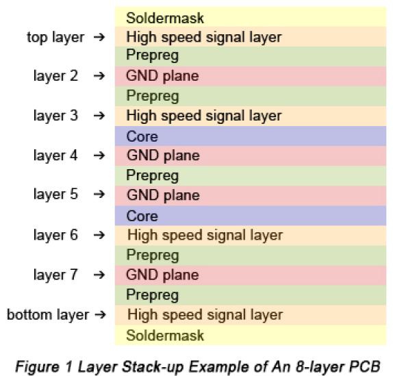
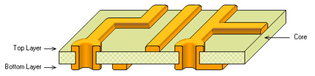
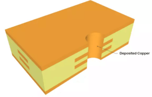

# PCB Design, Fabrication, and Interconnection Selection

!!! abstract "Quick answer"
    This guide explains PCB design and interconnections, the relevant design trade-offs, and the points engineers should verify when selecting a display solution.

## Key Takeaways

- Learn PCB design and interconnections, key trade-offs, applications, and engineering selection criteria.
- Use the guidance below to compare the relevant technologies and design trade-offs.
- Validate optical, electrical, mechanical, environmental, and production requirements before final selection.

## PCB Design

PCB designs begins when a electronic engineer chooses the components required to perform the functions of the end product and then determines the best way to connect those components electrically.
The design gives the manufacturer a lot of information including the PCB dimension, hole sizes and positions, and overall mechanical definition; it may also incorporate notes referring type of material, specifications, UL requirements, solder mask, and test requirements.

CAD: Creating Hardware with Software

While PCB design were once played out manually on mylar film, they are now created using Computer Aided Design (CAD) software. The CAD software automatically determines the routes for the conductors, reducing the manual labor required. Most CAD providers provide a library of shapes and sizes of available components. These shapes and sizes are known as outlines. The area where these components come into contact with the board is call the footprint.

Selecting Materials

Because a variety of copper thickness, epoxy properties, and types of glass weave are available, the designer must define the desired combination. One important consideration is the makeup of the prepreg – the agent that bonds the layers of a multilayer PCB. Prepreg (or B-stage resin) is a glass cloth that has been impregnated with epoxy and then partially cured.  There are 3 basic properties: thermal, electrical and chemical.

Specifying Metallic Finishes

Copper is used as the conductor in most PCBs in production, and if left unprotected, will tarnish and prevent the proper solderability of components to the bare board. A metal that doesn’t tarnish or is slow to tarnish is applied to protect the exposed copper surfaces of the PCB. Metallic surface finishes vary in price, shelf life, reliability, and assembly processing.  Some of the popular surface finishes are listed as below:

Hot Air Solder Leveling (HASL): the PCB is dipped into a bath of molten solder(tin-lead).

Electroless Immersion Gold (ENIG): This is one of the best and most popular RoHS finishing methods. ENIG offers excellent wetting, coplanarity, oxidation, and long shelf life.

Immersion Silver

Organic Solderability Preservative (OSP): OSP is a RoHS compatible , water based organic compound that selectively bonds to copper and provides an organic/metallic layer that protects the copper during soldering.

Lead Free HASL: The molten bath is free of lead and RoHS. It uses a nickel modified alloy to give similar results.

Creating the Stack-up Sheet

As the final step, the designer creates a stack-up sheet that provides an overall picture of the board.

<figure markdown="span" class="displaywiki-figure">
  [{ width="760" loading="lazy" }](pcb-design-interconnections-generating-manufacturing-data.png){ .displaywiki-image-link title="Open full-size image" }
  <figcaption>Generating Manufacturing Data</figcaption>
</figure>

Internal or Industry specifications

Underwriters Laboratory (UL) requirements

Test requirements

Custom specifications

Transferring the Design to the Manufacturer

The most used data transfer formats are used below:

Gerber and its derivative, Gerber RS-274X.

ODB++, GenCAM, and PIC-D-350.

Converting the Design for Tooling

The manufacturing process begins with the transfer of the electronic data received from the designer, using special programs known as Computer Aided Manufacturing (CAM) software. CAM permits the manufacturer to perform:

Performing Panelization and Photo-tooling

Panelization process is to multiple PCB images to fill the entire surface of the panel of laminate most economically.  Auxiliary features: layer numbers, UL symbols, borders, and test coupons, are added to the panel.  Then it is transferred to the photo plotter: a machine that draws the panelized image with laser light through the imaging process. The final image is drawn on photographic film.

Laser direct imaging (LDI) is another method of applying or exposing the PCB design to the manufacturing panel by directly imaging the circuitry to the manufacturing panel using a powerful laser.

Generating Drill and Routing Data

Generating the numerically controlled (NC) drill and the routing data for transmission to the drilling section.

Programming Inspection and Test Data

Manufacturers use automatic optical inspection (AOI) to find breaks or shorts in the PCB routing. Manufacturer program the AOI memory by using a golden board or CAD data as a reference. The AOI machine scans the board under inspection and compares it with the golden board. In the case of a mismatch, the machine identified the location of the defects.

The bare board is electrically tested to ensure the original design is followed. There are two methods for testing.

Golden Board Testing: This method is primarily used when no Gerber or electronic data is available to generate artwork used in the manufacturer of the PCB. Legacy product that is usually through hole, simple 2-, 4-, or even 6- layer boards are still tested in this way.

Netlist Testing: This method can be used when Gerber data is available. It is performed when all the nets (a string of points along a circuit) can be extracted from the information supplied. Where golden board testing is a comparison test, the netlist tests all points, ensuring a high confidence of electrical integrity.

## Double-sided PCB Manufacture

The double-sided PCB (or 2-layer PCB) is the printed circuit board with copper coated on both sides, top and bottom. There is an insulating layer in the middle. To use circuits on both sides, there must be a proper circuit connection between the two sides.  The “bridges” between such circuits are call vias. A via is a small hole on the PCB board coated with metal, which can be connected with circuits on both sides.

<figure markdown="span" class="displaywiki-figure">
  [{ width="760" loading="lazy" }](pcb-design-interconnections-double-sided-pcb.png){ .displaywiki-image-link title="Open full-size image" }
  <figcaption>Double-sided PCB</figcaption>
</figure>

Figure 1. Double-sided PCB

Planning and Preproduction

Before manufacturing, the manufacturer reviews the CAD data and other information (films, mechanical drawing, and specifications).

Number of boards per mother panel

Decide the panel size for the most economical reason.

Features and information to be added during panelizations. Such as UL symbols, test coupons, layer numbers, and borders are selected at this time

Layer materials

Drilled hole sizes

Tooling holes or target locations

Double-sided PCB manufacturing process

The following section describes the steps involved in producing a double-sided board with solder mask over bare copper (SMOBC), plated through-holes (PTH), and gold-plated contacts and the component legend.

Preparing Material

Using the information on the traveler- including the numbers and sizes of the panels, as well as any special instructions, the manufacturer prepares the materials necessary to process the order. PCBs start with copper-clad epoxy glass as the raw material. There are a lot of materials used in PCB manufacturing for users and PCB manufacturers to choose from. Different brands and materials have different characteristics, and different materials also provide different benefits, such as FR4, a ceramic substrate, iron substrate, aluminum substrate, etc.

Fr-4, one of the flame retardant materials widely used in PCB base substrates. FR4 board is economical and affordable and can maintain the stability and safety of the PCB board under extreme temperature conditions.

However, FR4 is not suitable for high-frequency and high-speed PCBs. At this time, we need to choose high-frequency materials, such as Rogers’ RO4000 series, RT5000/6000 series, Tacanic’s TLX series, and so on.  Aluminum, metal, or copper as the substrate for LED PCB or aluminum PCB  are used in the LED lighting industry.

Cutting of CCL (Copper Clad Laminate)

The next step is to cut the board according to the requirement. The raw PCB board is quite large. There are various sizes available, such as 37 x 49 inches, 41 x 49 inches, and 43 x 49 inches. Therefore, it is cut in the required sizes that can be used in the machines. The board size obtained after cutting is not according to your circuit size; it is much larger. Your PCB size could be small, so multiple circuits on the board can make the process economical.

Drilling

The circuit board goes to an automatic drilling machine that creates holes in the board quickly. The machine changes the drill bits on its own; everything is automated.

Deburring

As drilling processes improves, burr-free holes can be produced. But most manufacturers process drilled panels through a deburring machine. The panels pass through brushes or abrasive wheels what mechanically remove any copper burns at he rims of the holes. Deburring also removes any fingerprints and oxides to create a smooth, shiny surface.

Electroless Copper Deposition (Plating Through Holes, PTH)

Electroless deposition of Cu through the holes as holes are composed of epoxy initially. After Cu deposition, panel is dipped in acid dip and anti-tarnish solution to prevent against oxidation. It is of two types- horizontal and vertical. Horizontal PTH is for carbon deposition and vertical PTH is for Cu deposition. Electroless copper is one of the most important steps in double-sided PCB and multilayer PCB manufacturing processes. Because all PCBs with 2 or more layers use plated through holes to connect the conductors between the layers.

<figure markdown="span" class="displaywiki-figure">
  [{ width="760" loading="lazy" }](pcb-design-interconnections-electroless-copper-deposition-plating-through-holes-pth.png){ .displaywiki-image-link title="Open full-size image" }
  <figcaption>Electroless Copper Deposition (Plating Through Holes, PTH)</figcaption>
</figure>

Figure 2. Electroless Copper Deposition (Plating Through Holes, PTH)

Photo Imaging

In photo imaging, a negative image circuitry pattern is transferred to the PCB panel. First, the panel is covered with a layer of photoresist. The most common photoresist material is dry film plating resist is an ultraviolet (UV) light sensitive photo polymer. It’s supplied on a roll and applied by processing the panel through heated rollers on a hot roll laminator. Once the film is applied, the board is ready to be exposed to UV light for circuit printing.

The whole process is carried out in a room where there are only yellow lights. It is because photo-resistive films are sensitive to other lights. The film that has the circuit design is applied over the board; it is applied on both sides. Then, the board passes through a UV light chamber. When the board is exposed to UV light, the circuit part is hardened, while the excessive part remains the same.

Pattern Plating

First the panels are clamped in plating racks and immersed in a series of chemical bath that clean the copper pattern that makes up the circuitry. Next, the panels are immersed in a copper plating solution. The solution and panels have opposite electrolytical charges. These opposite polarities cause copper ions to migrate to the un coated copper areas on the panel, depositing the desired thickness of copper on the plates surface and in the holes. After copper plating the panels are moved from bath to bath.  The circuitry pattern is covered with extra copper, is further electroplated with tin or tin/lead solder.

Developing and Etching

The panels are placed in a tank or spray machine to remove the imaging material. Theis step is also called resist stripping. After the resist is stripped off, the panels are placed in the conveyorized spray etcher or batch tank, where a chemical etchant (an ammonia-based compound) removes the uncovered copper but doesn’t’ attack the tin or tin/lead plating, which protects the copper underneath. The tin or tin/lead plating is called the etch resist. Then the tin or tin/lead is chemically stripped from the copper, revealing the copper circuitry pattern.

Solder Masking

Green, white, blue, and other colors of solder mask on the circuit is a thin layer of polymer that works as an insulator between two conducting lines. It prevents the formation of short circuits. The mask is applied all over the board, and then it is dried. Remove the excess solder mask that is over the circuit. A film that contains circuit patterns is applied over the board. Then the board goes through a UV chamber. The solder other than the circuit is hardened while the solder mask over the circuit remains the same. Finally, the solder mask over the circuit is cleaned.

Surface Finishing

The copper on the board can undergo oxidation. It cannot last for a long time. Therefore, it is necessary to apply a surface finish over copper to protect it from oxidation. There are many types of surface finishes available, and customers can pick according to their needs. You can choose HASL, OSP, ENIG, ENEG, ENEPIG, Immersion tin, Immersion silver, etc.

Gold and Nickel Plating

Other plating finishes are used, most commonly gold. However, copper and gold tend to undergo solid state diffusion into each other (with copper doing so at a faster rate); the process is accelerated by increased temperature. Copper on a trace surface oxidizes, resulting in increased contact resistance (copper migrating into the gold can cause the gold to tarnish and corrode). This can be minimized by plating a barrier layer between the copper and gold. Nickel is commonly used as a barrier layer to prevent the gold migrating into the copper on the tracks. (The nickel barrier helps to reduce both the number and the effect of pores compared with plating gold directly over the copper base.) The nickel protective coating provides several benefits. It serves as a backing to the gold for extra hardness as well as providing an effective diffusion barrier layer between gold and copper. The nickel/gold provides a finish that is heat and corrosion resistant, environmentally stable, wire solderable and durable (the nickel underplate enhances the wear characteristics of gold) albeit at a higher cost than simple solder finishes. Traditionally, nickel/gold plating has been applied over copper tracks used for keyboard contacts or edge fingers to provide the conductive, corrosion resistant coating. This approach provides benefits for soldering,

Applying the Component Legend

The labels on the PCB are called silkscreens. These can be used to mark components and insert the logo. In this step, the PCB board enters into a giant printer that prints the labels on the board. Silkscreens are available in various colors, such as red, blue, yellow, and black, but the standard color is white.

Separation or Cutting

a cutting machine cuts the circuits and makes them separate pieces.

Electrical Testing

For this purpose, the Flying Probe Test is used. It is a simple test in which there are multiple probes. The probes are placed over the connections, and the current is passed through them. It checks whether the circuit is working as expected or not. For instance, if there is no connection between two paths, then the current should not pass if the probes are connected to them.

<figure markdown="span" class="displaywiki-figure">
  [{ width="760" loading="lazy" }](pcb-design-interconnections-double-sided-pcb-manufacturing-process.png){ .displaywiki-image-link title="Open full-size image" }
  <figcaption>Double-sided PCB Manufacturing Process</figcaption>
</figure>

Figure 3. Double-sided PCB Manufacturing Process

## Selection of Interconnections

Selections of the packaging approaches among the various elements is dictated not only by system function, but also by the component types selected and by the operation parameters of the system, such as the clock speeds, power consumption, and heat management methods, and the environment in which the system will operate.

Speed of Operation

The speed at which the electronic system operates is a very important technical factor in the design of interconnections. Many digital systems operate at close to 100MHz and are already reaching beyond that level. The increasing system speed is placing great demands on the ingenuity of packing engineers and on the properties of materials used for PWB substrate.

The speed of signal propagation is inversely proportional to the square root of the dielectric constant of the substrate materials, requiring designers to be aware of the dielectric properties of the substrate material they intend ot use. The signal propagation on the substrate between chips, the so-called time of flight, is directly proportional to the length of the connectors and must be kept short to ensure the optimal electrical performance of a system operating at high speeds.

For systems operating at speed about 25 MHz, the interconnections must have transmission line characteristics to minimize signal losses and distortion. Proper design of such transmission lines requires careful calculation of the conductor and dielectric separation dimensions and their precise manufacture to ensure the expected accuracy of performance.  For PCBs, there are two basic transmission line types 1) Stripline, 2) Microstrip.

Power Consumption

As the clock rates of the chips increase and as the number of gates per chip grows, there is a corresponding increase in their power consumption. Some chips require up to 30W of power for their operation. With that, more and more terminals are required to bring power in and accommodate the return flow on the ground planes. About 20 to 20 percent of chip terminals are used for power and ground connections. With the need for electrical isolation of signals in high speed systems operation, the count may go to 50 percent.

Design engineers must provide adequate power and ground distribution planes within the multilayer boards (MLBs) to ensure efficient, low resistance flow of currents, which may be substantial in boards interconnecting high speed chips consuming tens of watts and operating at 5V, 3.3V, or lower. Proper power and ground distribution in the system is essential for reducing di/dt switching interference in high speed systems, as well as for reducing undesirable heat concentrations. In some cases, separate busbar structures have been required to meet such high-power demands.

Thermal Management

All the energy that has been delivered to power integrated circuits (ICs) must be efficiently removed from the system to ensure its proper operation and long life. The removal of the heat from a system is one of the most difficult tasks of electronic packaging. In large systems, huge heat sink structures, dwarfing the individual ICs, are required to air cool them, and some computer companies have built giant superstructures for liquid cooling of their computer modules. Some computer designs use liquid immersion cooling. Still, the cooling needs of large systems tax the capabilities of existing cooling methods.

The situation is not that severe in smaller, tabletop or portable electronic equipment, but it still requires packaging engineers to ameliorate the hot spots and ensure longevity of operation. Since PWBs are notoriously power heat conductors, designer must carefully evaluate the method of heat condition through the board, using such techniques as heat vias, embedded metal slugs and conductive planes.

Electronic Interference

As the frequency of operation of electronic equipment increases, many ICs, modules, or assemblies can act as generators of radio frequency (RF) signals. Such electromagnetic interference (EMI) emanations can seriously jeopardize the operation of neighboring electronics or even of other elements of the same equipment, causing failures, mistakes, and errors, and must be prevented. There are specific EMI standards defining the permissible levels of such radiation, and these levels are very low.

Packaging engineers, and especially PWB designers, must be familiar with the methods of reducing or cancelling this EMI radiation to ensure that their equipment will not exceed the permissible limits of this interference.

System Operating Environment

The selection of a particular packaging approach for an electronic product is also dictated by its end use and by the market segment for which that product is designed. The packaging designer has to understand the major driving force behind the product use. Is it cost driven, performance driven, or somewhere in between? Where will it be used: for instance, under the hood of a car, where environmental conditions are severe, or in the office, where the operating conditions are benign? The IPC has established a set of equipment operating conditions classified by the degree of severity.

Cost

Product cost has become the most important criterion in any design of electronic systems. Whiel complying with all the aforementioned design and operation conditions, the designing engineer must keep cost as the dominant criterion, and must analyze all potential trade offs in the light of the best cost/performance solution for the product..

The importance of the rigorous cost trade off analysis during the design of electronic product is underscored by the fact that about 60 percent of the manufacturing costs are determined in the first states of the design process, when only 35 percent of the total design effort has ben expended.

Attention to manufacturing and assembly requirements and capabilities during product design can reduce assembly costs by up to 35 percent and PWB costs by up to 25 percent.

## Related reading

- [PCB Construction and Manufacturing Process](pcb-construction-process.md)
- [PCB Types and Material Selection](pcb-types-materials.md)
- [Display Interfaces Explained: MCU, RGB, LVDS, MIPI, SPI, and More](display-interface-guide.md)
