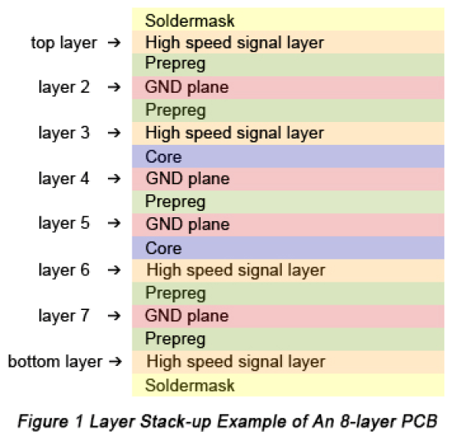
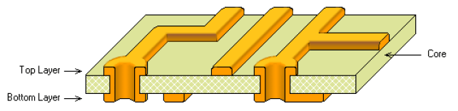
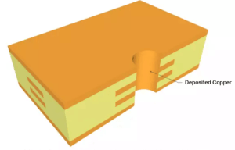
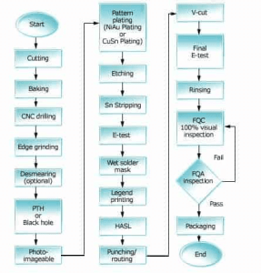

<script type="application/ld+json">
{
  "@context": "https://schema.org",
  "@type": "FAQPage",
  "mainEntity": [
    {
      "@type": "Question",
      "name": "Gerber and ODB++ are both accepted by factories — how to choose?",
      "acceptedAnswer": {
        "@type": "Answer",
        "text": "For simple boards of 4 layers or fewer, Gerber is enough; for 6 layers and above, impedance control, HDI, or blind / buried via boards, prefer ODB++. **Gerber is graphics, while ODB++ carries nets and design intent**, so the former carries a higher risk of errors."
      }
    },
    {
      "@type": "Question",
      "name": "What defects can AOI not detect?",
      "acceptedAnswer": {
        "@type": "Answer",
        "text": "AOI detects shorts, opens, and nicks by image comparison and works on outer layers effectively; but **inner-layer shorts, plating defects, insufficient hole copper thickness, and uneven electroless copper** require cross-sectioning or 4-wire micro-ohmmeter testing. It is recommended to add sampled cross-section reports to the shipment report."
      }
    },
    {
      "@type": "Question",
      "name": "HASL / ENIG / OSP each have strengths — how to choose?",
      "acceptedAnswer": {
        "@type": "Answer",
        "text": "**HASL** (leaded / lead-free): low cost, DIP-friendly, use with caution for BGA. **ENIG**: flat and stable, first choice for BGA / QFN. **OSP**: volume consumer products, low cost, not for multiple reflows. **Immersion silver**: high frequency / high speed. **Immersion tin**: press-fit / multiple reflows (watch out for tin whiskers)."
      }
    },
    {
      "@type": "Question",
      "name": "Does a 100 MHz signal on a PCB always need impedance matching?",
      "acceptedAnswer": {
        "@type": "Answer",
        "text": "Impedance control is mandatory when the signal rise time is ≤ 4 times the transmission-line delay (the long-line effect). A simple rule of thumb: once **the physical trace length exceeds 1/6 of the propagation distance corresponding to the rise time**, treat it as a transmission line and match it at 50 Ω (single-ended) / 90 Ω / 100 Ω (differential). 100 MHz looks low, but the edge rates of many interfaces (USB / HDMI / MIPI) have already reached the GHz level."
      }
    },
    {
      "@type": "Question",
      "name": "Where do automotive PCBs differ from consumer PCBs in process?",
      "acceptedAnswer": {
        "@type": "Answer",
        "text": "Automotive (AEC-Q) boards must pass -40 °C to 125 °C temperature cycling plus vibration and lifetime tests, with significantly higher requirements for laminate Tg / Td, hole copper thickness, solder-mask adhesion, and surface-finish stability. Common countermeasures are high-Tg FR-4, ENIG finish, thicker hole copper, stronger stack-up symmetry, and wider test coverage."
      }
    },
    {
      "@type": "Question",
      "name": "What is the essential difference between HDI and conventional multilayer boards?",
      "acceptedAnswer": {
        "@type": "Answer",
        "text": "The core of HDI is **laser blind vias plus thin dielectric**, which push the line width / spacing / hole diameter smaller; it enables microvia BGA fanout and routing at high density. **The through holes of conventional multilayer boards give way to stagger / stacked microvias in HDI**, but each lamination stage drives up cost. Evaluate density versus payoff before choosing HDI."
      }
    }
  ]
}
</script>

# PCB Design, Fabrication, and Interconnection Selection

!!! abstract "Quick answer"
    PCB design is more than drawing a board — it is the process of **delivering a set of mass-producible physical specifications to the factory**: schematic, component library, Gerber, stack-up, SMD pads, impedance parameters, surface finish, drilling table, and test points. The factory ingests these data through CAM software and runs a standardized flow of panelization → drilling → copper deposition → imaging → etching → solder mask → surface finish → profiling → electrical test. System-level design trade-offs revolve around six dimensions: **speed / power / thermal / EMI / environment / cost**.

## Key Takeaways

- The designer first selects the component library and footprints, then the materials (FR-4, high-frequency, metal-core), then stack-up and impedance control, and finally outputs manufacturing data such as **Gerber / ODB++**.
- On the factory side, CAM converts the engineering files into panelization, laser direct imaging (LDI), drilling and routing NC data, AOI inspection programs, and electrical-test netlists.
- The double-sided board process order: cutting → drilling → deburring → copper deposition → imaging → etching → solder mask → surface finish → silkscreen → profiling → electrical test.
- For high-speed systems (≥ 100 MHz), the key design points are **transmission-line impedance, power / ground planes, return paths, EMI suppression, and signal delay matching**.
- The balance between cost and reliability runs through every design decision: a well-designed assembly can cut cost by 25%–35%.

## 1. PCB Design Flow

The electronics engineer first selects the components required by the system functions, then arranges the electrical connections between components and the physical layout of the PCB. When the design is handed to the manufacturer it must carry a large amount of information:

- **PCB dimensions, hole sizes and positions, and mechanical outline definition**.
- **Reference materials**: substrate type, copper thickness, solder-mask color, surface-finish type.
- **Specifications**: UL flame rating, dielectric constant, impedance specification, bend and bend radius.
- **Test requirements**: electrical-test netlist, impedance test points, ICT / FCT fixture interfaces.
- **Additional requirements**: impedance matching, impedance continuity, impedance symmetry, and impedance length and via stub control.

### 1.1 CAD: Hardware Modeling Tools

In the early years PCBs were taped out by hand on Mylar film. Today PCB design relies on **EDA / CAD** software for automatic routing, design rule checking (DRC), library management, and signal-integrity simulation.

- **Component library (footprint / symbol)**: the physical pad pattern and electrical symbol of every component are called from the library.
- **Footprint / pad pattern**: the physical pattern where the component pins contact the PCB pads (for example, the footprints of QFN, QFP, and BGA packages).
- **Design rules**: minimum trace width, minimum spacing, via specification, impedance matching rules, and differential-pair rules.

### 1.2 Material Selection

The designer must define the substrate and copper-thickness combination. Common options:

- **FR-4**: low cost with good overall performance; the mainstream choice for consumer and industrial electronics.
- **High-frequency laminates** (such as Rogers RO4000, RT/duroid, Taconic TLX): stable Dk / Df, suitable for millimeter-wave, radar, and RF.
- **Metal-core boards (aluminum / copper base)**: dedicated to LED lighting and power modules, with strong heat dissipation.
- **Ceramic substrates**: high-power-density modules (IGBT / SiC), with good insulation at high temperature.
- **PI / PET flexible substrates**: folding / bending / conformal assembly needs.

!!! warning "Production note"
    In volume production or harsh conditions (high and low temperature, damp heat, vibration, ESD), check the datasheet curves for this parameter; running outside the specified range will significantly shorten lifetime.

### 1.3 Surface Finish

The copper surface must receive a metallic finish to prevent oxidation and ensure solderability. Different finishes trade off price, shelf life, reliability, and processing yield:

| Surface finish | Characteristics | Typical applications |
| --- | --- | --- |
| HASL (leaded / lead-free) | Low cost, good solderability; uneven surface, use with caution for BGA | Consumer products, power supplies, DIP |
| ENIG (electroless nickel immersion gold) | Flat, stable solderability, corrosion resistant | BGA, QFN, high frequency, long-term reliability |
| OSP | Eco-friendly, low cost, easily scratched | Single reflow, volume consumer products |
| Immersion silver | Excellent signal integrity, prone to sulfur tarnishing | High-speed signals, strong skin-effect scenarios |
| Immersion tin | Prone to tin whiskers | Press-fit, multiple reflows |
| Hard gold | Wear-resistant, anti-oxidation | Gold fingers, keyboard contacts |
| ENEPIG | ENIG plus a thin palladium layer, suitable for aluminum wire bonding | Wire bonding, special packages |

### 1.4 Stack-up Design

As the last step before fabrication, the designer produces a **stack-up sheet** that defines the copper thickness of every layer, the core thickness, the number of prepreg plies, and the impedance and symmetry requirements.

<figure markdown="span" class="displaywiki-figure">
  [{ width="760" loading="lazy" }](pcb-design-interconnections-generating-manufacturing-data.png){ .displaywiki-image-link title="Open full-size image" }
  <figcaption>Generating PCB manufacturing data</figcaption>
</figure>

A typical 4-layer 1.6 mm FR-4 stack-up:

```text
1.6 mm total thickness
├─ 35 µm copper foil + dielectric
├─ 0.36 mm dielectric (core)
├─ 35 µm copper foil + prepreg
├─ 0.71 mm dielectric (prepreg)
├─ 35 µm copper foil + prepreg
├─ 0.36 mm dielectric (core)
├─ 35 µm copper foil + dielectric
```

## 2. Engineering Data Handover (Design → Factory)

The design side and the manufacturing side exchange information through manufacturing data files. The formats in common use:

- **Gerber (RS-274X)**: the most common 2D graphics description, covering copper layers, solder mask, silkscreen, drilling, and board outline.
- **ODB++**: a complete database containing components, nets, and design intent, mostly used for complex multilayer boards.
- **GenCAM**: a machine-driven command format.
- **IPC-D-350**: a process documentation standard used by some high-end factories.

Also supplied alongside the data:

- **Internal / industry standards**: IPC-6012 (rigid boards) and so on.
- **UL requirements**: flame rating, UL number, date-code format.
- **Test requirements**: flying probe / netlist / test-point distribution.
- **Custom specifications**: impedance tolerance, nickel / gold plating thickness, special materials.

## 3. Factory-Side CAM Processing

Fabrication starts with receiving the engineering data. The factory uses **CAM (Computer-Aided Manufacturing)** software to accomplish three things:

### 3.1 Panelization and Imaging

**Panelization** arranges multiple PCB images onto one large production panel to improve material utilization. CAM automatically adds the UL number, test coupons, and fiducial targets to the panel. LDI (Laser Direct Imaging) draws the circuit pattern directly onto the photoresist with a laser, eliminating the conventional silver-halide artwork film.

### 3.2 Drill and Routing NC Data

CAM outputs the numerically controlled (NC) drilling and routing data and sends it to the drilling / routing machines.

### 3.3 AOI and Test Data

From the Gerber files and the netlist, CAM automatically generates:

- **AOI inspection programs**: using the original design artwork as the reference, the machine scans and compares the outer- and inner-layer copper surfaces to identify shorts, opens, and nicks.
- **Netlist testing**: all nets are extracted from the Gerber data and compared against the design netlist.

**A comparison of the two electrical test methods**:

- **Golden board testing**: when no netlist is available, probes on a reference board are compared; suited to 2–6 layer boards.
- **Netlist testing**: judges every trace open / short against the netlist, with 100% coverage; a mandatory step for high-reliability boards.

## 4. Double-Sided PCB Manufacturing Process

A double-sided PCB (2-layer PCB) has copper on both the top and bottom faces with an insulating dielectric in between. **Vias** provide conduction between the two sides.

<figure markdown="span" class="displaywiki-figure">
  [{ width="760" loading="lazy" }](pcb-design-interconnections-double-sided-pcb.png){ .displaywiki-image-link title="Open full-size image" }
  <figcaption>Double-sided PCB structure</figcaption>
</figure>

### 4.1 Preproduction Planning

After receiving the order and the CAD data, CAM prepares the following:

- **Panel size**: decide the panel size with optimal material utilization.
- **Panel features**: UL marking, test coupons, layer numbers, fiducial targets, and border.
- **Base material selection**: FR-4 and other standard materials; the Rogers series for high frequency; metal-core for LED.
- **Drilling specification**: hole diameter, positions, count, and hole type (via / buried / blind).
- **Tooling holes / targets**: alignment references for plating, silkscreen, and assembly.

### 4.2 Double-Sided Board Production Flow

This section describes the standard double-sided board flow combining SMOBC (solder mask over bare copper), PTH (plated through hole), ENIG contact surfaces, and silkscreen.

**Step 1: Cutting (Cut to Size)**

Using the "Traveler" work order and raw CCL (copper-clad laminate), the large panel is cut into working panels within the machine-allowed size. Multiple PCBs are laid up on the same panel to improve material utilization.

<figure markdown="span" class="displaywiki-figure">
  [{ width="760" loading="lazy" }](pcb-design-interconnections-electroless-copper-deposition-plating-through-holes-pth.png){ .displaywiki-image-link title="Open full-size image" }
  <figcaption>Electroless copper deposition / PTH process</figcaption>
</figure>

**Step 2: Drilling**

Automatic drilling machines create all through holes, vias, and mounting holes according to the NC data.

**Step 3: Deburring**

Mechanical brushes / abrasive wheels remove the burrs at the hole walls and the burnt copper foil at the hole rims, and also remove fingerprints and oxides to expose a clean copper surface for copper deposition.

**Step 4: Copper Deposition / Plating (PTH)**

The hole wall is initially insulating base material. Electroless copper deposition plates a thin copper layer onto the wall, turning it from an insulator into a conductor. Electrolytic plating then thickens the copper to the target thickness (typically 1 oz or more), achieving conduction between the two sides / different layers.

**Step 5: Imaging (Patterning)**

The panel is covered with dry film (photoresist), and inside a yellow-light room UV exposure transfers the circuit image onto the dry film: the exposed areas harden while the unexposed areas stay soft.

**Step 6: Pattern Plating**

Developing removes the unhardened dry film and exposes the copper to be kept, which then enters the electrolytic bath: copper ions migrate and deposit on the panel surface / inside the holes to build up thickness, and the copper is then plated with tin (or a tin alloy) as the etch resist for the following etch.

**Step 7: Etching**

After the film is stripped, the panel enters the etchant (an ammonia-based compound): the unprotected copper is etched away, the tin-protected areas remain, and the required circuit pattern is revealed. Finally the tin is stripped, completing the circuit imaging.

**Step 8: Solder Mask**

Solder-mask ink is coated over the whole board and, after drying, exposed under UV light: the pad openings do not cure and are washed away, while the rest cures into the permanent solder mask. The color is usually green.

**Step 9: Surface Finish**

One of HASL / ENIG / OSP / immersion silver / immersion tin / hard gold is applied according to the product requirements.

**Step 10: Silkscreen (Legend)**

Ink prints designators, characters, revision numbers, logos, and so on onto the board, followed by UV curing.

**Step 11: Profiling / Routing**

The finished outline is routed (milled) out according to the customer drawing; V-cut or stamp holes ease panel separation.

**Step 12: Electrical Test**

In flying-probe testing, multiple probes press onto the pads and apply current to verify the open / short relationship of every net.

<figure markdown="span" class="displaywiki-figure">
  [{ width="760" loading="lazy" }](pcb-design-interconnections-double-sided-pcb-manufacturing-process.png){ .displaywiki-image-link title="Open full-size image" }
  <figcaption>Double-sided PCB manufacturing process overview</figcaption>
</figure>

## 5. System-Level Design Trade-offs (Interconnection Selection)

The choice of packages and interconnection methods depends not only on the system function but also on the **component types, the system operating parameters, and the operating environment**. The following six dimensions are recurring engineering trade-off points.

### 5.1 Speed of Operation

The operating speed of an electronic system is the core technical parameter in interconnection design. Digital systems commonly operate above 100 MHz, and interfaces such as CPU, DDR, and SerDes have entered the GHz range.

- Signal propagation speed is inversely proportional to the square root of the substrate Dk: **the lower the Dk, the faster the signal, but usually the higher the cost**.
- The time of flight is proportional to the interconnect length: **the shorter the interconnect, the better the high-speed performance**.
- When the system rate is ≥ 25 MHz, treat the interconnect as a transmission line: controlled characteristic impedance, matched trace lengths, and differential pairs where necessary.
- PCBs have two basic transmission-line topologies: **stripline** and **microstrip**.

### 5.2 Power Consumption and Power Distribution

As clock frequencies rise and gate counts per chip grow, a single chip can consume 30 W or even 100 W. This raises the bar for power / ground delivery:

- In multilayer boards (MLBs), the inner layers serve as power / ground planes to reduce di/dt noise, ground bounce, and return impedance.
- Typically 20%–25% of the chip pins are used for power and ground; in high-speed systems this share can rise to 50% to suppress simultaneous switching noise (SSN).
- High-speed chips are supplied simultaneously with multiple rails such as 5 V, 3.3 V, 1.8 V, and 1.0 V, requiring careful planning of power-plane splitting and decoupling.

### 5.3 Thermal Management

Removing all the energy delivered to the ICs is the fundamental challenge of high-power systems:

- Server-class chips are usually paired with air / liquid cooling; chip-level thermal simulation and flow-channel simulation have become mandatory steps.
- Portable / desktop systems also need attention to hot spots. A PCB is a poor heat conductor, but the following techniques improve heat dissipation: metal-core boards, thermal vias, embedded copper slugs, heat pipes, and thermal interface materials (TIM).

### 5.4 Electromagnetic Interference (EMI)

High-speed ICs and clocks are radiation sources in themselves, and excessive EMI can cause failures in neighboring equipment. Common EMI suppression measures in PCB design:

- A complete ground plane (no slits); avoid routing across splits.
- Guard traces around critical signals, controlled impedance, and short return paths.
- Length matching and symmetry for differential pairs.
- Common-mode chokes, TVS devices, and shielding cans on high-speed I/O.
- I/O filtering and connector termination.

### 5.5 System Operating Environment

The packaging choice of an electronic product is strongly tied to its application scenario:

- **Automotive**: engine-bay -40 °C to 125 °C, strong vibration, EMI, and oil / fluid corrosion, corresponding to AEC-Q100 / Q104 / Q200 stress testing.
- **Industrial control**: long operating hours, dust, wide temperature range.
- **Office and consumer**: stable environment, cost first.
- **Medical**: low leakage current, biocompatibility.

The IPC classifies equipment into three classes by environmental severity (Class 1 / 2 / 3), corresponding to different levels of process and quality requirements.

### 5.6 Cost

Every engineering trade-off eventually comes back to cost:

- Good **design for assembly (DFA)** can cut cost by 25%–35%.
- Good **design for manufacturing (DFM)** can cut cost by 20%–30%.
- Getting involved early in design saves far more cost than post-hoc respins.

In engineering practice, all seemingly exclusive trade-offs (speed vs cost, reliability vs unit price, thermal management vs height) should be balanced at the project level among BOM cost, product cycle, shipment volume, and after-sales repair cost.

## 6. Frequently Asked Questions

??? question "Q1: Gerber and ODB++ are both accepted by factories — how to choose?"
    For simple boards of 4 layers or fewer, Gerber is enough; for 6 layers and above, impedance control, HDI, or blind / buried via boards, prefer ODB++. **Gerber is graphics, while ODB++ carries nets and design intent**, so the former carries a higher risk of errors.

??? question "Q2: What defects can AOI not detect?"
    AOI detects shorts, opens, and nicks by image comparison and works on outer layers effectively; but **inner-layer shorts, plating defects, insufficient hole copper thickness, and uneven electroless copper** require cross-sectioning or 4-wire micro-ohmmeter testing. It is recommended to add sampled cross-section reports to the shipment report.

??? question "Q3: HASL / ENIG / OSP each have strengths — how to choose?"
    **HASL** (leaded / lead-free): low cost, DIP-friendly, use with caution for BGA. **ENIG**: flat and stable, first choice for BGA / QFN. **OSP**: volume consumer products, low cost, not for multiple reflows. **Immersion silver**: high frequency / high speed. **Immersion tin**: press-fit / multiple reflows (watch out for tin whiskers).

??? question "Q4: Does a 100 MHz signal on a PCB always need impedance matching?"
    Impedance control is mandatory when the signal rise time is ≤ 4 times the transmission-line delay (the long-line effect). A simple rule of thumb: once **the physical trace length exceeds 1/6 of the propagation distance corresponding to the rise time**, treat it as a transmission line and match it at 50 Ω (single-ended) / 90 Ω / 100 Ω (differential). 100 MHz looks low, but the edge rates of many interfaces (USB / HDMI / MIPI) have already reached the GHz level.

??? question "Q5: Where do automotive PCBs differ from consumer PCBs in process?"
    Automotive (AEC-Q) boards must pass -40 °C to 125 °C temperature cycling plus vibration and lifetime tests, with significantly higher requirements for laminate Tg / Td, hole copper thickness, solder-mask adhesion, and surface-finish stability. Common countermeasures are high-Tg FR-4, ENIG finish, thicker hole copper, stronger stack-up symmetry, and wider test coverage.

??? question "Q6: What is the essential difference between HDI and conventional multilayer boards?"
    The core of HDI is **laser blind vias plus thin dielectric**, which push the line width / spacing / hole diameter smaller; it enables microvia BGA fanout and routing at high density. **The through holes of conventional multilayer boards give way to stagger / stacked microvias in HDI**, but each lamination stage drives up cost. Evaluate density versus payoff before choosing HDI.

## Related reading

- [PCB Construction and Manufacturing Process](pcb-construction-process.md)
- [PCB Types and Material Selection](pcb-types-materials.md)
- [Display Interfaces Explained: MCU, RGB, LVDS, MIPI, SPI, and More](display-interface-guide.md)

!!! info "Can't find what you need?"
    If you need more products, resources or support, please contact our team:

    [**:material-archive-arrow-down: Knowledge Base**](../../knowledge/tags.md){ .md-button .md-button--primary }
    [**:material-magnify: Products & Solutions**](https://viewedisplay.com/){ .md-button }
    [**:material-email: Contact Support**](mailto:support@viewedisplay.com){ .md-button }
