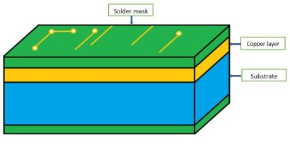
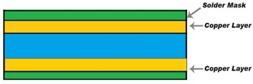
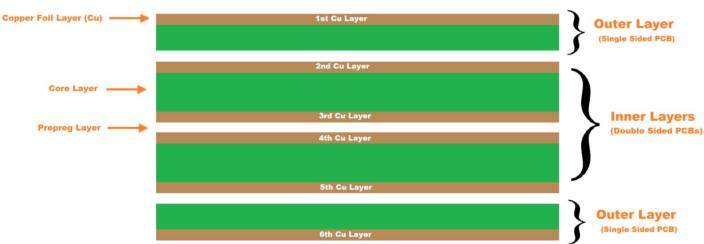

# PCB Types and Material Selection

!!! abstract "Quick answer"
    This guide explains choose PCB types and materials, the relevant design trade-offs, and the points engineers should verify when selecting a display solution.

## Key Takeaways

- Learn choose PCB types and materials, key trade-offs, applications, and engineering selection criteria.
- Use the guidance below to compare the relevant technologies and design trade-offs.
- Validate optical, electrical, mechanical, environmental, and production requirements before final selection.

## PCB Types

Generally, printed circuit boards (PCB) are categorized according to the number of layers, substrate type, and frequency. PCB are divided into single-sided PCB, double-sided PCB, and multi-layer PCB according to the material. At the same time, PCB can also be divided into rigid PCB, flexible PCB, and rigid-flex PCB based on the material.

Single-sided PCB

The single-sided PCB is the simplest type of printed circuit board. The figure below shows the structure of a single-sided PCB. The blue, yellow, and green layers are the substrate, the conductive copper layer, and the solder mask respectively. In the single-sided PCB, only one side of the substrate is coated with a copper layer, and this side is where the components are electrically connected. The single-sided PCB is cost-effective and easy to manufacture. But it has many restrictions on the circuit design because conductive paths cannot cross or overlap. Therefore, the current single-sided PCB is only used for simple circuits such as electronic toys, calculators, etc.

<figure markdown="span" class="displaywiki-figure">
  [{ width="760" loading="lazy" }](pcb-types-materials-the-structure-of-the-single-sided-pcb.jpeg){ .displaywiki-image-link title="Open full-size image" }
  <figcaption>The Structure of the Single-Sided PCB</figcaption>
</figure>

Figure 1: The Structure of the Single-Sided PCB

Double-Sided PCB

Unlike the single-sided PCB, the double-sided PCB has copper layers on both sides of the substrate. Meanwhile, components can be attached on both sides. Both through-hole and surface-mount technologies are widely used to make circuit connections on both sides.

<figure markdown="span" class="displaywiki-figure">
  [{ width="760" loading="lazy" }](pcb-types-materials-the-structure-of-the-double-sided-pcb.jpeg){ .displaywiki-image-link title="Open full-size image" }
  <figcaption>The Structure of the Double-Sided PCB</figcaption>
</figure>

Figure 2: The Structure of the Double-Sided PCB

The plated through holes(PTH) in the double-sided PCB act as a bridge. The walls of the plated through holes are generally plated with copper by an electrolysis process to electrically connect the circuits on one side to the other side. Due to the increased circuit density of the double-sided PCB, the double-sided PCB is suitable for more complex circuits. Compared with a single-sided PCB,  it is flexible and compact. Various applications such as power monitoring and amplifiers are using the double-sided PCB.

<figure markdown="span" class="displaywiki-figure">
  [{ width="760" loading="lazy" }](pcb-types-materials-plated-through-holes-pth-on-the-double-sided-pcb.jpeg){ .displaywiki-image-link title="Open full-size image" }
  <figcaption>Plated Through Holes (PTH) on the Double-Sided PCB</figcaption>
</figure>

Figure 3: Plated Through Holes (PTH) on the Double-Sided PCB

Multi-layer PCB

The multi-layer PCB is composed of more than 2 conductive layers, two of which are on the outer surfaces and the remaining layers are integrated into insulating layers. Between each 2 layers is the prepreg, which is a dielectric layer and can be made very thin. The number of layers in the PCB represents the number of independent conductive copper layers. Generally, the top and bottom layers are single-sided PCB and inner layers are double-sided PCB, all of which are laminated together under high temperature and pressure to form a single board.  Compared with single-sided and double-sided PCB, the multi-layer PCB is good for high-speed circuits such as mobile phones and laptops, and is more flexible and compact. The figure below is an example of a 6-layer PCB.

<figure markdown="span" class="displaywiki-figure">
  [{ width="760" loading="lazy" }](pcb-types-materials-the-6-layer-pcb.jpeg){ .displaywiki-image-link title="Open full-size image" }
  <figcaption>The 6-layer PCB</figcaption>
</figure>

Figure 4: The 6-layer PCB

Regarding the electrical connection between different layers, it is usually achieved through vias: plated through holes(PTH), blind vias, and buried vias. Plated through holes(PTH) access all layers of the multi-layer PCB from top to bottom. Blind vias connect either of the outermost layers of the PCB with the adjacent inner layers. Buried vias that are not visible from the outside simply connect between the internal circuit layers.

<figure markdown="span" class="displaywiki-figure">
  [{ width="760" loading="lazy" }](pcb-types-materials-the-vias.jpeg){ .displaywiki-image-link title="Open full-size image" }
  <figcaption>The vias</figcaption>
</figure>

Figure 5: The vias

Rigid PCB

The substrate materials of the rigid PCB are solid materials such as fiberglass, which cannot be bent or folded. Rigid PCB may be any of the single-sided, double-sided, or multilayer PCB, depending on the needs. The main advantages include low electronic noise and vibration absorption. But rigid PCB cannot be modified or changed once they are made. The applications include laptops, temperature sensors, GPS equipment, etc.

<figure markdown="span" class="displaywiki-figure">
  [{ width="760" loading="lazy" }](pcb-types-materials-the-rigid-pcb.jpeg){ .displaywiki-image-link title="Open full-size image" }
  <figcaption>The Rigid PCB</figcaption>
</figure>

Figure 6: The Rigid PCB

Flexible PCB

Unlike rigid PCB, flexible PCB is generally composed of rolled annealed (RA) copper foil and flexible plastic film. It allows the circuit board to adapt to a form in which the rigid PCB cannot be rotated or moved during use without damaging the circuit on the printed circuit board. Flexible PCB saves cost and a lot of space and greatly reduces the board weight and the size of the application product. In other words, it is an ideal choice for a variety of applications that require high signal trace density.  Flexible PCB can be any of the single-sided, double-sided, or multilayer PCB, depending on the needs. The applications of flexible PCB include complex electronics products, organic light-emitting diode (OLED) fabrication, LCD fabrication, etc.

<figure markdown="span" class="displaywiki-figure">
  [{ width="760" loading="lazy" }](pcb-types-materials-flexible-pcb.jpeg){ .displaywiki-image-link title="Open full-size image" }
  <figcaption>Flexible PCB</figcaption>
</figure>

Figure 7: Flexible PCB

Rigid-Flex PCB

Rigid-flex PCB is a combination of the rigid printed circuit board and the flexible printed circuit board after pressing and other processes. In rigid-flex PCB, interconnections between rigid circuit boards are the flexible parts of the board. Therefore, this type of board can be folded or continuously bent and is usually formed into a curved shape during the manufacturing process. Rigid-flex PCB can be used for products with special requirements since it has both rigid and flexible areas, which can save the internal space and volume of the product, and improve the performance of the product such as higher connection reliability. However, rigid-flex PCB requires multiple production processes, leading to a low yield rate, relatively long production cycle, and high price. The applications of rigid-flex PCB are mainly in the medical, consumer electronics, and aerospace fields.

<figure markdown="span" class="displaywiki-figure">
  [{ width="760" loading="lazy" }](pcb-types-materials-rigid-flex-pcb.jpeg){ .displaywiki-image-link title="Open full-size image" }
  <figcaption>Rigid-flex PCB</figcaption>
</figure>

Figure 8: Rigid-flex PCB

High-Frequency PCB

As a special printed circuit board, high-frequency PCB offers a high-frequency range of 500MHz to 2GHz.  It provides faster signal flow rates, which is suitable for high-speed designs. It has very high requirements for various physical properties, accuracy, and technical parameters. Firstly, the substrate material of high-frequency PCB should have the features of heat resistance, chemical resistance and good impacting resistance. Secondly, the dissipation factor (Df) of the board must be small, which mainly affects the quality of signal transmission. The smaller the dissipation factor, the smaller the signal loss. Furthermore, the dielectric constant(Dk) of the board must be small and stable because the signal transmission rate is inversely proportional to the square root of the material’s dielectric constant. In other words, the high dielectric constant is likely to cause signal transmission delays.

High-frequency PCB substrate should also have a low water absorption characteristic because high water absorption will cause loss of both dissipation factor and dielectric constant when the board gets damp. High-frequency PCB is often used in collision avoidance systems (CAS), satellite systems, radio systems, mobile applications, etc.

<figure markdown="span" class="displaywiki-figure">
  [{ width="760" loading="lazy" }](pcb-types-materials-high-frequency-pcb.jpeg){ .displaywiki-image-link title="Open full-size image" }
  <figcaption>High-Frequency PCB</figcaption>
</figure>

Figure 9: High-Frequency PCB

## Choose Materials For PCB

When designing a PCB board, designers must define the required board material materials for PCB construction. Therefore, designers predominantly consider two fundamental thermal and electrical properties, followed by mechanical properties.

PCB Material Thermal Properties

The thermal properties of a material determine its ability to withstand extreme temperature while maintaining its characteristics. The following are the thermal properties that need to be considered when selecting PCB materials.

Glass transition temperature (Tg)

Glass transition temperature (Tg) is defined as the temperature range in which a pcb material properties experiences transition from a rigid (glassy) state to a deformable (flexible) state since polymer chains start to move. Figure 1 below demonstrates the melting and softening phenomenon of the substrate. Between the glass transition temperature(Tg) and the melting temperature(Tm), the substrate reaches a rubbery state. Once the temperature is lower than Tg, the materials for PCB construction will harden, and the performance of the substrate will back to its original state. If the temperature is higher than Tm, the substrate will rapidly lose its shape as well as its strength since the material transforms from solid to viscous liquid.

<figure markdown="span" class="displaywiki-figure">
  [{ width="760" loading="lazy" }](pcb-types-materials-the-state-of-the-substrate.jpeg){ .displaywiki-image-link title="Open full-size image" }
  <figcaption>The state of the substrate</figcaption>
</figure>

Figure 1: The state of the substrate

Decomposition temperature (Td)

Decomposition temperature (Td) refers to the temperature at which the substrate has a chemical decomposition, which causes the substrate to lose at least 5% of its mass. It is worth noting that if the temperature of the substrate reaches or exceeds Td, the subsequent changes in its properties are irreversible. Therefore, it is necessary to choose a material that can work well in a temperature range higher than Tg but much lower than Td. The Td of most PCB material properties is higher than 320, which is favorable as most soldering temperatures are in the range of 200-250°C.

Coefficient of thermal expansion (CTE)

The expansion rate of material when it heats up is called the coefficient of thermal expansion (CTE). The unit of CTE is in ppm(parts per million)/°C. Generally, the CTE of the dielectric substrate is higher than that of copper, which leads to interconnections problems when the PCB is heated. As the temperature of the dielectric material rises above Tg, the CTE also goes up. Since the woven glass restricts the material in the X and Y directions, even if the temperature of the material is higher than Tg, the CTE along the X and Y axes will not change much. As a result, the material will expand in the Z direction, but the CTE along this axis should be as low as possible.

Thermal conductivity

Thermal conductivity (k) is defined as the ability of a PCB material selection to conduct heat. In other words, the higher the thermal conductivity, the higher the heat transfer; while the lower the thermal conductivity, the lower the heat transfer. The expression of thermal conductivity is:

K= (Q * d) / (A * ΔT)

Q, d, A, ΔT and  represent the amount of heat transferred, the distance between two isothermal planes, area of the surface, and temperature difference respectively. Compared with the thermal conductivity of copper (386W/M℃), the thermal conductivity of most dielectric materials is lower, ranging from 0.3 to 0.6W/M℃. This may explain why copper substrates will take away more heat than dielectric substrates.

Electrical Properties

Dielectric constant or relative permittivity (Er or Dk)

Dielectric constant or relative permittivity (Er or Dk) is defined as the ratio of material permittivity to vacuum permittivity. Most materials for PCB construction dielectric constants are between 2.5 to 4.5. The electric constant changes with frequency and is usually inversely proportional to frequency. Those materials that maintain a relatively stable dielectric constant over a wide frequency range are suitable for high-frequency applications

Dielectric loss tangent or dissipation factor (Tan or Df)

Dielectric loss refers to the inherent electromagnetic energy dissipation of dielectric materials. It can also be parameterized according to the corresponding loss tangent (Tan ) which is a phase angle between resistance and reactive current in the dielectric. The range of dissipation factor Df is from 0.001 to 0.030.

PCB Material Mechanical Properties

Tensile (Young’s) modulus or elastic modulus

Tensile modulus is a ratio of the stress to the strain along the same axis within the stress range applicable to Hooke’s law. The greater Young’s modulus value, the stiffer the substrate material. The expression is:

E = stress / strain = (F/A) / [(L – Lo) /L]

F, A, L, and Lo are the force applied on the material, the cross-section area of the material, the original length of the material, and the length of the material after being stretched, respectively.

Flexural strength

Flexural strength also called bend strength or transverse rupture strength, is defined as the stress before the PCB material yields when loaded in the center or supported at the end. The unit of flexural strength is in kg/m2 or psi.

## Related reading

- [PCB Construction and Manufacturing Process](pcb-construction-process.md)
- [PCB Design, Fabrication, and Interconnection Selection](pcb-design-interconnections.md)
- [Display Interfaces Explained: MCU, RGB, LVDS, MIPI, SPI, and More](display-interface-guide.md)
