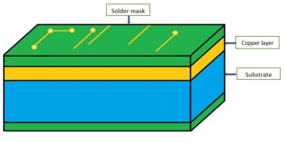
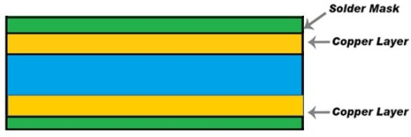
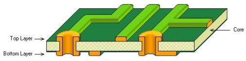
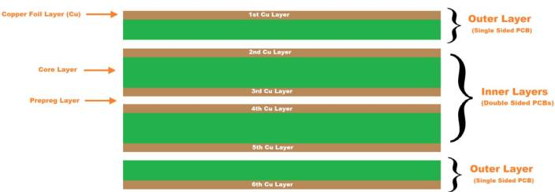
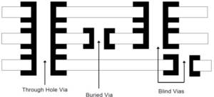
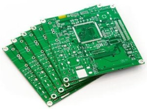
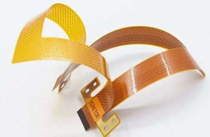
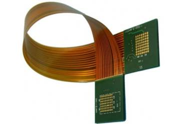
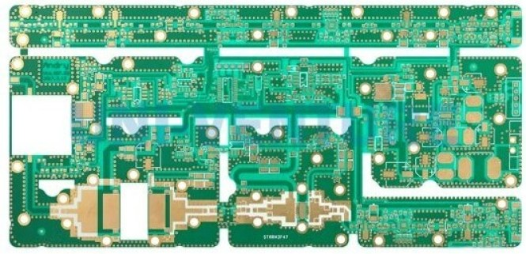
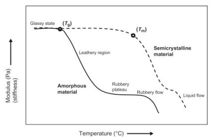

<script type="application/ld+json">
{
  "@context": "https://schema.org",
  "@type": "FAQPage",
  "mainEntity": [
    {
      "@type": "Question",
      "name": "When should you choose a single-sided PCB versus a double-sided PCB?",
      "acceptedAnswer": {
        "@type": "Answer",
        "text": "Single-sided boards are used **only for the simplest circuits** (toys, calculators, remote controls, the primary side of DC power supplies) because conductive paths cannot cross. Slightly more complex applications (appliance main controls, power boards, industrial-control boards) almost always start from a double-sided board."
      }
    },
    {
      "@type": "Question",
      "name": "Do high-speed PCBs always require PTFE materials?",
      "acceptedAnswer": {
        "@type": "Answer",
        "text": "Not necessarily. **Below 5 Gbps**, high-Tg FR-4 with a mid-loss / low-loss grade is usually enough; for **5–10 Gbps** choose Mid-loss; only **above 10 Gbps / PCIe 4.0+ / DDR5** calls for the PTFE route (Rogers, Isola, Hitachi, and so on). Cost is always strongly coupled to speed."
      }
    },
    {
      "@type": "Question",
      "name": "Is a higher Tg board always better?",
      "acceptedAnswer": {
        "@type": "Answer",
        "text": "It is an engineering trade-off: the higher the Tg, the better the heat resistance, but the more brittle and expensive the board. Standard FR-4 (Tg around 130 °C) is enough for ordinary lead-free reflow; high-Tg FR-4 (Tg around 150–170 °C) suits multi-layer builds, repeated reflow, and automotive use; ultra-high Tg (above 200 °C) is for aerospace and defense."
      }
    },
    {
      "@type": "Question",
      "name": "How do you choose between metal-core and ceramic substrates?",
      "acceptedAnswer": {
        "@type": "Answer",
        "text": "For **LED lighting, power modules, and low-to-medium power**, prefer aluminum-core boards; for **high-power-density power electronics (SiC / GaN)**, prefer aluminum-nitride ceramic; for **extreme heat dissipation plus insulation**, consider boron nitride (BeO exists but carries health risks, so treat it and SiC with care)."
      }
    },
    {
      "@type": "Question",
      "name": "Can a flex PCB fully replace a rigid PCB?",
      "acceptedAnswer": {
        "@type": "Answer",
        "text": "No. FPCs cost more, solder less reliably, cannot carry large currents or large components, and their copper traces fatigue after long-term vibration. **FPCs are for connection, routing, and signal interconnection, while rigid boards carry the components**; rigid-flex boards are the compromise that covers both."
      }
    },
    {
      "@type": "Question",
      "name": "What is the difference in application between high-Dk and low-Dk materials?",
      "acceptedAnswer": {
        "@type": "Answer",
        "text": "Low Dk makes signals propagate faster and is common in high-speed designs; high Dk lets the traces be made narrower for the same impedance (Rogers RO4003 is a low-Dk example, RO4350B is slightly higher), which suits miniaturization or antennas."
      }
    }
  ]
}
</script>

# PCB Types and Material Selection

!!! abstract "Quick answer"
    PCBs can be classified along four dimensions: layer count, substrate rigidity, speed and frequency, and application — single-, double-, and multi-layer boards; rigid, flex, and rigid-flex boards; ordinary digital, high-speed digital, and RF/microwave boards; LED metal-core boards and power ceramic substrates. Material selection centers on three groups of properties — thermal (Tg / Td / CTE / thermal conductivity), electrical (Dk / Df / dissipation factor), and mechanical (Young's modulus / flexural strength). These parameters must be tied to signal speed, power dissipation, and the thermal environment before an engineering trade-off can be made.

## Key Takeaways

- By **layer count**, PCBs divide into single-sided, double-sided, and multi-layer boards.
- By **substrate rigidity**, they divide into rigid, flex, and rigid-flex boards.
- By **speed and frequency**, they divide into ordinary digital, high-speed digital (PCIe / DDR / USB 3.x / HDMI / MIPI), and RF/microwave (5G / radar / WiGig) boards.
- By **application**, they divide into LED metal-core boards (aluminum and copper substrates), power-module ceramic substrates, automotive long-life boards, and more.
- Material selection looks at three property groups: **thermal** (reliability under lead-free reflow and high-temperature environments), **electrical** (signal integrity and impedance stability), and **mechanical** (vibration / bending / drop lifetime).

## 1. How PCBs Are Classified

The industry usually classifies PCBs along the following four dimensions, each of which implies a different engineering trade-off:

- **By layer count**: single-sided, double-sided, multi-layer.
- **By substrate material**: rigid (FR-4 / high-Tg FR-4 / high-frequency / ceramic), flex (PI / PET), and rigid-flex.
- **By frequency / speed**: ordinary digital, high-speed digital, RF and microwave.
- **By application**: consumer LED metal-core boards, power-module ceramic substrates, automotive-grade boards, medical boards, aerospace boards.

!!! warning "Production note"
    Under volume production or harsh conditions (high and low temperature, damp heat, vibration, ESD), check the datasheet curves for this parameter; running outside the specified range will significantly shorten lifetime.

## 2. Classification by Layer Count

### 2.1 Single-Sided PCB

The simplest type. Blue, yellow, and green correspond to the substrate, the conductive copper layer, and the solder mask. A single-sided board has copper on only one side of the substrate, which is the only path for electrical connection of components.

<figure markdown="span" class="displaywiki-figure">
  [{ width="760" loading="lazy" }](pcb-types-materials-the-structure-of-the-single-sided-pcb.jpeg){ .displaywiki-image-link title="Open full-size image" }
  <figcaption>Structure of a single-sided PCB: solder mask, copper layer, and substrate</figcaption>
</figure>

**Advantages**: lowest cost, simple manufacturing process.

**Disadvantages**: conductive paths cannot cross or overlap, so design freedom is extremely limited.

**Applications**: electronic toys, calculators, low-cost remote controls, simple power supplies, and similar circuits. The typical structure is shown above.

### 2.2 Double-Sided PCB

Both sides of the substrate carry copper layers, components can be mounted on both sides, and the two sides are connected through plated through holes (PTH).

<figure markdown="span" class="displaywiki-figure">
  [{ width="760" loading="lazy" }](pcb-types-materials-the-structure-of-the-double-sided-pcb.jpeg){ .displaywiki-image-link title="Open full-size image" }
  <figcaption>Structure of a double-sided PCB</figcaption>
</figure>

<figure markdown="span" class="displaywiki-figure">
  [{ width="760" loading="lazy" }](pcb-types-materials-plated-through-holes-pth-on-the-double-sided-pcb.jpeg){ .displaywiki-image-link title="Open full-size image" }
  <figcaption>Plated through holes (PTH) on a double-sided PCB</figcaption>
</figure>

**Advantages**: routing can be distributed over two sides, so density improves noticeably; the combination of vias and surface-mount technology makes component placement more flexible.

**Applications**: power monitoring, amplifiers, industrial control, consumer power supplies, and consumer-electronics main boards.

### 2.3 Multi-Layer PCB

A multi-layer PCB consists of more than two conductive copper layers; the two outermost layers are single-sided and **all inner layers are double-sided**. The dielectric between every pair of layers is prepreg, which can be as thin as 0.05 mm or less.

<figure markdown="span" class="displaywiki-figure">
  [{ width="760" loading="lazy" }](pcb-types-materials-the-6-layer-pcb.jpeg){ .displaywiki-image-link title="Open full-size image" }
  <figcaption>A 6-layer PCB: outer layers are single-sided, inner layers are double-sided</figcaption>
</figure>

All layers are laminated together in a single high-temperature, high-pressure press cycle. **Multi-layer PCBs** suit high-speed, high-density, complex interconnect scenarios:

- **Phones / laptops**: typically 6–10 layers.
- **Servers / switches**: 10–20 layers plus HDI.
- **Core routers / AI accelerators**: 20+ layers plus multi-step HDI.

Interconnection between different layers is done with three kinds of via — **plated through holes (PTH), blind vias, and buried vias**. PTHs run from the top to the bottom of the board and access every layer; blind vias connect an outer layer to the adjacent inner layers; buried vias connect only internal layers and are invisible from the outside. See [PCB Construction and Manufacturing Process](pcb-construction-process.md) and [PCB Design, Fabrication, and Interconnection Selection](pcb-design-interconnections.md).

<figure markdown="span" class="displaywiki-figure">
  [{ width="760" loading="lazy" }](pcb-types-materials-the-vias.jpeg){ .displaywiki-image-link title="Open full-size image" }
  <figcaption>Through-hole vias, blind vias, and buried vias</figcaption>
</figure>

## 3. Classification by Substrate Rigidity

### 3.1 Rigid PCB

The substrate is a rigid material such as fiberglass, and **the finished board cannot be bent**. A rigid PCB may be single-sided, double-sided, or multi-layer.

<figure markdown="span" class="displaywiki-figure">
  [{ width="760" loading="lazy" }](pcb-types-materials-the-rigid-pcb.jpeg){ .displaywiki-image-link title="Open full-size image" }
  <figcaption>A rigid PCB</figcaption>
</figure>

**Advantages**: low electronic noise, vibration resistance, high strength, mature fabrication.

**Disadvantages**: once made, the board cannot be modified.

**Applications**: laptops, temperature sensors, GPS equipment, industrial controllers, consumer main boards.

### 3.2 Flexible PCB (FPC)

A flexible PCB is typically built from **rolled-annealed copper foil (RA copper)** together with **polyimide (PI)** or **polyester (PET)** film. It can bend without damaging the circuit on the copper layers.

<figure markdown="span" class="displaywiki-figure">
  [{ width="760" loading="lazy" }](pcb-types-materials-flexible-pcb.jpeg){ .displaywiki-image-link title="Open full-size image" }
  <figcaption>A flexible PCB (FPC)</figcaption>
</figure>

**Advantages**: saves space, reduces weight, adapts to irregular shapes, and tolerates dynamic bending.

**Applications**: internal interconnects in OLED / LCD modules, phone camera modules, wearables, medical probes, and connector stiffener boards.

### 3.3 Rigid-Flex PCB

Rigid and flex boards are combined by lamination; **the connection between rigid sections is made by the flexible portions**. The board can be pre-folded into a 3D shape during production.

<figure markdown="span" class="displaywiki-figure">
  [{ width="760" loading="lazy" }](pcb-types-materials-rigid-flex-pcb.jpeg){ .displaywiki-image-link title="Open full-size image" }
  <figcaption>A rigid-flex PCB</figcaption>
</figure>

**Advantages**: saves internal space and connectors, improves connection reliability, lowers assembly defect rates.

**Disadvantages**: complex process, low yield, long production cycle, high price.

**Applications**: medical, consumer electronics, aerospace, and defense products where space is tight and reliability requirements are high.

## 4. Classification by Speed / Frequency

### 4.1 High-Frequency PCB

Purpose-built for applications in the 500 MHz – 2 GHz range (and beyond), where fast signal transmission, low loss, and good interference immunity are required.

<figure markdown="span" class="displaywiki-figure">
  [{ width="760" loading="lazy" }](pcb-types-materials-high-frequency-pcb.jpeg){ .displaywiki-image-link title="Open full-size image" }
  <figcaption>A high-frequency PCB</figcaption>
</figure>

**A high-frequency substrate must satisfy**:

- **Heat resistance**: withstand reflow soldering, wave soldering, and thermal shock testing.
- **Chemical resistance**: withstand plating, etching, and electroplating chemistries.
- **Impact resistance**: pass vibration and drop testing.
- **Stable Dk**: the relative permittivity stays stable across a wide frequency range.
- **Low Df**: the smaller the loss tangent (tan δ), the lower the signal loss.
- **Low moisture absorption**: absorbed water shifts Dk / Df.

**Applications**: collision avoidance radar (CAS), satellite communication, radio systems, 5G base stations, and RF front ends in mobile devices.

### 4.2 High-Speed Digital PCB

PCBs carrying PCIe, DDR, USB 3.x, HDMI, MIPI, SATA, and other high-speed digital interfaces. They require:

- **Impedance control** (50 Ω / 90 Ω / 100 Ω).
- **Differential-pair length matching** (skew control).
- **Solid reference planes** (avoid crossing plane splits).
- **Low-loss materials** (Mid-loss / Low-loss grades).

### 4.3 Ordinary Digital / Consumer PCB

Dk is typically 4.2–4.5 and Df around 0.02; standard FR-4 is sufficient.

## 5. Classification by Application

### 5.1 Metal-Core Boards (Aluminum and Copper Substrates)

**Aluminum-core and copper-core boards** are dedicated to LED lighting and power modules. A metal layer on the bottom of the board carries away heat from high-power-density devices.

### 5.2 Ceramic Substrates (Alumina, Aluminum Nitride, Beryllium Oxide)

Dedicated to high-power modules (IGBT, SiC, GaN). Aluminum-nitride ceramic substrates reach a thermal conductivity of 170 W/(m·K), far above FR-4. Ceramic substrates also offer electrical insulation and mechanical strength well beyond ordinary substrates, but their cost is high, which makes them unsuitable for high-volume consumer products.

### 5.3 Automotive-Grade PCB

Must pass AEC-Q100 / Q104 / Q200 stress testing and deliver long life, wide temperature range, and vibration resistance. Substrates are mostly high-Tg FR-4 or PI; the stack-up needs higher symmetry, and ENIG is the preferred surface finish.

## 6. Key Properties of PCB Materials

When designing a PCB, **the board material must be defined first**, and three property groups matter: **thermal, electrical, and mechanical**.

### 6.1 Thermal Properties

Thermal properties decide whether a PCB keeps its mechanical and electrical stability under extreme temperatures.

#### 6.1.1 Glass Transition Temperature (Tg)

The glass transition temperature Tg is the temperature range in which a polymer changes from a glassy state to a rubbery state. **Between Tg and the melting temperature Tm**, the substrate is in its rubbery state; below Tg it is hard and brittle, and above Tg it becomes soft.

<figure markdown="span" class="displaywiki-figure">
  [{ width="760" loading="lazy" }](pcb-types-materials-the-state-of-the-substrate.jpeg){ .displaywiki-image-link title="Open full-size image" }
  <figcaption>States of the substrate: below Tg the material is glassy, between Tg and Tm it is rubbery, and beyond Td it decomposes</figcaption>
</figure>

Practical rule: lead-free reflow peaks at 245–260 °C, so standard FR-4 needs Tg above 150 °C; multi-layer, high-density, and multi-reflow builds should use high-Tg FR-4 with Tg above 170 °C.

#### 6.1.2 Decomposition Temperature (Td)

The decomposition temperature Td is the temperature at which the substrate material has lost **5% of its mass**. Once the temperature reaches or exceeds Td, the material decomposes irreversibly.

Practical requirement: boards with Td above 320 °C survive repeated reflow cycles and rework reliably.

#### 6.1.3 Coefficient of Thermal Expansion (CTE)

The coefficient of thermal expansion CTE (in ppm/°C) describes how much the material expands as temperature changes.

- The X / Y direction CTE of the substrate is limited by the woven glass fiber and is usually low (10–20 ppm/°C).
- **The Z-direction CTE of the substrate is higher** (50–70 ppm/°C): as temperature rises, Z-axis expansion can damage the plated hole copper, so low Z-CTE laminates should be chosen.
- Copper's CTE is about 17 ppm/°C. A CTE mismatch between substrate and copper creates stress, fracture, and solder-joint cracking.

#### 6.1.4 Thermal Conductivity (k)

Thermal conductivity is defined as the heat power conducted through a unit thickness under a unit temperature difference. Materials with high k dissipate heat better:

```text
Q = k · A · ΔT / d
```

Copper's k reaches 386 W/(m·°C), while ordinary FR-4 is only 0.3–0.6 W/(m·°C). **Metal-core and ceramic substrates** exist precisely to use high-k materials to carry heat away from power devices quickly.

### 6.2 Electrical Properties

#### 6.2.1 Dielectric Constant (Dk / εr)

The dielectric constant Dk is the ratio of a material's permittivity to the permittivity of vacuum. FR-4's Dk is typically between 4.2 and 4.5.

**Lower Dk**: signals propagate faster, but cost is usually higher; Dk tends to drop as frequency rises.

#### 6.2.2 Dissipation Factor (Df / tan δ)

The dissipation factor Df characterizes how much electromagnetic energy a material converts into heat.

- Ordinary FR-4: Df ≈ 0.02;
- High-frequency laminates (Rogers RO4000 series): Df ≈ 0.0021;
- Ultra-low-loss laminates: Df below 0.0015.

A high Df attenuates high-speed signals noticeably in the dielectric and is the "killer" of GHz signals.

### 6.3 Mechanical Properties

#### 6.3.1 Young's Modulus

Within the range where Hooke's law applies, Young's modulus is the ratio of stress to strain:

```text
E = σ / ε = (F / A) / [(L - L₀) / L₀]
```

The larger E is, the less the material deforms. A poor stiffness match in a multi-layer stack-up affects warpage and component stress after reflow.

#### 6.3.2 Flexural Strength

Flexural strength, also called transverse rupture strength, is the ultimate stress a material withstands before breaking in a three- or four-point bend test, in psi or N/mm².

Practical meaning: **the bending life of a flex PCB** depends on bend radius, bend angle, static versus dynamic stress, material thickness, and copper-layer structure.

## 7. Material Selection Table

| Speed / frequency | Recommended material | Df | Typical scenarios |
| --- | --- | --- | --- |
| Ordinary digital ≤ 100 MHz | FR-4 (standard Tg) | ~ 0.02 | Toys, appliances, consumer main boards |
| High-speed digital (PCIe / DDR / USB 3.x / HDMI / MIPI) | High-Tg FR-4 / Mid-loss | 0.005–0.012 | Motherboards, gateways, embedded SoC |
| 5G / Wi-Fi 6 RF | High-frequency PTFE / modified resin | below 0.005 | Base stations, Wi-Fi front ends |
| Radar / millimeter wave | Ultra-low-loss PTFE (Df below 0.002) | below 0.002 | Automotive millimeter-wave radar, satellites |
| High-power LED | Aluminum-core / ceramic substrate | Not critical | Street lights, vehicle lamps, projection light sources |
| Power modules (IGBT / SiC / GaN) | Aluminum-nitride / silicon-nitride ceramic | Not critical | Traction inverters, server power supplies |
| Long-life / automotive | High-Tg FR-4 + PI reinforcement | 0.005–0.02 | ECU, ADAS, automotive TBOX |

## 8. Frequently Asked Questions

??? question "Q1: When should you choose a single-sided PCB versus a double-sided PCB?"
    Single-sided boards are used **only for the simplest circuits** (toys, calculators, remote controls, the primary side of DC power supplies) because conductive paths cannot cross. Slightly more complex applications (appliance main controls, power boards, industrial-control boards) almost always start from a double-sided board.

??? question "Q2: Do high-speed PCBs always require PTFE materials?"
    Not necessarily. **Below 5 Gbps**, high-Tg FR-4 with a mid-loss / low-loss grade is usually enough; for **5–10 Gbps** choose Mid-loss; only **above 10 Gbps / PCIe 4.0+ / DDR5** calls for the PTFE route (Rogers, Isola, Hitachi, and so on). Cost is always strongly coupled to speed.

??? question "Q3: Is a higher Tg board always better?"
    It is an engineering trade-off: the higher the Tg, the better the heat resistance, but the more brittle and expensive the board. Standard FR-4 (Tg around 130 °C) is enough for ordinary lead-free reflow; high-Tg FR-4 (Tg around 150–170 °C) suits multi-layer builds, repeated reflow, and automotive use; ultra-high Tg (above 200 °C) is for aerospace and defense.

??? question "Q4: How do you choose between metal-core and ceramic substrates?"
    For **LED lighting, power modules, and low-to-medium power**, prefer aluminum-core boards; for **high-power-density power electronics (SiC / GaN)**, prefer aluminum-nitride ceramic; for **extreme heat dissipation plus insulation**, consider boron nitride (BeO exists but carries health risks, so treat it and SiC with care).

??? question "Q5: Can a flex PCB fully replace a rigid PCB?"
    No. FPCs cost more, solder less reliably, cannot carry large currents or large components, and their copper traces fatigue after long-term vibration. **FPCs are for connection, routing, and signal interconnection, while rigid boards carry the components**; rigid-flex boards are the compromise that covers both.

??? question "Q6: What is the difference in application between high-Dk and low-Dk materials?"
    Low Dk makes signals propagate faster and is common in high-speed designs; high Dk lets the traces be made narrower for the same impedance (Rogers RO4003 is a low-Dk example, RO4350B is slightly higher), which suits miniaturization or antennas.

## Related reading

- [PCB Construction and Manufacturing Process](pcb-construction-process.md)
- [PCB Design, Fabrication, and Interconnection Selection](pcb-design-interconnections.md)
- [Display Interfaces Explained: MCU, RGB, LVDS, MIPI, SPI, and More](display-interface-guide.md)

!!! info "Can't find what you need?"
    If you need more products, resources or support, please contact our team:

    [**:material-archive-arrow-down: Knowledge Base**](../../knowledge/tags.md){ .md-button .md-button--primary }
    [**:material-magnify: Products & Solutions**](https://viewedisplay.com/){ .md-button }
    [**:material-email: Contact Support**](mailto:support@viewedisplay.com){ .md-button }
