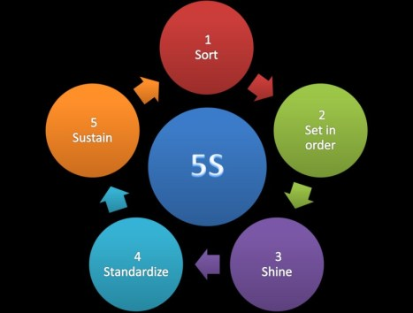
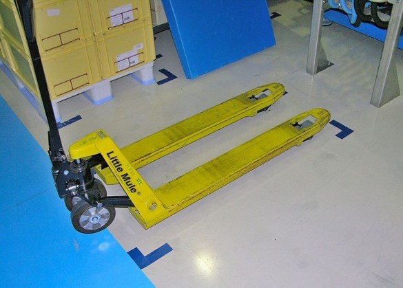
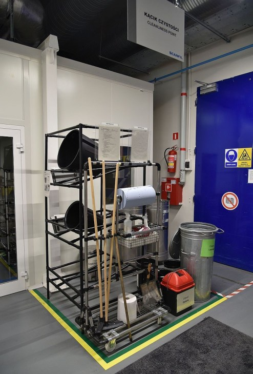
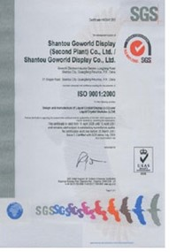
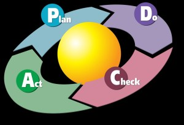
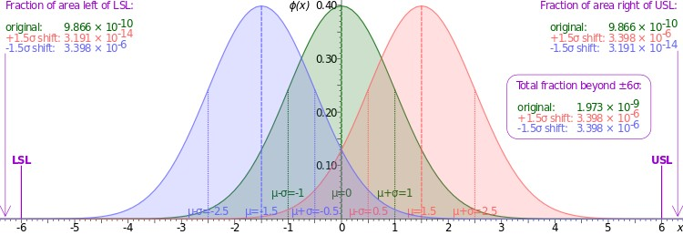
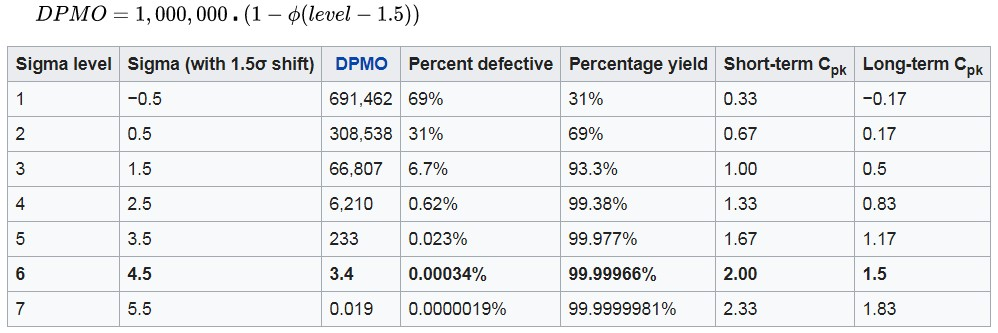

# Display Manufacturing Quality: 5S, ISO 9001, IATF 16949, ISO 14000, and Six Sigma

!!! abstract "Quick answer"
    This guide explains display manufacturing quality control, the relevant design trade-offs, and the points engineers should verify when selecting a display solution.

## Key Takeaways

- Learn display manufacturing quality control, key trade-offs, applications, and engineering selection criteria.
- Use the guidance below to compare the relevant technologies and design trade-offs.
- Validate optical, electrical, mechanical, environmental, and production requirements before final selection.

## 5S Introduction

What is 5S?

5S is a system for organizing spaces so work can be performed efficiently, effectively, and safely. This system focuses on putting everything where it belongs and keeping the workplace clean, which makes it easier for people to do their jobs without wasting time or risking injury.

5S Translation

There are five key practices involved in 5S. They are as follows:

| Japanese Term | American Term | Definition |
| --- | --- | --- |
| Seiri | Sort | Sort through materials, keeping only the essential items needed to complete tasks. (This action involves going through all the contents of a workspace to determine which are needed and which can be removed. Everything that is not used to complete a work process should leave the work area.) |
| Seiton | Set in Order | Ensure that all items are organized and each item has a designated place. Organize all the items left in the workplace in a logical way so they make tasks easier for workers to complete. This often involves placing items in ergonomic locations where people will not need to bend or make extra movements to reach them. |
| Seiso | Shine | Proactive efforts to keep workplace areas clean and orderly to ensure purpose-driven work. This means cleaning and maintaining the newly organized workspace. It can involve routine tasks such as mopping, dusting, etc. or performing maintenance on machinery, tools, and other equipment. |
| Seiketsu | Standardize | Create a set of standards for both organization and processes. In essence, this is where you take the first three S’s and make rules for how and when these tasks will be performed. These standards can involve schedules, charts, lists, etc. |
| Shitsuke | Sustain | Sustain new practices and conduct audits to maintain discipline. This means the previous four S’s must be continued over time. This is achieved by developing a sense of self-discipline in employees who will participate in 5S. |

Each S represents one part of a five-step process that can improve the overall function of a business.

<figure markdown="span" class="displaywiki-figure">
  [{ width="760" loading="lazy" }](quality-management-the-origins-of-5s-5s-lean-manufacturing.jpeg){ .displaywiki-image-link title="Open full-size image" }
  <figcaption>The Origins of 5S – 5S & Lean Manufacturing</figcaption>
</figure>

Fig. 1 5S

The Origins of 5S – 5S & Lean Manufacturing

5S began as part of the Toyota Production System (TPS), the manufacturing method begun at the Toyota Motor Company in the early and mid-20th century. This system, often referred to as Lean manufacturing in the West, aims to increase the value of products or services for customers. This is often accomplished by finding and eliminating waste from production processes.

Lean manufacturing involves the use of many tools such as 5S, kaizen, kanban, jidoka, heijunka, and poka-yoke. 5S is considered a foundational part of the Toyota Production System because until the workplace is in a clean, organized state, achieving consistently good results is difficult. A messy, cluttered space can lead to mistakes, slowdowns in production, and even accidents, all of which interrupt operations and negatively impact a company.

By having a systematically organized facility, a company increases the likelihood that production will occur exactly as it should.

Benefits of 5S

Reduced costs

Higher quality

Increased productivity

Greater employee satisfaction

A safer work environment

What Are the 5 S’s?

The 5S concept might sound a little abstract at this point, but in reality, it’s a very practical, hands-on tool that everyone in the workplace can be a part of.

5S involves assessing everything present in a space, removing what’s unnecessary, organizing things logically, performing housekeeping tasks, and keeping this cycle going. Organize, clean, repeat.

Let’s take a closer look at each of the parts of 5S.

Sort

The first step of 5S, Sort, involves going through all the tools, furniture, materials, equipment, etc. in a work area to determine what needs to be present and what can be removed. Some questions to ask during this phase include:

What is the purpose of this item?

When was this item last used?

How frequently is it used?

Who uses it?

Does it really need to be here?

These questions help determine the value of each item. A workspace might be better off without unnecessary items or items used infrequently. These things can get in the way or take up space.

Keep in mind the best people to assess the items in a space are the people who work in that space. They are the ones who can answer the above questions.

When a group has determined that some items aren’t necessary, consider the following options:

Give the items to a different department

Recycle/throw away/sell the items

Put items into storage

<figure markdown="span" class="displaywiki-figure">
  [{ width="760" loading="lazy" }](quality-management-1s-a-red-tag-area-containing-items-waiting-for-removal.jpeg){ .displaywiki-image-link title="Open full-size image" }
  <figcaption>1S – a red tag area containing items waiting for removal</figcaption>
</figure>

Fig. 2 1S – a red tag area containing items waiting for removal

Set in Order

Once the extra clutter is gone, it’s easier to see what’s what. Now work groups can come up with their own strategies for sorting through the remaining items. Things to consider:

Which people (or workstations) use which items?

When are items used?

Which items are used most frequently?

Should items be grouped by type?

Where would it be most logical to place items?

Would some placements be more ergonomic for workers than others?

Would some placements cut down on unnecessary motion?

Are more storage containers necessary to keep things organized?

During this phase, everyone should determine what arrangements are most logical. That will require thinking through tasks, the frequency of those tasks, the paths people take through the space, etc.

Businesses may want to stop and think about the relationship between organization and larger Lean efforts. What arrangement will cause the least amount of waste?

In Lean manufacturing, waste can take the form of:

Defects

Waiting time

Extra motion

Excess inventory

Overproduction

Extra processing

Unnecessary transportation

Unutilized talents

<figure markdown="span" class="displaywiki-figure">
  [{ width="760" loading="lazy" }](quality-management-2s-simple-floor-marking.jpeg){ .displaywiki-image-link title="Open full-size image" }
  <figcaption>2S – simple floor marking</figcaption>
</figure>

Fig. 3 2S – simple floor marking

Shine

Everyone thinks they know what housekeeping is, but it’s one of the easiest things to overlook, especially when work gets busy. The Shine stage of 5S focuses on cleaning up the work area, which means sweeping, mopping, dusting, wiping down surfaces, putting tools and materials away, etc.

In addition to basic cleaning, Shine also involves performing regular maintenance on equipment and machinery. Planning for maintenance ahead of time means businesses can catch problems and prevent breakdowns. That means less wasted time and no loss of profits related to work stoppages.

Shining the workplace might not sound exciting, but it’s important. And it shouldn’t just be left up to the janitorial staff. In 5S, everyone takes responsibility for cleaning up their workspace, ideally on a daily basis. Doing so makes people take ownership of the space, which in the long run means people will be more invested in their work and in the company.

<figure markdown="span" class="displaywiki-figure">
  [{ width="760" loading="lazy" }](quality-management-3s-cleanliness-point-with-cleaning-tools-and-resources.jpeg){ .displaywiki-image-link title="Open full-size image" }
  <figcaption>3S – cleanliness point with cleaning tools and resources</figcaption>
</figure>

Fig. 4 3S – cleanliness point with cleaning tools and resources

Standardize

Once the first three steps of 5S are completed, things should look pretty good. All the extra stuff is gone, everything is organized, spaces are cleaned, and equipment is in good working order.

The problem is, when 5S is new at a company, it’s easy to clean and get organized…and then slowly let things slide back to the way they were. Standardize makes 5S different from the typical spring-cleaning project. Standardize systematizes everything that just happened and turns one-time efforts into habits. Standardize assigns regular tasks, creates schedules, and posts instructions so these activities become routines. It makes standard operating procedures for 5S so that orderliness doesn’t fall by the wayside.

Depending on the workspace, a daily 5S checklist or a chart might be useful. A posted schedule indicating how frequently certain cleaning tasks must occur and who is responsible for them is another helpful tool.

Initially, people will probably need reminders about 5S. Small amounts of time may need to be set aside daily for 5S tasks. But over time, tasks will become routine and 5S organizing and cleaning will become a part of regular work.

Sustain

Once standard procedures for 5S are in place, businesses must perform the ongoing work of maintaining those procedures and updating them as necessary. Sustain refers to the process of keeping 5S running smoothly, but also of keeping everyone in the organization involved. Managers need to participate, as do employees out on the manufacturing floor, in the warehouse, or in the office. Sustain is about making 5S a long-term program, not just an event or short-term project. Ideally, 5S becomes a part of an organization’s culture. And when 5S is sustained over time, that’s when businesses will start to notice continuous positive results.

<figure markdown="span" class="displaywiki-figure">
  [{ width="760" loading="lazy" }](quality-management-5s-resource-corner-example.jpeg){ .displaywiki-image-link title="Open full-size image" }
  <figcaption>5S resource corner example</figcaption>
</figure>

Fig. 5 5S resource corner example

Safety – The 6th S

Some companies like to include a sixth S in their 5S program: Safety. When safety is included, the system is often called 6S. The Safety step involves focusing on what can be done to eliminate risks in work processes by arranging things in certain ways.

This might involve setting up workstations so they’re more ergonomic, marking intersections—such as the places where forklifts and pedestrians cross paths—with signs, and labeling the storage cabinet for cleaning chemicals so people are aware of potential hazards. If the layout of the workplace or the tasks people perform are dangerous, those dangers should be reduced as much as possible. That’s what the sixth S focuses on.

Some people consider safety an outcome of performing the other five S’s appropriately, and as a result say a sixth S isn’t necessary. They think if the workspace is properly organized and cleaned and uses helpful visual safety cues, a separate safety step is unnecessary.

Neither approach to safety is right or wrong. But however, a business wants to approach safety, it should be aware that paying attention to safety is important.

## ISO9001 Introduction

The ISO 9000 family of quality management systems (QMS) is a set of standards that helps organizations ensure they meet customers and other stakeholder needs within statutory and regulatory requirements related to a product or service. ISO 9000 deals with the fundamentals of quality management systems, including the seven quality management principles that underlie the family of standards. ISO 9001 deals with the requirements that organizations wishing to meet the standard must fulfil.

Third-party certification bodies provide independent confirmation that organizations meet the requirements of ISO 9001. Over one million organizations worldwide are independently certified, making ISO 9001 one of the most widely used management tools in the world today.

Reasons for use

The global adoption of ISO 9001 may be attributable to a number of factors. In the early days, the ISO 9001 requirements were intended to be used by procuring organizations, as the basis of contractual arrangements with their suppliers. This helped reduce the need for “supplier development” by establishing basic requirements for a supplier to assure product quality.

ISO 9000 series Quality Management Principles

The ISO 9000 series are based on seven quality management principles (QMP)

Principle 1 – Customer focus

Organizations depend on their customers and therefore should understand current and future customer needs, should meet customer requirements and strive to exceed customer expectations.

Principle 2 – Leadership

Leaders establish unity of purpose and direction of the organization. They should create and maintain the internal environment in which people can become fully involved in achieving the organization’s objectives.

Principle 3 – Engagement of people

People at all levels are the essence of an organization and their full involvement enables their abilities to be used for the organization’s benefit.

Principle 4 – Process approach

A desired result is achieved more efficiently when activities and related resources are managed as a process.

Principle 5 – Improvement

Improvement of the organization’s overall performance should be a permanent objective of the organization.

Principle 6 – Evidence-based decision making

Effective decisions are based on the analysis of data and information.

Principle 7 – Relationship management

An organization and its external providers (suppliers, contractors, service providers) are interdependent and a mutually beneficial relationship enhances the ability of both to create value.

Contents of ISO 9001:2015

ISO 9001:2015 Quality management systems — Requirements is a document of approximately 30 pages available from the national standards organization in each country. Only ISO 9001 is directly audited against for third-party assessment purposes.

Contents of ISO 9001:2015 are as follows:

Section 1: Scope

Section 2: Normative references

Section 3: Terms and definitions

Section 4: Context of the organization

Section 5: Leadership

Section 6: Planning

Section 7: Support

Section 8: Operation

Section 9: Performance evaluation

Section 10: Continual Improvement

Essentially, the layout of the standard follows the Plan, Do, Check, Act cycle in a process-based approach. The purpose of the quality objectives is to determine the conformity of the requirements (customers and organizations), facilitate effective deployment and improve the quality management system.

Before the ISO 9001 certification body can issue or renew a certificate, the auditor must be satisfied that the company being assessed has implemented the requirements of sections 4 to 10. Sections 1 to 3 are not directly audited against, but because they provide context and definitions for the rest of the standard, not that of the organization, their contents must be taken into account.

The standard no longer specifies that the organization shall issue and maintain documented procedures, but ISO 9001:2015 requires the organization to document any other procedures required for its effective operation. The standard also requires the organization to issue and communicate a documented quality policy, a quality management system scope, and quality objectives. The standard no longer requires compliant organizations to issue a formal Quality Manual. The standard does require retention of numerous records, as specified throughout the standard. New for the 2015 release is a requirement for an organization to assess risks and opportunities (section 6.1) and to determine internal and external issues relevant to its purpose and strategic direction (section 4.1). The organization must demonstrate how the standard’s requirements are being met, while the external auditor’s role is to determine the quality management system’s effectiveness. More detailed interpretation and implementation examples are often sought by organizations seeking more information in what can be a very technical area.

ISO 9001 Certification

The International Organization for Standardization (ISO) does not certify organizations itself. Numerous certification bodies exist, which audit organizations and upon success, issue ISO 9001 compliance certificates.

An organization applying for ISO 9001 certification is audited based on an extensive sample of its sites, functions, products, services, and processes. The auditor presents a list of problems (defined as “nonconformities”, “observations”, or “opportunities for improvement”) to management. If there are no major nonconformities, the certification body issues a certificate. Where major nonconformities are identified, the organization presents an improvement plan to the certification body (e.g., corrective action reports showing how the problems will be resolved); once the certification body is satisfied that the organization has carried out sufficient corrective action, it issues a certificate. The certificate is limited by a certain scope and displays the addresses to which the certificate refers.

An ISO 9001 certificate is not a once-and-for-all award but must be renewed at regular intervals recommended by the certification body, usually once every three years. There are no grades of competence within ISO 9001: either a company is certified (meaning that it is committed to the method and model of quality management described in the standard) or it is not. In this respect, ISO 9001 certification contrasts with measurement-based quality systems.

ISO 9001 introduction – Auditing

Two types of auditing are required to become registered to the standard: auditing by an external certification body (external audit) and audits by internal staff trained for this process (internal audits). The aim is a continual process of review and assessment to verify that the system is working as it is supposed to, to find out where it can improve, and to correct or prevent identified problems. It is considered healthier for internal auditors to audit outside their usual management line, so as to bring a degree of independence to their judgements.

### Advantages

Proper quality management can improve business, often having a positive effect on investment, market share, sales growth, sales margins, competitive advantage, and avoidance of litigation. The quality principles in ISO 9000:2000 are also sound, according to Wade and Barnes, who says that “ISO 9000 guidelines provide a comprehensive model for quality management systems that can make any company competitive”. Sroufe and Curkovic, (2008) found benefits ranging from registration required to remain part of a supply base, better documentation, to cost benefits, and improved involvement and communication with management. According to ISO 2015 version of the standard brings the following benefits:

By assessing their context, organizations can define who is affected by their work and what they expect. This enables clearly stated business objectives and the identification of new business opportunities.

- Organizations can identify and address the risks associated with their organization.

By putting customers first, organizations can make sure they consistently meet customer needs and enhance customer satisfaction. This can lead to more repeat customers, new clients and increased business for the organization.

Organizations work in a more efficient way as all their processes are aligned and understood by everyone. This increases productivity and efficiency, bringing internal costs down.

- Organizations will meet necessary statutory and regulatory requirements.

- Organizations can expand into new markets, as some sectors and clients require ISO 9001 before doing business.

<figure markdown="span" class="displaywiki-figure">
  [{ width="760" loading="lazy" }](quality-management-example-of-iso9001-certification.jpeg){ .displaywiki-image-link title="Open full-size image" }
  <figcaption>Example of ISO9001 Certification</figcaption>
</figure>

- Fig. 1 Example of ISO9001 Certification

## Ts16949 Introduction

ISO TS 16949 is an ISO technical specification aimed at the development of a quality management system that provides for continual improvement, emphasizing defect prevention and the reduction of variation and waste in the automotive industry supply chain and production. It is based on the ISO 9001 standard.

It was prepared by the International Automotive Task Force (IATF) and the “Technical Committee” of ISO. It harmonizes the country-specific regulations of quality management systems.

About 30 percent of the more than 100 existing automobile manufacturers affiliate the requirements of the norm but especially the large Asian manufacturers have differentiated, own requirements for the quality management systems of their corporate group and their suppliers.

ISO/TS 16949 applies to the design/development, production and, when relevant, installation and servicing of automotive-related products.

The requirements are intended to be applied throughout the supply chain. For the first time vehicle assembly plants will be encouraged to seek ISO/TS 16949 certification.

Contents of the specification

The aim of the standard TS 16949 is to improve the system and process quality to increase customer satisfaction, to identify problems and risks in the production process and supply chain, to eliminate their causes and to examine and take corrective and preventive measures for their effectiveness. The focus is not on the discovery, but on the avoidance of errors. The eight main chapters of the standards are:

Chapters 1-3: Introduction and Preface

Chapter 4: Quality Management System (general requirements, control of documents and records)

4.1 General

4.2 Documentation Requirements

4.2.1 General

4.2.2 Quality Manual

4.2.3 Control of documents

4.2.3.1 Engineering Specification

4.2.4 Control of records

4.2.4.1 Records retention

Chapter 5: Responsibility of the management

Chapter 6: Management of resources

Chapter 7: Product realization

Chapter 8: Measurement, Analysis and Improvement

The process-oriented approach to business processes that is addressed in the ISO 9001:2008 is the base of the standard. It looks at the business processes in a process environment in which there are interactions and interfaces that need to be recognized, mapped and controlled by the quality management system. Additionally, the gateways to the exterior (to sub-suppliers, customers and to remote locations) are defined. The Standard distinguishes between customer-oriented processes, supporting processes and management processes. This process-oriented approach is intended to improve the overview of the whole process. This is not an isolated process, but a combination of all interacting business processes which affect the quality performance of a firm.

A key requirement of ISO/TS 16949:2009 is the fulfillment of customer-specific requirements, set up by the automotive manufacturer in addition to the quality management system of their suppliers. This may have decisively contributed to the worldwide recognition of the TS by many manufacturers.

Certification ISO/TS 16949

The ISO/TS 16949 can be applied throughout the supply chain in the automotive industry. Certification takes place on the basis of the certification rules issued by the International Automotive Task Force (IATF). The certificate is valid for three years and must be confirmed annually (as a minimum) by an IATF certified auditor (3rd Party Auditor) of an IATF recognized certification body. Re-certification is required at the expiry of the three-year period. Certification pursuant to ISO/TS 16949 is intended to build up or enforce the confidence of a (potential) customer towards the system and process quality of a (potential) supplier. Today, a supplier without a valid certificate has little chance of supplying a Tier 1 supplier and certainly no chance of supplying a car manufacturer with standard parts, if indeed that OEM is a participating member of the IATF.

<figure markdown="span" class="displaywiki-figure">
  [{ width="760" loading="lazy" }](quality-management-iso-ts16949-certificate.jpeg){ .displaywiki-image-link title="Open full-size image" }
  <figcaption>ISO/TS16949 Certificate</figcaption>
</figure>

Fig. 1 ISO/TS16949 Certificate

## ISO 14000 Introduction

ISO 14000 is a family of standards related to environmental management that exists to help organizations (a) minimize how their operations (processes, etc.) negatively affect the environment (i.e. cause adverse changes to air, water, or land); (b) comply with applicable laws, regulations, and other environmentally oriented requirements; and (c) continually improve in the above.

ISO 14000 is similar to ISO 9000 quality management in that both pertain to the process of how a product is produced, rather than to the product itself. As with ISO 9001, certification is performed by third-party organizations rather than being awarded by ISO directly. The current version of ISO 14001 is ISO 14001:2015.

Development of the ISO 14000 series

The ISO 14000 family includes most notably the ISO 14001 standard, which represents the core set of standards used by organizations for designing and implementing an effective environmental management system (EMS). Other standards in this series include ISO 14004, which gives additional guidelines for a good EMS, and more specialized standards dealing with specific aspects of environmental management. The major objective of the ISO 14000 series of norms is to provide “practical tools for companies and organizations of all kinds looking to manage their environmental responsibilities.”

The ISO 14000 series is based on a voluntary approach to environmental regulation. The series includes the ISO 14001 standard, which provides guidelines for the establishment or improvement of an EMS.

ISO 14001 Standard

ISO 14001 defines criteria for an EMS. It does not state requirements for environmental performance but rather maps out a framework that a company or organization can follow to set up an effective EMS. It can be used by any organization that wants to improve resource efficiency, reduce waste, and reduce costs. Using ISO 14001 can provide assurance to company management and employees as well as external stakeholders that environmental impact is being measured and improved. ISO 14001 can also be integrated with other management functions and assists companies in meeting their environmental and economic goals.

ISO 14001 is known as a generic management system standard, meaning that it is relevant to any organization seeking to improve and manage resources more effectively. This includes:

single-site to large multi-national companies

high-risk companies to low-risk service organizations

the manufacturing, process, and service industries, including local governments

all industry sectors, including public and private sectors

original equipment manufacturers and their suppliers

ISO 14001:2015

All standards are periodically reviewed by ISO to ensure they still meet market requirements. The current version is ISO 14001:2015, and certified organizations were given a three-year transition period to adapt their environmental management system to the new edition of the standard. The new version of ISO 14001 focuses on the improvement of environmental performance rather than the improvement of the management system itself. It also includes several new updates all aimed at making environmental management more comprehensive and relevant to the supply chain. One of the main updates asks organizations to consider environmental impact during the entire life cycle, although there is no requirement to actually complete a life cycle analysis. Additionally, the commitments of top management and the methods of evaluating compliance have also been strengthened. Another significant change linked ISO 14001 to the general management system structure, introduced in 2015, called the High Level Structure. Both ISO 9001 and 14001 use this same structure, making implementation and auditing more uniform. The new standard also requires the holder of the certificate to specify risks and opportunities and how to address them.

Basic Principles and Methodology

The basic principles of ISO 14001 are based on the well-known Plan-Do-Check-Act (PDCA) cycle.

<figure markdown="span" class="displaywiki-figure">
  [{ width="760" loading="lazy" }](quality-management-the-pdca-cycle.jpeg){ .displaywiki-image-link title="Open full-size image" }
  <figcaption>The PDCA Cycle</figcaption>
</figure>

Fig.1 The PDCA Cycle

Plan: Establish objectives and processes required

Prior to implementing ISO 14001, an initial review or gap analysis of the organization’s processes and products is recommended, to assist in identifying all elements of the current operation, and if possible, future operations, that may interact with the environment, termed “environmental aspects”. Environmental aspects can include both direct, such as those used during manufacturing, and indirect, such as raw materials. This review assists the organization in establishing their environmental objectives, goals, and targets (which should ideally be measurable); helps with the development of control and management procedures and processes; and serves to highlight any relevant legal requirement, which can then be built into the policy.

Do: Implement the processes

During this stage, the organization identifies the resources required and works out those members of the organization responsible for the EMS’ implementation and control. This includes establishing procedures and processes, although only one documented procedure is specifically related to operational control. Other procedures are required to foster better management control over elements such as documentation control, emergency preparedness and response, and the education of employees, to ensure that they can competently implement the necessary processes and record results. Communication and participation across all levels of the organization, especially top management, is a vital part of the implementation phase, with the effectiveness of the EMS being dependent on active involvement from all employees.

Check: Measure and monitor the processes and report results

During the “check” stage, performance is monitored and periodically measured to ensure that the organization’s environmental targets and objectives are being met. In addition, internal audits are conducted at planned intervals to ascertain whether the EMS meets the user’s expectations and whether the processes and procedures are being adequately maintained and monitored.

Act: Take action to improve performance of EMS based on results

After the checking stage, a management review is conducted to ensure that the objectives of the EMS are being met, the extent to which they are being met, and that communications are being appropriately managed. Additionally, the review evaluates changing circumstances, such as legal requirements, in order to make recommendations for further improvement of the system. These recommendations are incorporated through continual improvement: plans are renewed or new plans are made, and the EMS moves forward.

Continual Improvement Process (CI)

ISO 14001 encourages a company to continually improve its environmental performance. Apart from the obvious – the reduction in actual and possible negative environmental impacts – this is achieved in three ways.

Expansion: Business areas increasingly get covered by the implemented EMS.

Enrichment: Activities, products, processes, emissions, resources, etc. increasingly get managed by the implemented EMS.

Upgrading: The structural and organizational framework of the EMS, as well as an accumulation of knowledge in dealing with business-environmental issues, is improved.

Overall, the CI concept expects the organization to gradually move away from merely operational environmental measures towards a more strategic approach on how to deal with environmental challenges.

ISO 14001:2015 topics

At the highest level, ISO 14001:2015 covers the following topics with regard to environmental management systems:

Context of the organization

Leadership

Planning

Support

Operation

Performance evaluation

Improvement

Conformity assessment

ISO 14001 can be used in whole or in part to help an organization better manage its relationship with the environment. If all the elements of ISO 14001 are incorporated into the management process, the organization may opt to prove that it has achieved full alignment or conformity with the international standard, ISO 14001, by using one of four recognized options. These are:

make a self-determination and self-declaration, or

seek confirmation of its conformance by parties having an interest in the organization, such as customers, or

seek confirmation of its self-declaration by a party external to the organization, or

seek certification/registration of its EMS by an external organization.

Benefits

Using ISO 14001:2015 has many benefits for organizations with environmental management systems. Organizations and companies find that using the standard helps them:

Improve resource efficiency

Reduce waste

Drive down costs

Provide assurance that environmental impact is being measured

Gain competitive advantage in supply chain design

Increase new business opportunities

Meet legal obligations

Increase stakeholder and customer trust

Improve overall environmental impact

Manage environmental obligations with consistency

ISO 14001 CERTIFICATION

Organizations that have already achieved ISO 14001 certification are encouraged to transition to the 2015 version. Organizations will have a three-year transition period to update their environmental management systems to the new standard.

To get started with ISO 14001:2015:

Review existing quality management system requirements (ISO 9001:2015)

Purchase ISO 14001:2015

Get ISO 14001 training

Certify to ISO 14001

<figure markdown="span" class="displaywiki-figure">
  [{ width="760" loading="lazy" }](quality-management-iso14000-certificate.jpeg){ .displaywiki-image-link title="Open full-size image" }
  <figcaption>ISO14000 Certificate</figcaption>
</figure>

Fig.2 ISO14000 Certificate

## Six Sigma Introduction

Six Sigma (6σ) is a set of techniques and tools for process improvement. It was introduced by American engineer Bill Smith while working at Motorola in 1986. Jack Welch made it central to his business strategy at General Electric in 1995. A six-sigma process is one in which 99.99966% of all opportunities to produce some feature of a part are statistically expected to be free of defects.

The etymology is based on the Greek symbol “sigma” or “σ,” a statistical term for measuring process deviation from the process mean or target. “Six Sigma” comes from the bell curve used in statistics, where one Sigma symbolizes a single standard deviation from the mean. If the process has six Sigmas, three above and three below the mean, the defect rate is classified as “extremely low.”

The graph of the normal distribution below underscores the statistical assumptions of the Six Sigma model. The higher the standard deviation, the higher is the spread of values encountered. So, processes, where the mean is minimum 6σ away from the closest specification limit, are aimed at Six Sigma.

<figure markdown="span" class="displaywiki-figure">
  [{ width="760" loading="lazy" }](quality-management-sigma-levels.jpeg){ .displaywiki-image-link title="Open full-size image" }
  <figcaption>Sigma Levels</figcaption>
</figure>

Graph of the normal distribution, which underlies the statistical assumptions of the Six Sigma model. In the center at 0, the Greek letter μ (mu) marks the mean, with the horizontal axis showing distance from the mean, marked in standard deviations and given the letter σ (sigma). The greater the standard deviation, the greater is the spread of values encountered. For the green curve shown above, μ = 0 and σ = 1. The upper and lower specification limits (marked USL and LSL) are at a distance of 6σ from the mean. Because of the properties of the normal distribution, values lying that far away from the mean are extremely unlikely: approximately 1 in a billion too low, and the same too high. Even if the mean were to move right or left by 1.5σ at some point in the future (1.5 sigma shift, colored red and blue), there is still a good safety cushion. This is why Six Sigma aims to have processes where the mean is at least 6σ away from the nearest specification limit.

Sigma Levels

A control chart depicting a process that experienced a 1.5 sigma drift in the process mean toward the upper specification limit starting at midnight. Control charts are used to maintain 6 sigma quality by signaling when quality professionals should investigate a process to find and eliminate special-cause variation.

The table below gives long-term DPMO (defective parts per million opportunities) values corresponding to various short-term sigma levels.

These figures assume that the process mean will shift by 1.5 sigma toward the side with the critical specification limit. In other words, they assume that after the initial study determining the short-term sigma level, the long-term Cpk value will turn out to be 0.5 less than the short-term Cpk value. So, now for example, the DPMO figure given for 1 sigma assumes that the long-term process mean will be 0.5 sigma beyond the specification limit (Cpk = –0.17), rather than 1 sigma within it, as it was in the short-term study (Cpk = 0.33). Note that the defect percentages indicate only defects exceeding the specification limit to which the process mean is nearest. Defects beyond the far specification limit are not included in the percentages.

The formula used here to calculate the DPMO is thus

<figure markdown="span" class="displaywiki-figure">
  [{ width="760" loading="lazy" }](quality-management-the-5-key-principles-of-six-sigma.jpeg){ .displaywiki-image-link title="Open full-size image" }
  <figcaption>The 5 Key Principles of Six Sigma</figcaption>
</figure>

The concept of Six Sigma has a simple goal – delivering near-perfect goods and services for business transformation for optimal customer satisfaction (CX).

Six Sigma has its foundations in five key principles:

Focus on the Customer

This is based on the popular belief that the “customer is the king.” The primary goal is to bring maximum benefit to the customer. For this, a business needs to understand its customers, their needs, and what drives sales or loyalty. This requires establishing the standard of quality as defined by what the customer or market demands.

Measure the Value Stream and Find Your Problem

Map the steps in a given process to determine areas of waste. Gather data to discover the specific problem area that is to be addressed or transformed. Have clearly defined goals for data collection, including defining the data to be collected, the reason for the data gathering, insights expected, ensuring the accuracy of measurements, and establishing a standardized data collection system. Ascertain if the data is helping to achieve the goals, whether or not the data needs to be refined, or additional information collected. Identify the problem. Ask questions and find the root cause.

Get Rid of the Junk

Once the problem is identified, make changes to the process to eliminate variation, thus removing defects. Remove the activities in the process that do not add to the customer value. If the value stream doesn’t reveal where the problem lies, tools are used to help discover the outliers and problem areas. Streamline functions to achieve quality control and efficiency. In the end, by taking out the above-mentioned junk, bottlenecks in the process are removed.

Keep the Ball Rolling

Involve all stakeholders. Adopt a structured process where your team contributes and collaborates their varied expertise for problem-solving. Six Sigma processes can have a great impact on an organization, so the team has to be proficient in the principles and methodologies used. Hence, specialized training and knowledge are required to reduce the risk of project or re-design failures and ensure that the process performs optimally.

Ensure a Flexible and Responsive Ecosystem

The essence of Six Sigma is business transformation and change. When a faulty or inefficient process is removed, it calls for a change in the work practice and employee approach. A robust culture of flexibility and responsiveness to changes in procedures can ensure streamlined project implementation. The people and departments involved should be able to adapt to change with ease, so to facilitate this, processes should be designed for a quick and seamless adoption. Ultimately, the company that has an eye fixed on the data examines the bottom line periodically and adjusts its processes where necessary, can gain a competitive edge.

Methodologies

Six Sigma projects follow two project methodologies inspired by Deming’s Plan–Do–Study–Act Cycle. These methodologies, composed of five phases each, bear the acronyms DMAIC and DMADV.

DMAIC is used for projects aimed at improving an existing business process.

DMADV is used for projects aimed at creating new product or process designs.

DMAIC

<figure markdown="span" class="displaywiki-figure">
  [{ width="760" loading="lazy" }](quality-management-the-five-steps-of-dmaic.jpeg){ .displaywiki-image-link title="Open full-size image" }
  <figcaption>The five steps of DMAIC</figcaption>
</figure>

Fig. 1 The five steps of DMAIC

Each of the above phases of business transformation has several steps:

DEFINE

The Six Sigma process begins with a customer-centric approach.

Step 1: The business problem is defined from the customer perspective.

Step 2: Goals are set. What do you want to achieve? What are the resources you will use to achieve the goals?

Step 3: Map the process. Verify with the stakeholders that you are on the right track.

MEASURE

The second phase is focused on the metrics of the project and the tools used in the measurement. How can you improve? How can you quantify this?

Step 1: Measure your problem in numbers or with supporting data.

Step 2: Define performance yardstick. Fix the limits for “Y.”

Step 3: Evaluate the measurement system to be used. Can it help you achieve your outcome?

ANALYZE

The third phase analyzes the process to discover the influencing variables.

Step 1: Determine if your process is efficient and effective. Does the process help achieve what you need?

Step 2: Quantify your goals in numbers.  For instance, reduce defective goods by 20%.

Step 3: Identify variations using historical data.

IMPROVE

This process investigates how the changes in “X” impact “Y.” This phase is where you identify how you can improve the process implementation.

Step 1:  Identify possible reasons. Test to identify which of the “X” variables identified in Process III influence “Y.”

Step 2: Discover relationships between the variables.

Step 3: Establish process tolerance, defined as the precise values that certain variables can have, and still fall within acceptable boundaries, for instance, the quality of any given product. Which boundaries need X to hold Y within specifications? What operating conditions can impact the outcome? Process tolerances can be achieved by using tools like robust optimization and validation set.

CONTROL

In this final phase, you determine that the performance objective identified in the previous phase is well implemented and that the designed improvements are sustainable.

Step 1: Validate the measurement system to be used.

Step 2: Establish process capability. Is the goal being met? For instance, will the goal of reducing defective goods by 20 percent be achieved?

Step 3: Once the previous step is satisfied, implement the process.

DMADV or DFSS

<figure markdown="span" class="displaywiki-figure">
  [{ width="760" loading="lazy" }](quality-management-the-five-steps-of-dmadv.jpeg){ .displaywiki-image-link title="Open full-size image" }
  <figcaption>The five steps of DMADV</figcaption>
</figure>

Fig. 2 The five steps of DMADV

The DMADV project methodology, known as DFSS (“Design For Six Sigma”), features five phases:

Define design goals that are consistent with customer demands and the enterprise strategy.

Measure and identify CTQs (characteristics that are Critical To Quality), measure product capabilities, production process capability, and measure risks.

Analyze to develop and design alternatives.

Design an improved alternative, best suited per analysis in the previous step

Verify the design, set up pilot runs, implement the production process and hand it over to the process owner(s).

Quality Management Tools and Methods

Within the individual phases of a DMAIC or DMADV project, Six Sigma utilizes many established quality-management tools that are also used outside Six Sigma. The following table shows an overview of the main methods used.

5. Whys

Statistical and fitting tools

Analysis of variance

General linear model

ANOVA Gauge R&R

Regression analysis

Correlation

Scatter diagram

Chi-squared test

Axiomatic design

Business Process Mapping/Check sheet

Cause & effects diagram (also known as fishbone or Ishikawa diagram)
