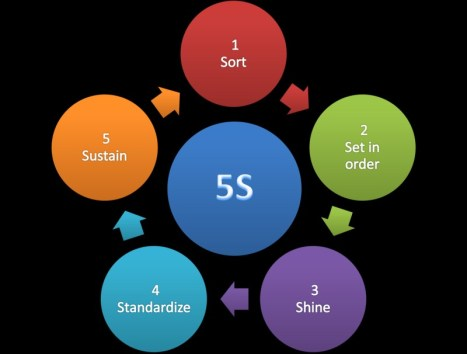
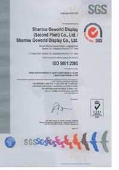
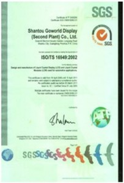
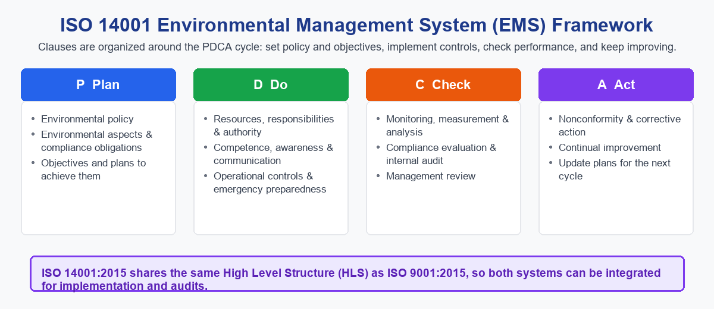
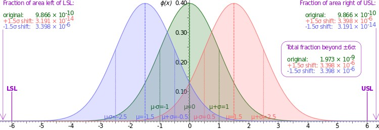
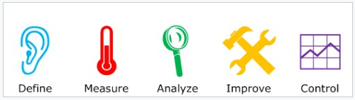

# Display Manufacturing Quality: 5S, ISO 9001, IATF 16949, ISO 14000, and Six Sigma

!!! abstract "Quick answer"
    Quality management in display manufacturing is usually built from five systems: 5S creates workplace order, ISO 9001 establishes a general quality-management-system framework, IATF 16949 adds automotive-sector requirements on top of ISO 9001, ISO 14001 manages environmental responsibility, and Six Sigma drives process improvement with statistics. For buyers, ISO 9001 is the minimum threshold, automotive projects must check IATF 16949, and the level of 5S and Six Sigma reflects a factory's day-to-day management competence.

## Key Takeaways

- 5S is the foundation of workplace management: Sort, Set in Order, Shine, Standardize, and Sustain create a maintainable working order.
- ISO 9001 is a general quality-management framework based on seven quality-management principles, using PDCA and a process approach.
- IATF 16949 is developed by the International Automotive Task Force on the basis of ISO 9001 and applies to the automotive supply chain; certification is valid for three years and requires annual surveillance audits.
- ISO 14001 manages an organization's environmental impacts and shares the High Level Structure with ISO 9001, so the two can be integrated.
- Six Sigma targets a level of 6σ, corresponding to 3.4 DPMO, and uses DMAIC to improve existing processes and DMADV to design new ones.

## 1. Why Display Manufacturing Needs Systematic Quality Management

A display is a typical multi-process product with a long chain: from glass substrate, ITO deposition, photolithography, lamination, module assembly, and aging test, variation in any process can become a visible defect—bright pixels, dark pixels, Mura, lamination bubbles, or color shift. Such defects are often found only at final inspection, when rework cost is already high.

Therefore display manufacturers commonly overlay several management systems: 5S for the workplace, ISO 9001 for processes, automotive standards for sector-specific requirements, ISO 14001 for compliance, and Six Sigma for continuous improvement.

## 2. 5S: The Foundation of Workplace Management

### 2.1 The Five S's

5S is a systematic method for organizing a workspace so work can be done efficiently, effectively, and safely. The core idea is to put everything in its proper place and keep the workplace clean, reducing wasted time and injury risk.

| Japanese Term | English Term | Definition |
|---|---|---|
| Seiri | Sort | Distinguish necessary from unnecessary items and keep only the essentials needed for the job. |
| Seiton | Set in Order | Assign a fixed place for each item and arrange them logically to reduce handling motion. |
| Seiso | Shine | Keep the workplace clean and orderly while using cleaning as daily inspection and maintenance. |
| Seiketsu | Standardize | Turn the first three S's into standards and rules that define when and by whom each task is performed. |
| Shitsuke | Sustain | Maintain and audit the practice over the long term so the first four S's become habit. |

<figure markdown="span" class="displaywiki-figure">
  [{ width="760" loading="lazy" }](quality-management-the-origins-of-5s-5s-lean-manufacturing.jpeg){ .displaywiki-image-link title="Open full-size image" }
  <figcaption>The five steps of 5S and their cyclic relationship: Sort, Set in Order, Shine, Standardize, and Sustain advance in sequence and keep looping.</figcaption>
</figure>

### 2.2 From Toyota Production System to Lean Manufacturing

5S is part of the Toyota Production System (TPS), the manufacturing method that Toyota Motor Corporation developed in the early and mid-20th century. In the West it is commonly called Lean manufacturing, and its goal is to increase customer value by identifying and eliminating waste in production processes.

The Lean toolbox includes 5S, kaizen, kanban, jidoka, heijunka, and poka-yoke. 5S is seen as a foundational part of TPS: when a workplace is cluttered and disorganized, consistently good results are hard to achieve. A messy space leads to errors, production slowdowns, and even accidents.

### 2.3 How the Five S's Are Put into Practice

**Sort** — Go through the tools, furniture, materials, and equipment in the work area and decide what must stay and what can be removed. Useful questions include: What is this item for? When was it last used? How often is it used? Who uses it? Does it really need to be here?

Once items are identified as no longer needed, there are usually three options: transfer them to another department, recycle or sell them, or put them into storage.

<figure markdown="span" class="displaywiki-figure">
  [{ width="760" loading="lazy" }](quality-management-1s-a-red-tag-area-containing-items-waiting-for-removal.jpeg){ .displaywiki-image-link title="Open full-size image" }
  <figcaption>1S in practice: a red-lined holding area for items whose purpose is not yet decided.</figcaption>
</figure>

**Set in Order** — Plan locations for the items that remain. Questions include: Which people use which items? When are they used? Which items are used most often? Where would they be easiest to reach? Do we need more storage containers? The goal is to make items within easy reach and reduce unnecessary movement.

In Lean, waste includes defects, waiting, extra motion, excess inventory, overproduction, overprocessing, unnecessary transport, and underutilized talent. Set in Order targets extra motion and waiting.

<figure markdown="span" class="displaywiki-figure">
  [{ width="760" loading="lazy" }](quality-management-2s-simple-floor-marking.jpeg){ .displaywiki-image-link title="Open full-size image" }
  <figcaption>2S in practice: floor markings define fixed positions for tools and fixtures so it is obvious when something is out of place.</figcaption>
</figure>

**Shine** — Shine is more than appearance. It includes sweeping, wiping, dusting, and returning tools and materials to their designated locations. More importantly, cleaning is itself equipment inspection: catching abnormalities early avoids sudden breakdowns and the lost time and profit that come with downtime. In 5S, everyone is responsible for cleaning their own workstation, ideally every day.

<figure markdown="span" class="displaywiki-figure">
  [{ width="760" loading="lazy" }](quality-management-3s-cleanliness-point-with-cleaning-tools-and-resources.jpeg){ .displaywiki-image-link title="Open full-size image" }
  <figcaption>3S in practice: a dedicated cleaning point keeps tools and supplies in one place so they do not scatter across the shop floor.</figcaption>
</figure>

**Standardize** — After the first three S's, the workplace looks much better. The real challenge is keeping it that way. Standardize is what makes 5S different from spring cleaning: assign regular tasks to specific people, set schedules, and post work instructions so these activities become routine and standard operating procedures.

**Sustain** — Standards still need ongoing maintenance and updating. Managers and front-line employees both participate. The key to sustainability is making 5S part of the corporate culture rather than a one-time campaign. When 5S is sustained, organization and cleanliness become part of daily work.

<figure markdown="span" class="displaywiki-figure">
  [{ width="760" loading="lazy" }](quality-management-5s-resource-corner-example.jpeg){ .displaywiki-image-link title="Open full-size image" }
  <figcaption>5S in practice: a resource corner on the shop floor stores tools and gauges together with a status board, a concrete way to sustain the discipline.</figcaption>
</figure>

### 2.4 The Sixth S: Safety

Some organizations add Safety as a sixth S, calling the system 6S. The Safety step focuses on identifying and removing risks in work processes, for example by optimizing workstation layout, marking forklift-and-pedestrian crossings, and labeling cabinets that hold cleaning chemicals to warn of potential hazards. If the workplace layout or task itself is dangerous, those risks should be reduced as far as possible.

Others argue that safety is a natural result of the first five S's and does not need a separate step: if the workplace is well organized, clean, and uses clear visual safety cues, a separate safety step is unnecessary. Either approach is acceptable, but treating safety as an explicit goal reinforces its importance.

## 3. ISO 9001: Quality Management System

### 3.1 The ISO 9000 Family and the Seven Quality Management Principles

The ISO 9000 family is a set of quality-management-system (QMS) standards that helps organizations meet customer and other stakeholder needs while satisfying statutory and regulatory requirements. ISO 9000 explains the fundamentals, and ISO 9001 specifies the requirements an organization must meet.

The ISO 9000 family is built on seven quality-management principles (QMP):

| Principle | Meaning |
|---|---|
| 1. Customer focus | Organizations depend on customers; they should understand current and future needs, meet requirements, and strive to exceed expectations. |
| 2. Leadership | Leaders establish unity of purpose and direction, and create an internal environment in which people can fully participate. |
| 3. Engagement of people | People at all levels are the essence of the organization; their full involvement enables their abilities to create value. |
| 4. Process approach | Desired results are achieved more efficiently when activities and related resources are managed as processes. |
| 5. Improvement | Continual improvement of overall performance should be a permanent objective of the organization. |
| 6. Evidence-based decision making | Effective decisions are based on the analysis of data and information. |
| 7. Relationship management | Organizations and their external providers are interdependent; mutually beneficial relationships enhance the ability of both to create value. |

### 3.2 Structure of ISO 9001:2015

ISO 9001:2015 — *Quality management systems — Requirements* is a document of roughly 30 pages issued by national standards bodies, and it is the only version of ISO 9001 that can be used directly for third-party audits. Its structure is as follows:

| Section | Content |
|---|---|
| Sections 1–3 | Scope, normative references, terms and definitions |
| Section 4 | Context of the organization |
| Section 5 | Leadership |
| Section 6 | Planning |
| Section 7 | Support |
| Section 8 | Operation |
| Section 9 | Performance evaluation |
| Section 10 | Improvement |

The standard is organized around the process approach and follows the PDCA cycle. During an audit, the certification body must confirm that the auditee has implemented sections 4 through 10; sections 1 through 3 are not audited directly but provide context and definitions that must still be considered.

Compared with older editions, the 2015 version no longer requires a formal quality manual, but it does require documented procedures needed for effective operation, and requires communicating the quality policy, QMS scope, and quality objectives. New requirements include assessing risks and opportunities (section 6.1) and identifying internal and external issues relevant to the organization's purpose and strategic direction (section 4.1). The organization must demonstrate how each requirement is met, and the external auditor decides whether the QMS is effective.

### 3.3 Certification and Auditing

ISO itself does not certify organizations. Certification is carried out by independent certification bodies that audit the organization and, on passing, issue an ISO 9001 compliance certificate.

The certification process is roughly: the certification body audits a sample of sites, functions, products, services, and processes; the auditor submits a list of issues (commonly classified as nonconformities, observations, or opportunities for improvement). If there are no major nonconformities, the certification body issues the certificate. If major nonconformities are found, the organization submits an improvement plan (for example, corrective-action reports showing how the problems will be resolved); once the certification body is satisfied, it issues the certificate. The certificate states the scope and the addresses it covers.

ISO 9001 certification is not a lifetime award; it must be renewed at the interval recommended by the certification body, usually every three years. An organization is either certified (meaning it commits to the quality-management method described in the standard) or it is not. In that sense, ISO 9001 certification is a binary judgment, unlike measurement-based quality systems.

Registration requires two types of audits: external audits by an external certification body, and internal audits by trained internal staff. The aim is a continual cycle of review and assessment to verify that the system works, find areas for improvement, and correct or prevent identified problems. Internal auditors work outside their normal management line to help keep their judgments independent.

<figure markdown="span" class="displaywiki-figure">
  [{ width="760" loading="lazy" }](quality-management-example-of-iso9001-certification.jpeg){ .displaywiki-image-link title="Open full-size image" }
  <figcaption>Example of an ISO 9001 certificate issued by a third-party certification body, showing scope and applicable addresses.</figcaption>
</figure>

### 3.4 Implementation Benefits

Proper quality management improves business performance and usually has a positive effect on investment, market share, sales growth, sales volume and profit, competitive advantage, and litigation avoidance. ISO 9000 guidance provides a complete model for a QMS that can help any organization build competitiveness; studies also report benefits ranging from the registration needed to remain in a supply base, better documentation, cost-effectiveness, and improved management involvement and communication.

Specific benefits brought by ISO 9001:2015 include:

- By assessing organizational context, an organization can clarify who is affected, what they expect, and therefore state business objectives clearly and identify new opportunities.
- It identifies and addresses risks relevant to the organization.
- A customer focus ensures requirements are met and satisfaction is raised, bringing repeat business and new customers.
- Processes are aligned and understood, so the organization operates more efficiently, productivity improves, and internal costs fall.
- Statutory and regulatory requirements are met.
- Entry into new markets is smoother because some sectors and customers require ISO 9001 before doing business.

## 4. IATF 16949: Automotive Quality Management

### 4.1 Standard Content

IATF 16949 (previously called ISO/TS 16949) is a quality-management-system requirement for the automotive supply chain, built on ISO 9001. It emphasizes continual improvement, defect prevention, and reducing variation and waste in the automotive supply chain and production. The standard was prepared by the International Automotive Task Force (IATF) together with an ISO technical committee.

The standard applies to the design/development, production, and, where relevant, installation and servicing of automotive-related products, and the requirements are intended to apply throughout the supply chain. Vehicle assembly plants are also encouraged to seek IATF 16949 certification.

The standard aims to improve system and process quality so customer satisfaction rises: identify problems and risks in production and the supply chain, eliminate their root causes, and ensure effectiveness through inspection, correction, and preventive action. Its main chapters map to the ISO 9001 framework:

| Section | Content |
|---|---|
| Sections 1–3 | Introduction and scope |
| Section 4 | Quality management system (general requirements, document and record control, engineering specifications) |
| Section 5 | Management responsibility |
| Section 6 | Resource management |
| Section 7 | Product realization |
| Section 8 | Measurement, analysis, and improvement |

The methodology is based on the process-oriented approach in ISO 9001. It studies business processes in a process environment, identifies, maps, and controls their interactions and interfaces, and defines the external interfaces (sub-suppliers, customers, and remote locations). The standard distinguishes customer-oriented processes, supporting processes, and management processes, aiming to improve the overall process rather than optimize individual steps in isolation.

A key requirement is that automotive manufacturers and their suppliers must meet customer-specific requirements (CSR) in addition to the QMS.

### 4.2 Certification Requirements

IATF 16949 can be applied throughout the automotive supply chain, and certification follows the certification rules issued by the IATF. The certificate is valid for three years and must be verified at least once a year by an IATF-recognized third-party auditor through a surveillance audit.

The purpose of certification is to build or strengthen customer confidence in a supplier's system and process quality. Today, if an OEM is an IATF member, a supplier without a valid certificate has almost no chance of supplying standard parts to it.

<figure markdown="span" class="displaywiki-figure">
  [{ width="760" loading="lazy" }](quality-management-iso-ts16949-certificate.jpeg){ .displaywiki-image-link title="Open full-size image" }
  <figcaption>Example of an IATF 16949 certificate (previously ISO/TS 16949): valid for three years with annual surveillance audits required.</figcaption>
</figure>

## 5. ISO 14001: Environmental Management System

### 5.1 Scope and Applicability

ISO 14000 is a family of standards related to environmental management that helps organizations minimize the negative environmental effects of their operations (such as adverse changes to air, water, or land), comply with applicable laws and regulations, and continually improve in these areas.

Like ISO 9000, ISO 14000 focuses on the process by which a product is made, not the product itself. As with ISO 9001, certification is performed by third-party organizations, not by ISO directly. The central standard is ISO 14001, which defines the core requirements for designing and implementing an effective environmental management system (EMS); ISO 14004 provides additional implementation guidance, and other standards cover specific environmental topics.

ISO 14001 is called a generic management-system standard because it applies to any organization that wants to improve resource management more effectively, including:

- Single-site to large multinational companies
- High-risk companies to low-risk service organizations
- Manufacturing, process, and service industries, including local governments
- All industry sectors, public and private
- Original equipment manufacturers and their suppliers

The standard does not set specific environmental performance requirements; it provides a framework an organization can use to improve resource efficiency, reduce waste, cut costs, and assure management, employees, and external stakeholders that environmental impact is being measured and improved.

### 5.2 PDCA and Continuous Improvement

ISO 14001 is based on the Plan-Do-Check-Act (PDCA) cycle and shares the same High Level Structure (HLS) as ISO 9001:2015, so the two systems can be integrated and audited together.

<figure markdown="span" class="displaywiki-figure">
  [{ width="760" loading="lazy" }](quality-management-iso14001-ems-framework-en.png){ .displaywiki-image-link title="Open full-size image" }
  <figcaption>ISO 14001 organized by PDCA: Plan sets policy and objectives, Do implements controls, Check evaluates performance, and Act corrects and starts the next cycle.</figcaption>
</figure>

**Plan** — Before implementing ISO 14001, an initial review or gap analysis of processes and products is recommended to identify all elements of current and, where possible, future operations that may interact with the environment. These environmental aspects can be direct, such as materials used in manufacturing, or indirect, such as raw materials. The review helps establish environmental objectives (ideally measurable), develop control and management procedures, and identify legal requirements to build into the policy.

**Do** — Identify required resources and assign responsibility for EMS implementation and control. Establish procedures and processes. Beyond the documented procedure for operational control, procedures are also needed for document control, emergency preparedness and response, and employee training, so staff can implement the necessary processes and record results. Communication and participation at all levels, especially top management, are critical in this phase; EMS effectiveness depends on active employee involvement.

**Check** — Monitor and periodically measure performance to confirm that environmental objectives are being met; carry out internal audits at planned intervals to determine whether the EMS meets expectations and whether processes and procedures are properly maintained and monitored.

**Act** — After checking, conduct a management review to confirm the extent to which EMS objectives are met and to manage communications appropriately. The review should also assess changing external conditions such as legal requirements, make recommendations for further improvement, and feed continual improvement into the next plan.

**Three directions of continual improvement**:

- **Expansion**: the EMS covers more and more business areas.
- **Deepening**: activities, products, processes, emissions, and resources are increasingly managed by the EMS.
- **Upgrading**: the structural and organizational framework of the EMS is improved, and knowledge of handling business-environment issues accumulates.

Overall, continual improvement expects the organization to move gradually from purely operational environmental measures toward a more strategic approach to environmental challenges.

<figure markdown="span" class="displaywiki-figure">
  [{ width="760" loading="lazy" }](quality-management-the-pdca-cycle.jpeg){ .displaywiki-image-link title="Open full-size image" }
  <figcaption>The PDCA cycle: Plan, Do, Check, and Act form a closed loop and are the common methodological foundation of ISO 14001 and ISO 9001.</figcaption>
</figure>

### 5.3 Implementation Benefits and Certification

ISO 14001:2015 covers the following topics: organizational context, leadership, planning, support, operation, performance evaluation, improvement, and conformity assessment.

Benefits of adopting ISO 14001:2015 include:

- Improved resource efficiency, reduced waste, and lower costs
- Assurance that environmental impact is measured
- Competitive advantage in supply-chain design and new business opportunities
- Fulfillment of legal obligations and consistent management of environmental responsibility
- Increased stakeholder and customer trust, and improved overall environmental impact

If all elements of ISO 14001 are built into management processes, an organization can choose one of four ways to demonstrate conformity: self-determination and self-declaration; seeking confirmation of conformance by interested parties such as customers; seeking confirmation of its self-declaration by an external party; or seeking certification/registration of its EMS by an external organization.

Organizations already certified to ISO 14001 are encouraged to transition to the 2015 version, and certification bodies usually allow a three-year transition period to update the EMS. A typical start path is to review existing QMS requirements (ISO 9001:2015), purchase and study ISO 14001:2015, receive relevant training, and then complete certification.

## 6. Six Sigma: Data-Driven Process Improvement

### 6.1 Statistical Basis and Sigma Levels

Six Sigma (6σ) is a set of techniques and tools for process improvement. It was introduced by American engineer Bill Smith while working at Motorola in 1986, and Jack Welch made it central to General Electric's business strategy in 1995. A Six Sigma process is one in which 99.99966% of all opportunities to produce a feature are statistically expected to be free of defects.

σ is a statistical measure of how far a process deviates from its mean or target. If a process has six sigmas—three above and three below the mean—the defect rate is classified as extremely low.

<figure markdown="span" class="displaywiki-figure">
  [{ width="760" loading="lazy" }](quality-management-sigma-levels.jpeg){ .displaywiki-image-link title="Open full-size image" }
  <figcaption>Specification limits (LSL / USL) and a 1.5σ shift under a normal distribution: the narrower the curve and the farther it is from the limits, the lower the probability of exceeding them.</figcaption>
</figure>

The normal distribution curve illustrates the statistical assumption behind the Six Sigma model: the larger the standard deviation, the more spread out the values. The horizontal axis shows distance from the mean in units of σ; μ marks the mean, and the green curve is the standard normal distribution with μ = 0 and σ = 1. The upper and lower specification limits (USL and LSL) are 6σ from the mean. Because of the properties of the normal distribution, events far from the mean are extremely rare: the probability of exceeding either limit is on the order of one in a billion. Even if the mean shifts by 1.5σ to the left or right over the long term (shown by the red and blue curves), a sufficient safety margin remains.

In practice, long-term data usually assume the process mean will drift by 1.5σ toward the critical specification limit. The figure below gives long-term DPMO (defects per million opportunities) values corresponding to short-term sigma levels:

<figure markdown="span" class="displaywiki-figure">
  [{ width="760" loading="lazy" }](quality-management-the-5-key-principles-of-six-sigma.jpeg){ .displaywiki-image-link title="Open full-size image" }
  <figcaption>Sigma levels with defect rate, yield, and Cpk: 6σ corresponds to 3.4 DPMO, 99.99966% yield, and a long-term Cpk of 1.5.</figcaption>
</figure>

Two points are worth noting: the table assumes the process mean has shifted 1.5σ toward the critical specification limit, so the long-term Cpk is 0.5 lower than the short-term Cpk; the defect percentage only counts defects beyond the closest specification limit.

### 6.2 Five Key Principles

Six Sigma has a straightforward goal: deliver near-perfect products and services centered on customer satisfaction. It is built on five key principles:

1. **Customer focus** — The primary goal is to bring maximum value to the customer. A business must understand its customers, their needs, and what drives sales and loyalty, and set quality standards accordingly.
2. **Measure the value stream and find the problem** — Map the steps of a specific process, identify waste areas, and gather data to locate the specific problem to address. Data-collection objectives should include what to collect, why, what insight is expected, how to ensure measurement accuracy, and a standardized data-collection system. Then identify the problem and ask for root causes.
3. **Eliminate waste** — Once the problem is found, change the process to remove variation and defects, and delete activities that do not add customer value. If value-stream analysis does not reveal the source, use tools to find outliers and problem areas, and simplify functions to serve quality control and efficiency.
4. **Drive implementation** — Involve all stakeholders and use a structured process in which team members contribute their expertise and collaborate. Six Sigma projects have a large organizational impact, so the team must be proficient in the principles and methods used, and targeted training is needed to reduce the risk of failure or redesign.
5. **Maintain a flexible and responsive ecosystem** — Six Sigma is essentially transformation and change. Removing a defective or inefficient process means changing how people work, and the people and departments involved must adapt smoothly. Organizations that watch the data and periodically review bottom-line metrics can adjust processes when needed and gain competitive advantage.

### 6.3 DMAIC and DMADV

Six Sigma projects use two methodologies, both inspired by Deming's PDSA cycle. Each has five phases:

- **DMAIC**: used to improve an existing business process.
- **DMADV**: used to design a new product or process.

<figure markdown="span" class="displaywiki-figure">
  [{ width="760" loading="lazy" }](quality-management-the-five-steps-of-dmaic.jpeg){ .displaywiki-image-link title="Open full-size image" }
  <figcaption>The five steps of DMAIC: Define, Measure, Analyze, Improve, and Control, used to improve an existing process.</figcaption>
</figure>

**DMAIC phase highlights**

**Define** — Define the business problem from the customer perspective, set the goals, map the process, and verify with stakeholders that the direction is correct.

**Measure** — Measure the problem with quantitative or qualitative data, define performance standards, and evaluate whether the chosen measurement system can support the target outcome.

**Analyze** — Analyze the process to find influencing variables, judge whether the process is efficient and effective, quantify goals (for example, reduce defective products by 20%), and identify variation using historical data.

**Improve** — Study how X variables affect Y. Identify possible causes, test which X's influence Y, discover relationships between variables, and determine process tolerances—the values variables can take while still remaining within acceptable limits. This answers what range X must stay in for Y to meet specifications and which operating conditions affect the result.

**Control** — Confirm that the performance targets identified in the previous phase are fully achieved and that the improvement is sustainable. Validate the measurement system, determine process capability (for example, whether the 20% defect reduction is actually being achieved), and hand the process over to the process owner.

<figure markdown="span" class="displaywiki-figure">
  [{ width="760" loading="lazy" }](quality-management-the-five-steps-of-dmadv.jpeg){ .displaywiki-image-link title="Open full-size image" }
  <figcaption>The five steps of DMADV: Define, Measure, Analyze, Design, and Verify, used to design a new process or product.</figcaption>
</figure>

**DMADV phase highlights** (also called DFSS, Design For Six Sigma):

1. **Define** — Set design goals consistent with customer needs and enterprise strategy.
2. **Measure** — Identify CTQs (Critical To Quality characteristics), measure product capability, production process capability, and risks.
3. **Analyze** — Develop and analyze design alternatives.
4. **Design** — Design the improvement that best fits the analysis from the previous phase.
5. **Verify** — Verify the design, set up pilot runs, implement the production process, and hand it over to the process owner.

### 6.4 Common Quality Management Tools

In the various phases of DMAIC or DMADV, Six Sigma uses many established quality-management tools that are also useful outside Six Sigma. They include:

- **Analysis**: 5 Whys, cause-and-effect diagrams (also called fishbone or Ishikawa diagrams), business-process mapping, and check sheets
- **Statistical**: variation analysis, general linear model, ANOVA, and measurement-system analysis (Gage R&R)
- **Data processing**: regression analysis, correlation analysis, and scatter diagrams
- **Design of experiments**: factorial experiments, response-surface methods, and central composite designs

## 7. Supplier Evaluation Perspective

From a buyer's point of view, these systems can be used as screening tools in the following order of priority:

| Dimension | Focus |
|---|---|
| Basic threshold | Does the supplier hold a valid ISO 9001 certificate whose scope covers the target product? |
| Automotive projects | Must have IATF 16949, with the certificate in validity and annual surveillance-audit records |
| Environmental compliance | ISO 14001 certificate, especially for export or environmentally conscious customers |
| Workplace management | 5S execution level, directly reflecting day-to-day stability and consistency |
| Improvement capability | Whether the supplier has a Six Sigma project system, Cpk data, and evidence of continual improvement |

Certificates are only an entry ticket. What really determines incoming-material quality stability is whether the factory can sustain these systems in daily operation. That is why an on-site audit is more valuable than a paper certificate.

## 8. Frequently Asked Questions

??? question "Q1: What is the relationship between 5S and ISO 9001?"
    5S is a workplace-management method focused on order and efficiency; ISO 9001 is a quality-management-system standard focused on process standardization and continual improvement. They operate at different levels but support each other. When 5S is in place, standardization, records, and inspections are easier to implement, giving ISO 9001 a solid foundation. Many factories use 5S as the first step toward ISO 9001.

??? question "Q2: What is the difference between IATF 16949 and ISO 9001?"
    IATF 16949 is a quality-management-system standard that adds automotive-sector requirements on top of ISO 9001, prepared by the International Automotive Task Force (IATF) and an ISO technical committee. Besides the general ISO 9001 requirements, it emphasizes defect prevention, reducing supply-chain variation, and meeting customer-specific requirements (CSR). In the automotive supply chain, IATF 16949 is usually a threshold requirement.

??? question "Q3: Is ISO 14001 certification mandatory?"
    It is not mandatory by itself; it is a voluntary standard. In practice, however, it is often required by customers, tender conditions, or export regulations, so it is effectively necessary for many manufacturers. The standard does not set specific environmental performance targets; it provides a framework for identifying environmental aspects, setting objectives, and continually improving.

??? question "Q4: What does Six Sigma's 6σ actually mean?"
    6σ means that, after allowing for a 1.5σ long-term shift, the defect rate is 3.4 DPMO (defects per million opportunities), corresponding to about 99.99966% yield. It requires the process mean to be six standard deviations from the specification limits. For comparison, 3σ corresponds to about 66,807 DPMO. That large gap is why Six Sigma is used as a high-level quality target.

??? question "Q5: Should I use DMAIC or DMADV?"
    It depends on the project. If the problem is in an existing process and the goal is improvement, use DMAIC (Define, Measure, Analyze, Improve, Control). If you are developing a new product or process, use DMADV (Define, Measure, Analyze, Design, Verify), also called DFSS. Choosing the wrong path will push the project off direction, so decide at kickoff whether it is an improvement or a design project.

??? question "Q6: What quality-system certifications should I check when selecting a display supplier?"
    Start with the ISO 9001 certificate and confirm that its scope includes the target product line. For automotive projects, check the validity of IATF 16949 and its annual surveillance-audit records. For export or environmental requirements, look for ISO 14001. In addition, combine this with an on-site audit focusing on actual 5S execution, Cpk data for key processes, and closed-loop improvement records for historical defects; these reflect real quality capability better than the certificates themselves.

## Related reading

- [Custom and Sunlight-Readable Display Solutions](custom-sunlight-readable-displays.md)
- [Display Customization, MOQ, Lead Time, and Ordering FAQ](display-customization-faq.md)
- [Display Interfaces Explained: MCU, RGB, LVDS, MIPI, SPI, and More](display-interface-guide.md)

!!! info "Can't find what you need?"
    If you need more products, resources or support, please contact our team:

    [**:material-archive-arrow-down: Knowledge Base**](../../knowledge/tags.md){ .md-button .md-button--primary }
    [**:material-magnify: Products & Solutions**](https://viewedisplay.com/){ .md-button }
    [**:material-email: Contact Support**](mailto:support@viewedisplay.com){ .md-button }
