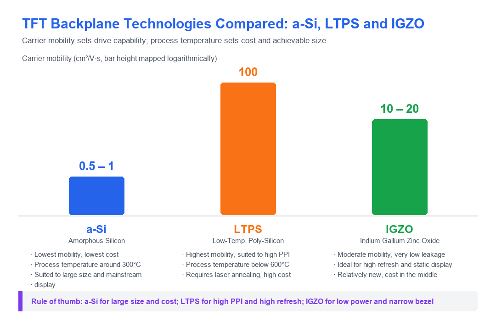

# a-Si, LTPS, and IGZO TFT Backplanes Compared

!!! abstract "Quick answer"
    The core metric of a backplane technology is carrier mobility: a-Si is about 0.5–1 cm²/V·s, IGZO about 10–20 cm²/V·s, and LTPS up to 100 cm²/V·s. The higher the mobility, the faster a pixel can be charged, and the better the support for high PPI and high refresh rate, at the price of a more complex process. Rule of thumb: a-Si for large size and cost, LTPS for high PPI and high refresh, IGZO for low power and narrow bezel.

## Key Takeaways

- All three backplanes are arrays of thin-film transistors; what separates them is the material and crystalline state of the semiconductor layer.
- a-Si runs at around 300°C and costs the least, which suits large-size and mainstream displays.
- LTPS has the highest mobility, up to 100 cm²/V·s, and is the first choice for high PPI and high refresh, but it needs laser annealing and costs the most.
- IGZO sits in the middle (10–20 cm²/V·s) with extremely low leakage, which suits high refresh and low-power static display. It is the newer route.

## 1. What a TFT Backplane Is

The thin-film transistor (TFT) array is the pixel switch layer of liquid-crystal and some OLED displays. Every pixel is charged and discharged by one thin-film transistor, and how fast that transistor switches and how much it leaks depend on the material and the crystalline state of the semiconductor layer. That is what separates the different backplane routes:

- **a-Si**: amorphous silicon
- **LTPS**: low-temperature poly-silicon
- **IGZO**: indium gallium zinc oxide

Thin-film transistor technology matters in every kind of display device. This article compares the operating principles and the application boundaries of these three mainstream routes.

!!! warning "Production note"
    Under volume production or harsh conditions (high and low temperature, damp heat, vibration, ESD), check the datasheet curves for this parameter; running outside the specified range will significantly shorten lifetime.

<figure markdown="span" class="displaywiki-figure">
  [{ width="760" loading="lazy" }](tft-backplane-comparison-en.png){ .displaywiki-image-link title="Open full-size image" }
  <figcaption>Carrier mobility together with process temperature decides cost, achievable size, and application</figcaption>
</figure>

## 2. The Three Backplanes at a Glance

| Item | a-Si | LTPS | IGZO |
|---|---|---|---|
| Semiconductor material | Amorphous silicon | Poly-silicon | Oxide semiconductor |
| Carrier mobility | ~0.5 – 1 cm²/V·s | ~100 cm²/V·s | ~10 – 20 cm²/V·s |
| Process temperature | Low, around 300°C | Below 600°C, needs laser annealing | Low to moderate |
| Cost | Lowest | Highest | In the middle |
| Maturity | Most mature | Mature | Relatively new |
| Typical strength | Cost and large area | High PPI, high refresh, low power | High refresh plus low-power static display |
| Typical applications | Large-size TVs, monitors, digital signage | Flagship phones, laptops, wearables | Tablets, laptops, 4K/8K TVs, medical displays |

## 3. a-Si TFT (Amorphous Silicon)

**Material**: amorphous silicon
**Process temperature**: low, around 300°C
**Carrier mobility**: about 0.5 – 1 cm²/V·s

**Advantages**

- Cost effective: a simple process at low temperature keeps manufacturing cost down.
- Mature technology: a well-established supply chain, widely used across display products.
- Adequate for applications that do not need extremely high resolution or fast response.

**Limitations**

- Lower mobility: response is slower, and both resolution and refresh rate are constrained.
- Higher power consumption: lower efficiency, which affects battery life in portable devices.
- Brightness and color accuracy: generally below LTPS and IGZO because electron transport is less efficient.

**Typical applications**

- TVs: commonly used in large-screen LCD TVs because of cost.
- Monitors: suited to desktop monitors that do not demand extreme performance.
- Entry-level smartphones and consumer devices: common where cost is the main consideration.
- Digital signage: display scenarios that do not need high resolution or fast refresh.

## 4. LTPS TFT (Low-Temperature Poly-Silicon)

**Material**: poly-silicon
**Process temperature**: below 600°C, and additional steps such as laser annealing are required
**Carrier mobility**: about 100 cm²/V·s

**Advantages**

- High performance: high mobility supports high resolution, fast response, and higher refresh rate.
- Power efficient: low consumption, which suits battery-powered devices such as phones and laptops.
- Display quality: efficient electron transport gives better brightness, color accuracy, and overall image quality.

**Limitations**

- Higher cost: a hotter process and a more complex flow raise manufacturing cost significantly.
- Manufacturing complexity: needs more advanced production technology and equipment.
- Yield risk: the process complexity can lead to lower yield than a-Si.

**Typical applications**

- High-end smartphones: excellent image quality and power behavior, common in flagship models.
- Laptops: used for high-resolution screens where both performance and battery life matter.
- Tablets: secures display quality together with power efficiency.
- Wearables: suits smartwatches and other products that need high resolution at low power.
- Professional monitors: for professional equipment that requires outstanding image quality and performance.

## 5. IGZO TFT (Indium Gallium Zinc Oxide)

**Material**: oxide semiconductor
**Process temperature**: low to moderate
**Carrier mobility**: about 10 – 20 cm²/V·s

**Advantages**

- Moderate mobility: better than a-Si and below LTPS, balancing performance against cost.
- High transparency: allows higher light transmission, improving display brightness and efficiency.
- Low power: extremely low leakage gives a clear advantage for static images, which suits e-paper and static display.
- High resolution: supports high resolution and high pixel density.

**Limitations**

- Cost: higher than a-Si, but generally lower than LTPS.
- Relatively new: less mature than a-Si and LTPS, so development and manufacturing involve more challenges.

**Typical applications**

- Tablets and laptops: high-resolution displays that must balance performance and power.
- 4K and 8K TVs: high resolution plus high energy efficiency suits advanced TV displays.
- Medical displays: medical imaging places high demands on resolution and accuracy.
- E-paper and static display: low power suits e-readers and other devices that show static content for long periods.

## 6. Selection Checklist

- **Fix size and pixel density first**: for large size and low PPI, favor the cost advantage of a-Si; for small size and high PPI, LTPS or IGZO is required.
- **Then look at refresh rate and power**: for portable devices that need high refresh, LTPS and IGZO are both clearly better than a-Si; for long static display, favor IGZO.
- **Assess the leakage requirement**: when the pixel voltage must be held for a long time (low-frequency drive, low-power standby), the low leakage of IGZO is the key advantage.
- **Account for cost and yield**: the LTPS process is complex and the most expensive, so yield and capacity must be assessed before volume production.
- **Confirm supply and generation line**: different backplanes come from different panel generation lines, so long-term supply must be confirmed with the supplier.

## 7. Frequently Asked Questions

??? question "Q1: What is the core difference between a-Si, LTPS, and IGZO?"
    The core difference lies in the material and crystalline state of the semiconductor layer, which in turn sets carrier mobility. a-Si is amorphous silicon with mobility around 0.5–1 cm²/V·s and the lowest cost; LTPS is poly-silicon with mobility up to about 100 cm²/V·s, the strongest performance but the highest cost; IGZO is an oxide semiconductor with mobility around 10–20 cm²/V·s, in the middle and with extremely low leakage.

??? question "Q2: Why is LTPS suited to high PPI displays?"
    High PPI means smaller pixels and a shorter charging time, so the transistor must deliver enough drive current to charge the pixel voltage within a very short window. LTPS has high mobility, so a transistor of the same size can supply more current and therefore charge faster at the same pixel size, which supports higher resolution and refresh rate.

??? question "Q3: What is the practical benefit of low leakage in IGZO?"
    Low leakage means the pixel voltage can be held for a long time, so the refresh frequency can be reduced (low-frequency drive) without visible flicker, which cuts power consumption significantly. This is especially valuable where the display stays on but the content changes rarely, and it also makes it easier to achieve a narrow bezel together with high refresh.

??? question "Q4: Why do large-size TVs mostly use a-Si?"
    Large panels are extremely cost sensitive, and pixel density is relatively low, so the mobility of a-Si is already sufficient. The a-Si process is mature, the generation lines are large, and the cost per unit area is low, which keeps it the mainstream choice for large-size TVs and digital signage.

??? question "Q5: How large is the cost difference between the three backplanes?"
    The usual order is a-Si lowest, IGZO in the middle, LTPS highest. LTPS needs additional steps such as laser annealing, with high equipment and process complexity; IGZO needs oxide semiconductor deposition and tight stability control, so its cost falls between the two. The exact gap varies with generation line, volume, and yield, so ask the panel maker for actual quotations and yield data before volume production.

??? question "Q6: Which backplane should my project use?"
    Start with size and PPI: for large size, low PPI, and cost sensitivity choose a-Si; for small size and high PPI, or where high refresh is needed, choose LTPS; where high refresh must be combined with low power, or where content is static for long periods, choose IGZO. Once the route is fixed, confirm supply capability, production yield, and the system power budget with the panel maker.

## Related reading

- [IPS, TN, VA, and FFS TFT Panel Technologies Compared](tft-panel-technologies.md)
- [OLED Display Structure, Operation, and LCD Comparison](oled-display-basics.md)
- [Transmissive, Reflective, and Transflective LCDs Compared](transmissive-reflective-transflective.md)

!!! info "Can't find what you need?"
    If you need more products, resources or support, please contact our team:

    [**:material-archive-arrow-down: Knowledge Base**](../../knowledge/tags.md){ .md-button .md-button--primary }
    [**:material-magnify: Products & Solutions**](https://viewedisplay.com/){ .md-button }
    [**:material-email: Contact Support**](mailto:support@viewedisplay.com){ .md-button }
