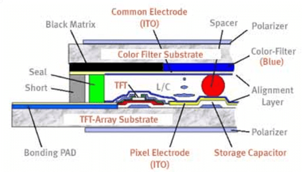
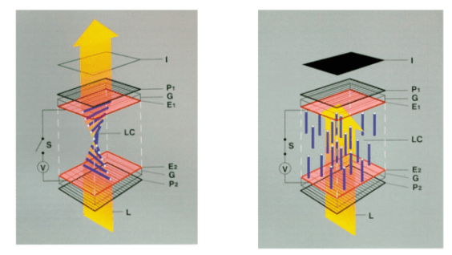

# TFT LCD Basics: Structure, Operation, and Benefits

!!! abstract "Quick answer"
    This guide explains what a TFT LCD is, the relevant design trade-offs, and the points engineers should verify when selecting a display solution.

## Key Takeaways

- Learn what a TFT LCD is, key trade-offs, applications, and engineering selection criteria.
- Use the guidance below to compare the relevant technologies and design trade-offs.
- Validate optical, electrical, mechanical, environmental, and production requirements before final selection.

## TFT LCD

TFT Display Technology: How Does it Work?

<figure markdown="span" class="displaywiki-figure">
  [{ width="760" loading="lazy" }](tft-lcd-basics-tft-display-technology-how-does-it-work.gif){ .displaywiki-image-link title="Open full-size image" }
  <figcaption>TFT Display Technology: How Does it Work?</figcaption>
</figure>

TFT LCD Display (Thin-Film-Transistor Liquid Crystal Display) technology has a sandwich-like structure with liquid crystal material filled between two glass plates. Two polarizer filters, color filters (RGB, red/green/blue) and two alignment layers determine exactly the amount of light is allowed to pass and which colors are created.

Each pixel in an active matrix is paired with a transistor that includes a capacitor which gives each sub-pixel the ability to retain its charge, instead of requiring an electrical charge sent each time it needed to be changed.  The TFT layer controls light flow a color filter displays the color and a top layer houses your visible screen.

See Fig. 1 for TFT LCD structure

<figure markdown="span" class="displaywiki-figure">
  [{ width="760" loading="lazy" }](tft-lcd-basics-see-fig-1-for-tft-lcd-structure.png){ .displaywiki-image-link title="Open full-size image" }
  <figcaption>See Fig. 1 for TFT LCD structure</figcaption>
</figure>

Utilizing an electrical charge that causes the liquid crystal material to change their molecular structure allowing various wavelengths of backlight to “pass-through”. The active matrix of the TFT display is in constant flux and changes or refreshes rapidly depending upon the incoming signal from the control device.

The pixels of TFT displays are determined by the underlying density (resolution) of the color matrix and TFT layout. The more pixels the higher detail is available. Available screen size, power consumption, resolution, interface (how to connect) define the TFT displays.

The pixels of TFT displays are determined by the underlying density (resolution) of the color matrix and TFT layout. The more pixels the higher detail is available. Available screen size, power consumption, resolution, interface (how to connect) define the TFT displays.

The TFT screen itself can’t emit light like OLED display, it has to be used with a back-light of white bright light to generate the picture. Newer panels utilize LED backlight (light emitting diodes) to generate their light and therefore utilize less power and require less depth by design.

TFT display modules include the TFT display screen, LED backlight, and driving circuitry.

TFT Benefits and Uses

TFT LCDs offer several advantages over other types of displays (CRT, Plasma). It is light, thin, and energy efficient which made mobile phones, laptops, hang-on wall LCD TV, flat computer monitors and other handhold devices possible. TFT LCDs are also relatively inexpensive, which makes it dominant in display world.

When we say type of LCD, we mean two kinds of LCDs: Active TFT color display and Monochrome passive display.  Before TFT display was invented, the world used passive matrix lcd for many years. Passive matrix LCD can only be used for monochrome displays like calculators, watches (not iWatch), thermostats (not Nest), utility meters etc. Thanks to TFT LCD, the world is more colorful.

<figure markdown="span" class="displaywiki-figure">
  [{ width="760" loading="lazy" }](tft-lcd-basics-active-tft-color-display.png){ .displaywiki-image-link title="Open full-size image" }
  <figcaption>Active TFT Color Display</figcaption>
</figure>

Fig. 2 Active TFT Color Display

<figure markdown="span" class="displaywiki-figure">
  [{ width="760" loading="lazy" }](tft-lcd-basics-monochrome-passive-lcd-display.png){ .displaywiki-image-link title="Open full-size image" }
  <figcaption>Monochrome Passive LCD Display</figcaption>
</figure>

Fig. 3 Monochrome Passive LCD Display

Structure of TFT LCD

The TFT LCD is built with three key layers. Two sandwiching layers consist of glass substrates, though one includes TFTs while the other has an RGB, or red green blue, color filter. The layer between the glass layers is a liquid crystal layer.

<figure markdown="span" class="displaywiki-figure">
  [{ width="760" loading="lazy" }](tft-lcd-basics-a-visual-diagram-of-the-different-layers-and-components-used-in-a-tft.png){ .displaywiki-image-link title="Open full-size image" }
  <figcaption>A visual diagram of the different layers and components used in a TFT LCD display</figcaption>
</figure>

Fig. 1: A visual diagram of the different layers and components used in a TFT LCD display.

The TFT glass substrate layer is the deepest or back-most layer of a device’s circuit board. It is made of amorphous silicon, a type of silicon with a non-crystalline structure. This silicon is then deposited on the actual glass substrate. The TFTs in this layer are paired individually to each sub-pixel (refer to Architecture of a TFT Pixel below) from the other substrate layer of the device and control the amount of voltage applied to their respective sub-pixels. This layer also has pixel electrodes between the substrate and the liquid crystal layer. Electrodes are conductors that channel electricity into or out of something, in this case, pixels.

On the surface level is the other glass substrate. Just beneath this glass substrate is where the actual pixels and sub-pixels reside, forming the RGB color filter. In order to counteract the electrodes of the previously mentioned layer, this surface layer has counter (or common) electrodes on the side closer to the liquid crystals that close off the circuit that travels between the two layers. In both these substrate layers, the electrodes are most frequently made of indium tin oxide (ITO) because they allow for transparency and have good conductive properties.

The outer sides of the glass substrates (closest to the surface or closest to the back) have filter layers called polarizers. These filters allow only certain beams of light to pass through if they are polarized in a specific manner, meaning that the geometric waves of the light are appropriate for the filter. If not polarized correctly, the light does not pass through the polarizer which creates an opaque LCD screen.

Between the two substrate layers lie liquid crystals. Together, the liquid crystal molecules may behave as a liquid in terms of movement, but it holds its structure as a crystal. There are a variety of chemical formulas available for use in this layer. Typically, liquid crystals are aligned to position the molecules in a certain way to induce specific behaviors of passing light through the polarization of the light waves. To do this, either a magnetic or electric field must be used; however, with displays, for a magnetic field to be usable, it will be too strong for the display itself, and thus electric fields, using very low power and requiring no current, are used.

Before applying an electric field to the crystals between the electrodes, the alignment of the crystals is in a 90 degree twisted pattern, allowing a properly crystal-polarized light to pass through the surface polarizer in a display’s “normal white” mode. This state is caused by electrodes that are purposely coated in a material that orients the structure with this specific twist.

However, when the electric field is applied, the twist is broken as the crystals straighten out, otherwise known as re-aligning. The passing light can still pass through the back polarizer, but because the crystal layer does not polarize the lights to pass through the surface polarizer, light is not transmitted to the surface, thus an opaque display. If the voltage is lessened, only some crystals re-align, allowing for a partial amount of light to pass and creating different shades of grey (levels of light). This effect is called the twisted nematic effect.

<figure markdown="span" class="displaywiki-figure">
  [{ width="760" loading="lazy" }](tft-lcd-basics-tft-lcd-basics-structure-operation-and-benefits-diagram-6.png){ .displaywiki-image-link title="Open full-size image" }
</figure>

Fig. 2: On the left is the twisted liquid crystal layer in which polarized light passes freely; on the right is after the electric field is charged into the layer, completely re-aligning the molecule orientations so that light is not polarized and cannot pass through the surface polarizer.

The twisted nematic effect is one of the cheapest options for LCD technology, and it also allows for fast pixel response time. There are still some limits, though; color reproduction quality may not be great, and viewing angles, or the direction at which the screen is looked at, are more limited.

A solution to these limits was given through in-plane switching (IPS) of the liquid crystals. Rather than aligning the crystals perpendicularly to the electrodes, IPS aligns them in a parallel fashion. Light is then more streamlined within the matrix. There were initial problems like slow response time, but recently, these problems have been mostly resolved, making the benefits of better viewing angles and color reproduction greater than the faults. It is, however, a more costly technology than the twisted nematic devices.

<figure markdown="span" class="displaywiki-figure">
  [{ width="760" loading="lazy" }](tft-lcd-basics-tft-lcd-basics-structure-operation-and-benefits-diagram-7.png){ .displaywiki-image-link title="Open full-size image" }
</figure>

Fig. 3:The top row characterizes the nature of alignment in using IPS as well as the quality of viewing angles. The bottom row displays how the twisted nematic is used to align the crystals and how viewing angles are affected by it.

The light that passes through the device is sourced from the backlight which can shine light from the back or the side of the display. Because the LCD does not produce its own light, it needs to use the backlight in the LCD module. This light source most commonly comes in the form of light-emitting diodes, better known as LEDs. Recently, organic LEDs (OLED) have come into use as well. Typically white, this light, if polarized correctly, will pass through the RGB color filter of the surface substrate layer, displaying the color signaled for by the TFT devic

Architecture of a TFT Pixel

Within an LCD, each pixel can be characterized by its three sub-pixels. These three sub-pixels create the RGB colorization of that overall pixel. These sub-pixels act as capacitors, or electrical storage units within a device, each with their own independent structural and functional layers as described earlier. With the three sub-pixels per pixel, colors of almost any kind can be mixed from the light passing through the filters and polarizer at different brightness based on the liquid crystal alignment.

TFT LCD types

Classify by liquid crystal mode: TN/VA(MVA)/IPS/FFS(AFFS)

Classify by transistor type: a-Si/LTPS/IZGO

Classify by lighting method: Transmissive/Transflective/Reflective

<figure markdown="span" class="displaywiki-figure">
  [{ width="760" loading="lazy" }](tft-lcd-basics-classify-by-lighting-method-transmissive-transflective-reflective.png){ .displaywiki-image-link title="Open full-size image" }
  <figcaption>Classify by lighting method: Transmissive/Transflective/Reflective</figcaption>
</figure>

## Related reading

- [LCD Basics: How Liquid Crystal Displays Work](lcd-basics.md)
- [TFT LCD Module Components and Construction](tft-lcd-module.md)
- [How to Read Display Specifications](display-specifications.md)
