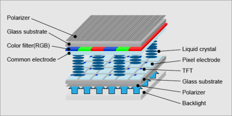
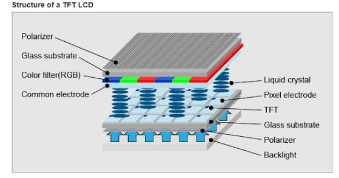
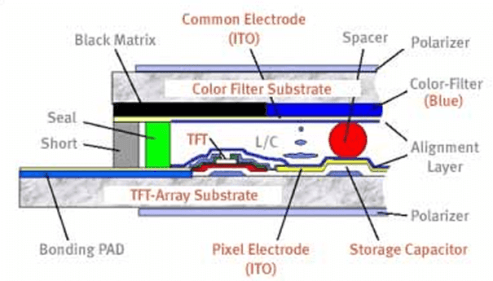
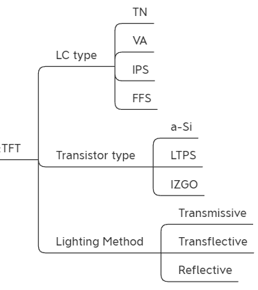

# TFT LCD Basics: Structure, Operation, and Benefits

!!! abstract "Quick answer"
    TFT in TFT LCD means that every subpixel carries its own thin-film transistor switch, which is what separates it from a passive-matrix LCD. That switch, together with a storage capacitor, holds the pixel voltage for the whole frame period, so high resolution, high contrast, and fast response can all be achieved at once. This article breaks down the stacked structure, the pixel architecture, and the classification dimensions of a TFT LCD, and closes with an engineering selection checklist.

## Key Takeaways

- A TFT LCD is an active-matrix liquid-crystal display with a thin-film transistor integrated at every subpixel, holding charge across one frame through the TFT switch plus a storage capacitor.
- Structurally it is a liquid-crystal layer sandwiched between two glass substrates: the TFT array on the lower substrate, RGB color filters on the upper one, and a polarizer on the outer face of each.
- By liquid-crystal mode it splits into TN / VA / IPS / FFS; by transistor material into a-Si / LTPS / IGZO; by lighting method into transmissive / transflective / reflective.
- Before final selection, confirm requirements across five dimensions at once: optical, electrical, mechanical, environmental, and volume production.

## 1. What a TFT LCD Is

A TFT LCD (thin-film transistor liquid-crystal display) is an active-matrix liquid-crystal display with a thin-film transistor switch integrated behind every subpixel.

Liquid crystal does not emit light; it acts as a voltage-controlled light valve. To make every pixel show the correct gray level, the voltage has to be applied precisely across the liquid crystal of that pixel. A passive matrix drives rows and columns of electrodes directly by scanning line by line, so the more pixels there are, the shorter the time each pixel gets and the lower its duty cycle, and the picture dims and smears. An active matrix puts a TFT switch and a storage capacitor next to every subpixel: the voltage is written when the row is scanned, and the capacitor holds it for the rest of the time. That is exactly what lets a TFT LCD deliver high resolution, high contrast, and fast response at the same time.

<figure markdown="span" class="displaywiki-figure">
  [{ width="760" loading="lazy" }](tft-lcd-basics-tft-display-technology-how-does-it-work.gif){ .displaywiki-image-link title="Open full-size image" }
  <figcaption>Stacked structure of a TFT LCD module: from the bottom up, the backlight unit (LED bar, light guide, diffuser, prism sheet, reflector), lower polarizer, TFT array glass substrate, liquid-crystal layer, color-filter glass substrate, upper polarizer, and bezel.</figcaption>
</figure>

## 2. Structure of a TFT LCD

A TFT LCD module is built from more than a dozen stacked layers. At the bottom is the backlight unit that provides the light source; above it come the lower polarizer, the TFT array glass substrate, the liquid-crystal layer, the color-filter glass substrate, and the upper polarizer, and a bezel finally holds the whole stack together.

In cross-section, a single pixel is just a few micrometers of liquid crystal between two glass substrates: the lower substrate carries the TFT and the pixel electrode, the upper one carries the common electrode and the RGB color filter, and a polarizer is laminated to the outer face of each glass.

<figure markdown="span" class="displaywiki-figure">
  [{ width="760" loading="lazy" }](tft-lcd-basics-see-fig-1-for-tft-lcd-structure.png){ .displaywiki-image-link title="Open full-size image" }
  <figcaption>Cross-section of a single TFT LCD pixel: upper and lower polarizers, two glass substrates, RGB color filter, common electrode, liquid-crystal layer, pixel electrode, TFT, and backlight.</figcaption>
</figure>

<figure markdown="span" class="displaywiki-figure">
  [{ width="760" loading="lazy" }](tft-lcd-basics-a-visual-diagram-of-the-different-layers-and-components-used-in-a-tft.png){ .displaywiki-image-link title="Open full-size image" }
  <figcaption>Layer-by-layer view of the components that make up a TFT LCD module.</figcaption>
</figure>

- **Lower glass substrate (TFT array)**: a semiconductor film such as amorphous silicon is deposited on the glass and then patterned into the TFT array. Each TFT serves one subpixel, with the gate on the scan line, the source on the data line, and the drain on the pixel electrode, working as a controlled switch. The pixel electrode and the common electrode above it form a plate capacitor that stores charge across the liquid crystal.
- **Upper glass substrate (color filter)**: the RGB filters and the black matrix are made on this side, with the common electrode (ITO) covering its lower surface. The black matrix separates adjacent subpixels and masks the routing and the TFT, preventing light leakage from pulling contrast down.
- **Liquid-crystal layer**: between the two substrates, with molecules that combine the flow of a liquid with the anisotropy of a crystal. The alignment layers hold the molecules in a defined orientation with no field applied; applying a field makes them turn.
- **Polarizers and backlight**: the transmission axes of the upper and lower polarizers are orthogonal. The liquid crystal rotates the polarization direction and so decides whether light can leave through the upper polarizer; since liquid crystal emits nothing itself, all the brightness the image needs comes from the backlight.
- **ITO transparent electrodes**: the common and pixel electrodes are usually indium tin oxide (ITO), which is both conductive and transparent and is the key to applying a field across the liquid crystal.

## 3. How a TFT Drives a Pixel: the Twisted Nematic Effect

Taking the most common normally-white twisted nematic (TN) mode as an example, the light and dark of one pixel is controlled as follows.

<figure markdown="span" class="displaywiki-figure">
  [{ width="760" loading="lazy" }](tft-lcd-basics-tft-lcd-basics-structure-operation-and-benefits-diagram-6.png){ .displaywiki-image-link title="Open full-size image" }
  <figcaption>Twisted nematic (TN) normally-white mode: with no field applied the liquid crystal is twisted by 90 degrees and polarized light passes through (bright state); with the field applied the molecules stand up along the field and the top polarizer blocks the light (dark state).</figcaption>
</figure>

- **With no field**: the liquid-crystal molecules twist 90° between the upper and lower alignment layers, rotating the linearly polarized light from the lower polarizer by 90° so that it leaves through the upper polarizer, whose transmission axis is orthogonal. The pixel is bright.
- **With a field applied**: the molecules stand up along the field, no longer rotate the polarization, and the light is blocked by the upper polarizer. The pixel turns dark.
- **At an intermediate voltage**: only part of the molecules turn, so transmission changes and different gray levels appear. This mechanism is called the twisted nematic effect.

The price of TN is viewing angle. Once the molecules tilt, contrast and color shift noticeably when the screen is seen from the side. IPS (in-plane switching) changes the electrodes into a comb structure within one plane and makes the liquid crystal rotate in that plane, so the molecular long axis stays roughly parallel to the substrate and viewing-angle and color stability improve markedly.

<figure markdown="span" class="displaywiki-figure">
  [{ width="760" loading="lazy" }](tft-lcd-basics-tft-lcd-basics-structure-operation-and-benefits-diagram-7.png){ .displaywiki-image-link title="Open full-size image" }
  <figcaption>Liquid crystal alignment and viewing angle in IPS versus TN: the top row shows IPS (dark state, bright state, and a photo taken at an angle), the bottom row shows TN, where color and contrast fall off noticeably when viewed off-axis.</figcaption>
</figure>

## 4. Architecture of a TFT Pixel

One color pixel is made of three subpixels, R, G, and B. Each subpixel is an independent set of TFT switch, storage capacitor, pixel electrode, and liquid-crystal cell, so the three can be dimmed separately and mixed in different proportions to produce almost any color.

<figure markdown="span" class="displaywiki-figure">
  [{ width="760" loading="lazy" }](tft-lcd-basics-active-tft-color-display.png){ .displaywiki-image-link title="Open full-size image" }
  <figcaption>Cross-section of an active-matrix pixel: the TFT array substrate integrates the TFT switch, the storage capacitor, and the ITO pixel electrode; above it is the counter substrate with the black matrix and color filter, and spacers hold the cell gap between them.</figcaption>
</figure>

The storage capacitor (Cst) is the key to this architecture. The TFT conducts only for the instant its row is scanned and writes the data-line voltage into the pixel; it then turns off and the pixel and storage capacitors hold that voltage until the next frame, which is what lets the liquid crystal keep the corresponding transmission in between. The larger the storage capacitor, the smaller the voltage drift caused by leakage and the more stable the picture.

Pixel density is set by the density of the TFT array per unit area, and higher density means finer detail. Screen size, resolution, power consumption, and interface specification together define a particular TFT display.

## 5. Passive Matrix versus Active Matrix

Before TFT became widespread, the mainstream was the passive-matrix LCD: the pixel sits at the crossing of a row and a column electrode, and it is lit by scanning line by line and applying voltage for an instant. Each pixel responds only during the short time it is scanned, and relies on the liquid crystal and capacitance for the rest.

<figure markdown="span" class="displaywiki-figure">
  [{ width="760" loading="lazy" }](tft-lcd-basics-monochrome-passive-lcd-display.png){ .displaywiki-image-link title="Open full-size image" }
  <figcaption>Cross-section of a passive-matrix monochrome LCD: the electrode routing acts on the liquid crystal directly, with no separate switching element. The structure is simpler, but it suits only low resolution and monochrome display.</figcaption>
</figure>

That is why a passive matrix suits only monochrome, low-resolution, low-refresh cases such as calculators, watches, thermometers, and utility meters. An active matrix (TFT) adds a switch and a capacitor at every pixel, so the pixel holds its state throughout the frame period, which makes full-color high resolution, high contrast, and fast response possible.

| Dimension | Passive matrix (PM) | Active matrix (TFT / AM) |
|---|---|---|
| Driving | Row and column electrodes scanned line by line and driven directly | One TFT switch plus storage capacitor per pixel |
| Pixel duty cycle | Low, lit only during the scan instant | High, state held for the whole frame |
| Contrast and response | Rather low / rather slow | High / fast |
| Typical resolution | Low, mostly monochrome | High, covering FHD, 4K, and beyond |
| Typical applications | Calculators, watches, instruments | Phones, laptops, monitors, TVs |

## 6. TFT LCD Classification

Two TFT LCDs can differ enormously in performance, because three classification dimensions combine independently.

<figure markdown="span" class="displaywiki-figure">
  [{ width="760" loading="lazy" }](tft-lcd-basics-classify-by-lighting-method-transmissive-transflective-reflective.png){ .displaywiki-image-link title="Open full-size image" }
  <figcaption>The three classification dimensions of a TFT display: liquid-crystal mode (TN / VA / IPS / FFS), transistor type (a-Si / LTPS / IGZO), and lighting method (transmissive / transflective / reflective).</figcaption>
</figure>

| Dimension | Values | Main impact |
|---|---|---|
| Liquid-crystal mode | TN, VA (MVA / PVA), IPS, FFS (AFFS) | Viewing angle, contrast, and color |
| Transistor material | a-Si, LTPS, IGZO | Electron mobility, power, achievable pixel density and refresh rate |
| Lighting method | Transmissive, transflective, reflective | Readability in strong light and the power trade-off |

Lighting method decides outdoor readability directly. A transmissive panel depends entirely on its backlight and performs well indoors but becomes hard to read in strong light; a reflective panel forms the image from ambient light and needs no backlight, but cannot be read in the dark; a transflective panel sits between the two and copes with both environments.

## 7. Benefits and Limitations

**Benefits**

- Thin, light, and low power: it replaced CRT and plasma displays and made phones, laptops, wall-mounted TVs, and handheld devices possible.
- The active matrix brings high resolution and high contrast together with reasonably fast pixel response.
- The supply chain is mature and cost is controllable, and there is no OLED burn-in, so lifetime behavior is stable.

**Limitations**

- Liquid crystal does not emit light, so brightness depends on the backlight; black is produced by blocking rather than by switching off, so contrast still trails OLED.
- Response speed is limited by the viscosity of the liquid crystal and slows markedly at low temperature.
- TN mode has a restricted viewing angle, with contrast and color falling off quickly off-axis.
- The effective contrast depends on light leakage, black-matrix precision, and backlight uniformity, all of which must be confirmed item by item during selection.

## 8. Selection Checklist

- **Fix the liquid-crystal mode first**: for wide viewing angle and accurate color, favor IPS / FFS; for high contrast at low cost, TN; for large size with strong static image quality and black level, VA.
- **Then look at transistor material**: for high pixel density, high refresh, and low power, favor LTPS / IGZO; for cost-sensitive mainstream sizes, a-Si.
- **Choose the lighting method explicitly**: transmissive for mainly indoor use; transflective or reflective for strong outdoor light.
- **Check all five requirement groups**: optical (brightness, contrast, color gamut), electrical (driver IC, interface, power), mechanical (size, thickness, FPC, cover lens), environmental (temperature range, vibration, anti-glare), and volume production (supply, consistency, certification).

## 9. Frequently Asked Questions

??? question "Q1: What is the relationship between TFT and LCD?"
    LCD is the general name for liquid-crystal displays, the family of technologies that use liquid crystal as a light valve; TFT is one way of driving them. One with a TFT switch is called an active-matrix LCD (that is, a TFT LCD), and one without a switch, driven directly by row and column electrodes, is a passive-matrix LCD. The everyday term TFT screen emphasizes that it uses active-matrix driving.

??? question "Q2: What is the difference between a TFT LCD and OLED?"
    A TFT LCD forms its image with a backlight plus a liquid-crystal light valve, whereas OLED lets every pixel emit its own light. LCD lasts longer, costs less, scales to large sizes more easily, and has no burn-in; OLED offers higher contrast, a wider viewing angle, and flexible form factors. In industrial use, where a fixed image is displayed for long periods, LCD is usually preferred, and OLED is considered only when extreme black level or a flexible form is required.

??? question "Q3: How do I choose between a-Si, LTPS, and IGZO transistor materials?"
    a-Si (amorphous silicon) has a mature process and the lowest cost, and suits mainstream sizes and resolutions; LTPS (low-temperature poly-silicon) has the highest electron mobility, supports high pixel density and high refresh rate, and is common in phones and small high-resolution screens; IGZO (indium gallium zinc oxide) sits between the two, with low leakage that suits low-refresh power-saving designs. Combine the target PPI, refresh rate, and power budget when deciding.

??? question "Q4: Why must a TFT LCD have a backlight?"
    Liquid crystal only changes the polarization state of light and emits nothing itself. A transmissive TFT LCD must be lit by a backlight to be readable in a dark environment; a reflective type forms the image from ambient light and needs no backlight, but cannot be read in the dark. This is also the fundamental reason why the same panel behaves so differently under different lighting.

??? question "Q5: Why does IPS have a better viewing angle than TN?"
    In TN mode the liquid-crystal molecules tilt in the field, so the amount of polarization rotation changes when the screen is seen from the side, and contrast and color shift with it. IPS uses a comb electrode structure in a single plane and makes the liquid crystal rotate within that plane, so the molecular long axis stays roughly parallel to the substrate. Polarization rotation is then more consistent across angles, which gives a wider viewing angle and more stable color.

??? question "Q6: What affects the response speed of a TFT LCD?"
    Mainly the viscosity of the liquid-crystal material and the cell gap. As temperature falls, viscosity rises and the molecules turn more slowly, so response time lengthens and smearing appears at low temperature. For the low-temperature response of a particular part number, check the response-time curve in its datasheet, and compensate with a heater film where necessary.

## Related reading

- [LCD Basics: How Liquid Crystal Displays Work](lcd-basics.md)
- [TFT LCD Module Components and Construction](tft-lcd-module.md)
- [How to Read Display Specifications](display-specifications.md)

!!! info "Can't find what you need?"
    If you need more products, resources or support, please contact our team:

    [**:material-archive-arrow-down: Knowledge Base**](../../knowledge/tags.md){ .md-button .md-button--primary }
    [**:material-magnify: Products & Solutions**](https://viewedisplay.com/){ .md-button }
    [**:material-email: Contact Support**](mailto:support@viewedisplay.com){ .md-button }
