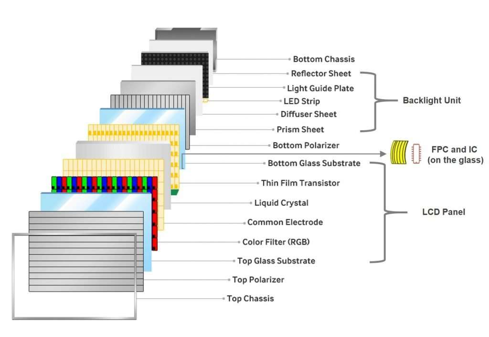
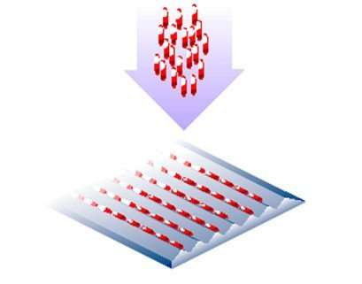
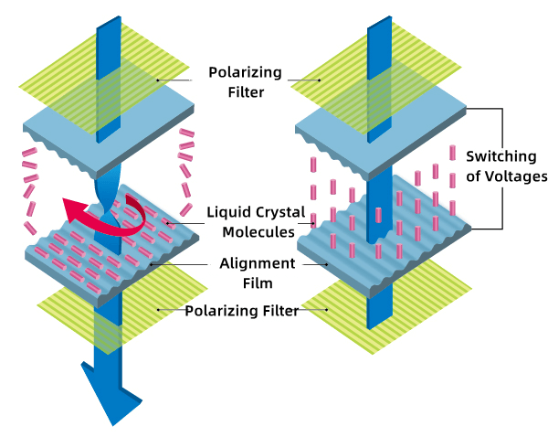
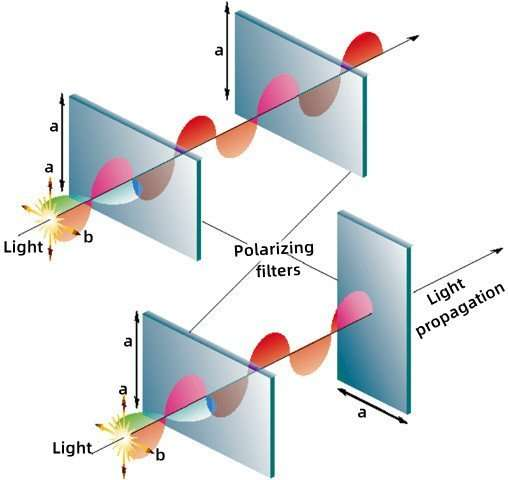
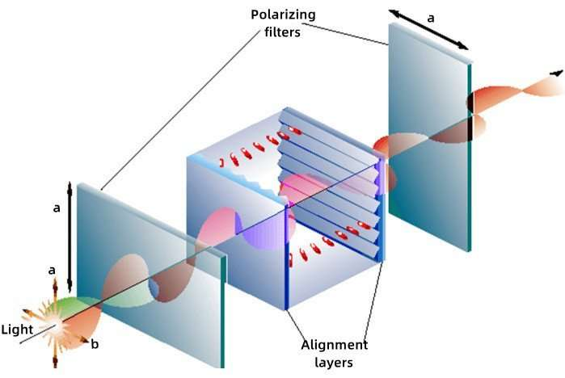
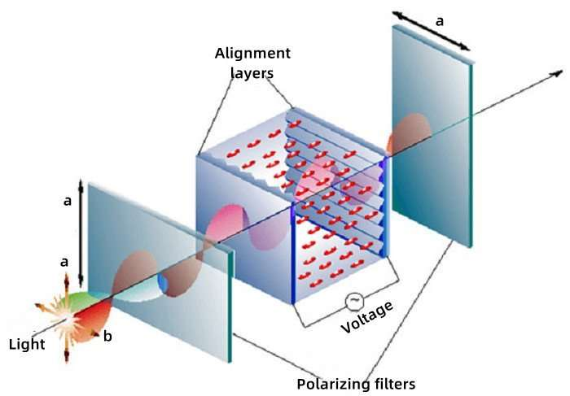
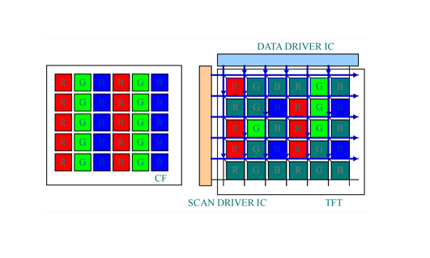

# TFT LCD Module Components and Construction

!!! abstract "Quick answer"
    A TFT LCD module combines the image-forming panel with optical, electrical, mechanical, and sometimes touch components. Module compatibility depends on the entire assembly rather than resolution and size alone.

## Key Takeaways

- Confirm active area, outline, viewing direction, interface, timing, voltage, backlight, connector, and mounting dimensions.
- Treat touch, cover lens, bonding, frame, FPC, driver IC, and initialization code as module-level dependencies.
- Review environmental ratings, optical specifications, lifetime, tolerances, and supply status for the exact part number.

## TFT LCD Module Architecture

TFT LCM(LCD module) Structure:

LCM is mainly composed of 5 units:

BLU（Backlight Unit)

POL (Polarizer)

LCD (Liquid Crystal Display) Panel

IC（Integrated Circuit)

FPC (Flexible Printed Circuit)

The below figure is the structure diagram of the TFT-LCD Module. We will briefly introduce the main functions of each on display.

<figure markdown="span" class="displaywiki-figure">
  [{ width="760" loading="lazy" }](tft-lcd-module-the-structure-of-tft-lcd-module.jpeg){ .displaywiki-image-link title="Open full-size image" }
  <figcaption>The structure of TFT-LCD module</figcaption>
</figure>

BLU（Backlight Unit）

The backlight unit is one of the key components of the LCD. It consists of multiple layers of optical sheets and the light source.

The role of the backlight unit is to supply sufficient brightness and evenly distribute the light source to the LCD panel given the liquid crystal molecules cannot emit light themselves.

Normally, the light source is the LED strips, so it is also called LED-Backlit.

The quality of the backlight determines some important features of the display, such as the brightness, uniformity of the outgoing light, and color level of the LCD screen. In general, the BLU largely determines the luminous effect of the LCD screen.

POL (Polarizer)

A polarizer is to convert natural light without polarization into polarized light and control which light patterns can pass through the LCD panel.

Without these filters, visual images generated by the LCD panel have poor performance in contrast ratio.

IC (Integrated circuit)

An integrated circuit (IC) is a chip device that consists of a set of integrated circuits.

It is used to adjust and control the phase, peak value, frequency, and other parameters of Potentiometric signals on the transparent electrode, to establish the driving electric field, and finally realize the information displayed on the screen.

FPC (Flexible Printed Circuit Board)

FPC is the abbreviation of a flexible printed circuit board.

By connecting the LCD panel, FPC can realize the working principle of the circuit, and output the interface that the motherboard needs to match, so that the LCD can work from an electrical point of view.

LCD (Liquid crystal display) panel / Cell layer

The cell layer is a packaging of liquid crystals embedded between two glass substrates, a top glass substrate with the color filter (CF) and a down glass substrate with the Thin Film Transistor array (TFT-Array).

It is also called the LCD panel and is an essential unit of the color display.

On the TFT substrate, it can control the pixel voltage on this side precisely.  And it is the pixel voltage applied to the liquid crystal that controls the twist of the liquid crystal.

On the CF substrate, a pixel is divided into three sub-pixels: red (R), green (G), and blue (B).

The liquid crystal (LC) that acts as a light valve adjusts the amount of light of the three primary colors of RGB passing through the CF substrate, and the desired color display can be obtained.

To create an image, all the above layers should collaborate like an orchestra.

Working of the LCD

LCD is a product of optoelectronics.

We can get a general understanding of how LCD works from both optical and electrical perspectives.

Optoelectronic working principle of the LCD

Optical perspective

Light can be divided into different polarization directions.

Lights with different polarization directions pass through the liquid crystal, and there will be different optical paths.

After the light is recombined through this optical path difference, it will change the form of its polarization.

With the polarizer blocking the light in a certain polarization direction, the transmittance of the light can be determined.

Electrical perspective

Under different voltages, the liquid crystal will have different arrangements.

Different liquid crystal arrangements cause different optical path differences, thus making the transmittance change.

So that the video signal (electricity) can be converted into a bright and dark display (light)

Working Process of the LCD

Underneath, let’s see how each layer collaborates inside to make the color display.

Liquid crystal molecules

(1) The liquid crystal used in TFT-LCD is TN (Twist Nematic) type liquid crystal.

(2) The liquid crystal molecules are elliptical; TN-type liquid crystals are generally connected in series along the long axis direction, and the long axes are arranged in parallel to each other.

<figure markdown="span" class="displaywiki-figure">
  [{ width="760" loading="lazy" }](tft-lcd-module-the-liquid-crystal-molecules.jpeg){ .displaywiki-image-link title="Open full-size image" }
  <figcaption>The liquid crystal molecules</figcaption>
</figure>

(3) When touching the grooved surface, the liquid crystal molecules line up parallelly along the grooves.

<figure markdown="span" class="displaywiki-figure">
  [{ width="760" loading="lazy" }](tft-lcd-module-molecules-on-the-lower-surface-along-the-b-direction.jpeg){ .displaywiki-image-link title="Open full-size image" }
  <figcaption>Molecules on the lower surface: along the ‘b’ direction</figcaption>
</figure>

(4) When the liquid crystal is contained in the middle of the two grooved surfaces, and the groove directions are perpendicular to each other, the arrangement of the liquid crystal molecules will be:

Molecules on the lower surface: along the ‘b’  direction

Molecules on the upper surface: along the ‘a’ direction

Molecules in between: the effect of rotation is generated, so the liquid crystal molecules are rotated by 90° between the two grooved surfaces.

<figure markdown="span" class="displaywiki-figure">
  [{ width="760" loading="lazy" }](tft-lcd-module-effects-of-light-and-liquid-crystal-molecules.png){ .displaywiki-image-link title="Open full-size image" }
  <figcaption>Effects of light and liquid crystal molecules</figcaption>
</figure>

(1) When the linearly polarized light enters the upper grooved surface, the light also rotates along with the rotation of the liquid crystal molecules, so that the light can pass through.

(2) When linearly polarized light exits the underlying grooved surface, the light has already rotated 90°.

<figure markdown="span" class="displaywiki-figure">
  [{ width="760" loading="lazy" }](tft-lcd-module-working-of-polarizer.png){ .displaywiki-image-link title="Open full-size image" }
  <figcaption>Working of Polarizer</figcaption>
</figure>

(1) Filter unpolarized light (general light) into linearly polarized light;

(2) When the non-polarized light passes through the ‘a’ direction polarizer, the light is filtered into linearly polarized light parallel to the ‘a’ direction;

(3) The linear polarized light continues to move forward, and

if it passes through the polarizer in the same direction (a), the light passes through;

if the light passes through the polarizer in the b direction, the light is completely blocked.

<figure markdown="span" class="displaywiki-figure">
  [{ width="760" loading="lazy" }](tft-lcd-module-optical-effect-in-the-combination-of-polarizers-grooved-surfaces-and-l.jpeg){ .displaywiki-image-link title="Open full-size image" }
  <figcaption>Optical effect in the combination of polarizers, grooved surfaces, and liquid crystal</figcaption>
</figure>

When the upper and lower polarizers are perpendicular to each other：

(1) if power voltage is not applied, the light can pass through;

<figure markdown="span" class="displaywiki-figure">
  [{ width="760" loading="lazy" }](tft-lcd-module-1-if-power-voltage-is-not-applied-the-light-can-pass-through.jpeg){ .displaywiki-image-link title="Open full-size image" }
  <figcaption>(1) if power voltage is not applied, the light can pass through;</figcaption>
</figure>

(2) if power voltage is applied, the light is completely blocked. Because the liquid crystal molecules straighten out of their helix pattern and stop redirecting the angle of the light, thereby the light can not pass through the lower filter.

<figure markdown="span" class="displaywiki-figure">
  [{ width="760" loading="lazy" }](tft-lcd-module-creating-images-through-tft-lcd.jpeg){ .displaywiki-image-link title="Open full-size image" }
  <figcaption>Creating images through TFT-LCD</figcaption>
</figure>

(1) Scan driver IC (also known as Gate driver IC) transmits scan signals and completes image signal input;

(2) Data driver IC (also known as Source driver IC) transmits imaging control signals and controls TFT switches:

if a sub-pixel is turned on, the sub-pixel appears black because it cannot transmit light.

if the sub-pixel is turned off, the color is displayed because the light passes through the color filter (CF).

(3) After passing through the CF, red, green, and blue light is generated, and finally passes through the upper polarizer.

(4)  With the synthesis effect of light, different colors are formed and displayed.

<figure markdown="span" class="displaywiki-figure">
  [{ width="760" loading="lazy" }](tft-lcd-module-now-we-have-finished-our-journey-on-how-an-lcd-works-and-how-the-displ.png){ .displaywiki-image-link title="Open full-size image" }
  <figcaption>Now, we have finished our journey on how an LCD works and how the display creates a color image</figcaption>
</figure>

<figure markdown="span" class="displaywiki-figure">
  [{ width="760" loading="lazy" }](tft-lcd-module-now-we-have-finished-our-journey-on-how-an-lcd-works-and-how-the-displ-2.png){ .displaywiki-image-link title="Open full-size image" }
  <figcaption>Now, we have finished our journey on how an LCD works and how the display creates a color image</figcaption>
</figure>

<figure markdown="span" class="displaywiki-figure">
  [{ width="760" loading="lazy" }](tft-lcd-module-how-does-lcd-work-to-create-a-color-image.gif){ .displaywiki-image-link title="Open full-size image" }
  <figcaption>how does LCD work to create a color image</figcaption>
</figure>

## Related reading

- [LCD Basics: How Liquid Crystal Displays Work](lcd-basics.md)
- [TFT LCD Basics: Structure, Operation, and Benefits](tft-lcd-basics.md)
- [How to Read Display Specifications](display-specifications.md)

## Frequently Asked Questions

??? question "What is normally included in a TFT LCD module?"
    At minimum it includes the LCD panel and electrical connection; many modules also include drivers, a backlight, frame, PCB, touch panel, or cover lens.

??? question "Can two displays with the same size and resolution be interchangeable?"
    Not necessarily. Outline, active area, interface, timing, voltage, initialization, connector, backlight, viewing direction, and touch construction may differ.

??? question "Why is the initialization sequence important?"
    The controller registers configure timing, pixel format, orientation, power, gamma, and other behavior required for the panel to operate correctly.

??? question "What information is needed to replace a discontinued module?"
    Compare active area, outline, interface, timing, voltage, initialization, optical values, backlight, connector, mounting, touch stack, environment, and qualification status.

??? question "Can the backlight be driven directly from a logic supply?"
    Usually a dedicated current-controlled LED driver is required. Use the backlight voltage, current, string arrangement, dimming, and protection specifications.

!!! info "Can't find what you need?"
    If you need more products, resources or support, please contact our team:

    [**:material-archive-arrow-down: Knowledge Base**](../../knowledge/tags.md){ .md-button .md-button--primary }
    [**:material-magnify: Products & Solutions**](https://viewedisplay.com/){ .md-button }
    [**:material-email: Contact Support**](mailto:support@viewedisplay.com){ .md-button }
